英文转帖
部分 [图片来源](http://billypetersen.com/) 见水印

<!--truncate-->
2021 – The Old Country by Tracy Letts : Ted, Steppenwolf, Chicago (Virtual Series)

2020 – The American Clock by Arthur Miller : Dugan, Steppenwolf, Chicago (Radio Play)

2017 – The Minutes by Tracy Letts : Mayor Superba. Steppenwolf, Chicago

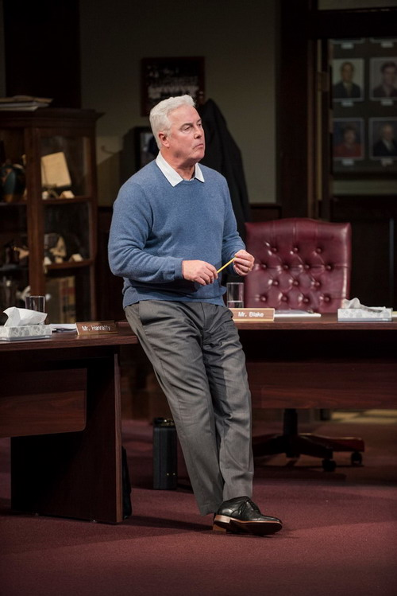

2014 – Slowgirl by Greg Pierce : Sterling. Geffen Playhouse, Los Angeles

2013 – Slowgirl by Greg Pierce : Sterling. Steppenwolf, Chicago

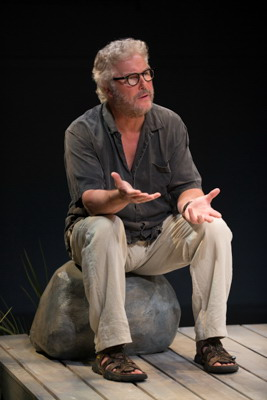

2010 – Endgame by Samuel Beckett : Hamm. Steppenwolf, Chicago

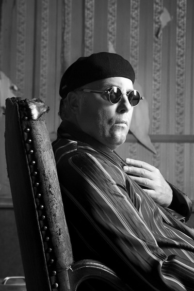

2009 – Blackbird by David Harrower : Ray. Victory Gardens, Chicago  - 听了一下介绍，还是部挺人伦道德的作品

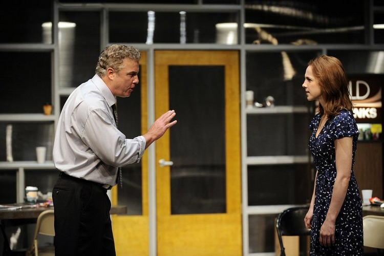

2008 – A Dublin Carol by Conor Mcpherson : John Plunkett. Steppenwolf, Chicago

2006 – A Dublin Carol by Conor Mcpherson : John Plunkett.   Trinity Rep, Providence

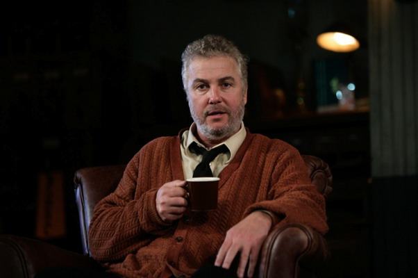

1998 – Flyovers by Jeffery Sweet. Ted. Victory Gardens Theater, Chicago

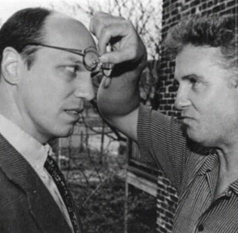

1996 – The Night of the Iguana by Tennessee Williams. Reverend T. Shannon. Roundabout Theater, NY

1993 – The Night of the Iguana by Tennessee Williams. Reverend Shannon. Goodman Theater, Chicago

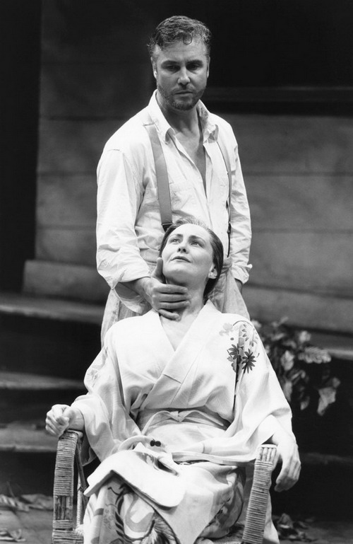

1992 – Once in Doubt by Raymond J Barry. Remains Theater

1992 – The Chicago Conspiracy Trial. Remains Theater

1992 – The Actor Retires, Remains Theater

1991 – American Buffalo by David Mamet. Teach. Remains

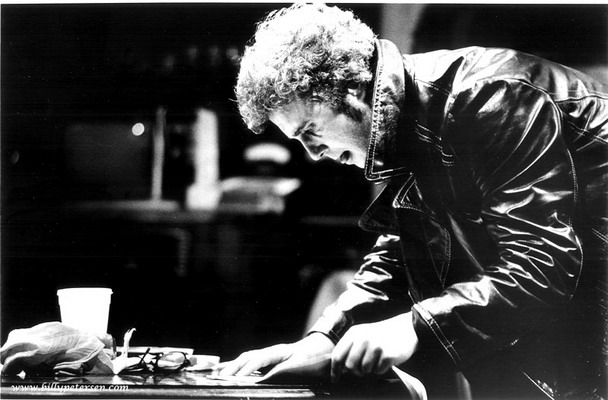

1989 – Speed the Plow by David Mamet. Bobby Gould. Wisdom Bridge Theater & the Kennedy Center in D.C

1987 – Big Time by Keith Reddin. Remains Theater

1986 – Days and Nights Within . Organic Theater

1986 – Puntila and His Hired Man Matti by Bertold Brecht, Organic Theater

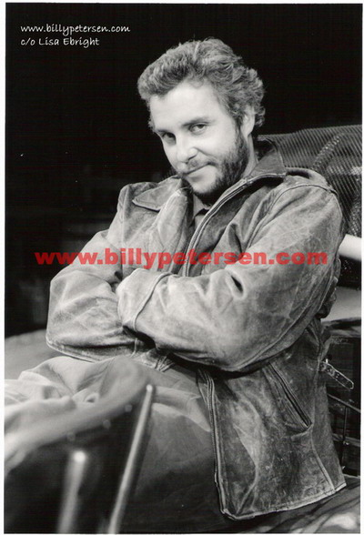

1984 – A Streetcar Named Desire by Tennessee Williams. Stanley Kowalski. Stratford

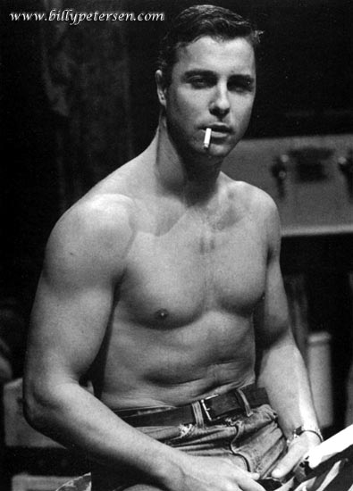

1984 – Fool for Love by Sam Shepard. Eddie. Steppenwolf

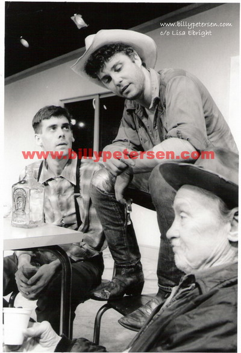

1984 – Gardenia by Dan Grady. Goodman Theater

1984 – The Time of Your Life by William Saroyan. Joe. Goodman Theater

1984 – Glengarry Glen Ross by David Mamet. James Lingk. Goodman Theater. This was the American Premiere

1983 – The Belly of the Beast. Jack Henry Abbott. Wisdom Bridge Theater. Joseph Jefferson Award Best Actor

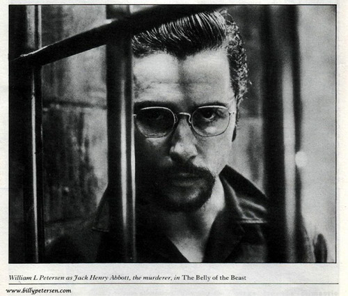

1983 – A Class "C" Trial in Yokahama. Chicago Theater Project with Remains Theater

1982 – Tooth of Crime by Sam Shepard. Hoss. Remains. Joseph Jefferson Award nominee

1982 – Moby Dick. Ahab. Remains Theater

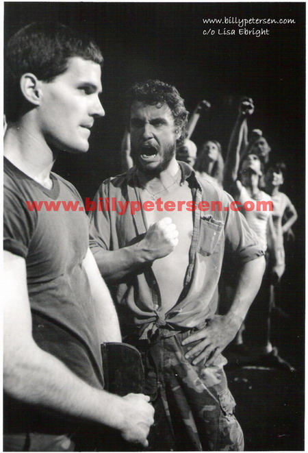

1981 – Woyzeck. Remains Theater

1981 – Indulgences in a Louisville Harem by John Orlock

1981 – Sixty Six Scenes of Halloween. Remains Theater

1980 – Waiting for Godot by Samuel Beckett. Remains Theater

1980 – Balm in Gilead by Lanford Wilson. Joe Conroy. Remains at Steppenwolf

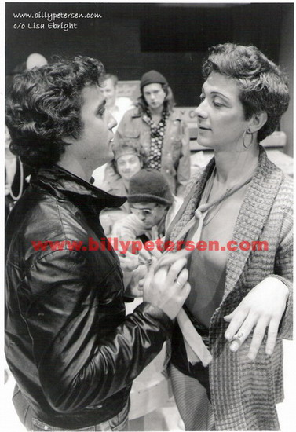

1978 – Dillinger, Victory Gardens Theater. His first Actor’s Equity production

1978 – Towards the Morning, Victory Gardens Theater

1978 – Domino Courts, Victory Gardens Theater

1977 – Canticle of the Son (or Sun ?). Wisdom Bridge Theater

Darkness at Noon, Jewish Community Theater (First play in Chicago)

He also directed Farmyard (1982) and Traps (1983) at Remains as well.

- See more at: https://billypetersen.com/career/theater-productions/
