若干年前从网上找到的英文资料...作者没记住；做了一点补充，部分 [图片来源](http://billypetersen.com/) 见水印

### William Petersen个人情报
```
Full name : William Louis Petersen
Birthdate: 1953.02.21
Height: 5'11"
```

**多图杀猫**

<!--truncate-->

### 正文

-  CSI (TV show)
    - Character: Gil Grissom
    - 第一季 1x01 ~ 第九季 9x10，第十一季客串 11x13 (2000-2009，2011)
    - CSI-The Series Finale (2015)
    - CSI Vegas (2021)
    - 人人应该有资源，大概

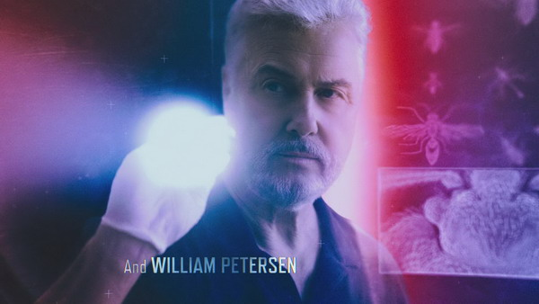 

*************

-  Thief (1981)
    - Character: The Bartender
    - Very, very brief appearance as a bartender in one scene of the movie staringJames Caan.
    - Recommended only for die hard WP fans.
    - FYI: This movie was directed by Michael Mann who later directed WP in MANHUNTER.
    - 就一个镜头...之前在B站看了一眼...
    - 为什么看起来比后来85年的片子老那么多呢...果然胡子决定一切吗

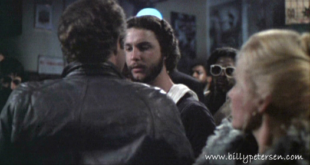 

*************

-  Twilight Zone, The (1985) (Need To Know)
    - Character: Edward Sayers
    - This isn't the old B&W Twilight Zone and it's not the new one that's running on UPN. This is The Twilight Zone that came out in the 80's and ran for a short time. The episode was titled "Need To Know" and was one of two stories on the half hour show.
    - Recommended viewing.
    - 貌似「Twilight Zone」是美国一部历史挺悠久的科幻片？灵异片？系列，前后拍过好几遍，他在1985年版演过一集
    - 是非常可爱的小鲜肉！被吓坏了的那种~
    - 以前油管上有来着，大概

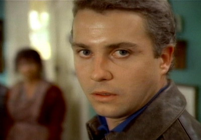 

*************

-  To Live And Die In LA (1985）
    - Character: Richard Chance
    - Very violent film, but worth watching. Buy and keep.
    - FYI: The director, William Friedkin, also directed WP in 12 ANGRY MEN
    - This movie is long out of print, but can be found on video. It was releasedon by two different companies. One version was taped at EP speed and theotheras SP speed. Most copies of either are usually worn and grainy. There'stalk that this may be put on DVD sometime in the future. Here's hoping.
    - 最重要的一点是，有！裸！戏！外粉还给镜头截图调成了高清...
    - 貌似导演很有名，近年还拍了纪录片，里面当然有采访到William Petersen，他应该也是从这会儿开始火的，之前大概都在剧场
    - 根据William Petersen的 [HALF HOURd采访](https://www.steppenwolf.org/tickets--events/half-hour-theatre-podcast/?fbclid=IwAR37fG6yNBhWEAmOJLkX1LdAwbipWEHuHEv2ywgMC4tPfQQT7zm_YEBK3kM) "SEASON 1 - Ep4"，说他被邀请到导演家里念了一段台词，然后就被录用了~

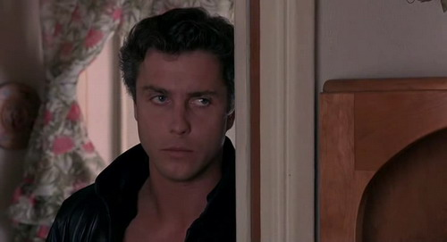 

*************

-  Manhunter (1986)
    - Character: Will Graham
    - This is the best Hannibal Lector movie. I really like Anthony Hopkins, but MANHUNTER is my favorite.
    - Recommended WP viewing. Definite buy and keep.
    - Available on video and DVD. I would recommend buying the double DVD which contains both the theatrical release and the director's cut. Although the quality of the director's cut isn't that great, it does have the missing scenes replaced in it.
    - FYI: The wife in the third family is the same woman who plays Franny in KISS THE SKY. This third family is seen only in the home movies in the theatrical release, but are in one of the missing scenes that have been replaced in the director's cut.
    - 应该很有名，CSI第一季的时候DVD还宣传了一波儿（故事本身好像也很出名，红龙前传的样子，就是和汉尼拔有一点关系）
    - 国内网站有资源，大概

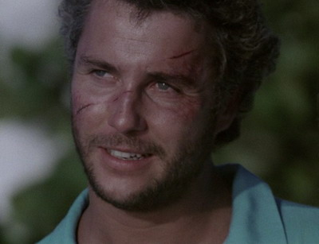

 *************

-  Amazing Grace And Chuck (1987)
    - Character: Russell
    - This movie is also know as THE SILENT VOICE overseas.
    - He plays the father of a boy who gives up playing baseball in order to protest nuclear weapons.
    - It's a feel good family movie I would recommend watching.
    - 油管上有宣传片...

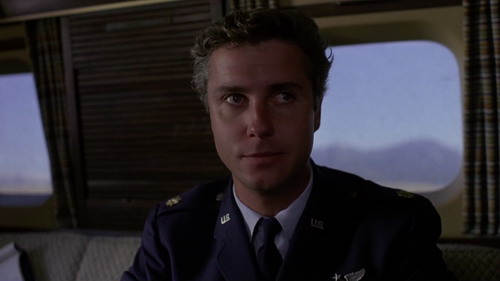

 *************

-  Long Gone (1987) (TV movie)
    - Character: Cecil "Stud" Cantrell
    - OMG! One of the beset WP characters.
    - Must see WP viewing. Definite buy and keep.
    - If you liked BULL DURHAM then you'll LOVE this one. LONG GONE is way better than BULL DURHAM.
    - 和棒球有关的故事
    - 以前油管上有来着，大概

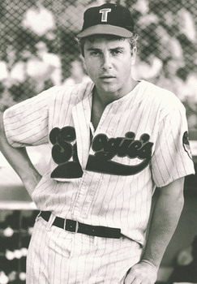

 *************

-  Cousins (1989)
    - Character: Tom Hardy
    - You feel sorry for this character, but WP never looker finer in this movie.
    - Recommended WP viewing. Buy and keep.
    - 总体来说是演了个渣男了...
    - 看到年轻的Ted Danson（CSI里面的D.B.Russell），也是主演
    - 从日亚上买到了DVD（以前网上有付费观看的版本，但是链接失效了...

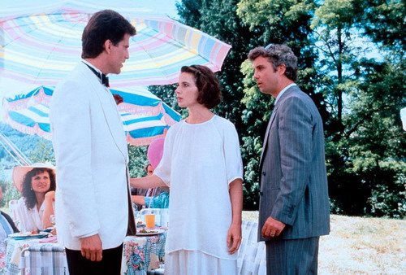

 *************

-  Young Guns II (1990)
    - Character: Pat Garrett
    - More chaps, more horses, WP, Keifer and Viggo. What more could a girl ask for?
    - If you like westerns, you'll ove this one. If you love WP movies, you'll love this one. This is one sequel that I enjoyed more than the original.
    - Recommended WP viewing. Buy and keep.
    - This has got a great soundtrack by Bon Jovi.
    - 西部片，胡子造型不一样，整个人就好像不一样了...
    - 以前油管上有来着，大概

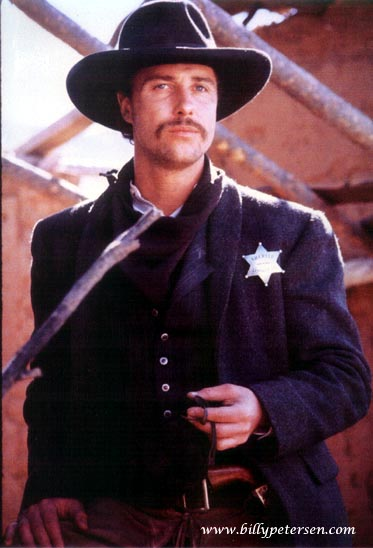

 *************

-  The Kennedys Of Massachusetts (1990) (TV mini series)
    - Character: Joe Kennedy, Sr.
    - He played Jack Kennedy in THE RAT PACK, now he's playing his father Joe. This is a really different look for WP. He actually had his head shaved to get the "Joe Kennedy look" for this mini series. He plays Joe from his college days and courtship of Rose through to Jack's inaugration as President.
    - Recommended WP viewing. Buy and keep.
    - This is available in limited supply on video. It is no longer being printed. You can sometimes find it on Ebay. It's a 3 tape set.
    - 看起来感觉非、常、不一样...
    - 以前油管上有来着，大概

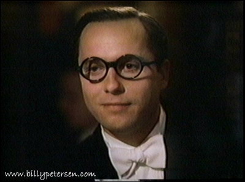
  
 *************

-  Hard Promises (1991)
    - Character: Joey
    - Joey is such a jerk, but you can't help but love him. He's one of my favorites.
    - Must see WP movie. Definite buy and keep
    - FYI: The teacher Joey runs into in the hallway is the same woman who played Lureen in KEEP THE CHANGE
    - 总体来说是演了个浪子？但重点是，他、又、脱、了！
    - 从日亚上买到了DVD    

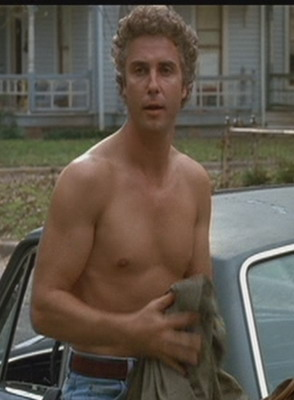

 *************

-  Keep The Change (1992) (TV movie)  -- 没看过，只有录像带卖...放弃
    - Character: Joe Starling a modern day cowboy
    - Another favorite of mine
    - Must see WP movie. Definite buy and keep.
    - WP is producer on this one
    - 油管上有宣传片

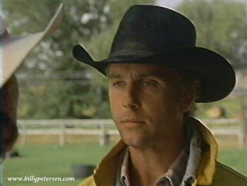

 *************

-  Passed Away (1992)
    - Character: Frank Scanlon
    - WP plays the obtuse, younger brother to Bob Hoskins
    - This is a fun movie to watch. Recomended WP viewing.
    - FYI: The lawyer who is taking charge of the union in this movie also played the priest in the FRIENDS AND LOVERS episode of CSI
    - 算是喜剧吗？
    - 从日亚上买到了DVD

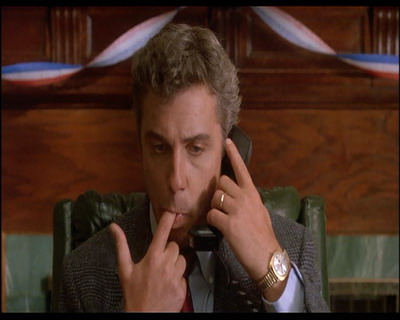

 *************

-  Curacao (1993) (TV movie) (aka Deadly Currents)
    - Character - Stephen Guerin
    - Another favorite character
    - Another BB movie
    - Another must see WP movie. Buy and keep.
    - FYI: WP stars with George C. Scott in ths movie and also in 12 ANGRY MEN
    - 好像演了一个CIA？总之重点是，脱、了！
    - 从日亚上买到了DVD

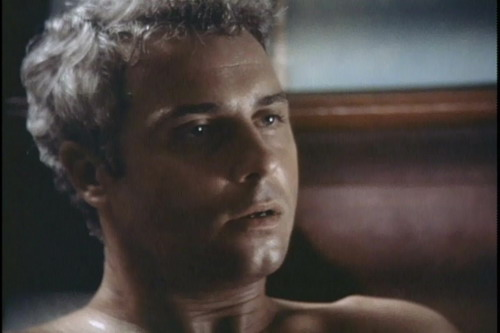

 *************

-  Fallen Angels (1993) (TV series) ("Good Housekeeping")
    - If I'm not mistaken, this was a Showtime series.
    - WP in episode "Good Housekeeping."
    - FYI: Marg Helgenberger and Paul Guilfoyle were also in various episodes of this series
    - 这部怎么说呢，把盲人演的很帅气~角色貌似反派
    - 以前油管上有来着，大概

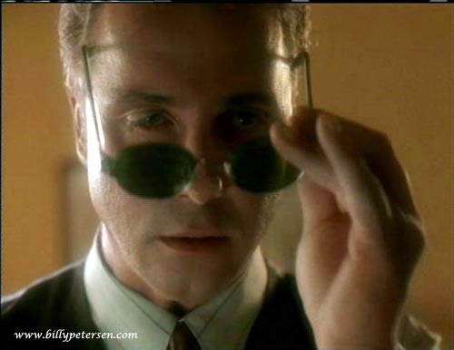

 *************

-  Return To Lonesome Dove (1993) (TV mini series)
    - Character: Texas Ranger Gideon Walker
    - My favorite of all WP's roles
    - Another must see WP movie. Buy and keep.
    - I didn't think that this was a good as the original LONESOME DOVE, but I loved it more than the first one
    - FYI: Re-teamed with Barbara Hershey from THE STAIRCASE
    - WP with a beard, chaps and riding a horse -- what more can I say.
    - 很长的西部片~很多胡子
    - 从日亚上买到了DVD

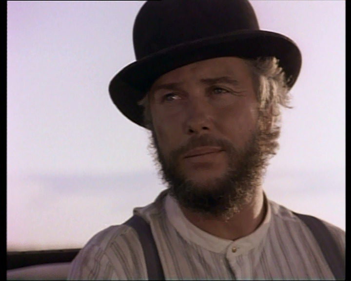

 ************* 

-  In The Kingdom Of The Blind (1995)
    - Character: Tony C.
    - WP has a minor role in this movie about good cops, bad cops and the mob. 
    - I would recommend this to only the true die-hard WP fan -- otherwise, you're going to be disappointed.
    - 角色很小，但有一段5分钟的个人秀...骂人骂了4分多钟~这大段的独白，太帅；当然，我没看懂（以前油管上有这个片段
    - 从日亚上买到了DVD

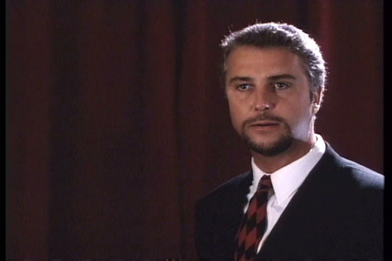

 *************

-  Present Tense, Past Perfect 1995 (TV movie) -- 没看过，找不到
    - Character: Jack
    - I think this was originally a Showtime movie. It starred WP and Anne Archer.

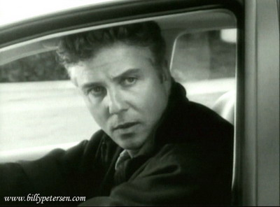

 *************
-  Fear (1996)
    - Character:  Steve Walker
    - This is a fun movie to watch just to see WP beat up on psycho Mark Wahlburg. 
    - Recommended WP viewing. 
    - (I don't mean fun as in "funny movie" because it's about a psycho boyfriend.)
    - FYI: Although they didn't share any scenes, Reese Witherspoon was in RETURNTO LONESOME DOVE with WP
    - 就...对我来说算恐怖片了...（胆小如鼠的我
    - 国内网站有资源，大概
 
 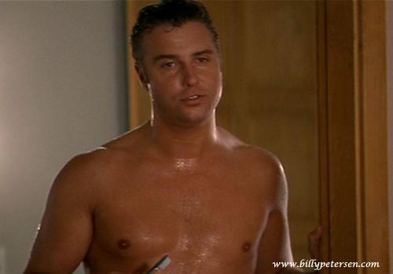

 *************

-   Mulholland Falls (1996)
    - Character:  Some Mafia mobster
    - WP is seen only briefly on screen in a scene where is is killed.
    - I would recommend this to only the true die-hard WP fan -- otherwise, you're going to be disappointed.
    - 真就一小段镜头，让人从山上扔下去了...

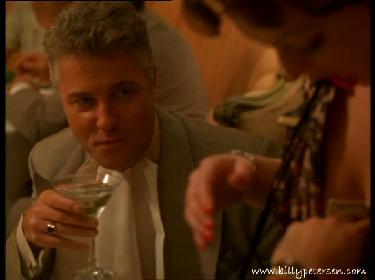  

 *************

-  The Beast (1997) (shorten version of mini series)
    - Character:  Whip Dalton
    - This is the video release of the TV mini series.
    - The squid is rather laughable, but WP is easy on the eyes in his beard and bigsweaters
    - Recommended WP viewing.  If you can find it, buy it.
    - 算恐怖片还是灾难片？
    - 油管上有宣传片

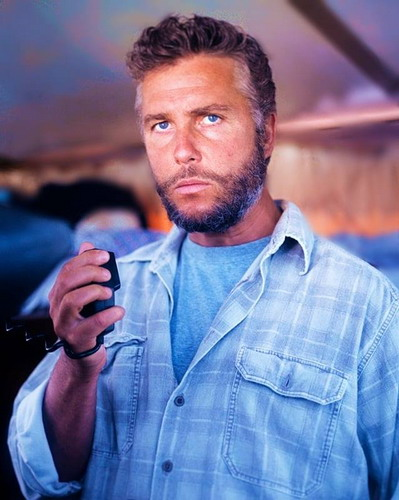  

 *************

-  12 Angry Men (1997) (TV movie)
    - Character:  Juror #12
    - The main characters in this movie are George C. Scott and Jack Lemmon, but the movie is worth watching for the great ensemble cast
    - It's a remake of the 1957 movie of the same name starring Henry Fonda and Lee J. Cobb.  
    - (The 1957 version was directed by Sidney Lumet and the 1997 version was directed by Willilam Friedkin who directed WP in TO LIVE AND DIE IN LA.)
    - Even though WP is a minor character, I recommend this movie (both versions) due to the subject and the great acting in both versions)
    - 陪审团...纯台词...看不懂 Orz

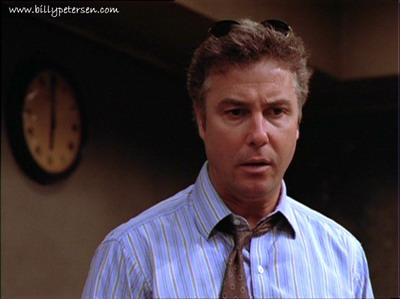  

 *************

-  The Rat Pack (1998) (TV movie)
    - Character: Jack Kennedy
    - This is a fun movie to watch even though WP isn't in but a few scenes
    - "Secretary of Sprinkles" scene is one of the best
    - 以前油管上有来着，大概

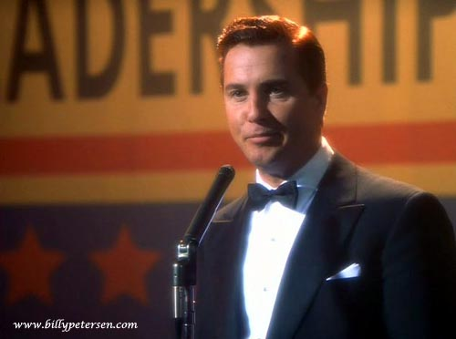  
 
 *************

-  The Staircase (1998) (TV movie)
    - Character: Joad
    - Must see WP movie. If you can get your hands on a copy -- do it.
    - This is one of my favorite characters.  WP plays a very soft-spoken man who comes out of no where and builds a spiral staircase for a chapel.  This is based on a true story
    - FYI: Barbara Hershey, who plays Mother Madalyn, is also in RETURN TO LONESOME DOVE with WP.
    - 以前油管上有来着，大概

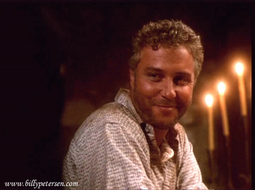  

*************

-  Gunshy (1998)
    - Character:  Jake Bridges
    - Another favorite character
    - Another must see WP movie.  Definite buy and keep.
    - FYI: The woman who plays Grace, the waitress at the bar where Jakes hangs out, also played Lady Heather on CSI
    - FYI: The guy in bed with Jake's wife/girlfriend at the beginning of the movie is the same guy who plays Hank on CSI. -> 这俩是真心不对付了 XD
    - 优酷上有[中文删减版](http://v.youku.com/v_show/id_XMTM0MTIzNTQw.html)

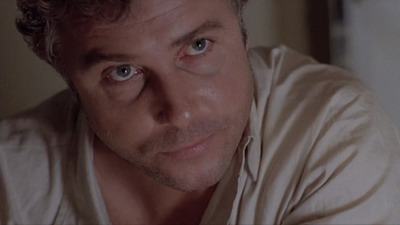 

*************

-  Kiss The Sky (1999)
    - Character: Jeff
    - MUST SEE WP movie!!!  Definite buy and keep.
    - BBBB - what more can I say 
    - ↑ 同意作者的说法，我是跳着看的，因为觉得过于羞耻了 XD 三人行什么的！
    - 还有他在海里展示的白皙圆润的臀部~ PS：床戏是GSR某同人P图的原片
    - FYI: Patricia Charbonneau, who plays Franny, was also in MANHUNTER withWP.  She was the wife of the third family that the Tooth Fairy was agoing to kill. 
    - You don't see her in the theatrical version because the scene where Will Graham goes to the last family's house is cut from this version.  It's in the director's cut.
    - 以前油管上有来着，大概，然后日亚上好像有录像带...

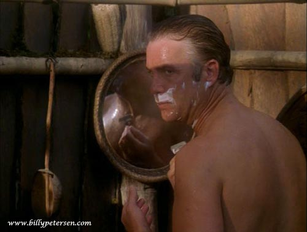  

*************

-  THE SKULLS (2000)
    - Character: Senator Ames Levritt
    - Don't think too hard about story line and plot and this is an enjoyable movie to watch, nothing spectacular, but fun to watch
    - WP looking great in a tux and silver hair again

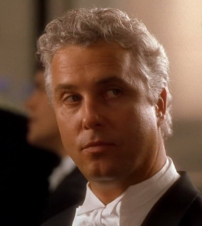  

*************

-  The Contender (2000)
    - Character: Governor Jack Hathaway, governor of Virginia
    - Has a major chunk of screen time at the beginning of the movie, couple of small scenes somewhere in the middle and a major scene near the end
    - A lot of people don't like this movie, but I found it rather interesting and I'm also a big Joan Allen fan
    - Worth a look because WP always looks great in a tux and silver hair -> 燕尾服绝对好评！
    - FYI: WP and Joan Allen were together for the first time in MANHUNTER
    - Can be found on either video or DVD 
    - 大学时候意外的在著名的平乐园市场淘到了这张碟...算是CSI入坑后，接触的第一部他的CSI以外的作品

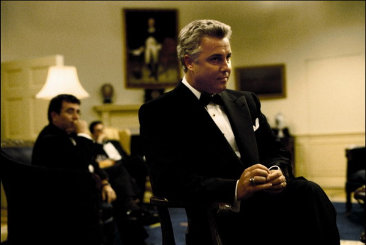  

*************

-  Wrigley Field: Beyond The Ivy (2001) -- 没看过，找不到
    - He's the narrator on this one and can be seen in several scenes
    - This is a great piece of video for baseball fans.

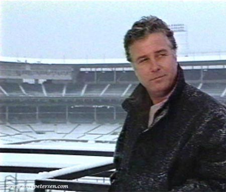 

*************

-  Haven (2001) (TV movie)  -- 没看过，找不到
    - Character: Jackson Connolly, government official
    - This is a really good movie, but WP has only a small roll in it

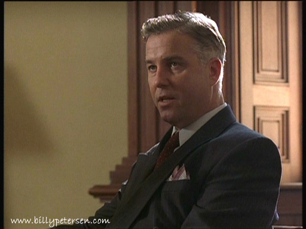 

*************
-  This Old Cub (2004)
    - As himself – Documentary
    - 一段访谈，好像是某部纪录片

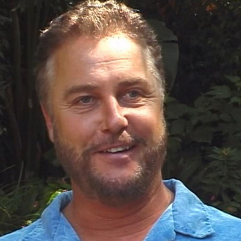 
*************

-  Detachment (2011)
    - Character: Sarge
    - 国内网站有资源，但真就一丢丢镜头，不仔细看找不到那种 Orz

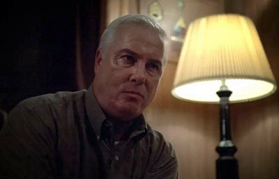 

*************
-  Blue : WIGS Youtube web-series
    - 这个虽然油管上有，但是目测只有美国地区用户可见，真没辙了...

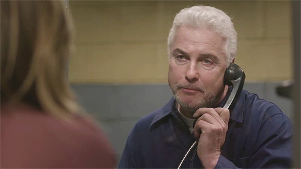

*************
-  Manhattan SEASON 2 （2015）电视剧
    - Character: Emmett Darrow
    - 国内网站有资源

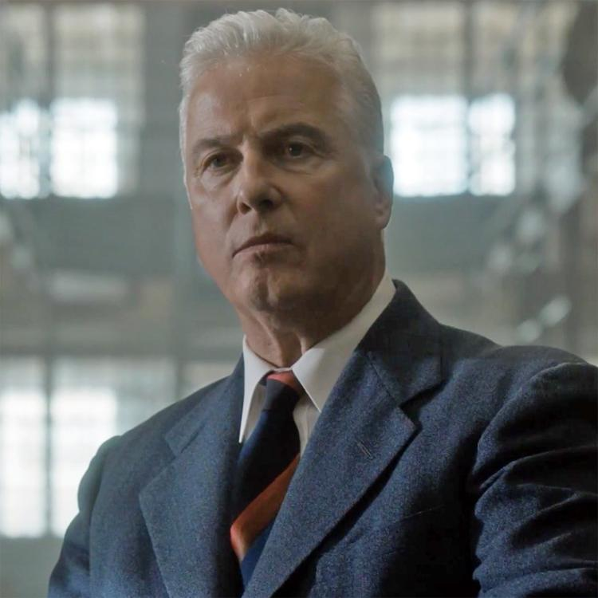 

*************