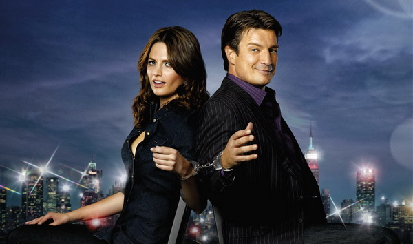

import dh from "./01/2022_09_11_23_50_IMG_4493-s.jpg";
import wp from "./01/2022_09_03_21_01_IMG_4291-s.JPG";

2013年6月，今年的剧荒期还是来了，饱含着对编剧们挖的各种坑的深深地怨念，从友人那里听说了这部名叫「Castle」的剧（中文译名：「灵书妙探」，日文译名：「キャッスル 〜ミステリー作家は事件がお好き」）。

本来只是想拿来补荒，结果害我只花了3周就刷完了5季并进入了二周目…这简直是"要累死自己+燃尽所有精力"的作死的节奏…没办法，欲罢不能了…

二周目开始前，开始在百度贴吧拜读syrainerさん的 [B姐向全剧集吐槽评论楼（图文）](http://tieba.baidu.com/p/1470368269)，然后想想果然自己也应该碎碎念一番，毕竟，这部剧让咱找到了当年看「CSI」的激情，恩，这次的冲动甚至超过了当年也说不定…

首先盘点一下喜欢的美剧，以此表示一下咱对「Castle」的热爱程度。

除了小时候钟爱的两部由David Hasselhoff主演的「霹雳游侠」和「海岸救援队」之外，06年左右爱上了名叫「CSI」的罪案剧，当同学们都爱着「Friends」的时候，我却爱上了那个叫Gil Grissom的大叔…

  
  

 

当时除了被CSI实验室中各种高端仪器所吸引，更多的注意力则被这位内敛到让人看着内伤的学者所深深吸引，看着他和Sara姐姐在实验室搞了7年的暧昧，最后终于happy end的我到底是怀着怎样的心境呢（我不想说后来他们分手了，咬、牙、切、齿）

那之后，随着Gil的离开，看「CSI」也渐渐沦为一种习惯，包括后来的「CSI NY」「CSI MIAMI」以及相似的罪案剧「NCIS」「Bones」，还有快拍成魔幻剧的「Grimm」和好像谍战剧的「POI」，都成了我喜欢的美剧，但是，再喜欢，也还是觉得不够…直到「Castle」进入视线。

「爱着」和「喜欢着」区分起来其实也简单，为了英文四级而报名新东方培训然后只能及格线低空着陆的我，为了看「CSI」和「Castle」的同人文，会跑去翻英文论坛；对于那些我喜欢美剧，我能勉强记住主角的名字，而对于「CSI」和「Castle」，我记住了Gil Grissom的饰演者名叫William Petersen，Richard Castle的饰演者名叫Nathan Fillion，Kate Beckett的饰演者名叫Stana Katic…
所以说，我应该是继「CSI」之后，又爱上了一部戏，叫「Castle」

对于「CSI」已经碎碎念过N篇了，于是这次只重点吐槽「Castle」。

首先要记录一下自己的"功绩"，为了看「Castle」咱做到了以下几点
- 牺牲了睡眠时间 —— 每天1点睡，直接导致上班精神恍惚
- 牺牲了吃饭时间 —— 晚饭神马的就散了～
- 牺牲了工作时间 —— 坚决不加班&直接请假在家刷片…后来间接导致了第二天上班睡过头的杯具

那么说为什么这片子这么吸引人呢？
—— 丰满的人物性格＋无限循环的暧昧！

PS：莫非我其实就是喜欢看人家搞暧昧？眼看着Castle&Beckett互相调戏互相虐却兴致盎然的我到底肿么了…
咳，不过鉴于C&B才搞了4季就去滚床单了，所以这两只已经很对得起观众了吧…

简单来说，这片子就是讲了一个厚脸皮的作家追着美女警察协助人家办案子的故事。

而真说起来，这片子其实并不完美，
- 剧里面没有「CSI」里面出现的各种高科技破案工具——Beckett钟爱的道具只有分析案情用的白板和C叔精灵古怪的想法（误），透明的触摸屏神马的——那是人家FBI的；
- 剧里面没有像「NCIS」里的Boss，没事儿就抗个狙击枪跑去远程爆头——狙击枪是匪徒的T^T；
- 剧里面没有「Bones」里那种血腥的重口味尸体——有重口味的也都被白布遮上了。

But，「Castle」这部罪案剧，有我喜欢的推理，有只英俊多金爱耍宝的Castle，有只笑容耀眼连眼睛都会说话的美女Beckett，有快从屏幕中溢出来的满满的爱意…

对于愿意把「射雕英雄传」当言情小说来看的怪胎，简直爱死了这种口味的罪案剧！

还有啊，对于一枚成长中的恋声一族来说，渐渐的就喜欢上C叔那时而醇厚时而搞怪的嗓音，喜欢听他咬文嚼字～还有听B姐自报家门时那句干脆利落的「Beckett」 & 她用各种声调叫C叔"Castle"的时候，实在是觉得各种受用～（无奈，愤怒，诱惑…每一种都很爱）
——还从没有这么爱一位女演员快超过爱大叔啊（身为叔控的我十分汗颜）

因为很想吐槽C&B这两只，所以开始回味一下剧情吧…
——论C叔如何从弱攻被Beckett调教成强受的（＝＝误！）

其实应该是
——看C叔如何从花花公子成长为Beckett钟爱的大金毛（＝＝误？）

