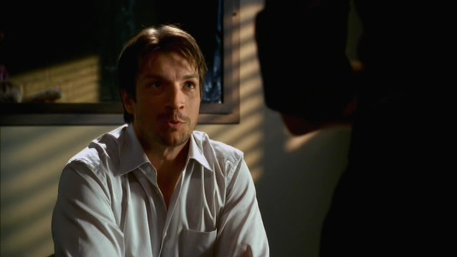

其实开始并不是特别迷这部剧，原因有几个。

1.因为先看了C&B第五季的海报，那上面Beckett金色长发的造型甚是美丽，而第一季的时候Beckett是以短发造型出现的，觉得稍显逊色吸引力变弱了。

2.C叔登场的这形象…
 _(:зゝ∠)_ 他根本就只是个邋邋遢遢色迷迷的小胡子！还在美女胸口上签名！

掀桌！(╯￣Д￣)╯┴─┴

（虽然后来我觉得其实他留小胡子也挺好吧…但是就造型而言，我觉得Nathan Fillion还是稍、微、老一点壮一点儿看起来比较有魅力！第一集中的这形象实在是，比、较、差…）

↑玩世不恭的态度，对受害者的冷漠，只专注于自己的兴趣神马的…这男的真讨厌！——我实在忍不住这么想

然后，为了偷人家警察的文件，给我搞出这种「放开那枚美女让我来！」的"流氓"行为！再掀桌！

就算你害Kate姐姐脸红心跳回眸一笑了也不行！（不过，其实你可以再往左一点的…我到底是什么样的矛盾体啊，扶额）

3.其实开始几集的案情并不是很出彩儿，比如第一集这种"模仿小说情节行凶"的桥段，「NCIS」里面已经看过了嘛，所以也没有觉得这剧特别吸引人，只是C叔那太过青少年的举动实在让人不、得、不、眼前一亮

——哪有第一集里，主人公、还是男主人公就沦为人质的…还是因为擅、自、光、着、脚跑去追疑犯被人家逮到的，扶额

——看C叔坐在警车里玩儿的那叫一个happy…叔，你还敢再二一点儿么…继续扶额 & Orz

——发现C叔其实是个有钱人，能买得起高级激光枪辣么有钱…but还是很青少年

——由于Beckett出现场不愿意带他玩儿，他，他就自己做了件防弹衣，上面写着…「Writer」。
不过他倒是很有自知之名，当Beckett问他有多浅薄的时候，人家毫不犹豫地回答了「非常」。还是扶额…

鉴于C叔的性格这么活泼"可爱"，于是俺决定把这片子看下去，毕竟即使C叔被Beckett各种数落，但他天马行空的想法和推理还是对破案有帮助的——并且起到了另一个重要作用——触发Beckett经典的翻白眼表情——太可耐！

结果，看"B姐各种白眼瞪C叔 & 对C叔各种抓狂 & 各种抓狂后表情帝附身"成了这部剧的重要亮点之一（误）

如果说C叔的存在是为了搞怪娱乐大众的话，那Beckett的存在一定是为了让我们欣赏膜拜的，虽然我是叔控，但在这部剧里，我还是先对Beckett的那个潇洒转身一见钟情了…
Kate Beckett,你真的不止成功挑逗了Richard Castle，有多少Fans也为你痴为你狂了啊…

当然了，C叔并不只是Beckett宠物性质的存在，身为一个壮、硕的男人，在这种罪案剧里英雄救美就是必须的了，而且神奇的是，后来细数俩人互相救助的次数，叔竟然以9：8赢了姐！这不科学！
[证据](https://www.bilibili.com/video/BV1tW4y1Y7Wm/)（转自Youtube by Busger）

这剧其实有点儿慢热，刷着刷着就爱看了，爱上了C叔经常性的语出惊人和耍宝卖萌，爱上B姐英姿飒爽才色双全。尤其看到是第二季的17-18集，让我坚定了收了这部剧的决心。

我觉得这个爆炸事件算是C叔开始成长的一个标志性事件，也是C叔的英雄救美行为从无意识开始向主动性转变的一个开端。
他不再自豪于有人模仿自己的小说进行犯罪，而是开始担心自己的小说会给自己关心的人带来危险。于是他坚持住进了Beckett家进行保护。（GJ！）

话说爆炸那天，虽然C叔你闯进Beckett家时摔倒的样子很像一只柯基，但是对一个"文弱"书生而言，你已经很棒了！

不过…

就算你发现Beckett同学从浴缸里爬出来，也不用辣么大声说啥"太好了你还活着，呀，你裸着呢"（心里偷偷给你鼓掌！），让人家妹子情何以堪啊…

PS：这个场景各种李逍遥调戏赵灵儿的既视感啊…太欢乐了，即使Beckett家里被炸了，结果因为C叔的出现直接变回喜剧了有木有！