import both1 from "./03/1308.jpg";
import both2 from "./03/1310.jpg";

import castle1 from "./03/0021-s.jpg";
import castle2 from "./03/0022-s.jpg";

import castle3 from "./03/1261.jpg";
import beckett1 from "./03/1282.jpg";

import castle4 from "./03/0855.jpg";
import beckett2 from "./03/0854.jpg";

import dog1 from "./03/0767-s.jpg";
import dog2 from "./03/0867-s.jpg";

import beckett3 from "./03/0955-s.jpg";
import beckett4 from "./03/0978-s.jpg";

import both3 from "./03/0016-s.jpg";
import both4 from "./03/0008-s.jpg";

import both5 from "./03/1783-s.jpg";
import both6 from "./03/1787-s.jpg";
import both7 from "./03/1814-s.jpg";
import both8 from "./03/1826-s.jpg";

import beckett5 from "./03/0058-s.jpg";
import beckett6 from "./03/0078-s.jpg";

之所以说直接把这部剧当爱情喜剧看了，当然是因为主人公的这两只不仅男俊女俏，还不停地在每一集里面大搞暧昧，看的俺们这些粉一边热血沸腾一边咬着小手绢恨道「你们俩怎么还不搞到一起！」
而且连主演的Stana姐姐都成了C&B的shipper，我们还有什么理由不是呢～握拳

【八卦一下两人的感情线】

我觉得到第一季的时候，C叔的主要精力确实还是放在对案件和对Beckett的新鲜感上的，并且人家觉得非得帮Beckett个忙顺便表现自己的聪明才智，于是偷偷打开了潘多拉魔盒——着手调查Beckett母亲的案子，基本上算是触发了之后各种主线案情和支线感情冲突的按钮。

回想当年，C叔也是敢于主动调戏Beckett的，怎么后来就是各种被调戏呢，扶额…
——借用syrainerさん的一句话，这就是当假流氓遇到真流氓…

  
  

 

第二季C叔开始对Beckett投入了更多感情，或者该说愈发被Beckett所吸引，只可惜看到Beckett交了新男友于是知难而退，投回到前妻的怀抱中。
虽然这两只的互动里开始透出那么一点儿醋意，但结果呢，两只根本都是不敢搞办公室恋情的主儿，害怕受伤啊。
对我来说，第一遍看的时候其实也就是看个热闹，但第二遍看的时候就开始觉得虐了…
因为看第一遍，双方出"小三"那叫插曲，看第二遍，"小三"们彻底变成了"障碍"啊！

不过，我要大声喊，Beckett越来越漂亮了！叔的礼服也很帅！

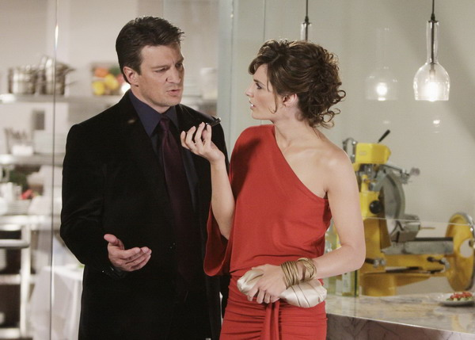

PS：Stana姐姐，咱们能不这么勇敢么？！你想过C叔的感受么…好吧，先不管叔，我是真心抖啊…!!!（就算爱着Grissom我也抖！所以我注定得不到Grissom吗 - 不是...

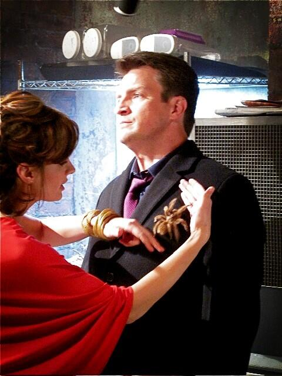

到了第三季，两个人终于有了迫于形势的初吻，而且这个吻有十分之一的气氛是C叔霸王硬上弓，大大满足的粉丝们的需要！必须给100分！
（话说这张剧照直接上了杂志整版…）

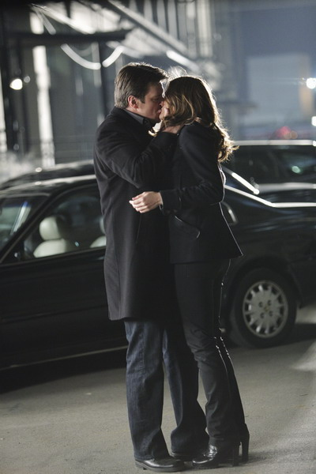

然后C叔在Beckett的气场面前，气势变得越来越弱；在Beckett的美貌面前，也越来越没有主导地位了…叔，你那一副有贼心没贼胆的样子像什么话！

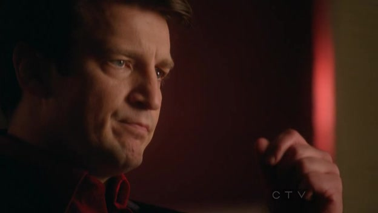

↑法拉利的车钥匙被抢了但是根本不敢还嘴…

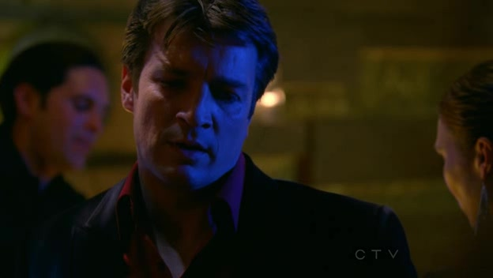

叔，别盯着Beckett的翘臀看了，注意你的口水…

  
  

 

叔，就算你的眼睛再闪亮，眼神再无辜也不行，B姐要的是手铐，不是酒…

赤裸裸的卖个萌惹得Beckett笑靥如花

  
  

 

或者深深地来个眉目传情，继续惹得Beckett笑靥如花（真心爱死了这妹子的笑容…还有你们还是快在一起吧…）

  
  

 

比较遗憾的是，即使这一季里面两只又是kiss又是被关冰窖相互依偎，他们的感情线依旧不顺。虽然C叔别了前妻，但Beckett的医生男友却依旧碍眼，一直持续到第四季开头…

第三季是两只感情线发展非常复杂的一季，C叔已经意识到了自己对Beckett的感情，但碍于Beckett的男友又或是怕破坏二人关系，没有勇气向前迈近一步，只能靠陪Beckett办案子得以守候自己的心上人。核弹那集本以为医生童鞋远走他乡，C&B两只会在危机时刻互相告白，但编剧永远不会顺了观众心意，必须让各种闲杂人等过来打断这两只本来就岌岌可危的那一丝勇气…另外潘多拉魔盒的诅咒也愈演愈烈，长官Montgomery为保护Beckett殉职，Beckett又遭到狙击…神马狗血剧情！

掀桌！(╯￣Д￣)╯┴─┴

虽然我是在第五季播完后才开始看的，清楚地知道在第三季的结尾主演不可能挂掉，但是因为NCIS里的Kate姐姐被一枪爆头的阴影，这里我依旧想诅咒编剧…

唯一值得庆幸的是C叔在高压之下说出了那三个字，遗憾的是这至关重要的告白又被Beckett以"失忆"为借口混过去了…

好吧，我知道有种说法是如果这两只真的在一起了，这剧也就快结束了，所以我同意让他们在第四季里继续耗下去。

但是，
看着他越来越像一只大金毛，被Beckett召之即来挥之即去却还是只要听到召唤就巴巴的摇着尾巴凑过去

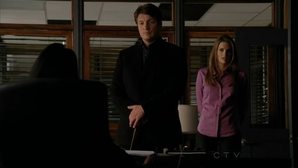

看着他发现自己被骗而表现出的惊讶伤心不开心自暴自弃（虽然我喜欢看他眉头紧锁的样子，但看他受伤又很难过）

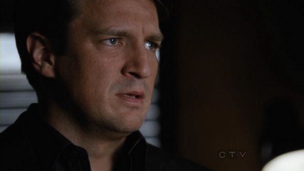

看着他为了Beckett默默做了一切却被Beckett指责背叛

看着他又一次哽咽着向Beckett告白却不得不含泪离开…（叔一边"哭"一边说话激萌…）

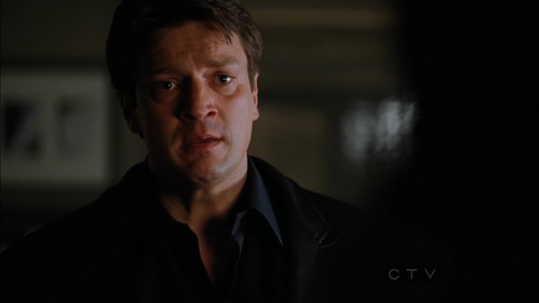

我只想说编剧你放过叔吧…(T_T)

PS：来比较一下他和狗狗，不过显然在幕后C叔还是玩儿不转狗狗…_(:зゝ∠)_ 被拽了个大马趴…

  
  

 

当然了，俗话说好事多磨，也就是说虽然多磨，但还是有不少好事的。
由于Beckett又恢复了单身，而且C叔也表示愿意等下去，所以这两只在第四季里那叫一个暧昧情愫欲盖弥彰啊…

Beckett甚至开始撒、娇、了！

  
  

 

只要看见你的笑容，我觉得无所谓是不是再让C叔多等个一季啦…

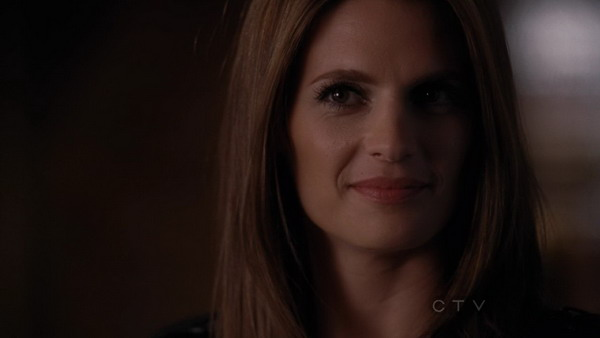

两只竟然被铐在一起了！还是以这么别扭的姿势，捶地，笑抽了这一集…
如果不是有只大猫存在，C叔必须是爽到内伤了…(说什么"你要是同意就没意思了"，其实心里早乐开花儿了吧)

  
  

 

↑和C叔"睡"在一起，看Beckett笑得那叫一个甜

这集C叔还是挺man的，挡住Beckett自己准备当肉盾神马的…

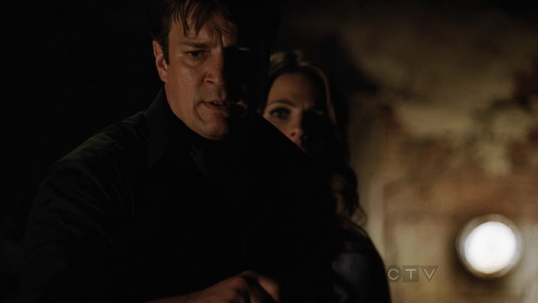

第四季后半，潘多拉魔盒诅咒又现，加之Beckett失忆伪装暴露，各种高潮迭起险象环生啊，Beckett甚至又差点到鬼门关前走上一遭，好在编剧还是有人性的（无数粉丝已抓起菜刀…）

是不是人在失去之后才能体会到那份不舍？那个大雨滂沱的傍晚，Beckett忧伤的坐在秋千上回想着自己这一生，然后，她靠向了自己的港湾…

I’m so sorry, Castle

她终于走上前了一步
她吻了他
她哭了
他（竟、然）吓到了…（叔啊…）
然后他再也抑制不住，也无需抑制自己的感情…

一切发生的那么突然又那么自然，看着Beckett心中的那堵墙终于被C叔帮忙推倒，我甚至觉得太过感动而想跟着流泪，不过直接被激情戏闪瞎了眼，于是…下载了高清版重看了好多遍，【捂脸

  
  

 

  
  

 

看着这两只终于有情人终成眷属，于是悄悄松了口气开始看第五季，然后就是笑裂了…

美女穿着男友宽大的白衬衫神马的，这不仅是C叔的梦，也是我的梦，咬手帕…

  
  

 

But，C叔发现老妈回家了竟然下意识地把Beckett藏在了壁橱里…你，你们两个真是高中生吗？！！！捶地

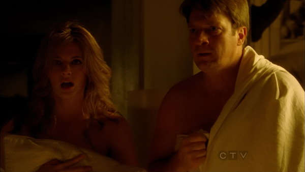

瞧瞧Beckett表现出小女孩般的羞涩和那迷死人不偿命的赛过蜂蜜的笑容，我们一定要给C叔一朵大大的小红花，表扬他把妹子哄得如此娇柔温婉

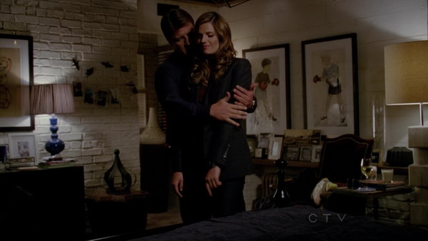

五季里面最喜欢这一季，因为已经完全可以当爱情喜剧来看了（而且我爱Beckett这季的卷卷的长发造型和小女生一般的气场），看着这两只调情挑逗，拥抱温存，有意无意的相视一笑心意相通，一切都变得温馨而有喜感。如果说Beckett被C叔感化得已经柔情似水，那C叔早已经被Beckett融得从头到脚都化掉了…
虽然他们为了不暴露恋情，要在一群破案专家面前装腔作势，但除了给这部剧增加笑点外，基本是没什么效果的…

谁说两只在一起了就没有看点了呢？其实「Bones」就是成功的例子嘛，Booth和Bones连孩子都有了但大家仍然爱他们。那C&B这两只凭借着自身的魅力一定也会让这剧有更多看点——这么想着——编剧就又扔了一记重磅炸弹

**Katherine Houghton Beckett, Will you merry me?**

叔，这一刻你帅、到、爆、表、了好不好…

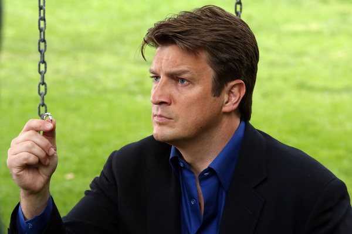

当曾经的花花公子变身为专情"猛"男…天上要下玫瑰了好吧…
嘛，不管Beckett是否答应求婚，又是否要离开NY，我有信心C叔依旧会死缠烂打的…叔，即使被拒绝了也别放手啊！！！