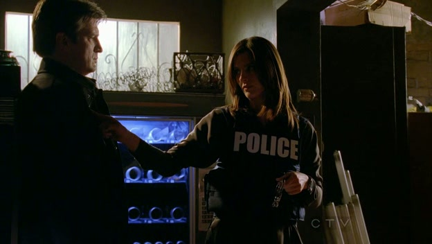

C叔能变成这么样的好男人，除了他自己底子好，当然也是Beckett调教的好~
而且鉴于B姐是警察而C叔只是作家，所以叔注定从头到尾被各种欺压。（我们非常乐意看这种展开！）B姐说了，我有枪而你没有所以你没有选择的余地…

看各种"家暴"与"欺负"

↑叔，真心的，你喊apples也没用的…

即使后来两只在一起了，C叔仍然不停地被Beckett调戏着…

↑带个外星人的头套还要跟C叔滚床单神马的，结果快把叔吓尿了…

话说之所以说爱这部剧甚至要超过「CSI」，那是因为除了爱情以外，还有一个重要原因——家庭。
这部剧花了很大精力描述了C叔的家庭，
他那位会让人点头同意"有其母必有其子"的无厘头老妈Martha——感谢C妈养出C叔这颗奇葩般的好男人

成熟懂事程度完全超过C叔，并让人怀疑"叔也许是被她养大的"女儿Alexis

有个细节我觉得写得特别好。
某集在12分局，Ryan和Esposito在玩儿接球，结果Beckett轻轻松松地就把球拦下来并背后传球，但C叔却完全没能接住抛给他的那颗，开始只觉得是不是C叔的运动神经太差了。但是他回到家后，Alexis拿出棒球和手套给C叔，说他小时候没有父亲陪他玩儿接球游戏，现在她来补偿他。

觉得超感动——泪奔

当然了，还没等我感动完，C叔就把家具砸坏了…扶额…

我觉得不止我，每当Beckett看着Castle表现出对家人过分的关爱时，她都在一点点爱上他。
比如Alexis被绑架，Castle飞巴黎救女儿的英雄壮举…够让人揪心泪目+感动爱慕了

总结：

从这张gif来看，这部剧简单来说就是讲了一个「推到与反推到」的故事嘛～