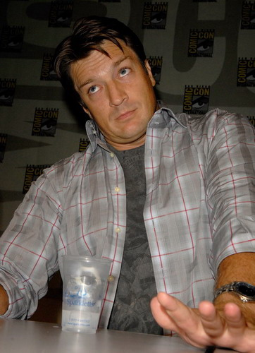

import nathan1 from "./05/25_0001-s.jpg";
import nathan2 from "./05/20140218_IMG_0348-s.jpg";
import nathan3 from "./05/61bf8-s.jpg";
import nathan4 from "./05/61bf80-s.jpg";

import stana1 from "./05/0003-s.jpg";
import stana2 from "./05/0004_17-s.jpg";
import stana3 from "./05/0005_13-s.jpg";
import stana4 from "./05/0007_25-s.jpg";

import both1 from "./05/tumblr_mo74g8NNgb1su-s.png";
import both2 from "./05/tumblr_mo54adG6BZ1su-s.png";
import both3 from "./05/06-s.jpg";
import both4 from "./05/0003-s.png";

说说演员本身
这部剧从演员到编剧都是超有喜感，并能给观众带来极大快乐的一群人。
看DVD的幕后花絮就能知道不仅在剧中，在剧外他们也是一群会搞怪的大孩子。

最喜欢的一段配乐剪辑[You Always Make Me Smile](https://www.bilibili.com/video/BV17841147JD/)，（转自Youtube）
这首歌的名字相当的符合这部剧～

貌似根本不用特意强调C叔的卓越表现，据说Nathan是这部剧里最像其出演角色的演员～
什么样的演员，会在见面会的时候，为了表示自己欲火焚身往衣服里塞冰块啊！



还有你俩给的杀必死太到位了！！


再然后编剧大人华丽丽的把这个"冰块梗"用到了之后的某一集里面…你可以的…

哎，这种长得帅（尤其是这大蓝眼珠～）

<div style={{ display: "flex", gap: 12 }}>
  
  
</div>
<br/>

却还要出来卖萌的男人杀伤力太大…扶额…

<div style={{ display: "flex", gap: 12 }}>
  
  
</div>
<br/>

对了，说句题外话，当Castle碰上钢铁侠，真不好评论他俩谁更自大一些… [旁观](https://www.bilibili.com/video/BV1aW4y1Y7xE/)

要夸夸Stana Katic，因为通常我看美剧会记不住女演员。
但Stana姐姐不一样，看了她的台前幕后采访写真，你就会想，一个女生怎么可以这么爱笑，这么爽朗，这么可爱，这么漂亮，这么性感，这么有可塑性等等等等…你是落凡的天使还是误闯人间的精灵？
有Fan说了，一定是上帝创造她的时候放多了优质材料！

<div style={{ display: "flex", gap: 12 }}>
  
  
  
  
</div>
<br/>

（当然了，我爱的还是Beckett这种偏向清纯&火辣的造型，所以诸如和服装扮和诱惑向的写真，只是shock到我了而并没有进入到我的收藏夹）

让人想捶地的是，Stana姐姐在各种采访中，完爆了自己的Shipper属性…你，你…

```text
"Grab her,
make out with her,
and make babies!" ——GoodJob!!!
```

正是这么样两位鲜活的演员，成功塑造了Castle&Beckett这对荧幕情侣——据说还在「TV Guide」杂志评选上了最佳～

然后…
[Promo宣传片](https://www.bilibili.com/video/BV1zT411N7Qp/)（当然C叔依旧是各种被B姐牵着鼻子走 & Castle的宣传片真的很有趣）


各种活动
<div style={{ display: "flex", gap: 12 }}>
  
  
</div>
<br/>

杂志专题
<div style={{ display: "flex", gap: 12 }}>
  
  
</div>
<br/>

（小鸟依人的竟然是C叔…）

这两只给Fans留下了无限的想象空间
（不过也正因为他们的演绎过于美好，以至于我有点儿无法接受他们在其他剧里面和其他男/女演员演感情戏了Orz）

最后，鉴于C叔的年纪，称这两只"金童玉女"有点儿过，所以我要说，谢谢你们两只，老金童&玉女，给我们带来这么趋近于完美的Show，也让我们能够享受如此美好的Show！

-END-
