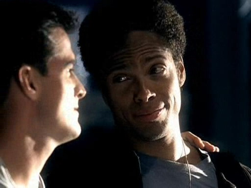
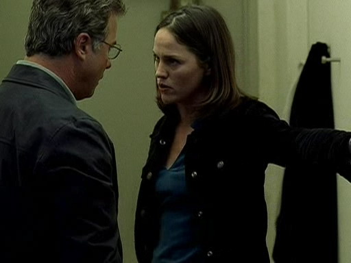

import Highlight from '@site/src/components/Highlight';

import cricket1 from "./01/csi.101-amc[00_04_30][20151004-204710-2].jpg";
import cricket2 from "./01/csi.101-amc[00_06_42][20151004-205329-4].jpg";

import fathermode from "./01/csi.103-amc[00_18_00][20151005-172235-1].jpg";
import sonmode from "./01/csi.103-amc[00_17_59][20151005-172156-0].jpg";

import tape1 from "./01/csi.103-amc[00_28_46][20151005-174158-3].jpg";
import tape2 from "./01/csi.103-amc[00_29_55][20151005-174439-5].jpg";

import fight1 from "./01/csi.106-amc[00_23_00][20151006-222640-1].jpg";
import fight2 from "./01/csi.106-amc[00_40_22][20151006-224709-4].jpg";

import angry from "./01/csi.107-amc[00_33_39][20151007-113116-0].jpg";
import Eclie from "./01/csi.107-amc[00_33_38][20151007-113143-1].jpg";

import crossword1 from "./01/csi.107-amc[00_41_49][20151007-114221-2].jpg";
import crossword2 from "./01/csi.107-amc[00_42_00][20151007-114238-3].jpg";

import girl1 from "./01/csi.107-amc[00_21_06][20151008-224206-2].jpg";
import girl2 from "./01/csi.107-amc[00_21_10][20151008-224215-3].jpg";

import club1 from "./01/csi.109-amc[00_16_24][20151007-132723-0].jpg";
import club2 from "./01/csi.109-amc[00_16_42][20151007-132841-1].jpg";

import pls1 from "./01/csi.109-amc[00_20_12][20151007-134512-5].jpg";
import pls2 from "./01/csi.109-amc[00_20_16][20151007-135356-7].jpg";

import sad1 from "./01/csi.109-amc[00_42_09][20151007-141728-0].jpg";
import sad2 from "./01/csi.109-amc[00_41_41][20151007-141651-8].jpg";

import sara1 from "./01/犯罪现场调查.CSI.S01E[00_26_12][20151007-151058-0].jpg";
import grissom1 from "./01/csi.110-amc[00_25_15][20151007-151002-5].jpg";

import grissom2 from "./01/csi.112-amc[00_35_35][20151008-235823-1].jpg";
import sara2 from "./01/csi.112-amc[00_35_38][20151008-235830-2].jpg";

import boom1 from "./01/CSI.S01E13.AC3.[00_19_40][20151010-111906-0].jpg";
import boom2 from "./01/CSI.S01E13.AC3.[00_19_42][20151010-111912-1].jpg";

import care1 from "./01/CSI.S01E16.AC3.[00_12_41][20151011-001641-3].jpg";
import care2 from "./01/CSI.S01E16.AC3.[00_24_01][20151011-001609-2].jpg";

import sad3 from "./01/CSI.S01E16.AC3.[00_39_19][20151011-004825-5].jpg";
import sad4 from "./01/CSI.S01E16.AC3.[00_40_50][20151011-004908-6].jpg";

import angry2 from "./01/CSI.S01E19.AC3.[00_16_31][20151011-210602-2].jpg";
import angry3 from "./01/CSI.S01E19.AC3.[00_16_32][20151011-210606-3].jpg";

import grissom3 from "./01/CSI.S01E20.AC3.[00_14_27][20151012-233003-0].jpg";
import sara3 from "./01/CSI.S01E20.AC3.[00_14_28][20151012-233434-1].jpg";

import dog1 from "./01/CSI.S01E21.AC3.[00_12_23][20151013-225008-0].jpg";
import dog2 from "./01/CSI.S01E21.AC3.[00_12_33][20151013-225035-1].jpg";

import fight3 from "./01/CSI.S01E23.AC3.[00_15_52][20151015-215135-0].jpg";
import fight4 from "./01/CSI.S01E23.AC3.[00_19_53][20151015-215245-1].jpg";

import weapon1 from "./01/CSI.S01E23.AC3.[00_40_30][20151015-222124-4].jpg";
import weapon2 from "./01/CSI.S01E23.AC3.[00_42_32][20151015-222647-5].jpg";

### 「回想好多年前」
2015.9.27，CSI（中译：犯罪现场调查）在它的第十六季，以电视电影的形式，迎来了剧终。（2022年 PS: 谁能想到2021年他拍了新番「CSI Vegas」？！诶嘿！Grissom & Sara手拉手回归，虽然只有一季10集...）

很多粉丝感叹着陪伴我们青春的这部美剧的结束，我，姑且也算是其中之一。
只不过这部剧带给我的，还有很多无法言表的感情，喜怒哀乐五味杂陈的一种情绪，还有爱。

十几年前，在大学宿舍里，我第一次看到这部美剧，到现在我都要说「感谢学校校台的哥哥姐姐品位这么高！」要不是你们选了这部剧在午休时间播，让我不知不觉爱上这部剧，爱上剧里的角色，谁知道我会不会像现在这样痴迷地踏进美剧圈呢。也许我就永远停留在「霹雳游侠」和「海滩护卫队」的年代了。也许我的青春岁月里就这么缺少了「CSI」，也没能爱上那个优雅、内敛、睿智、英俊的Gil Grissom（William Petersen饰）。

这是一部很高质量的TV Show，高到足以被称为美剧之王。但不管它对美国的电视业起了多少带动作用，也不管它如何帮助CBS得到了美国电视台老大的地位。对于我来说，它最大的好是默默接收了我大部分的好奇心和几乎所有无处发泄的感情。

从开始赞叹这些CSI做的科学家式的侦探工作，到惊艳实验室里那些高大上的科学仪器，一边感慨这些人好像无所不知、永不疲倦，同时也乐于窥视他们偶尔透露出的私生活。（这期间各种被编剧玩弄于股掌之上…）
终于，我爱上这部剧，爱上Gil Grissom。


然后，第九年，Gil离开了。

这之后虽然主演几次易主，但因为剧情够好，也因为看它成了习惯，于是就坚持到了15季。
但其实，最后的几季已经远没有之前那么有吸引力了，旧主演相继离开，不停地加入新鲜血液，让本来就脸盲的我实在招架不住、我甚至记不住他们的名字。从挑完整的时间连刷几集享受放松，变成了上班路上消磨时间打发无聊…

就在我冒出了"它其实被砍掉也无所谓了"的想法时，CBS宣布Gil Grissom回归CSI Finale。

虽然其实这不过发生在几个月前，但我甚至想不起来我听到这个消息时的感觉了（冲击太大了么= =）。
我只记得，我重刷了一遍CSI LV（到9x10 Gil离开），重新去翻了GSR（Grissom Sara Romantic）的同人文，默默打开youtube去搜了「William Petersen」的名字，去搜了CSI Finale的预告片（看了大概10遍…），啃了几遍CSI Finale PaleyFest 访谈的生肉（各种想泪奔），然后9.28开始啃CSI Finale的生肉（还是想泪奔）….
这有点儿像一场2.5次元的情绪风暴混杂在我真实的三次元生活里，让我好像记不清它是怎么来的、又清楚地感觉到它带来的冲击。（我承认上班时间想这些东西是不对的…）

然后，我觉得想写点儿什么，吐槽&剧情回顾，给自己，给CSI，以示纪念，一并表达我对Gil Grissom和William Petersen的10年痴情。

***********************

### 「开始」
「1x01-1x02」

一切的开始，或详细或粗略的讲了几个案子，感觉主要为了概要介绍一下各位主演和其性格，本剧背景。
第一个连环杀人案也是从这里开始的~

Grissom的第一次登场（共出演187集），那时候Brass还是CSI的夜班主管（重看的时候我震惊了！完全不记得的！ 不过也难怪，第二集开始就换Grissom了，估计是新人中枪事件的影响）


PS：他那会儿...好...瘦...

BugMan的第一次昆虫知识秀…幼虫变形期神马的...


那时他会用正经脸骗新人抽血供自己试验，再用自豪脸拿出炸蚂蚱吃个津津有味 = =
要不是先看的后面几集之后才回过来从第一集开始刷，我一定只会觉得这个人是个很酷的异端…

<div style={{ display: "flex", gap: 12 }}>
  
  
</div>
<br/>

话说明明这个人不擅长社交，却老在不经意之间做这种虏获小姑娘芳心的事情！（好吧，其实并没有对所有的小姑娘，大部分还是对Sara；按基友的话说，也可能是第一季人物塑造还不太定形 Orz）


那时候Catherine还留着不那么美的发型


那时候Nick和Warrick还那么水嫩；Nick还总要Grissom教导，Warrick还有着赌博问题



当然，要是没有赌博问题，新人妹子可能就不会这么快便当，Sara姐姐也没法顺理成章的出场了。可见新人妹子作用老大了…（不知道是不是因为这次事故，之后Greg出外勤的时候，Grissom都不会随便让他Solo现场、新人一Solo就受伤Grissom也快哭了）

超级年轻的Greg！


其实以前也挺喜欢看国产的罪案剧，「警察故事」「重案六组」系列，都很爱，但看完CSI之后基本就弃了之后的国产剧，实在是因为CSI带来了太多的新鲜感，看着这群科学家一边做实验一边找线索，各种CG效果特写证据的显现过程，高大上的电脑处理软件，逼真的人体解刨（这里有点儿逼真过头儿了，其实NCIS那种程度就够了Orz），总之一边看一边就觉得，好、厉、害！

时时产生一种秀才也能打败兵的快感~

```text
// highlight-next-line
GIL GRISSOM:  I have a warrant for your toenails.
HUSBAND:  A warrant?  What? Am I a suspect?  I already gave you a sworn statement.
// highlight-next-line
GIL GRISSOM:  A statement's just a public record of your version.  We still need proof.
HUSBAND:  Well, I'd love to help you, but I already cut them.
// highlight-next-line
GIL GRISSOM:  May I see where you discarded the clippings?
HUSBAND:  I flushed them down the toilet.
// highlight-next-line
GIL GRISSOM:  May I see your toilet?  
```

用穷追不舍脸文雅地交涉完就可以开始秀"玩具"了~


剧里各种发光氨、ALS啥的，真科普…

第二集Sara终于登场，Grissom瞬间容光焕发

<Highlight color="#ffb6c1">一生爱你在心口难开从此开始</Highlight>
<br/>
<br/>


据编剧说，因为新人女孩儿的事故，所以他们考虑应该让一个聪明能干很酷的女孩子加入,然后就有了Sara~事实证明她是聪明能干而且很酷，而我喜欢她酷酷的样子。

**************
现在，一晃就结局了,一下子发现他们老了,我也老了…


**************

### 「这份工作很快乐」
「1x03」

从一开始Grissom和Nick的父子档关系就开始了~连送Lindsey的生日礼物都选一样的（话说十五年以后Grissom你就一点儿没认出那个漂亮的阳光女孩儿是Lindsey么…


<div style={{ display: "flex", gap: 12 }}>
  
  
</div>
<br/>

和Sara一起工作总是很美好的~

```text
SARA:  Hey, Grissom ... could you come tape me up?
// highlight-next-line
GRISSOM:  I love my work.
```

<div style={{ display: "flex", gap: 12 }}>
  
  
</div>
<br/>

但你那个娇羞脸是怎么回事啊…..(所以你俩之间永远是Sara主动么….

不过看到Sara身体或心理很受伤的时候Grissom还是忍不住出手的吧


```text
// highlight-next-line
GRISSOM:  (quietly)  Are you okay?
SARA:  (dazed)  Uh-huh.
(GRISSOM looks down at her hand.  He picks her hand up and sees the large bloodied gash on her palm.)
// highlight-next-line
GRISSOM:  Honey, this doesn't look good.
```
他还叫她honey~ PS：据说这个honey是WP的临场发挥！Good Job！

 （3x22）


```text
GRISSOM:  Come on.  I'll take you home.
```

这里简直心痛得要死

 （4x23）

**************

### 「实验小能手」
「1x04」

从来他都是个喜欢做实验的男人，（1x02里他曾经得意的跟Sara说他宁愿眼见为实的做那些扔假人的实验）
于是 Catherine只好自己做个行动派= =，直到很多年以后Catherine还知道用"实验"这个词就能调起他的胃口，拐他上手帮忙干活儿…


听说有人用鲤鱼做实验立刻从发呆状态中恢复注意力的Grissom…

 （8x04）

片子里的CSI们大多都表现得感情丰富，只有Grissom一向以冷静著称，害得同僚们在气疯了的时候会骂他铁石心肠之类。

1x04第一次表现出来。 

```text
CATHERINE:  You right, you know.  I should be just like you.  
  Alone in my hermetically sealed condo watching discovery on the big screen working genius-
  level crossword puzzles, 
  but no relationships.  
  No chance any will slop over into a case.  Right. I want to be just like you.
// highlight-start
GRISSOM:  Technically, it's a townhouse.  And the crosswords are advanced, not genius.  
  But you're right.  I'm deficient in a lot of ways.  
  But I never screw up one of my cases with personal stuff.
// highlight-end
```
（但是Grissom你一定要一脸无辜的针对对方的每个论点都反驳一下么…这是你的冷幽默还是啥= = 没看到Catherine都想要咬你了么…这样真的会没朋友好么…）


不过后来时过境迁沧海桑田的，谁能想到7年以后Grissom为了Lady Heather就各种"耍赖"来着…

```text
CATHERINE:  So,when your personal life gets tangled up in a case, that's off limits?
// highlight-next-line
GRISSOM:  Yes.
CATHERINE:  Isn't that a little hypocritical?
// highlight-next-line
GRISSOM:  Apparently so.
CATHERINE:  You know I'd slap you,but I think you'd enjoy it too much.
```

 （7x23）

不要一副"我耍流氓了你打我呀"的态度好么……真想上去掐一下了脸…

***********************

### 「别动我的人」
「1x06」

有评论说Grissom有点儿娘 (第三季的时候我会觉得他有点儿像我奶奶我是不会说的= =)，不过其实他是个超级护短儿的boss。
平时温温诺诺的，但看到Warrick和人起冲突了，马上冲上去挡；不喜欢带枪，但是Nick遇到危险了就用很帅气的姿势直指凶手…明明就很Man！（Nick就直接吓哭了…Nick好像是CSI里最容易被坏人盯上的一个，是不是得罪编剧了呢= =）

<div style={{ display: "flex", gap: 12 }}>
  
  
</div>
<br/>

不过其实一和人吵架就头疼么…


***********************

### 「小孩子和填字游戏是弱点= =」
「1x07」

不喜欢的剧集之一，并不是演得不好，而是剧情太探讨人性黑暗面了…

遇到小孩子相关的案子，他就容易抓狂，这不是第一次，也不是最后一次，心疼。

他不喜欢搞政治，但是有人喜欢搞…比如Ecklie
不过因为牵扯到小孩子，所以他朝Ecklie发飙了（总不能当面讽刺治安官什么的，摊手）

<div style={{ display: "flex", gap: 12 }}>
  
  
</div>
<br/>

开始挺不喜欢这个一心玩弄政治，各种打压"欺负"Grissom的秃头，不过有了之后他受伤的剧情，再返回来看前面，也就没那么反感他了。他只不过和Grissom是两类人罢了，他看中如何提高自己的事业成就，而Grissom更喜欢用科学解答难题。
其实看Grissom对Ecklie嘲讽全开的样子蛮有意思的…


貌似是1998年的舞台剧「Flyovers」，笑死，从很久之前就是对手么！


话说Grissom你是有多喜欢填字游戏= =，瞥见一眼不填完就不行是么…

<div style={{ display: "flex", gap: 12 }}>
  
  
</div>
<br/>

PS：Sara带小Loli的一场戏太温馨可爱了
本来Sara超级不想带小孩子，可是面对这样的小天使果然还是放不下

<div style={{ display: "flex", gap: 12 }}>
  
  
</div>

***********************

### 「同人文爱用高空俱乐部梗」
「1x09」

这人就能一脸正经的和Sara讨论Sex问题…
这会儿祭出《检疫科学应用心理动力学》杂志是什么鬼…

```text
// highlight-next-line
GRISSOM:  You know, high altitude enhances the entire sexual experience.  It increases the euphoria.
SARA:  Well ... it's good.  I don't know if it's that good.
突然很尴尬…..
SARA:  Cite your source.
// highlight-next-line
GRISSOM:  Hand me a swab, please.
SARA:  You're avoiding the question.  "Enhances sexual experience.  Increases euphoria."  Cite your source.
// highlight-next-line
GRISSOM:  A magazine.
SARA:  What magazine?
// highlight-next-line
GRISSOM:   "Applied Psychodynamics in Forensic Science."
SARA:  Never heard of it.
// highlight-start
GRISSOM:  I'll get you a subscription.  
GRISSOM:  Now, cite your source.
// highlight-end
SARA:  Oh ... now you want to go down that route?
// highlight-next-line
GRISSOM:  Yeah.
SARA:  Nah.  Never mind.
// highlight-next-line
GRISSOM:  You started it.
SARA:  Delta Airlines, Flight 1109, Boston-Miami, March '93, Ken Fuller.  
  Hazel eyes, Organic Chem Lab TA, BMOC ... overrated ... in ... every aspect. 
  Could ... we ... get back to work, please?
```

真是太尴尬了……..

<div style={{ display: "flex", gap: 12 }}>
  
  
</div>
<br/>

Catherine永远是Grissom的左右手（从定妆照看，完全是女主地位，难怪那么多人粉Grillows）
总之不好办、不想办的事情推给Catherine就好，歪头杀+无辜脸+"Please"就OK了= =
比如这次收集证人鞋印啦、后面给Ecklie的升职祝词啦、大批的文书工作神马的…

<div style={{ display: "flex", gap: 12 }}>
  
  
</div>
<br/>

不过CSI Finale PaleyFest被问到为啥觉得Grillows成不了，William Petersen表示这俩只是伙伴，是互相敬仰的朋友，甚至可以说是中年夫妻神马的，（一定要反驳Marg Helgenberger提出的"老年夫妻"观点= =）不过还是不适合在一起~啊啊，毕竟Sara姐姐其实从第一季开始就定位为Grissom的相恋对象嘛！

都说他铁石心肠，其实根本是侠骨柔情，他真心为受害者难过…
Sara你很早就发现了他眼里的悲伤对么

```text
CATHERINE:  He was a threat.
// highlight-start
GRISSOM:  No.  He turned into a threat.  It didn't have to be that way.  People make assumptions.  
  That's the problem.  You just did.  
  And I think these passengers made the wrong assumption and now this guy's dead.
// highlight-end
WARRICK:  Well, if that's your stance how could it have been prevented?
// highlight-start
GRISSOM:  If just one person had stopped and taken the time to look at the guy to listen to him, 
  to figure out what was wrong with him it might not have happened.  It took five people to kill him.  
  It would have only taken one person to save his life.
// highlight-end
```

<div style={{ display: "flex", gap: 12 }}>
  
  
</div>

***********************
### 「我相信这一直是个love story」
「1x10」

Grissom可能第一次见识到他喜欢的姑娘骨子里有多少怒气，不知道有没有被吓到= =



然后他又看到她为了案子睡在实验室，不知道是不是又心疼~
（Sara姐姐的睡颜还是很美的~又然后姐姐大家都以为你不用睡觉的…）

<div style={{ display: "flex", gap: 12 }}>
  
  
</div>
<br/>

再然后这个姑娘跟他说要不要一起睡…Gil你心里瞬间是不是有万匹羊驼奔行了…

```text
SARA:  You want to sleep with me?
(GRISSOM freezes.  He puts down his food and takes off his glasses.)
// highlight-next-line
GRISSOM:  Did you just say what I think you said?
```


最后深夜姑娘给他送毯子、他害姑娘变成素食主义者了…
不管怎么说，他喜欢这姑娘只是不敢说，姑娘也喜欢他只是表白被拒，闹到第六季这俩才走到一起...急死一众GSR粉


话说这一集Sara各种引用Grissom的"名言"，反正就各种夸夸夸…

Sence 1
```text
SARA:  You ... you know how you say, "We're the victim's last voice"?
// highlight-next-line
GRISSOM:  Mm-hmm.
```

Sence 2
```text
// highlight-start
GRISSOM:  You did very good.  (SARA beams.)  But this is just more circumstantial evidence.  
  We're a long way from a conviction.
// highlight-end
SARA:  But we can bury him under evidence.  
  You're the one who's always saying it's better to have one piece of forensic evidence than ten eyewitnesses.
// highlight-next-line
GRISSOM:  (stares at her)  What, do you tape everything I say? 
```


Grissom你笑的好腼腆…

***********************

### 「Sara是那个帮助他茅塞顿开的人」
「1x12」

```text
GRISSOM:  Thank you.
```

<div style={{ display: "flex", gap: 12 }}>
  
  
</div>
<br/>

然后觉得脸太帅截张图…


***********************

### 「他欣赏她」
「1x13」

这会儿他们一起玩儿炸弹

<div style={{ display: "flex", gap: 12 }}>
  
  
</div>
<br/>

15年以后他们又一起玩儿炸弹


还有，果然心烦的时候只有Sara可以安抚情绪么，笑这么甜！

 （1x19）

***

PS: Nick被陷害了…又快被欺负哭了


***********************

### 「他关心她」
「1x16」

发现她过分的关心受害者,Grissom各种担心&找Sara谈心（他竟然找Sara谈心！）
可惜Sara甚至没法控制自己对受害者的移情…
Grissom发现Sara姐姐根本不甩他好伤心Orz 
离开资料室时，沙哑无力地叫一声"Sara"然后默默离开简直太戳…

<div style={{ display: "flex", gap: 12 }}>
  
  
</div>
<br/>

话说Grissom你的着急连Nick都看出来了！你还否认… 之前明明说不能用狗狗来着…

```text
NICK:  You're rushing this for Sara.
// highlight-next-line
GRISSOM:  My priority is the case, Nick.  Release the hounds.
```

不过你才不搞什么剧烈运动对吧…Nick这倒霉孩子


结尾Sara终于愿意和Grissom谈谈了，可被自己喜欢的姑娘误会是没感情的石头Grissom好难过好么…被Catherine骂就不会这么消沉还知道转移话题…

<div style={{ display: "flex", gap: 12 }}>
  
  
</div>
<br/>

到1x19里baby死亡事件一下子戳了Grissom的弱点,于是又给自己"打脸"了（Greg被殃及池鱼，吓死宝宝了…）
Sara姐姐果断追出去劝，好感动~看，他不是铁石心肠吧~

```text
SARA:  Grissom?
// highlight-next-line
GRISSOM:  What?
SARA:  You told me a few weeks ago that nothing is personal.  No victim should be special.
SARA:  Everyone follows your lead.
// highlight-start
GRISSOM:  Everyone didn't find that baby. I did.  
  And that little boy is dead because someone lost their temper or screwed up, or god knows what.  
  So, excuse me, but this victim is special.
// highlight-end
```

<div style={{ display: "flex", gap: 12 }}>
  
  
</div>
<br/>

***

PS：为Catherine挺身而出也在这一集，平时温文尔雅的一个人为红颜冲冠一怒~好帅！


***********************

### 「他不喜欢谈他自己」
「1x20」

失聪少年的case引出Grissom会手语的事实,可他完全不想谈自己,
马上躲到自己的壳子里= =,Sara姐姐气死了…就算你装无辜脸也没用…

```text
SARA:  So, you going to tell us how you learned to sign?
// highlight-next-line
GRISSOM:  No.
```

<div style={{ display: "flex", gap: 12 }}>
  
  
</div>
<br/>

明明和聋人老师手语交流得很好，聊得也很开心…你是怕Sara不理解你？
PS：Nick在2x07里调侃他有自闭症= = 

***********************

### 「狗狗喜欢他」
「1x21」

不慎喜欢这集,人吃人神马的实在是战三观…
不过狗狗蛮可爱的，眼看就要把Grissom扑到了！

<div style={{ display: "flex", gap: 12 }}>
  
  
</div>
<br/>

***********************

### 「政治不好玩儿」
「1x23」

Sara背着自己同意去做FBI的卧底和Catherine被治安官要求接下自己的职务…不知道哪个更让Grissom心烦。

<div style={{ display: "flex", gap: 12 }}>
  
  
</div>
<br/>

话说你为毛不带武器就跑去找嫌犯呀！要是没有Catherine你可怎么办！
以后长点儿记性好吗！

<div style={{ display: "flex", gap: 12 }}>
  
  
</div>
<br/>

***

PS：Nick这次又被躲在衣橱里的记者吓到了…

-Season1 END-
