import Highlight from '@site/src/components/Highlight';

import smell1 from "./02/CSI.S07E15.Law.[00_28_58][20151018-160818-0].jpg";
import smell2 from "./02/CSI.S07E15.Law.[00_29_06][20151018-160901-2].jpg";
import smell3 from "./02/csi.2x04.bully_[00_13_16][20151018-160017-0].jpg";
import smell4 from "./02/csi.2x04.bully_[00_38_52][20151018-161927-0].jpg";

import grissom1 from "./02/csi.2x08.slave_[00_41_44][20151018-215411-4].jpg";
import cath1 from "./02/csi.2x08.slave_[00_41_55][20151018-215427-5].jpg";

import cook1 from "./02/csi.2x15.burden[00_42_18][20151020-234327-2].jpg";
import cook2 from "./02/csi.2x15.burden[00_42_39][20151020-234428-5].jpg";

### 「我的实验室，哼~」
「2x01」
欺负起Greg，妥妥儿的…

```text
GREG:  Oh, don't touch it.  That's my pot!
// highlight-next-line
GRISSOM:  Your pot?
GREG:  Yeah, you know, from my own private stash.  (He picks up the coffee bag.)  
    Blue Hawaiian -- $40 a pound.  Only grown a couple times a year on the Big 
    Island hand-picked to perfection.
// highlight-start
GRISSOM:  Good.  You're using my water so I guess that makes it community coffee.  
GRISSOM:  You want a cup, Nick?
// highlight-end
```

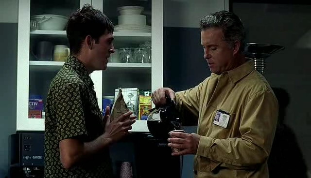

***********************

### 「有人不在乎你满身垃圾」
「2x04」
Sara准备交往的小哥出场,不过第一次约饭就因为Sara满身的死尸味道失败了

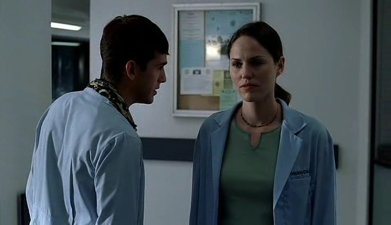

```text
GREG:  You smell like death.
SARA:   I've heard.
GREG:  You know ... a real man wouldn't mind.
```

Greg那会儿想过要追求Sara，所以这话估计说的是他自己。不过好多年后Grissom倒是证明了这个理论~

<div style={{ display: "flex", gap: 12 }}>
  
  
</div>
<br/>

（7x15）

1个月没见到Sara，Grissom只想着要赶快亲近，哪还顾得上什么垃圾味。

<Highlight color="#ffb6c1">好甜</Highlight>
<br/>
<br/>

恩，Grissom还是有经验的，用柠檬洗澡可以除臭么…

<div style={{ display: "flex", gap: 12 }}>
  
  
</div>
<br/>

PS：
仔细看了一眼这个演Hank的小哥，好像还真是在「Gunshy」里面演那个和男主老婆出轨的男人。

哦，对了，「Gunshy」里面William Petersen是男主…

你俩多大仇…

***********************

### 「喷鼻血的小哥好逗、Grissom囧」
「2x05」

你们两个找个苍蝇用不用找得这么有气氛呀…

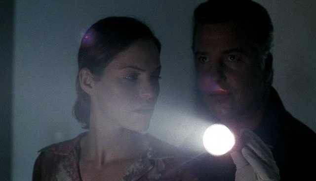

Grissom少有的在发脾气，但Sara姐姐总是有手段安抚他~
（她看他的眼神好温柔，好像在看小孩子~）

```text
SARA:  You okay?
// highlight-next-line
GRISSOM:  Ninety-five.
SARA:  Excuse me?
// highlight-start
GRISSOM:  Normally my pulse is seventy. When it gets to 95, I realize how mad I am. 
    I-I have ten people working around the clock on this thing.
// highlight-end
SARA:  You're too hard on yourself.
// highlight-next-line
GRISSOM:  No, no. I'm not mad at me. There's a body in there and that guy knows where it is!
SARA:  What's your pulse at now?
(GRISSOM sighs and pushes his cap up over his forehead.)
SARA:  You want to take a walk around the block? Get some air?
// highlight-next-line
GRISSOM:  (sighs)  No.
SARA:  Clear your head ...
// highlight-next-line
GRISSOM:  I'm fine.
SARA:  Okay.
(GRISSOM has his eyes closed. SARA reaches out and wipes his cheek. 
A lingering move that surprises GRISSOM in it's intimacy. 
He looks at her. She meets his eyes. She shrugs.)
SARA:  Chalk ... from plaster.
// highlight-next-line
GRISSOM:  Oh.
(GRISSOM wipes his cheek and absently glances at the back of his hand. He looks at SARA.  
She meets his eyes for a moment then looks away.)
SARA:  (gently) Better go wash up.
(SARA smiles and walks back in leaving GRISSOM behind. GRISSOM pulls his cap down and follows.)
```

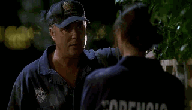

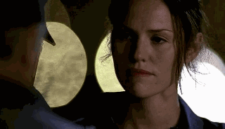

想起了蒋勋先生的radio，人与人的肢体接触是很温馨、亲密的，所以Grissom就算再木讷，突然被自己喜欢的姑娘碰触到，恐怕是要内心翻腾一阵子吧~（被吓到了么！那个惊慌脸是怎么回事！）
完全不用出去走走，脑子也一下惊醒了吧~Sara根本就是新鲜空气！

不过你为毛不跟他们一起吃早饭去？
所以这会儿你还觉得和bug相处要比和Sara相处来的安全？啊啊，果然要碰到Lady Heather才能开窍么…

***********************

### 「Lady Heather气质好棒、Grissom又囧」
「2x08」

女王Lady Heather的第一次出场，那个气场啊~那个优雅啊~
Grissom竟然会跑去喝下午茶，一般不都是问问话就走人的么，明显的好感&欣赏！肯定是被女王的博学和风姿吸引了。还想拐人家来给自己打工= =
不过聊了两句就被人家分析得透透的，最后只能腼腆的笑笑，好尴尬！
风头竟然被压住了！一直以来博学的应该是自己才对！应该是自己戳穿&压制对方才对！
这扇门一定是打开的方式不对！

```text
// highlight-next-line
GRISSOM:  You're very good.  You could work for me.
LADY HEATHER:  You want to be my boss?
// highlight-next-line
GRISSOM:  You never know.  We both might learn something.
LADY HEATHER:  Oh, I'm sure of that.

LADY HEATHER:  The most telling thing about anyone is what scares them.  
  And I know what you fear more than anything, Mr. Grissom.
// highlight-next-line
GRISSOM:  Which is?
LADY HEATHER:  Being known.  You can't accept that I might know what you really desire, 
  because that would mean that I know you.  
  Something, for whatever reason, you spend your entire life making sure no one else does.
// highlight-next-line
GRISSOM:  Lady Heather, you're an anthropologist.
```

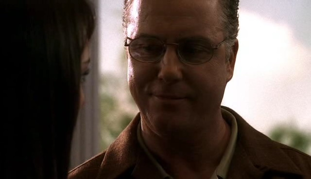

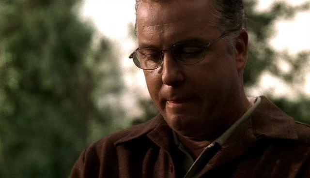

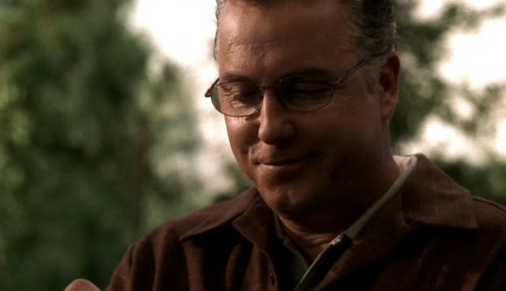

Grissom心里的硬壳就这么被华丽的发现了，囧


这个组里和Grissom关系最好的应该是Catherine，各种调侃，好欢乐~

```text
CAHTERINE:  I just realized that you and I have a very healthy relationship.
// highlight-next-line
GRISSOM:  We do?
CATHERINE:  Well, when we have a problem, 
  I don't paint Greg Sanders in latex and stick a straw up his nose. 
【Greg躺枪 = =】
// highlight-next-line
GRISSOM:  Good. He'd probably like it.
(CATHERINE puts and arm on GRISSOM'S shoulder, stopping him.)
CATHERINE:  Gil ... you're supposed to say something revealing back to me.
// highlight-next-line
GRISSOM:  Okay. I never told anybody this, Catherine ...
```

<div style={{ display: "flex", gap: 12 }}>
  
  
</div>
<br/>

不过Grissom你回复了Catherine什么？

***********************

### 「Grissom去玩儿小强了= =」
「2x10」

即使会爱他的沉稳寡言，爱他的笑不露齿，爱他软软的但又清澈的声音，爱他的常年的灰发，爱他整洁的胡子，爱他的O型腿，爱他不自觉的翘小指，却还是无法爱上他对昆虫的热情。只要一谈到Bug那叫一个滔滔不绝…为毛要爱好养小强和小强赛跑呢（还叫小强Baby）、给跪了= =

话说第二季这会儿Grissom身为一个主管还真是各种让人抓狂，跟他或跟他的案子没关系的人际关系好像都不重要，这次让Catherine和Warrick白目，下次就要惹毛Sara姐姐了…

***********************

### 「原来CSI早就用过这个梗」
「2x12」

```text
SARA:  That would be three days ago.  (reading)  
  "I know it sounds weird, but ... my life began when I first heard your voice ..."  
(Quick flashback to DONNA MARKS sitting in front of her computer reading the e-mail out loud.)
DONNA MARKS:  "... when you said my name, it felt so right.  Did you feel it, too?"  
(End of flashback.  Resume to present.)
// highlight-next-line
(SARA and GRISSOM look at each other.)
```

念着被害人的情书，不自觉的就深情款款么~
好吧，你们没有Castle和Beckett那么明显…

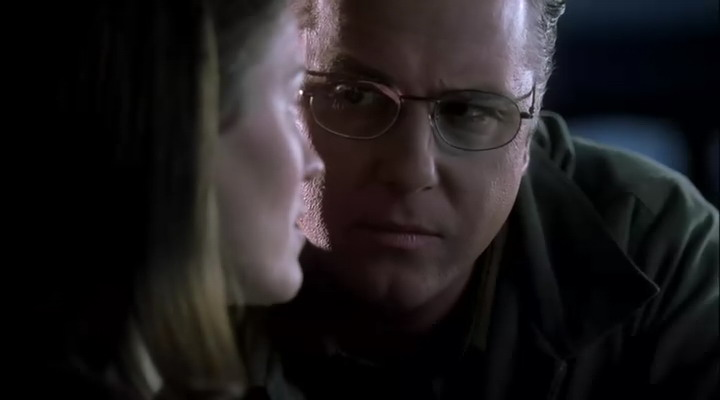

***********************

### 「第一个连环杀手案终于告破」
「2x13」

用了3集的长度，CSI里第一个连环杀手案终于告破。
本想说皆大欢喜，不过这个凶手真是让Grissom吃尽苦头…
指纹被盗用、ID被盗用，放走凶手、被凶手关进牢里…各种被牵着鼻子走，已气死，只能拿Greg"撒气"了

```text
GREG:  The guy's pretty shrewd.  
GREG:  Every murder comes back to a dead man.
// highlight-next-line
GRISSOM:  Greg, if I refer to Millander as smart,   it's one thing but I mind if other people do it, okay?
GREG:  (nods)  Got it.
```

最后凶手自杀，也是Grissom最不愿看到的结局吧。终究被凶手胜了一筹 = =

PS：到这个连环杀手系列的第三集才揭露Grissom的生日是8.17号，根本就和凶手的目标一致，吓死大家了好么，就只有你自己这么淡定！还跑去凶手家里吃、晚、饭！（结果又被耍了，扶额…）
最后去凶手家虽然懂得带枪了，不过为什么不叫后援！
观众如我已担心死…

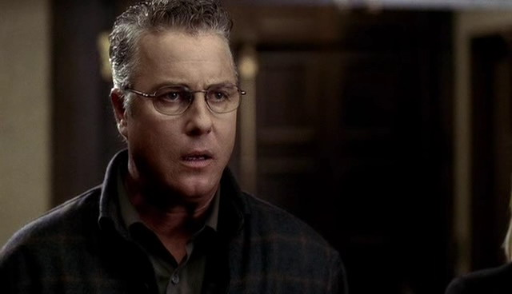

能让Grissom这么震惊的凶手，太少见…

***********************

### 「Grissom各种气人」
「2x15」

不知道是不是因为受害者被发现在Body Farm太对自己的胃口，从一开始Grissom就各种津津有味乐此不疲…和法医爷爷一起解刨啦、用牛肉做bug实验啦…以至于完全没有在意周围同僚是啥反应。Nick这种小乖也就算了，Sara姐姐这暴脾气…

```text
// highlight-next-line
GRISSOM:  What is this?
SARA:  It's, uh, just what it says:  
  It's a request for a leave of absence -- six months ... year, maybe.
// highlight-next-line
GRISSOM:  Why?
SARA:  I was thinking of checking out the federal government system - FBI ...
(GRISSOM snorts.)
// highlight-next-line
GRISSOM:  We have the best lab in the country.
SARA:  I need a different work environment.
// highlight-next-line
GRISSOM:  What does that mean?
SARA:  One with, um, communication ... respect.
// highlight-next-line
GRISSOM:  Everybody here respects you.
SARA:  You don't.
// highlight-next-line
GRISSOM:  Is this about that hamburger thing?
SARA:  No, Grissom ... this is not about that "Hamburger" thing.  
  I-I-I don't believe you.  How can you reduce everything that I've said to some kind of single quirk?  
  Do you think the problem here is just about me?  
(GRISSOM seems surprised.)
SARA:  If you don't sign my leave, I'm going to have to quit.
(SARA turns to leave.  GRISSOM stops her.)
// highlight-next-line
GRISSOM:  Hey, Sara?  
(She turns around.)
// highlight-next-line
GRISSOM:  The Lab needs you here.
SARA:  Great.
```

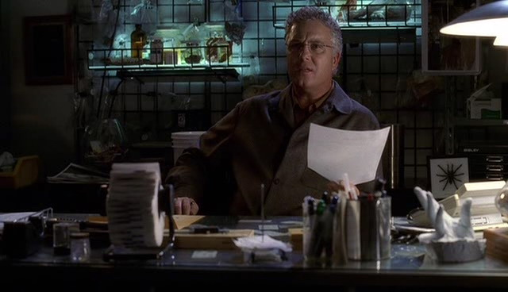

看，惹毛Sara姐姐就是这种下场…吓一跳吧…长点儿心吧，Catherine明明各种提点你…

开始被提到Sara的事还想躲在壳子里结果被Catherine秒杀，笑死。
最后Grissom可怜兮兮的样子反差萌啊！
恩，被数落一顿还是有长进的！知道送东西示好了！

```text
(GRISSOM dials the phone.)
GRISSOM:  (awkwardly on phone)  Yeah, hi. I-I-I'd like to get some flowers for a girl.  
  No, no.  Not flowers.  A plant.  A living plant.  She likes vegetation.
(CATHERINE sits down on the sofa.  She smiles and takes a sip from her glass.)
GRISSOM:  Yeah, that'd be fine.  To a Sara Sidle.  
  Deliver it at the CSI division, Las Vegas Police Department the one out on North Trop Boulevard.  
  Yeah, you can bill me at the same place.  Gil Grissom.  (pause)  The sentiment?  
  Oh-oh, on the card.  Yeah.  Um, uh ... have it say ... have it say, uh ... "From Grissom."
(He nods his head, satisfied.)
GRISSOM:  (on phone)  Thank you.
```

<div style={{ display: "flex", gap: 12 }}>
  
  
</div>
<br/>

不过，Sara姐姐就这么被一盆植物收买了= =
她果然很爱他…

***********************

### 「刚惹毛过Sara姐姐这就开始甜言蜜语么!」
「2x16」

```text
SARA:  You just don't like sports.
// highlight-next-line
GRISSOM:  That's not true-- I've been a baseball fan my whole life.
SARA:  Baseball.  Well, that figures.  All those stats.
// highlight-next-line
GRISSOM:  It's a beautiful game.
SARA:  Since when are you interested in beauty?
// highlight-next-line
GRISSOM:  (without looking up)  Since I met you.
(Startled, SARA turns to look at GRISSOM.)
```

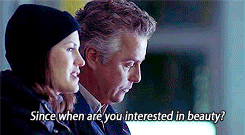

(据说最后一句也是William Petersen自己加的。泪流满面，加得好啊！)
不过Grissom你瞬间转移话题是要闹哪样= = 没看Sara姐姐听完之后整个人都呆掉了么…

***********************

### 「Nick又被盯上了」
「2x19」

Nick可怜死了,这次碰上跟踪狂= = 

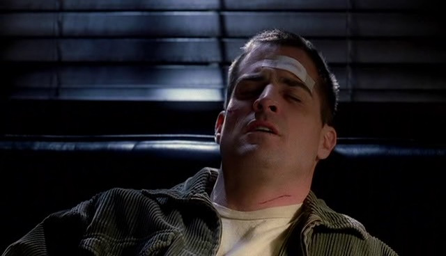

***********************

### 「自然的拉个手」
「2x21」

Gentle Grissom

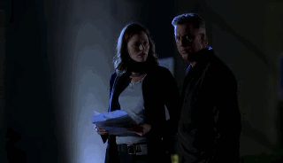

不过你们俩发现线索了就蹲在黑暗的马路中间…不怕又、有、车、撞过来吗！！

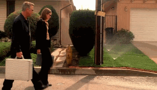

Grissom还注意到洒水装置~So Sweet！

发现Greg把调查结果优先告诉了Sara，Grissom表示不高兴~
这是宝宝不开心的意思吗~

```text
// highlight-next-line
GRISSOM:  You've, uh, already shared this information with Sara?
GREG:  Yeah, an hour ago.  And she was way more fascinated than you are.
// highlight-next-line
GRISSOM:  Well, I'm somewhat fascinated by the fact that I'm your boss, but you talked to her first.
GREG:  Well, you were at dinner.
// highlight-next-line
GRISSOM:  I've been in the lab all day, Greg.

SARA:  I've been looking for you.
// highlight-next-line
GRISSOM:  Well, it's hard to see me if you and Greg are out ahead of me.
```

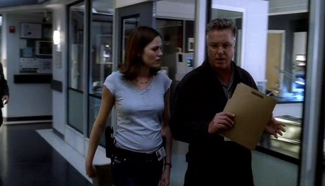

***********************

### 「喜欢CSI的配乐」
「2x23」

喜欢CSI的一个理由，它的配乐很棒。

夜深，Grissom不理会Nick和Warrick的招呼，不理会小巷里的流浪汉，不理会周围的人群，孤独的走去案发现场，然后，他看见Sara站在那里。
虽然是凶杀案，但为什么突然觉得有一种凄凉的浪漫感！	

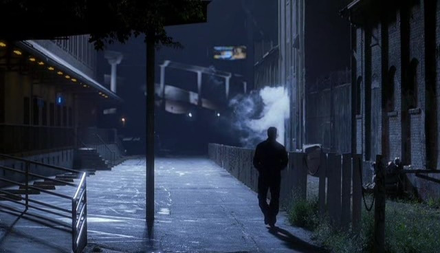

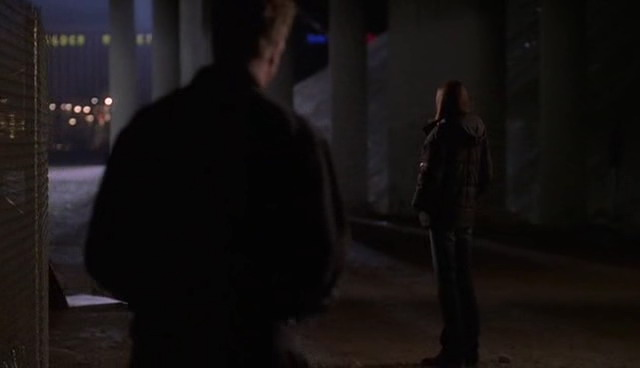

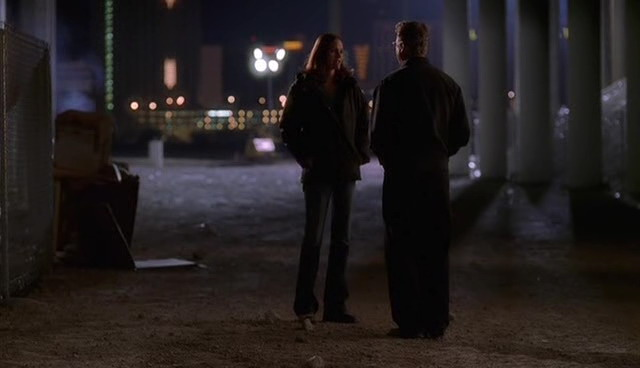

虽说是为寻找线索吧…你是下意识表白的么？

```text
GRISSOM:  I'm not playing.  I've got a gal named Sara, and she would love that scarf.  
  What do you say?  
(GRISSOM takes off his jacket and holds it out to the man.)
GRISSOM:  Trade me.
```

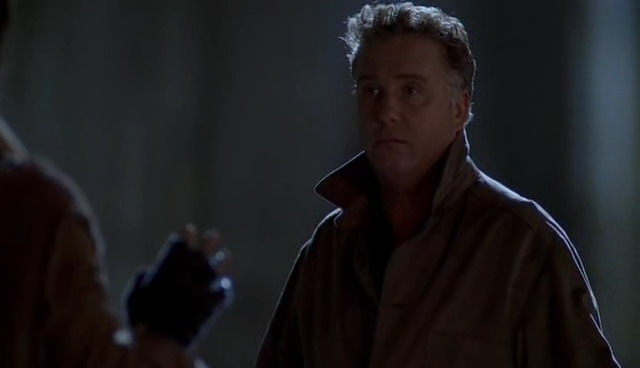

↑竖起衣领，走路左摇右晃…
Grissom瞬间Richard Chance即视感！（Richard Chance ——「To Live And Die In LA」男主）

//////////////////////////////

然后、那个、Grissom你怎么有吸引嫌犯掐死你的体质= =

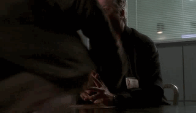

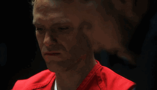（4x18）

//////////////////////////////


结尾处用了Grissom的一段独白，William Petersen的声音真心适合念旁白呢~

-Season2 END-