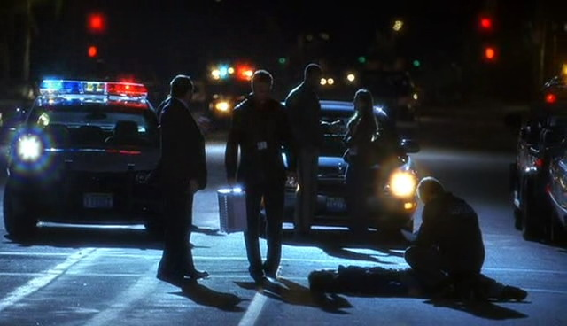

import Highlight from '@site/src/components/Highlight';

import stare1 from "./03/csi.3x01.reveng[00_03_35][20151024-185924-0].jpg";
import stare2 from "./03/csi.3x01.reveng[00_03_35][20151024-185943-1].jpg";

import shock1 from "./03/csi.3x02.the_ac[00_20_57][20151024-185632-0].jpg";
import shock2 from "./03/csi.3x02.the_ac[00_20_59][20151024-185638-1].jpg";

import greg1 from "./03/csi.3x23.inside[00_30_58][20151026-233437-4].jpg";
import grissom1 from "./03/csi.3x23.inside[00_31_17][20151026-233539-6].jpg";

import grissom2 from "./03/csi.3x23.inside[00_34_34][20151026-234737-9].jpg";
import cath1 from "./03/csi.3x23.inside[00_34_37][20151026-234743-0].jpg";

### 「Boss的绝地大反攻」
「3x02」

好久没碰到这么难缠的案子了。
倒不是嫌疑人有多聪明，而是嫌疑人比较有钱，于是雇了一些难缠的帮手，比如Grissom的导师…
简直是霉运不断的一集，CSI们的一些瑕疵、失误被集中、放大然后成为被攻击的对象。
并且，Grissom的耳疾更加明显了…


Warrick被指责因为救人时疏忽导致运送中的证物有可能已污染以及自身有赌博问题；
Nick忘了给证物贴标签；
Catherine被怀疑取证的技术能力；
Sara甚至连之前帮Grissom擦脸的事都被翻出来说（看着气死人，私生活被扯出来质疑职业能力…）
简直有一种好人队伍里出了叛徒害得正义的一方节节败退的错觉。（那个…神盾局的影子怎么慢慢浮想出来…）

在大家各种被打压、开始急躁、情绪激动的时候，有一个人，依旧如定海神针一样沉着冷静的坚守着自己的要守护的荣誉，即使他还有点儿生活在自己的小世界里面吧。

Catherine已气疯，因为从Cath姐姐的角度看，Grissom不上法庭辩论=没有和大家一起并肩作战嘛（何况大家战的真么惨烈）。
当然对话又演变成Cath blah blah balh，Grissom根本没有在听然后转移话题= = 噗…

其实Grissom是怕耳疾的事影响证据的可靠性 （好想摸摸头…）。

嘛，最后还是要boss出手祭出决定性证据，杀手锏总要留到最后呐~

虽然被导师抓到耳疾的弱点（简直快变成"正当"人身攻击了），Grissom在法庭上一度被耍无法继续陈述，不过好在咱们boss就是这么棒，"我会唇语我怕谁"的来了一把绝地反击，把被告律师说了个哑口无言，并再度受到导师的称赞。


那份优雅、那份从容、那份镇定~还有带着手下完胜离开的自信~好痛快！


（据说Grissom母亲失聪的背景设定，是来自William Petersen的真实生活，编剧听说之后，就把这段加到了人物背景里。让Grissom不善与人交往有了更合理的理由。
无法想象那是怎样一种孤寂的生活状态，但是让我更喜欢William Petersen了。）

***********************

### 「你是吃醋了么？」
「3x03」

虽然没有那么明显，但总觉得自从蛛丝马迹显示Sara和Hank有暧昧关系之后，Grissom就不、是、很、高、兴。

比如3x01 Hank要Warrick帮忙跟Sara打招呼，Grissom就使劲看（瞪？）人家

<div style={{ display: "flex", gap: 12 }}>
  
  
</div>
<br/>

3x02 Sara被指出和Hank有暧昧关系会影响证据可靠性，Grissom虽然帮忙挡了，但那是啥表情…
好像是听说Sara和别人好上了就灰、常、不、开、心
(好吧，也有解释说是吃惊&失望于Sara的私人关系可能会危害案子)

<div style={{ display: "flex", gap: 12 }}>
  
  
</div>
<br/>

这集又"任性"把Sara从轮休中找回来…然后派去solo…..

```text
SARA:  (to GRISSOM)  I am so sorry.
(GRISSOM looks at his watch.)
// highlight-next-line
GRISSOM:  I paged you two hours ago. 
SARA:  Right. Uh, it's my day off.  I was up in Pahrump at some vineyard.  
  You told me to get a life, remember?
(SARA smiles at GRISSOM..  GRISSOM doesn't return the smile.)
// highlight-next-line
GRISSOM:  Did I? 
(SARA'S smiles slowly fades.  GRISSOM doesn't say anything for a moment.  
  He pulls out his orange-tinted goggles from his kit.)
// highlight-next-line
GRISSOM:  I'm sorry, but I needed you.  Dispatch called in a 419 at Tuscadero High School.You're on your own.
(At any other time, SARA would jump at the chance.  
  Under these circumstances however, this doesn't please SARA the least.)
SARA:  On my own?

(GRISSOM looks back up at SARA.  Their eyes meet.)
// highlight-next-line
GRISSOM:  Solo.
```

（同人梗一致认为Grissom是因为嫉妒才这么做，而且灰常混蛋= = 
我觉得也可以解释成确实人手不够而Grissom又很信任Sara，不过他的语气确实表现得很不nice，所以我还是表示同意同人梗~）


虽然你对Sara姐姐这么不好，人家还是愿意和你说说话，可惜关键时刻你竟然什么也说不出来…（夸人家办案得力就算道歉了么？！）


PS：Grissom在这集干了第二件很坟蛋的事..拿Greg做人体实验= =

***********************

### 「你吓我一跳，我吓你一跳」
「3x05」

于是这集就是大家互相吓来吓去么，噗哈哈哈…

先吓吓Greg


再吓吓Grissom


***********************

### 「善用恭维」
「3x09」

Grissom不知道和谁约会去了，难怪穿了件这么显身条儿的漂亮大衣~



看看3x05那夹克选的…脸虽然还是那么帅，但是肚子快装不下了…（扶额…）


虽然Grissom不擅长奉承上面的人，但是对下面的人还是操纵得妥妥儿的，比如需要Greg优先给自己干活儿的时候，那真诚热切的小眼神儿&诚恳温柔的告白~Greg绝对受不了！
（平时明明总是凶人家= =）

```text
GREG:  Look, I don't have time for your humor.  
  Ecklie's got a multiple, Warrick tells me his home invasion is my top priority 
  and I'm still backed up on Catherine's no-suspect rape.  
  One servant, many masters.  You know what I'm saying?
// highlight-next-line
GRISSOM:  Greg, this is your DNA lab.  You are the master.  We serve you.
GREG:  Well, your stuff just moved to the top of the pile.
```


计谋得逞就笑这么开心，你今天心情是有多好？


哄完Greg就去哄Sara姐姐…
blahblahblah说一堆其实没用，一句<Highlight color="#ffb6c1">「I need you」</Highlight>足以让Sara笑成一朵小花~

```text
// highlight-start
GRISSOM:  Well, I'm sorry, but everyone seems to have something to do today.  
  I have a teenager who was run over by a taxi.  He wasn't hit by it; that's not what killed him.  
  He was stabbed, fatally.  For now, I have no ID, no suspects and no primary crime scene.  I need you.
// highlight-end
(SARA smiles.)
SARA:  How can I help?
```


你不是刚约会去了吗，这么公然调情Sara真的好吗？！还是说其实你根本是无意识地说这些！

```text
// highlight-next-line
GRISSOM:  Burnt skin is useless for DNA.
SARA:  Yeah, but, what about sweat?  There's a 17% chance of DNA recovery from the shooter's perspiration.
// highlight-next-line
GRISSOM:  17%?
SARA:  Yeah.  New paper out of Australia.  
  You haven't seen it?  (reciting)  17% chance of DNA recovery from the grip of a gun, 
  67% chance from a cigarette, 32% chance from the brim of a hat.  Would you like a copy?
// highlight-next-line
GRISSOM:  I don't need one.  I have you.  (beat)  Swab the pistol grip; get it to DNA.
(GRISSOM stands up and walks away.  
  SARA sits there staring in the direction GRISSOM just left.  She shakes her head.)
```


这集里面Grissom的说服术一定能升个2、3级，Warrick躺好！Sara，You don't trust me?

```text
// highlight-next-line
GRISSOM:  (to WARRICK)  What do you weigh?
WARRICK:  Uh, that's between me and my trainer.
// highlight-next-line
GRISSOM:  Do I have to get a scale?
WARRICK:  A buck 95, give or take a doughnut.

(GRISSOM turns and looks at SARA.  SARA responds without lifting her head from her file.)

SARA:  Don't even ask.  I'm not telling you.
// highlight-next-line
GRISSOM:  Warrick, would you lie down on the floor?
WARRICK:  I don't get paid enough to play dead.
// highlight-next-line
GRISSOM:  Please?

(WARRICK sighs.  He gets off his chair and lies down on the floor.)

// highlight-next-line
GRISSOM:  Sara, grab Warrick's right arm.  See if you can drag him across the room.
SARA:  This does have something to do with the case, right?
// highlight-next-line
GRISSOM:  You don't trust me?
```


不过这之后突然发生了什么，竟然到3x22你都没有正经和Sara姐姐一起调查案子！明明之前都喜欢跟她一起！（因为在意自己的耳疾？）
然后Sara姐姐就被炸伤了= = 你又跑去叫人家honey….这是有多纠结的感情…
（当然被炸飞的Greg更可怜= =）

***********************

### 「哎，每个人都要在他心口戳一下，Grissom好可怜」
「3x13」

被自己最喜欢的CSI说没感情，太伤了…（想摸头）

```text
// highlight-next-line
GRISSOM:  The job, Warrick, is to process evidence.  Objectively, and without prejudice.
WARRICK:  I'm so tired of hearing that.  I've heard it a million times.  
  I can't be like you.  I'm not a robot, okay?  
(This surprises GRISSOM.)
WARRICK:  I actually care about these people.
```


把Warrick撤出案子叫他去冷静头脑，不过脏活儿累活儿没人干了好不方便…
这销魂的一跳~


实验室里还是Greg最好欺负，没事儿调戏一下~

```text
GREG:  All work and no play make Greg a dull boy ...
// highlight-next-line
GRISSOM:  All play and no work make Greg an unemployed boy.
```


***********************

### 「每次有Lady Heather就会暧昧个不停」
「3x15」

Lady Heather又有气质又有头脑，把Grissom猜得透透的…
所以你真是挺喜欢她的吧！轻声细语的调情不说，还、还动手了！

```text
LADY HEATHER:  (smiles)  I'm flattered.  But you already seem to know the answers to your questions.  
  You keep me in proximity when I walk away and when I'm close ... 
  (she takes a step closer to GRISSOM)  .... 
  you watch my lips.  Are you losing your hearing?
// highlight-next-line
GRISSOM:  I'm losing my balance.
LADY HEATHER:  Your sense of self?
// highlight-next-line
GRISSOM:  No.  I know who I am.
LADY HEATHER:  Do you?
// highlight-next-line
GRISSOM:  (nods)  (quietly)  Yes, I do.  

(He reaches out a hand and brushes the hair away from her face.  
  She closes her eyes for a moment.  She opens her eyes.  
  GRISSOM reaches out to her with both hands framing her face.)  
// highlight-next-line
GRISSOM:  You can always say stop.
LADY HEATHER:  So can you.
```


PS：William Petersen估计和摄像交情不错，看片花其实这会儿已经有点儿胖了…但正片儿这几个镜头完全还是花美男！

可惜，因为case又搞砸了一段浪漫 = =
在警局Lady Heather虽然在和Brass说话，但句句都是冲着镜子后面的Grissom，理性中满满的难过和气愤。


Lady Heather恐怕是不能容忍不信任的…女王是要完全压制才能称为女王的。
包括后来6x15的那个拥抱，女王没法在Grissom面前取得所有的主权，所以才不会爱、只能是朋友么。
（Lady Heather在7x23中说，她觉得在Grissom面前毫无隐私，而在那一晚她也不只失去了女儿。而Finale里女王冷漠的说她并不爱Grissom。）

/////////////////////////////////

对于Grissom和Lady Heather…同僚们是各种吐槽啊（3x15）

```text
BRASS:  Oh, I know that look.  We're going back to Lady Heather's.
// highlight-next-line
GRISSOM:  I can take care of this myself.
BRASS:  Gil, do me a favor, get a sports car.  It's a lot cheaper and easier to handle.
```

***

Sara不着痕迹的问Catherine关于Lady Heather的事（7x23）

```text
SARA： What is she like?
CATHERINE：Beautiful... smart, intense... charming.. The only woman I've ever seen rattle Grissom. 
  I mean, he kind of liked that forensic anthropologist, Terry Miller. Remember her?
SARA：Yeah.
CATHERINE：But she wasn't enough of a challenge for him.  
  Heather, on the other hand... uninhibited and can beat him at mental chess.  They had chemistry. 
  And he is a scientist. 
  I have no proof and I know he'd never tell me, but I'm certain they spent the night together.
(Sara僵住了= = Grissom回家可能要倒霉…)
CATHERINE：Wonder which one wore the chaps.
```

(Sara赶快转移话题= = 太尴尬了…可惜Cath正聊到兴头…笑死了)

/////////////////////////////////

再去Lady Heather家，明显女王生气了，还要Brass出来打圆场= = 、
看，你一个人根本搞不定…

```text
// highlight-next-line
GRISSOM:  I'd like to come in.
LADY HEATHER:  Of course you would.  Say the magic word.
(BRASS steps into view.)
BRASS:  Warrant?  (beat)  We don't have one.
```


拒不接受道歉！
Grissom也不敢再去道歉第二次 = =

```text
// highlight-next-line
GRISSOM:  I owe you an apology.
LADY HEATHER:  Apologies are just words.
```


***********************

### 「时机不对，真是时机不对」
「3x22」

实验室爆炸了，Greg被炸飞了，Catherine被上面停职了，耳疾又严重了，Sara鲁莽的跑去抓嫌犯…又突然跑来约自己…
突然世界全乱了，结果只能说出那种蠢话…

```text
SARA:  Would you like to have dinner with me?
(GRISSOM stops.)
// highlight-next-line
GRISSOM:  No.
SARA:  Why not?  Let's ... let's have dinner.  Let's see what happens.
// highlight-next-line
GRISSOM:  Sara ...
(GRISSOM pauses and sighs.)
// highlight-next-line
GRISSOM:  I don't know what to do about this.
SARA:  (nods)  I do.
(They look at each other.)
SARA:  You know, by the time you figure it out, you really could be too late.
```


纠结死了，又不是能说出烦心事的那种人…憋死自己、害她误会、急死观众…
（不过觉得剧情处理有点儿跳跃，剧里Sara没有和Grissom共同处理案子有12集，Hank被发现花心过了4集，然后Sara姐姐突然想明白自己其实是喜欢Grissom，又被叫honey所以就决定告白了？）

***********************

### 「瞒不住了」
「3x23」

虽然Grissom各种假装没事，耳疾的症状却愈发严重，对Catherine这样火眼金睛的，马上就要瞒不下去了

```text
CATHERINE:  (muffled)  How long have we known each other?
// highlight-next-line
GRISSOM:  In days, months, or years?
CATHERINE:  I'm serious here.
(CATHERINE levels GRISSOM a look.)
CATHERINE:  (muffled)  Can you hear me?
```


然后，Grissom终于对法医爷爷说了实话，根本是鸵鸟心态！

```text
ROBBINS:  Boy, I wish you'd come to me sooner.  
  Your condition's pretty far along.  Why did you wait?
(GRISSOM sighs.)
// highlight-next-line
GRISSOM:  I hoped it would go away.
```


啊啊啊，不过你虽然听不清楚却还不忘记卖萌！
饼干为什么不好好吃掉！叼着研究证据算神马…观众会出戏呀！


对Greg是感同身受么，这回好温柔（不过看Greg那可怜的puppy eyes，不温柔点儿也不忍心）

```text
// highlight-next-line
GRISSOM:  Greg, your hands are shaking.
GREG:  No, they're not.
(Concerned, GRISSOM takes the paper from GREG.)
// highlight-next-line
GRISSOM:  Hold your hands out.
GREG:  Uh ... they've been shaking ever since ... 
GREG:  I can't really make it stop.
// highlight-next-line
GRISSOM:  Is it affecting your work?
GREG:  (chuckles)  Well, if I was a bomb expert, maybe.  
(GRISSOM doesn't laugh.)
GREG:  No, I ... I think I have it under control. 
// highlight-next-line 
GRISSOM:  It'll stop.  If you need me, I'll be around.
GREG:  Okay.
```

<div style={{ display: "flex", gap: 12 }}>
  
  
</div>
<br/>

Catherine是可以信任的好朋友，可是谈到自己的问题还是各种不自在…Grissom你在这方面是有多内向…

```text
// highlight-next-line
GRISSOM:  I'm scheduled for surgery at Desert Palm.
CATHERINE:  Surgery?  
CATHERINE:  Your hearing?
// highlight-next-line
GRISSOM:  (nods)  Yep.
CATHERINE:  I'm sorry.
// highlight-next-line
GRISSOM:  I'm not.  Has to be done.
CATHERINE:  What can I do?
// highlight-next-line
GRISSOM:  Nothing.  I'm fine.  Take care of the case.
CATHERINE:  Oh, eh, mm ... that's it?
// highlight-next-line
GRISSOM:  That's it.  Um ... (he thinks about it) ... good luck.
(GRISSOM leaves the room.  CATHERINE stands there and shakes her head.)
```

<div style={{ display: "flex", gap: 12 }}>
  
  
</div>
<br/>

就算Grissom再怎么故作坚强，手术之前好朋友来祝福自己，总还是很感动的~
说话都变好小声…Catherine会不会想要捡回去养啊= = 请一定让我来….

```text
CATHERINE:  Hey.
(GRISSOM turns to look at her.)
// highlight-next-line
GRISSOM:  What are you doing here?
CATHERINE:  I just wanted to see you.  And I didn't want you to go in without wishing you good luck.
(Behind CATHERINE, The transporter appears with the wheel chair for GRISSOM.  
// highlight-start
GRISSOM stands up and walks up to CATHERINE.)
GRISSOM:  Thank you ... for being here.
// highlight-end
(CATHERINE reaches out and hugs GRISSOM.  They look at each other.)
// highlight-next-line
GRISSOM:  (to the transporter)  I don't need that.
```


大概是觉得坐轮椅自尊心受挫，所以坚决不要。不过…你这么走过去pp不会被看光吗！！
（完了，我竟然只能想到这些…）


-Season3 END-

PS: William Petersen年轻时候真是拍了各种的…床（裸？）戏…包括重口味…
「To Live And Die In LA」、「Manhunter」、「Fear」、「Gunshy」、「Kiss The Sky」…
到底被多少女演员看过…

好、想、看、啊！
