import grissom1 from "./04/csis4ep01[00_29_30][20151027-230553-4].jpg";
import nick1 from "./04/csis4ep01[00_26_33][20151027-230444-1].jpg";

import shoot1 from "./04/csis4ep02[00_41_04][20151028-221229-2].jpg";
import shoot2 from "./04/csis4ep02[00_41_31][20151028-222027-6].jpg";

import greg1 from "./04/csis4ep02[00_17_02][20151028-212625-5].jpg";
import greg2 from "./04/csis4ep02[00_17_12][20151028-212641-6].jpg";

import sara1 from "./04/csis4ep03[00_40_48][20151028-230745-0].jpg";
import grissom2 from "./04/csis4ep03[00_41_01][20151028-230816-2].jpg";

import sara2 from "./04/csis4ep12[00_02_29][20151030-213629-3].jpg";
import grissom3 from "./04/csis4ep12[00_02_31][20151030-212733-2].jpg";

import grissom4 from "./04/csis4ep12[00_19_26][20151030-222256-5].jpg";
import grissom5 from "./04/csis4ep12[00_19_53][20151030-222845-6].jpg";

import grissom6 from "./04/csis4ep12[00_42_36][20170325-121347-8].jpg";
import sara3 from "./04/csis4ep12[00_43_22][20151030-231437-6].jpg";

import grissom7 from "./04/csis4ep13[00_35_38][20151031-212944-1].jpg";
import sara4 from "./04/csis4ep13[00_35_39][20151031-213026-4].jpg";

import grissom8 from "./04/csis4ep15[00_12_58][20151101-211617-1].jpg";
import cath1 from "./04/csis4ep15[00_13_05][20151101-211923-1].jpg";

import grissom9 from "./04/csis4ep20 18[00_19_25][20151101-231408-8].jpg";
import grissom10 from "./04/csis4ep20 18[00_22_21][20151101-231744-9].jpg";

import both1 from "./04/csis4ep21[00_24_37][20151102-233530-1].jpg";
import grissom11 from "./04/csis4ep21[00_27_16][20151102-233953-5].jpg";

### 「改变形象」
「4x01」

手术成功归来留了大胡子，形象一下子就改变了（William Petersen靠胡子塑造各种人物形象，真心是变化好大）
但是一开场就抛媚眼是怎么回事…

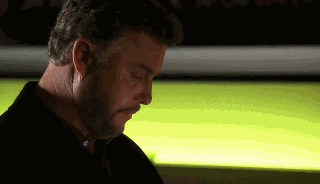

2021年他wink的更娴熟了！

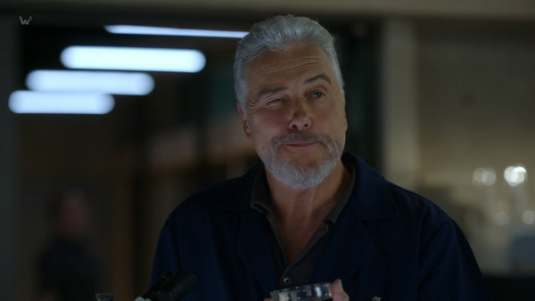 （Vegas 1x03）

Nick又闯祸了= = （这孩子真倒霉）
好不容易学会了"Murder Central"这个词，就大嘴透露给了一般民众，进而被媒体泄露，导致凶手变更作案习惯…
于是各种提心吊胆怕被Grissom削…
不过Grissom倒是越来越沉稳了，关门Nick，你怎么看Nick…..
几句话已经把孩子吓死了……

<div style={{ display: "flex", gap: 12 }}>
  
  
</div>
<br/>

然后人家舒舒服服做按摩床去了...（也是该休息一下了，收集冰块手都麻了嘛~）

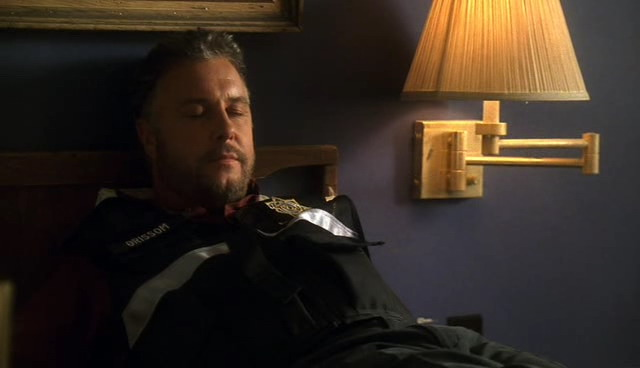

***********************

### 「Grissom枪法蛮准的！你们别唾弃他」
「4x02」

这集从一开始Grissom就被Brass以及一众警察各种唾弃、说他是那种不配枪的平民不懂得警察的辛苦…
是因此心有怨气还是怎地，Grissom这次也有点儿心急地妄自揣测了一把嫌犯，还差点儿和Brass吵起来，后来又被暴脾气的警察叔叔威胁 = =

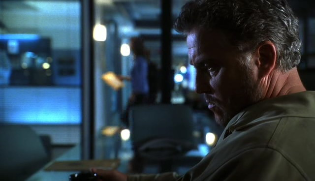

↑发现自己找错嫌犯好沮丧

虽然最终破了案子，但结局还是很让人消沉…于是，他跑去打靶了！果然被吐槽得不开心了吧！（拿枪的姿势其实特别帅！枪法也很准！！明明就是深藏不露！）

<div style={{ display: "flex", gap: 12 }}>
  
  
</div>
<br/>

除了警察，Sara姐姐是不是也开始唾弃Grissom了= =
还是想到如果和Grissom合租公寓最后会把持不住？

```text
CATHERINE:  Whoa, this isn't half bad for college kids.
SARA:  Yeah. Why live in a one-room flea bag when you can pool your resources and live like this.
CATHERINE:  Hey, how 'bout it: You, me, Warrick, Nick, Grissom ... 
// highlight-next-line
SARA:  (shakes her head)  Oh, nnn ... Not Grissom.
```

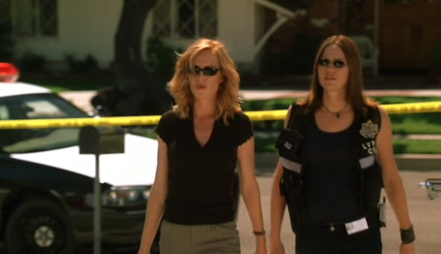

这集要纪念Greg第一次被要求出现场，虽然纯打杂= =
（之前自己主动出外勤的那次虽然表现不太好~不过这次立功啦，还成功阻止了Grissom和Brass 的争吵，真是好孩子！）

```text
NICK:  What do you think?  
// highlight-next-line
GRISSOM:  Who do we have around here that could find us a somewhat used soda bottle?
(They all look at each other, then they turn 
  and look back at GREG who's working quietly in the next lab behind them.  
  He looks up and finds them staring at him.)
```

<div style={{ display: "flex", gap: 12 }}>
  
  
</div>
<br/>

***********************

### 「所有人都受伤了」
「4x03」

这集也是不喜欢的剧集之一，因为最终善良无辜的一方仍然被伤害、坏人却逍遥法外。

她受伤了，他也愤恨自己的无能为力。

<div style={{ display: "flex", gap: 12 }}>
  
  
</div>
<br/>

***********************

### 「吃惊」
「4x05」

让Grissom各种吃惊的一集…下巴快掉了…

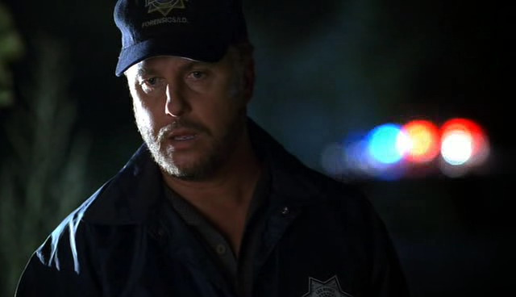

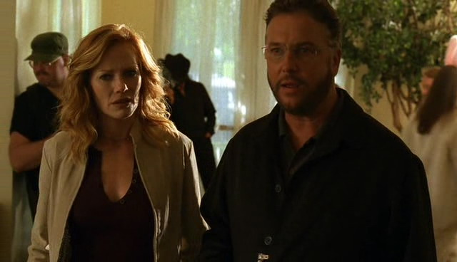

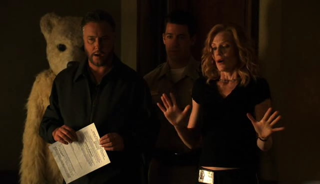

Tumblr上有很多人认为Grissom反戴帽子很可爱~我倒是比较喜欢看他呆掉的样子~

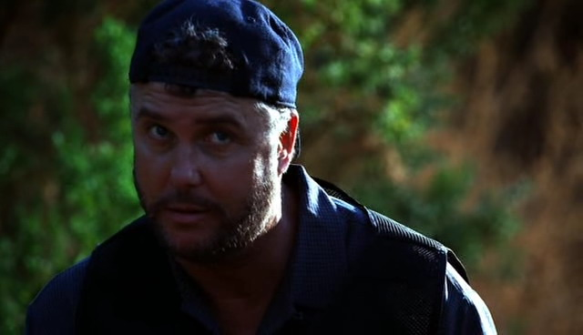

***********************

### 「Grissom也是会耍小手段的」
「4x06」

为了第一时间拿到”奇怪尸体”的情报贿赂David；为了躲case review就跑到偏远山区。
然后还学会幽默了…

```text
CATHERINE:  Is the service actually bad out there or are you just keeping your phone off?
// highlight-next-line
GRISSOM:  I'm sorry.  I should've called. 
CATHERINE:  This trip wouldn't have anything to do with you ducking case reviews, now would it?
// highlight-next-line
GRISSOM:  How can you think that?  You wouldn't mind taking care of those for me, would you? 

（谁不这么想？Catherine肯定想掐死他 = =）

CATHERINE:  Oh, your job, my pay.  Why would I care?
// highlight-next-line
GRISSOM:  I'll make it up to you.
CATHERINE:  Yeah, you had better.  

(CATHERINE reaches GRISSOM'S office and her jaw drops at the stacks of files 
  on his desk that he needs to review.  
  The desk is a mess.)

CATHERINE:  Hodges ID'd your leaf litter.
// highlight-next-line
GRISSOM:  Good. Thanks.  I owe you one.

(GRISSOM hangs up.)  

ALAN BROOKS:  Trouble with the wife?
// highlight-next-line
GRISSOM:  Yeah.  She hates it when we're apart.

(He shrugs.)
```

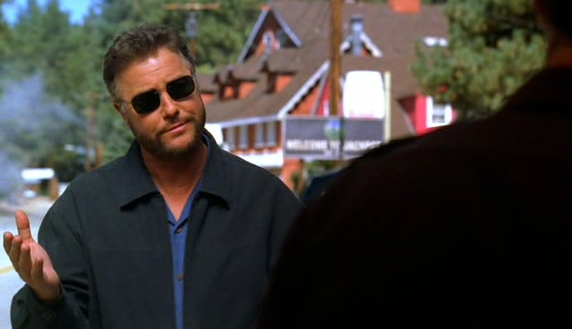

还吐槽人家Sara三天不用睡觉，你工作狂起来明明也是一样…
开了一夜车，爬了一天山，到了晚上还是只想着破案 = =

```text
ALAN BROOKS:  You boys have a good night.
DALE STERLING:  (murmurs)  Man.  It was one hell of day.  You need a place to sleep?
// highlight-next-line
GRISSOM:  I need a place to work.
```

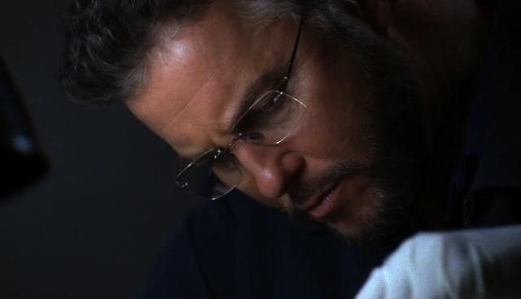

出门在外总算知道带枪了！有点儿感动 = = 

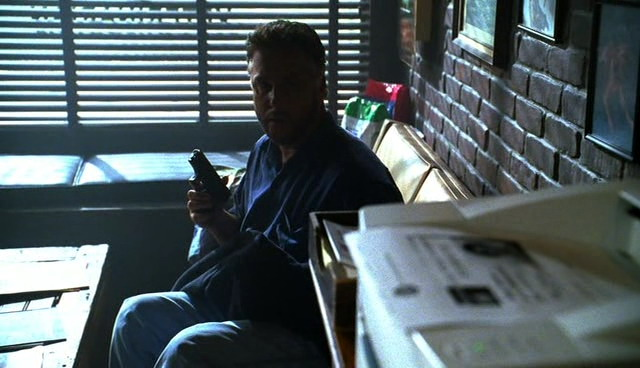

真正的科学家才不会因为工具被偷就干不了活儿呢~啊啊~就地取材神马的太帅~

```text
// highlight-next-line
GRISSOM:  (sarcastic)  Oh, good, the police.  I'd like to report a crime.
ALAN BROOKS:  No kidding?
// highlight-next-line
GRISSOM:  Yeah, my vehicle was broken into and my field kit was stolen.
ALAN BROOKS:  That's going to cramp your style.
// highlight-next-line
GRISSOM:  Not necessarily.
```

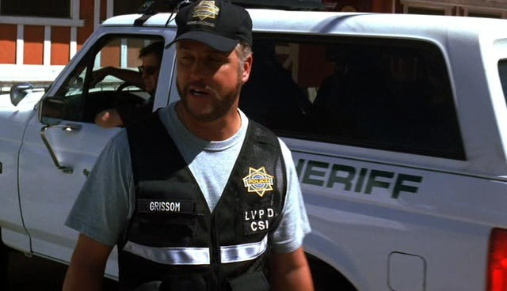

***********************

### 「领导范儿」
「4x07」

案子很急，于是反对意见一律驳回，即使是她（坚决的样子灰常帅）

```text
// highlight-start
GRISSOM:  This is a rush case.  Everyone's in the pool for 24 hours.  
  Warrick, you need to see Robbins.  Have him walk you through his notes on the autopsy.  
  Nick, Sara, the Judge issued a warrant for Fife's vehicle.  Detail is towing it back to our garage.
// highlight-end
NICK:  Hold on.  Warrick's already searched the car and the knife's been excluded.  
  What exactly are we hoping to find?
// highlight-start
GRISSOM:  I don't know.  But the knife and the towel are invisible evidence.  
  The jury will never see them.  So we have to find something that's visible.
// highlight-end
SARA:  Uh, listen, I recognize the importance of this, but I'm in the middle of my own homicide investigation.
// highlight-next-line
GRISSOM:  I'll talk to your detective.  Explain the deal.
SARA:  Well, it's not about the detective.  It's about my own responsibility.
// highlight-next-line
GRISSOM:  (firmly)  I'm handing out assignments, Sara.  It's not a negotiation.
```

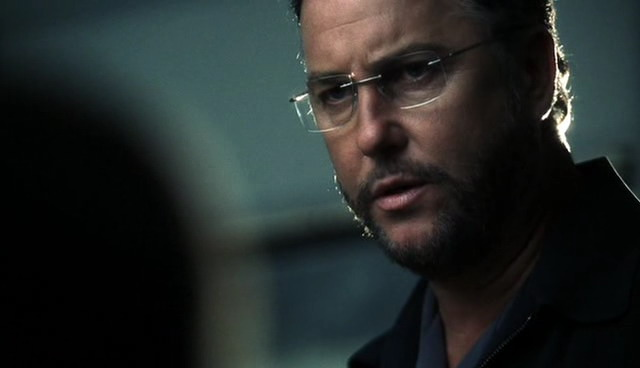

然后，你更爱这份工作了没有？

```text
// highlight-next-line
SARA:  Pin me down.
(GRISSOM takes a step forward.  
  He holds SARA'S wrists and pushes against her as she pushes back to illustrate what she's thinking.)
SARA:  She would have struggled.  Then, she gave up.  
  Afterward, when he got up, he put his hands on the sheet for leverage.
(After a moment, GRISSOM releases SARA'S wrists and places his hands on the sheet near her waist.)
// highlight-next-line
GRISSOM:  Like this.
(SARA nods.)
// highlight-next-line
GRISSOM:  Which explains how the wax got from him to the sheets.
(SARA turns to look at GRISSOM.)
SARA:  Yes.
(For a moment, the two are standing there.  SARA takes a breath and breaks the moment.  
  She puts her hands down and steps away from the sheet - away from GRISSOM.)  
```

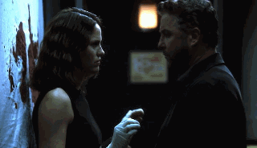

火花四溅，可惜回过神来，Grissom就对Sara所说的话各种做不出反应，扶额…
内敛得让女孩子这么尴尬…简直叫人又爱又恨…（别没事儿老对着Sara惊慌失措嘛）

```text
SARA:  Well, you know, I applied for the promotion for the key position.
// highlight-next-line
GRISSOM:  (nods)  Your application's on my desk.
SARA:  About that -- I, um ... I needed to know ... 
  (she stops)  ... I ... I wanted to make sure, rather, 
    that anything that happened or didn't happen between us won't be a factor.  
(A little lost at what she's saying, GRISSOM doesn't say anything.  
  Awkward, SARA breaks the silent patch.)
SARA:  Never mind.  I-I shouldn't have said anything.  
(GRISSOM still has a stunned look on his face, just staring at SARA and what she's asking.)
SARA:  (smiles, embarrassed)  I, um ... I'm always over-talking around you.
(SARA turns and leaves the lab, escaping.)
```

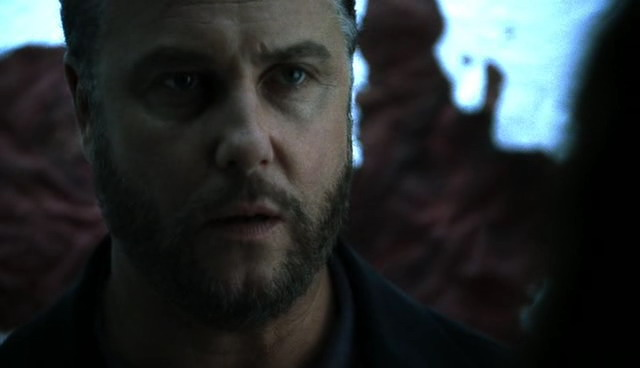

当案子终于顺利解决，马上恢复成慈父脸，温暖…

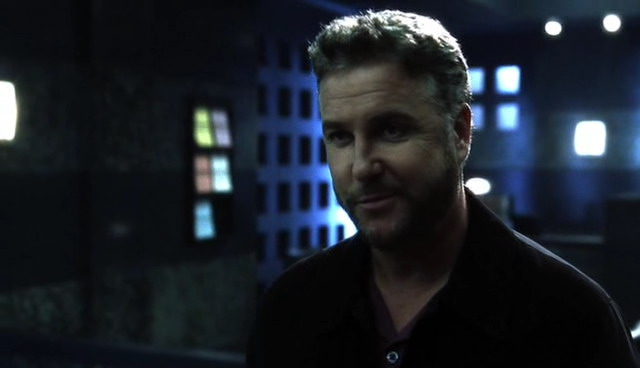

***********************

### 「主管不好当」
「4x08」

刚有点儿领导范儿了，"孩子和妈"吵架，还是有点儿hold不住呀…

事实说明…别随便插嘴别人吵架，你不适合…（笑，瞬间变弱势…

```text
NICK:  The original missing persons call was mine and Sara's.
CATHERINE:  I'm the Senior CSI here.
// highlight-next-line
GRISSOM:  Uh-uh.  I'm the Senior CSI here.
CATHERINE:  You want it?
```

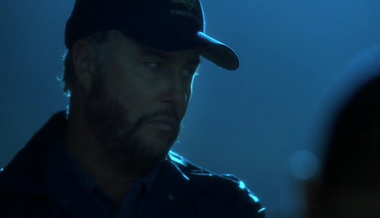

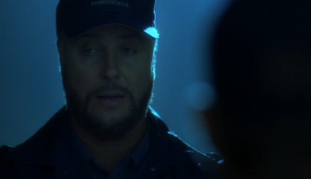

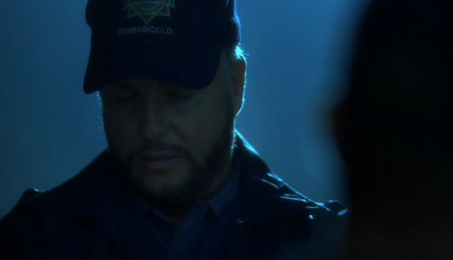

***********************

### 「不经意的勇敢」
「4x09」

一开场就碰上汽车爆炸，Grissom基本是反射性用自己的身体挡住Catherine，快夸他！

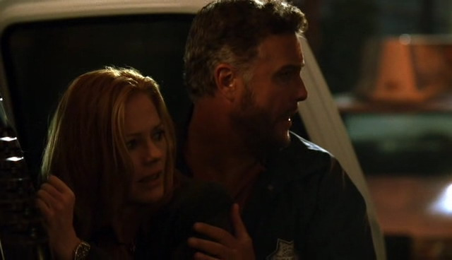

话说，看了这许多年罪案类的美剧，好想吐槽一下编剧，就那么喜欢交换杀妻（夫）和重婚的剧情么= =

***********************

### 「独白」
「4x12」

受害者太像Sara了，像得令他有些惊慌…像得令他只想牢牢地把Sara印到自己眼里…确认她还是鲜活的…

<div style={{ display: "flex", gap: 12 }}>
  
  
</div>
<br/>

在受害人的卧室里，他好像看到Sara坐在那里，神游之际突然接到Sara的电话，害他紧张得甚至口吃起来…

```text
// highlight-next-line
GRISSOM:  Grissom.
SARA:  (from phone)  Hey.
(Startled, GRISSOM realizes whom he's talking to and is thrown a little off-balance.)
// highlight-next-line
GRISSOM:  Sara, uh, listen, I'm in a bad area.  I'll call you back.
SARA:  I got a skin tag off the bathtub drain pipe.
// highlight-next-line
GRISSOM:  (distant)  Skin tag?  That's great.  Uh, give it to Greg.
SARA:  Yeah, I did.  Hey, do you want me to come over there and give you a hand?
// highlight-next-line
GRISSOM:  (faltering)  No, I-I'm fine.  I'll-I'll, uh ... I'll talk to you back at the lab.
```

<div style={{ display: "flex", gap: 12 }}>
  
  
</div>
<br/>

Grissom为了这个案子投入了极端的精力…工作16小时、跪碎膝盖、饿得只能吃被害人的存粮了（但仍然有一些奇怪的坚持…不拿民众一针一线么= =）

```text
CATHERINE:  Don't tell me you never went home?
// highlight-next-line
GRISSOM:  Okay.  I just got started in here.  Haven't even gotten to the other rooms yet.
CATHERINE:  You know you lose your edge after sixteen hours.  
  You're into your third shift.  I mean, I'm all for overtime, but this is just plain greedy.
// highlight-next-line
GRISSOM:  My knees can't take this anymore.
CATHERINE:  Have you eaten anything?
// highlight-next-line
GRISSOM:  What did you bring?
CATHERINE:  (shrugs)  I'll see what's in the fridge.
// highlight-next-line
GRISSOM:  (shouts)  We have to replace that, you know.
```

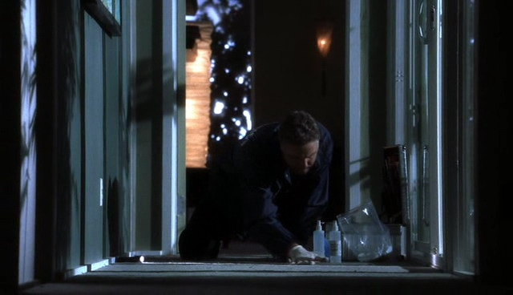

虽然付出了很多，但找到的证据终究太少，最终，拖着疲惫的身躯Grissom对嫌犯说了一番话，看似是在分析嫌犯动机，实则句句肺腑。
窗外的Sara看着如此悲伤的Grissom，心里…会痛么？
他坦白了，他不是不爱，是不敢爱…

```text
GRISSOM:  (quietly)  It's sad, isn't it, doc?  Guys like us.  
  Couple of middle-aged men who've allowed their work to consume their lives.
GRISSOM:  The only time we ever touch other people is when we're wearing our latex gloves.
GRISSOM:  We wake up one day and realize that for fifty years we haven't really lived at all.  
  But then, all of a sudden ... we get a second chance. 
GRISSOM:  (v.o.)  Somebody young and beautiful shows up.  Somebody ... 
GRISSOM:  ... we could care about.  She offers us a new life with her ... ... 
  but we have a big decision to make, right?  
    Because we have to risk everything we've worked for in order to have her.  
GRISSOM:  I couldn't do it ...
GRISSOM:  ... but you did.  You risked it all ... 
GRISSOM:  ... and she showed you a wonderful life, didn't she?  
  But then she took it away and gave it to somebody else, ... 
GRISSOM:  (v.o.)  ... and you were lost.  
GRISSOM:  So you took her life.
GRISSOM:  You killed them both, and now you have nothing.
VINCENT LURIE:  (nods)  I'm still here.
GRISSOM:  Are you?
```

<div style={{ display: "flex", gap: 12 }}>
  
  
</div>
<br/>

这可能是CSI里面最长的一段独白了，悲伤，浓烈的悲伤，用他低沉又忧郁的声线娓娓道来…真心疼他…

说道独白，觉得William Petersen很擅长独白，应该是舞台带来的经验吧。
如他在「In the Kingdom of the Blind the Man with One Eye is King」里面有一段近5分钟的台词，激情澎湃的骂了对方近5分钟啊~看完觉得他超级演技派！

***********************

### 「Grissom你真聪明」
「4x13」

Grissom还是聪明，在试着把自己捆起来的时候保证旁边有人救自己，不像Castle那么"蠢" = =

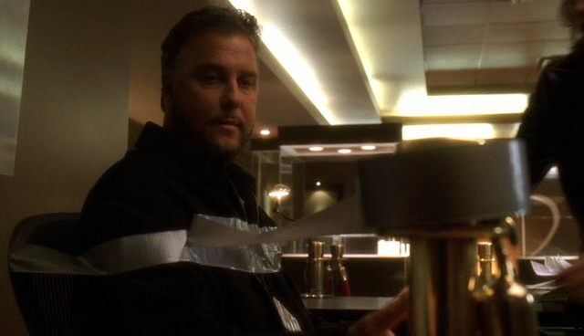

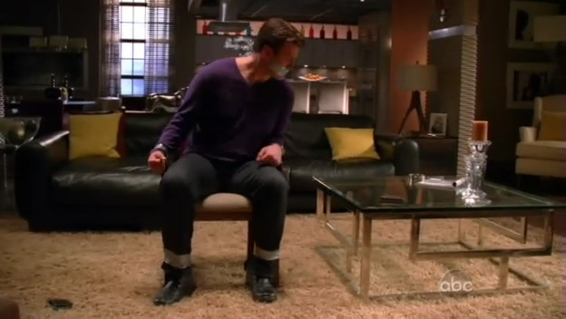 （Castle 2x12）

不过你别在Sara姐姐面前随便摆弄武器啊，就算是很帅气地摆弄也不好，会吓到人家的…

<div style={{ display: "flex", gap: 12 }}>
  
  
</div>
<br/>

于是在7x03 就有了有现世报（笑

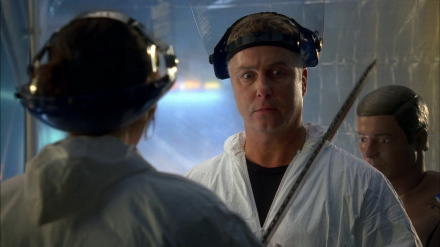

***********************

「Grissom又尴尬了」
「4x15」

在听到Catherine说起Sex的时候明明自己已经觉得很尴尬了，怎么就能接出这么一句…

```text
CATHERINE:  I ... write this down:  I haven't had sex in six -- no -- seven months.
(GRISSOM looks at CATHERINE.)
// highlight-next-line
GRISSOM:  (sighs)  How can I help?
(CATHERINE stares at GRISSOM, her eyes wide.)
// highlight-next-line
GRISSOM:  (awkwardly)  You. Advance, I mean.  
  Do you ... have any interest in changing sections in the lab, for instance?
```

<div style={{ display: "flex", gap: 12 }}>
  
  
</div>
<br/>

Catherine大概在想，这颗木头到底知不知道自己在说啥…

Sara从这集开始有被怀疑酗酒，可惜Grissom没能觉察到这点，倒是Brass发现了，还委婉地关心她。
(也有一说是Sara只是压力大才喝了点酒，而且她应该是下班之后喝了酒又被叫去出任务，倒不是有酗酒的问题，包括4x23她也只是没吃东西结果不小心擦到酒驾的边儿。5x01她有透露她没有酗酒，只是心里有个结解不开。)

***********************

### 「你有多想她？还是你忽略她太久？」
「4x16」

谜一样的一句话，参不透…

```text
(GRISSOM looks at SARA.)
SARA:  What?
// highlight-next-line
GRISSOM:  I haven't seen you for a while, have I?
SARA:  You see me every day.
```

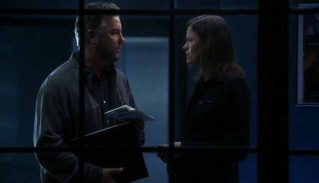

***********************

### 「调侃他的总是Catherine」
「4x18」

```text
CATHERINE:  You okay?
(He stops rubbing his neck and waves away her concern.)
// highlight-next-line
GRISSOM:  I'm fine.
(CATHERINE reaches out and looks at the reddish-burn/bruise on GRISSOM'S neck.)
CATHERINE:  Nasty.  That kind of looks like a hickey.  (She sighs.)  
  You want to tell me what got this party started?
// highlight-next-line
GRISSOM:  I scraped his nails.
```

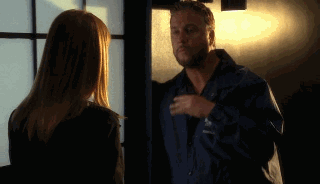

不愧是"中年夫妻"，有事儿没事儿就调侃一下。4x20也是，Catherine长跑中途发现Grissom擅自离开比赛路线，气得直接骂他是不是小解去了= =

不过，这次真心被掐的很惨…可怜死了…

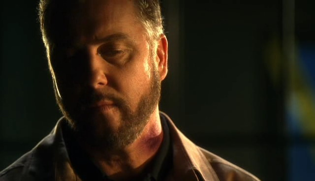

然后为了挡伤口开始带围脖、立领穿制服了~
怎么就能穿这么好看呢…

<div style={{ display: "flex", gap: 12 }}>
  
  
</div>
<br/>

***********************

### 「她帮他玩儿"拼字游戏"」
「4x19」

果然像Finale里面说的，Sara是拼字游戏的好帮手~

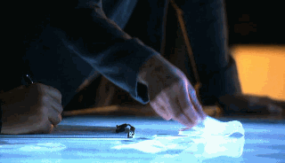

```text
GRISSOM:  She restores my faith in the human being. Plus... she helped me with my crossword puzzles.
```

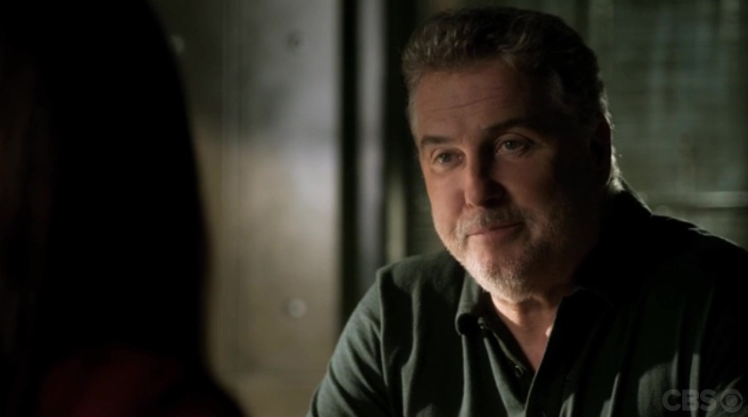 （CSI Finale）

***********************

### 「Grissom果然不会去跑马拉松 = =」
「4x20」

警察系统的大家都在参加马拉松，就想着是不是可以看到某人运动一下了，果然…他是开车的…
不过…给Catherine放什么乡村抒情音乐…你其实是来捣乱的吧….

```text
(Dissolve to:  CATHERINE runs the next leg of the race to sounds of Vangeliss' "Chariots of Fire".  
  She glances over at GRISSOM driving the car next to her.)
CATHERINE:  (irritated)  What the hell kind of music is that?
// highlight-next-line
GRISSOM:  Inspiration.
CATHERINE:  Sedative.
// highlight-next-line
GRISSOM:  Okay.
(He changes the radio station and a country song plays.)
LYRICS:
 Sitting single / drinking double ... 
// highlight-next-line
GRISSOM:  How's this?
CATHERINE:  How about something that doesn't twang?
```

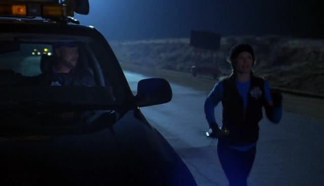

***********************

### 「你们两个聊得好开心，都不管别人么= =」
「4x21」

总觉得只有Sara能接上Grissom的话= = Nick，乖孩子你就别乱插嘴了…

```text
// highlight-start
GRISSOM:  "There are three things in human life that are important.  
  The first is to be kind; the second one is to be kind; and the third one is to be kind."
// highlight-end
SARA:  Henry James.
// highlight-start
GRISSOM:  Very good.  
  Author of one of the greatest horror stories ever written:  Turn of the Screw.  
  And I'm looking for one.
// highlight-end
(He holds up the baggie with the nut.)
SARA:  A screw?
// highlight-next-line
GRISSOM:  Yes.
NICK:  Oh, well ... technically, these are eccentric shafts, not screws.
// highlight-next-line
GRISSOM:  Well, as long as you can screw a nut on it, it's a screw.
SARA:  "Turn of the Screw" isn't really a horror story.  It's more of a mystery.  
  Did the governess kill the little boy, or did the ghost do it?
// highlight-next-line
GRISSOM:  Well, it's only a mystery if you believe in ghosts.
```

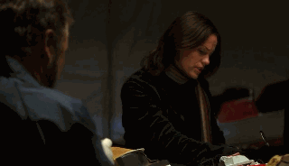

这算是不经意的说出心声么？笑

```text
(SARA and GRISSOM crawl under the platform.  
  WOODY starts to follow them, but GRISSOM stops him.)
// highlight-next-line
GRISSOM:  Uh, Woody?  We'd like to be alone.
```

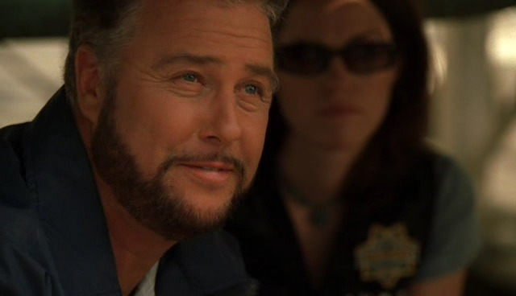

亲，你不能再吃垃圾食品了= = 快有Sara姐姐两个了…（虽然吃东西的样子还是很可爱~

<div style={{ display: "flex", gap: 12 }}>
  
  
</div>
<br/>

一说起有文化的话题，就，就这么…眉飞色舞么！
笑这么魅惑简直是犯罪…

```text
// highlight-next-line
GRISSOM:  How many names on the list?
SARA:  Well, in Clark County, twelve prescriptions were filled.  
  I cross-referenced them with the employees from the park, and I got a hit.  
  You want a clue?  Her death ended the Ptolemy dynasty's reign in ancient Egypt, 
  hence making her the last pharaoh.
// highlight-next-line
GRISSOM:  Ah, the lovely Cleopatra.
```

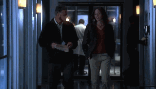

一说起过山车整个人都happy起来的Grissom，8.5季180多集CSI里面都没有几个露齿笑的镜头啊！（这还是算上Hodges的推理幻想那一集= =）

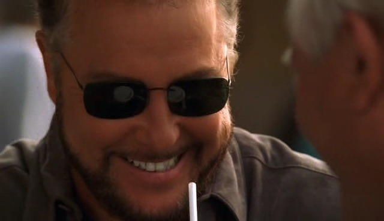

-Season4 END-