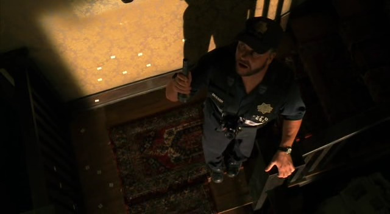
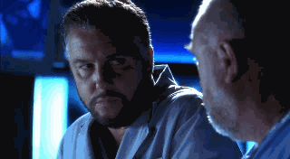
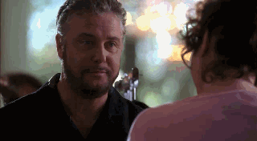
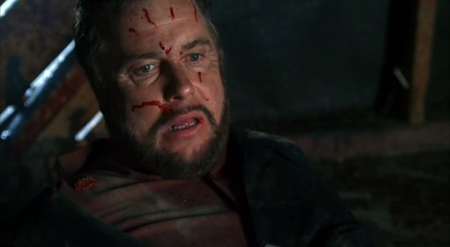

import sara1 from "./05/CSI.S05E01.DVDR[00_07_13][20151104-225959-1].jpg";
import grissom1 from "./05/CSI.S05E01.DVDR[00_07_01][20151104-230017-2].jpg";

import greg1 from "./05/CSI.S05E01.DVDR[00_19_55][20151104-223325-1].jpg";
import grissom2 from "./05/CSI.S05E01.DVDR[00_27_40][20151104-223354-4].jpg";

import grissom3 from "./05/CSI.S05E02.DVDR[00_08_23][20151104-234152-1].jpg";
import greg2 from "./05/CSI.S05E02.DVDR[00_08_21][20151104-234148-0].jpg";

import tie1 from "./05/tumblr_mstd07Lrg71s53zrdo1_250.gif";
import tie2 from "./05/tumblr_mstd07Lrg71s53zrdo3_250.gif";

import shock1 from "./05/sph-csi507[00_05_52][20151107-131745-1].jpg";
import shock2 from "./05/sph-csi507[00_06_03][20151107-131805-4].jpg";

import grissom4 from "./05/sph-csi507[00_12_11][20151107-132902-6].jpg";
import grissom5 from "./05/sph-csi507[00_12_24][20151107-132932-0].jpg";

import grissom6 from "./05/sph-csi509[00_40_33][20151107-174732-6].jpg";
import grissom7 from "./05/sph-csi509[00_43_00][20151107-174805-8].jpg";

import sara2 from "./05/CSI.S05E12.DVDR[00_13_49][20151107-201301-2].jpg";
import grissom8 from "./05/CSI.S05E12.DVDR[00_14_26][20151107-201342-3].jpg";

import grissom9 from "./05/sph-csi513[00_25_15][20151107-210700-5].jpg";
import sara3 from "./05/sph-csi513[00_25_17][20151107-210704-6].jpg";

import grissom10 from "./05/CSI.S05E21.PROP[00_31_36][20151108-222358-1].jpg";
import sara4 from "./05/CSI.S05E21.PROP[00_31_57][20151108-222424-3].jpg";

import grissom11 from "./05/CSI.S05E21.PROP[00_34_55][20151108-224106-7].jpg";
import sara5 from "./05/CSI.S05E21.PROP[00_34_56][20151108-224109-8].jpg";

### 「Greg就是拿来削的= =」
「5x01」

经过了第四季结尾的各种消沉氛围，第五季以充实的4件谋杀案开始，来了新人，Grissom的科学怪人模式也再开起来…（又要骗新人抽血！）

```text
// highlight-next-line
GRISSOM:  You're hot.
CHANDRA MOORE:  (startled)  I-I'm sorry?
// highlight-start
GRISSOM:  You're emanating heat.  (Grissom takes the hat off.)  
  This is a new infrared camera.  
  It's good for looking at evidence in the dark.  (to Greg)  Did you get her blood yet?
// highlight-end
CHANDRA MOORE:  My... (startled) ... why?
// highlight-next-line
GRISSOM:  So many reasons.
```


Sara在努力解决自己的问题，不过要主动找Grissom谈自己的黑历史果然会很紧张吧，对着镜子练习的样子略萌~可惜被Greg打断、又因为工作太忙计划搁浅…GSR注定仍然任重道远

<div style={{ display: "flex", gap: 12 }}>
  
  
</div>
<br/>

这次是Greg的最终水平测试，菜鸟CSI即将诞生~
导师Grissom携弟子闪亮登场~可惜弟子过于稚嫩各种犯错，于是Grissom的导师威严爆棚，各种削 = = （这孩子一没看住就…）

<div style={{ display: "flex", gap: 12 }}>
  
  
</div>
<br/>

不过果然是想要守护弟子的茁壮成长吧！慈父脸再现！


***********************

### 「人人都爱Greg」
「5x02」

觉得Greg是从出外勤开始慢慢转型成熟稳重的。孩子开始长大啦~
当然现阶段还是只青涩的雏鸟，大家都还很照顾他。
法医爷爷向他展示自己娴熟的解剖手法，Grissom在试探他会不会吐在验尸房，Sara关心他初试验尸的反应~包括之前Catherine指导他检查证据，Warrick教他如何做工作准备…这个Team好有爱~

<div style={{ display: "flex", gap: 12 }}>
  
  
</div>
<br/>

当然了，对乖孩子能利用就利用仍然是Grissom的作风…（仍然心疼Greg被感染的脚…

```text
(Greg returns.  He puts the filled specimen container on the counter.)  
// highlight-next-line
GRISSOM:  That took a long time.  You may need a prostate exam.
GREG:  My prostate is just fine.  I'm not a soda fountain.
// highlight-next-line
GRISSOM:  Hopefully you are, 'cause I need a number two as quickly as possible.
(Grissom takes out a larger plastic container and hands it to Greg.)
```


Sara拼命三郎模式全开，冒着被炸飞的危险卸掉了嫌犯家的门板，自己还没怎样，恐怕是先害Grissom各种后怕。
不过…说”甜言蜜语”的时候都不敢看人家姑娘是要闹哪样…

```text
SARA:  I don't have a death wish, and I'm not a drunk, in case you were worried.
// highlight-next-line
GRISSOM:  I'm not worried.  (beat)  I'm concerned.
(Grissom turns and walks away.  A small smile plays around Sara's lips.  
  He heads back to check on his experiment.)
```


哎，因为有了”前科”，结果房子里又发现爆炸物的时候，Grissom特意点名Sara快点儿跑~
所以Sara姐姐你快跑啦！

```text
GRISSOM:  (shouts)  Hey!  The garage is packed with liquid explosives.  
  They're gonna detonate in place.  
  (Catherine can't believe it.)  
  So grab what's important and get out now!  That means you, too, Sara!  Right now!
```



***********************

### 「又开始…调情了…」
「5x03」

Sara随便说点儿什么话都能让你接上甜言蜜语了么？并且依然不敢看人家= =

```text
SARA:  There's nothing suspicious on the server.  Only hits are music downloads.  
  Wait a minute.  An organ transplant site. For kidneys, heart, lungs and liver.
// highlight-next-line
GRISSOM:  What is that?  Homework research?
SARA:  Maybe. These are pretty detailed biochem and immunosuppressant citations.  
  It's a little over a seventh grader's head, don't you think?
// highlight-next-line
GRISSOM:  I don't know.  I bet you were a pretty smart seventh grader.
(Sara can't help but smile.  Grissom picks up a purple and blue plastic backpack and looks at it.)  
```


***********************

### 「那一年你们这样坐在一起」
「5x05」

对嫌犯的一次问询，被戳了心窝…

```text
ERIN BRADY:  Everybody fantasizes about other people.  
  (She glances at Grissom.)  
  Even you, Mr. Grissom.  A neighbor, a friend ... girl at the office.
```

然后他给她带了一杯茶…自然而然地和她坐在一起交谈…看他俩在一起就是觉得很舒服…


11年以后，又是如此，就是这么自然~


不过Grissom在Catherine面前却总是被各种压制…被连珠炮似的抱怨逼迫得根本插不上嘴，只能摆出幽怨脸么…笑


PS：原来我十年前就喜欢会动眉毛的男人…



***********************

### 「穿上西服就帅一脸血」
「5x07」

作为一名科学家，Grissom出现的时候通常就是穿件宽松的夹克，要么就是制服or实验室大褂儿。（当然我也很爱制服！可以遮住肚子！并不是…）
But，鉴于他颜值这么高，所以穿上西服就帅一脸血…特别是这一集，一开场就直接把我戳死了…

自己不会系领结激萌…有人帮忙了马上开始面无表情地进行放电...
（一副我就知道我最帅的样子 = =）
虽然我支持GSR，不过这种场合还是Catherine作伴更合适呢，Sara虽有英气，却少了一些女王范儿~（好吧，11年后她的女王气质长进了好多，直接碾压Grissom个哑口无言...

```text
CATHERINE:  What are you doing?
(Grissom picks up the step-by-step illustrated instruction sheet for how to tie his tie.)
// highlight-next-line
GRISSOM:  (frustrated)  I'm going insane.  I don't understand this diagram.
CATHERINE:  (sighs and shakes her head)  You don't need a diagram.  
(Grissom starts fiddling with his tie again.)  
CATHERINE:  You need a woman.  
(From behind, Catherine takes over and ties Grissom's tie for him.
```

<div style={{ display: "flex", gap: 12 }}>
  
  
</div>
<br/>


看了一下片花儿…这东西系起来好难，即使是Catherine…（笑死
基本是系成这样…


和这样的…


这人也真是不甩政治到了极致，在Ecklie的升职晚宴上竟然借凶杀案落跑…还任性的让Catherine帮她善后…也埋下了Ecklie日后想要整他的又一颗种子 = =
（这是第几次Catherine想掐死他了


躲开给Ecklie的致辞这么开心？还在没人的地方耍帅….

```text
OFFICER:   Hey, Griss ... what's with the monkey suit?
// highlight-next-line
GRISSOM:  I was at a funeral across the street.
```
↑他可能真是这么想的…


有美女在旁边换衣服，Grissom和Brass大概都不能淡定了 = = 所以大家还是食色的…

<div style={{ display: "flex", gap: 12 }}>
  
  
</div>
<br/>

话说这人就是可以这么和女孩子说话 = = 大家可以自行翻白眼儿了…
（Sara姐姐你完全不用担心呢…

```text
(She looks at Grissom who is not paying attention to her.)
SOFIA CURTIS:  That time I was talking to you.
// highlight-next-line
GRISSOM:  What?  (Grissom turns.)  Sorry.  I was, uh, treating it like white noise.
```

↑你告诉我神马叫白噪声?!

<div style={{ display: "flex", gap: 12 }}>
  
  
</div>
<br/>

***********************
### 「失去」
「5x09」

Ecklie的政治迫害正式开始，因法庭上出现的小插曲借机对Grissom展开调查。
也不知是所有人都护着Grissom让他这么生气，还是因为Grissom得出的科学结论他听不太懂让他沮丧，又或者是自己安排的监察人员并没有按自己预期的指摘Grissom失职而让他觉得丢脸…
（哎，Grissom和实验室人员讨论氨基酸蛋白质分解啥的那一串儿解释看了好几遍字幕也没跟上节奏Orz）

总之，抓不到Grissom的小辫子，只好拆了他的小组…
虽然Brass已经提醒了他，但Grissom始终没想到Ecklie能使出这手…


气愤，无奈，没落…（又想摸摸头了…

<div style={{ display: "flex", gap: 12 }}>
  
  
</div>
<br/>

***********************

### 「无论如何他喜欢他的工作」
「5x10-5x11」

对于Catherine的升职，他真诚送上祝福、和小猪胚胎（= =），与老朋友聊聊天，让他看起来还是很开心的。

```text
// highlight-next-line
GRISSOM:  Know how much you like my little fetal pig, so I'm giving him to you as an office-warming gift.
CATHERINE:  That is so thoughtful.  Now tell me why you really stopped by.  You checking up on me?
// highlight-next-line
GRISSOM:  No.
CATHERINE:  What've you heard?  Who talked to you?
// highlight-next-line
GRISSOM:  See?  You've been on the job for a week and you're already paranoid.
CATHERINE:  (laughs)  When I was your right-hand and your left, 
  I always knew that if it hit the fan, that you'd be the one to get dirty.
// highlight-next-line
GRISSOM:  Hey, that's the job.
```


不过什么人才会把小猪胚胎当礼物啊！


之后Greg终于通过了Grissom的最终测试，他又说了这句话 "that's the job"。
恩，这份工作虽然带来了那么多难过，但也已经根植于心，他接受这工作带来的一切…

```text
GREG:  I don't get it.  I got the wrong guy, the wrong manner of death.
// highlight-start
GRISSOM:  I don't expect you to be correct in all your interpretations all the time.  
  You collected the evidence.  You thought there was something missing, you went back and found it.  
  Hey, that's the job.  Congratulations, Greg.
// highlight-end
```


***********************

### 「她还在等他，他却依旧不知如何回答」
「5x12」

Sara暗示Grissom他对于她的特殊意义，但这颗木头……根本想不出来要回复些什么…

```text
SARA:  We really haven't had a chance to talk since the staff changes.  (She sits down.)  
  I, uh ... I wanted to let you know that I said some things to Ecklie that might have done the team a disservice.
// highlight-next-line
GRISSOM:  Ecklie wanted to break up the team and he did.
SARA:  He asked me if you and I had had our post-P-E-A-P counseling session.
// highlight-next-line
GRISSOM:  And we didn't.  Regardless, you should never have to cover for your boss.  I'm sorry.
SARA:  You've always been a little more than a boss to me.
(She gives him a small smile.)  
SARA:  Why do you think I moved to Vegas?  Look, I know our relationship has been complicated.  
  It's probably my fault.  It's probably definitely my fault.
// highlight-next-line
GRISSOM:  You, uh, completed your counseling, right?
SARA:  Yeah.  Yes.
// highlight-next-line
GRISSOM:  And ... ?
SARA:  Let's just say that ... I sometimes ... I look for validation in inappropriate places.
(They lapse into silence.)  
// highlight-next-line
GRISSOM:  Look ... let's, um ...
(Again, they lapse into silence.)  
SARA:  It's okay.  Okay.  You know what, we did our session.  Don't forget to document this for Ecklie.
(She smiles.)  
// highlight-next-line
GRISSOM:  Right.
SARA:  Thanks. 
```

觉得Sara姐姐内心是崩溃的，会不会有"自己总是能把喜欢的男人逼迫到无言以对之窘境"的错觉 = =||| 
我觉得真不是你的错…

（最近看的同人[【And They Lived Happily】](../../trans/And-They-Lived-Happily/And-They-Lived-Happily-10)里面， 有描绘这段Grissom的内心，觉得也是有道理的。那就是这人听到Sara说的话之后，太震惊然后满脑子跑火车跑得太久结果害Sara误会他对她没感觉= =）

<div style={{ display: "flex", gap: 12 }}>
  
  
</div>
<br/>

***********************

### 「做实验一定要叫我！」
「5x13」

听说有尸体被封在柏油里面，Grissom的科学家之魂彻底燃起来，（两眼都放蓝光了…）
特意提前出勤来帮忙神马的。


不过看来事情总是不能100%完美的，所以在弄坏了尸体的头骨之后，他说他要上班去了= =

```text
(Grissom stares at the broken skull.  He turns and looks at Catherine.)
// highlight-next-line
GRISSOM:  Huh.
(Catherine clears her throat.)  
(Grissom glances down at his watch.)
// highlight-next-line
GRISSOM:  Oh, boy.  I gotta get my shift started.  Good luck with the case.
CATHERINE:  No, no, no.  You're not going to just destroy this skull and split.
// highlight-next-line
GRISSOM:  You can make a nice mold from the impression.
CATHERINE:  I'm short-handed as it is.
(Grissom takes his glasses off.)
// highlight-next-line
GRISSOM:  I think Sara just wrapped a case.  If you need her, she's yours.
(He turns and makes his escape, leaving Catherine exasperated.)
```


↑ 搞砸了…我还是跑吧~

5x10的时候，Sara又遇到碰触她心底伤痕的case，寄养家庭&虐童…估计再加上之前和Grissom那次没有结果的谈话，这次疑似虐妻的案子终成了压垮骆驼的最后一根稻草——她爆发了。
和Catherine吵还不要紧，姑娘臭骂了Ecklie一顿 （Ecklie好死不死的又拿Grissom说事儿） = =，于是她被停职了 Orz


然后就有了Grissom和Sara一次很重要的谈话，他到她家去看她，她倾诉了她悲伤地童年，哭了，然后他，握了她的手。

```text
// highlight-next-line
GRISSOM:  That seems to be happening quite a bit.  Do you know why?
SARA:  What difference does it make?  I'm still fired.
// highlight-next-line
GRISSOM:  It makes a difference to me.
(Standing a room apart, Sara takes her best shot at giving him an explanation.)  
SARA:  I have a problem with authority.  I choose men who are emotionally unavailable.  
  I'm self-destructive.  All of the above.
// highlight-start
GRISSOM:  "Have you ever gone a week without a rationalization?" 
GRISSOM:  It's from the "Big Chill".  
  One of the characters explaining a basic fact of life -- that rationalizations are more important to us than sex even.  
// highlight-end
SARA:  I am not rationalizing anything.  
  I crossed the line with Catherine, and I was insubordinate to Ecklie.
// highlight-next-line
GRISSOM:  Why?
SARA:  (shakes her head)  Leave it alone.
// highlight-next-line
GRISSOM:  No, Sara.
SARA:  What do you want from me?
// highlight-next-line
GRISSOM:  I want to know why you're so angry.
```

<div style={{ display: "flex", gap: 12 }}>
  
  
</div>
<br/>

他心疼她，替她难过，想要安慰她。
还是蒋勋先生说的，肢体上的接触，也许才是真正能带来温暖的同情之举。


最后，他为了保住她的工作直接告诉Ecklie我不甩你~

```text
CONRAD ECKLIE:  I thought I was clear.
// highlight-start
GRISSOM:  You were.  Now let me be clear.  
  Sara's behavior is a direct result of my management.
// highlight-end
CONRAD ECKLIE:  So I should fire you.
// highlight-next-line
GRISSOM:  But you won't.
```


***********************

### 「父子档」
「5x15」

Grissom和Nick被认做父子档了~Grissom还不否认，笑死

```text
// highlight-next-line
GRISSOM:  Well, howdy.  I was wondering, do you carry adult diapers?
MADGE:  Oh, we sure do.  (She looks at Grissom.)  What are you, about a 34, 36?
(Nick smiles.)  
// highlight-next-line
GRISSOM:  Well, they're not for me.
MADGE:  Oh.  (She looks at Nick.)  Well, aren't you lucky to have such a nice daddy?
(Nick's smile fades fast.  Grissom turns and looks at Nick, a huge smirk on his face.  
  Nick glances at Grissom.  He looks at Madge and smiles.)  
NICK:  I'm going to have a look around.
```


***********************

### 「他被调戏了~」
「5x16」

在一群胖子之间，Grissom就显得不那么壮实了~
但被称为"gay guy"我觉得Grissom内心也要崩溃了…还是光速逃…（哎，我也想拍一下呢…

```text
(Grissom walks past her and she slaps his behind.  Grissom turns around to look at her.)  
CHAIR DANCER #1:  (shrugs)  Fat girl, gay guy.  It's not unheard of.
(Without saying a word, Grissom turns and leaves.)  
```


还有，其实…Grissom有时候还是真是…挺会放电的！



***********************

### 「Sara你天天都在想怎么推到Grissom么」
「5x18」

勘察现场是发散思维的好时机？

```text
// highlight-next-line
GRISSOM:  This area was always a good place for stargazing.
SARA:  It's a good make-out spot, too.  So I've heard.
(Sara snaps photos.  Grissom glances at her.)
```


Grissom，你有没有脸红心跳？

***********************

### 「Grissom内心又崩溃的一回」
「5x19」

Grissom内心大概是这样滴：你们竟然一起淋浴！

```text
(Grissom walks past a woman.  
  As Greg and Sara return to the office, Grissom catches a bit of their conversation.)  
GREG:  Sara, I just want you to know that when we were in the shower, I didn't see anything.
(Grissom turns around and watches them go, surprise etched on his face.)  
SARA:  Really?  Gosh, I saw everything.
```


还特意停下来瞄了一眼~

话说这集的构思很有意思，4个案子交错~在Lab连接时间线。

***********************

### 「心惊心痛却无能为力的一瞬」
「5x21」

这集的发展对Grissom来说实在不是太好。
先是又一次看到Sara和Greg很"要好"，简直是各种想怒视Greg但实际又不好发作~


接着Sara在精神病院被嫌犯劫持，眼看着凶器架在Sara的颈动脉上自己却被拦在门的另一边。
那一瞬是不是有心脏就要被碾碎的错觉？没办法保护自己喜欢的女孩子的挫败感又会吞噬你多久？

```text
(Alarmed, Grissom steps to the side to look in through the window.)  
SARA:  (o.s.)  Yeah.
ADAM TRENT:  (o.s.)  Yeah?
(Sara sees Grissom outside.)  
SARA:  (nods)  Uh-huh.
// highlight-next-line
GRISSOM:  (o.s.)  Oh, dear God.
ADAM TRENT:  (crying)  Do you think I'm right?
// highlight-next-line
GRISSOM:  (o.s.)  Open the door.
(Adam presses the ceramic tip against Sara's throat.)  
SARA:  (o.s.)  I do.
ADAM TRENT:  (o.s.)  You do?
(The orderly fumbles as he tries different keys.)  
ORDERLY:  I can't. I don't have the right key. 
// highlight-next-line
GRISSOM:  (quietly)  Just open it.
(Off screen, we hear keys jingling as the orderly struggles to find the right key.)  
(Adam turns and finally notices that Grissom is there looking at Sara.  
  Sara has stopped struggling as she looks back at Grissom.)  
// highlight-next-line
GRISSOM:  Please open the door.
ADAM TRENT:  (to Sara and Grissom)  Don't you move a muscle. I will grind you, you bitch.  You hear me?
(Sara nods, her eyes averted and gazes down at the floor.  We hear the alarms beep and lights flash.)  
ADAM TRENT:  Do not look at them!
SARA:  Okay.
ADAM TRENT:  Keep your eyes on the floor!
```


要说CSI里面的女性们真是太坚强了，像Catherine、Sara都是即使被嫌犯袭击但都拒绝退下一线呢。爱她们。

<div style={{ display: "flex", gap: 12 }}>
  
  
</div>
<br/>

然后…那个…Grissom，你对着Sara说这话说是几个意思？

```text
(Sofia flips a switch and a red light appears on the side of the turning pottery.)  
SARA:  Doppler laser.  Optical transducer.  
SOFIA CURTIS:  We've come a long way.
// highlight-next-line
GRISSOM:  Baby.
(Grissom turns and looks at Sara.)
```

<div style={{ display: "flex", gap: 12 }}>
  
  
</div>
<br/>

***********************

### 「诗人Grissom大开嘲讽技能」
「5x23」

如果说CSI里最有诗意的一位，那一定是Grissom。
时不时地就莎士比亚名言突突突往外冒。（后来还用十四行诗给Sara写情书，那叫一个浪漫！虽然没送出去吧= =）

这次既然Sara提到了罗密欧，自然要显示一下自己的文学修养~

```text
SARA:  Music, alcohol, candles.  Kid was a regular Romeo.
// highlight-next-line
GRISSOM:  "For never was a story of more woe than this of Juliet and her Romeo"
(Greg appears between Grissom and Sara holding the open condom wrapper.)  
GREG:  Condom wrapper. 【Greg一秒破坏气氛有木有！
(He looks at them and shows it to them.)  
// highlight-next-line
GRISSOM:  So much for safe sex.
```


↑Grissom瞬间没心情 = =

这集总算是逮到"反击"Ecklie的机会，绝对不能放过~
看着Ecklie被迫奋战在第一线，Grissom表示灰常开心、嘲讽技能全开，笑死…

```text
// highlight-next-line
GRISSOM:  Hello, Conrad.
CONRAD ECKLIE:  I thought you were in court.
// highlight-start
GRISSOM:  We had a one-hour recess -- I'm on my way back now.  
  And this must be Mr. Billmeyer.  I'm so glad he's back.
// highlight-end
CONRAD ECKLIE:  Very funny.
// highlight-start
GRISSOM:  You might want to have Hodges analyze that cigar.  Oh, and the print tech is free.  
  He could, uh, spray the party hat with ninhydrin.
// highlight-end
CONRAD ECKLIE:  I think I remember how to do my job, Gil, thank you.
// highlight-next-line
GRISSOM:  I love it when you wear your gloves.
```


***********************

### 「Nick宝宝请坚强」
「5x24-25」

一开始大家还挺开心的，Grissom说起他的藏品还超级自豪脸~
在Sara姐姐面前就要这么摇头晃脑的卖萌！


可惜紧接着，倒霉孩子Nick就迎来了人生最难关…这次竟然被无差别绑架+活埋…真心的，你得罪编剧了…

没有头绪，不知道他在哪里，却要看着他被活埋的直播，知道他正在无助的受苦。
"You Can Only Watch"，没有比这更能让已如家人的CSI们心痛的话了。


大家都想要做点儿什么，所有人都在想办法，Hodges为了可疑包裹差点儿和快递打起来， Ecklie也为了说服上司拿出赎金提案消减实验室的开支，可惜、四处碰壁。
即使后来Catherine真的搞到了100万， Grissom却也只能眼睁睁看着嫌犯在自己面前炸成碎片…嫌犯只是想耍他们…

谁更心伤…



↑吓死了好么，Grissom要是也有个三长两短…还想不想拍了！


一次次线索一次次失望，然后Nick要被蚂蚁活剥了……再说一次，你一定得罪编剧了…

就要快黔驴技穷的时候，身为美国15位顶级昆虫学家之一的Grissom没愧对他专业性的博学，果然从虫子着手就有眉目了！


不过，什么叫一波三折…箱子底下有炸弹…编剧不是白得罪的 = = 
（重要的事情说三遍吧…

濒临崩溃是什么感觉？在崩溃边缘能冷静思考又是什么样的王者风范…（抱歉Nick，这篇文是写给Grissom的~）

在大家都进入疯狂节奏的现在，最能安抚Nick的是什么？
Grissom叫了Nick的乳名，在玻璃棺上放上了自己的手掌…我们这会儿终于也和Nick一样稍微冷静下来了吧。
可回头想想，Grissom根本就是把自己放在炸弹上了…如果炸了…T^T


事件总算有惊无险地解决了，然后听到Grissom虚弱的一声叹息，恐怕Ecklie也不忍再欺负他了。（觉得他快哭了好么…

```text
(Grissom sighs heavily.)  
GRISSOM:  I want my guys back.
```


各种紧张情绪终于在Nick恢复后尘埃落定。
不过据说对导演来说，这个故事只是很Cool罢了..

PS：感觉从这季之后，GSR有复苏迹象。估计经历了炸弹、精神病院和Nick事件，Grissom也要重新考虑他和Sara的关系了，他们这工作毕竟也是高危工种= = 万一哪天遗憾终生了…
而眼看着Grissom经历了如此重压、又这样一次次和死神擦肩而过，Sara肯定也要心疼他。
（你俩快约会去！

-Season5 END-