import sara1 from "./06/CSI.S06E21.Rash[00_08_56][20151115-184828-0].jpg";
import grissom1 from "./06/CSI.S06E21.Rash[00_15_45][20151115-185157-2].jpg";

import grissom2 from "./06/CSI.S06E21.Rash[00_39_07][20151115-191900-5].jpg";
import sara2 from "./06/CSI.S06E21.Rash[00_39_11][20151115-191916-6].jpg";

### 「帅气回归」
「6x01」

Grissom要回了他的Team，一群制服CSI炸场~

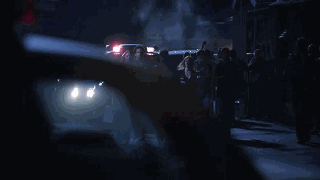

***********************

### 「你是维尼熊么？」
「6x02」

发现犯罪现场有交叠所以Grissom跑去跟Catherine打招呼，不过…用不用像维尼一样这么可爱啊…还翘小指！

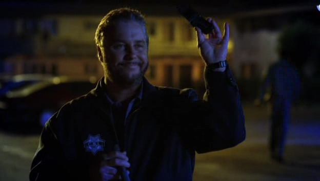

***********************

### 「聊到Sex好尴尬」
「6x03」

这两只一不小心就又聊到Sex，然后…聊着聊着就卡住了~

```text
SARA:  Sexual lubricant. It's half empty. Sticky. 
    You know, you don't have to sleep in the same bed together to have sex or... have romance.
```

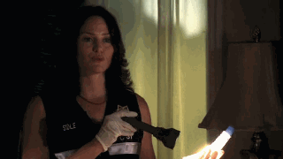

所以你们两个到底是什么时候开始在一起的？！ Sara你这么说是不是在暗示什么？！你看Grissom笑的这么开心~

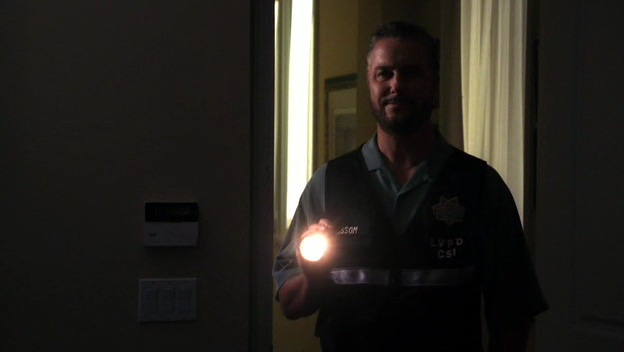

Grissom一直立志于保持公正客观并以客观数据说话，所以即使对地检也绝不留情的进行吐槽~

```text
// highlight-next-line
GRISSOM:  For the record, I think you're filing prematurely.
D.A. :  As always, I value your opinion. But I'm confident in our decision to move forward. 
    But, come on, Grissom, granted the first death was a natural-- 
    but two dead women married to the same guy found in a stairwell? 
    Lightning doesn't strike in the same place twice.
// highlight-next-line
GRISSOM:  Actually, it does. The Empire State Building gets struck 20 times a year.
ECKLIE:  Let's just run the case.
```

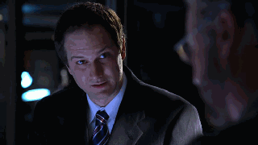

话说这个检察官老是主关臆断，不能长点儿记性么…
不过后来他一语惊醒梦中人，算将功补过吧~

***********************

### 「大家都不好过」
「6x08」

枪战中Brass误伤友军的一集，自身的压力，媒体的压力，感觉刻画得很真实。人们永远只相信自己愿意相信的…

Sofia应该是对Grissom有好感的，之前就表示她喜欢在Grissom手下工作，她表示要转职的时候Grissom也有邀请她吃饭。（所以就说你为毛对除了Sara姐姐的其他女人都还不错！）

这次Sofia在极大的压力之下违反规定躲到Grissom办公室想跟他倾诉一下，最后被Sara撞见不得不离开。

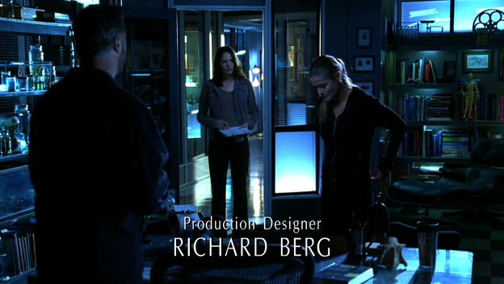

Sara姐姐果然是个直肠子，说话冲得不行，虽然说的是正理，不过也确实让人觉得不近人情。不知这里面是否也掺杂着若干嫉妒心理呐。（之前虐童案的时候，她有看到Sofia和Grissom开心的在聊天，而自己却形单影只地难过想起自己的寄养经历，再之后就爆发了）

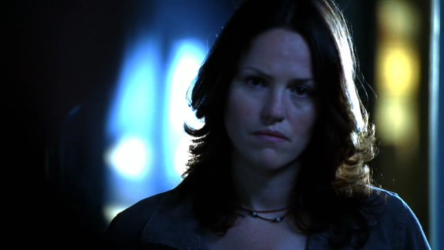

事情比较严肃，所以从Grissom的万年扑克脸上也看不出什么更多信息了= = （你应该不是在女朋友面前心虚吧？）

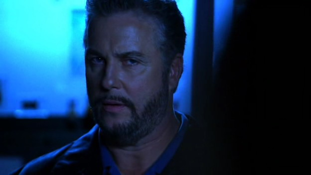

聪明如Grissom总是能找到调查突破口的，特别是要做实验的时候就更是兴致昂扬，这时候当然是要叫上Sara一起玩儿~ （Hodges太胆小了，还是Sara听话~

```text
// highlight-next-line
GRISSOM:  Sara. Will you come with me to the east alley, please?
SARA:  I thought my top priority as per the undersheriff was finding the bullet that went through Bell.
// highlight-next-line
GRISSOM:  Well, this is per me. Come on. It'll be fun.
SARA:  Okay.
```

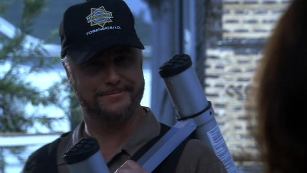

Brass中枪受伤的时候（6x24），Greg曾问Grissom你俩认识这么久，Brass在私下里是不是也总是穿西装，Grissom说我们私下里又没有一起玩儿= =。不过这么多年，既是同僚有时又针锋相对，这两个的友情是没的说，Grissom甚至是Brass的医嘱监护人。所以在发布会之前，Grissom特意去找Brass，提前告诉他调查结果。这种没法说谁错的伤心事儿最是让人心痛。

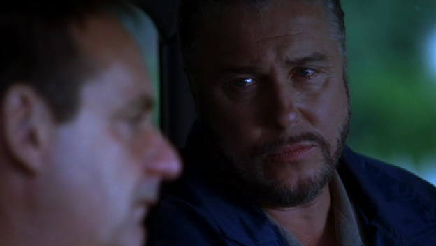

***********************

### 「想要抱抱9岁的Grissom」
「6x10」

Grissom少有的主动谈起自己的父亲，谈起9岁的他不知道父亲发生了什么…
超级楚楚可怜黯然神伤的表情，想抱他一下…

```text
CATHERINE:  How old were you when he died?
// highlight-next-line
GRISSOM:  Nine.
CATHERINE:  Little guy. I'll get started in Karen's room.
// highlight-start
GRISSOM:  He taught botany. He, uh... came home from school one hot, humid day, laid down on the couch. 
    I was watching TV. My Mom brought in some cold drinks... but she couldn't wake him up. 
    No one would tell me why.
// highlight-end
```

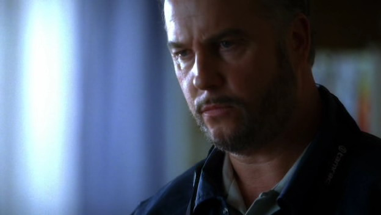

***********************

### 「卖弄学问的时候不小心影射到自己了？」
「6x12」

Girssom高谈阔论的时候基本是这样的：
我最博学了~厄，被Sara吐槽了 = = （你俩是不是又吵架了？

```text
// highlight-next-line
GRISSOM:  like thermite.
SARA:  Thermite?
// highlight-start
GRISSOM:  When you combine two seemingly harmless elements-- aluminum and rust-- press them together, 
    add heat... it creates an explosion so hot it burn through steel. Powerful but uncontrollable. 
    It burns and burns until it burns itself out, finally consuming both elements.
// highlight-end
SARA:  I guess some people just shouldn't be together.
```

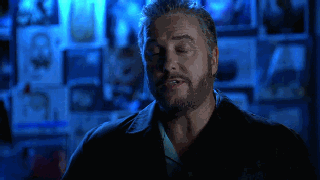

↑最后那个惊恐脸，笑~ 放心，Sara不会抛弃你的~

***********************

### 「被Sara夸奖了好开心~」
「6x13」

Sara有意无意的一句话，估计让Grissom心里要笑开花儿了~
她没看他，他也没看她，但他知道她在夸他~

```text
SARA:  Hodges, don't you know that gray hair can be very attractive?
```


话说Sara对Hodges还真是蛮友善的，2021年最挺Hodges的除了他老婆就是Sara了！

***********************

### 「女王的愤怒」
「6x15」

这世上为什么有那么多坏人和变态呢。替Lady Heather和她女儿泪目。
但对女王来说，恶人绝不是能够阻止自己复仇的阻碍，她有自己的手段，即使是以恶制恶的。

显然Lady Heather还在记恨Grissom上次对自己的"背叛"，所以完全不理他的劝告= =


So…
她闯入嫌犯家中偷盗，给警方制造调查借口。

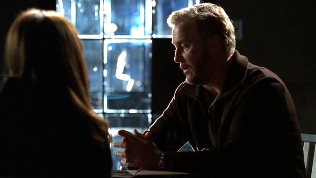

为了取得DNA和嫌犯上床 = = （让所有人无话可说的魄力…

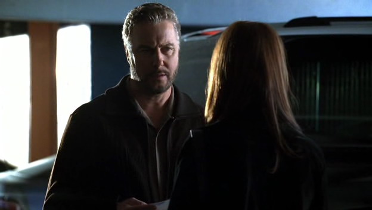

最后她终于决定抽死他…不得不说这里的皮鞭太帅….


Grissom总是那个善于发现细节和让事情走上正轨的人，他在嫌犯家中认出了Lady Heather掉落的项链，猜到了她要做的事情，追过去成功阻止了她虐死嫌犯…

这里Grissom少有的男子气概爆棚，唯诺温吞四个字是怎么写的？不、认、识！

抢过崩溃边缘女王大人手里的皮鞭、用冷静沉稳的声音命令她停手、再轻轻抱住安抚情绪…
只想说，这一刻，这个男人好完美…
虽然这一切给Finale的事件留下了导火索…

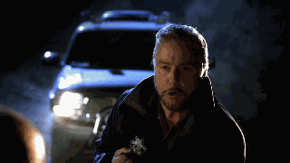

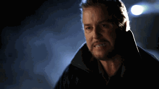

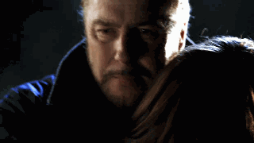

题外：
说到饰演Lady Heather的这位演员，Melinda Clarke

咱特别喜欢的2个大叔，William Petersen，Nathan Fillion，还…都和她演过暧昧的对手戏…
美剧圈子也真是小…

***********************

### 「你这人还真是= =」
「6x20」

Grissom的强项，双关语 = =
拿来调情再好不过了…

```text
SARA:  Griss, we are not having any luck identifying the three teenagers from CC Drive. 
    It's been two days, no one's come forward. Without an ID, it's like they never even existed.
// highlight-next-line
GRISSOM:  We need to get their faces out in the public-- newspapers, billboards.
SARA:  Well, maybe you could breathe a little bit more life into them.
// highlight-next-line
GRISSOM:  Yeah. I'm pretty good at mouth-to-mouth.
```

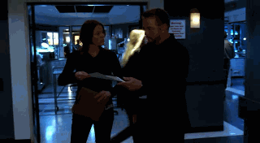

Sara姐姐有没有觉得这人没救了…

***********************

### 「Grissom是个诚实的孩子」
「6x21」

一开场Nick那载满证据的的车就被偷了，（这孩子霉运怎么还没走完？）
于是Grissom不得不替他的手下挡下治安官的怒气，but….你确定你是在帮忙安抚而不是要逼疯已经快气死的治安官么？笑…
不愧是Grissom…护短大法纯熟…

```text
// highlight-next-line
GRISSOM:  I'll talk. You guys just look apologetic.
SHERIFF:  All right, let me see if I understand this correctly. 
    You let one of the members of your team drive his personal vehicle to a crime scene investigation; 
    and then, even though there was a perfectly good crime scene vehicle there, 
    that personal car was crammed with every bit of evidence collected at a major murder investigation, 
    because two of you were maxed out on overtime. 
    And then the driver, of said car, instead of securing that evidence in the lab, gave priority to his need for runny eggs. 
    And the aforementioned vehicle was stolen from a parking lot filled with police cars. Is there anything I missed? 
    （好长的台词，看来是已经气得快脑淤血了…
// highlight-start
GRISSOM:  Just this: Even if we recover the vehicle, the chain of custody has been broken, 
    so all the evidence has been compromised. No judge will allow any of it to be admitted into court. 
    Also, we released the crime scene, so it, too, is compromised, leaving us nothing to go back for.
// highlight-end
SHERIFF:  Thank you for clarifying the situation. 
```
（被Grissom这种纯理性搞得不好发作只好撞倒隔离柱表示气愤….

嗯…大家的"look apologetic"是这样的~

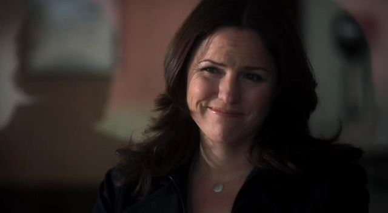

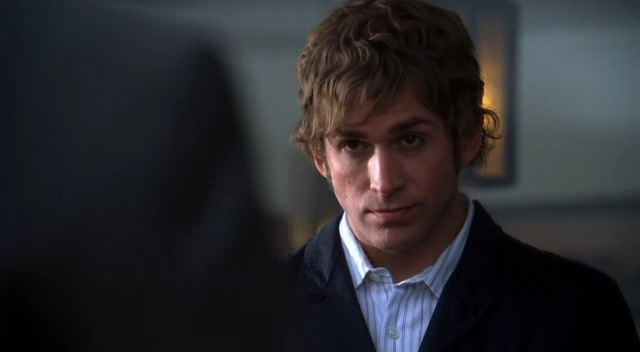

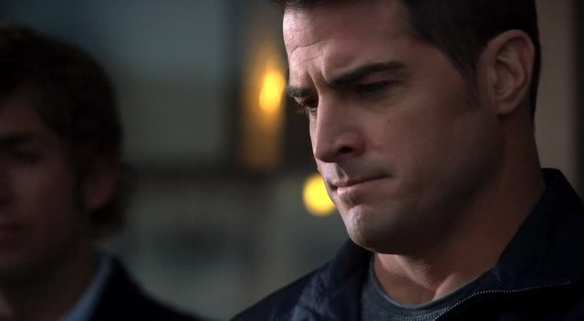

Grissom的扑克脸不算= =

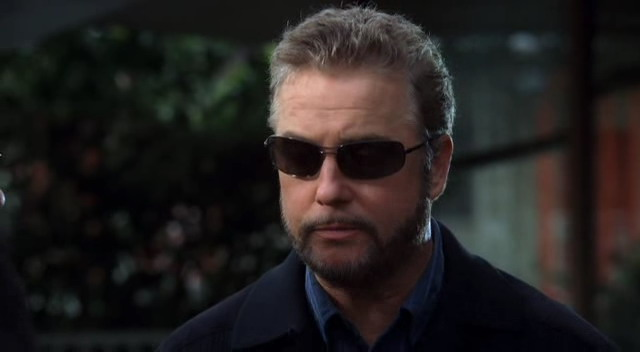

啊啊啊~想看Grissom和Sara一起走花墙呢~
对了，Grissom，你一定是文艺青年…（再说一次，William Petersen的独白声音真好听~

```text
GRISSOM:  Spring is but a song, where love and laughter are not wrong. 
    The blossoms of desire do belong, and Harmonia axyridis fly along.
```

<div style={{ display: "flex", gap: 12 }}>
  
  
</div>
<br/>

话说Sara姐姐你说不想结婚，难道没预计到后来嫁给Grissom？
不过你对新娘还是有兴趣的对吧~所以不要给Nick看，去给Grissom看啊~

```text
NICK:  So?
SARA:  I need your hands.
NICK:  I thought you'd never ask.
```

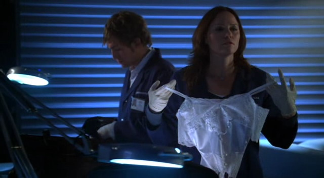

然后，讨论案情就讨论案情…你们两个书呆子一定要把对话上升到这么有文化的程度么？
还有Sara你不用这么着急解释…Grissom不会放走你的~

```text
// highlight-next-line
GRISSOM:  Did you know the original role of the bridesmaid was to act as a human shield against the bride's enemies?
SARA:  Women would dress similar to the bride in an effort to confuse 
    and outsmart evil spirits that might try to overtake her on her wedding day.
NICK:   Wow, for somebody who's anti-wedding, you certainly know a lot about it.
SARA:  I'm not anti-wedding. I'm just anti-stupid--  you know, 
    people who do things for the sake of tradition with no clue as to why.
```

<div style={{ display: "flex", gap: 12 }}>
    
  
</div>
<br/>


要说内务科效率还真是低，这边案子都破了才来人调查，于是Grissom又不想甩他们了…有那功夫还不如玩儿会儿填字游戏 = =

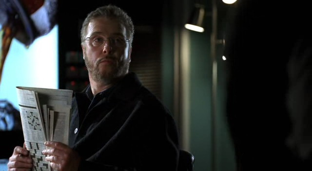

***********************

### 「含情脉脉」
「6x22」

突然听到有人祝你们梦想成真，有没有心中一跳？

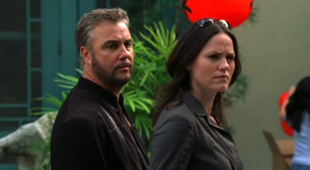

然后就开始在办公室里面偷偷眉目传情了~所以说Grissom你这么干好多年了是吧…

```text
GRISSOM:  I think fantasies are best kept private.
```

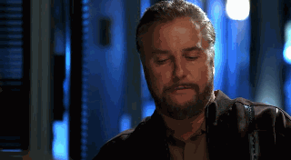

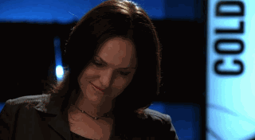


Grissom你最后那眼神儿…太让人把持不住了…

***********************

### 「终于」
「6x24」

到了第六季尾声，Grissom和Sara有了越来越多的互动。
比如Sara终于又能拍拍他的肩膀；

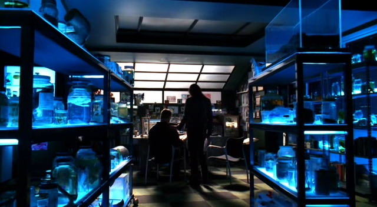

或者一边找证据一边玩儿个对决~你俩要不要笑得这么甜…

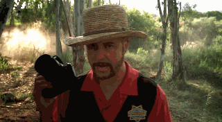

最后的最后，编剧终于肯正式发糖了，告诉大家这两只在、一、起、了~

```text
// highlight-start
GRISSOM:  I don't know. Most people want to die in their sleep, I suppose. 
    Never know that it's happening. Like a crime scene. Surprise, you're dead. 
    I'd prefer to know in advance that I was going to die. I'd like to be diagnosed with cancer, actually. 
    Have some time to prepare. Go back to the rain forest one more time. 
    Reread Moby Dick. Possibly enter an international chess tournament. 
    At least have enough time to say good-bye to the people I love.
// highlight-end
SARA:  I'm not ready to say good-bye.
```

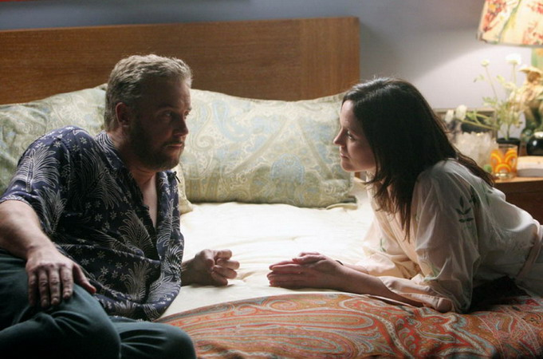

等了这许多年，编剧你终于肯回应GSR shipper的热情了~容我们狂喜乱舞一下…

已经不记得第一次看这集时内心兴奋到什么程度了，不过在记忆的一隅，始终有个声音在说，你的夏威夷花衬衫是什么鬼…这是什么品位啊，扶额…

再然后，William Petersen好像还很钟爱这件衬衫= = 参加个线下活动也要穿上…
还是说其实是私服？

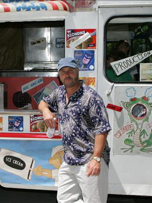

-Season6 END-