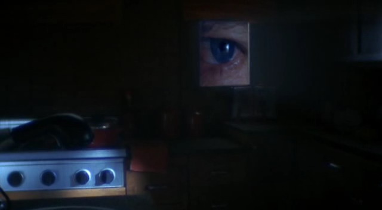
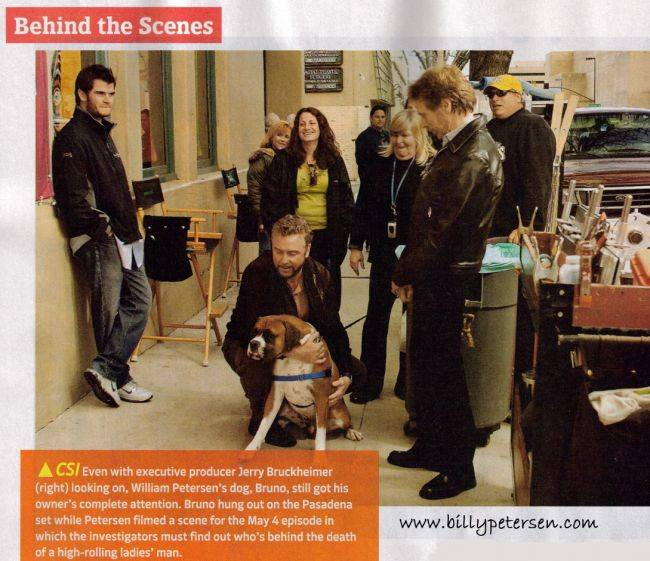

import greg1 from "./07/csi.s07e04.dvdr[00_23_04][20151117-220728-1].jpg";
import grissom1 from "./07/csi.s07e04.dvdr[00_23_09][20151117-221127-3].jpg";

import sara1 from "./07/csi.s07e05.dvdr[00_10_11][20151117-225554-1].jpg";
import grissom5 from "./07/csi.s07e05.dvdr[00_10_12][20151117-225612-3].jpg";

import both1 from "./07/csi.s07e05.dvdr[00_13_38][20151117-231457-5].jpg";
import both2 from "./07/csi.s07e05.dvdr[00_13_41][20151117-231503-6].jpg";

import cath1 from "./07/csi.s07e10.dvdr[00_01_25][20151121-155324-5].jpg";
import grissom2 from "./07/csi.s07e10.dvdr[00_02_24][20151121-155117-0].jpg";

import leave1 from "./07/CSI.S07E13.Redr[00_09_31][20151121-183340-0].jpg";
import leave2 from "./07/CSI.S07E14.Meet[00_25_11][20151121-184756-7].jpg";

import letter1 from "./07/CSI.S07E14.Meet[00_25_46][20151121-184313-2].jpg";
import letter2 from "./07/CSI.S07E14.Meet[00_25_53][20151121-185219-0].jpg";

import grissom3 from "./07/CSI.S07E21.Endi[00_32_02][20151125-223916-0].jpg";
import grissom4 from "./07/CSI.S07E21.Endi[00_32_09][20151125-223924-1].jpg";

import letter3 from "./07/CSI.S07E22.Leap[00_29_53][20151126-212951-7].jpg";
import letter4 from "./07/CSI.S07E22.Leap[00_30_09][20151126-213011-8].jpg";


### 「谈了恋爱就越来越帅」
「7x01」

新一季，新形象的Grissom

减了肥&剃了胡子，瞬间年轻10岁有没有，肯定是为了配合Sara姐姐~（还记得有篇同人文说有个小朋友问Sara，Grissom是不是她爸爸，直接笑抽…）

CSI的大家大多都猜到了什么，Nick和Cath在7x11就猜，他一定是交了女朋友！


恩，对于已经忘了他不留胡子什么样子的小伙伴来说，简直是眼前一亮！是不是想问，哥哥你是谁？
在休息室更是开始赤裸裸的示好，那叫一个暗送秋波！这么多年没见你对Sara这么温柔过~
(今年你家菠菜丰收呐~)

```text
// highlight-next-line
GRISSOM:  I got you a veggie burger.
SARA:  Thanks.
WARRICK:  What about me?
// highlight-next-line
GRISSOM:  I didn't know you were here. So sorry.
WARRICK:  Where's the love?
```


本集后半段祭出著名的模型杀手系列的案子，不过刷到第N遍的现在，我只想说…Grissom你眼睛好蓝！



***********************

### 「和验尸官一起唱歌」
「7x02」

Grissom和法医爷爷关系果然很好…喜欢的音乐类型相同，还在验尸房high起来 = =


好吧，其实William Petersen本人唱歌还满好听的~
从2002还是03年开始，经常在棒球赛带大家一起唱那首非官方的传统棒球赛 **[圣歌](https://www.bilibili.com/video/BV1W14y1e74q/)**（据说是向著名棒球解说Harry Caray 致敬），用的还是中低声线…Sexy~


PS: 歌词 ↓

```text
「Take Me Out to the Ball Game」

Take me out to the ball game
Take me out to the crowd
Buy me some peanuts and Cracker Jacks
I don't care if I ever get back
Let me root root root for the home team
If they don't win it's a shame
For it's one two three strikes you're out
At the old ball game
```

然后2021年Grissom又唱了~可可爱爱。

话说所有人都觉得你俩一定是一国的，笑，所以你俩别这么一脸迷惑不解好么！

```text
ECKLIE:  Izzy delancy is famous; the press wants answers.
// highlight-next-line
GRISSOM:  Don't we all?
ECKLIE:  Sara,this is your case,too--what do you think?
SARA:  I,uh... I agree with grissom.
ECKLIE:  Of course you do.
```


***********************

### 「Greg是勇敢的孩子」
「7x04」

实验永远是CSI查案时重要的一步，比如7x03 Grissom和Sara一起玩儿电锯、这集Sara又要模拟对受害人拳脚相加。

经历了之前的"电锯威胁"

 (7x03)

Grissom这次表示不想加入实验了= =
拒绝一切暴力活动………………………

```text
// highlight-next-line
GRISSOM:  Whoa! Pick on somebody you're own size.
SARA:  Are you volunteering?
// highlight-next-line
GRISSOM:  No.
```

 

一直以来，对Greg印象是能干的实验室开心果，但随着年龄和经验的增长，他逐渐成熟，茁壮，到今天，成为英雄，不再是温室的花朵。
有多少人在面对群匪的时候，还能为了救人挺身而出？只这一点，他就是英雄。


其实我也是不喜欢这一集的，因为不喜欢看到善良正直的人们受到伤害，更何况是CSI的一员。
不仅是身体上受到伤害，虽说是出于正当防卫才误杀了对方，但致死人命的阴影恐怕要永远留在他心灵的角落。随之而来家属的纠缠、舆论的纠缠、官司的纠缠…

害大家担心，害Grissom担心…

<div style={{ display: "flex", gap: 12 }}>
    
  
</div>
<br/>

觉得Grissom一定会自责，自从第一集出场的姑娘solo被害之后，他对自己的组员一直小心翼翼，偏偏他让Greg solo的第一次任务Greg就受伤了。看着他受的这些苦，心也要痛死了，还得压抑自己的感情…

***********************

### 「Grissom自夸起来真是不要不要的…」
「7x05」

没想到Grissom记性这么好…哪里有几丛树也记得…
还摆自豪脸…果然是要在女朋友面前嘚瑟一下 = =

```text
SARA:  Was there bougainvillea a at the crime scene?
// highlight-start
GRISSOM:  Two shrubs at the entrance of the church. A row of four on the wall of the community center. 
    Three bushes behind the rectory adjacent to the statue of st Jude.
// highlight-end
SARA:  Did you anticipate that question in order to impress me with your powers of observation?
// highlight-next-line
GRISSOM:  Memory's a gift.
SARA:  Mmm. From whom?
// highlight-next-line
GRISSOM:  Who do you think?
```

<div style={{ display: "flex", gap: 12 }}>
    
  
</div>
<br/>

不过这人后来又跑进自己的小世界把Sara晾在一边，害Sara担心半天是不是自己说错话，惹怒了这个喜怒无常的闷骚男…

```text
SARA:  Something I said?
// highlight-next-line
GRISSOM:  No. Dear.
(这里找了2版字幕，都没有录入Dear，有一版写的是do you，但是我发誓我听见他这么叫Sara的…)
SARA:  I didn't offend you, did I? Did I say something offensive to you as a catholic?
// highlight-next-line
GRISSOM:  I'm not really a catholic anymore, you know.
```

<div style={{ display: "flex", gap: 12 }}>
    
  
</div>
<br/>

直到看到Sara着急解释才恍然大悟自己引起的误会= = 呆死了…

***********************

### 「Grissom果然只欺负Greg」
「7x06」

少年失踪案，基本上是Grissom的软肋，所以他心情不好，很不好。
走进实验室听见超大声的音乐，立刻准备斥责Greg，结果发现是Sara姐姐开的…一句话都不敢说鸟 = =，你的领导气质呢？！

```text
// highlight-next-line
GRISSOM:  Didn't we talk about this once before, Greg?
SARA:  I'm the one who turned the music on.
```

 

反正Greg是不敢反驳Grissom的，只能吃哑巴亏…摸摸头

Grissom偏头疼又犯了，看着也是各种心疼…


***********************

### 「Grissom，Sara姐姐叫你回家吃饭」
「7x08」

这人还要多假装一本正经…

Cath说打赌俩人都赢了，所以应该是想要说两人都掏钱给对方，结果Grissom就能说出下面这种话…
哎，其实好久没见Catherine翻他白眼，挺想念的~

```text
CATHERINE:  We were both right.
// highlight-next-line
GRISSOM:  That's a federal offense, you know.
```


Cath也就算了，对于Sara姐姐的召唤，你还琢磨什么，还不快追上去！
还是说又被Sara解开一个填字游戏，自尊心受挫了？

```text
SARA:  Oh, look, you missed one. Sixty-three down. "Misanthrope." I won't wait up.
```


PS：我要再说一遍，William Petersen 念书的声音真好听~

***********************

### 「Sara请使劲吐槽他吧」
「7x10」

整体来说比较欢乐的一集

由一个想弃尸但不幸被困在水泥里的倒霉蛋儿开场，Catherine已经笑得喘不上气了，Grissom也少见的咧开嘴。
这个倒霉蛋儿也挺厉害，就是不说自己的名字，和Jim，Cath "混熟"就算了，连Grissom的全名"Gilbert"都套出来么？！

<div style={{ display: "flex", gap: 12 }}>
    
  
</div>
<br/>

虽然接下来进入到模型杀手的第三个案子，不过Sara对Grissom的冷静挑衅瞬间让我笑喷…
Sara姐姐 GJ！

交了女朋友就是不一样，气场低了8级好么~你真心需要反省一下自己平时那种高冷的睿智让周围的同事有多焦虑…

```text
SARA:  Mannleigh chickens.
// highlight-next-line
GRISSOM:  What about it?
SARA:  I'll let you know. See how it feels?
```


Grissom，就算你生闷气噘嘴也没用~大家一定站在Sara姐姐这一边~

大概是被模型杀手的case影响，Grissom真是累了…而且…还开始幻想了 = =

```text
CATHERINE:  You're tired.
// highlight-next-line
GRISSOM:  Yeah.
SARA:  Hey. Guess what.
// highlight-start
GRISSOM:  Mankind has reached a new evolutionary plateau, and starting tomorrow, 
  no one will rape, murder or maim again.
// highlight-end
SARA:  Uh, no.
// highlight-next-line
GRISSOM:  Too bad.
```


Sara大概以为自己男朋友终于疯了…

要说果然不能期待CSI的内容过于欢乐，结尾处嫌犯竟然发实时视频给Grissom，并且在他眼前自杀…
为什么受伤的总是Grissom…


无论如何，痛恨那些自己结束生命的人…

***********************

### 「都以为他要走了」
「7x11」

几集之前，Grissom接到了去大学授课的邀请，这集他做出决定，准备离开一个月。
可是这颗闷葫芦的突然休假，有点儿吓到大家了。
没有告诉Catherine休假的期限，Warrick来问的时候说自己在这里已经没有可教的了，关心Greg的案子提了很多温暖的建议，Nick小乖直接以为他不会回来了，于是感慨万分的上去拥抱。这会儿他才道出他会在4周以后回归。

```text
NICK:  Anyway, I just wanted to say it's been great, man. 
  Really, I've learned a lot from you, man.
强抱…还把耳朵贴到Grissom脸上了，笑抽…

// highlight-next-line
GRISSOM:  I'll be back in four weeks. Stop hugging me.
NICK:  Yes, sir.
```


这真是太尴尬了 = =


临走之前，Grissom在更衣室找到Sara，超腼腆的说「I'll miss you.」
激萌，说完就逃走了…然后，耳朵都红了好么！！

```text
// highlight-next-line
GRISSOM:  Hey. My cab's here.
SARA:  So, you're going.
// highlight-next-line
GRISSOM:  Yeah.
SARA:  I'll see you when you get back.
// highlight-next-line
GRISSOM:  I'll miss you.
```


Sara表面冷静，其实Grissom转身之后才看到她好难过的。心疼。


说到Grissom在Sara面前的腼腆，可能是一辈子也改不掉了。

 （7x11）

 （Finale）

你是有多紧张，跟Sara讲讲话就叉个小手儿…Nick抱你的时候手就一直揣在兜儿里…

***********************

### 「昆虫学家+智者的浪漫」
「7x13-14」

与Sara分别一个月，果然让Grissom牵肠挂肚。于是…
他给Sara寄了一只茧…这大概是Grissom能想到的最浪漫的事吧…

虽然连句留言都没有= = 让Sara接到礼物时觉得有点儿迷惑，不过后来她把茧养在了Grissom的办公室…

这两只真是…让人觉得好甜~

<div style={{ display: "flex", gap: 12 }}>
    
  
</div>
<br/>

Grissom是智者，所以他给Sara写的情书….一定是要超有内涵的，什么人给女朋友写信要引用莎士比亚的十四行诗呐~而且写的字也特别好看！
（咳，不过关于莎士比亚其实是写黄段子高手这种事我就假装不知道吧…

<div style={{ display: "flex", gap: 12 }}>
    
  
</div>
<br/>

虽然这封信并没有寄出去，不过好在后来被Sara发现，读到了~Happy~

(PS: 话说大家写字的时候本子都是歪着的？我好像也会这样…)

***********************

### 「胡子交给你了」
「7x17」

4年前Grissom问Sara是否相信自己（为了拐她帮忙做实验= =），这次轮到Sara来反问他相同的问题。
所以，相信她就让她帮忙刮胡子么~

```text
SARA:  You trust me?
// highlight-next-line
GRISSOM:  Intimately.
```


PS：据说这场戏最后，William Petersen的胡子真是Jorja Fox给刮完的

PS2： 一开场Grissom很不高兴Brass在周六早上把自己挖起来，赌五毛他当时正和Sara在一起~
否则工作狂什么时候在意过这些~


```text
BRASS:  The last place the kids were seen was the parking lot at the school after the game.
// highlight-next-line
GRISSOM:  These two kids have only been missing for 14 hours. They could have eloped to Mexico.
BRASS:  I know it's a favor, but...
// highlight-next-line
GRISSOM:  All right. But you owe me one for getting me out of bed on a Saturday morning.
```

 

↑其实我只是觉得他穿制服很帅…顺手截张图…

***********************

### 「谁在受伤」
「7x18」

CSI最后一季的Boss D.B Russell的饰演者Ted Danson在CSI Farewell PaleyFest上感叹，CSI们做着很厉害的工作，他们面对了我们普通人不用面对的黑暗。

这一集，受伤的是Sara。
这次，她发现了垂死的受害者，然后看着她在自己怀里死去。而且在不知情的情况下，她又去安慰试图自杀的凶手。
悔恨和无力感恐怕会啃噬Sara很久，这个本就容易情感冲动的女子。
好在，这次她流泪的时候，有Grissom在旁安慰。她不再是一个人了。

 

对Grissom来说，能在Lab帮Sara擦眼泪，轻轻拥着她离开，已经是他能给与的最大温柔了吧…

 

***********************

### 「Grissom竟然可以笑得这么甜」
「7x21」

一开场Grissom就演示了一番「家教很严」是怎么回事…
迅速解释有木有！眼神游离有木有！Sara姐姐只不过看了你一眼…

```text
SARA:  Feels like bathwater. It's got to be 90 degrees. 
  There's no way we're going to get an accurate T. O. D.
// highlight-start
GRISSOM:  Places like this always keep their pools warm. 
  Encourages the girls to swim topless. It's good for business. So they tell me.
// highlight-end
```

 

以后还能不能愉快地卖弄学问了~

Grissom总能在不经意之间说出最美的情话~ （据说这叫间歇性情商在线 = =）

```text
SARA:  So you've been to a place like this before?
// highlight-next-line
GRISSOM:  I worked a murder suicide at the naughty kitty once.
SARA:  No, no, come on. You know what I mean.
// highlight-next-line
GRISSOM:  As a customer? No.
SARA:  You never paid for sex?
// highlight-next-line
GRISSOM:  I have not. I find the whole idea very... bleak.
SARA:  Really? How come?
// highlight-start
GRISSOM:  Sex should provide the opportunity for human connection, but paid sex does the opposite of that. 
  To me, sex without love is pointless. It makes you sad.
// highlight-end
SARA:  Well, I'm pretty sure I don't make you sad.
// highlight-next-line
GRISSOM:  No. You make me happy.
```

 

Sara又一次显示了她的学识。背个诗神马的…小意思
难怪Grissom喜欢她，只有Sara这么知识渊博的姑娘能跟得上他的节奏。

```text
MILTON(Old Man):  I shot an arrow into the air,and it fell to earth I know not where. 
  Oh,so swiftly it flew, the sight could not follow it in its flight. Long,long...
NICK:  sir. That's,that's really sweet.
MILTON:  That's longfellow. What do you kids know about poetry?
…
SARA:  I found the arrow,still unbroken and the song,from beginning to end, 
  I found again in the heart of a friend. Keep the faith,milton.
```

 

这是一个神奇的案子，能让Grissom笑得这么……有主妇气质 = =

<div style={{ display: "flex", gap: 12 }}>
    
  
</div>
<br/>

***********************

### 「Grissom的狗狗登场」
「7x22」

William Petersen贡献了他的狗狗Bruno饰演Grissom的宠物Hank~
Grissom你是有多讨厌Sara的前男友？笑死…
（好吧，因为他曾经害Sara伤心…

emmm，不过Grissom你第一季时候还说对犬科动物不了解呢，所以为什么开始养狗的？

 

话说…嫉妒上了Grissom大床的狗狗这种事我是不会说的…

 

然后Grissom的情书终于被Sara发现了，那淡淡的微笑下面爱意有多浓？

<div style={{ display: "flex", gap: 12 }}>
    
  
</div>
<br/>

还有还有，William Petersen念情书的声音真好听~（重要的事情还是要说三遍！

```text
I don't know why I find it so difficult to express my feelings to you. 
Even though we're far apart, I can see you as vividly as if you were here with me. 
I said I'll miss you, and I do. 
As shakespeare more ably wrote my sentiment in sonnet 47, thyself away art present still with me; 
for thou not farther than my thoughts canst move, and I am still with them, and they with thee. 
Or, if they sleep, thy picture in my sight awakes my heart to heart's and eye's delight.
```

***********************

### 「每次见到Lady Heather都有各种尴尬」
「7x23」

是看到Sara和Lady Heather同时看向自己比较尴尬，还是发现Sara一脸我知道你俩关系不一般比较尴尬 = =
（前3次Lady Heather的case Sara都没有参与的Sara~）

 

知道他俩的关系，于是Sara貌似忍不住要调笑Grissom一下吗~

```text
// highlight-next-line
GRISSOM:  Any results on heather kessler?
SARA:  So far, all the prints come back to her. Player piano, whiskey bottle, shot glass. 
  There was some lipstick around the rim. I haven't had a chance to test it. 
  You think it's her shade?
```

 

被Catherine和Brass"抓到"在Lady Heather家过夜了= = 你真的还有心情喝茶？（其实心里觉得尴尬疯了是么~但是也一定要死鸭子嘴硬坚持表示没什么~）

```text
HEATHER:  Captain brass would like to know where I was last night.
// highlight-next-line
GRISSOM:  She was here. With me.
```

 

显然Grissom去拜访Lady Heather事先没有告诉Sara，看着Sara伤心的样子…心疼啊…。这闷葫芦竟然又在关键时刻卡壳，想不到话去解释 = = 调情时候的睿智都哪儿去了？！就算你这时候心里在高喊"我其实是无辜的"大家也不会同情你的…

 

Grissom虽然这次做情人很下手，但是朋友倒是做得相当温暖到位，简直是法师化身骑士，角色转换成功~！超级暖男一枚！

```text
HEATHER:  leave me alone. I didn't ask you to save me.
// highlight-next-line
GRISSOM:  I know. What am I supposed to do? I'm your friend. Besides,there's someone I want you to meet.
```

 

 

PS：Grissom一整集都在用眉毛眼睛说话…用不用这么努力卖萌呀！

***********************

### 「没有最虐只有更虐」
「7x24」

要不说编剧会玩弄人心呢，
一下子祭出模型杀手害观众紧张&好奇，
一下子又秀出Grissom对Sara的称呼从「honey」变成「my dear」让一众GSR shipper再次狂喜乱舞…

 

然后，Sara就被这个神经病凶手劫持了…
编剧你够狠….

为什么一定要虐他俩呢…
Grissom在自己办公室发现了新的模型，而且是酷似Sara的女子被压在沙漠中倒扣的车下，那表情…他快吓死了好么…

 

情急之下，Grissom和Sara的办公室恋情就这么曝光了

```text
GRISSOM:  It is different. This girl holds me responsible for the death of ernie dell. 
  I took away the only person she ever loved, so she's going to do the same thing to me. 
  It's not about a psychotic reaction to bleach, or some dead sister or the doll. 
  Notur little bisque doll...
```

 

话没说完，Grissom又一副进入自己小世界的样子转身就走，留下一群同僚面面相觑。Team里的各位虽然猜到Grissom交了女友，但是应该没想到那个女孩儿就是Sara~（Greg在8x02里面说他知道这两只的事，不过Nick这样的老实孩子就完全被蒙在鼓里。

/////////////////////////////////////////

这集的 **[interview](http://v.youku.com/v_show/id_XMTM5OTUzMjgwMA==.html)** 很有意思，演员们讲述了自己的角色对GS恋情公布场景的想法。
比如Grissom大概根本就没意识到自己透露了这么重要的秘密，也没想到周围还有人在听…（自带精神隔离系统= =）
Nick小乖更愿意相信Grissom爱他们所有人~
Sara表示"太无语了"，离开她5分钟，他告诉了所有人他俩是一对儿 = = （「如果Sara逃过一劫，谁知道之后会发生什么」Jorja Fox如是说…Sara姐姐，你是准备生还之后家暴吗？！误）

/////////////////////////////////////////

抓到凶手之后大家也是不好过的，因为这人精神有问题…
Grissom只能一反常态低声下气地去讨好她，从没见过他这样对待哪个嫌犯…
然后编剧你出来我们去天台谈谈人生吧…Grissom被抹脖子那块儿是、怎、么、回、事！

 

观众也会吓出心脏病的好么！不要随便进入神经病的精神世界呀！

好吧，因为这疯疯癫癫的凶手…Grissom也直接崩溃了…

```text
GRISSOM:  stop it! Just stop this! Tell me where sara is!
```

 

恐怕这是7年来Grissom情绪波动最大的一天了…


PS：Grissom和Catherine去看腹语表演的时候，Catherine说了一句 「okay, we're in a david lynch movie. Where's the dwarf?」，看了一下翻译注解，貌似她说的是【穆赫兰道】这部电影，那个，William Petersen有参演这部片子的…（虽然只出现了一个镜头就被干掉了吧= =）于是编剧你是故意的么…

还有，在Grissom和Catherine和腹语表演者谈话时，背景舞台的演员貌似在模仿「The Rat Pack」电影的场景，然后…「The Rat Pack」也是William Petersen演的…..导演你是William Petersen的脑残粉么…

-Season7 END-
