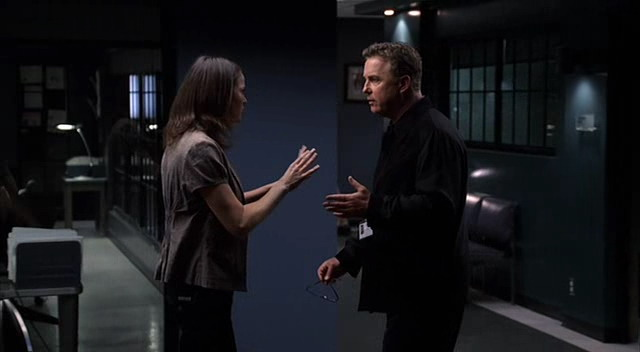
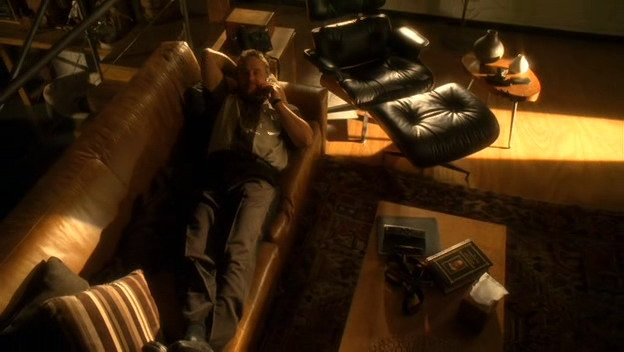

import grissom1 from "./08/csi.s08e01.dvdr[00_04_39][20151130-224321-1].jpg";
import sara1 from "./08/csi.s08e01.dvdr[00_28_07][20151130-230158-7].jpg";

import sara2 from "./08/csi.s08e02.dvdr[00_39_56][20151205-193154-5].jpg";
import both1 from "./08/csi.s08e02.dvdr[00_39_59][20151205-193225-6].jpg";

import grissom2 from "./08/csi.s08e06.dvdr[00_28_37][20151206-193352-2].jpg";
import both2 from "./08/csi.s08e06.dvdr[00_28_44][20151206-193403-3].jpg";

import sara3 from "./08/csi.s08e07.dvdr[00_40_58][20151206-212802-0].jpg";
import grissom3 from "./08/csi.s08e07.dvdr[00_40_53][20151206-212727-8].jpg";

import grissom4 from "./08/csi.s08e08.dvdr[00_11_35][20151206-222956-7].jpg";
import nick1 from "./08/csi.s08e08.dvdr[00_11_49][20151206-222909-3].jpg";

import greg1 from "./08/csi.s08e08.dvdr[00_31_51][20151206-225525-1].jpg";
import grissom5 from "./08/csi.s08e08.dvdr[00_32_54][20151206-225429-0].jpg";

import grissom6 from "./08/csi.s08e08.dvdr[00_37_55][20151206-231424-9].jpg";
import hodges1 from "./08/csi.s08e08.dvdr[00_40_18][20151206-231725-1].jpg";

import grissom7 from "./08/csi.s08e08.dvdr[00_41_08][20151206-233846-9].jpg";
import grissom8 from "./08/csi.s08e08.dvdr[00_41_08][20151206-233851-0].jpg";

import greg2 from "./08/csi.s08e12.dvdr[00_04_36][20151210-213204-7].jpg";
import greg3 from "./08/csi.s08e12.dvdr[00_04_57][20151210-213149-6].jpg";

### 「寻找」
「8x01」

随着证据的收集，编剧在这集里用闪回的方法狠狠折磨着观众，折磨着Grissom，折磨着这群CSI。

天降大雨，Sara可能被山洪淹没；
与凶手抗争，她伤了手臂；
被弃荒漠，夜有郊狼昼有烈日…
危机越来越多，他只能努力发挥所有智慧搜寻她可能被遗弃的地点。

<div style={{ display: "flex", gap: 12 }}>
    
  
</div>
<br/>

他找到了那辆倒扣的轿车，从泥土里挖出了Sara的警用坎肩，还好发现她已逃出车底；
他找到些许脚印，却发现风沙很快就淹没了她的行踪，好在Sara放置了指路石；
他发现了一具被埋的尸体，万幸那并不是他的女孩儿；

一次次的希望与一次次的失望再加上一次次的心惊，波峰波谷的情绪动荡，深深的无力感逐渐侵蚀着他，他只能相信她够坚强…
已被他那泫然欲泣的表情虐到心里了…

```text
// highlight-start
GRISSOM:  Where is she, Catherine? It's 110 degrees. 
  She's been out here all day, without water. She's disoriented, she's dehydrated.
// highlight-end
CATHERINE:  She's a survivor.
```


Sara是个坚韧到骨子里的女孩儿，所以她能吊着一只手臂在荒漠里寻找着自己生存的希望。


然后她被他们找到了，她也终于又见到了他。


他，一直是她的英雄。

PS：Sara在电话里叫他Gilbert，一下子就亲密很多的感觉 = = （很多年以前，我一直以为他就叫Gil来着…

***********************

### 「Ecklie我们不想理你」
「8x02」

Sara病愈回到实验室，面临的果然是Conrad开始的内部调查，Grissom一直采取鸵鸟政策对他避而不见，最后他只好追进Grissom的办公室…Ecklie也是各种心好累吧 = =

然后，找下属谈个话，被噎的一愣一愣的….

```text
ECKLIE:  Okay then, uh, this is anadministrative inquiry. 
  You and your supervisor were in direct violationof lab policy... 
SARA:  "Are."
ECKLIE:  "Are" in direct violationof Lab policy which states that members of the same forensic team 
  may not engage in a romantic relationship. 
  So when did you andSupervisor Grissom begin yourrelationship?
SARA:  We've always had a relationship.
ECKLIE:  I mean when didyou become intimate?
SARA:  Two years ago. I thinkit was a Sunday.
```


Sara心平气和的时候其实还好沟通，Grissom气起人来才是真•让你吐血三升而亡~
Conrad仍然拿他一点儿辙也没有…

```text
ECKLIE:  Gil, nobody wants to hear about your love life less than I do, 
  but since you didn't handle this right, 
  I have to take a formal statement. Should've been a conversation between friends. 
  I mean, we could've found some way around this. Catherine could have done Sara's evaluations. 
  Why didn't you just tell me?
// highlight-next-line
GRISSOM:  We didn't want you to know.
ECKLIE:  Don't most women like the world to know they're dating someone?
// highlight-next-line
GRISSOM:  Where do you get your information about women, Conrad?
ECKLIE:  Okay, so, when did you two, you know? 
// highlight-next-line
GRISSOM:  Nine years ago.
ECKLIE:  You know what? You two need to get your stories straight.
```


Grissom真心觉得他俩是9年前好上的，所以听说Sara有不一样的说辞还表示很疑惑，简、直、太、萌！

这俩"口供事件"还带来了结尾处超级甜蜜的一段对话~
Grissom又是在一脸无辜地表达着最甜蜜的爱意！

```text
// highlight-next-line
GRISSOM:  When did you tell Ecklie we got involved?
SARA:  Two years ago. Why? What did you tell him?
// highlight-next-line
GRISSOM:  Nine years ago.
SARA:  The Forensic Academy Conference?
// highlight-next-line
GRISSOM:  Yeah. You, uh, had too many questions about anthropology for some reason.
SARA:  Well, I was stalling. I was trying to get the nerve to ask you to dinner.
// highlight-next-line
GRISSOM:  You had a ponytail.
```


Grissom简直是丢了颗大糖给Sara，给观众，果然你这么多年就是一直在喜欢人家！！！
这就是最近流行的禁欲系男主吗？！

另外觉得感动的一点，是这俩为了对方，都宁愿舍弃对自己重要的东西，也不想伤害到对方的事业。
很遗憾Sara选择离开。这俩再也不能在工作中打情骂俏了…

（还好2021年新番这俩甜蜜回归疯狂秀恩爱~比心.jpg

```text
SARA:  I'm going to move to Swing.
// highlight-next-line
GRISSOM:  We talked about this.
SARA:  I know that you said that you would do it, but I don't want to do that to the team. 
  Besides... I am sure that I could use more daylight in my life.
```

<div style={{ display: "flex", gap: 12 }}>
    
  
</div>
<br/>

看Sara姐姐宠溺的眼神↑ 
还有Grissom被宠溺时的笑容↓


PS：法医爷爷太厉害…


说到"九年前"这个梗

- 外粉作者Chelles的同人文有讲从这俩第一次见面的超长系列故事，真的很好看！用词也不会太难~

[Fairytales](https://www.fanfiction.net/s/3468314/1/Fairytales)

[Chasing the Rainbow's End](https://www.fanfiction.net/s/3597106/1/Chasing-the-Rainbow-s-End)

[And They Lived Happily](https://www.fanfiction.net/s/3781233/1/And-They-Lived-Happily)

[Ever After](https://www.fanfiction.net/s/5312515/1/Ever-After) <- 可惜最后好像未完结，坑了

（正在龟速翻译前三部.jpg）

- 作者 strwbrygrl77的Grissom视角的九年梗同人也很好看！
[Then I saw her face](https://www.fanfiction.net/s/14016281/1/Then-I-saw-her-face)

其他推荐 [同人文](../../../blog/GSR同人文推荐)


***********************

### 「Grissom式的求婚」
「8x04」

看到Sara穿上防护服来看自己和蜜蜂，Grissom表示超级兴奋，然后，然后…
他求婚了！！！GSR shipper可以尖叫着去跑三圈了！

没有玫瑰，没有戒指，甚至他都不敢看Sara的眼睛（你是有多害羞…）
可因为他是Grissom，所以Sara好惊讶他能迈出这一步，太开心鸟结果被蜜蜂蜇到…
不过没关系，有我们的昆虫学家来温柔的拔蜂刺~

```text
// highlight-next-line
GRISSOM:  I love it when you dress up. 【我相信Sara不dress up你也很爱她~
SARA:  Well, you know, whatever it takes to get some time with you. 
  How's the study going? Any sign of Colony Collapse Disorder?
// highlight-next-line
GRISSOM:  Nope, so far it's healthy.
SARA:  Nothing too healthy about smoking.
// highlight-start
GRISSOM:  Well, the scent confuses the guard bees. 
  They won't emit the pheromone that tells the colony there's an intruder.
// highlight-end
SARA:  Don't worry, he's harmless. Who's who?
【开始跟蜜蜂说自己男朋友好话了…另外Grissom你笑的太腼腆了…
```


```text
// highlight-next-line
GRISSOM:  These are the workers- infertile females.
SARA:  They don't sting?
// highlight-next-line
GRISSOM:  No, not unless you swat one, Go ahead, take off your glove.
SARA:  Eh... all right, I trust you. 【开始表示绝对信任！
// highlight-start
GRISSOM:  See? It's cool. 【果然这是他认为好玩儿的事，所以要和Sara分享起来~
GRISSOM:  The worker bees defend the hive, procure the pollen, makehe honey, 
  nurture the larvae and pupae in each of these brood cells.
GRISSOM:  You know, maybe we should get married. 
// highlight-end
【你前面卖弄一堆学问，其实只想说这句吧！然后Sara就呆掉了…
```


```text
SARA:  Ouch! Oh, oh... Ow.
// highlight-start
GRISSOM:  Sorry. Don't pick it out. Makes it worse, releases the venom into the bloodstream. 
  It's better to scrape it. 
// highlight-end
```
【马上发挥男友力，不过反正Sara已经兴奋得变成高中女生除了笑什么也不知道了 ~


```text
// highlight-next-line
GRISSOM:  So, uh... what do you think, you know, about...
【依旧不敢有眼神接触= = 这要不是Grissom，估计早想上去踹一脚了= =
SARA:  Yes. Let's do it.
// highlight-next-line
GRISSOM:  Yeah?
```


然后这两个青少年就忘记了防护服有头盔这件事= =
事实证明，爱情让两个高智商的精英变得蠢萌蠢萌的…


之后回去工作的两只好像都有点儿断片儿….全都一副魂不守舍的样子…


被Cath抓到正在神游的Grissom太具稀有价值了、笑死…
还企图掩饰…….但你真的不太会说谎…声调都高了几度好么…

和蜜蜂在一起大概对他们来说是最美好的回忆之一，所以当8年以后他们再在一起放蜂时，简直了…恐怕没法用言语表述内心的汹涌澎湃吧…

 （Finale）

只不过，8年后的Sara多了许多女王气质，而Grissom在Sara面前却还是弱气得不行，各种小心谨慎有口难言，萌得让人捶地…（这次有记得把面罩掀开…）

 （Finale）

***********************

### 「品位」
「寻人密探组 6x06」

为了8x06的案子，Grissom跑去纽约FBI帮忙破案。
我只想说，平常穿了那么久工作服，出差的时候就不能换件其他风格的外套么…怎么就能把休闲服穿的跟工装一样呢 = =

 （寻人密探组 6x06）

即使过个8年也仍然是一个风格的！你是有多爱CSI的工装！（虽然我是控制服的…但这也太执着了…）

 （Finale）

还有，表疑问的表情也是万年不变地~ 看这一副【你谁啊？】的疑惑脸~↑↓

 （寻人密探组 6x06）

***********************

### 「崩坏」
「8x07」

其实从8x05开始，Sara就逐渐显露疲态，她告诉Greg她厌倦了每天面对死亡
（她和Greg关系真的很好~什么都能聊聊，而Greg好像一直在默默守护她一样，在Sara难过的时候都会陪她。）

8x06遇到女性被奸杀的案子，Sara开始濒临崩溃，虽然这次Grissom发现端倪赶忙追去，却也没法缓解Sara在心中结下的疙瘩。

<div style={{ display: "flex", gap: 12 }}>
    
  
</div>
<br/>

8x07妇女受虐案之后，又遇到那个足够击溃Sara自信心的小神童…
各种不能让人释怀的结局，终于害Sara的世界崩塌了，她被自己的无力感压得即将窒息…

她想过找Grissom倾诉以缓解自己的负面情绪，但在实验室里，Grissom是Boss，不是只属于她的爱人，她肯定不想让私人感情影响到他。
所以即使Grissom招呼她到他的办公室，她却只是默默离开了。


到Grissom开始担心她对Case的反应时，Sara却已经陷得太深挣脱不掉…

 

每次感觉Sara的情绪有可能挽回时，就会有进一步刺激她的事情发生…
嫌犯自杀、小神童的哭声成了压垮骆驼的最后一根稻草，Sara终将一切结束在了和Grissom的吻别当中…她选择离开实验室…
这俩只的荧屏初吻本应是美丽美好令人兴奋激动的，但Sara那失了神的痛楚，却只让这一幕披上了凄美哀伤的外衣。


（好吧，即使如此我还是看了无数遍吧…）
Grissom完全Shock到了 = = 在Sara面前各种被动…

Sara踮起脚尖，很用力的抱着他的头，当众吻了他，诀别之意溢于言表。过后轻轻拍了拍他的领子又好像想要安抚他的惊慌。

不知从何说起的痛苦、纠缠、不安和绝望最后汇成了一封书信…

留给Grissom的这封书信..,也是一封让Grissom痛彻心扉的情书…
她怕他看到自己毁灭的样子，他，恐怕在恨自己不能在她最需要温暖的时候守候她…
为什么这俩的感情又变成虐恋了呢…（编剧你出来一下呗…

```text
Gil.. You know I love you. I feel I've loved you forever. Lately... I haven't been feeling very well. 
Truth be told, I'm tired Out in the desert, under that car that night, 
I realized something, and I haven't been able to shake it. 
Since my father died, I've spent almost my entire life with ghosts. 
We've been like close friends, and out there in the desert, 
it occurred to me that it was time for me to bury them. 
I can't do that here. I'm so sorry. No matter how hard I try to fight it off, 
I'm left with the feeling that... 
I have to go. I have no idea where I'm going, but I know I have to do this. 
If I don't, I'm afraid I'll self-destruct, and worse, you'll be there to see it happen. Be safe. 
Know that I tried very hard to stay. Know that you are my one and only. 
I will miss you with every beat of my heart. Our life together was the only home I've ever really had. 
I wouldn't trade it for anything. I love you. I always will. Good-bye.
```

<div style={{ display: "flex", gap: 12 }}>
    
  
</div>
<br/>

感觉从Sara离开开始，整个CSI剧情都开始向崩坏发展，8x09 Warrick被陷害、直到8x17走向死亡，9x10 Grissom的离去…
Sara的泪，是第一条裂痕…

***********************

### 「人人都爱Grissom」
「8x08」
编剧可能怕拆散GSR过度伤害粉丝的感情，于是写了Hodges玩儿推理游戏的一集，整体都比较欢乐…

不过我更在意大家对Grissom的关心，毕竟他这颗闷葫芦，别人不问他也不说，问了…也不一定说…

*Brass版本*

发现Grissom又开始鸵鸟政策，把自己丢到工作中…

```text
BRASS:  So, you've been pulling a lot of doubles this week.
// highlight-next-line
GRISSOM:  Yeah, it's about all I do.
BRASS:  Have you been in touch with Sara?
// highlight-next-line
GRISSOM:  We've talked a little.
BRASS:  So where's she at?
// highlight-next-line
GRISSOM:  San Francisco. Visiting her mother.
BRASS:  No, I mean - that's nice. No, but I meant where's she at emotionally? 
  You know, with respect to the two of you.
// highlight-next-line
GRISSOM:  I can't speak for her.
BRASS:  So speak for yourself.
// highlight-next-line
GRISSOM:  I can't talk, I'm really busy.
```

 

啊啊啊~我要说Grissom你的的风衣真好看！我之前不该吐槽你穿衣服的品位！你还是会打扮的！

*Nick版本*

Nick小乖果然深知Grissom不喜多言，于是很温暖地告诉他也不用勉强说话，就是愿意陪他一起坐坐。

```text
NICK:  All right, Grissom. That's it for me. I'm out of here.
// highlight-next-line
GRISSOM:  Have a nice day.
NICK:  Yeah, I'm going over to Frank's to grab something to eat. 
  I'll probably be there for at least an hour if you want to... 
  if you want to join me. You know, we don't have to talk about anything in particular. 
  Just two guys having breakfast. I just don't think it's good for people to be alone too much. 
  If you want to, cool. If not, cool. Whatever.
```

<div style={{ display: "flex", gap: 12 }}>
    
  
</div>
<br/>

可惜Grissom好像还是不太习惯Nick的热情 = = 继上次被热情拥抱之后…

*Catherine版本*

一被Catherine问到Grissom就显得超级戒备，你拿Catherine很没辙对吧~！
然后，这么压抑自己感情的回答…心疼…

```text
CATHERINE:  Oh, hey. How are you?
// highlight-next-line
GRISSOM:  Why?
CATHERINE:  I can't ask how you're doing?
// highlight-next-line
GRISSOM:  I'm sorry. I've just had a lot of, uh... I've been busy.
CATHERINE:  Oh. Well, maybe you should take a few days off, for once in your career. 
  I mean, you've got enough stored up. Go after her.
// highlight-next-line
GRISSOM:  It's not what she wants.
CATHERINE:  What do you want?
// highlight-next-line
GRISSOM:  I want her to be happy.
```

 

Greg心情不好没理他（笑），到是Hodges的推理游戏吸引了他的注意…你是有多喜欢解迷！

<div style={{ display: "flex", gap: 12 }}>
    
  
</div>
<br/>

Hodges真的很崇拜Grissom，他喜欢参与到Grissom的案子里（模型杀手或者给鲤鱼做实验）；偷偷在网上参加Grissom的讲座； 9x10 Grissom准备离开时，他是那个任性想拦下他的人；之后竟然偷偷复制了Grissom的通信簿；（已经具有跟踪狂的潜质了！）到2021年了、也认定了Grissom是自己的救命稻草。

这次他肯定很荣幸Grissom喜欢他开发的推理游戏。

对Grissom来说，挑战谜题让他感到兴奋，参透谜题时的成就感也让他踏实。
Hodges正是投其所好了。

<div style={{ display: "flex", gap: 12 }}>
    
  
</div>
<br/>

Hodges想要用自己的方法安抚Grissom。在某种程度上，也许他真的很了解Grissom。
他甚至慢慢掌握了怎么恭维Grissom~

```text
HODGES:  I am a mere Padawan in the presence of the Jedi Master.
// highlight-next-line
GRISSOM:  True. Let's play another.
HODGES:  Sure.
HODGES:  You weren't ready. To leave. This. The challenges, the puzzles, the job.
// highlight-next-line
GRISSOM:  No.
HODGES:  But Sara was.
// highlight-next-line
GRISSOM:  Yeah, she was.
HODGES:  You can't stand in the way of that. When it's time for someone to move on, 
  you just gotta let them go.
// highlight-next-line
GRISSOM:  Let's play the game, shall we?
HODGES:  Okay.
```

当然了，接触Hodges这些年，Grissom可能觉得他是个有才华的怪人~同时，也许在心里的某个角落，他有一点点承认Hodges和自己是同一挂的。（9x10他甚至承认了Hodges对于两人像福尔摩斯与华生的比喻）
所以，他跟Hodges继续了些许关于Sara的谈话，那个他没和组里任何人谈论的话题…

 

好吧，最后他也没想明白为毛Hodges要录下他们的对话= = （那眉梢销魂的一翘~

<div style={{ display: "flex", gap: 12 }}>
    
  
</div>
<br/>

***********************

### 「你们不要欺负Grissom」
「8x11」

他不就是好奇斗牛界的裏世界、问个技术性问题么，用不用这么尖锐…
看他瞬间僵硬了……尴尬死了…

```text
// highlight-next-line
GRISSOM:  Is it true that some riders tie the bull's testicles to get them to buck more?
NANCY TWICKER:  Well, sure, we always want the bulls to buck. 
  That's why we tie a flank strap across their back. They're trying to shake it off. Think about it. 
  If I tied a rope around your testicles, would you feel like jumping up and down?
```

 

他不就是显摆一下他有文化、爱好个斗牛文学么，Nick你不要这么不走脑子，说话直接戳在他伤口上啊！！他都没底气了好么！他也许再也不想跟你聊天儿了…

```text
// highlight-next-line
GRISSOM:  I'm actually a fan of cowboy poetry.
NICK:  Are you really?
// highlight-next-line
GRISSOM:  Yeah, it's just a way of organizing your thoughts and feelings so that you can make sense of them.
NICK:  Well, it sounds like Cody was trying to make sense out of his girl leaving him.
// highlight-next-line
GRISSOM:  Yeah, well, poetry can help you with that, too.
```

 

结尾处Grissom又诵起诗来~让再我享受一会儿William Petersen的磁性嗓音~

***********************

### 「铁打的CSI都感冒了」
「8x12」

从来只看到他们受外伤，这次竟然集体感冒…Grissom，Greg，Nick….（又有倒霉蛋儿Nick我怎么一点儿也不吃惊…

看Grissom快把肺咳出来了还各种擦鼻涕实在狼狈可怜，不过也因此这集能看到他的各种居家照！

 

煮汤的Grissom

 

不知是吃药还是吃了维生素酸到的Grissom

 

从法庭归来的Grissom

 

遛狗回来的Grissom~ （William Petersen自己的狗狗演起来好配合~

 

疲惫不堪时接到Sara电话的Grissom（一边躺一边笑出来，又甜又虐 = =


其实让我更感兴趣的是这集的删减片段
Catherine去探望Grissom，然后发现他冰箱上贴着他年轻时和Sara的合影！年轻的Grissom果然是大写的帅气~

 

**[Grissom and Catherine- 8x12 Deleted Scene](http://v.youku.com/v_show/id_XMTY4MzExMDQ2OA==.html)**

PS: 北京CSI体验展展示区办公桌上放的好像也是这张照片！（CSI贴吧有网友po的。）
不过要真是想还原Grissom的办公桌，他桌上照片绝、对、不、敢、朝外摆好不好！

再PS：带着围巾的Greg简直是英俊少年~

<div style={{ display: "flex", gap: 12 }}>
    
  
</div>
<br/>

***********************

### 「终将别离」
「8x17」

直到最后，Warrick依旧是那个热血却冲动的小伙子。
他看不了罪犯横行，也受不得别人挑拨。
所以他被人陷害，最后因为自己的耿直献出了自己的生命。

Grissom难做，因为孩子太不让人省心。

听说他瞒着自己找私家侦探查黑帮老大，Grissom秒变boss脸，气场怒飙； 

 

```text
GRISSOM:  Warrick，call me, NOW.
```

但听到他无助的求援，见到他跪在鲜血横飞的现场，又瞬间担心+心疼。

 

```text
GRISSOM:  We need get you a lawyer.
```

遇到大事，Grissom总是最沉得住气的，这次也如是，各种冷静分析证物找到了Warrick被陷害的证据。话说你果然最喜欢Warrick，他拥住你的时候你那么释然，上次Nick抱你你就一脸嫌恶…摊手…


  (7x11)

啊啊~好想知道他们一起吃早饭的时候Grissom被调侃了什么~


接着，无良编剧马上祭给观众一个想要拍碎桌子的结局。Warrick中枪。

-Season8 END-
