import sara1 from "./09/CSI.S09E01.For.[00_11_19][20160408-223913-6].jpg";
import grissom1 from "./09/CSI.S09E01.For.[00_11_35][20160408-223935-7].jpg";

import wp1 from "./09/wm-petersen-sack-01_nc.jpg";
import wp2 from "./09/1476013447002.jpg";

import grissom2 from "./09/CSI.S09E02.The.[00_27_05][20160409-193514-3].jpg";
import grissom3 from "./09/CSI.S09E02.The.[00_27_05][20160409-194158-6].jpg";

import grissom4 from "./09/CSI.S09E02.The.[00_42_18][20161029-163032-0].jpg";
import sara2 from "./09/CSI.S09E02.The.[00_42_29][20161029-163130-1].jpg";

import grissom5 from "./09/CSI.S09E03.Art.[00_02_51][20160409-200658-0].jpg";
import grissom6 from "./09/CSI.S09E03.Art.[00_03_00][20160409-200710-1].jpg";

import grissom7 from "./09/CSI.S09E03.Art.[00_09_25][20160409-203403-9].jpg";
import al1 from "./09/CSI.S09E03.Art.[00_12_35][20160409-203811-4].jpg";

import grissom8 from "./09/CSI.S09E03.Art.[00_28_05][20160409-205836-1].jpg";
import grissom9 from "./09/CSI.S09E03.Art.[00_28_35][20160409-205929-3].jpg";

import dog1 from "./09/CSI.S09E04.Let.[00_40_46][20160409-223012-1].jpg";
import dog2 from "./09/CSI.S09E04.Let.[00_40_59][20160409-225724-0].jpg";

import grissom10 from "./09/CSI.S09E05.Leav[00_10_09][20160416-164002-8].jpg";
import sara3 from "./09/CSI.S09E05.Leav[00_09_39][20160416-164031-9].jpg";

import grissom11 from "./09/CSI.S09E05.Leav[00_02_59][20160416-163221-4].jpg";
import grissom12 from "./09/CSI.S09E05.Leav[00_03_59][20160416-163345-7].jpg";

import heather1 from "./09/CSI.S09E05.Leav[00_15_22][20160416-165137-0].jpg";
import grissom13 from "./09/CSI.S09E05.Leav[00_15_34][20160416-181950-0].jpg";

import heather2 from "./09/CSI.S09E05.Leav[00_36_37][20160416-175452-2].jpg";
import grissom14 from "./09/CSI.S09E05.Leav[00_37_17][20160416-175522-5].jpg";

import grissom15 from "./09/CSI.S09E05.Leav[00_43_05][20160416-180106-8].jpg";
import heather3 from "./09/CSI.S09E05.Leav[00_43_13][20160416-180141-0].jpg";

import grissom16 from "./09/CSI.S09E09.19.D[00_04_38][20160416-232833-2].jpg";
import grissom17 from "./09/CSI.S09E09.19.D[00_04_40][20160416-232838-4].jpg";

import al2 from "./09/CSI.S09E09.19.D[00_08_09][20160417-151450-4].jpg";
import grissom18 from "./09/CSI.S09E09.19.D[00_08_25][20160417-151406-2].jpg";

import brass1 from "./09/CSI.S09E09.19.D[00_21_25][20160416-235359-6].jpg";
import grissom19 from "./09/CSI.S09E09.19.D[00_21_26][20160416-235403-7].jpg";

import david1 from "./09/CSI.S09E09.19.D[00_34_38][20160417-153805-9].jpg";
import grissom20 from "./09/CSI.S09E09.19.D[00_34_26][20160416-235427-8].jpg";

import cath1 from "./09/CSI.S09E09.19.D[00_14_48][20160416-234121-8].jpg";
import grissom21 from "./09/CSI.S09E09.19.D[00_14_57][20160416-234135-1].jpg";

import nick1 from "./09/CSI.S09E10.One.[00_28_07][20160417-123824-3].jpg";
import grissom22 from "./09/CSI.S09E10.One.[00_28_20][20160417-123813-2].jpg";

import greg1 from "./09/CSI.S09E10.One.[00_32_59][20160417-154813-0].jpg";
import grissom23 from "./09/CSI.S09E10.One.[00_33_05][20160417-154820-1].jpg";

import hodges1 from "./09/CSI.S09E10.One.[00_39_35][20160417-125048-8].jpg";
import grissom24 from "./09/CSI.S09E10.One.[00_39_51][20160417-125109-9].jpg";

import grissom25 from "./09/CSI.S09E10.One.[00_41_41][20160417-160907-3].jpg";
import grissom26 from "./09/CSI.S09E10.One.[00_41_50][20160417-161129-4].jpg";

### 「痛」
「9x01」

一直以来，Grissom都为他操碎了心，却终究只能看他死在自己怀里，然后心真的碎了。
那一瞬带给Grissom的，可能只是痛到茫然…….
那一瞬天翻地覆了，之前自己没能留住Sara，现在，也留不住Warrick。

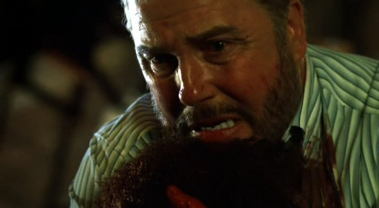 

他呆呆地在小巷里坐到天明，好像失了心一般。

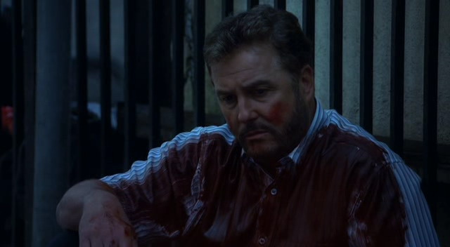 

值得欣慰的是Sara匆匆飞了回来，勉强，能安抚一下他破碎的情绪吧。
一个拥抱，一个简短的促膝而谈，总算是让他恢复了些许精神。

<div style={{ display: "flex", gap: 12 }}>
    
  
</div>
<br/>

夜班的众人都是实力干将，所以很快就推断出了凶手，最后也算是大功告成，只是，看着在葬礼致辞时数度哽咽的Grissom，只能陪着他一起默默掉泪了。

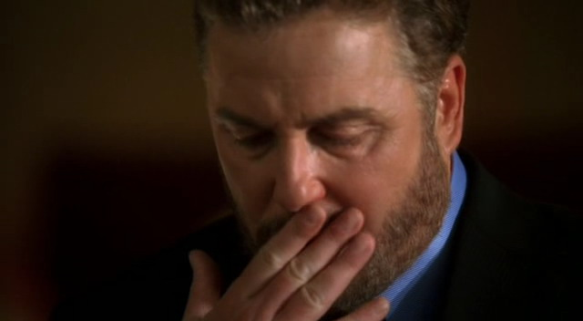 

PS：虽然在这一集说这个不太合适，不过Grissom脱衣服的时候我基本只注意到了他的肱二头肌...

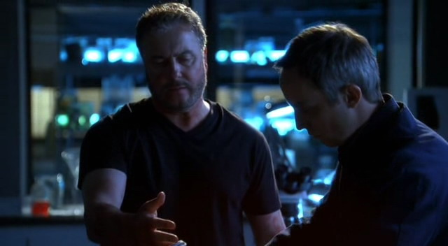 

男神年轻时候怎么说也是一尊会移动的大卫像啊，虽然这会儿肚子是不能看了，不过胳膊还是有得瞧的！握拳.jpg！

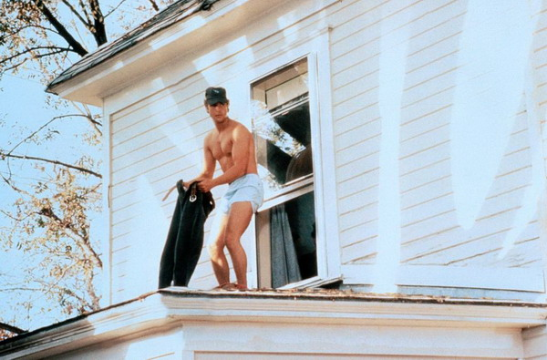 

不要问我为什么选这张，难道真要选全果的吗？

PS2:你那件T恤不会是这么多年一直穿到懈吧…

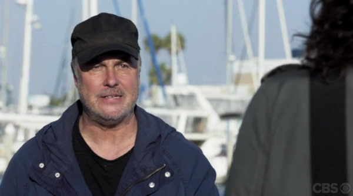 (Finale)

虽然知道William Petersen喜欢一件T恤穿10年...莫非又是私服？？？

<div style={{ display: "flex", gap: 12 }}>
  
  
</div>
<br/>

***********************

### 「仍然很痛」
「9x02」

这可能是Grissom工作以来第一次赖床吧…（不接实验室电话神马的…）
哎，其实你多任性一点没关系的，偏偏Sara一说让你跟她远走高飞，你又责任感爆棚地放不下工作。

```text
(phone ringing)
SARA:  It's the lab again.
(ringing continues)
SARA:  Do you want to get it?
// highlight-next-line
GRISSOM:  No.
SARA:  Maybe we should go away for a while.
// highlight-next-line
GRISSOM:  I can't. We're so short.
```

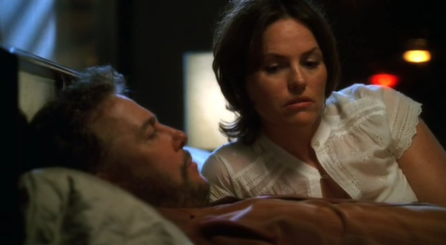 

多想执子之手与子偕老，可做了这追求正义的工作，就有那么多心伤也有那么多身不由己…

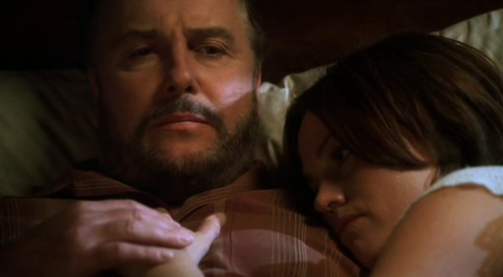 

也想过Sara姐姐能留下来陪着Grissom多好，不过听了CSI Finale访谈Ted说的一句确实也能理解Sara的选择，这些执法工作者看了社会太多的罪恶，心理要承受常人所不能也不需承受之阴暗，所以倒觉得后来Grissom追着她去探访大自然，其实算是个完美的选择了。

一不小心就说错话（？）的Grissom…

就因为你喜欢用双关语，所以总会被Sara姐姐误会啦。
小心被甩哦…这又是言多必失的典型案例吧 = =

```text
// highlight-start
GRISSOM:  You know that after that many years of atrophy, she wasn't coming back to him. 
  I mean, sooner or later, a relationship in stasis withers. You get angry. 
  You need more than the safety of knowing that you're not alone.
// highlight-end
SARA:  Then he should have just walked away.
// highlight-next-line
GRISSOM:  Well, maybe he couldn't. Maybe he needed her to leave him.
SARA:  Who are we talking about right now?
```

<div style={{ display: "flex", gap: 12 }}>
    
  
</div>
<br/>

那个…你不要又在关键时刻卡壳呀…解释两句呀！别说你心里真这么想！

PS….不知道Sara有没有在心里念叨，才离开你多久你就胖这么多…


最后，Sara又走了，就着这集嫌犯对Grissom哭诉的那句话看，觉得太扎了、Grissom的心快被扎烂了。

```text
SCOTT:  She promised me everything... and then she took it all away.
```

<div style={{ display: "flex", gap: 12 }}>
    
  
</div>
<br/>

世上是不是就是有这么多不得已的当局者？

***********************

### 「影响」
「9x03」

Warrick的事过去有一阵子了，
他已经能重新开始调侃David，

<div style={{ display: "flex", gap: 12 }}>
    
  
</div>
<br/>

开始审查新人的日常，

<div style={{ display: "flex", gap: 12 }}>
    
  
</div>
<br/>

但正如部门心理咨询师说的那样，悲痛正不知不觉侵蚀着他们，一向严谨的他开始漏掉实验步骤，

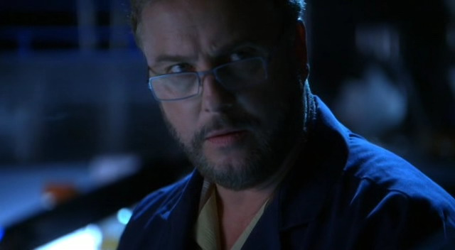 

低迷的情绪还影响到了Hank…(同情严肃认真工作打听Hank是谁的心理咨询师3秒钟…
不过Grissom反驳心理咨询师说"难以关注细节这种状态"对自己来说就是不正常的时候还是很帅~

```text
COUNSELOR:  So, what are you feeling?
// highlight-start
GRISSOM:  I've just been...a little distracted lately. 
  Uh, having a hard time focusing on the details.
// highlight-end
COUNSELOR:  That's normal.
// highlight-next-line
GRISSOM:  Not for me.
```

<div style={{ display: "flex", gap: 12 }}>
  
  
</div>
<br/>

看他那无助又孤独的样子，只能心疼，然后愿一切能尽快恢复如前…

***********************

### 「果然每个人都爱你」
「9x04」

Grissom依旧状态不好，取证的时候直接走神，状态迷离。搞不好偏头疼又犯了。
Catherine直接猜出他又在失眠，还问出他最近被Sara "抛弃" 了…超、级、可、怜…

```text
CATHERINE:  You getting any sleep? Me, neither. What do you hear from Sara?
// highlight-next-line
GRISSOM:  I don't know where she is.
```

不知道是不是八卦就这么直接传遍了整个办公室，每个人都开始对他亲切起来（笑Cry

```text
// highlight-next-line
GRISSOM:  David.
DAVID:  Gil.
```

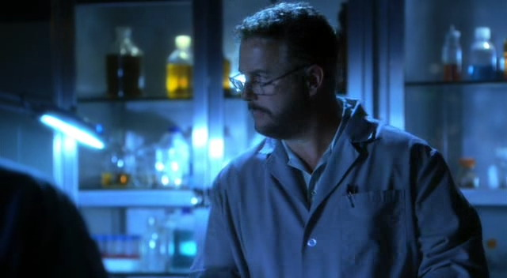 

↑你咋叫这么亲切！

Hodges不仅叫得热络，更是直接上了直球！

```text
HODGES:  Gil. So, I scored two tickets to this Alec Knight lecture. 
  He's, of course you know, challenging the Russian claim 
  that the Romanov remains found in Ekaterinburg are authentic. 
  Open bar.
// highlight-next-line
GRISSOM:  Are you asking me out?
HODGES:  Is that a yes?
```

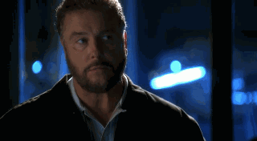 

↑终于意识到自己被"调戏"了（？）….

Grissom当然不会和Hodges一起出去！他只是默默在家抱着Hank
——Hank好乖&孤独的Grissom看起来太可怜！（Sara姐姐你不要生他气了…

<div style={{ display: "flex", gap: 12 }}>
    
  
</div>
<br/>

不过，更重要的，我、想、知、道、你、的、手、怎、么、了！
精神过于恍惚切菜切到手了吗？！

***********************

### 「令他如此烦恼的永远是Sara——满集的心疼」
「9x05」

得不到Sara的消息烦躁，收到Sara的消息了，更烦躁…
因为，这基本是封分手信吧！

<div style={{ display: "flex", gap: 12 }}>
  
  
</div>
<br/>

Sara决定往前走了，一直等不到Grissom的追随，应该是伤心了吧。但从后面Grissom和Lady Heather谈话来看，我看多半又是他拖延症犯了而已，摊手…

接到这种消息，对Grissom来说打击太大…
失眠、精神不济、无心工作…（继续同情主动挑起大梁的Catherine
看着他在雨里才敢表露出无助，继续心疼。

<div style={{ display: "flex", gap: 12 }}>
  
  
</div>
<br/>

案子好死不死地涉及到S&M，给了他一个超好用的借口去见Lady Heather，没想到你竟然"没朋友"到这种地步，偏要去找她 = =
不过再怎么气他非去招惹女王，看着他在人家门口被雨淋到像只小鸡子似的瑟瑟发抖，满心的怨气也直接化成同情鸟…

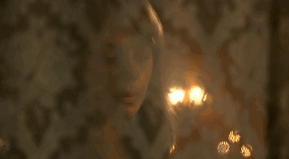 

多穿一点儿会死吗！！又得肺炎了怎么办！！

这么多年了，这俩之间机缘巧合地发生了这样那样的事（我始终坚信他们之间其实并没有什么！），出于朋友情分Lady Heather也愿意帮他忙，不过要求是否可以在他身上演示一下呐啥啥时，我仿佛看到了Grissom脸上那使劲压抑着的大写粗体的"尴尬" = =

<div style={{ display: "flex", gap: 12 }}>
  
  
</div>
<br/>

要说Lady Heather就是Lady Heather，竟然说动Grissom做心理咨询…

<div style={{ display: "flex", gap: 12 }}>
  
  
</div>
<br/>

(乖巧状)

要说这世上还有谁能压制得了他，除了Sara恐怕只有Heather了吧。不过看他一副小心谨慎的样子，还是觉得好、心、疼！

无论如何不喜欢这集的结尾！就算坚信什么都没发生也不喜欢！就算知道Grissom终于能睡个踏实觉也还是不喜欢！←这里也是重要的事情喊三遍

<div style={{ display: "flex", gap: 12 }}>
  
  
</div>
<br/>

这一脸的"宝宝心里苦" T^T

哎，原来已经孤单难过到要Heather陪他一下的程度了吗，观众心已被戳烂…T^T

***********************

### 「是不是聪明人赌起牌来都很帅」
「9x08」

这集剧情其实算是走个怀旧风，50年前的赌场旧地神马的。
为了追查旧案真相Grissom回到了赌场秀了一把牌技，扑克脸又立新功~

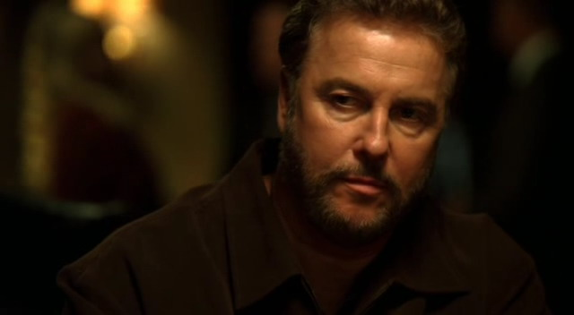

还是要说这张脸太帅….（词汇太贫乏的我…）

不过在老警长面前还是不太能玩儿得转，两三句被搪塞过去还得请人家喝酒= =

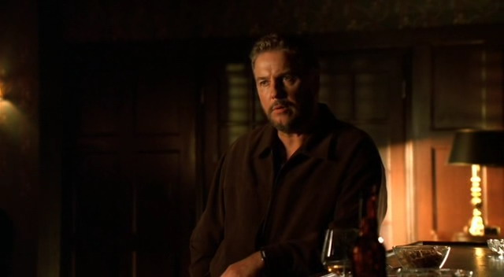

剧终时听到他向Catherine透露他来赌城的初衷算是个亮点…
为了买小猪去打牌啊（科学怪人本性） = = 
好在我们的科学怪人也终于开了窍，为了他心爱的姑娘准备加大赌注了~

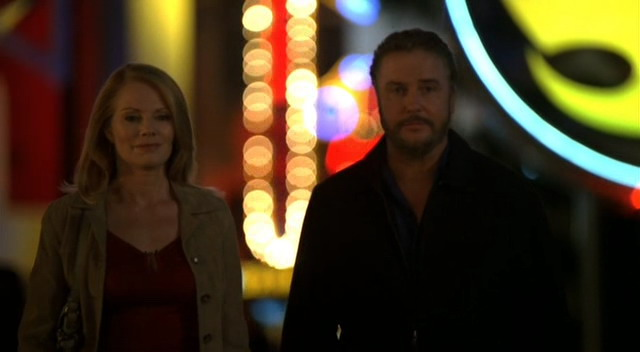

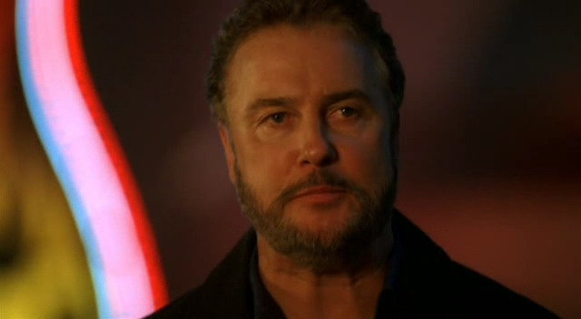

哦，对了，如果打牌的人都是既聪明又帅那是真的让人眼泛桃花啊~

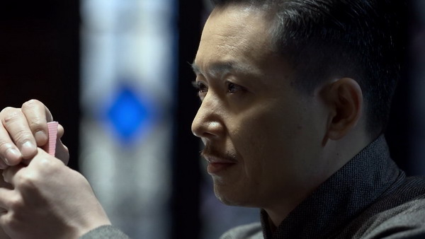

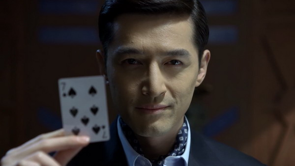

（伪装者 30）

***********************

### 「告别」
「9x09-10」

考虑了许久，斟酌了许久，他终于做决定要离开了。
从最开始听到他要离开的消息，到最后他笑着转身而去，团队里的每个人都和观众一样，充满了不舍的情绪。
因为William Petersen将要离开剧组，我想他们也是真情流露吧。

Grissom说出要离开的消息时，自己也有诸多犹豫。他肯定也有不舍，否则不会犹豫这么久；他肯定怕大家难过，所以这个永远不善社交的bug man，这次也是极尽所能地摆出了最温和的笑脸，佯装着"这不是什么大事"，然后默默转身。

<div style={{ display: "flex", gap: 12 }}>
  
  
</div>
<br/>

他们都不希望这是真的，却也猜到了他心中所想，所以也只能笑着给他祝福。

```text
ROBBINS:  Are you really leaving?
// highlight-next-line
GRISSOM:  Yep. Think of it this way, Doc. You'll have somebody new you can tell all your old jokes to.
ROBBINS:  I like the old guy just fine. 
  Are you, uh, running away from something? Or running to something? Someone?
// highlight-next-line
GRISSOM:  I'm running to my office.
```
↑总是这么口不对心呐…

<div style={{ display: "flex", gap: 12 }}>
  
  
</div>
<br/>

比起老法医，这里还有一位共事了更久的同事，不过话说Grissom你真是这么耿直的boy么 = =，Brass一脸无语啊…

```text
BRASS:  So I hear you're moving on.
// highlight-next-line
GRISSOM:  I am.
BRASS:  That's too bad.
// highlight-next-line
GRISSOM:  We'll stay in touch.
BRASS:  Sure. You know, the barbecue, Labor Day, Fourth of July. Go out on the boat.
// highlight-next-line
GRISSOM:  You got a boat?
BRASS:  No.
```
（不过，Grissom你放心，你以后会有条boat哒！）

<div style={{ display: "flex", gap: 12 }}>
  
  
</div>
<br/>

说到耿直，原来David才是最多愁善感一个~他要哭了…

```text
DAVID:  You're going to miss this, you are.
// highlight-next-line
GRISSOM:  There's bugs everywhere, David. I will miss you, though.
```

<div style={{ display: "flex", gap: 12 }}>
  
  
</div>
<br/>

其实Grissom并没有自己想象的这么孤单，知你所想的朋友，其实身旁一直都有。（反而是自己后知后觉…）

```text
// highlight-next-line
GRISSOM:  Catherine, I, uh, I know I surprised you today, with the...
CATHERINE:  I knew. I knew before you knew.
```

<div style={{ display: "flex", gap: 12 }}>
  
  
</div>
<br/>

他对每个人其实都很好，所以大家除了不舍，更多的是满心的谢意。

```text
WENDY:  Grissom. I just want to thank you, for everything. 
  For the support and the encouragement that you've given me.
// highlight-next-line
GRISSOM:  You earned it.
```

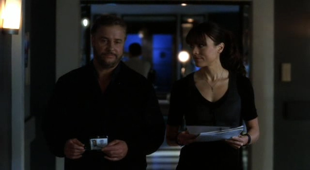

许多年过去，他的学生都已能独当一面，这是让他最开心的事吧。

```text
NICKI :  will never forget the things you've taught me.
// highlight-next-line
GRISSOM:  You're the best student I ever had, Nick.
```

<div style={{ display: "flex", gap: 12 }}>
  
  
</div>
<br/>


Greg也是他亲手培养起来的孩子，从一个有点儿玩世不恭的技术员，成长为优秀的Level III。
Grissom不愧是人生导师~

```text
GREG :  Gris, I just, uh, want you to know how much I appreciate you putting me out in the field.
// highlight-next-line
GRISSOM:  I'm sure there were times you wish I probably didn't.
GREG :  Well... you changed my life.
```

<div style={{ display: "flex", gap: 12 }}>
  
  
</div>
<br/>

画风清奇的Hodges可能算是做了所有人都想做而不敢做的事，先是使小性子不愿意理他，后又情绪激动地直接要他留下，笑，他是真心崇拜Grissom的。

```text
HODGES:  As your friend and colleague, 
  I feel it is my obligation to inform you what a colossal mistake you're making.
// highlight-next-line
GRISSOM:  Hodges...
HODGES:  Guys like us don't just get to hang it up. This job is who we are. 
  We are the thin blue line between order and chaos. You take yourself out of the equation, 
  who knows what's gonna happen? 
  That's the Butterfly Effect. You taught me that. 
  The bad guys will win more if we don't have you. Who is Watson without Sherlock Holmes?
// highlight-next-line
GRISSOM:  Watson was a genius in his own right. It's the right time for me to go.
```

<div style={{ display: "flex", gap: 12 }}>
  
  
</div>
<br/>

说什么"who knows what's gonna happen?"想想之后GSR一度发展的结果，让我先哭会儿….

话说Ecklie终于熬出头要晋升副治安官了，不过直到最后，他和Grissom的同步率依旧在50%以下（笑哭

```text
ECKLIE :  Come in.
// highlight-next-line
GRISSOM:  I need a favor. It's something you're going to have to clear with the sheriff.
ECKLIE :  What, do you have bugs in my office?
// highlight-next-line
GRISSOM:  No. I have bugs in my office.
ECKLIE :  What?
// highlight-next-line
GRISSOM:  What are we talking about?
```

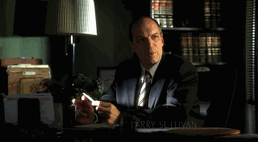

看看人家Brass~

```text
BRASS :  Also, Sheriff Burdick wants to start a task force about this, 
  and he's asked me to ask you to stay on--so I'm asking.
BRASS :  Okay, I have an answer. I'll keep you informed.
```

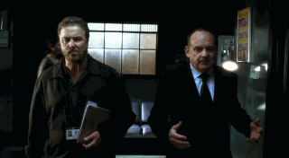

该来的终究要来，他终究是笑着离开了。

<div style={{ display: "flex", gap: 12 }}>
  
  
</div>
<br/>

那有点儿没落的背影刚勾起我满心的失落，画面一转却是豁然开朗。
是啊，其实，前面是一片豁然开朗的。密林，昆虫，他心爱的女子。
他那略显笨重的脚步，被汗水浸湿的衣服，看到Sara时不着痕迹地放松了的那声吐息…

见到Sara回头时百感交集的那份喜悦，促使这个一向内敛到让人吐血的男人终于箭步冲上去拥住他一生所追求的那个女子（好吧，其实已经求婚成功了…）

[CSI.S09E10.One.To.Go.结尾](https://v.youku.com/v_show/id_XMTUzNzk4MTc5Ng==)

最后，我觉得猴子过于抢镜了= = 全剧唯二的GSR Kiss让我们看全会少块肉吗？！

还有，编剧你给我出来，这样历经磨难终成正果的两个人后来是怎么分手的？！你、给、我、出、来、解、释、一、下！！！
（虽然2015~2021终于给了俩人一个完美结局吧...但也无法弥补我这些年来想起来就被刀的痛苦！

-我的CSI LV END-

PS：线下的Grissom和小猴子好可爱!! 雨林幕后整体氛围都好暖！！

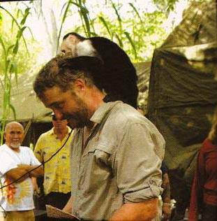

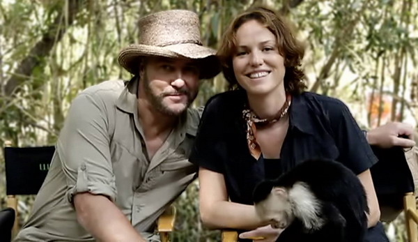

***********************

最后，以 [ANX的终季预告片](https://www.bilibili.com/video/BV1EG4y1z7qx/) 先结个尾。截止到Finale我看过的最赞的CSI宣传片。

顺便，2021新番 [CSI Vegas宣传](https://www.bilibili.com/video/BV18f4y1c7Sx)


