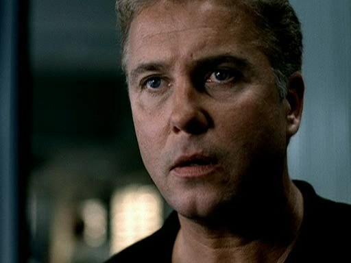

"那么，晋升到CSI Level II感觉如何？"

Sara咧嘴笑起来，即使电话那头儿的Mary看不到她的表情。"非常好。" 她如是答道。

Mary笑出来，"你只会这么形容？"

"我爱这份工作，" Sara笑着说，"你是想听这个吗？"

"我不知道，" Mary回应道，"我只是...我很开心你喜欢你的工作。"

"我喜欢。" Sara明确答道，"Tom怎么样？"

"转换话题？我问太多了？"

Sara大笑起来。"什么嘛？我不能问问你的男朋友吗？你要知道可是我促成你俩在一起的。"

"Yes，我知道。" Mary低声下气的回答道，"他很好。我们俩很好。"

"很高兴听到这些。"

"真的？"

"Mary！" Sara提高嗓门，"当然是真的！我为你俩感到高兴的！"

Mary的声音中闪现出一些犹豫，"我只是..."

"只是什么？"

"我觉得不太好。"

"什么？" Sara完全困惑了，"为什么你感觉不好？"

"Sara。你又开始约会了么？"

"你想让我跟谁约会？" Sara问，"我的主管么？在San Francisco我还没碰上什么男人。"

"Carl不是比你大嘛？"

Sara大笑起来。"他和Grissom同年代的。我更关心他是我的主管这件事。"

"Honey，不是我说话刻薄，不过Grissom比你大太多啦。"

"你这种坦诚总是让我惊讶呢。你知道的，Grissom和我没有约会过。"

"我记得。而且，据我回忆，我们几年前还讨论过这样是最好的。"

"God, Mary, 我想你了。" Sara叹了口气，没有回应Mary刚才的话。"我需要一个像你一样的人来让我乖乖的。我希望你来这边完成你的博士学位。"

"我也是。" Mary答道，"不过，Middlebury是国内最早的语言学校。他们近代语言项目的博士学位非常特殊...我怎么能错过呢？"

"我知道，" Sara叹气道。"但是，它在Vermont嘛。"

"我知道。" Mary轻轻地说。

"我只是..." Sara放低声音，又叹了口气，"只是想如果有个朋友在身边就太好了。"

"Carl和Anne呢？"

"他们很好。我喜欢他俩。不过...我觉得你没法和在工作中指导你的人成为最好的朋友。"

"我想是吧。" Mary含糊地说。

"听起来你不是很肯定。"

"嗯，是啊。" Mary答道，"我想你可以把工作关系变成友谊。你只是得努力一下。"

"也许我会的。" Sara说。

"听着，Sara，我得挂电话了。" Mary说道，觉得在好友陷入沮丧情绪的时候挂断电话太糟糕了。"Tom马上要来了。他准备带我出去吃晚餐。我晚上回来后再给你打电话好么？"

"Okay。我今天休息，什么时候打来都行。"

"我会的。" Mary保证道。"我之后打给你。"

"好的。帮我跟Tom问好。"

"我会的。"

"Bye."

"Bye."

Sara挂断电话后盯着电话看了一会儿。和她最好的朋友聊天怎么让她觉得这么难过呢？

"因为我太想她了，" Sara叹了口气，"我想念她和Tom。我想念能和朋友一起出去玩儿的日子。"

又叹了口气，她俯身从咖啡桌上捡起一本法医取证学杂志。也许读读这些可以让自己振奋起来。

*************

"Nicky刚办完他第100个案子。" Catherine说着绽放出大大的微笑。

Grissom也笑了，"那，我们该告诉他么？"

"Yes，" 她兴奋地说。"他和Warrick都在休息室。"

Grissom拿起Nick的身份名牌时稍稍皱了皱眉，"Warrick不是应该和Holly在一起么？"

Catherine也跟着皱了皱眉，"Holly应该在实验室的什么地方吧。Warrick不应该自己回来呀。"

"Okay。" Grissom说。

"我们去问问Warrick她在哪儿。" Catherine说，"来吧，Gil。咱们去告诉Nick他晋升的消息，然后带他出去吃早餐。"

"好吧。"

他们一起离开他的办公室走向休息室。正如Catherine所说的，Nick和Warrick正坐在一起，谈论着他们最新买的电视游戏。

Grissom骄傲地把Nick的新身份证明交给他。Nick则在大家为他鼓掌时开心得不得了。即使是Warrick也立即向他表示了祝贺。

当Brass出现在门口时，他们正站起来准备出门吃早餐。即便他还没开口，大家也从他严峻的表情中看出有什么不好的事情发生了。

"Holly Gribbs中枪了。"

那一瞬，谁也说不出话来。

Brass继续说着什么，但Grissom基本连一个字也没听进去。他没法相信发生在Holly身上的事，仅仅数小时前他刚从一群尸体手中拯救了她，现在她的生命却岌岌可危。

但是，这是事实。Holly，他们的新组员，Holly，只因为母亲的愿望就来了这里，Holly，让他愈发想起Sara...

她不是Sara，他坚决地告诉自己。Sara在San Francisco很安全。从她几小时前第一次走进他的办公室以来，他第一次庆幸Holly不是Sara。Sara正处在死亡边缘的想法实在...

他需要转移一下注意力。他环顾了一下他的同事们。Catherine和Warrick脸上带着相同的表情，他很确定他们正感到内疚。他俩都是，为了各自的原因，觉得自己该为这女孩儿中枪负责。Catherine眼中慢慢涌出泪水。Grissom又朝旁边看了看。

他对视上Nick的双眼。Nick，和其他人一样震惊，看着屋里的其他人。Grissom这时想起Nick甚至还没见过Holly。从这方面看他可能是他们当中最能保持情绪稳定的了。

"Oh, my God。" Catherine等Brass走后如此说道，"都是我的错。"

"Cath，并不是你开的枪。" Nick轻轻地说。

"是我劝她留下的，" 说着，泪水滑落她的脸颊，"本来便利店的女人放走她之后她就打算放弃的，但我非要去鼓励她..." 她声音渐渐低下来，并看了看Grissom，"我之前错了。接到求援的该是你，不该是我。"

Grissom呆呆看着她。他听见她说的话了，他也能听懂。但他无力作出回应。

"你不知道，Catherine。" Nick说着碰了碰她的手臂，"想想你有多少次告诉Warrick和我应该留下来。我们还在这里呀。"

Catherine泪眼婆娑地看着他，然后把头靠在他肩膀上。他用手臂拥住她，试图让她能感到些许宽慰。

Grissom叫他的声音让Warrick回过神儿。Grissom看到这个年轻人仍然震惊地望向自己。

"是我叫你离开的。" Grissom轻声说。

Warrick茫然地摇摇头，"No..." 他喃喃地说，"我..." 他咽了下口水，"我根本不应该离开。"

"你只是做了我要求的事。"

"但是，之前..." 他停下来，好像在找寻更合适的语言，"你并没命令..." 他换了种说法。

Grissom知道这是事实。他并没有命令Warrick到嫌犯家去见他，去看那个Warrick确信是凶手的男人被押走。Warrick是自愿的。但是，Grissom仍然感到自责。

他应该想得更周全。他应该更好照顾她。他应该能做个更好的上级。

然后，不知为何，他现在只想给Sara打个电话。他只想知道她一切安好。

"Grissom?"

他抬头看见Brass又走进房间。"Yes?"

"我需要你接个跳楼的案子。"

一个新案子？Grissom眨眨眼睛。他现在怎么能离开呢？

答案其实很简单。

"好吧。"

他不能留在这里干等Holly的消息。他不能为这个认识不到12小时的女孩儿守候不前。他知道一旦他开始调查那个从酒店阳台跳楼的男人之死，基本没有时间去思考Holly发生了什么。但是，这正是他需要做的。他需要他的工作。他需要去做点儿什么。他需要一些事来分心。

*************

他带尸体回到实验室的时候还没有太晚。他知道自己能在休息室找到在等候Holly消息的组员们。他只希望能说服Catherine或Nick加入到这个跳楼的案子里来。在尸检之前他还有些时间，所以他决定先去找到他们和他们聊聊。

在去休息室的途中他路过前台。"有给我的留言么？" 他问接待员。

她点点头，然后递给他一些留言条。他震惊这看着手里的纸条，快速翻阅了一下。所有这些都是治安官留下的。他抬头看了看接待员仿佛是她搞错了什么，然后回到自己办公室去回电话。自己的组员可以等等再去找。

电话只响了一声就被治安官接起来。

"Hi，长官，我是Gil Grissom。" 他率先打招呼道，"我看到您好像要联系我。我拿到一些您给我的留言条。"

"是的，Grissom。" 治安官答道，"我们需要谈谈你的小组。"

"Okay。" Grissom慢慢说，对事情的发展完全摸不着头脑。

"听着，Grissom，我知道你不喜欢绕弯子，所以我就直说了。今晚有个女孩儿被枪击了。她很可能挺不过去了。我不是要问责谁，但我想夜班组需要做出一些调整了。"

"我相信一些新的防护措施可以加到现场..."

"我不是在说防护措施，" 治安官打断了他，"我在说领导层。"

"领导层？"

"我已经撤掉Brass的夜班组主管一职了，" 治安官坦率地说，"我想让你来接手。"

"什吗？"

"我想让你来领导夜班组，Gil。你愿意做吗？"

他没时间去想，不过，说真的，这里只有一个选择。"Yes——当然——不过你确定要这么做吗？"

"Yes，" 治安官淡然说道，"我确定。"

"这是长期变动？" Grissom问。

"就我考虑，是的。" 治安官答道，"Gil，我了解你的工作能力。我们一起工作很多年了。你是我们最好的CSI之一。如果我觉得你不行我是不会让你接手这个组的。我对你做这个职位有信心。我知道你能行。"

"但是, Brass –"

"Brass不再属于CSI了，" 治安官又打断他，"他昨晚作出的决定。"

Grissom咽了下口水，"我会尽力的，长官。"

"我知道你会的。而且我知道你一定能做好。"

"我开始前该注意些什么吗？"

治安官的声音听起来十分严峻，"Yeah。别让你组里的人被枪击了。"

*************

Grissom挂断电话并震惊的盯着它。他要掌管这个组了。他给Brass做副手很久了，但从没想过要做到主管的位子——至少，不是像想在这样。

他有太多的决定要做了，不过有一些很简单明了。首先，他得尽可能诚实地告诉他的组员他将是新主管了。他知道Catherine不会太高兴。因为她期待这个职位很多年了。不过，随着他的晋升她的职位也会有所变动。只希望她能开心接受成为他的副手这件事。

下一个决定是坚持执行Brass安排给Warrick的行政休假。他绝对需要些时间来从这次的打击中恢复过来。

Holly的枪击案会归到他们组来调查。选择来调查她案子的CSI还是很容易的：最新的CSI III Nick。唯一一个和Holly没有私人接触的组员显然是她枪击案调查员的不二人选。

最后，他们需要一个人来代替Holly。一个之前和实验室没有关联的人。一个可以公正调查为何发生如此悲剧的人。

而这个选择，也很简单。

*************

Sara用遥控器换着频道，期待电视上有什么不错的节目。她感到很无聊，需要点儿不费脑筋的东西分神。

这时电话响起，让她把注意力从地方新闻上转移开来。她挑眉看着电话，惊讶于Mary这么早就结束约会回家了。希望Mary和Tom之间没出什么纷争才好，她伸长手臂抓起听筒。

"Hello？"

"Sara？"

"Yes？"

"Hi. 我是Gil Grissom。"

"Grissom！" 她惊呼道，并马上坐直了一些，"Hi！你怎么样？"

"嗯 …"

"怎么了？" 她问着，没来由的恐惧抵在喉间。

"我很好，如果你想问这个的话。" 他说，"但不幸的是，我队里有个组员不太好。"

"发生什么了？" 她问，并能感到恐惧正揪着她的心。她没见过他的组员，但是，不知为什么，她觉得自己已经认识他们了。

"我和你提过Holly，对么？"

"你们新来的实习生？"

"Yes, 就是她。"

"她不是这周才开始的么？"

"Yeah，昨天是她第一天上班。"

"她做了什么？"

"嗯...发生了些事故。"

"发生了什么？" Sara又问。

Grissom深深吸了口气说，"她在一个现场中枪了。"

"My God。" Sara说着不由自主地握起拳头，"她还好么？"

"她正在手术。"

"这听起来可不太好。"

"我期望你说的不对，但他们说她情况不太好。"

"Oh, Griss。我很遗憾。"

"谢谢。" 他有点儿尴尬地说。吐了口气继续道，"还有。"

"告诉我吧。"

"Warrick当时是和Holly一起工作的。"

"那他还好吗？" Sara知道Warrick对Grissom来说有多特别，她不想去想象如果他的学生发生什么事故会带给给他多大的打击。

"他没事。" Grissom慢慢地说。"问题是，当事故发生时他没和她在一起。"

"他去哪儿了？"

"这是另一个问题。我不知道。"

"你不知道？"

"我通知他离开现场来着。"

"为什么？"

"他之前办了另一个案子，但后来他被调离了...这说来话长...我接手了那个案子，而我希望他能看着那个嫌犯落网。" 他顿了顿继续说，"问题是，Holly好像是在我叫他之前被枪击的。"

"所以，你是说他在你叫他之前就离开了自己的现场。"

"可能是这样的。" Grissom叹了口气，"我把Holly忘了，Sara。当我叫Warrick的时候，叫他离开他的现场时，我没想到那等同于叫他离开Holly。"

"但是，你没有啊。你刚说了你叫他的时候他已经离开了。"

"无论如何，我没想到——"

"你不能为此自责，Grissom。" 她打断了他，"这不是你的错。"

"这里有太多疑问了，太多细微的证据、事实以及臆测...我觉得这些全都围着我转而我永远无法理清。" 他深呼了一口气，"然后还有。" 他慢慢说道。

"是什么？"

"嗯，因为Holly身上发生的这些，治安官决定做出一些重大变动。"

"我想我能理解。"

"Sara，我被升职了。"

"升职？" Sara重复道。

"Yes。我要主管夜班组了。"

"这太好了！祝贺你！"

"谢谢。" 他说，但从他的声音听不出一丝对于新职位的雀跃之情。"我只希望这是因为Jim自主选择离开，而不是被迫的。"

"Oh。我想我明白你的意思。"

"关于我的新职位..." 他声音渐低并顿了一下，"Sara，我需要你的帮助。"

"我能做什么？"

"我不知道该怎么说。"

"直接告诉我。" 她说着皱了皱眉。什么事让他如此拿不定主意呢？

"Sara，我想让你来Las Vegas帮忙做这次调查。我们需要查出Warrick去哪儿了，而我想让你来调查他。" 他顿了顿继续说，"我不只想让你帮忙这一次，" 他明确说，"我想让你来我们的实验室工作。"

她迅速吸了口气，"你想让我搬去Vegas？"

"Yes。"

"你想让我到你的实验室和你一起工作？"

"Yes。" 他顿了顿，"如果你不能来我也能理解。只是...当我意识到发生了什么之后我立刻想到了你。我信任你。知道你能胜任这个。希望你能做这个调查。我想让你在这里，和我一起工作。" 他又顿了顿。当他再次开始发声时，声音只如低语一般。"I need you。"

她再没有任何犹豫的说，"我会过去。"

"你会来么？你确定？"

"我确定。" 她整个人容光焕发起来，"我已经等不及了。"

Grissom不由自主地咧嘴笑起来。也许这次的悲剧也会带来些好事。"我也等不及了。"

【END】
