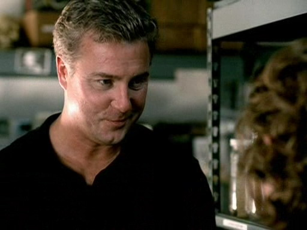
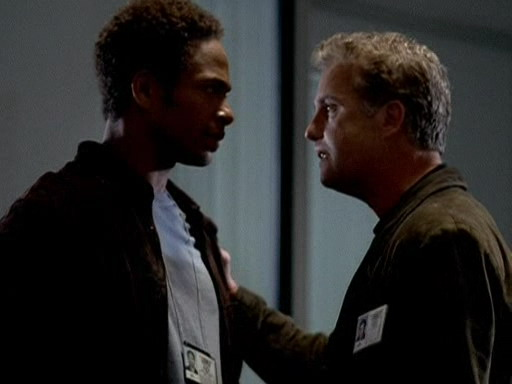
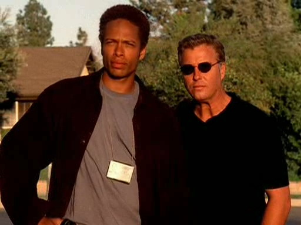

严格来说并不是爱上她——是爱上了好像和她重叠了的那个人。

那一瞬，Holly Gribbs成了Sara Sidle。

她和她很相像，在某种程度上——褐色短发，茶色的大眼睛，满满的笑容。她眼里也跃动着什么——她的灵魂与Sara很相像。

当他们握手寒暄，当他要求她给他一品托血液，他知道自己正把所有他永远不会允许自己放到Sara身上的感情投射在Holly身上。他知道自己正在释放自己的感情，而且无力停止。Sara远在数百英里外，而Holly则站在他眼前，为他工作，把他看做自己的导师。她需要他，而他也需要她。

在这个Sara不在身边无法承接他情感的当下，他需要她成为那个让他可以宠溺可以教导的人。

他应该发现自己已经陷得太深了。

*************

"她很可爱。"

Grissom决定夸奖一下自己，他没把那个闪过脑海的想法说出来。其实他觉得像Dr. Leever这样的老男人用这样的词来形容Holly不是很合适。

"她是个好女孩儿。" 他决定换种方法表述。

"她看上去不错。" 法医边点头边朝尸体俯下身开始工作，"你觉得她准备好了么？"

"我不觉得她在第一天上班就准备好做尸检了。"

Dr. Leever再次点点头问，"Brass的命令？"

"Yes。"

"我们的队长打算让这位花多久退出？"

"8小时。" Grissom没去对视老法医的双眼。尽管他喜欢这个老头儿，但他不想让他从自己的眼中看到任何会暴露自己想法的线索，其实Grissom对Brass想尽快剔掉Holly的计划不是很开心。

"你觉得她受得了？"

Grissom叹了口气，觉得后果堪忧。"我会尽力让她留下来的，" 他说，"Catherine也会的。不管Brass怎么想，我们俩还是希望组里有位新成员的。"

"祝你好运。"

突然一阵微弱的尖叫声让他俩都抬起头来。Grissom看向太平间的监控器。

"Holly被困住了。" 他说。

"我跟她说了洗手间要往右拐的。" 验尸官叹了口气说。

"我去帮她一下。"

Grissom没等话说完就转身出门去了。他跑到Holly被困的房间，用手臂从外侧将门顶开来。

Holly边往外跑边叨念着尸体在呼吸之类的话，Grissom赶快抓住她并给了她一个安慰的拥抱。他用尽全力提醒自己，这个人是Holly，不是Sara。

Grissom放开她又走回到门边去。他透过窗户窥探了一下那些排列整齐的尸体。

"你们这群混蛋！" 他朝尸体喊道。

当他转回身时Holly已经破涕为笑了。那一瞬，他真心觉得她能挺过去。他松了口气，因为他不想失去她。

鉴于他已经帮她找回了笑容，他知道她开始工作的这第一个晚上已经没问题了，于是带她离开了太平间。两人要一起前往一家发生事件的便利店。

走出房间，他深深吸了口气并轻轻摇了摇头。

这是Holly，他告诉自己。她不是Sara。你不能老想着她和Sara多么相像，否则你永远不能欣赏到真正的她。

在去便利店的路上，他给她讲了很多可笑的故事——真实的，但都很可笑的故事。她听出他是想让她高兴起来，不过也承认这确实有效果。

再一次遵循Brass的命令，他把她留在便利店自己返回了实验室。她自己能搞定收集指纹的工作的。

她应该可以吧？

*************

Grissom站在实验室里，小心的往一个假人头里注入血液。Catherine走进来静静地看了他一会儿。

"这是真的血液，是不是？" 她最后终于打破沉默问道。

"Yes。"

她皱了皱脸，"我能问问你怎么弄到的么？"

"Holly。"

"Holly愿意给你她的血液？"

"我可没把她绑起来。"

Catherine闭了下眼睛，"那你怎么弄到的？Gil？"

他终于从假人身上抬起头对上她的视线，"我跟她要的。"

"我想想...Holly第一天上班的晚上，遇见了你，她的主管。你欢迎她的加入，让她填写了必要的表格，复印了她的驾照、社保卡，然后跟她要了一品托鲜血？"

他调皮地朝她咧咧嘴，"Catherine，你对人事要求复印驾照和社保卡的手续知道得真清楚。"

"真不敢相信你！" 她大声道，"你老老实实地管她要了一品托鲜血？"

"我需要鲜血做实验看看血液的飞溅模式，这案子里假设了妻子用了钝器击打..."

"够了！"Catherine大叫，"你是怎么说服她...献血的？"

他耸耸肩说，"我告诉她提供血液样本是新人的标准程序。"

她嫌恶的看了他一眼，"有时候，我真想知道你那颗超乎寻常的大脑出了什么问题。"

"Oh，Catherine，我保证你不会想知道的。"

"我想也是。" 她说。

"我们聊完了么？" 他问道，"我还有颗头等着敲呢。"

"你看见Warrick了么？" 她问，"我想跟他说说我们在案发现场找到的那只鞋子。"

"有一会儿没看见了，" Grissom答道，"你找过休息室了么？"

"Yeah——只有Greg在那边。"

Grissom摇摇头，"他很享受他的休息时间，对不对？"

"Greg是我们这几年来最好的技术员，Gil，看你敢剔掉他。"

"我喜欢Greg，" Grissom申辩道，"我只是在说他比他的前任做任何事情都要快这个事实。"

Catherine摇摇头说，"我要去找Warrick了。如果你看到他，告诉我一声。"

"Catherine!" Brass边说边走进房间，"我需要你去——"

"别管我刚才说的了，Griss，" Catherine跟着Brass走出房间并说道，"我之后再找Warrick吧。"

"好的。" Grissom说着戴上了护目镜并拿起一根高尔夫球杆。

"他干什么呢？" Jim问。

Catherine摇摇头说，"你不会想知道的。"

笑了笑，Grissom挥起球杆朝假人头上砸下去。

*************

"Brass不给我搜查令！"

Grissom抬头看向Warrick。"啥？"

"我在鞋里找到了一片脚指甲，而我需要拿它和那个丈夫的脚指甲做对比，但他不许我这么做！"

"OK，慢点儿说，" Grissom冷静地说道，"告诉我是怎么回事。"

Warrick一屁股坐进Grissom办公桌对面的椅子里，"我又调查了鞋子，如你教我的那样。"

"嗯。"

"然后我就发现了一片脚指甲，应该能证明那个丈夫穿了受害者的鞋子去踢他自家的大门。这就证明他杀人并不是单纯为了保护家人——他谋杀了那个人，然后布置了现场让人看起来那个人是个威胁了他们的入侵者。"

"那个死去的男人和他们住在一起，" Grissom公正地说，"那个丈夫有可能以前穿过他的鞋子。"

"他签过一份书面声明说他从没穿过那人的鞋子。"

Grissom点点头，"你做的很好，Warrick。"

"那为什么Brass不帮我要搜查令？"

Grissom叹了口气道，"我不知道。不过，Warrick，听着...有些时候，我们得耐心一点儿。有些时候，等待才是最好的行动。"

Warrick从他坐的椅子里跳起来，"我想要抓住这个男人，Griss！"

"你是想打败Nick，" Grissom说，"我知道你们正摽着劲儿。我知道你们两个都在办自己第100个案子。我知道谁先结案谁就是新的Level III CSI了。" 他顿了顿继续说，"我也知道我以前告诉过你别去想你的升职。你办这个案子是为了帮助受害者的家人，Warrick，不是为了让你晋升。"

Warrick猛地拍了椅背儿一下，"你和Brass是一路的。"

"No," Grissom平静地说，"我没权利给你搜查令。"

"Yeah，好吧，我自己去搞。"

Grissom惊讶的看着他说，"耐心点儿，Warrick。别做傻事。那只会让你惹上麻烦。"

"好。" Warrick边说边朝门口走去。"我们晚点儿再见，Griss。"

Grissom看着他离开的背影摇了摇头。他希望Warrick能懂得要遵循Brass的命令。

而Grissom完全不知道就在他帮忙开解Warrick的时候，Holly也遇到麻烦了。

*************

"我见到咱们新来的姑娘了。"

Grissom听了Catherine的话微笑起来，尽管透过电话线Catherine看不到他的表情。"她是个好姑娘，对不对？"

Catherine叹了口气，"我真的希望她能坚持下来。"

"她可不像你那么坚韧。" Grissom笑着说。

Catherine翻了个白眼，"嗯，在便利店她做的不太好。我带她离开了。"

"怎么了？"

"Oh，那店主是个疯子。你知道的。她觉得Holly干活儿不够快所以威胁要朝她开枪。"

"什吗？" Grissom大声道。

"别担心，我已经搞定了。"

"我肯定你漂亮的搞定了。"

他能听见Catherine在电话那头笑起来。"嗯，我好像跟那女的说了我们不会再回去处理她的商店了。"

"Catherine …"

"Oh，我知道不能那样干。" 她说，"不过，Holly吓得够呛，我带她去吃饭了。"

"我回实验室来了...没接到她的求援..."

"别担心这些。我帮你善后了。" Catherine调侃道，"而且，说句不好听的，我在这儿应该比你在这里要好。她需要有人给她些鼓励，无意冒犯，不过这方面我比你要擅长。"

"你知道吗，我觉得谦虚是你最讨人喜欢的特质呢。" Grissom说。

Catherine挑了挑眉说，"然后你最会甜言蜜语了。"

"一针见血。"

Catherine叹了口气道，"你知道吗，她来咱们这里只因为她母亲想要她来这里。"

"我不清楚，" Grissom说，"Brass好像说什么她母亲在交通系统工作。"

"Yeah，" Catherine答道，"显然，Mom觉得自己没法再晋升了，但希望自己的宝贝女儿能有个好前途。"

Grissom叹了口气，"我讨厌听到父母把自己的理想强加到孩子身上。"

"不管怎么说，我觉得这孩子需要有人带她一下。" Catherine说，把他们的对话转回正题，"倒不是说要时刻照顾她，不过是要确保她有能力独自出现场。"

"Brass不会同意的。" Grissom说着转过了主管办公室的拐角，"他想让她离开咱们这儿。我们能做的任何防止她被开除的事都会——"

正在这时他听到有争吵声传来。他不再说话，听见Brass正在斥责Warrick竟然自己跑去找法官要了搜查令。Grissom不禁闭起眼睛。显然，Warrick没有听从他的建议。

"Gil？你还在吗？"

"我得挂了，Catherine。我想Warrick这边出了点儿状况。"

她呻吟道，"他干了什么？"

"我稍后打给你。"

他没等Catherine回答就合上了电话，疾步走向Brass的办公室。Jim注意到他站在门口，正准备待他俩谈完就拽走Warrick。

"Grissom！让Warrick协助Gribbs三周，或者等Nicky完成他的第100的案子，不管哪个，这之前不许Warrick参与办案。"

Warrick开始朝Brass吼起来，并用手指朝他脸上指去。Grissom走过来抓住他的胳膊，把他拽到走廊里。

Warrick尽管走出了Brass的办公室却仍在吼个不停。Grissom按住他的肩膀试图让他冷静下来。不过这没什么用。直到他和Holly一起离开时还是一副气得七窍生烟的样子。

Brass走到走廊里，看着他们离开的身影。

"这小子..."

"Jim，你对他有点儿不公平，" Girssom慢慢地说，"他需要搜查令的时候你本可以帮他要的。"

"他需要学会有耐心。"

"你是要用这整件事给他上一课？"

"你知道这件事他办得不对，Grissom。"

"我觉得你俩都不对，" Grissom公平地应道，"不过，你是老大。"

"对。" Brass生气地说，"当你领导这个组的时候，就是你说了算。"

说完他就扬长而去，剩Grissom一个人留在走廊里思量自己哪里说错了。

*************

"我不是在生你的气。"

听到Warrick在把车开出停车场时这样说，Holly惊讶的看向他，"我没觉得你是针对我。"

"Good，" Warrick说着，并叹了口气，"听着，我觉得Brass害我们开了个坏头儿。我们能重新认识一下么？"

"Okay，" Holly慢慢答道。

Warrick笑了笑，"Hi, 我是Warrick Brown. 欢迎你来夜班组。"

Holly也笑起来，"我是Holly Gribbs。很高兴认识你，Warrick。"

"Good。我们已经有了个更好的开头儿了。"

Holly笑了，"关于夜班组有什么能跟我说说的么？"

"Oh，man，" Warrick咧嘴笑起来，"好吧，首先，Griss是个天才。"

"天才？" Holly难以置信地重复道。

"我明白。你从他的办公室看不出来，对吧？他看起来更像个疯狂的科学家。不过，说真的，这个男人超级聪明。他也特别厉害——最棒的管理者。Catherine也很酷。你会喜欢她的。"

"Yeah，我见过她了。" Holly说道，然后顿了一下，"因为她我现在才能坚持留在这里。"

Warrick点点头说，"她是位强悍的女士。可别被她慈母的面具愚弄了。她现在还不是对你最好的时候。不过，最终，她可是你能想到的最强有力的支柱。" 

"你还见过谁了？"

"Brass队长。"

"混蛋一个。"

"对，" Holly说，"还有谁？"

"Nick是个很棒的人。很有意思。你会喜欢他的。"

"就这些人？"

"嗯，我们还有个技术员。你见过Greg了么？"

"是那个留着奇怪发型的人？"

"Yeah，就是他。" Warrick笑了。"Mr.新潮。"

"确实。" Holly笑了笑。

"说实话，他可能是迄今为止我们这里神智最清醒的技术员呢。有些技术人员就是会比较古怪。"

"我明白。"

他们把车开到发生了抢劫的公寓大楼前。Warrick把吉普车停到停车场。

"我很抱歉要你照顾我。" Holly说。

"Yeah，对此我也很遗憾。" Warrick答道。当Holly解开安全带的时候，他通过无线电汇报了他们已经到达现场。"Okay，进去吧，采集指纹，保证拍足够多的——"

"照片。" 她插话道，"要全面。别担心，Mr.Grissom教了我同样的话。"

"Good。" Warrick答道。"听着，我有点儿事要办。你自己OK么？"

Holly热情洋溢地表示可以自己来，于是Warrick就开车离开了。此时他还不知道他办的这件"差事"会给他和Holly带来什么后果。

*************

"Warrick是对的。" Grissom咧嘴笑道。

Catherine瞪大眼睛看向他，"那片脚趾甲？"

"我刚把嫌犯的脚趾甲和鞋里发现的那片匹配上了。"

"Wow，" Catherine笑着说道，"他说过他总能揭穿他们的谎言。"

"显然，他是对的。我要通过无线电告诉他，然后我就去逮捕嫌犯。你想一起来么？"

"No，不用了。" 她说，"我还是把乐趣留给你们男生吧。"

Grissom笑了，"我觉得队里有另一位女性对你是件好事。"

她打量了他一下说，"我觉得我一个人挺好。"

"Yes, dear，你确实如此。" Grissom笑这拿起他的无线电。"Warrick, 听着。"

*************

直到他和Warrick肩并肩站在嫌犯家门口，看着警察把这男人带走时，Grissom才想起Warrick应该在什么地方。

"Hey，你不是应该在帮忙Holly吗？"

"Oh，她没事儿。她在407那件案子收集指纹。有个警官也在那儿。"

Grissom想要告诉Warrick把Holly一个人留在那儿可不叫"帮助她"，不过他没找到机会说出口。Warrick带上墨镜就离开了。

Grissom摇摇头。如果Catherine是对的，那放Holly一个人在现场可不是什么好注意。他希望Warrick是回犯罪现场去了。
