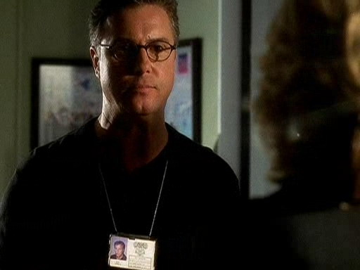

"Hello?"

"Mary！" Sara从电话线的那头听到好友声音的时候激动万分。她本来担心Mary也许正在上课，不能接自己的电话。Sara知道自己实在等不及要说说自己的新消息了。

"Hi，Sara," Mary高兴地打招呼道，"你怎么样？"

"你肯定不会相信发生了什么！" Sara大声说。没有回答Mary的问题。生平第一次，她想要直奔主题。

"说来听听啊。" Mary应道。

"Grissom刚才给我打电话了。"

"这也不是什么难以置信的事嘛。" Mary笑出声来。"你是他的朋友。你有时也会找他聊天。"

"Yeah，但不可置信的是他说的内容。"

"别卖关子啦！" Mary笑道，"快告诉我他说什么了！"

Sara在祭出她的重量级新闻之前还是忍不住故意停了一下，"他让我搬去Vegas和他一起工作。"

"啥？" Mary小声说。

"我知道！" Sara尖叫道。"是不是太神奇了？"

"他让你搬去Vegas？" Mary问。

"Yes!"

"那你说什么？"

"你还用问吗？"

"你要搬去Veags？" Mary叫起来。

"Yes!"

"My God, Sara!" Mary激动地说，"我真不敢相信！"

Sara笑出声道，"我说了你不会相信的。"

"好吧，你这次说对了，犯罪现场调查员小姐。"

Sara咯咯笑起来。

"那你要为了这去Vegas？为犯罪实验室工作？"

"Yeah，" Sara说完便完全冷静下来，"据说，是他组里的一个女孩儿昨天遭到枪击了。"

"My God," Mary小声道，"她会好起来么？"

"我昨天跟他通话时，他说她正在做手术。" 她顿了顿，然后轻轻继续说道，"听说不太乐观。"

"Wow," Mary轻声叹道。

"Yeah."

"然后他想让你去代替她？"

"差不多。她是工作中被枪击的，所以现在关键是要调查当时发生了什么。他希望我能去参与调查那个女孩儿的枪击案。"

"他有权因为这样就雇你？"

"嗯，我不是完全清楚所有细节，不过据说，因为这件事，现在Grissom变成他们夜班组的主管了。所以，yes，就这点来说，他可以决定雇我在那里工作。"

"Wow。那可是很重要的升职。他一定很兴奋吧。"

"我觉得他其实还在受打击的状态中。" Sara说，"而且，他为了这个女孩儿的事相当沮丧。"

"好吧，如果我的一个同事被枪击了，我也会很沮丧的。"

Sara笑了，试着结束这个略显阴暗的话题，"你还没有同事呢，准博士小姐。"

"我有一份暑期工作呀。" Mary笑了。
 
"也有道理。"

"所以，你真的准备这样做？你真的要搬去Las Vegas？"

"我怎么能拒绝他呢？" Sara问，因为激动，她的声音听起来有点儿颤抖。

Mary顿了顿，"Sara …"

"什么？"

她又顿了顿，试图找到最合适的词汇来组织她的想法。"他说什么别的了么，让你觉得这不仅仅是一份工作的邀请？"

明白她话里的意思，Sara感到自己脸红起来，即使Mary看不见她的表情。"他说他需要我。"

"需要你？嗯，这有点儿模棱两可。他在哪方面需要你？"

"我不知道。" Sara呻吟道，"我觉得连他自己也不知道。"

"Okay。这还真是个问题。"

"Mary，你总是要打击我是不是？"

"我只是想考虑得现实一些。" Mary说，"我不想你去那里是觉得也许他疯狂的爱上了你，想和你结婚，而实际他没这想法。如果他只是想要个同事，那他就是只想要个同事，Sara。你自己不能想太多。" 

Sara摇摇头，"我不会的。"

"Sara..." Mary警告道。

"我不会多想的。" Sara答道，这次声音中多了些坚定。她叹了口气，"你知道么，Mary？"

"知道什么？"

"在他离开Berkley的时候，他告诉我他把我当朋友。我们同意保持联络因为我们都不想失去相互间的友谊。而现在，我可以诚实的说这就是让我兴奋的最大原因——可以和我的朋友再次相见。" 她笑了笑继续说，"如果你不能在身边陪我，至少我还有另一个朋友。"

"Sara, 你还好么？"

Sara因为Mary声音中的担忧而睁大眼睛，"我很好，" 她说，声音有一点点动摇。"我要搬去Las Vegas。去和Grissom一起工作。"

"我知道，只是..."

"只是什么？"

"你听起来很孤单" Mary轻轻说道。

Sara叹了口气说，"我已经孤单很长时间啦。不过，自从我回到San Francisco以后，这还是第一次我不再感到孤单呢。这次变动对我是件好事，Mar。我能感觉得出来。"

*************

Grissom离开Brass的办公室，慢慢在走在走廊里。他脑子里还盘旋着最近发生的各种事。Holly被枪击，他的升职，Sara要来帮忙查案...如此短的时间里发生了太多事以至于脑子有点儿转不过来。

他向休息室里看了看，Catherine, Warrick和Nick正在里面说话。他能想得出他们在谈论什么。现在实验室里的每个人都在谈论Holly的枪击案。他不确定自己将要说的事是会让他们继续现在的话题，还是展开一个完全不同的讨论。

深深吸了口气，他打开门走进这间小屋。是时候开始新乐章了。

他一走进屋大家就停止了谈话。Catherine看了他一会儿，然后转过身去。Warrick的头垂得下巴快要碰到胸口。Nick看着他的样子好像在寻求指导。有点儿无意识地，Grissom走去倒了杯咖啡，并开始简述目前已知的情况。Warrick把Holly一个人留在了犯罪现场，嫌犯回来后，Holly就被枪击了。他放下咖啡壶，然后开始了他独白最艰难的部分。

"今天早上治安官给我打电话，" 他说，"Brass被调回凶杀案组了。"

Catherine一下子抬起头，眼睛睁得大大的。这是自Grissom走进休息室后她第一次认真看他。Nick皱皱眉看向他。

"那谁来接管咱们组？"他问。

"目前来说，" Grissom说着对视上Catherine的双眸，"我。"

Catherine完全震惊的看着他。如果不是相互了解太深，如果不是他们已是多年的好友，他真会觉得她的眼神是一种挑衅。

"我知道，" 说话时，他仍然看着Catherine，"我们只要随机应变，okay？"

说完了所有让他觉得糟糕的话，他终于将视线从Catherine脸上移开。这会儿，谈论之前那个跳楼者正等着尸检这件事都让他觉得是个解脱。

终于顺利地说完了要宣布的事，他按照原计划准备让Nick负责调查Holly的枪击案。这时Catherine终于打破沉默。

"等一下。你不能把Holly的案子给他。恕我直言，Nick…我想接这个案子。"

"Nicky是唯一一个没有和Holly有过私人接触的人。我不想你接这个案子，Catherine。"

"为什么？" 她含泪问道。

"因为你会把自己的感情牵扯进来。"

把他的抗议当做耳边风一般，Catherine从Nick的手里抢走了写着任务的纸条，表示"不爽你开除我啊"挑衅着Grissom。而Grissom虽然感到很生气，但也努力思考着自己做错了什么，他使劲压下自己的不满并试着平息对方的怒气。在要求他的同事们冷静下来做好他们工作之后，他丢出了最后一颗重磅炸弹。

"就目前来说，我们缺少人手。所以，我调了Sara Sidle来帮助我们。"

"Sara Sidle?" Catherine问道。她一边用询问的眼神看着他，一边在记忆力寻找自己是在哪里听过这个名字的。

"那是谁？" Warrick这会儿终于不再喉咙干涩的问道。

"她是来自San Francisco的CSI。我的一个朋友，我所信任的人。她会负责我们的内部调查。我想由我们组自己来调查这件事，不想让内务部掺和进来。"

"很好，" Catherine挖苦道，"这正是我们所需要的——一个四处打探的家伙。"

她目光犀利地瞥了Grissom一眼便离开了休息室。知道要花些时间才能说服她，Grissom只好先要Nick和自己一起调查跳楼案。Nick同意后就跟着Catherine走出屋子。

也许今天最难的部分就是告诉Warrick他仍然被行政休假了。他祈求他能让自己留下来，不过并没有像Catherine那样态度强硬。也许因为他还仍只是个新人，也许因为他抬头看到了Grissom眼中的坚决，又或者因为他知道这次他是真的做错了。不论原因为何，他没有如Catherine那样挑战Grissom的权威，而是接受的对他的安排，默默的听着Grissom要他在Sara来之前理清楚自己的问题。

想着已经度过了自己今天最糟的部分，Grissom离开休息室走向自己的办公室。和Nick去现场之前，他需要先去拿他的工具箱。

一打开办公室的门他就发现Catherine正站在屋里等他。

"Sara Sidle?"

"她怎么了?"

"从我听到你说出她的名字开始，我就一直在想这名字我以前在哪儿听过。直到我离开休息室才想起来她是谁。她是你那个学生，对不对？就是你在Berkley教的那个？一直和你互通邮件的那个？你帮忙在San Francisco找工作的那个？"

"Yes," Grissom淡淡答道，"这并不是什么秘密，Catherine。我告诉大家她是我的一个朋友——她确实是。我说她是我所信任的人——她也确实是。我说我希望她来负责我们的内部调查——我是这么想的。我没有隐瞒任何事情的。"

"我可不敢苟同。"

"Excuse me?"

她看了他一会儿，终于爆发地飚出了自从她走进这间办公室之后就一直想说的话，"你疯了吗？"

"啥？" Grissom防卫地问。

"Gil。你和Sara有段过去。有段历史。"

Grissom看着Catherine好像其实她才是发疯的那个，"她是我研讨会上的学生。我们成了朋友，然后我们保持着联系。你想说我们有什么‘过去’？"

"Gil，拜托！我们以前谈过这个。你知道我说的是什么意思。"

"我记得我已经告诉过你她是我的朋友了。"

"我记得我让你注意和她的关系。" Catherine回应道。

"我有啊。" Grissom说，"我确定她知道我俩是什么关系，底线在哪里。" 他有些困惑地看着她继续说，"我们已经一起工作那么多年了，不也是只保持着同事和朋友的关系么。为什么你那么肯定Sara和我之间又有什么其他的呢？"

她叹了口气，"说实话，我不知道。我没法准确回答你。该说是我这么多年看人的经验吧。更准确点儿，是我看你的经验。我就是觉得还有些你不愿意承认的事——不愿意对我承认的，或者，更甚者，不愿意对你自己承认的事。"

"嗯，这回，你可是大错特错了。" 他说，"Sara只是一个朋友，她来这里是为了内部调查的事儿，然后她会加入我们的团队——至少是目前加入我们。这就是所有事实了。你要是还在想些别的什么，回家看肥皂剧好吧。"

Catherine摇摇头，"你要是这么说...我也没理由不信你啦。"

Grissom笑了笑，"Cath，她不是来抢你位子的。她只是我团队里的一名CSI，而你是我的副手。她和我成为朋友仅仅两年，你我却已经当了15年的好友了。" 他笑着拍了拍她的胳膊，"虽然你有点儿唠叨还爱掺和我的私事，不过你是很优秀的CSI，也是好到让人难以置信地朋友。你是我心里最重要的姑娘，而且永远是啦。"

她听了笑起来，"哈，这完全是瞎话——至少最后一部分是。不过，谢谢你说了这些。听你这么说我真的很欣慰。"

他微笑了一下，"我得去找Nicky了。我们和好了？"

"Always," 她也微笑着回应。

他们一起走到走廊了然后分头离开。Grissom稍稍停下来转身看向她离开的方向。

"Catherine?"

她停下来转向他，"Yeah?"

他顿了顿并舔了舔嘴唇道，"你才是应该被晋升的人，不是我。"

她摇摇头，"这是你应得的，Gil。而且，我会永远在这儿的，做你的后盾。"

他笑起来，"谢谢。"

她却摇摇头，"谢谢你。"

*************

这时500英里以外，Sara Sidle正在有条不紊地整理着行李。她要去赶飞机了，新的生活正等待着她。
