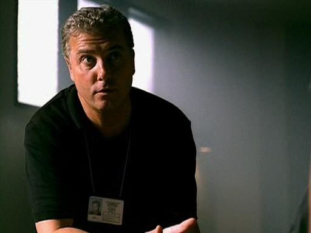

"那，你什么时候起飞？"

"还有几分钟就飞了，" Sara答道，"God，Mar，我好紧张。"

"紧张？" Mary大笑起来，"我觉得你应该是兴奋呀。"

"我确实很兴奋，" Sara说，"不过，我也紧张啊。"

"听着，Sara, 我知道在这整件事里我一直试图帮你保持理性..."

"你是说你一直努力帮我打退堂鼓吗。" Sara笑着打断她。

"嗯，也许有点儿。" Mary笑了，"不过，老实说，我真的，真的希望这对你是件好事。我希望你能心想事成。"

"我也想的。" Sara叹了口气，停下来听到广播里传来可以登机的通知。"听着，Mary，头等舱的乘客已经登机了，我坐在后面，所以下一波就该我了，我得挂了。"

"好的，" Mary说，"旅途愉快。到了Vegas给我打电话。"

"我会的"

"好运哦。"

"谢了，" Sara笑了笑，"我们回头聊。"

"Bye."

"Bye."

Sara合上电话关机后，小心的把它收进手包。刚提起手提行李站起身，乘务员就通知大家可以登机了。她拿好登记证，迈开步子，准备去开始她新的冒险。

*************

"Hi。" Grissom向Monaco酒店的前台打招呼道，"我叫Gil Grissom，这是Nick Stokes。我们是犯罪实验室的人。能问你几个问题么？"

"是关于那个他们在外面发现的那个男的事么？" 她问道，"从阳台跳下来的那个？"

"嗯，我们还不是很确定到底发生了什么。" Grissom说。

她点点头。"我很庆幸你没觉得他是自己跳下来的。我也不觉得。"

Grissom和Nick互看了一眼。

"为什么呢？" Nick问。

"要是问我，" 她压低声音神神秘秘地说，"是他女朋友干的。她把他推下去的。"

"他的女朋友？" Nick重复道。

"Yeah。" 女孩儿继续说，"她可吵了——看着有点儿不正常，你懂吧？相信我，如果你在这么一间酒店工作，你就能很擅长发现疯狂的人——她就是疯子。你们逮捕她了吗？"

"我们还在收集证据。" Grissom说，"实际上，我们希望你能帮助我们。"

"当然。" 她一边说一边睁大眼睛。

"受害人是住在总统套房的对么？"

"是的。"

"有什么办法能知道有谁进出了房间么？"

"嗯，我们这里有安全系统日志记录了每次刷卡进入房间的时间。" 她说，"这有用么？"

"Yes," Grissom笑了笑，"我们能看看这些日志么？"

"我现在就帮你拷一份。"

待她走向她的电脑，Grissom看了Nick一眼。

"我们得带我们的女朋友去问个话了。"

Nick点头应道， "我通知Brass。"

*************

Sara的航班顺利降落在McCarran国际机场。没人来接机，当然了，她也没期待着谁会来。她在心里笑了笑，知道没有什么能比让她一落地就见到Grissom更能令她开心的事了。不过，她知道在不远的将来她有的是机会见他。她不介意再等一等。

她在去行李提取处的路上拿出电话，按下快速拨号键打给Mary。可惜她好友的手机关机了，很明显她正在上课。

"Hi, Mary。" Sara在她的电话留言中说道，"我刚刚在Vegas着陆了——现在正要去取行李。我拿完行李就去酒店check in，然后直接去实验室，所以不用给我回电话啦。我有空的时候给你打电话。帮我跟Tom问好吧。" 她顿了顿，想了想还有没有要说的。"嗯...我之后再跟你聊吧。Bye。"

她合上电话把它装回手包里的时候，行李传送带刚好开始运转起来了。于是她把注意力转向寻找自己的包包上。

*************

"我现在能走了吗？"

Grissom朝这个在审问室中坐在自己对面的年轻女性亲切的笑了笑，"是的，女士。"

这名在Monaco酒店外男性死亡案件中的嫌犯站起身，向门口走去。Nick帮她打开门，并在她走出去时看了Grissom一眼。

"她说的事情查过了，" Grissom说，"她没有任何经济上的动机。她只是他的女朋友，不是妻子。死者赢的那些钱全都是由家庭成员继承。"

"好吧，如果他不是从自己房间的阳台上跌下去的，那会是从哪儿呢？" Nick问道。

Grissom看了他一会儿说，"楼顶。" 好像这是世界上再明显不过的事一样。

Nick马上露出一副我怎么没想到的表情来。

"我们得回酒店去。" Girssom离开屋子后说道，"我们需要做一些实验。"

"用实验假人？" Nick问。

Grissom朝他咧咧嘴，"你猜到啦。"

*************

登记入住了酒店房间后，Sara洗了个澡并为了这天的工作打扮起来。虽然不会承认，不过她确实花时间弄了弄头发，又选了一套漂亮衣服。她想给他的新同事留下个好印象。想到这里她有些脸红，因为她知道这并不是她的真正目的。她实际是为了让他眼前一亮。

在确认带好了所有东西后，她离开房间开上她租好的车子前往犯罪实验室。她向实验室慢慢走去，希望不用花什么功夫就能找到Grissom。

"Hi，" 当她走进来的时候,前台马上向她打招呼，"有什么能帮您的么？"

"Hi，" Sara应道，"我在找Gil Grissom。"

"您是？"

"Sara Sidle."

"Oh, Sara Sidle!" Judy热情的寒暄道，"你就是Dr.Grissom邀请来和我们一起工作的那位！"

"Yes。" Sara说着有点儿不知所措地微笑起来。

"嗯，现在Dr. Grissom出外勤了，不过我先来帮你办胸卡吧，然后你就可以出去找他了。"

"好的。" Sara同意道，并对这位女士的活泼感到有些惊讶，或者说有点儿被吓到的感觉。

Judy从她的桌子上拿起一个文件夹打开来说，"你只需要帮我填一下这些表格，然后我要帮你拍一下证件照。"

"好。" Sara说。她知道会有这些手续——她只不过希望先见见Grissom再办这些琐事。

*************

"好了，Nick。" Grissom朝着他的对讲机说道，"准备开始Norman实验吧。把他们扔下来。"

站在Monaco酒店外由警戒带圈起的案发现场内，Grissom等待着Nick把假人丢下屋顶。当第一个假人在空中翻滚着落下时，附近的游客还欢呼起来。在它落地的时候人们还报以热烈的掌声。Grissom无奈地挑着眉摇摇头。感叹这里不愧是Vegas。

*************

Grissom完全不知道这时候人群里正有个人为了看见他而雀跃不已。Sara靠近警戒线，正看着他观察假人掉落。她觉得自己再一次为他而着迷，就如在Berkley参加他的第一次讲座时被他的博学与热情掳获芳心一般。看着他现在工作的样子，她再一次肯定了自己的想法：这个男人会为了追求知识、真相和正义付出一切。她的心不由得狂跳起来。

站得最近的警察看到了她的身份名牌问她道"女士，你想进去吗？"

"等一会儿吧，" 她说，"我可以等他们做完实验。不想给他们添乱。"

她交叉起双臂等在警戒线外，只盼着他实验的假人不要太多。再一次，她得等待自己和Grissom说话的机会。

*************

在三个假人都依照自己的命运掉落之后,Grissom向围观的群众摆摆手,然后走过被圈起的现场,一边拍照一边重复念叨着他们掉落的方式。

"被推下来的Norman，" 他一边自言自语一边拍照取证，"跳下来的Norman。" 再拍照，"摔下来的Norman。"

"和Mrs. Roper结婚怎么样？"

听见她的声音，他放下相机，脸上绽放出一个大大的笑容，"我不用转身就知道是谁。Sara Sidle。"

他及时的转身正看到Sara摘下太阳镜时，脸上同样挂着满心欢喜的笑容。她在调侃他的"老派"作风，不过他也只能勉强听进她的声音。他正被她那双棕色大眼睛中舞动的光芒迷了心，被她那反射着阳光的褐色卷发夺了魂。他知道自己恰当地回应了她的调侃，但只希望自己表面上看起来还是酷酷的，没有被她的如期而至所影响。

她在提下一个问题的时候，脸上的笑容渐渐褪去，"那女孩儿怎么样了？"

Grissom的表情也暗淡下来，"她还在做手术。情况不太乐观。"

"这太糟了。" Sara低下头说。

"God, Sara, 我有太多疑问了。" Grissom的声音中透出些许的绝望。

"现在只有一个疑问是重点，" 她说着再次抬起头看向他，"为什么Warrick Brown离开了那个现场？"

Grissom默默点点头，"这点上我相信你，Sara，我需要..." 他说着声音渐渐低下来。

"我懂，我会帮你找到答案的。" 她轻声说道。

"Thank you."

"Hey, Boss，我们接下来怎么办？"

Grissom和Sara都抬头看向钻过警戒线的Nick。Grissom朝他笑了笑。

"我们的嫌疑人是被推下来的。" Grissom说，"你做的很好，Nicky。"

"Thanks。" Nick说完，看了Sara一会儿，又转头看向Grissom。

"Nick, 这位是Sara Sidle，我跟你们说过要来帮我们的那位CSI。"

"Oh，对！" Nick说完就和她握手寒暄，"我是Nick Stokes。很高兴见到你。"

"我也是。" Sara应道，她发现很难拒绝他热情的笑容。Nick看起来真心为认识她而开心，短短一句话就让她觉得自己倍受欢迎。

"Nicky和我正在调查一名男性在这里坠亡的案子，" Grissom说，"根据我们的模拟实验，我现在能肯定他是被推下来的。现在我们只需要找到行凶者了。"

"嗯，他的女朋友已经排除了。" Nick说着看了Sara一眼，"你和我们一起调查这个案子么？"

"No，她负责内部调查。" Grissom说，"你得和Catherine Willows聊聊，Sara。她负责调查Holly的案子。你进行调查的时候得和她一起工作。"

"好。" Sara同意道，"我能在哪里找到她？"

"应该在实验室。" Grissom说，"我知道她之前去现场了，不过现在她应该回去了。"

"好吧，" Sara说，"那我们之后再见。"

"有时间我回去找你，" Grissom保证道，"祝你好运。"

"Thanks," Sara说，"Bye, Grissom. Bye, Nick。很高兴认识你。"

"我也是。" Nick说，"期待我们的合作。"

Sara又笑了笑然后低头钻过警戒线。是时候回实验室去了。

*************

"她看起来人很好。"Sara走后Nick说道。

"她是人很好。" Grissom肯定地说。

"她是长期在咱们实验室工作么？"

"看情况吧。" Grissom答道。他没说到细节，但他知道Nick懂自己的意思，Sara是否能留下取决于Holly手术的结果，"她目前是和我们共事的。"

"好吧。" Nick慢慢应道。

"我希望你能跟她合作，" Grissom突然说，"我觉得你们会合作愉快的，而且我觉得你们也会相处愉快。"

Nick斜眼看了他一眼，"你不是打算做月老吧？Grissom？"

Grissom皱起脸，"说实话，Nicky。我指的是专业上。"

Nick轻轻笑了笑，有点儿红脸地说，"你说得对。"

Grissom笑了，"专注在工作上，Nick。"

"Yes, sir."

*************

"你见到Catherine Willows了么？"

Judy皱起眉头仔细想了想，"嗯，我能肯定她在实验室的某处，" 她回答Sara说，"不过我不知道她具体在哪儿。需要我呼她一下么？"

Sara摇摇头，"没关系。我自己找找看。"

"好吧，祝你好运。"

"Thanks," Sara笑了笑

在实验室游荡了10分钟以后，她开始怀疑独自寻找Catherine这个决定是否明智了。这实验室简直像个迷宫，她觉得自己永远也找不到这个新同事了。

"能帮你点儿什么吗？你看起来很迷茫。"

"Yes!" Sara大叫起来，激动于这个穿着宽大衬衫的技术员如此乐于助人。"我正在找Catherine Willows。你知道她在哪儿吗？"

"Yes."

看他不再继续说下去，Sara疑惑地看着他，然后终于意识到得由自己继续这个话题，她叹了口气说，"你能告诉我她在哪儿吗？"

"这得看情况了。是谁在找她？"

"我。"

"你是谁?"

她又叹了口气。 "Sara Sidle."

"Ah！" 他说着眼睛亮起来，"Grissom的朋友。"

"Yes."

"你要知道，我没想到Grissom还有朋友——嗯，至少，是在实验室以外还有。我是说，我知道他和Catherine，Brass还有——"

"你要不要告诉我Catherine在哪里？" Sara忍不住打断了他。

"你不想知道是谁告诉你这个信息的吗？"

她极力克制让自己不要不耐烦地闭上眼睛，只好又说，"好吧。是谁呢？"

"Greg Sanders。" 他说，伸手示意要与她握手。

"Hi，Greg Sanders。" 她说着和他握了下手。就目前如此让她沮丧的局面来说，她不得不承认这人还挺有趣的。"你在这里是做什么工作的？"

"实验室技术员。" 他立即答道，"我主要负责DNA，不过我有时候也负责痕检。"

"你真厉害。"

"你就是新来的CSI，对吧？"

"暂时。"

"说得对。" Greg想说他希望她能留下——她真性感——不过这样就变成他在暗示希望Holly挺不过来。看来他还是闭嘴的好。于是他清了清喉咙说，"嗯，Catherine就在那儿。" 他指着走廊里一扇关着的门说，"我想她正在研究一些证据。"

"太好了。" Sara笑着说，"谢谢你帮忙，Greg。很高兴认识你。"

"我也很高兴认识你。" 他也笑了笑。

Sara走过走廊推开了那扇门。她看到一个女人独自坐在屋里，正在桌前忙着什么。决定谨慎一些，Sara问道，"你知道我能在哪里找到Catherine Willows么？"

"她出外勤了。" 屋里的女人连头也没抬地答道。

Sara半转身地朝向门口，准备再去问问Greg，不过又低头看了看自己手里的笔记本，就好像那上面能有什么线索似的。桌旁的女人终于抬起头来并叹了口气。

"让我猜猜，你是Sara Sidle?"

"我知道自己是谁。" Sara带着浅笑的答道，"我想你对我可能有些误会。"

"如果你觉得你能抢走我的案子，还是别想了。" Catherine威胁地说道。

受到如此明确的挑战，Sara挺直了身子。好吧，Catherine觉得自己是个威胁。Sara曾经花了很长时间思考这个女人可能是她与Grissom之间的阻碍，而现在，得知Catherine视自己为威胁反倒让她松了口气——起码是工作上的而不是感情上的。考虑到自己面临的问题比想象的要容易，Sara走进屋，并把门关上了。

"听着，" 她边说边举起双手以示抵御Catherine的恶语相向，"我们可以站在这里争论，也可以一起出去找伤害Holly Gribbs的真凶。两个聪明的女人总比一个好吧。"

Catherine听了她的话冷静下来，然后拿起了她在犯罪现场找到的呼机。两位女士一起查看了呼机的呼叫记录，可惜没得到什么有用的线索。

"嗯，" Sara最后说，"看来这里你一个人就能搞定了。知道我去哪儿能找到Warrick Brown么？"

"试试去Blue Diamond Road上的某家赌场。"Catherine建议道。

Sara点点头，在本子上记下了这些信息然后转身向门口走去。

"Oh，" Catherine在Sara开门的时候说道，"有什么消息了我会通知你的。"

笑了笑，Sara出门来到走廊里。

"Sara!"

她看到Greg欢脱地跳向她不由得加深了些笑容，"Hi, Greg。"

"听着，我得告诉你点儿事情。"

"好吧。" 她说道，并讶异于他语气中的严肃性。

他深吸了口气继续说，"我刚刚看到Grissom了。他正在找你。"

"Grissom？他回实验室了？"

"Yeah，他去他的办公室了——我带你去吧。"

"Thanks。" 她如此说道，因为知道仅凭自己肯定永远也找不到。

"还有些你需要知道的事儿。" 当他们一起走在走廊里时Greg说。

"是什么?"

"他看起来——嗯，他看起来糟透了。"

血色从Sara脸上褪去。她觉得她能猜到为什么Grissom想要见她了。

"我找到她了，Boss。" Greg带Sara走进Grissom办公室的时候说。

"Thanks, Greg," Grissom轻声答道。

"我们之后再见，" Sara说，"谢谢你给我带路。"

"这没什么。" Greg答道。

他离开的时候从身后带上了办公室的门。Sara看着Grissom，挣扎着让自己的注意力保持集中在他脸上，而不是他那显得凌乱不堪的办公室。

"Holly的父亲刚刚联系我了，" Grissom打破了短暂地静寂，他咽了下口水难过地陈述着事实，"她手术时没能挺过来。"

"Oh, God, Grissom," Sara慢慢道，"这太遗憾了。"

Grissom点点头，"她是个坚强的女孩儿。她已经很努力了，但是，还是没能挺过来。" 他边叹气边用双手掩起脸颊，"她不该有这样的结局。"

Sara眼中好似燃起了火焰，"我会查清真相的，Griss。" 想也没想，她便抓起他的手握了握。"有Catherine和我，一定会让凶手伏法的。"

Grissom也回握了下她的手，"我知道你会的。所以我才请你来这里。"

*************

坚定了新的决心，Sara出发去寻找Warrick。正如Catherine给出的建议，她找到他时，他正在Blue Diamond Road的一家赌场玩儿牌。他不是很乐于见到她，不过倒也愿意跟她去附近的餐厅喝点儿咖啡，也方便他们的谈话。

他有点儿不愿承认他打牌的时候有记牌，也不愿承认在一些体育活动上下注。当Sara问他离开Holly后去了哪里，他用了明显是谎言的借口说自己去喝咖啡了。Sara质疑他是去赌博了，但他坚持说自己只是去喝咖啡。是啊，他很清楚勘察犯罪现场的流程，但即使如此他还是跑去喝咖啡了。

"你有报告么？" 她最后问，"告诉调度台你去了什么地方？"

"你知道当我还是新人的时候有多少次被一个人扔在犯罪现场吗？" Warrick说这些的时候明显压着火儿。

"Yeah，嗯，但这次不一样。" Sara说。

"Yeah，有什么不一样的？" Warrick边问边用手捂住脸。

"20分钟前Holly Gribbs死在手术台上了。"

看着Warrick的表情——那饱含着彻底的震惊、痛苦、恐惧、难过与自责的表情——让Sara相信他从没想过灾难会真正降临在Holly身上。即使如此，也改变不了他违反了诸多条例跑去喝咖啡这个事实。

留下他，自己离开餐馆的时候，她觉得无比悲伤。她痛恨接下来她必须要做的事。她痛恨她必须要写在报告上的内容。她痛恨Grissom必须要看到这些。

*************

最终，通过那个Sara开始假定没有什么线索的呼机，他们抓到了杀害Holly的凶手。她和Catherine在休息室的时候那个呼机响起来。Catherine，做出了在Sara看来近乎疯狂的举动，她给呼机上显示的号码打了电话。那边正是呼机的主人，想要找到他丢掉的呼机。于是Catherine要到了他的地址，一家小旅馆的房间，然后挂断了电话。

"我刚才做了什么？" 她自己也有点儿惊讶的问。

Sara咧嘴笑起来。她喜欢上这个女人了。

*************

嫌犯脸上有条严重的抓痕。Sara和Catherine都相信这是他用Holly的手枪射伤她之前，她抓伤他的痕迹。如果她们猜想正确，她的指甲里就应该留有他的DNA——她们需要以此来证明他的罪行。看来要去验尸房一趟了。

"你想让我来做么？" 她们一起走在走廊里时Sara问道。

"No," Catherine答道，"我得自己做。"

Sara轻轻点点头。

她们到达验尸房的时候发现Grissom正等着她们。

"你没必要过来的。" Catherine说，即使仅仅是知道他在这里已经让她觉得好过了许多。

"我知道。" Grissom答道，"我想要过来...以防你需要我。"

"可能会吧。" Catherine承认，"但是，我宁可自己来做。"

"15秒，" 当她走去开门的时候Grissom说，"你进去，出来。我们去做DNA比对，然后事情结束，okay？"

Catherine点点头，"Okay。" 她低语着消失在验尸房中。

Sara沿着走廊来到Grissom身边，"你还撑得住吗？"

"还好。" 他答道，"你呢？"

她耸耸肩，"我不认识她的。你不用担心我。"

Grissom仔细看着她说，"你别告诉我这事没有影响到你。"

"是有影响。" Sara轻轻承认道。"但是，不会像对你们影响那么大。"

"嗯，我想是吧。" 他顿了顿，"不过我觉得现在好多了。知道我们抓到凶手了。知道Holly设法帮我们证明他的罪行。知道她的家人可以归于平静，因为我们——我们整个组和Holly——一起完成的这件事。"

Sara笑了笑，"你的小组很棒，Grissom。"

"Thanks," 他也笑了笑，"我也喜欢他们大家。我会维持住这个小组的。"

*************

"Gil，你得让Warrick Brown离开。"

Grissom抬手揉了揉眼睛。

"我知道他在你组里很长时间了，" 治安官说道，"我知道他是个很不错的CSI。但是，我看了Sidle的报告。他离开了犯罪现场。他违反了程序。因此造成另一个CSI殉职了。"

"我知道。" Grissom轻轻说。他也看了Sara的报告书。他甚至比治安官更清楚报告里的意思。关于Sara写的"离开去喝咖啡"，Grissom看到的是"离开去赌博"。他了解Warrick和他的心魔。他知道可能发生了什么。

"我们看法一致了，然后呢？" 治安官问，"你会开除他吗？"

"我会处理的。" Grissom难过地说。"我得去审问另一个案子的嫌犯了，然后我会找他的。"

"很好。" 治安官说道，确信事情都在把握之中了。

Grissom离开了他的办公室，感到极度的痛苦。

*************

和Warrick的这次谈话成了他这辈子最难办的事之一。Warrick承认了自己的过错，承认了他去了哪里，然后他把自己的配枪和警徽交给了Grissom。

"你知道吗？" Grissom边说边站起来面向Warrick，"如果我让你离开，我也得让我自己离开。然后是Catherine和Brass...在这件事上我们都难辞其咎。我不管规则怎么说。今天我已经失去了一个队友，我不想再失去另一个了。给。" 他说着把徽章和枪还给了Warrick。

Warrick震惊地看着他，站起身来接过了他的东西，"我不会再让你失望了。"

离开Warrick之后，Grissom继续走向自己的办公室。途中他朝休息室瞥了一眼，看到Sara正坐在里面和Nick聊天。

"Sara，我能和你谈几分钟么？"

"当然。" 她边说边站起身来。

"来吧，去我的办公室。" Grissom说。

Sara点点头然后跟着他来到走廊里。"Nick刚告诉我你们的案子结了。结果是那个女朋友干的。"

Grissom笑了笑，"永远别低估女人的怨恨。"

Sara翻了个白眼，"你对‘女人的怨恨’颇有微词呀。"

"说警惕更合适。" 他笑了笑，陪她走进自己的办公室。"听着，Sara，我对接下来要做的事觉得很糟糕，但是事实如此。Holly不在了，而我需要...我想让你留在这里为我们的实验室工作。永久性的。"

"永久性的？" 她睁大眼睛问道，"你想让我代替Holly？"

"Yes，" 他说，"你愿意么？你愿意加入我的小组吗？"

她给了他一个闪亮的微笑，"我很愿意。"

"太好了。" 他说着回给她一个灿烂的笑容。"欢迎加入Las Vegas犯罪实验室的夜班组。"
