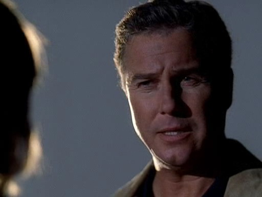
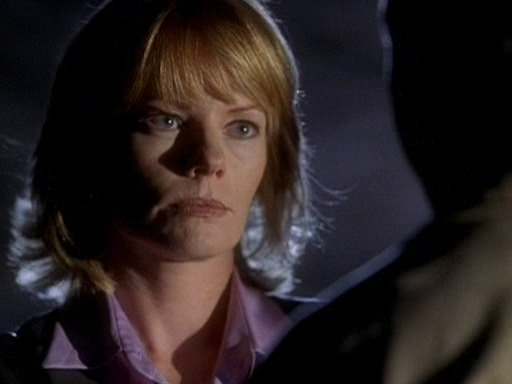

【Chapter 5】  Teamwork

"呐，你是认真的？" 在与Nick一起驾车从兄弟会回去实验室的路上，Sara这么问道。

"关于什么？"

她把视线从路面转向他说，"你参加过兄弟会？"

他朝她调皮地笑了笑，"你没有过？"

她撅了撅嘴唇然后把视线转回大路，"没。"

"为什么不？"

她又转头看向他问，"什么？"

"我知道自己为什么要宣誓加入兄弟会，" 他笑着说，"我想要找到自己的归属。我期待来自会员之间的羁绊与友情。" 他咧嘴笑了笑继续说，"我想要在联谊会上结识些女孩子。"

Sara在红灯前停住车子后转身面对他说，"你是想毁掉我对你的好印象吗？"

Nick大笑起来，"大学新生都很蠢的。我现在可是成熟多了。"

"幸好如此。"

"说真的，那，你为什么不加入姐妹会？"

Sara耸了耸肩，"我从没想过这些。"

"Oh，别敷衍我。" Nick笑着说，"大学校园里可是贴满了海报热心招揽每个学生加入兄弟会或者姐妹会的。那些海报我可是拿了一半儿呢。我知道那种场面。每个人都想着要宣誓加入一个团体——即使自己也没怎么想清楚。" 

"Yeah，不过，我可没那样做。"

"为什么你这么抵触这个？" Nick问道，"我不是说这对每个大学生来说都是最好的选择，但这也是合理的生活方式——就那个年龄来说。为什么你那么肯定的不去加入呢？"

她叹了口气道，"我有非常明确的目标，我不会做任何有碍我学业的事。" 她顿了顿继续道，"别告诉我你加入兄弟会完全没有影响你的成绩哦。"

"是有点儿啦。" Nick承认道，"绿灯啦。"

"谢谢。" Sara说着把视线转回到路面，并踩下油门。"跟你说哦——你如果保证不评价我的生活方式，我也保证不评价你的选择。"

Nick朝她咧咧嘴，"成交。"

"很好。" Sara边说边朝他看了一眼，"现在，我觉得你得为这个案子加点儿班了。"

Nick大笑道，"Whoa，现在我可是比你等级高。你不能给我安排额外的工作啊。"

Sara笑了笑说，"我觉得你会愿意做的。"

"Oh, 真的？"

"Yeah."

"你到底在想什么？"

她又转头看了他一眼，"我想让你教教我兄弟会的事情。"

"啥？"

"别表现得这么惊讶嘛。" 她说着把视线转回路面，然后忍不住笑起来，"要是想解决这个案子，我们得保持意见一致嘛。而为此我得要像你一样能理解身为兄弟会成员的生活状态。"

Nick大笑起来，"我得先告诉你，darling，除非你真的加入了兄弟会，否则你对此真的没法和我有一样的理解。"

"Okay，那，能教我多少就教多少吧。"

"我教完了不会...怎么说来着？毁掉我在你心中的形象吧？"

"Nope," Sara说，"我们说好了的——不评价。"

"嗯，你确定你想知道？"

"听着。" 她说，"我们都知道那些兄弟会的人杀了James Johnson。即使不是他们亲自把他吊在那里，也是他们逼他做的。我们只是得去证明这点。而为了证明这点，我需要先了解他们的生活方式。"

"好吧，" Nick应道，"咱们开始吧。"

*************

所以，他们的被害者对她那个一无是处的丈夫不忠了。Grissom觉得她丈夫一直没发现这点其实有点儿愚蠢——这个女人可是每隔一段时间就独自离开一下。这应该是她和别人偷情的第一个迹象了吧。

然而，Catherine是完全从不同的角度看待这件事的。Grissom知道她仍然对Eddie的背叛感到受伤。不过，直到她上了SUV然后说她希望当时有人能告诉自己Eddie的所作所为时，他才意识到她对于Grissom的沉默仍然感到多么的痛苦。

"你永远不会让我忘掉这件事了，对不对？" 他一边系上安全带一边问道。

Catherine叹了口气，"Gil，我只是...我只是觉得你应该告诉我的。我们结交这么多年了，而且都看着对方经历了那么多。在这一切之后我一直想，你应该事先告诉我你看到我丈夫和其他女人偷情的。"

"Cath，我很抱歉。" Grissom边说边把车开离嫌犯的房子。"我是应该告诉你。我应该听Sara的——"

他突然沉默了，知道自己又说漏了嘴了。如他所担心的一样，Catherine一下抓住了他话里透露出的信息。

"应该听Sara说什么？"

"这不重要。"

"你告诉她了？"Catherine开始生气了。"你告诉Sara说你知道Eddie对我不忠，而你不能告诉我？"

"我..."
(译者：觉得这会儿Grissom蠢哭了= =)

"你他喵的什么时候告诉她的？她不是才刚来这儿工作..." 她突然瞪圆眼睛，"San Francisco的研讨会。你去见她了是不是？"

"Yes。" 他不情愿地承认道。

"你去见她，然后你跟她说了Eddie的事。你跟她说了一些关于我的——一些很个人、很隐私、连我也不知道的事——但是你不能告诉我？"

"Catherine, 我——"

"开车——你开车就行了，Gil。"

"Cath——"

"现在别跟我说话。"

*************

Grissom一直知道自己和Catherine的工作方式是不同的。不过，他们一直合作得很好。他们一起解决案子。发现证据、把它们拼在一起，为那些每天遇到的被恶劣犯罪者伤害的人们寻求正义。工作方式的不同基本上意味着他们可以从不同的角度看待案情。这是有益的一点。他从没想过他们相异的工作方式会带来负面效果。

他也知道Catherine喜欢插手他的私事。只是他从没想到她也喜欢管别人的私事。

受害者的男友和丈夫在警局撞见对方的时候，他们正在努力消除相互间潜在的紧张关系。Grisom拽走了受害者的男友，让他待在一间审讯室里，他觉得要是受害者的丈夫不离开让他安心工作的话，他就要疯了。

把Mr. Swelco安顿在审讯室后，他回到走廊上，看到Catherine正陪着Mr. Barger坐在那里。Grissom觉得，要是他们只是坐在那里，而Catherine没有应Mr. Barger的要求再次透露案情信息的话，事情的展开就更完美了。可惜，世上没有什么完美的事。

Catherine擅自做了Grissom叫她不要做的事。她告诉Mr. Barger他的妻子和Mr. Swelco有染。她证实说他是他妻子死亡事件的嫌疑人。

Grissom穿过走廊，走过来并把手搭在Catherine的肩膀上说，"能跟你说句话么？"

"Grissom..."

"现在好么？" 他强调道。

Catherine点点头，又跟Mr. Barger说，"Excuse me。"

朝屋外走的一路上Grissom都没跟她说话。他甚至没法看向她。他简直不能相信她会做这种愚蠢的事。

"什么事？"当他们来到停车场的时候，Catherine防备地问。

"你知道是什么事，" Grissom说道，并让自己保持着极度的冷静。"你刚刚泄露了我们的调查内容。"

"他有权知道真相。" Catherine也异常冷静地回道。

"知道她死去了，yes。" Grissom说着有点生气了，"知道她有婚外情——这跟了解此案有什么关系？"

Catherine叹了口气，看起来还没有发火儿，"我觉得你是不会了解出轨这种事的。"

"你不能把这事和Eddie的事混为一谈。" Grissom压下怒气说道，"听着，现在是因为你的前夫伤害了你你就伤害了咱们的案子。"

"我们会把感情投入到我们的案子当中！" Catherine反驳道，她的双眼中迸射着愤怒的火花，"我们情不自禁。我了解Barger的感受！你能不能放松点儿？我可没告诉他什么细节！" 她边说边往回走，远离开Grissom。

"你什么都不能告诉他，Catherine！" Grissom生气的说，跟着她走在停车场的车辆之间，"我们是科学家！我们不是心理医生或者受害者的权益保护人。"

Catherine停下来并转过身来。Grissom能看到她眼中饱含着强烈的怒气。

"好吧。你知道，我可做不到像你那样。独自待在我的封闭式别墅里，看着大屏幕上的「探索」栏目，玩儿着天才填字游戏。但是不搞社交，所以没机会泄露案情给别人。好吧，我想要做到像你那样。"

Grissom在能反应之前一度震惊的看着她，然后说道，"原则上说，那是连栋住宅。而填字游戏是高阶的，不是天才的。"

Catherine的怒气明显地反映在她脸上。她痛恨在自己试图挑衅他的时候他永远不会真正地反击。

"不过，你说的对。" 他继续说，"我在很多方面都有缺点。不过，我绝不会因为而搞砸我的案子。"

"Grissom," Catherine靠近他说，"什么算私事？"

说完她就扬长而去。而他只是任由她离开，知道她不想再继续谈下去了。

*************

"嗯，我觉得他们因为此事或许会被开除吧。" Nick在和Sara一起翻看他们那件学生死亡案件的最终报告时这么说道。

"我希望他们不只受到这样的惩罚。" Sara答道，"你觉得兄弟会的那孩子说的是真的？他老爹会把他保出去？"

"他们可是杀了一个人，Sara。他们绑了一条生肝强迫他吞下去结果害他噎住了。然后，不去救他，反而把他吊起来伪装成自杀。我觉得这不是那个辩护律师老爹或者金钱能搞定的事。"

"Yeah, 你说得对。"

"我当然说得对。" Nick说着厚脸皮的笑起来。

Sara翻了个白眼给他说，"你就不能正经5秒钟..."

"我会努力的。"

Sara笑了笑说，"我得谢谢你。在这案子上你帮了我很多。要不是你，我也没法了解那么多关于兄弟会的知识。而且我也没法和 Matt、Kyle聊那么多，没法如你一样获得他们的信任...我也知道要不是你我没法破了这个案子。"

"你该给自己点赞，Sara。这些孩子可是兄弟会成员。我第一个要说他们并不都是那么好接触的人。"

"你也该给自己点赞，Nicky。" Sara回应道，"Grissom总说我们办的每个案子都是给未来的经验积累。这回，是用到了你以往的生活带来的经验。我想说这是有点儿奇怪的专业知识，不过在这个案子里确实有用。"

"Grissom也说过我们的工作就是去了解一切。" Nick说，"我只是在做我的工作。"

Sara点点头，"看，现在下班了。想去吃点儿早餐么？"

"当然。" Nick笑了笑。

他们一起走在楼道里，差点儿撞上Warrick。

"Hey, Warrick," Nick说，"我以为你今天休息。"

"Yeah，我有点儿事儿..."

"Oh。那，想和我们一起吃早餐么？"

"我还有点儿事，" Warrick说，"不过多谢了。下次和你们一起吧。"

"他要去哪儿呢？" Sara看着Warrick消失在反方向的拐角处如此问道。

"我可不知道。" Nick答道。 "Hey, Catherine."

"Hi, guys。 她说，"抱歉我现在没时间聊天儿，不过等我把Lindsey从Eddie那儿接回来的。回见。"

"Bye。" 他们一起说道。

"这地方有点儿像中央车站。" Sara评论道。

"下班时总是这样的。" Nick说。"我们下班，白班组上班...我会尽量躲着Ecklie，不过别的同事我还是很高兴见见的。" 他朝着迎面走来的几个同事咧嘴笑了笑，接着说，"然后，我最喜欢技术员来啦。"

Sara也认出了走近的身影，咧嘴笑起来，"也是我最喜欢的。"

"Hey, guys."

"Hey, Greggo," Nick咧嘴笑道，"下班了？"

"Yup."

"想和我们一起吃早餐么？" Sara问。

"当然。" Greg咧嘴笑起来，"咱们去哪儿？"

"还没决定呢，" Sara答道，"有什么建议么？"

Greg正打算说话，却被匆匆转过拐角来的Grissom打断了。

"你们看见Catherine了么？" 他问。

"她去接Lindsey了。" Nick说。

Grissom皱了皱脸，"好吧，我回头再找她。Thanks, guys。"

"你来一起吃早餐吗，Griss？" Nick朝他离开的身影问道。

"下次吧。" Grissom边走进他的办公室边答道。

"我想知道发生什么事了。" Sara在他们路过前台的时候说。

"那可是Grissom和Catherine，" Greg故作睿智地说，然后他咧嘴笑了笑，"你懂他俩和他俩的关系的。"

Sara听了觉得自己的胃有些翻腾，她努力掩饰着自己的情绪说，"No，恐怕我还真不知道。"

"他们已经共事很多年了，" Nick补充道，"他俩关系挺微妙，亲友、兄妹、还有类似夫妻吧。"

"夫妻？" Sara问。

"嗯，只有在Catherine唠叨Grissom的时候啦。" Nick大笑。"说真的，总之他俩很铁。就她对他做的或说的那些...如果我们敢这么干，Grissom就会瞥死我们，然后把我们使唤得七荤八素。不过要是Catherine，他就能一笑而过。"

"你是在建议我最好和她友好相处，这样她就不会利用Grissom打压我？" Sara问。

"也不完全是这个意思。" Nick慢慢地说。

"但这么做也没坏处。" Greg说。

Sara轻咬了下嘴唇，纠结自己敢不敢问出下一个问题。最后，她决定还是得问一下。不过她要等到他们离开了实验室再说。

*************

当Sara和Greg、Nick终于坐在了Greg最爱餐厅的座位上时，她终于敢抛出那个话题了。

"他们约会过么？" 她问道，希望自己听起来没那么在意。

"谁？" Greg问。

"Grissom和Catherine。"

"No," Nick立即回答。

"我们并没有可靠消息源不是吗，" Greg说，"你问过Grissom啊？"

Nick大笑，"没人问Grissom的私人生活啦。"

"对啊，" Greg同意道，"那你问过Catherine？"

"Look，我不需要问他们啦，" Nick说，"很明显他俩只是朋友。"

"Oh, yeah，犯罪现场调查员先森？" Greg咧嘴笑道，"你有什么证据说来听听。"

"要是他俩约会过然后分手了，他俩之间相处一定会很尴尬吧。" Nick说，"想想咱们每天花多少时间在一起。差不多醒着就在一起吧。再想想，咱们工作时离得多近。所以不可能有实验室里的俩人分手后还在一起工作然后还不觉得尴尬的吧。"

"有道理。" Sara说。

"现在，Grissom就是隐藏自己情感的大师，" Nick说，"嗯，我觉得他是为了小组能更好的运作而压抑了所有情绪。不过，Catherine..."

"就不太在乎了。" Greg笑道。

"她掩饰不了自己的情绪，" Nick说，"我们总能体认到她的感受。要是他俩分手了的话，她可没法像现在这样和Griss一起工作。" 他看了看Greg又说，"所以，老兄，他俩没约会过。"

"好吧，好吧。" Greg咧嘴笑起来。"你不能责备一个期待八卦故事的人嘛。"

"你去挖掘点儿真的幕后故事好不好？别凭空杜撰啊。" Nick建议道。

Greg夸张地叹了口气，"如果必须的话。不过，我敢说那一定没有这样有趣。"

*************

当Grissom家门铃响起的时候，他正从洗碗机里拿出最后一个洗干净的碟子放入碗柜。他不由得轻皱了眉头。之前Catherine长篇大论地控诉他是个脱离尘世的人来着。虽然他不愿把自己想成完全断绝社交的人，不过他也愿意承认，来访者——特别是意外来访者——实在是挺稀奇的。

他打开大门，看到正是Catherine站在他家门口。他不禁瞪大眼睛。

"Hello。" 他说。

"Hi," 她应道，"我能进去么？"

"当然。" 他边说边把门开大了一些。

"抱歉我之前说你家是封闭式别墅。" 她边说边朝四周看了看，"我知道这是连栋住宅。我只是有段时间没来了。"

"你该知道你永远是受欢迎的客人。"

"还记得以前的我们么？" 她边问边跟着他来到厨房。"我们以前下班后总是窝在你家或我家。为什么我们现在不这样了？"

"你结婚了嘛。" Grissom说，"而且，我想是你老公觉得咱俩有奸情。"

"Oh," 她笑起来， "对哈。"

"想喝点儿什么么？"

"好。"

Grissom打开冰箱，"我有果汁，牛奶，矿泉水还有红酒。"

Catherine只是看着他。Grissom自己笑了笑。

"能把红酒杯拿给我么？在你右边的碗柜里面。"

Catherine拿出两个酒杯把它们放到台子上。"Gil...很抱歉。"

"为什么道歉？" 他边开红酒边问。

"为我之前说的那些话。我不该那么说的。"

"为什么不该？" Grissom回复说，"除了有些细节说的不对，你说的是事实啊。"

她听了不由瞪大眼睛。

"正如你所说的，我们一起经历了很多事。" Grissom说着往两人的酒杯里倒上红酒，"你永远可以跟我说实话。即使有点儿严苛...但我希望听到你说事实。"

她听了微笑起来，"Thanks, Gil。你这么说对我很开心。"

他点点头，举起杯子碰了碰她的，"干杯。"

"干杯。" 她回应后抿了一口红酒。沉默了一会儿她又开口道，"我还想告诉你，我理解当时为什么你不告诉我你看见Eddie和别的女孩儿在一起了。"

Grissom瞪大了眼睛看着她。

"在那个时间点上，我正急切地挽救我的婚姻，所以我肯定不会相信你说的。我确实得要自己看见才相信。我肯定会...嗯，总之是会影响我们的友情和工作关系吧。"

"这正是我不告诉你的原因。" Grissom说完顿了顿继续道，"我没想到我把这件事告诉Sara对你伤害那么大。我只是...我需要跟什么人说说，而我很自然就选了她。她不认识你，而且，我当时觉得她永远不会认识你。"

"我觉得有点儿道理。" Catherine慢慢说。

"嗯，" Grissom又说，"不管怎么说，她有说让我告诉你。"

Catherine笑了，"聪明的女孩儿。"

"Yes," Grissom同意道，"她确实是。"

"你知道吗，" Catherine又喝了一口红酒说道，"我觉得她有点儿看上你了。"

Grissom翻了个白眼说，"她比我年轻十几岁好吧。她不可能看上我的。"

"那，好吧，我是不是该说你有点儿喜欢上她了？"

"她比我年轻十几岁——"

"年龄只是个数字。" Catherine打断了他。

"而你很八卦。"

Catherine咧嘴笑起来，"我只是想帮你有多点儿私生活嘛。"

"我觉得现在挺好的了，thanks。"

Catherine叹了口气，"我就怕你这么说呐。"
