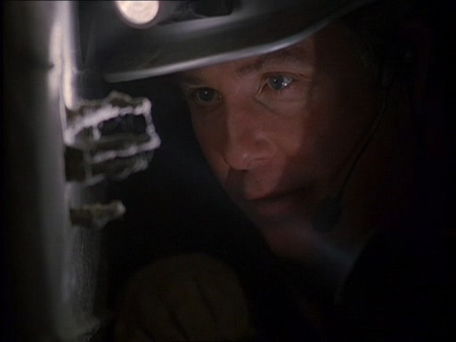
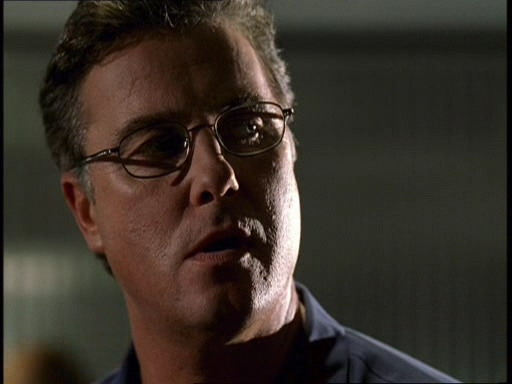
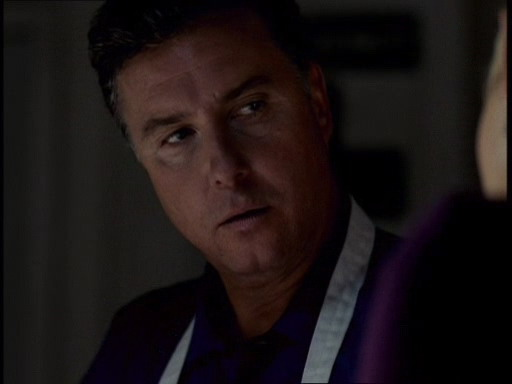
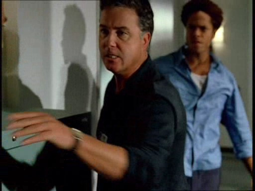

"有心情听件有趣的事吗？" Brass边问边走进Grissom的办公室。

"那得看你怎么定义'有趣'了，" Grissom答道，"你带来了什么消息？"

"有个水管工在一栋房子的地基里发现了看起来像人骨的东西。" Brass说。

"Okay," Grissom说着在他的办公椅中前倾了下身子，"这确实算得上'有趣'。"

"就知道你有兴趣。" Brass咧了咧嘴，"我现在要去现场。你想一起来么？"

"我得找个人跟我一起，" Grissom说，"我们在那边见吧。"

"好的。" Brass同意道。他抓起一张任务分配单填上了详细内容后说，"那边见。"

Brass离开他的办公室后，Grissom开始考虑他的人选。Sara和Catherine在结手上的案子，不过他不想打断她们。Warrick今晚休息。他想到Nick不由得笑了笑，不知道他对拆一栋房子的地基会有什么感想。

*************

"你要我干什么？" Nick大声问。

"我们需要把这里的砖都拆下来，" Grissom答道，"如果你没什么问题了，我就准备下去看看那是不是人骨了。"

"我们不是应该先确认了是人骨了再开始拆吗？"

"就算是动物的，房主也希望把它弄走。" Grissom说完笑着把锤子递给Nick，"开始干活儿吧。"

"谢谢啊。" Nick说起反话。

"你拆完了咱们就能把地基部分打开了。" Grissom说，"那样咱们也就能把骨头弄出来了。"

"好吧。" Nick说。与任务难度相当的，是他不得不承认这任务其实很让人兴奋。当想到等Sara知道他是如何度过今夜而且一定心生妒忌时，他不由得咧嘴笑起来。

等到拆完砖块儿，露出了混凝土的地基，Nick到车上取了自己的工具。然后他回到房子这边，而Grissom正要爬到房子底下去确认水管工发现的到底是什么。两个人带了通讯耳机以保持沟通。

"Okay，我这边好了。" Nick说着跪在被刨开的地基附近。

"等我1分钟。" Grissom回复到。他爬到房子底下，尽可能快速的朝目标水管前进。终于，他看到了那些骨头。趴在骨头旁边，他用手电照了照说，"Okay，我到了。"

"你能确认是不是人骨吗？" Nick问。

Grissom用手指按了一下凸出来的骨头，并看着它反弹回来，"掌骨...指骨...没错是人骨。" 他微笑着说道。

把遗骨弄出地基是个细致活儿。为了把遗骨移出它的混凝土坟墓用掉了整个晚班的时间。完工的时候，Grissom和Nick都已经满身灰尘、汗湿并且精疲力尽了。Grissom跟着送遗骨的车子回了实验室，而Nick负责把他们开过去的SUV开回去。当他们在验尸间再见时，Grissom正在研究骨架。

"Nicky，你今晚的工作完成的很出色。" Grissom说。

"谢谢。" Nick笑了笑。

"咱们明天继续玩儿。" 他许诺道。

"明天？" Nick不解地问，"我们不继续工作么？"

"我是想说，这具遗骨已经等了我们很多年了，" Grissom解释道，"多等几个小时不会有什么不同。明天它还会在这儿的。"

"你确定？" Nick犹豫地问。一般来说Grissom为了解决谜题连上2班或3班都没问题的。

"我确定。" Grissom笑着回答。"到今天之前这都是个旧案，Nick。我们可以等它回回温。咱们都已经累死了，而且我知道咱们现在都不在自己的最佳状态。所以回家休息吧。"

"你说得对。" Nick同意道，"那明天见吧。"

Grissom点点头，"开车注意安全。"

"你也是。"

*************

接下来的一天整个夜班组开始准备接新案子。Sara和Catherine已经结了上一个案子，Warrick也结束了休假。边想着Nick已经跟自己在这件遗骨案上了，Grissom走进实验室准备分配新的案子。

当拿到了新案子时，Grissom的心沉了下去。这两件案子都是他想要极力避免的。

第一件案子是一位警官卷入了枪击案。Grissom立刻决定自己来接手。这种警官开枪伤人的案子非常微妙，要处理得比较精细，也会有跨部门的人员接触。他之前处理过几次这样的案子，知道自己这次也可以搞定。

不过，接这个案子就要求他必须全心全意扑在上面——这就意味着他顾不上那具在验尸房等着他的遗骨了。他队里的其他人，只剩下Sara之前处理过警员枪击案，那还是她在San Francisco时候的事。他虽然没意见把案子交给她，但不想让她一个人来处理。他想安排Warrick和她一起接手。他需要从这件案子中学会耐心和谨慎行事。

剩下的第二件案子是件强奸案。一般来说他可以想也不想地交给Catherine。她处理过很多次强奸案，与受害者相处、查案都无懈可击。问题是这次的受害者指控的是她的前夫。

看着面前写着强奸案概要的纸条，Grissom不由得抱头。

被告，Eddie Willows，指名CSI Catherine Willows

"好吧，这是个好主意啊。" Grissom咕哝着。

最后，离开办公室去找他的组员时，他决定先看看谁有时间来接这个案子。

他匆匆走进会议室的时候大家已经集合好了。

"Okay，我又来晚了。" 他边道歉边走进屋子。

屋内完全的无动于衷彰显着他的组员有多了解他。Catherine拿出一支笔和本子准备记录任务分配内容。

"Nick和我一起负责在Summer Cliff发现的那具不明身份的遗骨。" Grissom说。

"我听说只是些骨头，" Sara惊叹道，"急什么。"

"jockey俱乐部的OIS。" Grissom用任务分配单回应了她。

"Officer involved shooting。" Sara看着从她主管手中结果的纸条说。

"我来一起吧。" Warrick自荐道。

Grissom轻轻笑了笑。Warrick这么说让他安排起来也顺手了。"很好，我希望你们两个人一起接手。" 他说，"听着，这种案子从来都不轻松，所以请随时告诉我进展。"

"会的。" Warrick答道。

"我来开车。" 走出会议室的时候Sara这么说道。

"知道你要这么说。" Warrick有点儿挖苦地说着，并任由会议室大门在他们身后关上了。

"那么，留给我什么案子了？" Catherine问，"我可以随时出发。"

"嗯，是有个案子，" Grissom说着在她身旁坐下来，"426...但是，我不能让你接手。"
（译者：426=SEXUAL ASSAULT）

"因为什么？" Catherine问。

"利益冲突。" Grissom说，他决定先绕个弯子，"报案人是一位脱衣舞女郎。"

Catherine坐直了一些，直直地看向他，"因为我以前也是，所以我会对此存有偏见？" 她问道，明显的感觉自己被侮辱了。

"不是，" Grissom答道，"疑犯是你的前夫。"

Catherine盯着他，Grissom也看回去，最后她终于放弃了。

"他要求由你来调查，但你不能接手这个。" 他说。

"那...让我来做前期调查吧。"

他们互相盯着对方的眼睛看了好一会儿。Catherine在默默祈求他的同意，Grissom能感到自己坚定地决心就这么瓦解了。

"好吧，" 他最终同意了，"做你能做的吧。不过，前期调查过后，你就得放手，okay？"

Catherine没有回应，直接走出屋去。Grissom看着她的背影，感到有些担心。他不喜欢Catherine不回应他。这通常意味着她会去做些和他要求截然相反的事。

*************

Grissom来到验尸房的时候Nick已经到了。他们一起确认了受害者是一位20岁左右的女性，刺死她的武器还不明确。

"嗯，" Grissom最后说，"我们需要确认她的身份。"

"我们该怎么办呢？" Nick问，"没有指纹...没有DNA..."

"我们需要搞清她的脸是什么样子，" Grissom说，"也许可以利用群众热线..."

"Griss..." Nick慢慢地说，"什么脸？她没有脸啊。"

"可她有过。" Grissom答道，"我们可以找一个鉴证学艺术家来。我们给她的脸做个模型。不用太完美，不过我们得做得足够接近她本人，好让认识她的人能辨认出她。"

Nick点点头，"需要我去打些电话协调一下？"

"你不介意的话。" Grissom说，"我会给你一个人名列表的。" 他想了想继续说，"我希望你先去联系Teri Miller。"

"她是谁？"

"全美鉴证学艺术家里的顶尖人物。" Grissom答道，"要是她帮不了咱们，就没人能帮了。"

*************

"你不觉得你对Brass太客气了么？" 和Sara一起勘察汽车里的尸体时，Warrick如此说道。

Sara放下她的相机，抬起头有点儿意外地看向他，"这是什么意思？"

"他不想让我们调查这个案子，Sara！他想让我们说Tyner讲的都是真的，没有任何隐情。"

"当然他希望这样，" 她说，"Warrick, Tyner是他的手下。要是我们中的一个成了枪击案的嫌犯，我能想象出Grissom会做同样的事。"

Warrick摇了摇头，"Grissom会去调查的。他会追查真相。"

"但是，他还是会偏向我们，" Sara淡然地说道，"我们在这件案子上得谨慎些，Warrick。我们的立场是和警察合作而不是对抗他们。要是事情看起来像是我们故意去证明警官Tyner射杀了这名男子，那这世界就只剩下伤害了。"

"但是——"

"如果他是个坏警察，我百分百站在你这一边。" Sara打断他，"不过，在我们做得出格之前，咱们得先确认他是一名坏警察。"

Warrick挑起一边的眉毛，"别跑到证据前面，哈？"

"对滴。"

他摇了摇头，"这里不需要开启Grissom频道啊，姑娘。"

"也许需要啊。" Sara轻声说。

*************

"Griss! 等等!"

Grissom在走廊里停下脚步，转身看到Nick在他身后。"来看看这个。" 他说。"我有办法取得我们的脸了。"

Nick跟着他来到车库，停下脚步后震惊地看着他面前的东西。"你把房子的地基搬到在咱们实验室来了？"

"只是6乘3英尺的一部分。" Grissom防御性地说，好像不敢相信Nick对自己提出质疑。

在解释了是干燥的混凝土保存了神秘女人的面孔印记这件事后，Grissom询问了Nick关于房屋的细节。Nick描述了他收集到的所有信息：房子是5年前建造的，房东是在房子建好后买下它的，这点实际上排除了他们的嫌疑。

"不过，还有一些其他信息。" Nick说道，他的声音中充满兴奋。

"是什么？" Grissom问，并把视线从地基块中抬起来。

"我和Teri Miller通过话了，她同意过来帮忙。明天就到。"

Grissom瞪大眼睛，"干得好，Nicky。" 他说完又看回地基块，"我们的遗骨很快就不再是'Jane Doe'了。"

*************

"我做了些调查。"

"那正是你的工作，Sara。" Warrick挖苦道。

"听着，也许我是不像你那样希望Tyner枪击了那个人，不过你说的也有道理。" Sara说，"为什么一个嫌犯飙车逃离警察后要自杀？为什么Tyner警官的枪里少了一颗子弹？"

"为什么我们又回到昨天的话题了？" Warrick问。

"为什么Tyner身上有5个市民投诉？" Sara回应他道。

Warrick听后不由得瞪大眼睛，"5个？" 他吃惊地问。

"是啊，" Sara说，"有三个是执法过度。还有两个在内部调查。"

"Wow...你真的是做了些调查。"

"就像我说的——如果这人是个坏警察，他是逃不掉的。不过，我们得精明点儿，Warrick。我们不能一上来就跟警察对着干。得要拿到有力的证据。"

"好吧，我们漏掉了最关键的部分。"

"Yeah，" Sara叹了口气。"Doc.Robbins在尸体里没找到弹头么？"

"Nope."

"该死。" Sara嘟囔着，"好吧，我们确实有很多问题要质疑Tyner的。"

"这算不算跟警察对着干？"Warrick苦笑着问。

"闭嘴。" Sara说着朝他笑了笑。"走吧，叫他来回答问题。"

*************

Grissom在法医鉴证期刊上看过很多Teri Miller的照片，而且很了解她的才能。尽管如此，当这个美丽的女士走进他的办公室并称赞在他手上爬行的狼蛛时，他还是有些猝不及防。长长的金发，深蓝色的双眸，红润的嘴唇，陶瓷般的肌肤...她简直像是童话故事里走出的公主。而且，显然她还很高兴让他的狼蛛爬上自己的手。

他拜倒在她的石榴裙下了。

在Teri为他们的受害者重塑面孔的时候Grissom一直留在她身旁。尽管这里并没有什么他能做的，他还是想待在这里。他被两件事情迷住了：了解这项复杂的工作，还有和这位愿意教导他的女士待在一起。

"把你的手给我。" 她说道，引导他以受害者在混凝土中保存下的面孔印记为模子制作黏土模型。

"真美。" 当她把自己的手放在他手上，为他演示如何塑造黏土时他喃喃说道。

"她会很美丽的。" 她应道。

"我是说..."

"什么?"

"别在意，" 他说着有些脸红，"没什么。"

她笑了笑然后转过头去。

"你做鉴证学艺术家很久了么？" 他问。

"差不多10年了。" 她答道。

"我们以前竟然没见过面，" Grissom说，"我敢肯定我们以前出席过很多相同的研讨会。"

"可能吧，" 她不客气地说，"虽然我经常参加研讨会，不过我不常作为嘉宾出席。"

"下次我得去听听你的讲座。"

她笑了笑说，"希望你能来。我敢肯定你会发现那很迷人。"

"我已经发现了。" 他轻声说道。

她又笑了笑说，"让我来给你演示一下怎么通过这一部分面孔来做石膏模型，我们得给这个女人做出整张脸来。"

"愿闻其详。"

他们花了差不多一整天的时间来给这个命运悲惨的女性重塑面孔。Grissom很高兴他们能及时完成工作，让他能拍下她的照片然后发到晚间新闻进行广播。他希望能有人尽快认出这位女性。

*************

Grissom刚从被认出的受害者Faye Green母亲家拜访回来，他的手机就响起来。他从口袋中拿出手机打开接起电话。

"我是Grissom。"

"Hi, Grissom, 我是Sara。"

"Sara," 他说， "有什么要帮忙的？"

"我有些新消息。" 她说。

"Okay …"

"Warrick和我打算和PD‘开战’了"

Grissom坐下来，庆幸现在是在自己的私人办公室里。"你们认为那个警员射杀了受害者？"

"现在看起来是这样的。"

"你们的证据是什么？"

"Tyner——那个警员——枪里少了一颗子弹，并且身上有5个市民投诉，还有我们找到了一个目击证人说看到他枪击那个嫌犯了。"

"嫌犯？"

"那个受害者是另一件案子的嫌犯。"

"好吧，" Grissom缓缓说道，"虽然我觉得不需要问，不过你们把弹头和那警员的枪做好匹配了吗？"

"我们...嗯...我们没能找到弹头。"

Grissom闭起眼睛，"你们得找到这个证据，Sara。"

"我知道，我知道。不过，Griss，现在的证据真的开始指向这个人，而且你让我们有消息及时通知你..."

"我知道，" 他说，"谢谢你通知我。等你们回来实验室的时候来找我一下吧。"

"好的。"

"Bye."

Sara合上电话转头看了看正在开车的Warrick，"Grissom让我们回去之后去找他。"

Warrick点点头，"他听你说完后什么反应？"

"他好像有些怀疑。说咱们得找到那颗子弹。"

"相信我，我也希望找到它。" Warrick说，"我们得钉死这个家伙。"

"嗯，它既不在尸体里也不在犯罪现场。" Sara说。

"是啊。" Warrick叹了口气，然后瞥了她一眼，"我想跟你道谢。"

"跟我道谢？" 她问道，"为什么？"

"为了和我一起办这件案子。我想很多人都不情愿办这种与警察对立的案子。我只是...我很高兴你站在我这一边。"

"我是站在真相这一边，Warrick。" 她答道，"就现在来看，Tyner有可能是个黑警察——而我们不能放任黑警察行凶为恶。"

*************

"Hey，你能自己去见Griss么？" 他们回到实验室的时候Warrick问道，"我真的，真的得休息一下了。"

Sara咧嘴笑了笑，"当然可以。去找Nick打电动吧。"

Warrick大笑起来，"我是说我想去厕所啦，大侦探。"

Sara和他一起笑起来。"怎样都好啦。我去和Grissom谈谈。"

她沿着走廊来到他的办公室，敲了敲开着的办公室门。他抬起头正看到她站在门口。

"Hey，" 他笑了笑说，"进来吧。"

"Hi，" Sara一边回应一边走到他对面坐下来，"遗骨案怎么样了？"

"你指的是Faye Green？" 他笑了笑，"她终于给了我们一些线索。"

"那很好。" Sara笑了笑。

Grissom点点头，"那么，想跟我说说你们的目击证人么？"

Sara叹了口气说，"他是个代客停车的服务员，他当时正待在停车场的一辆车里，然后看到了整个事件。"

"他说他看到Tyner警官朝受害者的头部开枪了？"

"Yes。"

"毫无原因的？"

"毫无原因。"

Grissom低头看了自己的办公桌一会儿，然后又把视线转回到她，"我不知道，Sara...我不确定可以根据他的证词来认识整个事件。"

"我知道，" Sara说，"不过，我想跟你说，现在很多证据开始指向这个人了。"

"只是别自己跑到证据前面，okay？"

"我们不会的。"

Grissom这时轻轻皱了皱眉，"Warrick一整天都和你在一起么？"

"他还能去哪儿呢？"

"我告诉Catherine把自己的案子交给他来着。"

Sara皱了皱眉，"我想她应该没有吧。就像我说，我们一整天都在一起，而且我也不记得他和她说过话。"

Grissom闭起眼睛，"这女人愁死我了，" 他低声念道。"好吧，我这边没什么事了。你和Warrick在这案子上要谨慎些，okay？"

"我们会的。"

*************

"话说，Catherine要让你做些什么？"

Warrick摇摇头说，"她在忙一个强奸指控的案子，然后Grissom让她把案子给我，你怎么知道的？"

"Grissom问我如果你整天都和我在一起，你怎么能去办她的案子。"

"他知道了！" Warrick叫起来，"他跑过来开始问我那件案子的事，而他已经知道了我对此一无所知。"

Sara笑起来，"看来如此。"

"Yeah，好吧，被指控的强奸犯是Cath的前夫。" Warrick解释道，"如果她参与调查..."

"Yeah，没什么好事。"

Warrick再次摇了摇头，"他们会解决这件事的。Grissom对咱们的案子怎么说？"

"说咱们得小心谨慎，保证别跑到证据前面。"

"听起来很像Grissom。"

他们离开休息室走到楼道里时，正好撞见因为DA指控了自己手下而怒气冲冲的Brass。Warrick和Sara跳出来捍卫他们找到的证据；而且Sara指出是Tyner丢了一颗子弹才是关键。

"你们CSI就是这样——总是在数子弹。"

他们转过身看到Tyner正朝他们这边走过来。

"他在这儿干嘛？" Warrick问。

Brass制止了Warrick并走向Tyner要带他离开。

不幸的是，Brass没能制止得很彻底。Tyner开始喷科学家在各方面都比警察逊色；而Warrick可不是受得了侮辱的人。随后的争吵声引得Nick, Grissom 和Greg都走出实验室来。他们走到楼道里时，Tyner和Warrick开始互相推搡起来。 Grissom马上冲到两人中间阻止的他们的争斗。

当Nick带Tyner离开实验室大楼而Grissom与Brass谈话的时候，Sara拽着Warrick的胳膊把他拉回更衣室。

"好吧，这回好了，" 她笑着说，"科学家对抗警察。我们会获胜的。智慧对抗蛮力嘛，你懂的。" 

"该死的家伙！" Warrick一边喊一边用拳头砸了下他的柜子，"有着该死的优越感！就因为像他这样的家伙让我讨厌警察。他们表现得自己好像高于法律似的。他们才不比咱们优秀呢。"

"对，" Sara同意道，"他们才不比咱们优秀呢。不过，如果咱们不做好工作，人家又会怎么说我们呢？我们也不能总躲在乳胶手套后面，就像你说的，他们躲在工会代表身后。"

"你说得对。"

Sara和Warrick抬头看到Grissom走进了更衣室。

"你们得继续你们的工作。" 他静静地说。

"我们——"

"但是——"

Grissom举起手阻止了他们的抗议，"我知道你们一直在做你们的工作。你们搜集了证据。是DA决定提出指控而不是你们，而你们左右不了这些。不过，你们得找到那颗子弹。"

"我们试过了——"

"那么，再努力一些。一定在什么地方的。" 他转身准备离开，"你们找到子弹之后再来跟我汇报吧。"

*************

那颗子弹实际在车子里。它所在的位置还原了整个故事：受害者的确是自杀的。Brass听到这消息并不怎么觉得高兴；显然他觉得Warrick和Sara是在无端地骚扰他和Tyner。

"嗯，这真是荒唐。" Sara在他们离开车库时说道，"你要知道，有时候我真想知道为什么我们得考虑如何对人友善。"

"Sara …"

她停下来转过身，挑起一边的眉毛疑惑地看向Warrick。

"你有没有意识到这是咱们合作的第一个案子？" 他问。 

"Yeah，我想是的。"

Warrick笑起来，"你喜欢听实话，对吧？"

"对的。" 她同意道，想知道他想要说什么。

"嗯，在你刚来这儿的时候，我不太了解你...我想这和你负责调查我这件事有关。不过，这件案子之后...Sara，你真是个很棒的CSI，我们很幸运有你的加入。"

Sara咧嘴笑起来，"你知道吗，我和你想的一样。"

*************

Grissom仿佛带着迷惑一般走进自己的办公室。他仍然无法相信自己看到的一幕，无法相信差点儿发生在Nick身上的事...

为了分神，他把目光转到他那块鱼形的公告板上。想到她说的话，逃走的那些嫌犯...

然后，他看到了。夹在那些悬案报告书中间的一张小纸条。Grissom惊讶的盯着他的鱼形的公告板。意识到她说的是真的。Teri真的在上面留了她的电话号码。他有点儿颤抖的伸出双手把纸条拽出来。

"Eddie没有强奸那个女孩儿。"

Grissom把写着Teri电话号码的纸条塞进口袋后抬头看向Catherine。"啥？"

"她呼喊着说他强奸是渴望从他手里拿到钱。"

"我希望你有告诉她他其实破产了。"

"她和我还是脱衣舞女跟他约会时一样，是不会相信这些的，" 她说，"我很抱歉在你叫我退出这个案子时没有退出。你是对的。我仍然对Eddie抱有一些从没表现出来的奇怪感觉，因为理性上我知道Linds和我离开他才是最好的。因此在我试图帮他的时候很容易感情用事。或者，也许更糟，我会做出些伤害实验室的事。我真的很抱歉，Gil。"

"Yeah，不过，我猜事情都解决了。"

她仔细看了看他，"你怎么了？看起来糟透了。"

"今天晚上很糟糕。"

"你不打算告诉我发生了什么？"

他叹了口气说，"我只想说Tyner警官会为我骄傲地。"

"到底什么意思？"

"我拔枪了。"

*************

Sara和Warrick有说有笑地一起在楼道里走着。他们刚刚登记了案子最后的证据。DA撤消了对Tyner的指控。尽管Brass好像还不打算原谅他们，不过他们对自己所做的工作充满自信。

"伙计们!"

Sara和Warrick转头看到Greg朝他们跑过来。

"哪儿着火了？Greggo。" Warrick问。

"是Nick!"

"他怎么了？" Warrick问，他有些不好的预感。Greg看起来真的很不安。

"他和Grissom去逮捕他们那件案子的嫌犯——然后她拔出枪指着Nick！"

"My God," Sara惊叫道。"他还好吗？"

"Yeah...Grissom后来让她放下武器了。不过，他真的受到惊吓了。"

"他在哪儿呢？" Warrick问。

"在更衣室..."

"谢了!"

Warrick和Sara朝更衣室跑去，然后在更衣室门外急刹车停下来。Warrick打开门，让Sara在自己之前进到屋里。Nick正在里面坐在长凳上，两肘撑着膝盖抱着头。

"Hey, Nicky," 她轻声说着坐在他身旁。"很糟糕的一晚？"

"可以这么说。" Warrick坐在他另外一边时他这么说道。

"发生了什么？Nicky？" Warrick问道。

Nick摇摇头喃喃说道，"我不想谈这些。" 

"那咱们去喝一杯吧。" Sara说。

"Yeah," Warrick赞成道，"我请客。"

"我肯定你们还有自己的事...你们不需要这样照顾我。"

"我们的事就是拉你出去喝酒，" Warrick坚决地说。"这就是我们要做的事。来吧。跟我们一起。"

Warrick和Sara都站起来，期待地低头看着Nick。他抬头看着他们好像有点儿不可置信。

"你们说真的？"

Sara看了Warrick一眼，然后又看回Nick。"我们很肯定现在不想让你一个人待着。走吧。"

Nick终于站起身，跟着Warrick和Sara，任由他们带自己离开实验室。他很长一段时间都没有说话，知道自己永远找不到什么词汇来形容自己的真实感觉：他有这两个朋友实在是太过幸运了。