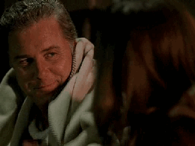

Sara回到自己的公寓，并锁上在身后关起的大门。她用双手捂住自己脸庞的时候钥匙掉落到地板上。轻微摇晃了一下，她靠在门板上叹息起来。

"为什么我要说那些啊？" 她呻吟道

他说得对——这完全是她的错。是她先开始的，而且在他身边自己总会滔滔不绝，还想调戏他、让他说出信息的出处。当然了，她以为他和自己有相似的经验...

终于找回进到房间的力气，她掏出手机来。这世上只有一个人能帮她度过这个危机了。她倒在沙发上按下了她的电话号码。

电话只响了一声就被对方接起来了。

"Hello?"

"Hey."

"Sara!" Mary欢呼起来，"你怎么样?"

"我犯了一个糟糕的错误。"

Sara几乎能听到Mary正慢慢坐下来，"发生了什么？"

"你还记得Ken Fuller吗?"

"你大二时的男友？" Mary问。从她的声音中都能感受到她的笑容。"让你成了‘高空俱乐部’成员的那个？"

"就是那个。"

"他怎么了？" 她顿了顿继续问，"你不会是在Vegas看到他了吧？他不会是...又拐你去坐飞机了吧？"

"No，我有一次那样特别的经验就够了。" Sara僵硬地说。

Mary咯咯笑起来。"Okay，那Ken和你糟糕的错误有什么关系？我得说现在才为三角洲事件产生罪恶感有点儿晚了吧？"她用了和Sara在大二时为Sara和Ken Fuller的大胆冒险而造的专有名词。

"而且，我知道你现在告诉我你怀了他的孩子也太晚了。"

"No，不是那回事。"

"你到底要不要告诉我究竟发生了什么？还是我得整个晚上为了某个未知事故听你自怨自艾？"

Sara叹了口气开始说。"我办了件案子，有个男人在入境的飞机上死了。"

"我猜不是正常死亡？"

"不算是。" Sara说，"反正，我们是全组都去办这件案子了。Grissom安排Catherine和Warrick去询问乘客，Nick回去参与验尸和协调把证据运回实验室，而我留下来帮他勘察飞机。"

"你和Grissom在一个密闭空间里...还是单独的？"

"别瞎想。"Sara疲惫地说，"然后，我们处理了飞机的头等舱，最后处理到洗手间。"

"Oh, my God," Mary轻呼道，"这是重演了你的高空经验啊，只是差点儿高度？"

Sara空洞地笑了笑，"嗯，我们当然是发现证据了，毕竟我不只是一个俱乐部成员。"

"恶。"

"Yeah，我还见过更恶心的。"

"我真不知道你是怎么做你这份工作的。"

"做就好了。" Sara耸了耸肩。"反正，Grissom说海拔高度可以强化XXOO过程让人提高快感。"

"喔，看来某些人听得懂他在说什么。" Mary调笑道。

"就是说啊！所以，想着我可以顺势调戏他一下，于是我问他他这个信息的出处是啥。"

"信息的出处？" 从她的语气可以听得出Mary正在翻她白眼，"Sara Sidle。你真是个怪胎。"

"啥？我们在实验室经常这么说啊。"

"我是对滴不解释。" Mary清了清喉咙继续道，"这不是重点..."

"对。然后，他试图回避我的提问，不过，最后他承认他是从一本我从没听说过的法医鉴证学杂志里知道的。"

"你是说他...瞎编的？" Mary大笑起来。

"我几乎就这么觉得了。" Sara和她一起笑起来。"结果他说他可以帮我订一份。"

"好吧。" Mary大笑道。"等你收到了一期一定得告诉我啊。"

"严肃点儿。"

"我不明白，Sara...我不觉得这是什么糟糕的错误啊。他不是好好回答了吗。"

"Yeah...直到他反过来问我我是怎么知道的。"

"Oh, no。" Mary叫起来，"你告诉他了？"

"我还能怎么办？" Sara呻吟道，"我是可以一本正经地学他说是从什么杂志看到的，不过，A.)他知道所有发行过的杂志，所以他知道我在撒谎，而且B.)他已经用过这招了。"

"Oh, no," Mary再次叹道。

"所以，我告诉他了。" Sara叹气道，然后她傻笑起来，"我连航班号儿都告诉他了。"

"Sara!" Mary大笑起来。

"嘿，如果我要做什么事，早晚我都会去做啊。" Sara顿了顿继续道，"我还告诉他其实感觉并没有传说的那么好。"

"Sara!"

"正如我所说的..."

"好吧。早晚你都会去做。" Mary咯咯笑起来。"顺便说一句，这句话用在你这种情况很合适..."

"全能的神啊, Mar."

"是你做的。" 意识到她在说什么，Mary再次爆笑起来。

"够了啦！" Sara一边笑一遍数落她。"别再说什么黄段子的双关语了啦。"
（译者：这里只能字面翻译，实在不懂是啥双关语 Orz）

"好吧，好吧。你承认三角洲事件之后Grissom说什么啦？"

Sara再次傻笑起来，"他让我收集卫生间的证据。他说我有第一手经验，类似这样。"

Mary听完又笑了，"嗯，darling，总体来看，事情没有你说的那么糟糕啦。我觉得他的反应还好啊。"

"我们现在是这么觉得。看他明天怎么说啊。"

"一位绅士是不会评论这些的。"

"是绅士就根本不会问啊。"

"反正你也不是淑女。" Mary反击道。

Sara再次呻吟起来，"我就跟你说这是个糟糕的错误。我觉得我这是在和他打情骂俏。"

Mary摇摇头，"怪胎不打情骂俏的，Sara。"

"喂!"

"我没说当怪胎不好啦。上帝知道我也是一个怪胎。不过，你和Grissom也是。我觉得你俩保持自己的步调就好啦。"

"具体来说你指什么？"

Mary顿了顿说。"专注于这并不是：打情骂俏。"

"你知道吗，你真的很擅长如何让一个情绪低落的姑娘打起精神呢。"

"嘿, 是你打给我的。"

Sara笑起来。"爱你哦，Mary。"

"我也爱你, Sara."

*************

Grissom把自己试图阅读的杂志扔到屋子另一边。他没法集中精力。自从有了飞机上和Sara的那次对话，他就没法停止想她说的那些话。他完全没想到她会玩儿高空俱乐部。不知怎地，没法想象她会做这样的事...

或者，也许只是他自己没法想象这样的事情。也许，他是把自己的感觉和行为方式映射到她身上，期待着她和他是同一类人。

他摇了摇头。他已经知道他们很相似了。只是在一些事情上表现得不同而已。

不过 …

如果她愿意帮忙他也愿意做出改变。他几乎看到了他们一起在浴室里，他的唇覆上她的，她的手牵着他的，他把她拉得越来越近...

他脸红起来，然后紧紧闭上双眼。No，他不能这样想Sara。他没有权利这样想Sara。

他需要做些分神的事情。他从椅子里跳起来，开始在自己的公寓里徘徊，想要找些分散精力的事。

他的目光落在一张小纸片上，然后微笑浮现在他脸上。就是这个，他找到他的目标了。

他几乎忘记了Teri在上次调查中给他带来的那份热度。不过，她一直在那里，在他记忆中蠢蠢欲动。即使他想忘也是忘不了她的——更何况他一点儿也不想忘。他抓起电话，拨通了她的号码。

她语音信箱的提示音响起来了。Grissom叹了口气，默默等待语音提示的结束。

"Hi, Teri, 我是Gil Grissom。很抱歉这么久才给你打电话，不过还是希望什么时候能聚一聚。我——我上次和你一起工作很愉快，希望能了解一些工作之外的你。所以，如果你能给我回个电话，我们可以约个时间出去..."他留下了自己的电话号码并和她道别。

他盯着自己无声的手机看了一会儿，几乎惊讶于自己的大胆。他希望等得到她的回复。尽快。

*************

Sara独自坐在渐渐变黑的会议室中写她上个案子的结案报告。她知道实验室中有很多可以工作的地方，但是只要条件允许她总是会利用空会议室。她工作的时候喜欢把所有的笔记和证据都铺在大桌子上。

当屋门被打开而Grissom探头进来的时候，她几乎就要完工了。她抬起头露出一个有点儿忧心的笑容。自从上次飞机的案子结束后他们还没怎么说过话，而且也没怎么独处过。当然了，她并没有主动去找他。她只是试图尽可能长时间的避免见他。希望上次她说的那些话不会让两人之间变得尴尬起来。

"想和我一起去山里吗？" 他问。

Sara扬起一边的眉毛，"哈？"

Grissom笑了笑解释说，"2个旅行者在山里发现了一具尸体。我正要过去。想一起来吗？"

"好。" 她说着按下电脑上的保存按钮，"能等我几分钟吗？"

"当然。"

15分钟以后，Sara已经坐在Grissom SUV的副驾驶座上，准备和他一起去山里了。从停车场开出来的时候他朝她的方向看了一眼。

"那么，在到山里之前有什么故事我应该先听听的吗？" 他问道。

Sara十分清楚他在暗喻是什么，不过她决定让他自己说出来，于是她问，"你说的是什么意思？"

"嗯，上次飞机洗手间的故事出现得太突然了...这次我不想办案时再被吓到啊。"

Sara忍不住抿嘴笑起来，"你这打探个人隐私的手段太不高明了。"

"难道让别人说出自己的信息来源就是一种委婉的说法吗？" Grissom还击道。

"有道理。" Sara咧嘴笑起来，"No，我没有什么山里的故事啦...目前为止。"

Grissom又瞥了她一眼，"你在期待以后会有吗？"

"也许...某一天。和一个对的人一起的话。"

"Ken Fuller不是对的那个人？"

"No，" Sara毫不犹豫地说。"绝对不是。"

不知为何，她的话让Grissom在把车子开上高速的时候倍感轻松。他笑了笑伸手打开了收音机。在短暂的寂静后，strains of Vivaldi开始飘荡在空气中。

"Griss，这算啥音乐啊？"

"古典乐啊。" 他无畏地答道，"不觉得很慰藉心灵吗？"

"我觉得我要睡着了。" Sara说着向前探身按下了收音机上的选台键，直到播到她最喜欢的电台top 40。

Grissom瞥向她道，"你是12岁小孩儿吗？"

"我喜欢听top 40。" 她防御性地说。

"No."

"No，啥意思？"

"No，我们不要在去犯罪现场的路上一直听这个。"

Sara翻了个白眼然后开始搜寻别的电台。终于在Pink Floyd的音乐溢满车厢时停了下来。

"陛下觉得这个如何？" 她问道。

Grissom撅起嘴唇试图掩盖自己已抑制不住的微笑，"Yes。"

"Good。" Sara说着靠回她的座椅，"我不知道原来你喜欢经典摇滚。"

"我一直喜欢。"

她笑了笑说，"我也喜欢。"

Grissom微笑着回看了她一眼。

*************

"Nick，那个失踪的人怎么样了？"

"还没找到。" Nick从他的衣柜抬起头应道，"你们那个山里发现的女性如何了？"

Sara闭起眼睛道，"还没搞定。"

"诶？"

Sara睁开眼道，"Brass一定跟我们说了几百次了，要我们确定她死亡前5天的行踪。那时候她的丈夫还在城里，而且邻居听到他们家传出了枪声。肯定是他干的，Nick，我知道是他。他已经虐待她很多年了——她脸上全是他每次施暴后骨折的痕迹，而他清理了他们公寓满墙的血迹，以掩饰自己的暴行。"

"那，现在有什么问题？"

"Grissom和他的虫子。" Sara说着攥起了双手，"根据他做的线性回归模型，她是在三天前死亡的。"

"与你们的推测不符。"

"Yeah。" 说着Sara眼中忽然溢满泪水，"现在他的丈夫要逃脱了，即使..."

Nick伸手握了握她的手说，"总会有更多证据的，Sara。你会找到它们的。我知道你会的。"

她摇了摇头，"根据Grissom的结论就没有之后了。"

"不管你行不信，Grissom也会犯错的。" Nick说，"Catherine告诉过我他并不总是对的。也许这次就是他错了。"

"Oh, 希望如此, Nicky。" Sara叹了口气，"我真的，真的希望这次是他错了。"

*************

"你在忙什么？"

当Catherine走进证据室的时候，Grissom把视线从铺在桌子上的毯子上抬了起来。"检查我的证据。"

"Nick告诉我他听Sara说，你的虫子证实了丈夫是无辜的。" 她说道。

"坏事传千里哈。" Grissom应道。

"在找另一个嫌犯么？"

Grissom摇了摇头，"丈夫一定是有罪的。我只是得证明这点。"

"为了谁？"

"这话是什么意思？"

"我的意思是你花了超多的精力去证明一个非常接近亲爱的Sara提出的理论。"

Grissom看着她说，"我是花了超多的精力去寻求真相。"

"好吧。" Catherine边握起双手边退回门口说，"我只是说..."

"别说。" Grissom打断她，"只是——我知道我在干什么，Cath。"

"我可不相信。" 她轻声念道，留下他一个人继续处理证据就离开了。

*************

Sara匆匆走过实验室，试着要找到她的上司。她想起之前跟他说的话，意识到为了昆虫的行为而责备他对他实在不太公平。她想要道个歉。不过，她得要先找到人才行。当她看到Warrick走过来时便停下脚步。

"Hey，你看到Grissom了么？" 她问。

"Oh, yeah."

她疑惑地看着他，"那是啥反应？"

"你知道他在干啥么？"

"我要是知道就不用这么找他了。"

Warrick笑了笑说，"姑娘，我不知道你对他施了什么魔法，不过他正和一头裹了毯子的猪一起在外面呢，说是要证明你们的受害者是在5天前死亡的，而不是3天。"

"他——啥？" Sara惊讶的问。

Warrick点点头继续说，"我看到他出去了。不信的话你问Brass——他正在调查那个丈夫耍了什么花招。"

"我——喔。谢了，Warrick。"

"随时效劳。"

Sara又走起来，而Warrick转身进了休息室，Nick正在那里喝咖啡。

"你知道Griss和Sara之间发生了什么么？"

Nick听了被咖啡呛了一下，"你说啥？"

"Grissom刚刚运了一头猪来，好让他能把它裹在毯子里看着虫子在上面产卵，而这些只为了希望能证实Sara对于他们案子的理论。"

Nick耸了耸肩，看起来平静了许多，"Warrick，你说的可是Grissom。这人痴迷于昆虫。我们不是一直知道这点吗。"

"Yeah，不过这次总觉得即使是他，做的也过分积极了。"

Nick摇了摇头，"放弃吧。在Grissom，Sara和小猪之间，除了科学氛围不可能有别的啦。"

Warrick耸耸肩，不过猜疑问并没有从他眼中消失，"如果你敢肯定..."

"我肯定。"

*************

Sara一边抓起手电，一边把背包背上肩头。她走出实验室，去找Grissom和他的小猪。她进到他的试验场地之前停顿了一下。他看起来已经被冻僵了，躬身抱着个笔记本，仔细给昆虫在小猪身上的活动做着记录。轻笑了一下，她朝他走去。发现她走过来，他抬起头给了她一个轻轻地微笑，从旁边拉过一个箱子让她坐在自己身旁。她坐下来打开背包，拿出一瓶热咖啡递给他。他回以她一个大大的微笑，却发现她还没停手。趁他打开咖啡瓶的时候，她又从背包里拿出一条羊毛毯披在他的肩头，并把手在他背上稍稍多停留了一会儿。

"谢谢。" 她朝他笑了笑。

他也朝她笑了笑，"这不只是为了你。"

"我知道。" 她说着把另一条毯子披在自己肩上。"这是为了Kaye。我们得为她伸张正义。"

"我...我想确保我们做了所有能为她做的事。我不想让她永远困扰你。"

Sara不由自主地颤抖了一下。"我很抱歉，Griss。我不该说那些话的。那些昆虫的活动并不是你的错。"

他摇了摇头，"我没有准确地考虑环境因素就是我的错。我活该被你那么说。"

"即使我说让你陪我睡觉？" 她轻轻问道。

他看了她一会儿，却找不到合适的言语应对，"Sara..."

"No，" 她打断他说，"我很抱歉，Grissom。我真的很抱歉。你知道我想说的是什么意思，你知道我不是指男女之情的那个，不过我那么说确实是不恰当的。你是我的上司，而且我——"

"我首先是你的朋友，"Grissom轻轻说道，打断了她接下来的话。"你当时很沮丧。当我们受挫时，我们会到我们的朋友身边寻求答案与安慰。我没有充足的答案给你，而安慰更是..."

"这就是我要的全部安慰了，" 她边说边用手指了指他们面前的一切。"你是对的，Griss。你是我的朋友，不过，当我们在工作时..."

"我们仍然是朋友的。你，我，Catherine, Nick, Warrick...我们都是朋友，而且我想这让我们工作起来更加顺畅。我们知道我们可以相互依靠。" 他顿了顿继续道，"别为情深而道歉，Sara。那是你的一部分，正是这让你成为了一个特别的人。"

Sara听了脸上有些发热，然后转头看了看小猪说，"我真不敢相信我们为了这个杀了一头小猪。" 她试着让他们的对话回到安全领域。

"它要么来这里，要么也是上了某人的餐桌。" Grissom跟着她转变了话题。

Sara皱了皱脸，"我以后再不吃火腿了。"

Grissom笑了笑，然后伸手碰了碰她的手，"也谢谢你。"

"为了什么？" 她惊讶地问。

"为了你提醒了我我们工作所肩负的责任。为了你提醒了我要为了受害者奋斗到底。"

她笑起来，用手指轻轻抓住他的，"不用谢。"

他再次开口时，声音宛如耳边轻语，"谢谢你做我的朋友。"

Sara又握了握他的手，即使她能感觉到他的手指紧紧缠绕着她的，"谢谢你是我的朋友。"
