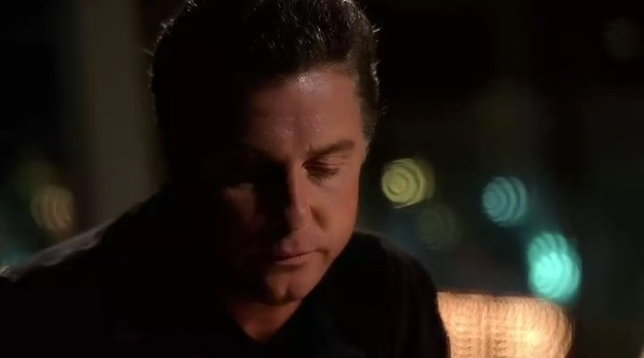

Teri没有回他电话。

Grissom知道他应该预计到事情的发展。最终，那个聪明的书呆子是得不到女孩儿芳心的。在高中的时候他就明白这道理了，然后看着事情一遍一遍在自己生活里重演。

他没再给她打电话。如果她真的对他感兴趣，那第一次她就会回他的。

要不是因为Catherine，他永远不会再见到她了。为了Catherine，和那贫穷而又衰老的老妇人。那老妇人因为担负不起葬礼费用，于是把她故去丈夫的尸体肢解成小块丢进了沙漠。当第一块残尸被发现时，由于环境因素、动物和昆虫的侵袭，留给他们的只剩下一些骨头碎片了。Grissom, Catherine和Nick发现要想把受害者的尸骨拼回去是件相当复杂而有难度的工作。

在花了好像一辈子的时间盯着骨片和人体骨骼图例之后，Grissom知道Catherine已经精疲力竭了。Nick还如他往常一样乐于挑战难题，不过Catherine已经受不了了。她不止一次提出要致电Teri寻求她的帮助，毕竟这是她的专精领域。不过Grissom每次都拒绝了她的要求。

他应该想到Catherine是不会听他说的话的。他应该知道她是不会如他所愿行事的。不过，即使如此，他还是没想到她竟然未通知他就给Teri打了电话，所以Teri这会儿已经自己走进他们的工作间了。

毫不夸张地讲，开始见面的时候两人都觉得十分尴尬。不过当尴尬的气氛褪去，她为没有给他回电话而道歉...并问他是否有意再约。

于是，48小时以后，他已经站在她酒店房间门口彬彬有礼地敲门了。当她打开房门的时候，正如字面意思所言，他觉得自己简直不能顺畅呼吸了。

她实在美到令人为之眩晕。她一直是美丽的，不过在工作之外，她更是靓丽得不可方物。即使她只是拨弄一下头发也能让人想到黄金时期的电影明星。

Grissom有些无法相信现在的状况。实在有如云里雾里般不似自己拥有的真实生活，自己只在梦里想过。他们共进晚餐，笑谈彼此的工作。正当他开始构想他们下一个活动-a Vegas show-的时候，他的呼机响起来。

最初呼机响了几次Teri看起来还是能够理解的样子。不过后来当他的电话也加入进来捣乱时，她开始不高兴了。可惜Grissom对此无能为力。他的工作定位是实验室的昆虫学家，而现在有个案子需要他的专业知识。

结束了通话，他回过头想要问Teri他们是否可以改日再去看表演时。她已经走掉了。他看着她坐过的空空的座椅和餐巾纸上残留的口红印记默默叹了口气。他应该预计到事情会如此发展的。

那个聪明的书呆子是得不到女孩儿芳心的。

*************

"Okay，今天这样。Catherine，Warrick，你们和我负责高中枪击案。"

"Oh, man。" Warrick问，"有多少孩子？"

"只有一个。他在卫生间被枪击了。"

"听起来很有趣。" Catherine讽刺地说。

"是啊。" Grissom说，"Nick, Sara...你们有人晕车吗？"

"No。" 两人异口同声道，并且都看起来相当迷惑。

"非常好。" Grissom拿了一张任务分配单递给他们，"山上有具腐尸。你们得乘直升机过去。"

"我好几年没坐过直升机了。" Sara充满干劲儿的说。

"享受你们的旅途吧。" Grissom说，"Okay，我想我说完了。咱们开始工作吧。"

说完，Grissom, Catherine和Warrick就马上离开了，屋里只留下Sara和Nick。Nick有点儿担心地看着Sara。

"你以前处理过腐尸案吗？"

"No。" 她承认道，"你呢？"

Nick摇了摇头，"凡事都有第一次，对吧？"

Sara咧嘴笑了笑，"我很开心我的第一次是跟你一起，Nick。"

他大笑着摇了摇头说，"Come on。咱们去坐直升飞机吧。"

*************

"你在和他调情！"

"我没有。" Sara极力否认道。

"你绝对有，超明显。" Nick大笑，"你绝对是在和那个EMT调情，还当着尸体的面！而且，跟你说，那甚至算不上尸体，腐烂得太历害了。"

Sara做了个鬼脸，"你更希望我跟你调情吗？"

"No，不用啦。" Nick说着眨了眨眼睛，"只要你愿意可以随便和Hank调啦。只不过...下次挑个好一点儿的场合吧。还有，下次别在咱们要回验尸房的时候一直盯着他看啦。Doc Robbins不会一直等你哦。"

Sara翻了他一个白眼，"尸体是不会跑的，Nick。它也没有可以度过的余生了。"

"Yeah，不过，今晚不是只有我们等着给尸体做尸检啊。"

"你就是想找我麻烦吧！" Sara笑道。

"No，也不尽然。" Nick笑了笑，"只是想找你别扭。"

Sara笑着摇了摇头说，"我要是想要个兄弟的话..."

"你已经有一个啦。" Nick咧咧嘴，"我就在这儿，做你兄弟——一个角色，我得强调一下，以前你生活里没有这个角色太令人遗憾了。"

Sara摇了摇头，"我可不会那么说。"

"我会啊。"

*************

"Okay，这真是恶心到新高度了。"

"你觉得Grissom说的那些是真的吗？柠檬真的能去除那些臭味？"

"我们闻起来真的那么糟？"

Nick和Sara对看了一眼然后都做皱起脸。

"Yeah，确实是。" 他们一起说。

"Oh，man，而且都是些人类的脂类化合物...我们可能需要用柠檬洗10次澡。" Nick叹道。

"假设Grissom关于柠檬的说法是对的吧。" Sara说，显然还是很担心这方法没有效果。

"他不会在这种事上开玩笑的。" Nick说。

Sara透过玻璃窗回望了下验尸房。David还在那里清洗那人的体液，那个曾经活生生的、会呼吸的、现在已经化成液体的人。"可怜的David。至少我们已经不用再闻那味道了。"

"是咱们中的一个。" Nick咧了咧嘴，"你得去处理包包里那件和液体男一起被烤了几个月的夹克。"

Sara皱了皱脸，"你可以拿去。"

"我问一句，为啥是我做啊？"

"显得你有绅士风度啊。"

Nick大笑起来。"我以为你不愿意别人把你当柔弱少女看待。"

"在这种极度恶心的案子里我愿意啊。"

"问题是，darlin'，咱们对'恶心'的定义和普通人的概念有点儿不一样啊。"

"怎么讲？" Sara挑眉问道。

Nick又咧咧嘴，"对你来讲没有特别恶心一说啦。享受那件夹克吧。"

*************

"Hi."

Judy抬起头给了他一个微笑，"有什么可以帮你？"

"我在找Sara Sidle。你知道在哪儿可以找到她？"

"她在实验室处理证据。" Judy说，"要我帮你呼她一下吗？"

"No, thank you。" Hank笑了笑，"我自己去找她吧。"

"那好吧。

他走进实验室，急切地想找到那个在罪案现场戏弄他的漂亮CSI。他从没遇到过她那样的姑娘——而且他想要再多了解她一些。

*************

Hank找到他们的时候Nick也在帮Sara处理那件夹克。两人正在那间弥漫着死亡气息的小屋子里相对站在桌子两侧。Sara走出屋子去和她的来访者打招呼。Nick对此并无异议。如果连他们都受不了这屋里的味道——Sara刚刚已经吐过一轮了——怎么能指望一个只习惯接触活人的人忍受这些呢。

相对于在现场和Hank调情所花的时间，Sara这次非常迅速的就回来了。Nick诧异地看了看她。

"发生什么事了？"

"他邀请我和他出去吃晚饭。" 她说。

"那太棒了！你的调情有成果了。你们什么时候去？"

"他现在想先走了。"

"Oh."

"Yeah。即使我换了衣服..."

"Yeah，这气味挥之不去。你们约了下次什么时候去了吗？"

"No。" 她气冲冲地说，"我很臭，Nick。他站在那里仅仅可以支撑到问我今晚要不要出去吃饭。我怎么有机会建议他下次？他几乎是逃走的！"

"Hey，" Nick轻轻说，"没关系的。" 因为从小与许多姐妹一起长大，他知道情感爆发后跟随而来的通常是多情之泪。如果可能，他还是很希望能避免看到的。

"才不是没关系！" 她叫道，"Grissom说我需要有自己的生活，但是，我跟你说，Nicky，我闻起来总是有死亡的气味的话根本得不到什么生活啊！。"

"闻起来有死亡的气味？" Nick重复道。

"那是Greg说的。"

Nick翻了个白眼，"现在你信Greg说的话了？"

她咬了咬嘴唇，"Greg还说我的真名天子是不会在意这些的。"

"Greg是对的。"Nick立刻说。

Sara自己也笑起来，"你对他的评价这不是瞬间180度大转弯嘛。"

"Hey，当他说得对的时候，还是要肯定的嘛。" Nick说，"我整天跟你在一起，也没躲你。Greg会停下来和你聊天。我们都没被这气味吓跑。要是Hank被吓跑了，那是他的问题。"

"Yeah，可是你们已经习惯了。" Sara说，"你们理解这份工作。"

"如果Hank这么轻易就被你的工作打败了，那他可不是你的真命哦。"

"我想你说的有道理。"

"我知道我说的对。" Nick点点头，"你是个特别的女孩儿，Sara，你值得拥有个特别的男人。"

Sara笑起来，"Thanks, Nick。"

"随时效劳。"

*************

Sara抱着她的手包、工具箱、钥匙和一大袋柠檬蹒跚地回到自己的公寓。她走到厨房，把所有东西一股脑丢在柜子上。然后一样一样把这些东西归位。

把柠檬切好后，她把它们放进一个大的塑料袋以便于拿去淋浴。穿过客厅朝浴室走的途中她注意到电话答录机上的留言灯正闪烁着，轻轻皱了皱眉，她按下了回放留言的按钮。

"Hi,Sara，我是Hank Pettigrew。很抱歉之前我几乎是从你身边逃走了。我想告诉你，我还不太清楚你是如何工作的。不管怎么说，我想问问改天我们是否还可以一起吃个饭——也许等你休息的时候？给我回个电话吧，然后我们可以安排个时间。"

听着Hank留下自己的电话号码并跟她道别，Sara有点儿震惊地盯着电话看了一会儿。也许Nick和Greg说的是对的——真命天子的话是不会在意自己闻起来如何的。

不过这种想法并没有阻止她去洗了个热腾腾的柠檬淋浴。

*************

"那，你给他回电话都说什么了？"

"我没回。" Sara淋浴后顶着湿漉漉的头发蜷在床上，正在和Mary讲着遇到Hank的整个故事。

"这是啥意思？你先给我打的电话？你似不似傻。你知道我想听的是完整的故事！"

"这就是完整的故事啦。" Sara说。

"只是到现在为止的完整故事。" Mary同意道。"但是，我想知道你给他回电话之后会怎样啊！" 她顿了顿又说，"现在就给他回电话，然后再打给我告诉我他说了什么。"

"No, Mar...我不会给他回电话的。"

"啥意思？为什么？"

Sara叹了口气，"我身上都是死亡的气味。"

"但是，他不是不介意吗。"

"我不能这么干。"

"Sara，这太荒谬了。给那个男人回电话去。"

"No！" Sara大声说，"我不在乎Grissom说什么让我不要只想着工作，或者你说的让我别再想着Grissom。我不能就这么去找个别的什么人。去理解一个人实在是项艰难的工作。这太消耗精力了。"

"消耗精力也是因为你就要这样做啊。" Mary争辩道，"Catherine就结婚了。她还有个小女儿。"

"是结过婚。" Sara回应道，"注意她现在已经是单身了。"

"他们因为她的工作而分手了？"

"No …"

"那我陈述案情完毕。"

"你又不是律师。" Sara叹道。

"你现在也不是很理性。" Mary回击道。她叹了口气又说，"是不是我说什么都劝不动你给Hank回电话了？"

"可能吧。"

"好吧。至少答应我你会考虑给他回电话。"

"我，考虑给他回电话？"

"Yeah。只是...就当个机会吧。"

Sara叹了口气，"好吧。我会考虑的。"

"Good。" Mary笑了笑，"这我就放心了...就现在来说。"

*************

Sara确实遵守了她跟Mary的约定。她有考虑给Hank回电话。不过，随着时间过了一周、两周，她知道自己错过时机了。她埋头到自己的工作中，在新的案子中总是有那么多东西要着手调查。Hank的事也渐渐被她抛在脑后了。

*************

"fetish club？我们在一个fetish club？" Nick震惊地问。

"皮鞭，锁链等等。" Catherine应道。

"Man。" Nick说，"真让人难以置信。"

"你宁愿去什么别的地方吗？" Catherine轻轻问。"那是我们的受害者工作的地方。就我们所知，那是她生前最后被看到的地方。"

Nick淡然地看了看她说，"我想接这个案子。"

"Good。那你可以帮我们调查外围。"

"Brass和Grissom在哪儿？"

"里面。"

Nick咧嘴笑起来，"在干啥？"

Catherine摇了摇头，"拜访这里的主人。"

"那这里的主人是...?"

"一个S女王。" Catherine点点头。

"Oh, man。" Nick笑起来。"Greg现在一定很嫉妒我们..." 

Catherine和他一起笑起来，"收集证据，Nicky。咱们回实验室以后你就可以狠虐Greg了。"

*************

随着证据的增加，犯罪学家们到访这间fetish club的次数也随之增加，他们也逐渐了解着这位S女王Lady Heather。他们最近案子的受害者在这里工作，而且所有迹象都表明，她是在工作的时候被害的。尽管Catherine, Grissom和Brass都和这里的主人谈过话，不过只有Catherine和Grissom愿意接近她。Brass和Nick则都觉得Lady Heather和她的那些客人们本质上有些怪异。

"我不明白为什么Gil这么喜欢这个S女王。" Brass在和Catherine一起吃午饭时这么说道。

Catherine听了挑了挑眉。

"他看起来不像这种类型呀。" Brass耸了耸肩。

"我不知道。" Catherine说，"归根结底，他的嗜好比较异常吧。任何不同寻常的事物都让他极其着迷。我了解他，他在那里查看那些面具，皮鞭和铁链，完全不在意活人——包括Lady Heather。"

Brass摇了摇头，"我看见他看她的眼神了。我觉得他有点儿被她迷住了。"

"Grissom？被迷住？这两个词可不怎么经常连起来用。"

"但是这次，我觉得就是这样。"

Catherine靠近看着他，"你是不是瞒了我什么，Jim？"

"Nope。" Brass答道，"至少，现在还没有。"

*************

Grissom再次造访了他们近来非常关注的S女王，这次还带去了犯罪嫌疑人的照片。当他回来时，Catherine正坐在他办公室里等他。

"和Lady Heather相处得怎么样？"

"不错。" 他简短地回答。

Catherine挑了挑眉，"嗯...我想要知道多一点信息诶，Gil。"

"她说她以前见过这个嫌犯。"

"在工作时？"

"在工作时。" Grissom承认。

Catherine看了他一会儿，他在办公室走动的时候，眼中没有显出什么失常的空虚感，身上也没有什么古怪的举止。"你真的为她着迷了，是不是？"

Grissom看了看Catherine好像根本不知道她在说什么，"我为谁着迷了？"

Catherine翻了个白眼，"这么健忘哈。Lady Heather，还记得她吗？高个子，黑头发，美丽的S女王？听起来耳熟吗？"

"你是在审问我吗？"

Catherine笑了笑，"你是在回避我的问题吗？"

"也许。"

她的笑容一下子加深了，"一定是！她一定迷住你了！看看你——你几乎要为她情起波澜了。"

"不知道你在说啥。"

"你就装听不懂吧！"

Grissom叹了口气，"能别说这个了吗，Catherine？"

"当然可以...目前为止。"

*************

Catherine离开后Grissom在办公桌前坐了好久，怔怔的出神，回想着与Lady Heather共度的那个下午。

实际上她的美貌并不重要。Oh，当然还是好的——Grissom无疑还是懂得欣赏美丽的。但是，她的外表并不是他为之心动的原因。

都是因为她声称了解他。而且，可能更甚，她好像真的看透了他。

明明只是几次短暂的接触，她却比以往任何人都更多地掌握了他情报。即使是Catherine和Brass，通过几次简单的观察也不会如她一般发现关于他的哪怕一半多的信息。

更令他动摇的是，她知道他有多害怕被人看透。被另一个人完全了解的想法令他感到恐慌。

然而，莫名的...

他有点儿想知道被她了解的感觉如何。
