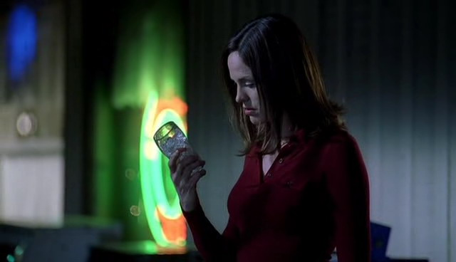

"Okay, Warrick，我下班了。明天见。"

Warrick挑了挑眉，"你朋友又来城里看你了？"

Sara困惑地看着他，"No。为什么这么想？"

"因为你准时下班了。" 他说。

Sara耸了耸肩，"也许我只是很开心明天我休假。"

Warrick摇摇头，"Oh，no，这不像你啊，姑娘。要不是有什么计划了你绝对不会按时走的。"

她朝他笑了笑，"好吧，也许我是有计划了。"

"这才是好姑娘！" Warrick大笑道，"准备做什么？"

"先睡觉吧。不过，我约了人吃晚餐。"

"不是吧! 去哪儿?"

"去之前Catherine带我去的一家餐厅。"

"她挑餐厅很在行的。" Warrick点点头，"我觉得她去过Vegas所有的餐厅了。我从小到大生活在这里，可她总能告诉我哪里又开了新店。"

"Yeah，她可是消息灵通。"

"那~么，" Warrick拖长声音说，"who are you going with？"

"你语法用错了。"

"啥，你不打算告诉我？"

Sara关上自己的柜门，"除非你用对了英语语法，否则不告诉你。"

Warrick怔怔地看着她好像她长了两个脑袋。"啥？"

给了他一个大大的微笑，她从他身旁走过，"还有别告诉其他人我去哪儿了！" 她边往外走边说。

"你不知道不让别人知道你在哪儿是件很危险的事吗？" Warrick朝她的背影喊道。

一边笑，Sara一边朝身后挥挥手然后转弯离开了大楼。

当Grissom走进更衣室的时候Warrick还在摇头。

"你还好吗，Warrick？"

"Sara刚才说我用错了英语语法。"

Grissom皱了皱眉，"你跟她说了什么？"

"'Who are you going with?'"

"With whom are you going?" Grissom订正道。

Warrick翻了个白眼，"我恨她。她比我祖母还要严格——我祖母总因为我的语法而揍我。"

"她要去哪儿？" Grissom问。

"出去吃晚餐。我刚想问——"

"对，问和谁一起。" Grisssom插嘴道，"非常Catherine。"

"她和Catherine一起出去？" Warrick皱着眉问。

"No...嗯，也许是吧。不过，我的意思是Catherine经常会问别人这些问题。" 他关上自己的柜门说。"别老想着打听别人的秘密，Warrick。"

"我以为我们的工作就是去打探所有人的秘密！" Warrick在Grissom离开更衣室的时候喊道。

Grissom只能摇摇头，边走边暗自轻笑起来。得知Sara和别人相约吃晚餐让他不禁松了一口气。她交到了朋友而且找到了工作之外可做的事情。显然，他和Catherine说动她了。

"Hey，" Nick在走进更衣室的时候问，"为啥Grissom笑的这么开心？"

"Oh，他刚刚在这儿告诉我我很八卦。" Warrick答道。

"为什么？" Nick笑了。

Warrick叹了口气，"Sara刚告诉我她要出去吃晚餐，但她没告诉我with whom。"

Nick瞪了他一眼，"用这么标准的语法啊，莎士比亚吗你？"

"就是，我也想这么抱怨啊。" Warrick笑起来。

"Sara要去哪儿吃晚餐？"

"一个Catherine推荐的餐厅。"

Nick点点头，"要是Catherine推荐的那一定错不了。"

"说我什么呢？" Catherine走进屋问。

"Sara今天晚上出去吃晚餐。" Nick说，"她跟Warrick说要去你推荐的餐厅。"

"一定是那天我带她去的那家。" Catherine点点头，"她能喜欢太好了。" 她顿了顿又问，"她和谁一起去？"

"不知道啊。" Nick和Warrick一起说。

Catherine眼睛亮起来，喃喃说道，"好姑娘。"

"我们可以去监视她。" Nick笑着建议。

"Oh, no。" Catherine说，"你们不是Sara的兄长，而且你们也不该老看着她。她是个大姑娘了，能照顾好自己的。要是她不想说，那这就不关你们的事。"

"Grissom刚刚还说你喜欢打听八卦呢。" Warrick说。

Catherine摇了摇头，"这次不了。你俩别老Grissom说什么就信什么！"

"好吧，我们不管Sara了。" Nick叹了口气。

"Hey，你俩是不是能帮我个忙..." Warrick慢吞吞地说。

"什么？" Nick问。

"别跟Sara说我告诉你们她去干嘛了。她好像让我保密来着。"

"喂！" Catherine叫着在空中挥动着她的双手，"我可拿你们俩怎么办好？"

她阔步走出更衣室，留下Nick和Warrick兀自在屋里笑个不停。

*************

已经不是第一次了，Sara难以入眠。终于熬到了该起床的时间，她爬起来去浴室冲了个澡。她觉得要做好约会的准备需要花费很长时间。

在冲了个长长的，热气腾腾腾的，不知为何令人平静的澡之后，Sara开始挑选今晚的衣服。她得仔细挑选。想起自己的大学时代，她和Mary为了初次约会会翻遍两人的衣柜来凑出一套衣服，她轻轻笑起来。当她在自己的衣柜里翻看衣架时，她真希望她还有Mary的衣橱作为自己的备选。Mary总有比自己选的那些更漂亮的裙子。

最后Sara终于选定了一件在自己衣柜里算是相当深V设计的红领衬衫以及一条黑色的裤子。她花了些时间做头发，把发梢烫卷了些。当她刚刚涂好口红时，敲门声响起。她吓了一跳把口红掉到地上。摇了摇头，她捡起口红把它丢进手包，然后赶忙跑去开门。

Hank正站在她家门口，紧张地朝她微笑。

"Hey。" 他打招呼说。

"Hi。" 她说着也紧张地笑了笑。"等我拿一下外套，然后就可以出发了。"

"好的。" 他微笑着说。

Sara抓起她的夹克然后两人一起离开。

*************

"你以前来过这儿么？" 在餐厅里，Hank点餐后如此问道。

"来过一次。" Sara答道，"我的一个同事，Catherine带我来过这里。"

"这里很不错。" 他笑了笑说。

"这里的素食很好吃。" 她说，回想起Catherine约她来时用的诱饵。

"你是素食主义者？" Hank翘了翘眉毛问。

"Yes."

他点点头，"不错啊。我就做不到。我太肉食系了。"

Sara大笑起来，"大家尝试之前都这么说的。其实并没有你想象的那么难。"

"那是什么契机让你是决定吃素的？"

Sara笑了笑，"和小猪打太多交道了。"

Hank抬起手笑着制止她，"够了够了。"

他们的餐点到了之后，两人边吃边继续着对话。Sara了解到Hank是土生土长的Las Vegas人，上面还有2个哥哥。谈到他们的时候，让人觉得他好像花了一辈子在追赶他们，可惜并不十分成功。而且他和Sara一样，在高中的时候是那种被称为科学呆子的人。

"我的家人总觉得我是一名医生。" 他笑着说，"我想，对他们来说，可能觉得做现场救援是不如在医院救人听起来更有威望吧。不过他们还是支持我的。"

Sara笑了笑，"他们应该为你感到骄傲。没有那么多人可以做到你做的事。"

"我得说有更少的人能做到你所做的。" 当服务生摆上甜点的时候，Hank咧嘴笑了笑并夸张地颤抖了一下，"那些尸体..."

"Yeah，不过，总要有人去做。"

他笑了笑说，"真不敢相信我终于约你出来了。"

Sara也回以微笑说，"这感觉很好。"

Hank继续着闲谈，但Sara有点儿跟不上他的节奏了。她注意到店外Catherine正从一辆豪华跑车的驾驶席走下来，而同行的男人是她从没见过的。让Sara吃惊地是，他们径直走进了这家餐厅。Catherine在路过Sara的时候甚至都没看她一眼。

"那不是你的同事么？" Hank问。

"Yeah。" Sara慢慢地说完耸了耸肩，"今晚她不怎么爱理人，是吧？"

"这也没什么。" Hank笑了，"就算你说我自私，我也宁肯你今晚只属于我一个人。"

Sara笑了笑，觉得脸颊有些发烫。"我也这么想。"

见她有些难为情，Hank笑了笑，低头看了看自己盘子里的派。当他再抬头看向Sara时，发现她也正盯着自己的甜点。"那个，我在想...我们吃完甜点之后去看个电影怎么样？"

"好啊。" Sara说着给了他一个闪亮的笑容。

"街角就有家影院——我最喜欢的一家。" 他咧嘴笑了笑，"我上高中的时候，我最好的朋友就在那家工作。于是我白看了好几年电影。"

Sara大笑起来，"他还在那儿吗？"

"No。不过，我想今天我可以请你看。" 他顿了顿说，"你有什么特别想看的片子么？"

Sara想了一会儿，可惜脑中一片空白，"没什么特别的。我们直接过去看看在放什么吧。"

"好主意。我也没想到什么——"

Hank的话被Catherine打断了。她在离开餐馆时再次走过了他们的座位。没说一句话也没看Sara一眼，只在她面前放下了一只玻璃杯。而Sara和Hank都吃惊地看着玻璃杯里的东西。

"那是一根手指吗？" Hank惊恐地问。

Sara把目光从这根被冰镇的手指转向Hank的眼睛说，"能等我一分钟吗？"

"当然。" 他说。

Sara从座位跳起来跟着Catherine走出餐厅。但当她追到路边时，她看到她的同事已经开车离开了。她不由得低头看了看抓在手里的玻璃杯。

"这什么鬼？Catherine？" 她咕哝道。

她慢慢走回店里。Hank还坐在他们的座位上等她。她滑进座位，痛恨着自己接下来不得不做说的话。不过Hank先问了一个让她觉得压力大减的问题。

"你得去工作了，对么？"

她叹了口气，"Yeah。我很抱歉，Hank，但这根手指..."

"Yeah，我懂。" 他叹道，"证据。"

"某个案子的证据。" 她说，"我真的，真的很抱歉。"

"没关系的。" 他说着假意笑了笑，"总有下次的，对吧？"

"对的。" 她也假装充满热情地回应。

"要我送你回家还是去实验室？"

"去实验室。" 她说，"我想赶在这个融化之前把它拿到验尸房。"

Hank皱了皱脸，顿了顿又说，"好吧。那你之后还能回家吗？"

"会有人送我的。" 她说。

"好吧。" 他说完把饭钱放到了桌上。"咱们走吧。"

*************

Sara到达实验室的时候，发现了正在烦躁不已的Grissom, Nick和Warrick。他们告诉了她她错过的故事：警察逮捕了一名满手是血还带着满满一箱钱的嫌犯。Grissom和Catherine对他进行了取证，结果他的律师出现，叫嚣着他们侵犯了公民权利。于是这人就被释放了。之后因为正好下班，于是Catherine跟着嫌犯去了停车场顺便还他落下的太阳镜。

结果Grissom看到Catherine和嫌犯一同驾车离开，竟然留下了自己的手包、钥匙、电话、配枪和取证工具箱。他们现在对事态的发展一头雾水。现在Sara带来的冰镇手指以及Catherine形同陌路的反应只让他们更加困惑。

"她看起来真的挺好的。" Sara说出了她对Catherine感觉，真是如平常一样。

他们坐在会议室里，试图拼凑起现在他们掌握的证据碎屑。Grissom用手擦了擦眼睛。

"Catherine今晚应该去Lindsey的学校看她表演的。如果她现在是被绑架了，那她肯定没法去了。"

"对啊。" Nick慢慢说，他的声音中透出了些许迟疑。

"我们中的一个得去接Lindsey。"

"什么？" Sara问，"Eddie不去看表演吗？"

"别提他了。" Warrick说，"他已经向法院投诉她不履行家长义务了，要是被抓到Catherine没有去参加活动，他就该取得Linds的抚养权了。"

"确实。" Grissom说，"那，谁自愿去接Lindsey？"

当所有人都看向Sara的时候，她不由得瞪大了眼睛。

"Oh, no。" 她说，"你们怎么又这样。不能因为我有子宫就总让我照顾小孩儿！。"

"Oh, come on。" Nick哄她说，"你上次和Collins酱相处的不是挺好吗。"

"Yes，Nick。照顾一个被自己父亲性侵，然后看着全家在自己眼前被杀死的小孩儿真是美好啊。" Sara讽刺地说道。

"听着，Sara，得有人去接她。就当为了Catherine吧。" Grissom说着，又看了看另外两个人，"带Warrick一起去呗。"

"那好吧。" Warrick说，"咱们走吧，Sara。"

Sara做了个鬼脸，然后跟着他走出Grissom的办公室。

"她是个乖孩子，Sara。" 他们走到停车场时Warrick说。

"我知道。" Sara应道，"我只是很气只因为我是女的就把我自动看成保姆这一点。"

Warrick咧嘴笑起来，"相信我吧，姑娘，我们都很清楚你不输给男人的。你不需要证明这一点啦。"

听他这么说，Sara软化下来笑了笑问。"你知道Lindsey的学校在哪儿么？"

"Yes."

"很好，那你开车吧。"

Warrick笑了笑，"咱们开快点儿的话，还能赶上结尾呢。"

Sara翻了个白眼难以置信的问，"这是某种款待吗？"

Warrick只是大笑起来。

*************

Warrick说对了；他们赶到学校时赶上了表演的结尾。尽管她对看小学儿歌表演持保留态度，不过Sara在看到Lindsey那红彤彤的小脸儿时还是忍不住微笑起来。她演了一个月亮上的可爱女孩儿。

演出在雷鸣般的掌声中结束了；Sara和Warrick也跟着用力鼓起掌来。合上的幕布掩去了学生们身影。

"她去哪儿了？" Sara问。

"后台。" Warrick咧嘴笑了笑，"你小时候没表演过节目？"

Sara摇了摇头，"我太害羞了。就算是在幼儿园的时候，老师也从没叫我念过台词。我一直是演背景的。"

Warrick又笑了，"嗯，他们的老师会帮他们卸妆然后换上自己的衣服。之后她就归我们啦。"

"我们去哪儿找她？"

他耸了耸肩，"跟着其他家长就行啦。"

她听后点了点头。他们跟着家长们来到学校的自助餐厅。几张长桌上摆满了零食和饮料。站在他们身后的家长们正在分发小饼干。

"来一块小饼干吗？" 一位女士微笑着问Sara。

"Oh，不用了，谢谢。" 她笑着回答。

这位女士的笑容里开始掺杂了些许怀疑，"哪个是你的小孩儿？我不记得以前见过你啊。"

"我们是来这里看我们的侄女的。" Warrick来帮Sara打圆场。"Lindsey Willows。"

Sara有点儿吃惊地看了他一眼，不过很快回过神来，"她演月亮上的小女孩儿演得怎么样？"

发小饼干的女士也笑了，"Oh, yes，Lindsey非常可爱。" 她又看了看Sara，"你们是她妈妈那边的还是她爸爸那边的？"

"她妈妈。" Sara马上说，"我是她妹妹。"

"很高兴见到你。那这位是...你先生？"

"Yes。" Sara笑着说。

身高足以看到Sara的头顶的Warrick突然抓起她的手，"Come on, sugar，我看到Lindsey过来了。"

"很高兴认识你。" Sara亲切地说。

"我也是。" 发小饼干的女士回答道。

Warrick紧紧抓着Sara手带她穿过自助餐厅，"她很啰嗦是吧？"

"我好想也认识这样的人。" Sara挖苦到。她顿了顿看了他一眼，"说实话，Warrick——sugar?"

"抱歉。" 他大笑起来，"这是我能想到的第一个亲密的词。"

Sara无奈地摇摇头。

"Uncle Warrick!"

Warrick笑着放下Sara的手，一把搂过Lindsey将她举起来。"Hey，小家伙。" 他笑着紧紧抱着她。

"你看到我了吗？我的脸在黑暗里发光呢！我没想到你会来！妈妈没告诉我！"

"是啊，我们想给你个惊喜。" Warrick笑了。

这时Lindsey越过Warrick的肩膀看到Sara站在他身旁，于是小小声地打招呼道，"Hi, Sara。"

"Hi, Linds。" Sara笑了笑，其实她和Lindsey并没有相处过太长时间。这次她发誓要趁机修正这个错误。尽管她并不是真的很喜欢小孩儿，但她还是很想知道Lindsey扑进自己怀里是什么感觉。

Lindsey这时四下环顾着问，"Mommy在哪儿？"

"嗯...Mommy工作上有点儿忙。她不得不离开了。" Warrick说，"不过，她希望我们接你去实验室。好不好？"

"当然。" Lindsey笑着说。

"很好。那你准备好走了吗？"

"Yup."

Warrick把Lindsey放回到地板上然后拉起她的手，"那咱们走吧。"

Sara笑着低头看向她，然后也向她伸出手。他们可不能把Catherine的宝贝弄丢了。Lindsey考虑了一下，朝她伸出了另一只手。

"你们是开大汽车来的吗？"

"是啊。" Sara肯定地说。

"有警灯和警笛的那种？"

"Yeah。" Warrick轻笑起来。

"我们回去的路上能打开玩儿吗？"

Warrick大笑起来。"我们可以看情况。"

他们带Lindsey来到车上，并确保她系好安全带。Sara不由得为他们能如此轻易地带别人家的小孩儿离开学校而担心起来。

"他们都没要求我们出示ID或什么的。" 她不可置信地跟Warrick说。"我们可能拐走任何一个小孩儿，而没人会知道！"

"学校的安保呐。" 他叹了口气并摇摇头，"他们假定了所有家长都没什么问题。"

"我要是Catherine，我就得数落他们几句。"

"Hey，我们可是有正当理由帮她接孩子。"

"我知道。" Sara叹了口气，"不过，还是..."

Warrick边摇头边爬上驾驶席，"来吧，咱们走了。"

Sara跟着他爬上车，然后转头看向Lindsey。"饿不饿，sweetie？"

"Yeah。" Lindsey说。

回想起Catherine在他们早餐时说的话，Sara笑道，"我们去麦当劳吃点儿东西怎么样？"

"Yeah!" Lindsey高兴地叫起来，"可以吗？我想要带鸡块儿的开心乐园餐！"

Warrick不敢相信地看向Sara说，"素食主义小姐想去麦当劳？"

"素食主义小姐想让Lindsey吃到开心乐园餐。" Sara咧嘴笑了笑，"我会点个沙拉的。"

Warrick点点头，"咱们最好给大家都买点儿吃的。咱们仨要是不带10个汉堡回去估计会闹翻。"

Sara大笑起来，"好吧，司机先生，带我们去麦当劳吧。"

*************

当他们回到实验室的时候，Sara带Lindsey去休息室摆放他们带回来的餐点，而Warrick则去找他们的同事。Lindsey非常乐意在休息室的最长的桌子上规划食物的摆放位置。"我们应该把所有的三明治都放在桌子的最后面。" 她说，"就像旅馆的自助餐一样。"

"有道理。" Sara笑了，"我们应该把炸薯条放哪里？"

"这边。" Lindsey说着指了指三明治旁边空着的位置。

"这样看起来很棒。" Sara笑着说。

Lindsey咧开嘴笑起来，"然后我们把甜点都放在另一头。"

"有道理。" Sara说着把他们带回来的苹果派滑到桌子另一边，"我们把它们摞起来吗？"

"Yeah!" Lindsey同意道，"就像金字塔一样。"

"我觉得我们能做到。"

当Nick和Greg出现在门口时她们的金字塔刚刚完工。

"嘿，看看这些。" Greg咧嘴笑起来，"Sara当大厨了。"

Greg的话让Lindsey和Sara注意到他们的到来。Lindsey的眼睛马上亮起来。

"Uncle Nick! Greg!"

大笑着，Nick和Greg每个人都拥抱了Lindsey一下。Nick越过Lindsey的肩膀看向Sara。

"你做的很好，Sara。"

Sara耸了耸肩，"家常便饭，对吧？"

"来看看自助餐。" Lindsey说着拽着Nick的手带他穿过房间。"Sara和我摆的。我们还做个甜点金字塔！"

"苹果派，" Greg开心地说，"我喜欢。"

"你可以拿最上面的一个。" Lindsey朝苹果派指了指。

Greg笑着拿了金字塔最上面的苹果派，"谢谢，宝贝。"

"来吧，Linds，拿上你的开心乐园餐，然后你就可以坐下和Greg、Nick一起吃饭啦。" Sara说。

"你会和我们一起吃，对不对，Sara？"

Sara笑了笑，"当然了。"

他们4个人刚坐在桌边Grissom就走进来。他静静看了他们一会儿。看来虽然Sara自称不善于带小孩儿，但其实她和Lindsey相处的还是相当好的。他看着Sara把Lindsey套餐里的玩具装在一起陪她玩儿，令这个小姑娘开心的大笑起来。笑着观望了一会儿，他故意清了清嗓子。

Lindsey朝着发出声音的方向看过来，一看到是他，脸上立刻绽放出灿烂的笑容。

"Uncle Gil!" 她叫着从自己的椅子上跳起来。

Sara惊讶地看着Grissom把她拥在怀里，紧紧抱了她好一会儿。

"Hi, sweetheart。" 他笑着放开她，"我听说你今晚表演的特别好。"

Lindsey咧开嘴笑道，"我整个脸都在发光，Uncle Gil。你应该看看！"

他笑着说，"我也希望能看到。也许咱们可以下次再让它发光一次，那样我就能看到了。"

"好哒。" 她保证到，"我们能去看看你的蝴蝶吗？"

"过一会儿吧。" 他说，"首先咱们先吃晚餐。我听说Sara和Warrick带你去麦当劳了？"

"Yeah。" 她咧嘴笑起来，"我要了开心乐园餐，然后Sara帮我把玩具装在一起了。你想看看吗？"

"想看啊。"

Lindsey拉着他的手然后把他拉向Sara, Nick和Greg正在吃东西的桌子。Sara简直不敢相信自己竟如此享受看着Grissom陪Catherine的小女儿玩耍。她都快忘了自己刚来这边时他说的话：Lindsey就好像他的侄女。Sara微笑着看着他们，想象着这个男人会是个很棒的父亲。

*************

在他们吃完简易晚餐后，每个人都必须要回去工作了。Nick去嫌犯秘密拥有的公寓调查时，Sara, Grissom和Warrick开始追踪Catherine到底在哪儿的线索，而Lindsey被送到实验室帮助Greg。Grissom对于让一个小孩子在他们的DNA实验室玩耍表示有些担心，不过Greg保证一切都在他的掌控之下。

"我只是让她看看显微镜下的东西。" 他说，"她会喜欢的，而且她会觉得自己帮上了忙。我会帮她戴手套和护目镜，还会帮她扎马尾辫儿。" 他笑了笑又说，"别担心，Grissom。都在我的掌握之中呢。"

Grissom听了点点头，然后留下Lindsey做Greg的左右手。

*************

直到第二天早上Catherine才回到实验室。大家花了整整一天去拼凑整个事件的碎片。带走Catherine的嫌犯杀害了他的情人。为了掩盖自己的罪行，他让他的律师伪造她被绑架。Catherine只不过是在错误的时间出现在了错误的地点，他们只是打算随便拐一个执法人员让绑架案看起来是真的。

"你还好吗？" 在她准备回家时Grissom问道。Nick, Greg和Warrick已经离开了，Sara还在实验室晃不过估计也准备走了。

Catherine点点头，"真是艰难的24小时。" 她承认道，"我真的很高兴能回家了。"

"休几天假吧。" Grissom说，"花时间陪陪Lindsey。"

Catherine笑了，"我听到的倒都是她在这儿玩儿得有多开心。"

"Hey, guys。" Sara一边走进更衣室一边打招呼道。

"Hey，Sara，你有个新粉丝了。" Catherine咧嘴笑起来。

Sara困惑地看着她，"啥？"

"Lindsey爱上你啦。" 她笑着说，"她一直在说你俩做的自助餐吧。"

"Oh。" Sara笑了，"她是个很可爱的孩子，Catherine。"

"Yeah，我也这么想。" Catherine关上她的柜门说，"好了，伙计们，我得走了。Gil，那我休两天假，周四见吧。"

"好好休息, Cath," 他笑了笑。

"Bye, Catherine."

Catherine离开更衣室后，Sara紧张地看着Grissom。

"能请你帮个忙吗？"

"当然。" 他回答。

"你能开车送我回家吗？我没开车过来。"

即便Grissom惊讶于她的请求，他也没表现在脸上，只是说。"我很乐意。"

*************

"那，你和Lindsey在一起还开心吗？" Grissom把车开出停车场时问到。

Sara有些害羞地笑了笑，"抱歉我那么不情愿去接她。就像我跟Warrick说的，那只是..."

"只是什么？"

她叹了口气，"那不重要。我想我只是没什么和小孩子相处的经验。"

"你和她在一起玩儿得很好啊。" Grissom说。

"你也是啊。" Sara说，"我都不敢相信她那么喜欢你！"

Grissom狡猾地笑了笑，"大家都喜欢我，你知道的。就算是小孩子。"

"我不是这个意思好吧。" Sara笑起来。

"我知道。" Grissom说着收起了调笑的态度，"Lindsey...对我们大家来说很特别。因为她父母的离婚，她的生活挺不顺利，而我只是，感觉像是想要对她再好一些。我能理解在成长中没有父母的陪伴是什么感觉。"

Sara听了挑了挑眉，希望他继续说下去。不过他没有，她也只能放下这个话题。她不希望有人来问自己的过去；所以她决定给他同样的尊重。

"这个案子里你做的很好。" 他换了个话题继续说道。

"谢谢。" 她说，"都是Nick的功劳。"

"不用妄自菲薄，Sara。" 他认真地说，"你是个很棒的CSI。"

她听了不禁脸红起来，"谢谢。"

他们来到Sara的公寓大楼。Grissom把车停进一个空位后关掉了引擎。Sara诧异地看着他。

"我送你到门口。" 他主动回答了她眼神中透露出的无声疑问。

"你不用这么做的。" 她下意识地说。

"就当迁就我一下吧。" 他笑着说。

Sara点点头爬出车子。随后Grissom与她并肩而行并陪她爬上四楼。然后Sara拿出钥匙打开大门。

"进来坐坐吗？" 她礼貌性的问道。

"No,谢谢。" 他笑着说，"晚安, Sara。明天班儿上见吧。"

"晚安。" 她回答。

最后朝她笑了笑，他转身消失在黑暗中。

Sara慢慢走进公寓并锁上大门。叹了口气，她走进屋低头看了看电话答录机。又是红红的"0"在嘲笑着她。再次叹了口气，她拿起电话拨了Mary的号码。

电话响了2下后她接了起来。

"Hello?"

"我搞砸了。" Sara说。

"Sara?" Mary问，"你到底说什么呢？"

"我真的把我的约会搞砸了。" Sara说。

"Oh, sweetie。" Mary叹了口气，"发生什么事了？"

Sara给她讲述了整个故事，告诉她在Catherine出现并在他们桌上放了一根断指之前，他们的晚餐进行得有多么顺利，还有之后愉快的计划。

"结果，我必须离开。" Sara总结道，"我得回去工作，处理这根手指。"

"他说什么了？"

"他表示很理解。然后开车送我去实验室。不过，Mary，这——等等，我有一通电话进来。"

"好的。"

Sara按下闪烁着的按钮应道，"Hello?"

"Sara?"

"Yes?"

"Hi, 我是Hank。"

Sara听了差点儿把电话丢掉。"Hi," 她惊讶地说，"你怎么样？"

"很好。" 他说，"你还好吗？"

"当然。" 她答道。

"你手指的案子破了么？"

Sara不自然地笑起来，"Yeah，我们把所有事都解决了。我们找到了剩下的尸体，然后拼凑起了所有证据。"

"Good," Hank说，"那，你现在可以放松下来了吧？"

"暂时吧。" Sara说，"至少在下一个案子开始前。"

"对哈。" Hank笑起来，然后顿了顿又说，"那...我想你还欠我一场电影呢。"

"那我该说抱歉？" Sara问道，很怕自己误会了他的意思。

"嗯，在Catherine给你那根手指之前，我们正说要去看电影嘛。现在既然手指回到自己身体上了，我想我们应该继续我们的约会了。"

"现在？" Sara问道，盘算着自己不睡觉还可以撑多久。

"No，不用现在。" Hank轻笑道，"你明晚上班么？"

"Yeah."

"我也是。觉得明天下午怎么样？咱们可以看个下午场。"

"那样太好了。" Sara说着脸上洋溢起开心的笑容。

"太好了。" Hank说，"我2点去接你好吗，然后一起过去。"

"好啊。" Sara说。

"太好了。那咱们明天下午两点见。"

"到时候见。"

"Bye, Sara."

"Bye."

Sara按下挂断电话的按钮，然后被手中再次响起的电话吓了一跳。她再次按下通话键。

"Hello?"

"你是不是把我忘了？"

"Oh, God, Mary, 对不起。"

Mary笑起来，"一切都还好吗。谁来的电话？"

Sara咧嘴笑起来，"Hank。"

"Ha," Mary说，"你还没把他吓跑。"

"看来是。我们约了明天看电影。"

Mary尖叫起来，"我该把他作为你的同行者加进我的婚礼宾客名单吗？"

"不要啦。" Sara咧嘴笑起来， "暂时不要。"
