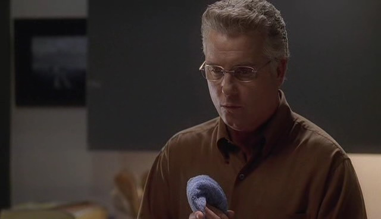

"我今晚过得真的很开心。"

Sara笑了笑，用手指挽住Hank的手指，"我也是。"

他们到了她的公寓门口，相互紧张地对视了一下后，Sara笑起来。

"我很高兴我们终于完成了第一次约会。"

Hank也咧嘴笑了笑，"Yeah，这有点儿像‘下集待续’，对吧？"

"Yeah."

他碰了碰她的脸颊轻语道，"咱们不能再犯错误了。"

在Sara能回复他之前，他就倾身下去用嘴唇覆上了她的。Sara轻轻颤了一下，然后回吻了他，并伸手拽住他的衬衫紧紧抓在手中。Hank的双手顺着她的手臂滑落到她腰间，将她拉得更近。

这时她的呼机震动起来。因为別在她的皮带上，令此刻如此贴近着的两人都感觉出来。

呼机只震了几下就停了下来。Hank稍稍后退了些。而Sara面色绯红地拿起自己的呼机。

"我得去上班了，抱歉。" 她看着小小的显示屏说道。

"没关系。" Hank笑了笑，"咱们这是尽欢而散。"

"绝对的" Sara咧嘴笑了笑。

"Okay，那，咱们还有下次，对吧？"

"我很期待。"

"太好了。" Hank停顿了一下，再次倾身在她唇上落下一记轻吻。"工作开心。"

"一直是滴。"

笑了笑，Hank转身离开，而Sara打开门锁走进自己的公寓。进到屋里后，她再次看了看呼机，然后摇了摇头。

"你时间挑得好烂，Grissom。" 她叹了口气，"真的，真的，很烂。"

*************

"那，你怎么来上班了？" Catherine和Sara一同沿着走廊来到休息室时如此问道，"我以为你今天晚上休息。"

"我也以为。" Sara答道，"Grissom叫我来的。"

"嗯，我们的案子很奇怪。" Catherine说，"Grissom和我不得不到尸体农场去看尸体。"

Sara听后挑了挑眉。

"一具不属于他们的尸体。" Catherine补充道。

"那它怎么到那里的？"

"我们还在查。他看起来是被枪击了，不过在现场我们没能自己查看；Grissom让David把他马上弄出来。因为他被其他尸体上的虫子污染了。"

"尸体农场是什么样子？" Sara饶有兴致地问。

"说实话，让人毛骨悚然。" Catherine轻颤了下答道。

她们关于尸体农场的话题一直持续到走进休息室，听到Nick正在对Grissom把实验品放进公共冰箱而大发牢骚。两位女士和Warrick都同意Nick的看法，确实很恶心——没人愿意自己的午饭旁边放着一罐子鲜血——不过他们觉得自己说什么也没用。那位社交能力为零的Grissom从来不把乱放实验品当做是问题。

*************

当她的轮班过半，Sara开始想为什么Grissom要在她的休息日把她叫回来。这个案子虽然很惊心，不过实际上她也没帮上太多的忙。Catherine接手了受害者家人的问询——他的未婚妻和她的两个孩子。嫌犯的房子失火了，但Nick和Warrick正跟Grissom着手处理。他们发现了一些照片，也许是受害者性侵他未婚妻女儿的证据；不过这仍然由Catherine接手。

一整天Sara的怒气持续增长。她只想要能帮上忙，好好做她的工作，可是好像没人需要她。Catherine自己就能搞定受害者家属了；虽然搜查房间的时候她需要人帮忙，可是她叫了Nick。Warrick一直躲在AV实验室做受害者房间相片的恢复工作；他一向都喜欢一个人处理相片。Grissom在忙着做生肉实验，试图找出牛肉上生出的昆虫进到受害者伤口中的原因。Sara真的很反感要她帮忙做这个实验，而且，从Grissom整天都在忽略她的态度来看，她很怀疑他是否想让她帮忙。

她的怒气逐渐转为感到被忽视和不受尊重。如果她的同事都不信任她帮忙破案，他们是不是也不信任她的工作，或者根本不信任她这个人？

现在只有一件事好做了。她必须和Grissom谈谈。

*************

Catherine来到更衣室正看到Sara一拳打在她的衣柜上。

"Hey，那个柜子对你做了什么？" 她问。

Sara转头看向她，眼中充满愤怒。"Grissom到底有什么毛病？"

"这说的是哪儿的话？" Catherine慢慢问道。

"他在我的休息日把我叫过来，却不让我参与到案子里！这个调查我没单独帮上一点儿忙。当我问到他时，你知道叫我干什么吗？"

Catherine摇了摇头。

"去清理他那个生肉实验的东西！"

"Oo。" Catherine边说边在长椅上坐下来。

"他为什么要这么做？所有人都知道我是个素食主义者！"

"他知道么？" Catherine问。

"他怎么可能不知道？" Sara叫到。"我们一直一起吃饭。出去吃晚饭、早饭、午饭...每个人都知道，Cath！每个人！他怎么能让我干这个？"

"你告诉他了么？"

"当然！你知道他说什么？"

"No。" Catherine慢慢说道。

"他跟我说让Nick去做，就好像这样能让事情变好！"

Catherine叹了口气，"需要我和他谈谈么？"

"No。" Sara固执地说，"我自己搞定。"

Catherine紧张地看着她，"Sara...别做傻事。"

Sara空洞地笑了笑，"我不会拿枪指着他的，"Catherine。

"No，我知道。" Catherine答道，"只是...在这件事上我不希望你在盛怒之下做出决定。先让自己冷静下来吧。"

Sara没有说话，空气里充斥着反抗的情绪。

"那个，我得去医院陪Bradley家的小姑娘了。只是...拜托，我回来之前什么也别做。我们之后再好好谈谈，okay？"

"我很好, Catherine。"

"好。" Catherine怀疑地说。她走向门口又回过头来，"我们之后再谈。"

"好。" Sara附和道。 "回头见, Catherine."

"Bye."

Sara等到她确定Catherine已经离开后，自己也离开了更衣室。她直接朝部门办公室走去，拿了一张休假申请单。她不能再留在这里和他一起工作了。如果他不懂得尊重自己。

*************

当Catherine之后再次回到更衣室的时候，发现Sara正独自坐在那里，盯着她打开了的衣柜发呆。她有些踌躇地走了过去。

"我不是真的让你 '什么也别做' 只是坐在这里等我啊。" 她试着开玩笑说。

Sara红着眼圈看向她，明显是哭过了。"我没有。"

Catherine慢慢在她身边坐下说，"发生什么事了，Sara？"

"我没法和不尊重我的人一起工作。" 她说，"我这么告诉他了。"

"你告诉...Grissom？"

"Yes。我要求休个假，以便我去找另一家专业结构就职。"

Catherine呼了口气说，"Sara，我跟你说了在我跟他谈之前什么也别做..."

"没什么关系了。" 她空洞的说，"他拒绝了。还说'实验室'需要我。"

"我们确实需要你。" Catherine立即说，"我们都是。"

Sara摇了摇头，"他不是这么说的。不是你需要我。上帝不准他说他需要我。他只说'Sara...实验室需要你。'"

"Sara，Girssom...他不擅长任何和感情相关的事情。他只是不善于和人打交道。他不知道在这种情况下该如何反应——"

"他知道该如何表达尊重。" Sara打断她，顿了顿又道，"我跟他了说如果他不准我假，那我辞职。"

Catherine瞪大眼睛，"别这样。"

Sara忧伤地笑了笑，"自从被他拒绝之后，我就一直坐在这儿，看着我的柜子，想着所有我应该离开的理由。但是..." 她叹了口气，"我没法不去想我该留下的理由。"

Catherine这时做了件让她完全想不到的事；她抓过Sara的手然后紧紧握了握。"你得坚持那些让你觉得应该留下的理由。"

Sara惊讶地看了看她。

Catherine朝她轻轻笑了笑，"你知道吗，你刚来的时候，我并不想让你留下加入我们。我从没和其他女性共事过。我已经习惯这个老男孩儿俱乐部了，而且我在这里挥洒自如。但和你共事...我的那一套就行不通了。我觉得被你威胁到了。" 她叹了口气继续道，"但是，现在，Sara，我没法想象不和你共事的情景。你是个很棒的CSI，而且你已经是我们大家的朋友了。我想我们中的任何人都不乐于见你离开。" 她笑了笑又说，"再说，你不在了的话Sanders对你的幻想不就都成泡影了。"

Sara被她逗得笑起来。

"只是...多待一个星期，okay？如果到这个周末你还是想要离开，那就离开。不过，如果对此表示怀疑，那就不要这么做。你只是因为气愤不过而离开的话，也没法好好开始新的生活。"

Sara叹了口气最后说。"Okay，一个星期。"

Catherine笑了，"这就好，我只要求这些。"

*************

"Grissom!"

Grissom停下脚步转身看到Catherine正从走廊另一边朝自己走来，"小姑娘的事你处理得很好。"

"你也是。" 她说。

他摇了摇头，"我不敢相信她父亲..."

"我理解。" Catherine说着脸上显出赤裸裸的厌恶之情。"Eddie也许是有点儿花心，但我知道他对Lindsey绝对没有想过那样的事。"

"Thank God。" Grissom轻声说。

"Hey，你下班后准备干吗？"

"回家吧，我想。"

Catherine笑了笑说，"想要个伴儿么？今晚Lindsey跟着Eddie。而在这么个案子之后我实在不想回到我那空空荡荡的房子里去。"

Grissom叹了口气说，"我也是。"

"Good。我带伏特加去。你负责下厨。"

*************

Catherine带了2大袋东西到了Grissom的公寓。他从她手中结果东西后带她来到厨房里。

"我以为你只带伏特加来。" 他说。

"Yeah，我是这么说的。" 她说，"但是，我怕你家没有橘子汁。"

"我有。"

"Oh，好吧。留着早餐喝。现在先开我带来的。"

他笑了笑说，"你想当酒保吗？"

"当然"

在Grissom切蔬菜做沙拉的时候Catherine帮两人倒了酒。他已经把晚餐的其他部分——自制披萨——放到烤箱里了。

"令人心痛的案子，对吧？" 他问。

Catherine敷衍了两句，她不想再谈这些。再开口的时候她选择了另一个话题。

"我听说你和Sara的事了。"

"Sara...你知道她的。" 他尝试着轻笑了一下继续说，"她非常情绪化。"

Catherine不可置信地盯着他，"你在否认事实吗？"

他把视线从切番茄的刀子上抬起，看着她。

"No，这...no, no，这么说太具分析性了。" 她摇了摇头。

如果说她和Grissom太经常讨论她的私生活的话，那他就是几乎不会谈起自己的。尽管她对此一直很好奇，但Catherine通常还是不妨碍他的。但是，这次，她想要帮帮他。

她开始念道被爱所伤。Grissom则叫她别再说这些，接着她迅速转变主题，提醒他他是夜班组的主管，也因此，无论他喜欢与否，他的组员都好像他的家人。

"听着，" 她总结道，"咱们不需要一起出游，只是...时不时的你得留心一下显微镜之外的世界。"

"Yeah。" Grissom同意道。

Catherine笑了。她知道自己说的够多了——如果她再继续念他，在这件事上他就再也不会听她的了——她离开厨房踱步走进客厅，望着窗外，完全无视他开始翻看电话号码目录。直到他真的开始给花店打电话时，她才敢转过身来，倒在他的沙发上听着他为Sara订了一盆盆栽，因为"她喜欢植被。"

当Grissom回头看向她时，Catherine咧嘴笑起来。他也笑了。

"我这么做事情会有转机么？"

"是个很好的开始。"

*************

"Miss Sidle，这里有你的快递。"

Sara惊讶的看着Judy，"快递？我不记得我有快递呀。"

Judy笑着递给Sara一盆开着花的盆栽。"看来你有崇拜者了。"

当她看到这盆格柏雏菊的时候Sara的眼睛瞪得更大，"我没想到他会这么做。"

Judy露出大大的笑容说，"你交男朋友了？"

"No...不算是...我觉得我们还没确定关系..."

"我觉得他说的很清楚啦。" Judy咯咯笑起来。

Sara摇了摇头，从Judy桌上拿起了那盆植物，"Thanks, Judy。"

"You're welcome。"

Sara带着她的盆栽走进更衣室并把它放在长凳上，然后拿起那张附带的卡片，她注意到有三种颜色的花正在盛开——一朵黄色的，一朵粉色的还有一朵红色的。她很诧异Hank竟然会送她植物。这真的很奇怪...因为感觉他是那种会送"玫瑰"的男人。

她把卡片从写着自己名字的信封中抽出来然后坐到盆栽旁边。卡片上整洁得印着12号的字母：FROM GRISSOM

她感觉有些眩晕。Grissom竟然送了她一盆植物。一盆开着花的植物。一盆格柏雏菊。

"Hey，这是你男朋友送的吧，EMT那个叫Hank的？"

Sara这次真觉得快跌倒了。她转头看到Greg站在那里看着她，于是把卡片塞回信封里。

"No，那是...你怎么知道Hank的？"

Greg咧嘴笑起来，"我消息灵通。"

"Greg Sanders，我发誓..."

"我在EMT有朋友啊。" 他说，"他跟我说Hank说过跟你出去看电影的事。" 他轻皱了下眉，好像在犹豫要不要说下面的话。"他还说他都不知道Hank已经和前女友分手了。"

"Yeah，well，我想不是所有人都希望自己的事被众所周知。" Sara严苛地说，"Greg，拜托别跟别人说这事。"

"为什么？" Greg困惑地问。

"我只是...觉得我的私事不关别人的事。"

"有道理。" Greg说，"我嘴已经封上了。"

"Thanks."

"Sara，我需要你帮忙那个曲棍球员死亡的案子。" Grissom说着走进更衣室。当他看到Sara身旁的植物时眼睛亮起来。"Oh！你收到我送的植物了！你喜欢吗？"

"Yeah，它很漂亮。" Sara说着脸颊有些泛红。"Thank you。"

"不客气。我想你会喜欢的。总之，你要是愿意跟我一起的话我会在10分钟后动身去溜冰场。"

"Yeah，那样很好。" 她应道，并为自己能若无其事地回答他感到吃惊。"我去停车场找你？"

"好的。"

Grissom离开后，Greg张着嘴瞪大眼睛看向Sara。

"要是有别人知道这件事，我会想也不想杀了你。" 她边起身边威胁他，"另外，我是个CSI——我知道怎么把那布置得看起来像一场意外，知道怎么把你的尸体藏起来让任何人都找不到。"

Greg清了清喉咙说，"不用虚张声势地恐吓我。你的秘密在我这里很安全。" 他又低声道，"你不是背着Hank在和Grissom交往吧？"

Sara大笑起来，"听着，Griss和我前几天为一个案子吵架来着。我猜这是他和好的方式。"

Greg耸了耸肩，"好吧，你不能怪我想挖点儿猛料的心情嘛。"

"我记得Nick让你专注于真实故事来着，别老在脑子里想象。"

Greg咧嘴笑了笑，"我知道。但是，我想象的更有趣啊。"

Sara笑了笑便离开更衣室去找Grissom了。

*************

跟着Grissom来到冰球场的观众席，Sara抑制不住地感到兴奋。她一直喜欢冰球。她的父亲，Pittsburgh本地人，一直是Penguins队的粉丝。她对父亲最美好的记忆就是和他一起坐在沙发上看Penguins队的比赛。对父亲最后的记忆是看Mario Lemieux的第一场比赛中他第一局第一个射门得分时。她父亲从座位上跳起来，很狂野地抱着Sara在屋里乱转。

"我们终于有一名球员了！" 他喊着，"我们终于能赢了！"

她一直对父亲没能看到Lemieux带领着球队打到Stanley杯而感到遗憾。

与她父亲不同，她并不止喜欢一支球队。她总会为Pens助威，但同样会为其他队伍喝彩。在Harvard的那段时间，她是Boston Bruins队坚定地支持者。在90年代早期San Francisco终于有了一支队伍时，Sara立刻成了San Jose Sharks的粉丝。

"所以，我们的受害者是在冰上被杀的。" Grissom的话把Sara的思绪带回现实，带回他们正在办的案子。他拿起一张受害者在这场比赛中受到的处罚清单开始念，而每念一条他的声音中都会增添一些不可置信地味道。

"男孩子嘛。" 他念完后Sara说。

"Yeah，听起来好像这些男孩儿利用冰球比赛干了一场架。"

"你只是不喜欢运动。" Sara说，试图维护她喜爱的运动。

"这么说可不对，我一辈子都是棒球粉。"

"棒球。" Sara重复着转头看向他，"好吧，那些计算...所有那些统计数据。"

"那是种美丽的比赛。" Grissom说。

Sara笑着点点头然后看向冰面，"你什么时候开始对美产生兴趣了？"

"自从遇到你。" Grissom头也没抬地看着自己手上的纸说。

Sara感到身体里有一种快要爆炸的感觉。她看向他，但他却没有看她。

"那么，咱们从两侧的球门开始，越过蓝线往场地中央检查。" 他终于看向她说。

"好。" 她说，极力地试图保持镇定。

Grissom站起身走向一侧的球门，留下Sara还坐在长椅上发愣。多年之后回想起来，她都不太记得自己是怎么从看台下到冰场，又和Grissom检查了哪里。

*************

当Sara回到家时，感觉自己已经工作了好几天。进门后她注意到电话答录机的指示灯正一闪一闪的提示她有一条消息。她按下了回放键。

"Hi, Sara, 我是Hank。我只是想问问这周你哪天晚上休息...我想咱们可以去看场电影。确定了给我回个电话吧。回头聊。"

她叹了口气拿起听筒。不过拨的不是Hank的号码。电话响了2声以后被接起来。

"Hello?"

"我遇到了一个巨大的问题。"

Mary咯咯笑起来。"Hi, Sara。接到你的电话我也很高兴。我很好，谢谢。现在，我们来听听你的问题吧。"

"Grissom突然间向我示好。"

Mary顿了一下，"啥？"

"他送花给我。"

"啥？"

"Okay，那不算花，但那是开花的植物。一盆格柏雏菊。"

"他为什么送你花？" Mary问。

"我们前几天吵架了。" Sara说，"嗯，主要是我跟他吵来着。他基本没有还嘴啦。不过，我当时气疯了还威胁要辞职。Catherine要我保证等一周再做最终决定，而Grissom在那之后就对我很好，今天我甚至收到了他送我的植物。而且，后来，他还说我很美！"

"厄，你是很美啊。" Mary虔诚地说。

Sara翻了个白眼，"不管你怎么说啦，Mar。"

"他怎么说的？"

"我们在讨论运动，然后他说棒球是种美丽的比赛——"

"或者说是最无聊的比赛。" Mary插嘴说。

"Mar …"

"抱歉。你继续说。"

"反正，就是我问他什么时候对美产生兴趣了，结果他说自从遇到我。"

"Whoa."

"Yeah，我说真的。" Sara空洞地笑了笑。"你知道吗，要是2个月以前，我肯定超激动。完全兴奋死。但是，现在...我回家听到了Hank的留言，问我什么时候一起去看电影。"

"Oh."

"Mary，我不知道该怎么办。" Sara呻吟道。"我有Hank了，非常善良有耐心，忍受我的牢骚和我的工作...但是，Grissom突然这样对我还送我卡片..."

"选Hank。" Mary毫不犹豫地说。

"啥？" Sara问，对她突然的发言感到意外。

"和Hank在一起，Sara。他是个好男人，他不会为了工作而离开你，而且...sweetie，他和你年龄相当。"

"我觉得年龄不是问题。"

"是不是问题，" Mary说，"但，仍然..."

"你说得对。" Sara叹了口气。"我不应该因为Grissom做了这些就离开他。"

"就是说啊。"

"好啦。我要给他回电话了。"

"很好。" Mary兴高采烈地说，"跟我报告你们约会的后续啊。"

"我会的。" Sara说着，伸手用手指碰了碰她那朵红色雏菊的花瓣。"我之后给你打电话，Mary。谢谢你听我说这么多。"

"没什么。朋友就是用来干这个的。"
