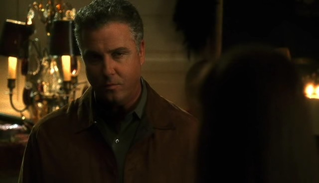
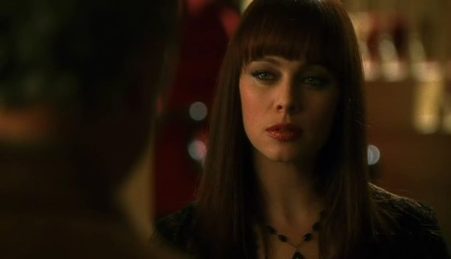
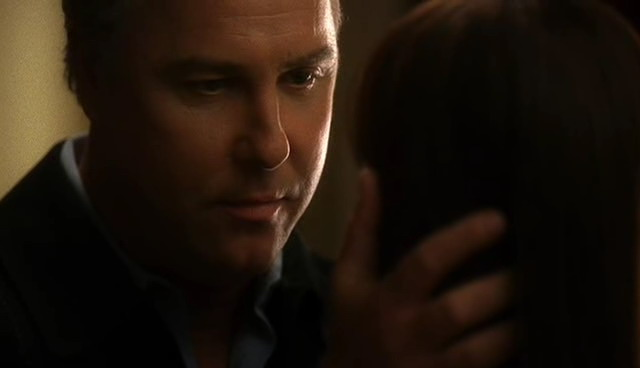
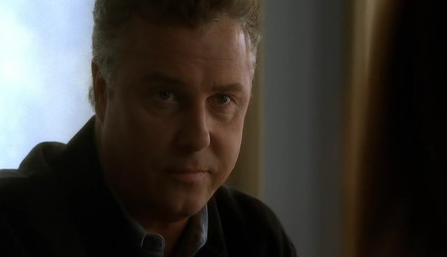

"你知道这事儿么？"

"Nah，" Warrick朝着走进更衣室的Nick说，"她从没跟我透露过一个字。"

"我也是。" Nick摇摇头，"真不敢相信她会瞒着我们！"

"也许她是想...我不知道她怎么想的。" Warrick有点儿泄气地摘下领带。如同他享受Grissom带他们去吃晚餐，他同样迫切的希望脱掉这身西服。

"嗯，她应该开心一点儿。" Nick说着把他的夹克挂进衣柜，"如果Hank能让她开心就好。"

"你知道吗，他之前在一个现场倒是让我给她带好儿来着。" Warrick慢慢说道，"那会儿我没多想，不过..."

Nick大笑起来，"你这样还算调查员？"

"我是犯罪现场调查员。" Warrick分辩道，"我把注意力都放在犯罪证据上了，不是放在我朋友的私生活上。"

"有道理。" Nick咧嘴笑着说，"咱们得去问问她，是吧。她不能这样瞒着我们然后想就这么算了。"

"谁瞒了什么？" Greg边走进更衣室边问。

Nick和Warrick交换了一个眼神。

"Sara。" Nick说，"她和一个EMT交往呢，但她什么也没告诉我们。"

Greg眼睛都瞪圆了，"你们怎么知道的？"

"在法庭上被抖出来的。" Nick说，"Tom Haviland的辩护律师深挖了每个人的私生活。他们利用Sara和Hank的恋情说他挪动证据是她指使的。"

Greg皱了皱眉，"这太愚蠢了。"

"Yeah，我们都这么想。" Warrick同意道。

"不过，他们怎么发现Sara和Hank的？" Greg问，"我的意思是，没人..."

发现Nick和Warrick震惊地看向他，于是Greg的声音越来越小。

"你知道？" 他们异口同声地喊道。

Greg的脸慢慢红起来。"厄，我可能是听说了一些..."

"Greg，我们想知道真相。" Nick说，"你怎么发现Sara和Hank的事的，还有你为啥不告诉我们？"

Greg叹了口气，"我有个EMT的朋友。他跟我说Hank提过他约了Sara出去。我就去问她啊，她承认他们在约会。Sara还要我发誓保密，所以拜托你们别跟她说我跟你们说这事儿了。" 他咧嘴笑了笑，"我不是很确定她说会把我干掉然后埋在没人能找到的地方这话是不是开玩笑诶。"

"现在怎样都无所谓了。" Nick在笑Sara威胁的那些话时Warrick如此说道。他复述了几小时前Sara跟他说的话，"现在所有人的秘密都被摆在台面儿上了。"

"确实。" Nick大笑起来。"你不会相信那个辩护律师还说了什么-"

"她还问了我的赌博问题。" Warrick大声打断了他。

Nick惊讶地看了看Warrick，不过立刻附和他道，"那太刻薄了，在Las Vegas赌博是不犯法的。"

"那样只是让我看起来不可靠。" Warrick说。

"她发现你什么弱点了，Nick？" Greg问道。 

"我粗心大意了。" Nick说，"我忘了在证物照片上贴案件标识。"

Greg在被传呼回DNA实验室的时候叹息着摇了摇头。

"你要知道，在持续工作了好像一百万个小时之后，我有权利歇一会儿的。"

"他们不会放过你的。" Nick咧嘴笑起来。

"好了，我要回我的实验室了。回头见。"

Greg离开后，Nick转向Warrick。

"你刚才为什么打断我？"

"你刚才想要说那女人说Sara和Grissom那段儿来着，是吧？"

Nick点点头，"所以呢？"

"所以，我觉得你不应该说。我觉得这事被散布开来对Sara不公平。"

"某种程度上说已经被散布开了呀，Warrick。Marjorie Wescott已经这么做了。"

Warrick摇了摇头，"这不意味着我们也要重复的去做这事。如果是Sara自己告诉Greg的，那没啥。但是，我不想因为想要逗笑Greg就这样刻薄的对待Sara。"

Nick点点头，觉得尴尬起来，"你说得对。我没想到这点。" 他顿了顿，"等等。Warrick...Grissom知道法庭上发生了什么，对吧？"

Warrick耸了耸肩，"他不知道吧？Sara作证的时候他又不在。"

"那...等等。那他对她...？"

"我很怀疑。" Warrick说，"你知道Grissom的。他对人际交往实在不在行。而且，Sara也没可能公开和他交往。"

Nick慢慢呼了口气，"Oh, man."

"听着，你要是问我的话，我觉得这都是些老皇历了。现在她和Hank在一起，而且看起来她很开心。所以没理由让Griss知道这些。"

"你说得对。" Nick同意道。"没必要让这事再有下文了。"

Warrick点点头说。"除非Grissom要求，Sara绝对不会说出法庭上关于我们的秘密，我们也应该以同样的礼貌对待她。"

*************

Sara这辈子都没因为晚上休息这么高兴过。她和组员一起吃过晚饭后就直接回到家，花了很长时间冲了个澡放松自己。洗过澡后，她没有特意吹干头发；只是将湿漉漉的头发扎成了马尾，然后换上自己最舒服的瑜伽裤和无袖背心。她刚打开电视敲门声就响起来。

轻轻皱了皱眉，她从沙发上爬起来去打开大门。Hank正站在门外，拿着一只玫瑰朝她微笑。

"Hi。" 他轻声说。

"Hi。" 她有点儿茫然地应着，然后把门又拉开了一些说，"进来吧。"

他给了她一个大大的微笑然后走进她的公寓，送上玫瑰，"听说你今天过得很辛苦。"

Sara接到花的时候不由得睁大双眼，"是谁告诉你的？"

"每个人都在谈论Tom Haviland案子的辩护律师如何计划粉碎CSI团队。事情怎么样了？"

Sara叹息着把玫瑰插进花瓶，然后放在她那盆格柏雏菊旁边。"十分恐怖。"

Hank走到她身后，轻轻按摩着她的肩膀问，"想要谈谈么？"

Sara咬了咬嘴唇，她绝对不想告诉他那女人说她和Grissom的那一段。"嗯，我们暴露了。" 她最后说道。

"什么？"

"那个辩护律师说我和你的关系影响到我如何处理现场。"

"这太荒唐了。"

"我知道。" Sara边说，边在他帮她按摩颈部的时候把头往前低了低。"我试着解释了。我想是有效果的-那个电影明星要接受审判了。"

"那就好。" Hank又把手往下移到她的肩膀，"他们有提到名字吗？"

"你是说你的名字吗？ Yes。"

Hank的手指停了一会儿，然后又继续按摩起来，"那，所有人都知道了？"

"Yeah。" 她笑了笑，"我之前都没机会告诉我们组的同事，不过我肯定他们现在会因为我没早点儿告诉他们而非常不开心。"

Hank笑了笑，"我还挺喜欢保持神秘的。"

"我也是。" Sara叹道，"你知道吗，你的手法真好。可以当按摩师啦。"

"我觉得我做EMT已经很开心了。" 他笑了笑说，"你知道吗，你躺下的话会更有效的。"

Sara笑了笑转过身来，抓着他的手说，"嗯，我知道有个好地方。"

Hank笑着跟着她走向卧室。

*************

"下周二你上班吗？" Hank边问边用手指圈弄着Sara落在自己裸肩上的一丝头发。

"Nope。我在想...有个葡萄园我想带你去。你喜欢红酒么？"

"谁不喜欢红酒呢？"

他笑了笑，"想周二去么？"

Sara对他回以微笑，"想去。"

*************

Sara很多年没有去过葡萄园了。在California的时候，她常常造访葡萄园去品酒。Hank惊讶于她对红酒丰富的知识。

"你可以分出这两种的不同？" 他试着尝了尝两种不同的红酒然后问道。

"你分不出？" 她惊讶地问。"这杯有橡木的味道——说明了它的酿期。"

向导朝Sara笑了笑，"说的很对。" 他又看向Hank说，"我想这位小姐可以教你一两件关于红酒的事哦。"

Hank笑了笑说，"她是个犯罪现场调查员。她能注意到细致入微的东西。"

"确实如此。" Sara大笑起来。"给，试试这杯。能尝出味道淡了一些么？"

"可能吧..." Hank不确定地说。

Sara又笑起来。"我有好多能教你的呢。"

她刚拿起另一杯酒呼机就震起来。她低下头看着呼机呻吟起来。

"工作？" Hank问。

"我就不能单独和这男人待一天吗。" 她叹了口气。"Yeah，我得回去了。我们接了桩多重谋杀的案子。"

Hank点点头，"Okay。我送你回家。"

她叹道，"我很抱歉，Hank。你本来都计划得好好的。"

"没关系的。" 他说着捏了捏她的手。"我们今天很开心，不是吗？"

Sara点点头，无奈地笑了笑说，"很遗憾Grissom总是破坏咱们的计划。"

Hank摇了摇头，"我很高兴你是这么能让他器重的优秀CSI呀。"

Sara发自内心的笑起来，"有其他更好的方式可以证明哒。"

"来吧。" Hank说着把她拽起来，"咱们还要花1个多小时回Vegas呢。"

"Oh, well。今天我休息。应该要他等等。"

*************

事实证明，Grissom很不喜欢等待。他几乎刻薄地派Sara单独去处理一桩高校谋杀案。她离开时简直觉得受伤得要死，觉得自己被惩罚了。

"Gil，发生了什么？" 当Catherine终于有时间的时候她如此问道。

"你指什么？" 他问。

"你为什么派Sara单独去办案？"

"我需要其他人都在这儿。" Grissom答道。

Catherine怀疑地摇了摇头。"这不是真话。我们这个案子只要3个CSI就够了。随便派一个人跟Sara一起去都行。你是在为了某些事情惩罚她吗？"

"No。"

Catherine仔细看着他，"你不是...她做了什么？"

"Nothing。" 他顿了顿说，"她被呼叫的时候就应该在这里。"

"Grissom，她今天休息好吗！" Catherine叫到，"是你自己担心她工作过度的！是你让我去劝她的。然后，现在，她休息的时候不再耗在实验室的时候，你又不高兴了。你发什么疯了？"

"Nothing。" Grissom僵硬地说。"我只是...需要我的团队在我需要他们的时候出现。"

"你——你是在生Hank的气，是不是？"Catherine好像明白什么似的问道。

"我为什么要生Hank的气？"

"你不想让她和其他男人交往。" Catherine用如同得到天启的语气说道。

"你说得简直荒唐。" Grissom说着避开她的眼睛。

"No，我是善于观察。" Catherine回击道。她放低声音继续道，"听着，Gil，你不能什么都占着。你一直说她不是你的什么人——她和你的关系止步于同事或朋友。如果这是真的，那很好。非常好。但是，你不能指望她一直单身。要是你不想追她，可以，不过你不能阻止她和别人在一起。"

Grissom垂下眼睛一会儿，然后抬头看向她，"你是对的。我不能控制Sara的私生活。"

"然后...？"

他叹了口气，"你还想让我说什么，Catherine？"

"对Sara好一点儿。" 她说，"咱们有过一次经验了。你该知道不要让她太难过，否则她会辞职的，对吧？"

"Yes。" 他又叹了口气。

"你保证你会表现得友善一些？"

听了她的话他忍不住笑起来说，"我保证。"

*************

Catherine的长篇大论对Grissom起效果了；他表现得友善了很多，如同Sara从前认识的他。Sara暗自松了一口气，知道他不是故意难为自己。她因为他的态度压力山大了一整天呢。

工作又开始变得有趣，Tom Haviland案子的阴霾渐渐远去，Grissom也回复了友好的态度。Sara又开始期待每天与朋友们见面了。

"Sara！咱们得谈谈。"

Sara停住了离开更衣室的脚步。"什么事儿，两位？"

"更衣室还有别人吗？" Nick问。

"No，只有我。怎么了？"

"Come on。" Warrick说着拉着她的胳膊带她回到更衣室里。

"说真的，什么事？" Warrick把她拉回空荡荡的更衣室后Sara问道。

"Sara，你和Hank约会多久了？" Nick叉起两臂问道。

"你们为啥想知道这个？" 她警惕地问。

"我们很担心你。" Warrick说，"我们真不敢相信你竟然没告诉我们你俩谈在恋爱！"

Sara笑起来，"你管自己叫调查员。应该自己猜到嘛。"

"我不觉得你留给我们足够的证据了。" Nick笑了笑，"听着，我们只想确认你过得开心。"

Sara放松下来，给了他们一个微笑，"Yes，我很开心。"

"他对你很好？" Warrick问。

"非常好。"

"所有时候？他没惹你生气过？" Nick问。

"Oh, come on, now, guys。每个人都有生气的时候。"

"有道理。不过，更多时候..."

"Yes。" Sara坚定地说，"我和Hank在一起很快乐，然后他对我非常好。你们开心了？"

Nick笑了笑，"我们替你高兴，darlin'。只要你开心，我们就开心。"

"我们只想确认你和Hank之间一切都好。" Warrick补充道，"因为，要是他做了什么伤害你的事..."

"我们会找他好好谈谈的。" Nick跟着说。

Sara惊讶的看着他们。在她一生中，还没有谁像他俩这样想要保护她的。Nick是对的——她的生活中一直缺少一个"兄长"的角色。虽然她一直取笑他们想要扮演她兄长的角色，但她现在第一次意识到他们已经在扮演这个角色了——而且他们以后也会一直如此。泪水一下子溢满她的双眼。

"啊，Sara，别哭啊。" Nick预想到将要发生的事马上说。

"抱歉。" Sara说着擦了擦眼睛，"你是对的，Nicky——我一直需要有个兄长。"

Nick笑着给了她一个大大的拥抱，"你有一个啦，darlin'。"

"两个。" Warrick说着，也上去拥住她。

Sara笑着尽力忍住眼泪，"你俩真好。"

"你也是啊。" Warrick笑着说。

"你们在这儿啊！"

他们抬起头看到Grissom正站在门口。"Warrick, Sara，你俩跟我来。咱们有个泡沫party要出席。"

Warrick和Sara都挑了挑眉然后对视了一眼。

"还有谁要去？" Warrick问。

"Brass和一具尸体。Come on, let's go。"

*************

"Okay，一个非糖尿病患者身体里为什么有胰岛素？" Warrick咬了一口他的三明治问。

"这正是我们要查的。" Grissom答道。

"有人用装满胰岛素的注射器扎了他？" Sara一边问一边把手上的胡萝卜沾上沙拉酱。

"不完全准确。" Grissom说着啜了一口咖啡，"咱们的凶手用的是高压注射器。"

"Oh，怪异度又提升了一个新等级啊。" Warrick说，"谁会想到这种杀人方法？"

"这也是我们要查的。" Grissom答道。

这时手机铃声打断了他们的谈话。大家都本能的去拿自己的手机，不过Grissom挥手要他们不要找了。

"是我的。" 他说着打开手机，"Grissom。" 他沉默了一会儿说，"等等——Cath，慢点儿说，什么？" 他听着听着瞪大了眼睛，"什么？" 他几乎喊着站起来，"她还好吗？"

"肯定是Linds的事。" Warrick说着担心地看向Sara。

Sara点点头，恐惧慢慢爬上心头。她不知道如果Catherine的宝贝女儿出了什么事她会怎么办。

"Okay. … Okay. … Thank God. … Right. … Okay, 我会尽快派人过去。" 他顿了顿说，"No，Cath, 我不行。你知道的。...一切都会好的，我们之后再说。...好。Bye。"

他合上电话。Warrick和Sara都丢下午餐盯着他看。Grissom深深吸了口气。

"发生了一起意外。"

"Oh, God。" Warrick呻吟着用手捂住脸，"Lindsey？"

"她没事。" Grissom说着，很明显也是松了一口气。"她乘的车子冲出公路掉进了排洪沟。"

"Oh, man。" Warrick说，"就现在的雨量看，那一定成河了。"

"确实。她给Catherine打了电话，谢天谢地，她把她救出来了。不过，显然她被吓坏了。"

"等等。" Sara说，"Lindsey不会是司机。谁开的车？"

"她今天晚上跟着Eddie。" Grissom答道。

"所以，他在哪儿？她是怎么掉进去的，一个人？"

Grissom看了她一会儿，"这是你要去调查的。"

"我？"

"Yes，你。Nick会接下他和Catherine正在办的案子，然后Warrick和我留在这个案子上。"

"你不接Lindsey的案子？" Sara惊讶地问。

Grissom摇了摇头，"Catherine，Lindsey和我认识太多年了。我感情介入太深，做不来这个。Catherine知道，也理解。你来接。"

"你确定你想由我来调查？" Sara淡然地问道。

Grissom点点头，直直地看着她的大眼睛说，"如果她是我女儿，我希望由你来调查。"

*************

在接下来的几天里，Sara不止一次觉得还是办Grissom的泡沫party案要轻松一些。Catherine非常不情愿按她的方式来办案，多次指责她的做法不对。

当Eddie的尸体在事故现场附近被找到后案子变得更加难办。Catherine从恐怖的妈妈变成成恐怖的妈妈+悲伤的前妻。Sara很难理解Catherine所感受到的复杂情感，不过，她还是希望她能在家发泄情绪，远离实验室。

"你会嫉妒的。" Nick走进休息室时笑着说，而Sara正在整理她询问完Lindsey的笔记。

"我能问问为什么吗？" 她笑了笑。

"现在发现那个S女王牵扯到我们的调查里了。" 他说。

Sara翘了翘眉毛。自从她离开那个案子，Nick和Catherine的案子与Warrick、Grissom的案子合并了，也就意味着除了她其他人都有的相同目标。

"S女王？"

"Lady Heather。" Nick说明，"记得吗？去年Grissom, Catherine和我办过一个跟她有关的案子。"

"Oh, yeah。" Sara说着笑起来，"Warrick和我一直觉得我们没能跟你们一起去见识见识那个狂野之地有点儿不公平。"

"嫉妒吧？" Nick调笑道，"你又错失了一次机会。"

"你要去那间房子吗？"

他做了个鬼脸，"我去过一次，不需要再去了。"

"那谁去了？"

"Brass和Grissom。"

"听起来像个party。" Sara说着又回头去看她的笔记。

"真没想到！你上次没能去Lady Heather那里这么失望啊！"

Sara叹了口气，"要不是我太忙了我一定嫉妒。好几个星期，我都想着要是能去看看就好了。"

"嗯，要是你表现好，也许Grissom会把那里的事都给你讲讲。"

Sara大笑起来，"Yeah，说的跟真的似的。"

*************

Grissom和Brass在Lady Heather的门厅等她出现的时候，不自觉的感到有些兴奋。Brass侧目瞧了他两眼。

"她是谋杀案的嫌疑犯。" 他说。

"我知道的, Jim."

"就是提醒你一下。"

尽管自己说知道，当 Lady Heather从她房间走下楼梯时，Grissom还是觉得自己的灵魂都脱离身体飞了出去。她还如同上次见到时一样，那么美丽，那么令人神魂颠倒。她一贯保持着可以和Grissom相媲美的冷漠表情，不过再次见到他，她好像也很愉快。

她解释了2名受害者在她这里的工作内容，然后Brass就陪Grissom一起离开了。开车回去的路上他一直摇头。

"她是谋杀案的嫌疑犯。" 他又说了一遍，"棕色长发——就好像你在第一个被害者旅馆房间发现的那根头发——而且她还和受害者关系密切...Gil，除了这些你不能再想别的了。"

"我知道, Jim。"

Brass瞥了他一眼。"Yeah，你老这么说，但我怎么不信呢。"

Grissom忍不住笑了，"我知道我在干什么。"

"通常来讲，你这么说我很放心，可是这次..."

"我绝不会做任何危害实验室的事。"

"这我相信。" Brass说，"只是怕你忘了。"

*************

几天后，Grissom回到Lady Heather那里去询问她更多问题。这回，他是一个人去的。

一边交谈，她一边带他穿过房间，爬上几节楼梯。他重复了一些以前她跟他讲过的关于支配与顺从的东西，说着，当她在支配地位时，被支配者掌握着所有的权力。他或她，在任何时候，都可以说"stop"。

"非常好，Mr. Grissom。" 她说，惊讶于他记得自己行业的这些事实。

"我只是重复了些我听到的东西。" 他说。

"你是个很好的倾听者。"

他耸了耸肩，"这是我工作的一部分。"

她靠近他，"那，现在是工作？"

"Yes," 他慢慢说，"不过我很看重你的洞察力。"

Lady Heather笑了，"我受宠若惊。不过，看起来你已经得到你问题的答案了。" 她又靠近了些，"当我走远时你会靠近，而当我靠近时，你会看着我的嘴唇。" 她最终在他面前停下脚步，直直地看着他的眼睛，再一次在他身上发挥了她不可思议的阅人能力。"你的听力出现问题了么？"

他低头看着她，嘴唇微微上挑，"我失去了我的平衡。"

"你的自我意识？" 她低语道。

"No，" 他坚定地说，"我知道我是谁。"

"Do you？" 她近乎戏谑又似诱惑地问。 

"Yes，" 他又轻轻笑了笑说，"I do。"

他伸手抚了抚她的脸颊，当她闭起眼睛时，他的手滑落到她的长发。她睁开双眸盯着他的眼，他移动双手捧住她的脸。

"你永远可以说'stop'。" 他低语。

她用充满欲望的双眼看着他答道，"你也可以。"

他摇了摇头，"如果我不想说呢。"

她轻轻笑了笑，"Good。我也不想听。"

他倾身用自己的唇覆上她的，感觉自己所有的感情都奔涌出来，想着自己等待此刻已经一年之久了。他的手从她的脸庞滑落到她的肩膀，然后继续往下，最后滑落到她的腰间。她慢慢抬起手，解开他的外衣，让双手滑进他的衣服里。

Grissom的唇终于离开了她的，然后沿着她的下颌一路吻到她的脖颈。她将头倾向一侧，并用一只手的手指纠缠住他的头发。他稍稍后退了些，然后深深凝视着她的眼睛。

"你在说'stop'？" 她问。

"No。" 他低语，声音低沉而沙哑。

她笑着牵起他的手，"来吧。"

她带他沿着走廊来到她的卧室，从身后关上了房门。他脱下外衣，把它挂在靠近门口的椅子上。

"我们要来展现你的幻想么？" 她低声说。

他笑了笑，"在生活的这部分，我从没有过什么幻想。"

"现在来做吧。" 她说着紧紧贴近他，"一定有些我可以帮你放纵的幻想。"

他摇了摇头，"No。"

她笑了笑，手指飞快地解开了他衬衫的纽扣，"好吧，那，我可以告诉你我的幻想么？"

"只要你开心。"

她笑着贴近他的耳边轻声道，"自从我们第一次见面，我就想把你拐上床了。"

看到Grissom瞪大眼睛她又笑起来。

"没想到？"

"我从没想过我自己会成为别人的幻想。" 他承认。

"你该想到。" 她说，"我知道我肯定不是唯一一个。"

他笑着又倾身去亲吻了她，"我们来让你梦想成真好么？"

她笑着说，"Yes。"

*************

Grissom从来没试过一夜情。他讨厌第二天早上从别人床上醒来的那种难为情的感觉。女朋友的床已经够让他觉得难受了；如果是陌生人的，他简直不敢想象。所以，当第二天早上他从Lady Heather的床上醒来时，他立刻觉得局促不安起来。

她已经起来了，穿着浴袍，一边用毛巾擦着头发一边走回卧室。她看到他后轻轻笑了笑。

"早上好。" 她说。

"早上好。" 他答道。

她在他那一侧的床边坐下来，"你睡好了么？"

"Yes," 他说，"你呢？"

"非常好。" 她说着，用手指抚摸着他的头发。"如果你想要冲个澡，浴室就在旁边。"

"Yes, thank you," 他说道。

当他从床上爬起来时感觉自己异常的暴露。即使经过了前一晚发生的那些事，他仍然讨厌被她看到自己赤身裸体地走过房间。她好像察觉到了他的窘迫，于是转过身去。

"你梳洗好了我们到楼下喝茶吧。" 她说。

他笑了笑，"那样太好了。"

*************

开始的时候一切安好。直到Grissom提出帮Lady Heather加糖时气氛变得紧张起来。

Grissom一下子定住了，问道，"Type 1？"

"嗯。" 她轻轻点了点头说。

"用注射器？" Grissom问。

"以前用注射器。" 她说，"现在换成高压注射器了。

Grissom听她这么说一下子思绪奔涌，有种天旋地转的感觉。

"最近换的？" 他问。

"几周前。" 她说，"Oh，那真是种神奇的工具；你想要看看么？"

Grissom看了她一会儿，感觉这辈子都没如此看错过一个人。"Yes，我要看看。" 他说。

她点了点头。

"不过，我恐怕需要搜查证了。"

这次轮到Lady Heather震惊地看着Grissom给Brass打电话，要求搜查证来查看她的医疗用具。她不可置信地抬头看着他。

"我想我刚刚听到你说'stop'了。" 她轻声说。

Grissom低头看着她说，"Yes。我说了。"

*************

"你去哪儿？" Catherine看到Brass匆匆穿过走廊时问道。

"Lady Heather那里。"

Catherine不禁笑起来，"公事还是兴趣？"

Brass翻了个白眼，"Grissom刚打电话来，说需要她医疗用具的搜查证。显然，这位女士患有糖尿病。"

"Grissom跟你一起去？"

Brass挑了挑眉，"Grissom已经在那儿了。"

Catherine听了的下巴都快掉下来了，"他——什吗？"

Brass耸了耸肩，"我只是告诉了你我知道的信息。"

"他为什么在那儿？"

Brass又挑了挑眉，"这我可没有明确答案。"

Catherine看了看表，"这...Jim，他怎么知道她有糖尿病的？"

"我知道的都已经告诉你了。" Brass说，"不过，现在看来在咱们的凶杀案调查里，Lady Heather的嫌疑度很高。"

Catherine忍不住大笑起来，"Oh, man。可怜的Grissom。这简直是他喵的耻辱。"

*************

最后，Lady Heather和那两个男人的死无关。是她的一个雇员用她的胰岛素和高压注射器杀的人。

即使如此，Grissom也知道他对Lady Heather的迷恋结束了。她也许是无辜的，但在这起恶劣的犯罪中他如此轻易就将她看做嫌犯已经说明了一切——对他俩来说这都是结束。这整个经历让他感到...十分难过。

他穿过实验室，想着也许自己可以做些案子回顾的工作，然后他发现Sara正独自一人坐在休息室里。她盯着放在腿上的双手，看起来非常痛苦。于是他往屋里探了探头。

"你还好么？"

她耸了耸肩，"Catherine对我不太满意。"

Grissom走进屋子在她对面坐下来。他看着她，默默地要她继续说下去。

"我必须结案了。" 她说，"我从我的嫌犯身上找不到真相，而且我也没有凶器串起整个事件。他们看起来都像是有罪的。" 她叹了口气用手捂住脸，"我希望我能做得更好。"

Grissom看了她一会儿说，"Sara，你尽自己最大努力了么？"

她抬头看着他说，"当然。"

"那你还有什么能做的么？"

她摇摇头，"No。"

"那么，就是这样了。" 他干脆地说，"有时候，我们找不到答案。所以我们有一些悬案。"

"我想是这样吧。"

"听着。" Grissom说，"你不必为此难道沮丧。你尽力了。Catherine会原谅你的。她知道你没有什么能做的了，即使她现在不承认这点。"

"希望你是对的。"

"我认识她很多年了。我说的没错。" 他顿了顿，"Sara，我坚持我之前的观点。如果她是我的女儿，我会希望由你来查案。"

她终于笑了，"Thanks, Grissom。你这么说这对我很重要。"

他也回以微笑，"I trust you。"
