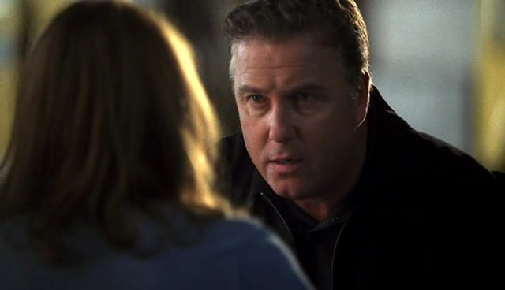
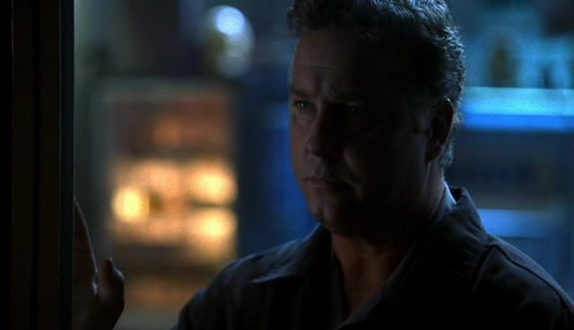

最后，Sara团队里的男性同胞并没有做出什么伤害Hank的事。他们决定再不给他好脸色看，基本不再和他讲话、给他一个黑暗又危险的眼神、并且注意不让Sara单独前往仍有医护人员工作的犯罪现场。他们不想再让Sara单独和他处在一个空间了。

Sara当然知道他们为自己做了什么，对此她非常感激。并不是说她需要他们的保护；她知道自己可以处理好和Hank之前的感情。她感激的是他们给予自己的友谊。她知道要是没有她的朋友和工作，自己大概是挨不过这段日子的吧。

工作再次成了她的庇护所，帮她埋葬这段被伤害及背叛的感情。即使Catherine跟她说了这不是她的错，说她不可能知道Hank还有其他女友，但在Sara内心深处，她始终认为身为一个调查员，她应该察觉到的。她应该知道！所以，她埋头于工作，想着如果她能成为一个更优秀的CSI，那这种事就不会再重演了。

所以，她努力工作。这份工作每天都让她在实验室里充满干劲儿，而伙伴更让她每天都情绪高涨。她等不及要和Warrick开开玩笑，戏弄一下Nick，和Greg一起开怀，与Catherine聊聊天，同Grissom说说话。她等不及去见她的朋友们。

越是与他们在一起，她越是喜欢他们。她喜欢Warrick的幽默感，喜欢Nick完全柏拉图式的调情，喜欢Greg的自由奔放，喜欢Catherine给出的建议，还有Grissom的...她喜欢Grissom的大部分特性。

她感觉自己仿佛回到了过去。好像自己又回到了读硕士的时候，体验着每次去听他的课都心花怒放的感觉。她被他迷住了。一直都是，以后也会是。她只希望自己掩饰得够好，不让任何人知道。

*************

Sara步履蹒跚精疲力竭地回到公寓。她上了个连班，现在只希望自己倒头就睡一直到明天上班再起来。不过显然有人不想如她所愿；她刚把手机放下它就响起来。她只好一边呻吟一边把手伸向电话。

"Grissom，我真的干不动了。" 她拿着电话喃喃自语起来。她看也没看来电显示就接起电话，"Sidle。"

"Hey, sweetheart."

在听到好友声音的一瞬，Sara立刻精神起来，"Mary!"

Mary咯咯笑起来，"你本来以为是谁来着？"

"Grissom，如果你非要问的话。" 她说，"我怕他再叫我回去工作。我刚工作了16个小时这才回家呢。"

"Oh, Sara。你想睡一会儿吗？我们可以之后再聊。"

"No，我宁愿跟你说说话。" Sara说着蜷坐在沙发上，"你怎么样？"

"挺好哒。" Mary说，"你呢，sweetie？"

Sara叹了口气，"好多了，我想。"

"你听起来有点儿犹豫啊。"

"我...嗯，我有点儿困惑。"

"困惑？"

"Yeah，我是说，我正从Hank这整件事中恢复过来。我只是...我觉得自己是个笨蛋，而我不太习惯这种感觉。"

"Sara，你不可能知道的。"

"Catherine也这么说。她说当她丈夫背叛她的时候她也不知道。所以，我猜...也许她是对的。"

"她当然是对的。"

"只是我很难接受这点，你懂么？" Sara说，"我不喜欢别人可以像这样愚弄我的感觉。"

"我们都有不顺利的时候。" Mary说，"不过，你说现在感觉好多了？"

"Yeah。我想开了，如果Catherine都可能被骗，那任何人都可能。" 然后Sara顿了顿，不确定自己是否想继续说下去。

"Sara，你在拖延时间诶。" Mary说，"你说了半天这些是因为有些事你想告诉我，但同时又害怕承认，害怕向自己承认。所以，快说吧，你脑子里在想些什么？"

"更多是在心里想的。" Sara叹了口气。

"总给我挖小坑儿。" Mary咯咯笑起来，"说吧说吧，姑娘。"

"我想我迷上Grissom了。"

Mary呼了口气，"这算新闻？"

"友善点儿。" Sara说，"别让我挂你电话。"

"你不会哒。" Mary说，"我是知道你所有秘密的人。你要是不告诉我，你也不会告诉别人哒...另外你明显是想说的。所以，说吧。"

"就是...感觉我好像回到了学校。你懂的。"

"对。" Mary说，"他睿智，年长，是你的启蒙者，老师，他还很帅，很不可思议...我记的。"

Sara叹道，"坦白说，Mary，每次他看我，我都心跳加速诶。"

"彻底沦陷了哈。" Mary笑起来。

"彻底不能好好工作。"

"听着，我觉得你应该主动出击。" Mary说，"约他出去。"

"啥？" Sara叫起来。

"约他。" Mary鼓励她，"你喜欢他，他喜欢你——"

"对这点我们并不确定。" Sara打断她。

"Okay，yes，我们确定。" Mary说，"那天他带你出去喝咖啡，在San Francisco他让你带他出去吃饭，他指名要你去调查他的组员，他邀请你搬到Las Vegas正式到他的实验室工作，他加班验证你的理论，他给你送花，他告诉你你很美丽，你俩为广播争论时根本像夫妻吵架，你和Hank约个会他基本就怒了，成了'We Hate Hank'俱乐部成员...Sara，他肯定喜欢你。"

"你真这么觉得？" 她没底气地问道，即使她自己听起来也是如此。

"怕你不知道，我现在正在翻你白眼呢。" Mary说。

Sara笑起来，"Okay，你说的有道理。"

"所以，约他出去。还能有什么更坏的结果？"

"我可能因为性骚扰我的上司而被开除。"

"我很肯定在他们直接开除你之前会先让你参加类似性骚扰治疗小组之类的。" Mary有些低声下气地说，"我说真的，Sara，至少考虑一下。"

"Okay。" Sara保证道，"我会考虑的。"

*************

然后她真的有考虑。接下来的一周她基本没想别的。每次看到他——因为他们一起办了几个案子，所以见他还挺频繁的——她总是想起此事。情况几乎变得危险起来。看到他的手她会想象自己的手指与他的手指缠绕的感觉。看到他的脸颊她会想起那摸起来是什么样子。看到他的头发她会想伸手碰触。看到他的嘴唇她会想倾身亲吻。

简而言之，她现在就像个青春期的少女。她讨厌这种感觉。

现在只有一件事可做。Mary是对的。她需要和他谈谈这事。

她需要约他出去。

*************

Grissom坐在办公桌前，盯着他最近案子的犯罪现场照片，但并没有真的看着它们。他现在满脑子想的都是自己的耳朵又一次罢工了的事实。

他能看到人们匆忙走过自己的办公室，他也知道他们在谈话，但他听不见。他听不见实验室里通常运作着的机器的声响，也听不见自己桌上电脑的嗡嗡声。他眨眨眼，疯狂的希望这能帮助自己找回听力。

"Grissom？"

听到声音他松了口气，抬起头来。Catherine又一次正站在他的办公桌前。而他又一次没听到她走进屋子的声音。

Damn it.

"Hi, Catherine."

"你还好吗？" 她问。

"很好。" 他说， "坐下来。咱们需要谈谈。"

"关于什么？" 她边问边坐在他对面。

"Greg。"

"他怎么了？"

Grissom摘下眼镜放到桌上，"他跟我说他想出外勤。"

"他想做CSI？" Catherine惊讶地问。

"他是这么说的。"

"他有想过...?"

"他想了很多。" Grissom说，"我没肯定地回复他 。我想先跟你谈谈。"

Catherine轻轻笑了笑，而Grissom知道自己找她商量是一个正确的选择。

"你觉得他做得到吗？" 她问。

"我认为他非常努力。" Grissom说，"我想他的态度是正确的。他能顺利融入到组里。"

"我能感觉到这儿还有个'but'。" Catherine说。

Grissom叹了口气，"他对工作的认真程度达不到我要求的CSI那样。"

"我想他对他的工作很认真。" Catherine说，"我知道他表现得比其他人更...风趣，但我不认为这等同于他工作不如我们认真。"

Catherine继续说着，但Grissom有一部分内容没有听见。他的耳朵又罢工了。他把精力集中到她的嘴唇，试图跟上她的发言。

"...我觉得值得给他一次机会。"

随着听力的恢复，Grissom悄悄叹了口气。"Okay，" 他说，"我们可以给他个机会。如果他不能胜任外勤的工作，就让他回到实验室里。无得无失。"

Catherine点点头，"谁来训练他？"

Grissom笑了笑。他几乎能看到"别找我！"已经出现在Catherine眼里了。"我觉得我们可以来个团队合作。"

"团队合作？" 她有些意外地重复道。

"Yeah。Brass总让你和我训练新人，通常都行得通，但是...我不知道该怎么说。我不想让某个人觉得他或她要为Greg的每件事情负责。他已经具备了很多知识，我们只需要帮他掌握些新的技能。我想我们可以一起来完成这点，你觉得呢？"

"当然同意。" Catherine说，显然为不用负责Greg松了一口气。"你想让他什么时候开始？"

"我们让他从一些小的，室内任务开始吧。" Grissom说，"不过要等到我们找到新的DNA技术员来代替他。"

"说得对。" Catherine同意道。边说她边抓起开始震动的呼机，并从椅子上站起身来，"嗯，说曹操曹操到。看来Mr. Sanders需要我去DNA实验室了。"

"玩儿的开心。" Grissom笑着说。

Catherine也笑了笑然后离开了他的办公室。

她走后，Grissom靠回自己的座椅。是时候认真考虑一下手术了。看来耳朵不会自己变好了。

他需要给他的医生打电话并预定一下手术时间。尽快。

*************

Sara在做出她的重大决定之后的几天一直处于精神混乱状态。她知道自己想要约会Grissom，但身为他下属可能引起的潜在后果给了她很大压力——更别提万一被拒绝的恐惧了。最后，她终于决定必须要试一下。快刀斩乱麻——就像撕掉创口贴一样，她这么告诉自己。她只需要等待下一个机会。

下一个机会来的比她预期的还要快些；她正坐在休息室里吃她的花生酱三明治时，看到他走过了过道。她看着他和一个实验室技术员谈着什么，于是站起身来。感觉自己好像间谍一样，她跟着他穿行在过道里，等待着他先和Greg，后来又和Nick、Archie谈话。终于他从前台那里拿了给自己的留言条后回到了自己的办公室。想着现在是自己的最好机会了，Sara吞了口口水，并为自己将要做的事做好心理准备。

结果另一个技术员走进了他的办公室去找他谈话。Sara叹了口气，知道已经错失了时机。谁知道他们要谈多久呢？想着自己得等待下一个机会了，她转身往休息室走去。

她路过实验室，看到Greg正皱着眉。她考虑着进去打声招呼的时候突然觉得地板晃动，火焰从她的右边的屋子喷出，把她冲倒在地。DNA实验室爆炸了。

Sara趴在过道中央时勉强知道周围发生了什么。她把头从散落遍地的玻璃碴、化学制品和其他杂物中抬起来，看到Greg趴在离她几码远的地方。看到他挣扎着移动的身影，恐惧顿时充满心头。可惜她还没力气爬起来。

在她周围，人们尖叫着、跑动着、忙着扑灭火焰。Grissom冲进走廊，看到Greg几乎是无意识地倒在地上时马上停下来，跪在他身旁。

"你还好吗？" 他问，并小心让自己不要碰到他。"Greg，能听到我说话吗？"

Greg意识不清地嘟囔了些什么。

"这儿需要医护人员！" Grissom大喊起来，并试图让自己保持冷静。

"医护人员。" Sara喃喃自语，"No。"

她不会让Hank看到自己这个样子的。她不会让他碰自己的，即使只是把自己放到担架上。这想法驱使她爬起来。

她不是很清楚自己是如何来到外面的。她好像只是迷迷糊糊地跟着周围的人。来到停车场，她看到这里也是一片混乱的人群。实验室的工作人员、医护人员、消防员和其他救援人员混杂在一起。不想混入人群，Sara默默来到路旁。

她歪着头想了一会儿，然后朝地上看了看。马路牙离她很近，看起来就像在跟她招手似的。于是她坐下来，茫然地盯着前方。她的手受伤了，不过还不足以让她担心。把手无意识地蜷放在大腿上，她觉得自己还好，但Greg...Greg在哪里？

一台担架车从楼里推出来，周围跟着几位医护人员还有Grissom。Sara看不到是谁躺在上面，但直觉告诉她那就是Greg。看到他被送进救护车，她觉得这算是一个好的征兆。起码不是验尸官的车子。

她又看回自己面前的路面。好像有一百万个想法同时在脑袋里奔涌。过了一会儿，她意识到其实现在她连自己在哪里都搞不清楚。

Grissom出现在她面前，关心地看着她。Grissom。如果Grissom蹲在自己面前，那就说明她还在实验室。

"你还好吗？" 他问道。

"嗯-" 她说着轻轻点点头。一瞬间，所有事情都闪现在脑中。实验室爆炸了。到处都是碎片。她被冲倒在过道里，跌倒在一堆玻璃上。

Grissom看着她，打量了一下她的身体，注意到她放在腿上的手。他抓起她的手，看着她手掌边缘的伤口说，"Honey，这看起来可不怎么好。"

"没关系的。" Sara说。她朝他身后看了一会儿，又看向他，"清理现场比较重要。我们应该开始了。"

"你需要缝合伤口。" Grissom温柔地说。

Sara摇摇头，有些混乱地看着他，坚持说道。"I'm okay。"

"可以请你帮忙处理一下她的手么？" Grissom向最近的一位医护人员问道。

"当然。" 那人答道。

Grissom抓着Sara的两只手帮她站起来。直到医护人员带她离开他身边的时候她还在摇头。Grissom一直拉着她的手，直到医护人员带Sara去缝伤口两人才把手松开。

"你还好吗，小姐？" 他问她。

"真的，我很好。" 她答道。

这个男人在帮她缝合手上伤口的时候同情地看着她说，"有人可以送你回家吗？"

"我还没下班呢。" 她说。

"Oh，相信我。" 他笑了笑，"你已经下班了。"

"我送她回家。"

Sara的目光落在正站在自己旁边的这个高个儿男人身上，"Nick。" 她打招呼道。

他笑了笑，"Hey, darlin'。你这是把自己怎么了？"

"Grissom说我需要缝合伤口。"

"嗯，看来Grissom在这点上是对的。让这位先生帮你缝合，然后我送你回家。"

"我想帮忙清理现场。"

Nick笑了，"别担心这些。实验室没事儿的。现在需要你先休息好，然后把我们的案子结了。没有你，Grissom和我搞不定的。"

Sara麻木地点点头说，"Okay。我回家去。"

"Good。" Nick看着Sara的手被包扎好后说，"我会好好照顾你的。"

*************

Nick确实有好好照顾Sara。他开车送她回家并陪她进屋。当她在卧室换睡衣的时候，他在她的橱柜里找了杯子，帮她拿了布洛芬。她一从卧室出来，他就把2片药和一杯水送了过去。

"你需要休息。" 他说。

Sara吞下药片并把水喝光。"我累了，Nicky。"

"Okay, sweetheart，我送你到床上去。" 他说着拉起她没受伤的那只手带她回到卧室。"还好么？现在觉得怎么样？"

"很累。" 她又说了一遍，然后爬上床。

"你知道自己现在在哪儿么？有没有头晕或者感觉迷糊？"

Sara翻了个白眼说，"我现在好多了，Greg怎么样了？" 

"他们说他烧伤比较严重，不过他应该还好。" Nick说着帮她掖好被子。他暗暗松了口气；如果她现在能想起问Greg，就说明她确实好多了。"我们很快就去看他。"

"他要在医院待一段时间了是么？"

"看起来是。" Nick说。他环视了她的房间一会儿，然后注意到她的手机。他把它拿过来放到她的床头柜上。"听着，Sara，我要回去工作了，不过如果你有什么需要——任何事——记得打电话给我。我整晚都开机的。"

Sara点点头然后缩进被子里。"Thank you, Nicky。" 在记忆深处，她记得在Hank手腕骨折后跟他说过一些类似的话。最后她说，"我会没事的。"

Nick笑了笑，把她的头发拨到耳后说，"我知道你会好起来的。你很坚强。"

她握了握他的手，朝他笑了笑说，"我想这让我们成为好朋友了。"

"你是指？"

"嗯，现在你见过我最脆弱的样子了。"

Nick咧嘴笑了笑，"Okay，那么，我们是好朋友了。"

"Good。" Sara说着打了个哈欠，"你是最好最好的朋友，Nicky。"

"你也是, Sara。"

*************

Sara醒来时她的手机已经响了一会儿。她迷迷糊糊的摸索到它，虚弱地接起电话。

"Hello？"

"Sara？你还好么？"

Sara眨眨眼睛道，"Grissom？"

"Yes," 他说，"你怎么样？"

"我...很好，我想。"

"你的手怎么样了？"

"没事了。" 说实话，手还在一阵阵发痛。显然布洛芬的药效已经过了。挂了电话之后她得赶快再吃几片。

"你确定？"

Sara笑了笑。他这么问就好像他知道自己在想什么一样。"是有点儿疼。" 她承认道，"不过，我保证很快就没事了。"

"听着，Sara，我想让你休息一周。我会帮你算带薪病假的。"

"Grissom，别这样。我很好！我只要睡一下就能恢复了。我明天就能去上班。"

"No，Sara，我希望你能在家休息。" Grissom坚持说。

"不要休整周吧。" Sara央求道。她觉得她受不了整个星期都不去工作，不能见她的朋友们...看不见他...她觉得自己马上就要哭出来了。

Grissom叹了口气，"我能说服你休息多久？"

"我根本不想就休息。"

"你需要一些时间休整，" 他说，"我不想你再伤害到自己。"

"听着，我会休息一天的。" 她说，"我明天会乖乖休息一整天，然后后天回去上班。"

"这样你休息不够呀。" Grissom主张道。"我不想你这样透支你的健康，Sara！"

"我没有透支我的健康。" 她也坚持道。

"Sara，你太重要了，我们不想失去你。" 他说。

"Grissom –"

Sara显然还在说着什么，但Grissom一个字也听不见了。他一下子慌起来。以前还从没有过在讲电话的时候失去听力。当他再次能听到声音时，她正在重复着他的名字，显然她以为他挂了她的电话。

"我在。" 他说。

"你听到我说的了么？我要么休息一天要么不休。"

"好吧。" 他说，他害怕这次谈话再过度拖延下去。"但是，要是你敢明天就来实验室，我会把你赶回去的。"

Sara咧嘴笑了笑，"不会的。我保证。"

"另外，Sara，答应我放轻松。" 他柔声说道，"我不希望你发生什么事。"

"我保证。" 她又说了一遍。

"Good。" Grissom说。"听着，如果你有任何需要，给我打电话。我整晚开机。如果你需要我，我会立刻去你那里的。"

他温柔的声音让她的神经放松下来。她感觉到一滴泪水滑下脸庞。

"Thanks, Griss。" 她轻声答道。

"You're welcome。" 他笑了笑，始终保持着温柔的语调，"那么，后天见啦。"

"好的。" 她顿了顿说，"那，那再见了。"

"Sara？"

她停下合上电话的动作问，"Yes？"

Grissom犹豫了一会儿，我很庆幸你没和Greg一起躺在医院里。我很庆幸你没事。我希望现在能陪在你身边。结果他只是说，"照顾好自己。"

她笑了笑说，"我会的。"

"Good night, Sara."

"Good night, Grissom."

*************

她与Grissom这次深夜谈话足以说服她Mary是对的。Grissom关心她的程度肯定是超出了同事的层级。这让她更加确定要跟他表白，要试着跟他开展一段恋情。她知道他们在一起会十分融洽的。他们只需要一个机会。

她终于在某天下班回家前找到了和他谈话的机会；在她准备离开时已经连续工作16个小时了。她，Grissom和Nick刚结了他们的案子，然后她扫了一眼排班表发现今晚她和Grissom都休息。走近他办公室的时候她能感到自己的心脏砰砰地跳着。

他正坐在他的办公桌上，翻着名片盒。她依靠在他办公室的门框上，希望这样能抑制住自己打颤的双腿。这辈子她还没有因为要问某人某件事而如此紧张过。

"你...有时间么？" 她问。

Grissom抬头看向她的同时，从名片盒里拿了一张名片出来。"我正要下班呢。"

"Yeah，我看到排班表写了你今晚休息。" Sara说。

"确实。" 他答道。

"我也休息。" Sara轻声说，有点儿期望他会提起共进晚餐的建议，这样她就不用问了。

"你应该休几天带薪假期。" Grissom说，他还在为她说服自己同意她这么快回来工作感到有些生气。

"我很好。" Sara笑着坚持道。

他们谈了几句案子的话题。Grissom把文件装进公文包，显然在宣称今天的工作结束了。他朝门口走过来，但在意识到她挡住了门口而停下脚步。她深吸了口气，觉得要是现在不问就永远问不出口了。

"你愿意和我一起吃晚餐么？"

在回答她问题之前的几秒钟里，千万思绪和情感涌进Grissom心头。但他回答得就好像这个建议根本不该被提起一般。"No。"

"Why not？" 她问道，脸上保持着微笑。"让我们...一起吃个晚餐。看看会发生什么。"

"Sara..." 他慢慢说道。但他甚至不知道该跟她说什么。最后，他决定诚实以对。"我不知道该如何处理这些。" 他用手指在两人之间来回比划了一下，好像在说明"这些"指的是他们之间的关系。

Sara灰心至极地说，"我知道。" 她顿了顿，加强了些语气继续道，"你知道吗，等你想明白了，也许就晚了。"

她从他的门口消失了，留下他一个人困惑地站在那里。

*************

走出实验室的时候，Sara觉得自己的心碎了。她在第一滴眼泪流下来之前走到她的车子。想着明天她要怎么回去工作？还有后天？还有大后天？以后自己要如何面对他？

*************

Grissom叹了口气看着她离开了。他多想叫她回来，告诉她自己改变主意了，但是他不能。有太多荒唐的原因让他不能和她共进晚餐。第一，当然的，他是她的上司。他并不搞什么办公室政治，但他知道如果自己和自己的下属约会会遭到质疑。

他又叹了口气，知道这并不是真正的原因。只要他想，他知道他们可以搞定这些的。真正的原因是他害怕。

她是那么的年轻、聪慧、美丽，那么生机盎然。她充满激情，斗志昂扬...她了解他，懂他，她想和自己在一起。他知道自己会一下子爱上她。而他被自己这个想法吓坏了。他害怕为了和她一起构筑新生活而放弃自己多年来为自己建立的一切。

他把这个真正的原因埋藏在了心底。低头看着从名片盒中找到的名片，他拨通了准备帮他做听力修复手术医生的电话。他需要联系她，定好手术时间。他怎么能让Sara等他处理一个可能要困扰他下半生的问题？他怎么能要求这个年轻、充满活力又美丽的女孩子给一个老头儿当女友？

他做出了正确的决定。他很肯定。
