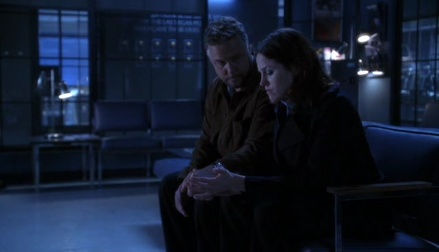

"Hello?"

Sara叹了口气，讲电话的声音中不免带着些失望的情绪。"Hi, Tom。我是Sara。How are you？"

"Sara!" 他开心的叫道，"How are you，sweetheart？"

"我...Mary在么？"

"Yeah。" Tom答道，声音中明显透着关心。"你还好么，Sara？"

"我还好。" Sara说，"我想和Mary说说话。"

"没问题。她来了。"

闷闷的声音传进她的耳朵。Sara知道Tom在转交电话时用手盖住了话筒。过了一会儿，电话那头儿传来好友的声音。

"Sara？发生什么事了？"

Sara一下子哭出来。

"Oh, Sara。" Mayr惊讶于好友如此崩溃的状态。"Please, sweetie，告诉我发生了什么。"

"Everything。" Sara抽泣道。

"你得说得再具体些。"

Sara一边哭又一边笑出声来。"你就不能让我伤心一下吗？"

"不行，除非你冷静下来告诉我你为什么伤心。"

Sara深吸了一口气，试着控制住自己的情绪。"我们办了一件奇怪的案子。"

"Okay …" Mary慢慢应道。Sara已经很长时间没有过因为案子而失控的情况了。

"受害者...她在自己的淋浴间被杀害了。" 她停下来喘了口气。"她看起来就像我，Mar。"

"她和你特别像？"

"Yeah。实际上是惊人的像。Grissom一直不让我看她的尸体。要不是Catherine，我估计我根本见不到她。她要我帮忙去验尸房取她的脚趾纹来着。" 她又顿了顿，"那就好像我看着我自己躺在太平间。"

"Oh, Sara。看到她那样一定非常可怕。"

"那感觉真的，真的很怪。" Sara承认。

"面对自己的死亡一定很难。" Mary说。

"面对...no，Mar，我不是因为那个..."

"告诉我。" Mary柔声鼓励她。

Sara深吸了口气。"Grissom...好像已经着魔了。这案子他好像连续查了26个小时。我从没见过他这样。他不离开那女孩儿的家，不吃东西...只让Catherine进房间去帮他。他要我待在实验室。"

"那一定很令人沮丧。"

"Yeah。" 她同意道。"直到我看到Debbie...她叫Debbie...然后我才明白。他是故意调开我的。"

"他很贴心。"

"他想要为我破了这个案子。" Sara坦率地说。"不是为了Debbie...真正意义上。是为了我。他看到一个那么像我的人被割了喉然后彻底吓到了。"

Mary慢慢呼了口气。"你在说什么，Sara？你觉得他爱上你了？"

"No。" Sara慢慢说道，"但是他可能会。而且他知道这点。他说了..."

Mary掩饰不住声音中的震惊问道，"他告诉你他会爱上你？

"No。他...我需要点儿时间解释，否则你没法理解事情的全部。

"Okay。" Mary相当困惑地答道。

Sara深吸了口气继续说道，"Grissom审问了嫌犯。干这事的人——他是Debbie做护士那家医院的医生。他们在一起工作。他和Grissom年纪差不多。他...他们约会过一段时间。但是，Debbie和他分手了又和其他医生交往，一个年轻的医生。他受不了这些，所以把两个人都杀了。"

Mary颤抖了一下。"Sara..."

"我们没有足够的证据给他定罪。但是，我们都知道发生了什么。他只是不承认。" 她又停顿了一下。"我在观察室看着他们审问。不过没人知道我在那里。"

"Okay …"

"Griss...他跟那个男人承认了很多事情。"

"这是什么意思？"

"他..." Sara哽咽了一下，努力忍住不让眼泪流下。"Grissom跟Dr. Lurie说他知道发生了什么，因为他们是一样的。他们都是和自己事业结了婚的中年男人。他们都有机会获得爱情..." Sara说着说着声音越来越小，然后再次哽咽。

"和像你一样的女孩儿。" Mary柔声帮她补充道。

"Yeah。然后他...Grissom说他做不到。说他不能冒着失去一切的风险让自己爱上我。" 她终于放弃挣扎而让泪水滑落脸颊。"为什么，Mary？为什么他觉得我不值得他冒险？"

"Sara，别这么说。" Mary说，自她从丈夫手中接过电话这是她声调中第一次显露出严厉的语气。"你值得的。"

"对谁值得呢？" Sara含泪问道，"不是Hank。他没有为了我和女友分手。不是二年级那个Jason。他劈腿了，记得吗？不是一年级的Evan。他和我分手了因为不想被'束缚'。承认吧，Mary。男人都不想要我。"

"傻瓜才不想要你，Sara。而且你也不想要他们，所以现在不许这么想了。"

"Grissom不是傻瓜。" 她小声说。

Mary叹了口气，觉得这其实是个仁者见仁的问题。

"他不是。" Sara坚持道，她知道现在Mary脑子里正在想什么。

"Sara，他耍了你好几年了。" Mary说，觉得自己终于可以说出这个自Sara搬去Vegas起就有的想法了。"你还不明白么？他做了些让你觉得他对你有好感的事，然后又退开让你一次次心碎。"

"他没有——"

"他有。要是他没有，你现在就不会打这通电话，跟我哭诉说他告诉什么杀人犯他不会赌上...不管是啥了...和你在一起。"

Sara眼泪流得更快了，"我要怎么去面对他？我怎么回去工作？"

"别回去了。" Mary简洁地说，"你是个很棒的CSI，Sara。去新实验室找份新工作。"

"No。" Sara用谈话开始以来最强硬的语气反驳着，"我不会被他吓跑的。我爱我的工作。我喜欢Catherine和其他人。我喜欢这座城市。我不会离开这里只因为..."

"Okay，那么，" Mary说，对于她能这么看待自己曲折的爱情之路也觉得松了口气。"你只需要洗个热水澡，喝杯红酒，好好睡一觉然后回去准备解决更多罪案就好啦。"

Sara自嘲地笑了笑，"我能喝两杯么？"

Mary咧嘴笑起来，"酒鬼。"

"Maybe。" Sara叹气道，"Thank you, Mary。"

Mary难过地笑了笑，"我只希望现在能陪你喝。"

Sara听了又流下泪来。"我也想。"

"你没事了吗？"

"会好的。" Sara说着抬手擦了擦还在掉落的眼泪。

"Okay。" Mary用显然仍然十分关切的语调说着，"你明天下班后再给我打电话，okay？"

"我会的。"

"好的。"

"Mary?"

"Yeah?"

"I love you."

Mary笑了笑，"I love you, too."

*************

Sara听从了Mary的建议。她洗了个热水澡，喝了杯红酒然后倒在床上。她并不惊讶自己一直睡不着。以前也有过这种情况，不过躺在温暖的毯子里面已经挺满足了。

第二天，她要走进实验室，准备去面对生活丢给她的一切难题。包括Grissom。

*************

直到见到他。

痛苦，迷失，悲伤，喜悦，遗憾，希望...当她在走廊里撞见Grisosm的时候，千百种情绪瞬间涌出来。她深吸了口气，试图在走近他之前控制好自己。

他走近她的时候笑了笑。虽然近距离地看到他的笑容，她却没办法做出什么回应。在大厅里对上他的眼，她立即脸红起来。不过即使他注意到了，也没说出口。尽管她心中盘旋着各种情绪，她还是很开心能看到他的笑容。至少她还能把他当个绅士对待。

"Hello, Sara。" 他笑道。

"Hi。" 她应着，并期待自己的声音听起来还正常。

"我派你和Warrick出现场。" 他说着，给了她一个内疚、又有些抱歉地微笑。"流浪汉在树林里发现了一个失踪的旅行者。他在哪儿大概有一周了。"

Sara皱了皱脸说， "Thanks, Griss."

他又笑了笑。"带上Greg吧。我觉得这对他来说是个不错的经验。"

Sara忍不住笑出来，终于挣脱了那份让自己心情沉重的忧郁感。有时候，Grissom像Carl像得让她有点儿害怕。不过这会儿，她相当感激这个能让她想起自己第一个CSI上司的相似点。"好吧。我们带上Greg。"

*************

"那么，确切来说我们要去哪儿？" Greg有点儿紧张地问，并不停调整着他那刚领到的外勤马甲。

"到森林里。" Warrick答道。他朝Sara咧了咧嘴，"不害怕吧？"

Greg翻了个白眼说。"No。"

"Oh。" Sara咧嘴笑起来。"你是想告诉我们你是户外运动爱好者吗？"

"我希望你们知道我参加过很多次室外象棋比赛的。" Greg说。

Sara和Warrick听了大笑起来。

"快告诉我你在开玩笑。" Warrick说。

"No。" Greg咧嘴笑道，"你可别嫉妒。"

"我尽量哈。" Warrick说。

"Hi."

听见打招呼的声音，他们一同转头看向右手边，注意到护林员正在等他们。

"Hi。" Sara回应道。

"你们是CSI吗？"

"Yes。" 她回答，"我是Sara Sidle，这是Warrick Brown，另外这是Greg Sanders。"

那人点点头说，"Derek Parker。你们的尸体在那边呢。"

他们看了看他手指的方向然后朝那边走过去。

"警察为什么没在这里？" Greg问。

"咱们还不确定这是犯罪现场。" Warrick答道，"所以还没什么他们能做的。" 他停下脚步，低头看着溪岸边那具倒在湍急的水流旁的腐尸说，"Oh, man。看来我们找到咱们的旅行者啦。"

Sara咳嗽了两声，"Yeah，看来是。"

Greg在看到尸体模样的时候眼睛都快掉出来了，"他身上发生了什么？"

"很多因素造成的。" Warrick严肃地说。

Greg重重咽了口口水，"你们希望我做些什么？"

"帮我寻找靠近或远离尸体的证据。" Sara立刻说。

Warrick眼神犀利地看着她说，"你确定不想处理一下他眼睛里的Mr. Worms？"

"Oh, no。" 她咧嘴笑起来，"我想我们可以把他留给你。"

*************

他们的旅行者案一波三折，花了一周多的时间才解决。但Sara觉得很庆幸。因为这意味着她的大部分时间都花在出外勤和审问疑犯上，也就等于基本不会见到Grissom。

不过，好事也有结束的时候，在发现这个旅行者的同伴该对此事负责时，案子终将解决。Sara在这案子的最后一次轮班结束后叹息着回到家。她希望明天她能被安排和Warrick, Nick, Catherine处理新案子...总之不要和Grissom一起。

她走进公寓，把包包和钥匙扔到椅子上。知道自己现在还很兴奋根本睡不着，于是到冰箱里拿了一瓶啤酒。坐进沙发后她开始边喝啤酒边打开电视换台。

在她正边喝第三瓶啤酒边看地方新闻的时候手机响起来。她接起电话，看到Grissom的名字显示在屏幕上时不由得呻吟起来。

"Sidle。"

"Sara，我真的很抱歉。" 他打招呼道，"你还没睡，是吧？"

"No。" 她很诚实地回答。

"Good。" 听起来好像松了口气。"我需要你来查件案子。一个大赌场的老板和他老婆今天早上在他家的豪华车道上被枪杀了。" 

Sara咕哝了一下，"好吧。地址是什么？"

他把地址告诉她，并很高兴她愿意去工作。"只是想告诉你一下，我叫了所有人。我不是只想折腾你一个人的。"

Sara悲伤地笑了笑。不幸的是，她好像是被他折腾得最惨的一个。"Thanks。我们一会儿见。"

"Thank you。" Grissom答道，"不着急——他俩不会去其他地方的。"

Sara笑了笑保证道，"我一会儿就到。" 

"那一会儿见。" Grissom说，"Bye。"

"Bye。"

*************

Sara合上电话，看着手里的半瓶酒叹了口气。她知道自己没喝醉，不过她还是得掩盖一下嘴里的酒味。

结果，她最多能做到的只有刷了5次牙和在现场不停地吃止咳糖。这天她基本都和Nick、Brass在一起。Nick，这个通常只看别人优点、并尽量回避世界阴暗面的好孩子，显然天真地没有在意为什么Sara一整天都含着止咳糖。最多只是对她没有分享精神这点表示不开心。

不过，Brass就另当别论了。他立刻就明白了Sare吃止咳糖的目的。他自己已经有过要和酒精抗争的经历了，所以十分害怕Sara也在做同样的事。他用了他能想象得到的最温和的方式跟她面对面的谈了这事，告诉她借酒消愁什么的解决不了任何问题，而只会让问题越来越多。尽管她很感激他的关心，不过她还是希望他相信自己并没有酗酒。他眼中的失望让Sara暗自发誓以后再也不在上班前喝酒了——即使是在她开始轮班的好几个小时之前。

*************

结果是Nick获得了晋升的机会。

几乎是。

就在时间久得让Sara快要忘了申请过Key CSI职位的时候，她知道了结果。直到有一天她来到更衣室，发现Nick正在看给他的提名确认书她才又想起了这一切。

她觉得胃袋像是被打了个洞，不过还是强颜欢笑地祝福了她的朋友。Nick笑了笑，明白她现在强烈的失落感。

"这已经不重要了。" 他说，"职位被取消了。"

他接着说这是因为预算的问题，这部分经费被用在其他地方了。而Sara则强迫自己集中精力，回应了些Greg一定兴奋于这些资金用于买实验室新设备之类的话。

Sara觉得，直到Nick离开屋子前说他很荣幸被提名为止，自己表现得都不错。实际上她镇静的外表已经岌岌可危，内心里急切的想知道自己落选的原因。

*************

很自然的，Mary随后接到了某人发脾气的电话。Sara现在很乐于看到两地之间有3小时的时差；她下班时东海岸的时间也并不算太早了。她在下班路上给Mary打了电话。

"Hello?"

"Nick得到晋升资格了。" Sara开门见山地说。

"Oh, no。" Mary说，"I'm sorry。"

"好吧，他也并不算真的得到了。"

"Okay，现在你把我搞晕了。"

Sara深吸了口气，期待自己能理性的叙述这一切。"那个职位被取消了。他们决定把钱花在给Greg买新的实验设备上。不过，Nick得到了提名。而不是我。"

"I'm sorry。" Mary再次说道，"我知道你很想得到它的。"

"Yeah，显然，那就是我得不到的原因。"

"啥？"

"我问Grissom为什么他选了Nick而不是我。他说这跟我们过去纠结的过去没什么关系。是因为Nick不在乎是否得到这个职位。"

"这根本说不通吧。"

"就是啊！" Sara喊道。"搞什么鬼？为什么不把它给真正想要的那个人？给那个在意它的人？" 那个在乎你的人。

"我猜我们在大学里学的那些是真的。"

"什么？" Sara心烦意乱地问，想着Mary的结论也许能解释通为什么Grissom决定会选Nick。

"天才都缺乏常识。" Mary笑了笑又说，"你还记得那个哲学课教授吗？"

Sara忍不住笑起来，"Oh，他的衣服！"

"咱们当时可是很乐于看到助教因为各种原因来代课呢。" Mary大笑道。

"并不是因为他长得帅。" Sara咧嘴笑了笑。"Man，Mar，我很抱歉。每次给你打电话我都各种不冷静。"

"别为此道歉。" Mary说，"朋友就是为此而存在的。帮你恢复平静。"

"都不知道要是没有你我可怎么办。" Sara叹道。

"你会好好的。" Mary说，"你很坚强。足够坚强到真诚祝贺Nick。"

"Yeah，你说得对。" Sara说，"我是大人了。"

"正确的选择。"

*************

"Hey, Sara，想和我、Nicky出去喝一杯么？"

Sara把一目光从衣柜上抬起就看到Warrick正满怀希望地朝她微笑，"Sure。今天是什么日子？"

"就是喝酒。" 他咧嘴笑了笑。

Sara笑道，"走吧！"

和平常一样，他们最后又来到附近那家他们最喜欢的酒吧。尽管算不上每个人都能认识的常客，不过他们进门时还是收到了一些微笑。他们找了张桌子坐下并点了啤酒。

"所以，今晚没有热辣的约会吗？" Sara轻啜了一口啤酒调笑道。

"跟你热辣约会呢呀。"Nick伸手把手臂搭在她的椅背上反驳道。

Sara大笑，"Warrick你呢？"

"他是电灯泡。" Nick马上接到。"他和我们是同病相怜，找不到对象约会。"

"我有很多人约的，thank you。" Warrick说着瞥了一眼Nick，"可不像某些人。"

Sara大笑，"I'm sorry。我不该取笑你们。说得好像我自己是交际花似的。" 她又笑了笑说，"说真的，和你们在一起我很开心。"

"Well，我们也很高兴你能来。" Nick笑了笑。

"必须的。" Warrick说，"咱们仨好几个星期没一起出来了。"

"那样可不好。" Nick说，"咱们应该定个喝酒日。"

"Yeah，我们可以看一下排班表。" Sara笑道，"先定个一周一次吧。然后让它成为一个传统。"

"好主意。" Warrick同意。

"算我一个。" Nick说。"咱们要邀请其他人吗？"

"也许叫上Greg。" Sara歪着头想了想，"他是聚会的最佳人选。"

"他确实是。" Warrick同意，"我觉得他是真心想当CSI的。"

"很适合他。" Nick笑了笑，"他会在现场找到乐趣的。"

"只要Grissom不再管着他，" Sara边笑边说，"他就能更自由地发表言论了。"

"他知道在Griss面前该说什么，对吧。" Warrick问。

"我不知道..."

"他说什么了？" Nick问。

Warrick咧嘴笑起来，"你懂的。那些Greg风格的话。"

Nick耸了耸肩。"如果Grissom能处理好实验室的事，那他也能做好现场的工作。"

"希望如此。" Sara说，"要不然，可怜的Greg就永远别想通过他的最终测试了。"

*************

他们在酒吧坐了几个小时，喝酒、谈笑、聊天。Sara喜欢跟他们在一起的每一分钟。她花了那么多时间和Mary讲电话，却差点儿忘了有这么棒的朋友在自己身边，在Vegas。

最后他们离开酒吧，朝他们的车子走去。Warrick建议先去吃点儿东西，但是Sara和Nick都说不要了。在工作了那么久又在外面玩儿了这么长时间之后，Sara觉得很疲倦了。她现在只想回家爬上床好好睡一觉。

Warrick和他们分手后走向自己的车子，而Sara拽住Nick的胳膊。

"Hey, hey, Nick, 恭喜你差点儿就升职了。" 她说，"真的，你应得的。"

Nick朝她咧嘴笑了笑，"Wow，听你这么说真难得啊，是不是？"

Sara笑着假意推了他一把。"Yeah，是啊。" 她承认。

直到他们分开、各自准备开车回去时Nick还是笑呵呵的。

Sara爬上车子启动引擎。她看着车里点起来的照明，希望自己现在已经到家躺在床上了。她叹了口气打开收音机，把音量调到了最大。期待高声响着的音乐能让她在开回家的路上保持头脑清醒。

还没到家，她就从后视镜中看到了警灯闪烁的光芒。不过她最先怀疑的是警察要送她去犯罪现场。她靠边停下，想着为什么Grissom没有打电话通知她。

一位警官走过来——面熟但叫不出名字——敲了敲她的车窗。于是她把车窗摇下来。

"需要我出现场吗？" 她问。

他皱着眉困惑了一会儿，然后认出了她。"你是个CSI吧？"

"Sara Sidle。" 她答道，"Grissom让你来找我的？"

"Um … no …"

"那是什么事？" 她不解地问。

"你...你的车行驶有些不正常。" 他的话音中饱含了歉意。"我得看一下你的驾驶证和身份认证，然后麻烦你下车。"

仍然没搞清状况，Sara交出证件然后从车上下来。"行驶不正常？" 她问。

他仔细看了她几眼问道，"你喝酒了么，Ms. Sidle？"

"喝了一点儿。" 她承认，意识到是怎么回事后，她瞪大眼睛说。"我没有喝醉。我可以开车，我也没有想要酒驾！我只是工作了太久、有些累了..."

"我得让你测一下酒精指数。" 他说。

她尴尬得有些脸红，然后做了酒精测试。警官看着测试结果露出一副非常遗憾的表情。

"你超过了一点标准值。" 他轻轻地说。

"什么？" Sara叫起来。"这怎么可能？我只喝了一点儿啤酒！好几个小时以前！"

"你有吃东西吗？"

她听到这话简直想给自己一巴掌。"No。"

"也许你该吃一点儿。" 他皱了皱脸，"听着，你的测试结果是.09而标准刚刚降成.08。几周前的话这样还OK。我不能让你开车了。不会记录的。只是得把你带回警局...不过，我必须通知你的上司。"

Sara的脸更红了。"你得通知Grissom？" 她用几乎是耳语的声音说道。

"很抱歉。" 那警官说道，"我希望还有其他办法。不过，除非留下正式记录，而且..."

"No，这样就好。" 她快速说道，"Thank you, officer。"

他遗憾地笑了笑，"You're welcome。"

*************

Sara坐在警局的等候室时觉得好像已经过了一辈子那么久。那位抓到她的警官让她坐自己的车子来到PD。到了之后，他让她在等候室里等自己通知Grissom。之后他回来过一次，告诉她Grissom会来接她。

在等他的时候，Sara觉得自己已经羞愧地死了千百回一般。她没想到自己能做出这等傻事。为什么Warrick建议去吃东西的时候她不跟去呢？为什么不叫辆出租车呢？自己太累了不应该开车的。她知道"行驶不正常"更多时候是疲劳驾驶造成的。

当Grissom出现时，好像已经过了好几年似的。他走进等候室坐到Sara身旁。她知道是他来了，但是没有转头看他。她没法面对他。

他伸手握住她的，轻轻捏了捏好像在告诉她自己在这里。她回握了他的手，并极力抑制着自己心头小鹿乱撞的感觉。告诉自己这与男女之情无关，不要会错意。

"来吧，" 他温柔地说，"我送你回家。"

回Sara公寓的一路上他们都没怎么开口。她还没准备好告诉他到底发生了什么。他也好像明白一样，没强迫她说什么。两人只对公寓的位置做了些有限的交流。

Grissom把车停在路边然后关掉了引擎。然后有点儿担心地看着Sara。

"跟我进来吧。" 她叹了口气，"我知道我们得谈谈。"

他点了点头，然后两人都下了车。

Grissom跟着Sara来到她位于三层的公寓。她打开门走进屋，知道他会跟进来。如她所想，他跟着她走进屋并好好关上了门。他看着她径直穿过她那小小的房间最后走到客厅的窗边。窗外是个小公园，不过，这会儿是一片漆黑，她其实什么也看不见。

"你会解雇我的，是吧？" 她头也不回的问。

"你不告诉我发生了什么么？" Grissom用自己的问题代替了回答。

Sara叹了口气。"我太累了。我喝太多了然后还想自己开车回家。我很蠢。"

"我想还有些其他的。" Grissom温柔的说着走到她身后。

Sara又叹了口气，"我下班后和Nick还有Warrick出去了。我们有时候会这样。"

Grissom点点头，"我知道。"

"我们去了实验室附近的酒吧——你知道的，我们常去的那家。离开时Warrick建议去吃点儿东西，但是Nick和我都想赶快回家。所以，我们回到停车场，然后就分手了。"

听到Warrick和Nick没有送Sara上车，Grissom竟然有一种奇怪的愤怒感。

"我想我其实可能是醉了吧。" 她承认，"但是，我太累了...我没想到是酒精让我有那种感觉得。我只是...想要回家。就这些。我想回家洗个澡然后睡觉。我觉得我能开车，我真的这么觉得。"

Grissom叹了口气，"Sara …"

"我知道这很蠢。" 她说着，终于转身面向他。"你不用提醒我这个。然后，现在，我失业了，是不是？"

Grissom摇了摇头，"No。"

Sara挑了挑眉。

"要是你真被留了记录，我确实就没别的选择了。" 他慢慢地说，"你知道这些，对不对。你实际是警局的雇员。"

她点点头。

"因为他们没有留记录，所以你的工作我说了算。"

她又挑了挑眉问，"然后呢？你打算怎么办？"

"你会用掉你攒的三周假期。" Grissom说，"你要去参加PEAP辅导。等你回来工作时也要听从顾问的意见。"

她点点头，并注意到他并没有真正责备自己。他看起来...好像很担心自己。他看起来好像想要帮助自己。她直直地看进他那双湛蓝的眼睛，并被其中的温柔所震撼了。那温柔让她几乎想要哭出来。没法面对他，于是她移开视线，盯着他肩膀上的一个点，希望泪水能悄悄褪去。

他看着她，知道她正在努力控制着自己的情绪。他曾见过她因为案子而哭泣——然后，他提醒自己，还有在Berkley说再见的时候——但都不是这种情况。他从没见过她这一面。在某种程度上，他觉得这是件好事。看着她在自己面前慢慢土崩瓦解，他忽然觉得她完全不同了。她不再是那个不断学习的学生——为了给自己惊喜——也不是那个要燃尽自身为受害者申诉的CSI。她在自己面前打开了内心，她剥离了那自我防卫的层层高墙。她很脆弱。她需要有人能让她倚靠，需要有人来保护她。而忽然间，他希望成为那个人。他想要成为她的后盾。他想要成为那个她可以诉说痛苦的对象。他想要成为那个照顾她的人。

"我还要再加个条件。"

她终于强迫自己再次看向他。"好。你说吧。"

他顿了顿然后舔了舔嘴唇。"从今以后你得记得要跟我谈谈。如果有什么问题你解决不了，你得让我帮你。"

她难过地笑了笑。"你是我boss，Grissom。你没必要解决我的问题。"

他摇了摇头并轻抚了她的脸颊。"我是你的朋友，Sara。我在成为你上司很久之前就是你的朋友了，而且我永远是你的朋友。"

她忍不住闭上双眼轻轻抵着他的手，想着最近他是个多么糟糕的朋友。但是，就此刻而言，她愿意接受他的帮助。

"在某种程度上，这是我的错。" 他轻轻说道。

她睁开眼问，"什么？你为什么会这么说？"

他难过地笑了笑，"我总让你加强社交活动，在工作之外找点儿乐趣。"

她朝他苦笑，"你没让我去酒驾，Griss。"

"No。" 他承认。"不过，说真的，听说你、Nick和Warrick成了这么好的朋友我很高兴。作为一个上司，我很乐于看到我的组员关系这么好。"

"作为一个上司？" 她带着些许的失望重复道。

他咬了咬嘴唇。 "Sara …"

"抱歉。" 她说，"我不该那么说。我知道我们是什么关系。你说得很清楚了。"

对她的用词他想要大叫。她当然是对的。几年前是他拒绝了她，即使最开始是他先邀请她来Vegas的。"我这个朋友做得不够格，Sara。" 他慢慢地说，"但是，如果你愿意再给我一次机会，我想要做出改变。"

消化了一下他话里的意思，她露出一个真心又坦率的笑容，"我当然会给你机会。"

他突然觉得轻松许多。就好像她给了他新的生活。"Thank you。" 他说着不禁傻笑起来。

她笑着拉起他的手警告道，"别浪费掉。"

"No。" 他说，"我不会再那样做了。" 他温柔地握了握她的手， 感觉自己正使劲压抑着想要吻她脸颊的冲动，"我应该让你睡一会儿。你说你很累了。"

Sara想要反驳，但也知道自己确实无力招待客人了，"是的。" 她只好承认。

他点点头。"嗯，你有很多时间可以睡觉了。你的休假立即生效。"

"就怕你这么说。" 她叹道。

"我想你需要些时间。" 他又摸了摸她的脸颊。"Sara...照顾好你自己。"

"我会的。" 她保证道。

"Good。那我们三周之后见。"

她点点头，假笑了一下，想知道自己要如何熬过三周不工作——不见他。

Sara陪他走到门口。他打开门然后看着她。

"Good luck。" 他简洁说道。

"Thanks。" 她回答。

他笑了笑， "Good night, Sara."

"Good night, Griss." 她顿了顿继续道，"Thank you. 为了这一切。"

他温柔的笑了笑，明白她的意思。"You're welcome."

他走出她家，静静地深吸了口气。他离开Sara太多次了。课余喝完咖啡后。Berkley的研讨会结束后。在San Francisco与她共度的美好夜晚后。解决案子之后。勘察现场之后。从Greg那里拿到DNA结果之后，分配完任务之后。下班之后。和组里的人一起出去喝酒或者吃早饭之后。

但是，不知怎的，这些或大或小的分别，没有一次能和这次所带来的冲击相比。这次他好像不只是在与Sara说晚安。他是在和一种思维道别。

他是在与自己以前的生活方式道别。

*************

Sara送走他关上了门，也闭上了自己的双眼。她深吸了口再次睁开眼睛，然后穿过房间坐进沙发里。

经过了他在她公寓里的短暂时光，她知道她与Grissom之间有什么东西改变了。他们的关系彻底改变了，而且，不知怎地，她知道在今晚之后，再也不会回到从前了。

第一次，她知道，她真真正正地知道，他们会相处很好。

【END】