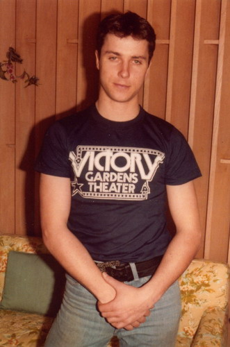
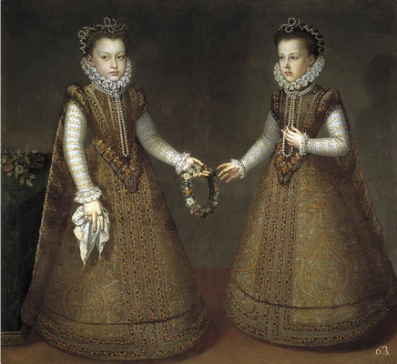

原作信息

作者：Chelles

[原贴地址](https://www.fanfiction.net/s/3781233/1/And-They-Lived-Happily)

"Okay，好了。" Laura Sidle在女儿头上系好粉色的缎带后说，"转过来让Mommy看看。"

Sara Sidle依言转过身，满怀希望地朝母亲笑了笑。Laura也给了她一个大大的微笑。

"你真漂亮，我的小公主。" 她说着，又抚了抚Sara穿的裙子。"我们去让Daddy看看你有多漂亮好不好？"

Sara点点头然后拉住母亲伸过来的手。她们离开她的卧室往客厅走去，Malcolm Sidle正在那里看着电视上播的早间新闻。

"快看我，Daddy！" Sara一边走进房间一边喊。

他把视线从电视上转过来，落到他的小女儿身上，朝她笑了笑。

"你怎么这么漂亮呀。" 他笑着说，"你要帮Mommy去给家里挑选新图片对不对？"

Sara尽她5岁孩童所能翻了翻眼珠，抑扬顿挫地说。"是绘画，Daddy。"

Malcolm好脾气地笑起来。"说得对。Daddy的小天才总是知道用哪个词准确。" 他笑着看了看自己的妻子，"Sara比咱们两个都聪明，Laura。"

Laura也笑了笑，希望他说的是对的。"我们会在明天准备晚饭前赶回来。" 她保证道。

"不用着急。" 他笑了笑说，"去Venice可是很远的。"

Laura的笑容有些动摇。她知道如果明天回来太晚赶不上准备晚餐的话，后果会很严重。"我们会按时回来的。" 她说。

他摇了摇头。"我只是不敢相信你要跑那么远只为了去找些艺术品。"

"大家都说那家画廊非常棒。"

他点点头。"他们是这么说的。" 他把目光从妻子转向他的女儿。"出门的时候你要照顾好Mommy，okay？" 他笑着亲了亲Sara的脸颊说。

"我会的。" Sara郑重地答道。

"好姑娘。" 他直起腰又亲了亲他的妻子。"我们明天见。"

Laura点点头然后拉起Sara的手说，"走吧，我的小公主。"

她们走到车子边上，然后Laura把Sara抱进车里。她瞥了一眼后座上的行李箱，第一千次想着自己为什么不就这么开车离开。为什么不呢？为什么还要回到这里呢？为什么还要回到他身边呢？

然后，她转身看着他向副驾驶的座位倾下身子，在Sara小小的脸颊上又落下一吻。看着Sara因为他的话咯咯笑着，Laura觉得喉咙一阵酸痛。

她不能分开他们。Sara爱她的父亲，而他也非常为被他称为"小天才"的女儿骄傲。而且，他也爱Laura，如自己爱他一样。他是有些坏脾气，但很多男人也有。也不是那么难以接受。他们会没事的。

*************

"我们到了么？" Sara第十次这么问道。

"就快了，sweetie。" Laura答道，"小睡一会儿怎么样？等你醒了咱们就到啦。那样会觉得时间过得比较快。"

"我不累。" Sara说着打了个大大的哈欠。

Laura看了看她笑道，"闭上眼睛数到50，我的小公主。"

Sara马上听话的闭上眼睛。她喜欢数字游戏。她把脑袋靠在座位上，闭着眼睛大声数起数来。如Laura所料，还没数到30她就睡着了。

Sara醒来时她们正好开到了Venice。她朝窗外看了一会儿，转头看向她的母亲。

"我们在哪儿？"

"我们到Venice啦，baby。" Laura说着看了眼表。"饿不饿？到午饭时间啦。"

"Yes." Sara说。

Laura朝街上看了看，寻找着餐馆，"麦当劳怎么样？"

"Yay!" Sara高兴得叫起来，"我能吃个冰激凌吗？"

Laura笑起来，"Okay。但是，你得先把午饭吃完。"

Sara使劲点点头说，"Okay。"

*************

吃完她们的午饭和冰激凌蛋卷后，她们往画廊走去。当她母亲打开画廊的大门时Sara瞪大眼睛看向周围。

"什么都不能碰哦，Sara。" Laura在进到这幢大楼时告诫着Sara。

"我不会的。" Sara保证道。

一位眨着亮蓝双眼、留着棕色卷发的年轻男人从屋子后方的柜台后面走出来。他微笑着迎接了她们。

"需要帮忙吗？"

译者:我们脑补一下年轻时候的某人走出来的接待客人~（容我先擦个鼻血…）

"我们在为卧室和餐厅寻找一些装饰画作。" Laura笑着说。

他点点头。"您对主题有什么特别的喜好么...?"

"Mommy，快看这个！" Sara叫着打断了他的问题。

"Sara，别人讲话的时候不可以插嘴！" Laura批评道，"到我身边来。"

Sara乖乖地走到母亲身旁，但一双大眼睛只一个劲儿往回盯着看她的发现。年轻人朝她笑了笑。

"你叫Sara吗？" 他问。

Sara抬起头用那双棕色的大眼睛看着他然后害羞地点了点头。他看着她笑容又加深了些。

"我叫Gil。我愿意帮你和你妈妈找你们想要的画作。你有看到喜欢的画吗？"

Sara点点头。

"可以指给我看看吗？"

她又点点头，然后抬头看看母亲。Laura点头同意后，Sara率先往前走去，她母亲帮她绑的粉色蝴蝶结在她那头黑发上欢快地跳着。Laura和Gil都跟在她身后。 

"这里。" Sara说着指向一幅挂在一般小女孩儿很难注意到的高墙上的作品。

"Ah，" Gil笑了笑，"那是一幅Sánchez Coello的复制作品。"

"那些女孩子是谁？" 她指着画上肩并肩站着的两个小女孩儿，她们每人捧着花环的一边。

译者：应该是这幅吧…不知道Sara喜欢这幅画哪一点…不觉得很阴暗吗！

"她们是公主。" Gil解释道，"分别叫Isabel Clara Eugenia和Catalina Micaela。"

Sara的眼睛一下瞪得老大，"她们是公主？"

"Yes."

"真实的，生活中的公主？"

Gil笑着说，"她们是的。"

"她们生活在哪里？"

"她们生活在西班牙。" 他解释，"你知道那是哪里吗？"

"在欧洲。" 她答道。

他挑了挑眉说，"非常棒。你真是个聪明的小姑娘。"

"Daddy说我是天才。"

他朝她咧嘴笑了笑，"我相信你是的。"

"你知道她们更多的故事么？" Sara指着画里的公主问道。

"嗯，这是Isabel Clara Eugenia，" Gil说，"她是她父亲最喜欢的一个。"

Sara看向另一个女孩儿时脸沉下来，"那，她呢？她的daddy也爱她吗？"

"我肯定也爱的。" Gil说，并立刻后悔告诉了她那部分信息。

"他是国王吗？"

"Yes, 他是的。"

"Wow。" Sara说着又朝画作看去。"她们遇到来拯救她们的王子了吗？"

Gil轻轻皱了皱眉眉而Laura笑起来。

"Sara和我看了很多童话故事。" 她解释道。"她喜欢听王子拯救公主的故事。"

"Ah。" Gil说着看回Laura。他并不惊讶自己在和Sara讲话时几乎忘了她的存在。小孩子总有种魔力能吸引自己的注意力。"嗯，这么说这幅画是不错的选择，如果你们想要买下的话。我刚才说了，这是原作的一幅复制品...我相信原作还保存在Madrid的Museo del Prado呢。"

"Madrid是西班牙的首都。" Sara突然说道，热切地向这个亲切的年轻人卖弄着自己的学问。

"是的。" Gil笑了笑。"你父亲说的对，Sara —— 你是个小天才。"

她听了咯咯笑起来。

Gil又看向Laura。"如果你们感兴趣的话..."

Laura轻轻摇了摇头，"我不知道...我们只想找些San Francisco海景或风景的画..."

"Oh, please, Mommy？" Sara再次拉起她母亲的手，央求道。"Please，我们不能买下公主的画吗？" 她回头看着那画作，眼睛盯着那个年纪小一点儿的公主看。"我想让Catalina Micaela知道有人爱她多一点。"

Gil看到Laura慢慢融化在她女儿充满希望的表情里。

"好吧。" 她说，"Daddy说我们可以买3幅画，你去再找2幅大海的画好不好？"

"Okay。" Sara兴高采烈地说着，跑去看画廊里的其他作品了。

"我很抱歉。" Gil说，"要是知道变成这样，我是不会告诉她这么多背景故事的..."

"没关系的。" Laura笑了笑说，"我敢肯定就算她不知道她们公主的身份也会缠着我买这幅画的。" 她注意到他身上穿着UCLA的T恤便问道，"你是学美术史的么？你知道很多有关画的知识。"

"No，实际上我是学昆虫学的。" 他说，"这是我母亲的画廊；暑假期间我帮她照看的。她去寻找新艺术家的时候我会在这儿工作。"

"你真孝顺。"

他耸了耸肩说，"她为了我付出了很多，这只是我能回报她的一些小事。"

"Mommy! 我找到了一幅！"

Laura笑了，"指给我看看，我的小公主。"

2小时后，Laura和Sara决定了要买下的3幅画。准备离开的时候Sara显得神采奕奕；她十分兴奋自己得到了那幅公主的画作。她母亲在信用卡收据上签字时，Gil朝她笑了笑。

"你会照顾好两位公主的，是不是？"

Sara郑重地点了点头，"谢谢你告诉我她们的故事。"

他看起来十分惊讶于她如此懂礼貌，"不客气。也谢谢你给了她们一个温暖的家。"

"谢谢你今天的帮忙，Gil。" Laura说，"请转告你的母亲说她养育了一个优秀的儿子。"

他有点儿脸红地笑了笑，"Thanks, Mrs. Sidle。"

他送她们走到车子，帮忙拿着有点儿重量的画作。在他帮忙把画放进车子后座时，Laura把Sara抱进副驾驶席并帮她绑好了安全带。Sara转头看着他把画都固定好。

"Bye, Gil。" 她开心地说。

"Bye, Sara。" 他笑了笑。

Laura再次对他表示感谢后，坐进驾驶席。Gil看着她们渐渐开远，想着Sara Sidle真是个可爱的女孩子。他希望如果将来自己有了女儿能像Sara一样可爱。

*************

"今天店里有客人吗？" 晚餐后，Mrs. Grissom问道。

"有位从San Francisco来的女士。" 他答道。"你的店享有盛誉呢，Mom。她开了好几个小时的车来的。"

Mrs. Grissom笑了笑。"可是，她买下什么了么？"

"3幅画。"

她听了睁大眼睛，"这么多！"

"她们在为卧室和餐厅寻找装饰画。" 他微笑着回忆说，"她的小女儿缠着她买下了另一幅。"

"她多大了？"

"那个小姑娘？大概5岁吧。"

"真可爱。"

"Yeah, 很可爱。"

她摇了摇头。"你哄小孩很拿手的，Gil。你应该去当老师。"

他笑了笑。他们以前为此争论过。"我不想照顾一整班的小朋友，Mom。再说，我喜欢昆虫。"

她又摇了摇头。"你和你的昆虫。你再不多花点儿时间和人交流的话就要变成隐士啦。"

"我花了很多时间和人交流呀。我今天和Sara还有她的妈妈说了很多。"

"Sara？那个小姑娘的名字？"

"Yes."

"是个好听的名字。"

他笑了笑。"她是个很可爱的小姑娘。" 他顿了顿又说，"今天你找到什么值得展出的画作了么？"

"Yes, 找到了。"

他的母亲开始讲述自己发现了一位有才华的新人画家。当她问及他的一天时，Gil又想起了小Sara的事。

到他再次想起这天下午在画廊发生的事情时，那是几十年以后的事情了。

*************

Laura把车子停进车道时Sara还在熟睡着。她停好车时，Malcolm走出来笑着迎接了她们。Laura下了车而他则打开了Sara那边的车门。

"看来你把她累坏了。" 他说着把Sara抱出车子。

"她一小时前睡着的。" Laura说，"我来抱她吧。你把画拿进去好吗？"

"好的。"

Laura接过熟睡着的女儿把她抱进屋子。她把她放到床上躺好并为她盖好毯子。等她回到楼下时，Malcolm已经拆好了画作的包装。

"你觉得这些画怎么样？" 她问。

他朝她皱了皱眉。"我以为咱们说好了要买本地画家画的本地风景画。"

"我知道。" Laura说着抱歉地笑了笑。"第三幅画是Sánchez Coello的一幅复制画。Sara想要的。"

"Sara … Laura，这太荒唐了！有没有搞错，我们只是要装饰餐厅和卧室，不是五星级酒店！我们TMD要把这种东西放哪儿？"

"我不知道。" 她说着并试图保持冷静，"要是你能看见Sara当时的表情..."

"别拿Sara找借口！" 他大喊着继续骂道。"她可没拿着信用卡，Laura！你拿着呢！是你付的钱！你是用咱们的钱买下它的！"

"这是幅很美的画，Malcolm！" Laura有点儿绝望地哭出来，对他开始发脾气感到害怕。"就算你也能体会到吧！"

他一抬手甩了她一个耳光。"这TM就是浪费钱，还能是什么！"

Laura颤抖的用手抚着脸颊，"你让我去买些画的。"

他转身离开她，抓了自己的头发一会儿，"别犯傻了！"

"我没有——"

他又打了她一巴掌，直接把他掀倒在地。"我发誓，Laura，有些时候..."

Laura想要反击，但她没有力气。她坐在那里，上身伏在自己的膝盖上，眼中溢满泪水。

"Christ, Laura, I'm sorry。" Malcolm说着坐在她身旁。他张开双臂把她拥在自己怀里。"我痛恨自己伤害了你。你懂的，是不是？"

她抵着他的胸口点了点头，努力控制着眼泪。

"听着，咱们...咱们就把这画挂在Sara房里。她会喜欢的，对吧？"

"她会的。" Laura点头。

"好。我现在就去挂起来。"

*************

Sara醒来后，看到的第一样东西就是挂在自己床铺对面那幅公主的画作。她高兴地叫着跑去找她的母亲。

"Mommy！" 她喊着跑进她父母的房间，"公主们在我的墙上！"

Laura放下自己正用来掩饰脸上淤青的粉底说，"我知道，我的小公主。Daddy把你的画挂在那里的。他觉得你会喜欢。"

Sara怀疑地看着母亲脸上化的妆问，"你受伤了么，Mommy？"

"有一点儿。" Laura承认，"这没什么。看到了么？不需要看医生的。只要上点儿粉底。"

Sara点头笑了笑。"你会给我讲公主的故事吗？"

"我不知道这两个真实公主的故事呀。" Laura说，"我们编一个她们的故事好不好？"

Sara歪着头想了想。"我们可以给Gil打电话吗？他知道她们。也许他知道她们的故事。"

Laura笑了笑，"我不这么想诶，sweetie。"

Sara沮丧起来。"Oh。" 她想了想她的新"朋友"，"他很聪明，huh？"

"Yes, 他很聪明。"

Sara考虑了一下小声说，"我要嫁给他。"

Laura挑起眉毛，"Sara！你太小了还不能结婚！"

"不是现在啦。" Sara很认真地说，"我得等我长大一点。等到10岁的时候，我就嫁给他。"

"Oh," Laura使劲憋着不要笑出来，"只要你愿意等到长大。"

Sara笑着点点头，"我要去看我的公主们啦。"

"去吧。"

Sara蹦蹦跳跳回房间去研究她的画了，剩她母亲在那里笑着看着她小小的背影。

接下来的几周，每次看到那幅画Sara都会想起Gil。不过后来，因为忙着给肖像画编的故事，她只念着那2位西班牙公主了。渐渐地，Gil被她忘在了脑后。

待她再次想起在画廊的那个下午，又是几十年以后的事了。
