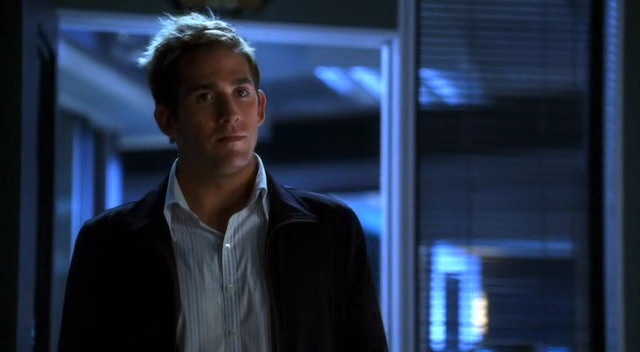

三周以来第一次开车上班让Sara紧张得快要窒息了。那感觉就像她又回到了第一天去San Francisco实验室上班的那个时候。这次即使是她最喜欢电台也没法让她冷静下来。

"别这样。" 她跟自己说，"你没理由紧张的。这不是什么新鲜事。你非常清楚去了之后自己要做什么。"

想到她期待已久的工作，她不禁微笑起来。她太想念工作了。她当然不知道自己会被安排什么案子，但就算是小小的抢劫案她也会开心接受的。她等不及想要去采集指纹、拍照备案、使用她的棉签...就现在来看即使是尸检对她来说也充满了乐趣。

她想念她的工作。

这些想法让她的紧张情绪渐渐变为欢呼雀跃。

"你的朋友们在那里..."

随着这个想法，她渐渐加深了笑容。她等不及去见Nick, Warrick Greg, Catherine…

Grissom …

笑容褪去。不是她不想见他；她太想见他了。问题是Christina给她布置的"家庭作业"。要跟他说自己家人的想法简直就像死亡宣言。

"Christina说这会有帮助。" 她提醒自己，然后叹了口气，"现在先别想这个。想想其他人..."

终于，她渐渐觉得自己冷静下来了。

*************

Grissom在开往实验室的一路上很难克制自己的兴奋。时隔三周他终于能再见到Sara了。

他深吸了口气，试着让自己冷静下来。

"你不能表现得像个轻浮的少年。" 他告诫自己。"她只是个同事...一个你想挽回友情的同事..."

尽管理性如此，但他仍然无法掩饰自己脸上的笑容。再见到她真的令他很兴奋。

他没法让自己停止分析为什么自己如此激动。他就是如此雀跃。

*************

尽管一路上她已经让自己平静了许多，但当Sara走进实验室时，所有的紧张感又都回来了。所有兴奋之情全都散尽，只剩下她要跟Grissom讲述自己家人的恐惧感。

当她走进更衣室的时候没看到其他人，这让她悄悄松了口气。她不确定自己准备好谈这些了。进到更衣室之后，她直接走到自己的柜子旁边。按照自己一贯的方式打开柜门，她从挂在柜门上的镜子里看着自己的镜像然后叹了口气。她看起来如自己感觉到的一样紧张。

"你必须告诉他。" 她朝着自己的镜像喃喃自语。"只要...迅速地..." 她叹着气用手梳了梳头发，"也许我只要练习一下..."

她盯着自己的镜像自言自语起来，演练着她要跟Grissom说的话。不过Greg走过门口并打断了她，热切地向Sara介绍了自己的继任者Chandra。Sara只希望自己在说hello的时候看起来真诚有礼；实际上她因为被撞见自己正在自言自语而有些被吓到了。不过，从Greg的反应来看，他们没听见她在说什么。Greg和Chandra离开后，她重重地坐了回去。

"Okay，我得干点儿实事儿。" 她喃喃自语道，"我不需要练习了。" 她吞了下口水，"毕竟，他只是Grissom..."

不知怎地，这想法并不能如她所想地使她平静下来。

她最后还是离开了更衣室往Grissom的办公室走去。不走运的是，屋里不只他一个人。他正被Greg, Chandra, Catherine, Warrick, Nick围着...Sara叹了口气然后耐心地等待Grissom分配完任务。她和Nick被安排在一起。Nick在离开屋子去拿他的工具箱时给了她一个超级灿烂的微笑，告诉她自己会和她在现场汇合。

其他人都和Nick一样匆匆离开了后，办公室里只剩下Sara和Grissom。她迟疑地朝他笑了笑。

"我能简单和你谈几句么？"

"当然。" 他认真地打量着她，"你去见你的PEAP咨询师了么？"

"Yeah。" Sara点头答道。

"进行得如何？" Girssom问道，声音中透着关心。

"Well，" Sara说，"那个...嗯...很有趣——"

这时DNA实验室中传来的碰撞声打断了她的话，看样子是Greg和Chandra撞到了什么东西。Sara和Grissom转头过去看到Greg抱歉地耸了耸肩。Grissom只能无奈地叹了口气。

"今天晚上会很忙，哈？" Sara问。

"Mm-hm。" Grissom板着脸哼了一声，想着Greg的最终测试还真是开了个坏头儿。

"我们之后再谈吧。" Sara说，庆幸自己有借口离开。

"你确定？" Grissom问。

"Yeah，Yeah。" Sara边说已经开始往外走了。

她拿到自己的外勤工具箱后慢慢吐了口气。她知道自己是个胆小鬼。但是，不管Christina说了什么，这事实在不容易。而且，他知道了能有什么好处呢？维持现状不好吗？

她默默为这个想法点了点头。她不要告诉他。他不需要知道那些。

立刻，她觉得轻松了。她已经开始感觉好多了。

*************

Grissom看着Sara离开了，他觉得应该给自己颁个奖。并不是每个人都能这样掩饰自己情绪的。

三周以来第一次见到她，至少是让他感觉十分震动。她看起来真美。虽然她一贯如此，但好像还是有些不同...他想也许她改变了发型。另外，她休假后看起来焕然一新了。

不过，总觉得还有些不对劲儿的地方...Grissom不确定那是什么，但从她眼里他觉得出Sara还有些感觉不好的地方。

他想要帮助她。他想要带她回来，让她再次完整起来。

他只希望她能给他机会。

*************

Greg在去往夜店调查作为他最终测试的枪击案的路上异常安静。Grissom很感激这份宁静，不过还是对Greg感到有些抱歉。他以前从没见这个年轻人如此紧张过。

当他们终于到达目的地，Grissom停好SUV，然后他看向自己的同行者。

"准备好了么？"

Greg点点头，咽了下口水。

"别紧张，" Grissom说，"你已经为此准备很久了。你已经准备好了。只是进去做你的工作就好。"

"是的。" Greg点点头。

Grissom下了车，而Greg跟在他身后。他们走进俱乐部时David正带着尸体朝外走。离开之前，他把从死者身上找到的车钥匙和钱交给了Grissom。

Greg朝四周环视了一下说，"我还没见过这地方有亮光的样子呢。这有点儿像早上第一次见到了一夜情对象的真身。"

Grissom把目光从装着受害者钥匙和钱的袋子上转向Greg，不敢置信地看了他这个年轻同事一眼。

"醉眼看世界。" Greg解释道。

"这是你的水平测试，Greg。" Grissom说，"也许你愿意来做现场勘察。"

听到他那饱含批评语气的声音，Greg保证会去寻找那把杀害了这位还未确定身份的被害者的手枪。Grissom离开去找被害者车子的时候，还在为Greg的发言而摇头。他不想Greg完全失去自己的幽默感，但他同时希望他能认真对待自己的水平测试。

Grissom离开后，Greg忽然觉得非常孤独，于是他开始在俱乐部中四下走动寻找凶器。这是个漫长而枯燥的过程。他以前从没单独做过这些；他想念工作时有人陪他说笑的状态。把这个绝不会告诉Grissom的想法暗藏在心底，他慢慢地检查着吧台。

"终于。" 他注意到一个灯罩中的影子时喃喃自语。他快速走上前去，拍了照片然后从灯罩中捡起那把枪。

他把枪装进证物袋，为自己如此成功地找到凶器而激动。他决定在把枪带回实验室之前再在屋里检查一遍，以防自己落掉了什么。

不过，在这之前，他得去趟洗手间。

*************

"这到底是什么鬼地方？" 在和Nick回到他的SUV时Sara大声抱怨道。几小时以前，她还觉得从靠近51区的沙漠里挖出一个打扮得像外星人的男性尸体是件奇怪的事。现在，根据他的服装追查到一个婚礼小教堂，她开始不太确定找到他们的受害者还算不算今天最奇怪的部分了。

Nick大笑，看着婚礼教堂外的整条街都站着发传单的人。"不响应一下那个外星人牧师吗？他们只是在散播爱哦。" 他又笑道，"据我看，他也想把爱散播给咱们。"

Sara翻了个白眼，"这条路上一定有15家婚礼教堂了，每家的主题都很离奇。能有多少人是单纯为结婚来Vegas的？而他们之中又能有多少人想要穿成外星人、暴徒或者TM自由女神像结婚啊？"

"显然，很多人是为了这个目的来的。我肯定他们中的一些人已经生活在这里了。" Nick在等红灯的时候说。他转头朝Sara咧嘴笑了笑，"你怎么想？我们要结婚吗？这条街上的每个人都会跟着我们。"

Sara一下笑喷出来，"Oh，你说的这么浪漫，我怎么忍心说no？我们要回那个外星人教堂去吗？"

Nick大笑，然后把话题转回到他们的案子，"我不知道，Sara...你觉得那个男的参与了么？"

Sara耸了耸肩，回想着他们刚刚面谈的"外星人"牧师。"受害人穿的肯定是定制的服装，这就让我们有理由相信他们是相互认识的。但是，他又说总是有人偷他东西..."

"我不知道，" Nick慢慢地说，"51区那里看着咱们挖尸体的那群疯子里，没人穿着类似的衣服。"

"我明白，" Sara叹道，"我想我们必须再深挖一下了。也许Chandra能从咱们给她的DNA取样中发现些什么。"

"咱们回去问问她。"

*************

Greg和Grissom站在DNA实验室外面，看着Chandra工作。对Grissom来说，看着一个新人在实验室里感觉有些违和；对Greg来说更是感觉奇怪。不过，Greg对能走出实验室出外勤这点还是很激动的。他只是对实验室有轻微的占有欲；他会很容易解决这点的。

Hodges带着Grissom从Greg在夜店发现的枪支上找到的蓝色物质的检测报告加入进来。他告诉他们这个神秘物质包含了粘着剂和厕所清洁剂。

"那么，Greg，你觉得要怎么解释枪上有粘着剂和厕所清洁剂？" Grissom问。

"我不知道，" Greg耸了耸肩，"不过我可以告诉你俱乐部厕所的水是蓝色的。"

Grissom惊讶的看着他。这点，他得承认，他令他刮目相看了。"你有在厕所水箱里搜查证据？"

Greg笑了笑，"Well，人有三急嘛。"

Grissom和Hodges听了都大吃一惊。Grissom觉得好像天地倒转了一般。

"在犯罪现场，Greg？" 他不敢置信地问。

"每个人都知道你得忍住的。" Hodges带着他那令人厌烦的优越感说。

"你可以去街对面或者找邻居。" Grissom说，"除了现场的其他地方，除非你已经检查完卫生间了。你查完了吗？"

"No。" Greg满脸羞愧地说。

"你可能把证据冲掉了！或者擦掉了把手上的指纹！" Grissom努力控制着自己的情绪。Greg怎么可以犯这种低级错误？"把这些写到你的报告书里。"

Grissom留下Greg和Hodges大步离开了。他回到自己的办公室坐在桌旁。然后用手扶额了一会儿。

不可否认，他为Greg的事而沮丧。但是，他同时也对自己失望。他应该更好的监管Greg的。他应该坚持指定组里的一名成员训练他的。这就是Jim总是叫他或者Catherine来负责训练CSI新人的原因。这是为了确保他们能彻底掌握所有鉴证过程。

可怜的Greg。他真的不想回到实验室了。再者，如果Greg回到实验室，让Chandra去哪儿？

*************

"嗯，我觉得这位Chandra小姐有一点儿...尖刻。" 离开DNA实验室时Sara跟Nick如此说道，"她有点儿紧张，你觉得呢？"

"你这其实是轻描淡写呢。" Nick笑起来。

"我们需要一些时间来适应了。" Sara叹道。

"习惯实验室里的不是Greg？"

"Yeah," Sara点点头，"不过，不仅如此，还得适应一个和Greg完全不同的人在实验室里。"

"但是，Greg会和我们一起出外勤。" Nick咧嘴笑起来，"这并不代表我们失去了他。"

"只要他别搞砸他的水平测试。"

"Well，给他点儿信心嘛！" Nick大笑，"你有搞砸过自己的任何考试么？"

Sara摇摇头。

"所以他也不会有问题哒。我们都和他一起工作的，Sara。我们知道他能做好。"

"我知道。" 她叹了口气，"但是，万一我们遗漏了什么...有什么东西我们忘了教他..."

"他会没事的。说不定他现在就在表现呢。"

"他和Grissom还没结案？我们可以去问问怎么回事。"

Nick皱了皱脸，"也许我们应该等他自己告诉咱们。以防不是我们期待的结果。"

Sara挑了一边的眉毛说，"你竟然心存质疑，Mr.乐观主义？"

"这叫现实主义。" Nick微笑道，"走吧，去找Elvis谈谈咱们死去的外星人。等Greg准备好了他会告诉咱们他水平测试的事的。"

*************

Grissom结了案子。Brass逮捕了那个用Greg在夜店找到的那把枪枪杀了受害者的女服务生。只有这一次，Grissom并不乐见案子结束。因为结案了也就意味着他得和Greg谈谈了。

他把Greg叫到自己的办公室。他隔着办公桌坐在Greg对面，审查着案子的相关文件，然后叹了口气。

"你犯了个致命的错误，Greg。" 他严肃地说。"你在犯罪现场危害到了证据。这种行为可能让我们吃上官司的。"

Greg听他说话时表现得很勇敢。他沉默地坐在那里，尽可能冷静地听着Grissom说他的第三次也就是最终水平测试失败了。尽管这个结论让他感觉痛不欲生，但他知道Grissom的决定是正确的。他知道自己再没机会做这样的工作了，但他也知道自己很可能再犯下同等重大的错误。他只是掌握的不够多。他只是还不够优秀去成为一个CSI。

想着他们的面谈已经结束，Greg从椅子上站起身来转身向门口走去。Grissom看了他一会儿，一阵恐慌感充满他的胸口。Greg会成为一名优秀的CSI，而他们马上要失去他了。Grissom一下子改变了主意。他不能让Greg走出这间屋子。如果他走了，他的团队里就失去了一名非常有价值的成员。

"但是，" 他缓缓说道。

 

Greg立刻停下脚步转回身。

"既然你已经找到了实验室的继任者，" Grissom说，"我愿意再给你一次机会。另外，这次，在让你接受测试之前，我会确保你接受了适当的训练。"

"Thank you，Thank you。" Greg说，感觉自己的声音又恢复了往日的活力。

他离开Grissom的办公室后正撞见Chandra跌跌撞撞地冲出DNA实验室。他问她第一天上班感觉如何；结果她朝他吼说对一个人来说这里的工作量太大了。

"他们都想要你。" 她愤愤地说，"我成为不了你。"

她把自己的实验室大褂儿扔给他然后大步流星地走了。Greg觉得自己的世界又一次翻转了。

"Grissom!" 他喊道。

Grissom从他的办公室门口探出头，"你在喊吗？"

Greg沿着走廊匆匆走回他上司的办公室，"如果，假设，Chandra辞职了，我还能得到那个机会吗？"

Grissom皱了皱眉，"Chandra...?"

"Mr. Grissom，我做不到。" Chandra跟着Greg自己出现在他办公室，"我很抱歉，但只是...工作太多了。我没有能力在这个实验室工作。"

Grissom闭了一会儿眼睛，"你会给我书面申请吗？"

"当然。我回到Connecticut后会把辞职信传真给您的。"

"Chandra...我希望你能多做几天..."

她摇摇头，"你们最好找别人来做。"

说完这些，她就头也不回地离开了实验室。Greg一脸央求地转向Grissom。

"Okay," Grissom叹了口气，"再给你自己找个继任者。在那之前，咱们先按照Chandra来之前那样办。"

"但是，我还能得到再来一次的机会吗？"

"Yes."

Greg终于露出一点笑容。"Thanks, Griss。我不会让你失望的。"

"我知道你不会。" Grissom答道。

Grissom对他的信心让Greg开心地笑起来。而看到这个笑容，Grissom觉得自己做了正确的决定。

*************

在这个非常奇怪的归队的第一天结束后，Sara终于往回家走了。她觉得精疲力尽；在离开的这段日子她确实有点儿忘记这份工作是多么耗费精力了。但是，这是"有益"的疲劳。她知道自己一回家就会倒在床上，但是她同时也等不及第二天醒来再返回到工作当中。她开开心心的跟着广播哼唱着朝自家驶去。

突然响起的电话铃声吓了Sara一跳。她伸手关掉广播然后从手机架上拿起电话。

"Sidle."

"Sara！你不会相信发生了什么！" Mary那几乎是喊叫着声音传进她的耳朵。

"经过今天一天，我觉得我几乎什么都信。说来听听。" Sara笑道。她有好几年没听过Mary如此兴奋了。

"我怀孕了！"

"什么？" Sara听了差点儿把电话掉了。

"Tom和我要有宝宝了！" Mary欢天喜地地笑道，"我做了家庭验孕，然后它是阳性的！"

"恭喜你！" Sara大声说。"我真不敢相信！我都不知道你们准备要宝宝了！"

"我们刚开始。" Mary说，"我本来不想太早告诉你让你抱有太多希望。不过...我想事情发展的就是这么快。"

"这是个天大的好消息。" Sara热情洋溢地说，"你知道什么时候预产期么？"

"No，还不知道。我刚预约了我的医生。下周我就能再多告诉你一些了。" 她顿了顿，"Sara，Tom的妈妈打电话进来了。我回头再给你打好吗？"

"Yeah，没问题。" Sara咧嘴笑道，"Hey，Mar——恭喜你。恭喜你们。" 然后她的笑容又加深了一些，"恭喜你们三个。"

Mary大笑起来，"Thanks, Sara。回头聊。"

"好的。Bye。"

"Bye."

Sara合上了她的手机，但是仍然满脸笑容。她知道Mary会是个好妈妈的。她等不及想要见她的小宝贝了。

*************

"所以说，因为那个人特别着迷外星人所以另一个人就把他埋在了51区？" Warrick不可置信地问，"他觉得这是他想要的？"

"Yup。" Nick咧嘴笑起来，"他以为ET死掉了，所以他就带着他去了那儿然后把他埋起来了。"

"Man，我还以为我的案子就够奇怪了呢。" Warrick说着摇了摇头。他抬头看到Sara走进休息室就调侃道，"So，我听说你打算让猫王主持你和Nick的婚礼？"

Sara大笑起来，"除非他服完活埋掉ET的刑罚吧。"

"然后接手他的生意。" Nick补充道。

"Oh，说得对。" Sara大笑。"Well，这才有意义。我是说，如果你即是猫王牧师，又是外星人牧师，你就能散播更多的爱了，是不是？"

Nick仔细看了看她问，"你怎么这么高兴，发生什么了？"

Sara咧嘴笑起来，"Mary怀孕了。"

"这太棒了！" Nick叫道，真心与她一同开心起来，"什么时候预产期？"

"她还不知道呢。"

"好吧，你要去看宝宝的时候告诉我，我要给她准备些礼物。"

"Nicky，你不用这么客气。"

"我想要送啦。"

Warrick打量着他说，"我都不知道你这么喜欢小孩子，Nick。"

他耸了耸肩，"试试给一群小孩子当叔叔吧。用不了多久，你就能学会爱他们啦。"

"Hey，各位。" Catherine一边走进休息室一边打招呼道。她在Warrick旁边的椅子上坐下来。

"你还好吗？" 他仔细看了看她。

"还好。" 她说谎道。

"你确定吗？" Nick问。

"我不想谈这个，okay？"

他们都点了点头，这时Grissom走进屋来。

"我需要一个志愿者。" 他以此代替了跟大家打招呼。

Grissom说完，屋里完全安静下来，一片静寂。他挑着眉看着他的组员。

"没人自愿？你也是，Miss Sidle？"

"Oh, no。" Sara摇着头说，"我不自愿为你做任何事情了。上次我自愿了，结果我被拽着头发通过了实验室。"

"那是为科学献身。" Grissom轻声说。

"Yeah, Grissom，我觉得我们之中没人再愿意盲目当志愿者了。" Nick咧嘴笑起来，"每次你试验结束后我们都很受伤诶。"

"你想让我们干什么，Griss？" Warrick问。

"做导师。" Grissom答道，"我知道在最初训练Greg的时候，我让大家共同分担责任，但从水平测试看出这样行不通。所以，我需要一个人自愿来训练他，并帮他准备重新参加水平测试。我想不管谁教了他什么，如果只一个人负责，我们就可以知道他都掌握了什么。"

Sara觉得心沉了下去。Greg的水平测试失败了？这怎么可能？他那么斗志昂扬，他们所有人都那么努力教他...但是，如果Grissom愿意再给他一次机会...

"我来做吧。" Sara毫不犹豫地说。

Grissom笑起来，"这才是我期待的反应。"

*************

"通过找志愿者？" Catherine在会议结束、Sara, Nick和Warrick都离开休息室后这么问道，"Jim一直只让我们来指导新人的。"

"Jim知道我们愿意做这些。" Grissom答道，"你不能强迫一个人成为老师，Catherine。我想看看谁愿意担起责任，然后做好它。"

她点点头。"聪明的手段。你在学着如何做好上司。"

"我在努力。" 他说完仔细看了看她。"你还好么？"

她叹了口气。"我们就浪漫地称之为艰难的一周吧。"

Grissom同情地看着她，"需要谈谈么？"

她盯着他看了一会儿，"Gil，你都不知道你这么说让我多感动。"

他点点头说，"想去我办公室么？"

她摇了摇头，"咱们得去工作了。我没事的。"

"你确定？"

"我确定。"

他点点头，"要是改变主意了，你知道去哪儿找我。" 他动身离开，但又停下脚步，再次转身看向她说，"Cath——下班后来我家吃晚餐吧。"

她咧嘴笑起来，"什么？没有早餐？"

"Yeah," 他大笑起来，"说得好像咱们能准时回家吃早餐似的。咱们今晚接的可是三重谋杀案。"

她咧嘴笑了笑。"好吧。晚餐。"

他转向她咧嘴笑了笑然后朝她眨了眨眼睛说，"这是个约会哦。"
