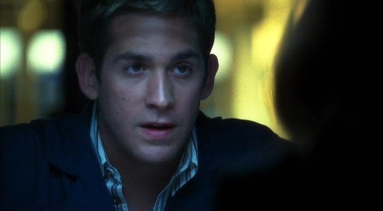

"我带酒来了。"

Grissom笑了笑，"Hi, Catherine。我也很高兴见到你。你不进来吗？"

Catherine笑着走进他的公寓。"我只是想先强调一下咱们最重要的东西。"

Grissom笑着从她手里拿走了袋子。"天哪，Catherine。你给商店的其他顾客留下什么了么？"

"我们有很多要谈的呢。" 她边回答边跟着他走进厨房。

Grissom挑着眉毛半转过身子看向她，"你一直都瞒了我很多事？"

Catherine也学他挑起眉毛，"你瞒我的更多。"

"我没有瞒你。根本瞒不住。" 他边说边从Catherine带来的一个袋子里拿出一瓶红酒，"喝这个好吗？我觉得晚餐配这个不错。"

"喔，我们吃什么？"

"意大利天使面配红蛤酱。"

Catherine愉悦地闭上眼睛，"God, Gil，我爱死你的红蛤酱了。"

"我知道。" 他笑着打开红酒。

她满腹狐疑地看着他，"你对也我太好了。"

他递给她一个红酒杯并给了她一个赞同的微笑，"你有朋友的。"

她点点头轻啜了一口红酒，"你说的对。"

"你想要谈谈么？"

她摇了摇头，"我想先吃晚餐。我们没理由为了感情纠葛而毁了意大利天使面配红蛤酱。"

"有道理。" Grissom笑了笑，"已经准备的差不多了。"

"我能帮上什么？" Catherine把酒杯放到桌上问道。

"你能把面包摆上餐桌吗？"

Catherine翻了个白眼然后拿起装意大利面包的篮子，"我会尽力的。"

Grissom轻笑着准备好两盘意大利面，并给Catherine多加了些酱，"我觉得你能搞定。"

在Grissom忙着把意大利面摆上餐桌时，Catherine把面包放到桌后又去拿了他们的酒杯和红酒瓶。待两人坐定，Catherine给了他一个大大的微笑。

"感谢你做的这一切。你这么做简直太贴心了。"

他笑着轻轻耸了耸肩，"这就是朋友的意义，对吧？"

"对。"

他们安静地吃了一会儿。不过Grissom知道这不会持续太久。Catherine从不会安安静静吃饭的。果然，她先开口了。

"Greg什么时候重做他的水平测试？"

"到Sara觉得他准备好了吧。" Grissom答道，然后叹了口气说，"我在他身上犯了错误，Catherine。我不应该那么快让他做水平测试的。"

"那不是你的错。" Catherine坚定地说，"我们都觉得他准备好了。我们每个人都和他一起工作过了，但没人告诉你他应该延缓参加最终测试。这是我们大家的责任。"

Grissom摇了摇头，"我是主管——"

"那是过去的事了，" Catherine打断他，"他犯了个低级错误，但现在他知道不会再那样做了。"

Grissom点点头，"你说得对。只要他用心学，那都不会成为无用功。"

"正是如此。而且，既然他的主管不可思议的发善心愿意给他第二次机会..."

Grissom笑起来，"Greg会成为一个优秀的CSI。我不能放弃他。"

"我知道。而且，不知为什么，我觉得Sara会把他训练得很好。"

"她会的。" Grissom立刻说，"我本来就期待是她来志愿教他。我觉得她会是个好老师。"

Catherine咧嘴笑起来。"Yeah——她喜欢管事儿。"

Grissom对她翻了个白眼。

"那是真的！"

"我知道。" Grissom抿了一口红酒，"但是，你也是。"

Catherine笑了笑，"你没真的想让我来志愿负责，是吧？"

"你是个好老师，Cath。"

她耸了耸肩，"我曾经是。但是，现在...我不确定我还像以前那样擅长了。" 她叹了口气，"你在对Greg测试失败自责时，我也在责怪我自己。我可以找借口说是Sara和其他人都没有告诉你应该延缓测试；他们以前从没带过新人。但是，Gil，我带过Nicky和Warrick。我知道应该注意什么，而不知怎么...我竟然没发现Greg还没准备好。" 她摇着头继续说，"我很抱歉。"

Grissom摇摇头，"如果那不是我的错，那也不是你的。就像你说的，事情过去就过去了，我们得继续走下去。"

她点点头，用自己的酒杯碰了碰他的，"敬未来。"

他笑了，"不过，我记得，你告诉我得先解决过去的问题才能直面未来吧。"

她咧嘴笑起来，"听起来好像是我想让你跟我吐露秘密的时候说的话。"

"就是。"

"你想让我告诉你，是不是？"

"如果你准备好了的话。"

她叹了口气，"我想是的。"

他温柔地笑了笑，"如果你不想告诉我，也没关系。只不过，我觉得如果你不想说今晚你是不会来我家的。"

"你说得对。" 她皱了皱鼻子，"有时候，我真讨厌你这么了解我。"

他耸了耸肩，"我是个专业的观察者。我能看透很多事。"

"好吧，Mr.观察者...我要说了。" Catherine叹了口气，"我在和一个男的约会——Chris。"

"Chris。" Grissom沉思道，"我不记得你提过他。"

Catherine不可置信地看了他一眼，"不是吧？实验室公认的隐私大师敢这么说？"

Grissom笑了笑，"说的有道理。请继续。"

"Well，这其实不是个很长的故事。Chris经营一家夜店——the Acid Drop。我昨天去那里查一个不在场证明，然后他让我晚点儿再回去找他。当我回去的时候，那地方很疯狂...而且，他的办公室里也是。"

Grissom皱了皱脸，"听起来没什么好事。"

"确实。他当时...很忙...和一些年轻的姑娘。"

Grissom皱起眉头，"你进去后他怎么说？"

"说根据他的职业，我早就应该想到这些。"

"这简直是我听过最蠢的说辞！" Grissom叫道，"和衣着暴露的女性一起工作也不代表你就有权利去...去..."

"背着你正约会的人偷腥？" Catherine替他补充道，"我知道。"

"你说什么了？"

"你该为我骄傲。" 她笑了笑，"我一句话没说。直接走了，而且，" 她顿了顿又说，"我绝不会再回到那里了。" 她抿了口红酒说，"男人烂死了。"

Grissom清了清嗓子，然后Catherine大笑起来。

"抱歉。我下次和Sara一起的时候再说这话好了。" 她又抿了口红酒然后顿了顿说，"这到让我想起来...她跟你说起过她的假期么？"

Grissom又清了清嗓子说，"No。"

"好奇怪，你不觉得吗？大部分人旅行回来都会兴奋地炫耀自己的照片、讲些旅行见闻的——特别是像她这样休息了这么久。"

Grissom耸了耸肩，"她是个相当注重隐私的人。"

Catherine笑起来，"也许对你是那样。但是，她之前跟我敞开过心扉的，而且我肯定Nick, Warrick和Greg知道那姑娘的所有秘密。"

Grissom瞪大眼睛，"她跟他们说秘密？"

"嫉妒？" Catherine问道。她的语调很轻，但她的眼神却好像能穿透他的灵魂。

"当然不是。"

"嗯。" 她靠近了些。"我知道我以前问过你，不过，拜托，Gil，告诉我你和Sara之间到底怎么了。"

他叹了口气。"没什么可说的，Cath。我们是朋友，曾经。但是，自从她来了Vegas，我们...变得疏远了。"

她皱起眉头，"所以，搬到同一个城市让你们关系疏远了？"

"我知道，这听起来很荒唐。"

"No，这听起来很像你。" 她仔细看着他，"而且，你对此并不开心。"

"No。" 他轻声承认。

她摇了摇头，"Well，这很容易改正！别再对那个姑娘表现得那么混账了！"

听了这话，Grissom被他的红酒呛到了。

"我没想到这个对你身边朋友好一点儿的建议让你产生这么痛苦的反应啊。" Catherine冷淡地说。

"No，只是..."

"只是什么？"

Grissom吞吞吐吐起来。

"你知道吗，这就是你为什么这么难相处。" 她说，"我已经告诉了你所有我糟糕的感情经历，而你甚至不愿意考虑对我敞开心扉。"

"我不是看不起你。" Grissom真诚地说，"我只是...我不擅长表达自己的感情。"

"这点我同意。"

他叹了口气，然后轻轻地说，"我想跟她做朋友，我只是不知道该怎么办。"

要不是看他这么严肃，Catherine就要笑出来了。他正用最诚恳、最坦率的表情乞求着她的帮助。

"Grissom，你简直可笑至极。" 她叹道，"你难道没意识到自己是个多好的朋友吗？"

他耸了耸肩，"以前没人跟我说过。"

她笑着摇了摇头，"你看到我今天很沮丧，所以你邀请我到你家，给我做了我最喜欢的晚餐。你认为Greg值得有第二次测试机会，所以你给了他机会。你很清楚当Holly被枪击时Warrick违反了所有的规定，但你仍然找了个朋友来调查他，而不是让他去期待IA的怜悯。对我们每个人，你都至少有一次去做我们坚实的后盾，而你从没指责过我们现在或过去的错误。你是，而且一直是一个好朋友。" 她朝他苦笑了一下，"至少，你想做的时候就可以做到。"

"真贴心，除了最后一句。" Grissom叹了口气。

"你没听我说吗？你只需要去做Sara的好朋友，而且我知道你会赢得她的信任的。我认为失去你们之间的友情让她也很受伤，我想重建友谊会让你俩都感到更快乐。"

他绝望地看向她，"我甚至不知道该从哪里开始。"

"随意作出善举。"

"什么意思？"

Catherine耸耸肩，"见到她跟她打声招呼。分给她你的糖果。去她最喜欢的咖啡厅帮她买咖啡。"

Grissom皱起眉，"我根本不知道她喜欢哪家咖啡厅。"

"问她呀。" 她笑了笑，"说得好像你从没跟她讲过话似的。"

"在某种意义上，我是这么觉得的。"

"Well，你得改正这点。另外，没有比现在更合适的时候了。 "

"你说的很容易似的。"

"Gil，和一个人做朋友本来就不难啊。" 她笑了笑，"你今晚给我做晚餐很难吗？"

"No, 当然不。"

"Well, 那么..."

"但是，和你不一样啊。" 他脱口而出，"我们已经认识好多年了，做朋友也好多年了，我们没有..."

Catherine等了一会儿，见他不再继续，便决定帮他说完，"没有过去？" 她暗示道，"异性间的吸引力？想要'更多'那种？"

"Yeah。" Grissom超小声地承认。

Catherine笑了，"去做就好了，Grissom。"

"去做什么？"

她轻笑着耸了耸肩，"你希望的任何事。"

他叹了口气说，"Cath，我很抱歉。我要请你来是想为Chris的事安慰你的，结果我现在竟然把自己的烦恼丢给你。我开始请你过来吃晚餐并不是想要这样的。我们应该关注你的事才对。"

"你开玩笑吗？" 她大笑，"你不知道我最喜欢当你的心理咨询师了吗！我巴不得能扒到你的任何消息呢！这是我这几年来经历的最有意思的事儿啦！"

*************

"Hey, Greggo."

"Hi, Sara。" Greg说着从显微镜上抬起头来，"有DNA样本给我？"

"No."

"来取某人的结果？"

"Nope."

"只是来聊天的？"

"Uh-uh."

Greg叹了口气，"我不管我有什么才华，我可不会读心术。我有什么能帮你的？"

Sara咧嘴笑了笑，"准确说应该是我有什么能帮你，Greg。"

他的眼睛瞬间亮起来，"我以为你都不会问我！"

Sara大笑，"孩子，你冷静点儿。"

"Damn it。我就知道现实中不可能有这种好事。"

她笑着摇了摇头，"听着，说正经的，我听说你的水平考试不是很顺利。"

Greg叹道，"真是坏事传千里。"

"Well，我还听说Grissom又给了你一次机会。"

"Yeah。" 他边说表情边又有些熠熠生辉起来。

Sara咧嘴笑道，"Grissom决定在你再次开始水平测试之前，给你找个正式的导师。"

"那，Grissom决定谁来当导师了么？"

Sara的笑容又加深了一些，说道，"就是我呀。"

Greg听了眼珠子都快瞪掉了，"你要来指导我？"

"Yup。从现在起你就归我管啦。"

Greg咧嘴笑起来，"那一定很有趣。"

Sara大笑道，"你只是觉得我不会像Nick和Warrick那样让你做些让你发牢骚的工作。"

"确实。"

她又笑起来，"你也就想想吧。"

"Well，你现在很难让我给当你小弟。" Greg咧嘴笑起来，"在我找到我的继任者之前我都被困在实验室啦。"

"别担心。" Sara轻轻说道，"咱们会解决它的。"

Greg点了点头。

"你会过关的，Greg。" Sara坚定地说，"我会帮你的。"

Greg叹道，"就算是你也不能防止我犯些低级错误呀，Sara。"

"No。" 她承认道，"但是，我可以保证你不再犯那些我犯过的低级错误。另外，我的朋友，很长时间内那都会对你有所帮助的。" 她咧嘴笑了笑，"相信我，我犯过很多错误的。"

Greg笑了笑，"那么你真的愿意当我的导师吗？我不是很确定你会做这种不明智的决定诶。"

"Hey，如果你不想要我做，我可以告诉Grissom..."

"No！" Greg立刻否认道，"这会很有趣的。"

Sara笑了笑，"你很懂嘛。"

*************

"Sara!"

Sara听到叫她的声音便停住了往更衣室去的脚步，转身看到Grissom正疾步朝她走过来。"Hi, Griss。"

"法庭上进行得怎么样？" 他边问，边上下打量着她身上的正装。

她耸了耸肩答道，"就是上法庭嘛，没什么特别的事也没有不开心。"

他点点头说， "Good。"

"我先去换个衣服，然后我就是你的啦。"

Grissom没法否认自己听到她最后那句话而引发联想所带来的刺激感。他怎么、可能、无视那句话。"实际上，我想和你谈谈。"

"Okay。"

他有点儿抱歉地笑了笑，"我带Greg去做他的第一次尸检了。"

"啥？" Sara叫起来，"Grissom！我想参与的好不好！"

"我很抱歉。" 他说，"但是，事情就是发生了，尸体到了，Robbins也准备好了..."

她叹了口气，"他表现得怎么样？"

Grissom笑了笑，"何不等他自己告诉你？"

她咧嘴笑起来，"他在哪儿？"

"DNA实验室。"

"还在？"

"我们会给他找个继任者的，" Grissom说，"我保证。"

"我知道。" Sara答道，"Thanks, Griss。我会去找他的。"

Sara离开Grissom之后直接往DNA实验室走去。Greg正坐在那里，从一块骨头里提取DNA样本。Sara走过去坐在他对面。

"我听说你终于失去贞洁啦。" 她用一种极其严肃的语气说道。

Greg抬头看着她，一脸茫然地想搞清她到底在说什么。

"你的第一次尸检。" 她咧嘴笑起来，"感觉如何？"

"还好。" 他低下头看回那块骨头。"你的第一次如何？如何表现的？"

"我吐了。" Sara简洁地回答。

Greg停下手上的工作直直看向她的双眼，"我没吐。"

"好样的，硬汉。"

"那种感觉很怪异，看着一个人的尸体那样躺在桌子上。" Greg诉说着自己的感觉，"Doc Robbins就那样把他的器官都取了出来直到他成了个空壳..."

"你以为会出现一团光球么？" Sara有点儿挖苦地说道。

"Doc Robbins说这才是真实的我们。"

Sara仔细看了他一会儿，轻声说，"重要的是你做了什么。"

Greg抬头看向Sara。她朝他轻轻笑了笑，然后起身离开了。在门口她停下脚步。

"抱歉我没在那里陪你。" 她柔声说。

Greg笑了，"没关系。Grissom有好好看着我。"

"我知道他在。"

*************

这是个令人心烦的案子。所有组员都认为这个案子比最近处理的任何案子都要令人不安。Brass已经有好久没有在逮捕嫌犯后，带上一瓶苏格兰威士忌跑到Grissom办公室找他一起减压了。两人谈了好久。

一整屋的爆炸物。一个教自己孩子炸碎东西的父亲。一个对暴力熟视无睹的母亲。合力掩盖儿子的同学在自己房子里被杀罪行的一家人。

真是一场噩梦。

但是，Grissom得承认，最令他挂心的并不是处于案件核心的这个不正常的家庭，而是Sara在办案时的状态。他已经记不得上一次Sara如此不顾自身安全追寻证据是什么时候的事了。他想起Warrick的话仍会心惊不已。

"Sara非常坚决地要把它带回来。" 他用手搓着脸说，"我帮她把门板拽了下来，但我觉得那个壁橱随时可能爆炸...我不知道为什么我没有干脆地拽上她就跑。"

Grissom无法否认Sara和Warrick带回的壁橱门板是重要的证物。但是，他肯定即使没有那个他们也能通过其他方法结案的。

有一点也许很容易被忽视，那就是如果当时他与他们一同在那房子里，他会提出反对意见的。

Jim离开他的办公室后，Grissom也起身准备回家。他受够了这一天了。

他走在实验室的走廊里，经过A/V实验室的时候放慢了脚步。Sara正坐在黑暗中，看着她从他们那位年轻犯罪者床下搜查到的家庭录像。她盯着屏幕，看到那父亲让儿子按下按钮炸掉玩具小车时，表情中充满震惊与恐惧。

想也没想，Grissom走进了屋子。门响了，Sara却连头也没回。

"Sara？你还好么？"

她听见他的声音吓了一跳，然后有些颤抖地答道，"Fine。"

Grissom关上放映机说，"跟我来。"

"我做错什么了么？我说过要检查录影带...我是在查找凶手的画面..."

"冷静点儿，" Grissom温柔地说，"你没做错任何事。我只是想...你需要离开这里了。"

"我很好。" 她说着，并试着在语调中增加一些力量。

他摇摇头说，"No，你可不好。我们都不好。这不是那种能简单忘记的案子。" 他深吸了口气说，"跟我来吧，Sara。咱们去喝杯咖啡。"

她听了眼中闪现出一丝希望的火花，"咖啡？"

"Yes。我想...这对咱俩都有好处。"

Sara点了点头，"好吧。"

*************

这就好像在Berkley的情形重演了一般。在与Grissom一同前往距离实验室几个街区之外的咖啡厅的一路上，Sara开心得仿佛要跳跃起来。她很想知道他是如何知晓这家店是她最喜欢的咖啡厅的。当他为她开门时她傻傻笑起来。他们会度过一段非常开心的时光的。

*************

*这就好像在Berkley的情形重演了一般。*Grissom觉得他和上次带Sara去喝咖啡一样紧张不已。在为Sara开门时他紧咬嘴唇。他希望她喜欢这家咖啡厅；这是他最喜欢的一家，而且他不知道还能去哪里了。他只是...他真的很想帮帮她。希望一起喝咖啡能缓解她的情绪。

*************

"So，很棘手的案子，哈。" Grissom问。

Sara把目光从搅拌着的拿铁上抬起，"我觉得是。" 她小心翼翼地回答。

Grissom叹了口气放下了手里的咖啡，"Sara, I'm concerned about you。"

"Yeah，你之前说过了。" 她说，"我真的觉得你是在瞎操心。"

"首先，I'm concerned, not worried。" Grissom说，"第二，你为了一扇溅了血的门板差点儿要了自己的命不叫 ‘我瞎操心’。"

Sara笑着翻了他一个白眼，"Concerned, worried, 那都一样的。"

Grissom摇了摇头，"Concern是一种迫切感兴趣的状态。Worry是一种烦躁不安的状态，伴随着焦躁不安的的恐惧感。"

"Thanks, Miriam Webster."

"Sara，我很严肃的。"

"我也是。" 她说，"我只是想保护证据，Griss。你知道那有多重要。"

"你的安全永远要放在第一位。" 他的声音中蕴含着一种令人惊讶的紧迫感，"你不需要为了一件证物送了性命。"

"Okay。" Sara说，并为他表现得如此激动而感到惊讶。"我了解了。以后我不会再做这么冒险的事了。"

Grissom看了她一会儿，慢慢展开笑容，"Yes，你会的。那已经是你之所以成为你的一部分了。我只是...我希望..."

"什么？"

他摇了摇头，"别在意。" 他清了清嗓子继续说，"你在看那些录影带的时候有些压力过大了。"

"哦，那个啊。" 她说着顿了顿，"你知道的，应该有些地方确保小孩子在那里是安全的。不只是感到安全，而是真正的安全。但是，如果你母亲在那儿拍你父亲教你如何炸掉你的玩具，那安全感根本荡然无存。" 她扭过头去，"孩子们走进家门后不应该还需要担心会有什么可怕的事发生。"

听了她的话，Grissom感觉自己更担心她了。"那就是我们存在的理由，Sara。保护那些孩子的安危。"

她给了他一个他所见过最悲伤的笑容，"有时候，我们根本赶不及。"

"但是，并不会总是那样。"

"对。" 她叹息着同意道。

Grissom仔细看了看她，"你还好么，Sara？"

她犹豫着，思考着该如何开口。她可以现在告诉他。他们正好谈到这个主题，至少她正想着这个话题，而且Christina说过...

"我很好，" 她说，"我们可以...先不谈这个案子了么？我觉得那对我没什么帮助。"

Grissom点点头。"Okay。你有什么想聊的么？"

Sara歪着头想了一会儿，"你最喜欢的电视剧是什么？"

"我最喜欢的电视剧？" 他重复了一遍。

"Yeah，你不觉得我们认识好像快有几百年了，但我都不知道你喜欢看什么电视剧？"

Grissom笑了笑，"我觉得我们还没认识那么久诶，dear。"

他下意识地用了那亲昵的称呼。待那个词脱口而出，它便仿佛凝滞在空气中一般。然后，Sara红着脸微笑起来。

"不管怎么说，我觉得我应该了解一下平常的你。我的意思是，我知道Catherine喜欢All My Children，Warrick是the Sopranos的粉丝，Nick喜欢看情景喜剧到欲罢不能，而Greg从不会错过Real World marathon，但你..." 她耸了耸肩，"我什么也不知道。"

Grissom笑了笑，很高兴她没有评价他刚才对她使用的爱称。"我喜欢棒球。" 他说道，"只要有时间我就会看。还有扑克锦标赛。还有...从Seinfeld一开播我就喜欢它。" 他挑了挑眉问，"你呢？"

"Will and Grace。" 她毫不犹豫地答道，"最爱没有之一。"

"我从没看过。"

"从来没有？" 她叫道，"你得补一下。我有DVD。什么时候我们一起看吧。"

Grissom朝她害羞地笑了笑说，"我很期待。"

意识到自己刚刚说了什么，Sara觉得自己的脸颊开始发热起来，"我也很期待。"
