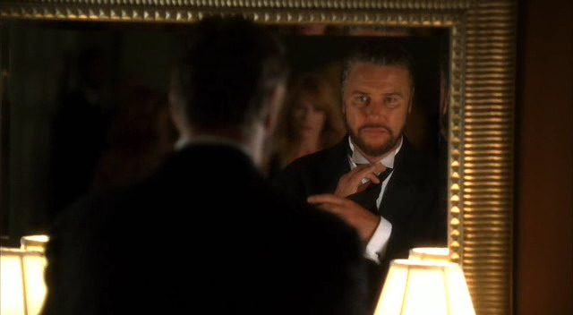
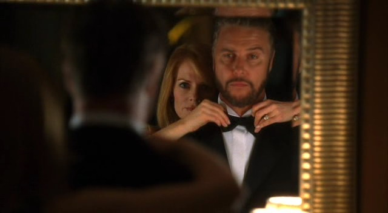
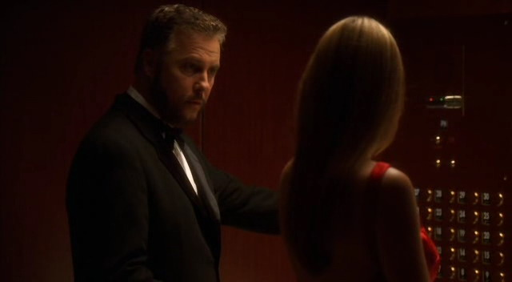

【Chapter 6】  The Competition

"你明晚忙么？"

Catherine从跟前的显微镜上抬起头来，"不会。怎么了？"

"我需要人陪我参加宴会。" Grissom说。

"你在宴会前一天才问我？" Catherine翻了他一个白眼。"你知道日程多久了？"

"Oh，别这么说嘛。" Grissom说，"你已经说你不忙了，而且我知道你想去看Ecklie升任副主任的就职演说。另外，你不想去听我的贺词吗？"

Catherine皱起鼻子。"你知道吗，他们说的对。那些不好好工作的人才能升职。"

Grissom黯然地点点头，"我的姨妈是个老师。我还能记得她抱怨他们的校长...她说他们把整个学校交个了一个管不好一个班的男人。" 他摇了摇头，"我想到处都是一样吧。他们挑了一个处理不好犯罪现场的男人并把整个实验室交个了他。"

"真让我恶心。"

"Well，可能这对日班组来说是个好消息。也许他们终于能留住人了。" Grissom说着朝她笑了笑。"你知道的，随着Ecklie的升迁，日班组会找新的主管..."

Catherine笑了，"我已经申请了。"

"我推荐你了。"

她的笑容加深了些，"明晚我很愿意陪你。"

"我也这么想。" Grissom咧嘴笑起来，"7点在酒店见。"

"我准时到。"

"Great。" 说完Grissom准备离开。

"等等！" Catherine叫到，终于注意到他刚刚劝说她参加宴会的理由。

他停下脚步转过身看着她问，"什么事？"

"你要做演讲？"

他皱起脸，"鉴于Ecklie和我是特别...好的朋友...治安官觉得我是合适的人选。"

Catherine咯咯笑起来，"太贴心了。"

Grissom瞪了她一眼，"这一点儿也不好玩儿。"

可她却彻底大笑起来，"Yes，可好玩儿了。"

他摇了摇头，"我得出现场了。"

结果Catherine的笑声一直伴着他离开。

*************

Grissom很早就到了酒店。知道自己比Catherine早到了一些——她总是迟到——他从口袋里拿出领结以及画着如何系领结的示意图。他以前从来没系过领结，不过他觉得自己应该能轻松搞定。他暗自轻笑，觉得系个领结肯定用不着考个博士学位。

结果15分钟以后，当Catherine找到他的时候他还在艰苦奋斗着。他正站在大厅里的一面镜子前，越来越烦躁。

"你干什么呢？" 她问。

"我快疯了。" 他说着，松开领结的尾端然后拿起了那张示意图。"我看不懂这个图！" 他叫道，声音中饱含了挫败感。

Catherine叹着气摇了摇头，同情地看着他说，"你不需要示意图，你需要一个女人。"

她走到他身后并从他手里接过那片小小的布料，熟练地在他脖子上把它系成漂亮的领结。Grissom不由得为了她的话和她的动作挑起眉毛。

"我等着听你的演讲。" 她说。

Grissom翻了个白眼然后摇了摇头，"那些不得不做的事..."

Catherine咧嘴笑起来，"怎么？不为你的好朋友高兴吗？"她调侃道。

Grissom咕哝道，"简直是我的噩梦。"

"No，我刚把你从噩梦里拯救出来了。你的领结系好了。来吧，咱们走。咱们要错过前菜啦。"

"明明是你迟到了。" Grissom说。

"是你没穿戴好呀。" 她反击道。

Grissom摇了摇头伸出胳膊。"Shall we？"

Catherine笑着挽起他的手臂，"We shall。"

当他们走向舞厅时他看着她说，"你看起来真美。"

"Thank you。" 她笑着看了他一眼，"你看起来也很帅。"

"Thanks to you。" 他也笑了笑，"要是靠我自己，我现在估计还站在镜子前面研究领结呢。"

她朝他笑了笑，"我得承认，我对穿晚礼服的男人没什么抵抗力。"

他大笑起来，"Well，别习以为常。这次可能是我穿它的唯一机会。"

"永远别这么说。" 她在两人落座时这么说道。

当宴会开始时,Grissom觉得这对自己来说太难了。他从来都不擅长做什么小演讲，也一直在回避着办公室权术。相反，Catherine就擅长这些，还有，用她那惊人的技术让他们两人看起来都体面得当。再一次，Grissom觉得自己和她成为朋友及处于同一战线实在是太令人欣慰了。

晚宴充斥着各种称赞Conrad Ecklie有多了不起的演说，说着实验室能由他来做副主任是有多么幸运。Grissom听着人们一个接一个地赞美着Ecklie，觉得有点儿吃不下东西了。

终于，要轮到Grissom站上演说台了。就在他作为Ecklie的同事兼好友被人介绍时，他的呼机响了。当他拿起它时Catherine瞥了他一眼。

"Gil？" 她刻意叫了他一声。

"我有个419的案子。" 他说。

她用通常是瞪女儿的方式瞪了他一眼，"想都别想。"

1

他一边解释着自己被呼了，一边从椅子上跳起来，并要Catherine代替自己去演讲。在逃出屋子之前，他丢给她一张自己写了东西的餐巾纸。Catherine打开餐巾纸看到上面写了一句话：对Conrad Ecklie我有什么好说的呢？心里盘算着这次Grissom可是欠她一个大人情，她站起身走上了演讲台。

"很不巧，Dr. Grissom被叫去一个犯罪现场了。" Catherine说，"显然，治安官忘了警告Las Vegas的罪犯们今晚他休息来着。"

她这小小的幽默立刻引得屋内的众人轻笑起来。她朝大家笑了笑。

"我，也是Conrad Ecklie的同事兼好友。我要代替Dr. Grissom和整个夜班组说，我们都为他的升迁感到开心和激动。他作为实验室的副主任会给实验室带来新的思路及能量，这能让我们更好的工作。我想我们能给予他的最高敬意，就是我们尽全力保持我们实验室长久以来的高水准运作，我知道我们所有人都坚信我们能做到。And，so, Conrad，我代表夜班组，祝贺你并祝你好运。"

她在众人的掌声中坐回自己的位子。Ecklie对她摆出了自己一贯表现出的强颜欢笑。

"刚才那是Grissom的演讲稿还是你的？" 他起身上台讲话之前问道。

"我从不抢别人的话说。" Catherine淡然答道。"我肯定Grissom要说的和我的不一样。"

"Hm。" Ecklie喃喃道，"Well, thank you。"

他阔步走上讲台开始了自己的演说。Catherine伸手拿起酒杯一饮而尽。

Grissom这次绝对欠她的。应该管他要辆新车来赔...内饰还得是真皮的。

*************

和不熟悉的人一起工作感觉很奇怪。

Sofia Curtis，白班组的"Catherine"，被叫来和Grissom一起处理现场。Grissom根本没认出穿着晚礼服的她。而她如Catherine一样，看起来美极了。

美丽，但是有点儿吵。

她有个很让人火大的习惯，就是在处理现场时一直在自言自语。Grissom尽了最大努力让自己不去理会她，并头一次产生了要是自己的耳朵没做手术就好了的想法。他觉得自己就快被她逼疯了。

至少他不必和她共事太久。只要这个案子一结，她就会回到她该待的白班组去了。

*************

Catherine立刻看出了Sofia对Grissom有兴趣。

从她看他的方式，她与他保持多近的距离，还有她跟他说的那些调情似的话语都能明显看出端倪。

至少，对Catherine而言是显而易见的。而Grissom依旧如常的对此毫无察觉。

Catherine知道自己得去提醒他一下。当然，是去提醒他远离Sofia。Catherine永远不会相信Ecklie的手下。

"So，白班组的工作如何？" 当她和Sofia一起处理证物时问。

"还不错。" Sofia淡然回答。她看了Catherine一眼，"我听说你申请了主管的职位。"

"Well，Ecklie的升迁让这位子空出来了。"

Sofia点点头，"我被指定为代理主管了。"

"对那个我没多想。" Catherine答道，"Grissom不在的时候我接替过他的位置很多次。但这并不意味着我想要他的职位。"

"Grissom还是班组主管。" Sofia说，"但Ecklie的情况不一样。"

"Hm。" Catherine同意道。她觉得自己越来越不喜欢这个女人了。

"那个...你能告诉我...Grissom有在和谁交往么？"

Catherine听了差点儿呛到。"Oh, honey。" 她说，"我要是你就不会想这些。"

Sofia挑起了眉毛，"Oh？"

Catherine同情地笑了笑说，"No。"

"他是单身，那么？"

"不管你怎么想...yes。"

Sofia看了她一会儿，知道她已经表态了。Catherine也许不想和Grissom在一起，但她明显觉得他也不应该和Sofia交往。Sofia朝她笑了一下。

"我记住了。"

Sofia Curtis才不会不战而退。

*************

"你欠我个大人情！"

Grissom笑了，"Catherine，你是我能求助的最好的朋友了。"

她翻了他一个白眼。"我给你救场，你就跟我说这些？"

他又笑了笑，"你具体都说什么了？Ecklie刚才看见我朝我要我的演讲稿。"

"Oh，我实话告诉他我没用你的演讲稿。"

Grissom挑起一边眉毛。

"他问我的。" Catherine解释道，"我说你要说的和我的肯定不一样。" 她咧嘴笑起来，眼中闪着调皮的火花，"你要给他你的演讲稿？"

"排在我的计划表里了。"

Catherine大笑着从椅子上跳起来。

"你生气了么？" 待她朝他办公室门口走去时Grissom问道。

"No，我刚看到Sara走过去了，我要和她谈谈。"

"回见。" Grissom朝着Catherine冲出门口的背影说道。

"Sara！"

Sara停下脚步并转向她的同事。"Hi, Catherine。"

"Hey，我晚上借走了Greg，不过你可以把他要回去。"

Sara困惑不解地看着她，"啥？"

Catherine咧嘴笑起来，"我让他查Macklin家女儿被绑架的酒店监控录像来着。我们看了很久。他现在不是很想跟我在一起了。"

Sara大笑，"Well，Grissom派我去公路旅行呢。我会带上他的。"

"我肯定他很乐意离开实验室。" Catherine看起来若有所思。"他说Grissom答应他下次出外勤时他可以进行他的水平测试。"

Sara耸了耸肩，"我还没听说。我想多给他点儿时间，不过如果Grissom想要..."

"Well，Grissom会跟他一起出外勤进行评价，所以肯定不会是今天啦。"

"你们还在忙Macklin的案子？"

"Yes，Sofia Curtis也有帮忙。"

Sara皱了皱眉，"那是谁？"

Catherine翻了个白眼。"你还没见过她？她是白班组的。是Ecklie的左膀右臂。" 她做了个很色情的姿势惹得Sara咯咯笑起来。"我是认真的，Sara...这姑娘和他关系太近。这让我只是和她一起查一个案子就觉得紧张。" 她摇了摇头，"Grissom最好小心点儿。"

"你知道他是如何看待弄权的。" Sara说，"我不觉得他有必要担心她。"

"这正是我担心的。" Catherine咬了咬嘴唇。"她..." 她摇了摇头然后声音渐低，"我得跟Grissom谈谈她。"

Sara看起来很在意，"你不会觉得她会危害到他的工作吧？"

Catherine耸了耸肩，"在这点上...我不会放任她的。"

Sara看了一眼手表，"在David以为我不会再去了之前我得去找Greg去现场了。听着...祝你和Sofia合作顺利。和Grissom谈时如果需要帮忙，尽管告诉我。"

"Thanks。" Catherine笑了笑，"祝你今晚好运。"

"Thanks。" Sara最后又朝她笑了笑，然后沿着走廊离开去找她的爱徒了。

她在休息室找到了他。他正喝着咖啡，而且看起来有些失神。

"你还好么？" 她问。

"有人替我了！" 他叫道。

Sara大笑起来，"已经知道了，Greg。Mia已经来了有一阵子了。"

"确切来说，有两周了。" Greg说，"在我看来，这意味着她要留下了。"

"你在担心？"

"经历了Chandra的事...yeah。我一直想要帮她一把，结果今天她把我赶出了实验室。我想这意味着你可以在任何时间找我出外勤了。"

"Good," Sara愉快地说。"现在如何？"

"现在非常好啊。" Greg急切地说，"我迫不及待地要逃离Catherine和那些破录影带了！"

"去拿你的工具箱。" Sara笑着说，"我们要去调查一起汽车旅馆发生的谋杀案。"

Greg咧嘴笑起来，"我一直等着这种案子呢！"

Sara大笑，"很高兴我让你梦想成真了。"

"Oh，我有很多梦都与你有关哦。" Grissom咧嘴笑着说，"破旧的旅馆可能正是实现其中一些的好地方。"

"别瞎想了。" Sara朝他做了个鬼脸说。"第一，那是不会发生的。第二，我得让你知道我不是那种属于破旧汽车旅馆的女孩儿。懂啦？"

"Yes, ma'am。" Greg说，并尽力装得一脸正经。

她笑着摇了摇头，"去拿你的工具吧，小蚂蚱。我来开车。"

"当然你来开, Master Splinter。"

Greg离开了，而Sara又大笑起来。她可以很正式地说她喜欢和他一起工作。

*************

"那个汽车旅馆到底在哪儿啊？" 在Sara又拐了一个弯把车开得离大路更远了一些后Greg问道。

"要出城呢。" Sara说完咧嘴笑了笑，"不是所有汽车旅馆都在Strip街上的。"

"有道理。" Greg朝窗户外面看了一会儿说，"我们能玩儿真心话大冒险吗？"

"你逗我吗？"

"No。"

"Greg …"

"我很无聊。" 他嘀咕道。

"你开心就好。" Sara叹道，"在这车里我是不会做任何有关'冒险'的事的。我在开车！要是我做了什么愚蠢的冒险，我可能会搞到撞车。我们最后的结局可能是挂掉，然后Nick和Warrick就不得不来处理我们可怜的变得支离破碎了的遗体。你难道忍心这么对他们吗，只因为你无聊？"

Greg大笑起来，"Okay，我就当你说'no'了。"

"为什么你不练习检查车子？" Sara建议道。

"什么？"

"从采集仪表盘的指纹开始。"

"你逗我吗？"

"Nope。开始干吧。"

Greg叹了口气后伸手朝后座去拿他的工具箱。Sara笑着看他开始采集仪表盘的指纹。

有时候，她得承认，指使他还是挺有意思的。

*************

"Hey，你们忙吗？"

"No。" Nick说。

"今晚不忙。" Warrick说。

"Great。" Sara笑了笑，"我想带Greg出去喝酒。你们来吗？"

"当然。" Nick赞同道，"今天什么日子？"

"Oh，我觉得有点儿对不起他。" Sara承认。"在去现场的路上我还想让他给仪表盘采集指纹来着。"

Nick和Warrick听了大笑起来。

"你为啥这么干？" Nick问。

"他说他无聊嘛。" Sara耸耸肩道，"他本来让我跟他玩儿真心话大冒险来消磨时间的。"

"Man，咱们得给那孩子买一套磁性国际象棋。" Warrick笑道，"也许那能让他在漫长的车程中有个消遣。"

"他是需要干点儿什么。" Sara赞同到，"来吧。咱们带他去酒吧。"

*************

Greg非常愿意跟他们一起出去喝酒，特别是在听说Sara会请他之后。4个人一起来到他们最喜欢的酒吧，在屋子后方的一张桌子边坐下来。他们点了啤酒然后闲谈起来。喝到第二轮的时候，Sara终于提出了从一开始她就想讨论的话题。

"So，你们遇到Catherine跟我说的那个Sofia了吗？" Sara问。

Nick咧嘴笑了笑，"你是说Ecklie的左右手？"

Sara大笑，"她告诉你的的时候也做了那个姿势吗？"

"Yup。" Nick大笑，"Catherine真的很讨厌那个女人。"

"她那么差劲？"

"Well，我可以告诉你们，" Warrick说，"Sofia可不觉得Grissom差劲。"

Sara皱了皱眉，"这是什么意思？"

"她完全迷上他了。"

Sara听了下巴都快掉了，"Sofia迷上Grissom？"

"Oh, yeah。" Nick同意道，"我看见她跟他讲话了。她甚至完全不含蓄！"

"对Grissom的话，我觉得含蓄可不管用。" Warrick大笑，"不知怎地，我感觉他好像不懂那一套。"

Sara摇了摇头，"关于这点Catherine什么也没说..."

"Oh，你知道Catherine的。" Greg说，"她喜欢收集八卦，不过她不会到处宣扬。"

"Yeah，而且如果是关系到Grissom个人的，我觉得她是不会说的。" Nick说，"他俩可铁了。她可不会在他背后捣鬼。"

"说得对。" Sara沉思着，想着也许，如果她努力一些，可以从Catherine那里挖到一些Grissom的信息。

"不过，Nick和Warrick是对的。" Greg说，"Sofia想要得到Grissom...绝对的。"

"那么，你们说说。" Warrick说着邪恶地咧嘴笑了笑，"你们觉得Grissom会和Sofia上床么？"

Sara一下子被她的啤酒呛到了。Nick赶忙伸手去帮她拍背。

"你还好么？"

"Yeah, 我没事儿。" 她咳嗽着说。

Warrick翻了她一个白眼儿，"我们要给你找根吸管儿吗？"

"No，不用。" 她边回答边朝他皱了皱鼻子。

"好吧，既然Sara暂时死不了...回到我的问题上来吧..."

"我说不会。" Nick说着做了个鬼脸，"说实话，光是Grissom和人上床的想法就能让我头疼了。"

"我说会。" Greg说。

Nick看着他挑了挑眉毛，而Greg只是耸了耸肩。

"那人也该有享乐的权利呀。" 他说。

Warrick大笑着问，"Sara？"

"我弃权。" 她说，"我连Sofia是谁都不知道。你们得把她指给我看看。"

"我们会的。" Greg保证道，"你选哪边，Warrick？"

Warrick看起来若有所思，"他可能...就先假设他会跟人上床吧。"

听到这话大家都好像认为他疯了似的看向他。

"咋了？" Warrick问，"他也许为了婚姻还保持着自己的贞洁呢。"

"我觉得有可能。" Greg说。

Nick摇了摇头，"Okay，各位，够了。这话题太诡异了。别管Grissom的私生活了。你们要是想讨论谁的性生活，就说咱们这圈人的吧。"

"有道理。" Warrick同意道，"最近有谁和人亲热过了？"

"就目前来说，no。" Nick笑道。

"Sara，想帮我改变现状么？" Greg调侃道。

"除非你是这家酒吧里最后一个清醒的男人。" 她笑道。

"Ouch。" Nick大笑。

Greg耸了耸肩。"我总要试一下。"

"Okay, guys，挑个话题吧。" Warrick说。

他们把话题转移到高中舞会上。Nick告诉他们之前所有问询的孩子都涉及到了Janelle Macklin的"绑架"案。大家笑着说现在的高中不比从前了。

随着他们的话题离Grissom和Sofia越来越远，Sara感觉自己终于放松了下来。她喜欢和这三个男人出来玩儿。虽然有时候她真的很痛恨从他们那里听到的消息，但她还是得承认他们是很好的八卦来源。她觉得有必要去亲眼看看Sofia，并确认一下她是不是真的看上Grissom了。

因为，如果她是...Sara可能要发表意见了。

*************

"你得小心点儿她。"

Grissom和Catherine终于结了手上的案子，并且一同回到Grissom的公寓喝酒吃晚餐。Grissom听到她的发言后茫然地看着她。

"你在说什么呢？"

"Gil，她迷上你了！" Catherine叫到，"难道你真的瞎了才没觉出来？"

"谁迷上我了？"

"Sofia！"

Grissom瞪大眼睛，"她为什么会...?"

Catherine翻了翻眼珠，"我告诉过你多少次了让你抬眼看看世界？这不是明摆着的事儿么。我是说，有几个女人会为一个男人粘领结？"

Grissom不得不承认这确实有点儿奇怪。Sofia在还他那个丢在犯罪现场的领结时根本不用帮他系起来，更不用帮他粘起来。他摇了摇头，觉得Catherine说的有道理。

"但是，我没有...她不是..." 他结结巴巴地说不出话来，只能使劲看着Catherine。"我甚至都不认识她！她怎么会想和我...?"

"你想进一步了解她么？" Catherine问。

Grissom犹豫起来，不确定自己的答案。

"你得小心点儿她。" 她又说了一遍，"这姑娘很漂亮，但她是Ecklie的跟班..."

Grissom皱了皱脸，"你选的词真好，Cath。"

Catherine大笑起来，"我是认真的，Gil！她是个弄权的高手，真的，而你实在是不行。你得小心点儿，否则她会煽动Ecklie把你的生活搞得一团糟的。"

"因为这正顺应了他日常的期待吗。" Grissom讽刺地说，"Conrad想要排挤我很多年了。他之所以没有开掉我是因为他知道我对实验室来说是有价值的。" 他皱了皱脸又说，"尽管不想这么说，但是有我这种学术背景的人并不太多，其中愿意做CSI的人就更少了。实验室需要我。Conrad知道这点，他知道要是把我赶走那将会是个灾难的。"

Catherine听到他说这番话简直把眉毛挑进了发际线，"我觉得能听见你夸自己更难得呢。"

Grissom耸了耸肩，"我有时候也能这么做的。"

Catherine叹了口气说，"听着，Grissom，我是只说..."

他朝她笑了笑，"别担心，Catherine。我能搞定的。"

"你确定？"

"我觉得可以。"

"然后你会小心？"

他不耐烦地看了她一眼。

"Okay, okay。" 他说着举起双手。而她摇了摇头说，"其实你要是说对她没什么想法事情就简单多了。"

他戏谑地朝她笑了笑，"你嫉妒啊？"

"No...只是担心事情的走向。"

"嗯，那没什么可担心的。" 他耸了耸肩。"再说了，她上白班我上夜班啊。我们怎么可能还有机会一起工作呢？"

"Hm。" Catherine说着轻啜了一口红酒。"为了你好，希望没这个机会。"
