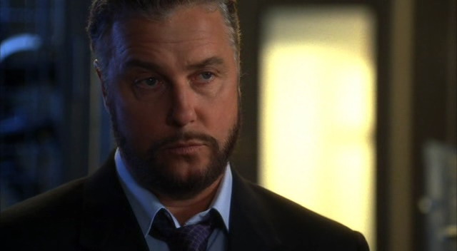

"嗯，关于受害者我可以告诉你一件事。"

"是什么？" Sara边问边把视线从正在处理的裤子上抬起来。

Greg朝她笑了笑，"他穿的衣服好丑。"

Sara听了笑起来，"有道理，不过这并不能帮我们确认他的身份。"

"或者知道他身上发生了什么。" Greg补充道。

"嗯，这个可能能让我知道多一些。" Sara说，"看看这个。"

"什么？" Greg边问边放下他手上正在处理的衬衫，看向Sara铺在桌上的那条裤子。

"看到GSR了？你能看出什么？"

Greg仔细看了一会儿裤子上枪眼儿四周的火药痕迹说，"很集中啊。我还从没见过这么小的一块地方有这么多的枪击残留物呢。" 

Sara点点头说，"这说明他是在非常近的距离被击中的。"

"So -" Greg正要开始说。

"Hey。"

Sara和Greg抬起头看到Grissom正走进会议室。他穿着蓝色西服的样子让Sara感觉有些膝盖发软，另外，他看起来一副心事重重的样子。

"Hi, Griss。" 她笑着打招呼。

"怎么穿正装？" Greg问。

"去法庭。" Grissom简洁地说，"你俩也许会想去Bobby Dawson那儿看看。"

"为什么？" Sara问。

"你们案子里的那把枪刚刚在他那边走火儿了。"

"My God！" Sara叫道， "他还好么？"

"Yeah，他还好。不过，也许你们会想..."

"Yeah。" Sara赞同到。接着她仔细看了看Grissom，"你还好么？"

"我？Yeah，我很好。"

"Griss …"

"我们之后再聊，okay？" 他仔细看着Sara问道。

"Okay。" 她轻声说。

他点点头就离开了。Greg看向Sara。

"他不会因为Bobby那边枪走火儿了就这么消沉吧？"

"No。" Sara缓缓答道，"这到底是发生什么事了？"

Greg耸了耸肩，"也许Bobby知道些什么？"

"去问问没损失的。"

他们来到弹道实验室，看到Bobby已经开始处理那把他们在被害者身边找到的手枪了。他朝他们轻轻笑了下。

"你俩想害死我么？"

"My God, Bobby, 你还好么？" Sara问，"Grissom刚告诉了我们发生了什么。"

"我会活下来的。" 他答道，"这把枪是我现在的首要任务了。这间屋子里任何走火儿的东西都是最高优先级的。"

Sara摇了摇头，"你确定你没事？"

"Oh，我没事。" 他说，"有点儿吓到了，不过..." 他懦弱地笑了笑，"要是当时Ecklie没在这儿的话我会感觉更好一些。"

Sara咧嘴笑了笑，"他就是有兴趣抓住别人失败的一面，对吧？"

"他确实是。" Bobby顿了顿然后环顾了下四周以确保周围没有别人，"说到这儿...Grissom怎么样了？"

Sara听了挑起眉毛，"这话是什么意思？"

"你们还没听说吗？"

"听说什么？" Greg问。

"Grissom到一个被关了5年的男人的复审中作证了。" Bobby开始说起来。

"对啊。" Sara说着，想起刚才和Greg见到Grissom穿了正装。无意识地，她用手摸了摸脖颈。为什么弹道实验室里这么热呢？

"Well，显然，当他在确认证物时，在火柴盒上发现了一枚新的指纹。" Bobby说。

Sara听了瞪大眼睛，"一枚新的指纹？"

"Yes。"

"嫌犯的？" Greg问。

"不是。"

"Oh, man。" Sara叹道，"这可不妙。现在什么情况？"

"不知道啊，不过我敢说Ecklie正紧盯着他呢。"

"肯定是。" Sara喃喃道。

Bobby叹道，"我真的希望自己没给他添乱。"

"你怎么会？" Greg问。

"Well，你们案子的枪走火还有..."

Sara摇了摇头，"那不过是意外，Bobby - 意外。Ecklie不能因为手枪走火这种事责怪你。" 她咬了咬嘴唇，"虽然，这枪成了Greg和我那件案子的潜在凶器这点算不上什么好事..."

Bobby笑了笑，"听到这些我好过多了，Sara。"

她大笑着说，"抱歉。" 然后她看向Greg又看回Bobby，"我想我们得回去继续查那些衣服了。等枪有结果了呼我，好吧？"

"没问题。"

Sara最后又朝他笑了笑，然后和Greg离开了房间。

"我们不是真要回去查那些衣服吧？" 他问道，"咱们去看看Griss怎么样了！"

"你回去查衣服，" Sara说，"我去看看是怎么回事。"

Greg耷拉下脸来，"你真的很擅长从这份工作里找乐子，是吧？"

Sara笑起来，"等我知道了我马上就八卦给你。"

"这只能安慰我一点点。" Greg叹着气闪进会议室里。

离开他后Sara又忍不住笑起来。她在走廊里快步走着，想着得找Nick或Warrick打听到Grissom那个神秘指纹的整个故事。她虽然想直接去问Grissom，但她觉得他还没准备好说出这些。

*************

过了好一会儿她终于找到了Nick。他正盯着电脑屏幕，看着一些指纹发呆。

"你在这儿啊！" 她叫道。

Nick抬起头朝她笑了笑，"我都不知道我成了失踪人口。"

"嗯，我一直没找着你。" 她答道。

"有什么要帮忙的？" 他问道。

"你知道咱们这儿发生什么事了吗？"

"Ah," Nick说，"Well，就是一个Grissom 5年前采集过指纹的火柴盒终于显示出指纹了。不幸的是，直到今天在法庭上Grissom确认证物时才显示出来。"

Sara摇了摇头，"So，关于这个Bobby说对了。"

"你现在从Bobby那儿打听八卦了？我好受伤！我以为我是你最棒的八卦源诶！"

"实际上，那应该是Greg。" Sara大笑，"不过，也许如果你再多四处转转，我就从你那里打听啦。"

"我得告诉你我现在忙着帮Grissom善后呢。" Nick咧嘴笑了笑，"他让Warrick和我重启了这个案子。Cath也在帮忙。"

"善后？"

Nick叹道，"现在看起来那个嫌犯——那个在监狱里关了5年的男人——可能是清白的。"

"Shit。" Sara小声说。

"Yeah。" Nick说完顿了顿继续道，"Ecklie正以此为借口重审Grissom的工作呢。"

Sara立刻挑起眉毛，"什么？"

"他让Sofia调查他查案的经过。"

"这完全不公平！" Sara叫起来，"她是Ecklie一伙儿的！她会得出他所期待的结论的！"

"我知道。" Nick叹了口气，"这看起来不妙，是吧？"

Sara咬着嘴唇摇了摇头，"一直就不妙。"

"那个混蛋！"

当Warrick冲进屋子的时候把Sara和Nick吓了一跳。

"怎么了？" Sara问。

"都是Ecklie！" Warrick喊道。

"Okay, partner，冷静点儿。" Nick用他那安定的南方腔调说道，"Ecklie对你做了什么？"

"他在走廊里等着我。" Warrick把音量恢复成通常状态，但仍然饱含着怒气，"我跟他说我很忙，但他说只要占用一点儿时间..."

"占用一点儿时间干什么？"

"他带我到他的办公室里然后开始盘问我Grissom的事。" Warrick顿了顿继续道，"Okay，没有'盘问'那么严重，但他明确问了我些他需要证明Grissom没有尽职的问题。" 他停下来朝四周看了看又转回头来，"他问我5年前我有没有按照Griss说的把那些头发送去痕检，而我没有——"

"等等，" Nick说，"你当时说你不需要再送去了。当时即使没有那结果案子也已经坐实了。"

"我知道，你也知道，但是，对Ecklie来说，看起来就像Grissom管不了我。好像我不听他的命令而他对此无所谓。"

"Oh, man。" Nick说着呼了口气。

"对吧。然后，他继续说什么我的生活有多好、我的工作做得多棒，接着就说到我的赌博问题。"

"不是想针对你，但那可不是Grissom的错。" Sara说，"这看起来更像是Ecklie想让你看起来是个坏人。"

"Yeah，我也这么想，直到他问我Grissom是否通知了departmental services来帮助我解决这个问题。"

"他通知了？" Nick见Sara皱起脸便接口问道。

"No。"

"你怎么跟他说的？" Sara马上问。

"实话。" Warrick说完用手捂起脸来，"那会儿我根本不知道他为什么问那些。这个人简直比辩护律师更恶劣。" 他摇了摇头，"我不知道，guys...这看起来不妙。我很担心Griss。"

"这话什么意思？" Sara问道。

"我是说Ecklie想赶走Grissom很多年了，现在他终于找到方法了。" 他又摇了摇头，"你们也最好小心点儿。之后他可能就去找你们了。"

"我们躲着他就好。" Sara立刻说。 

"那没用的。" Warrick说，"相信我，我试过了。"

"好吧，那我们只要注意点儿我们说的话就好了。" Nick说，"现在我们有准备了，我们知道要说些话来表现Grissom是个很棒的主管。"

"Yeah，" Sara同意道，"别担心，Warrick。所有事都会搞定的。"

"我靠！"

Catherine走进屋把他们三个都吓了一跳，她看起来和Warrick一样沮丧。三个人交换了一下眼神。

"嗯 …?"

"Sofia!" Catherine大声说道，"她现在就在这儿，忙着证明Grissom的失职。"

"她这么跟你说的？" Sara倒抽了一口气问。

"No，但是你们都懂的。Ecklie派她来复审Grissom 5年前负责的那起案子，而你们知道她会发现那些Ecklie想让她发现的东西。" Catherine愤愤说道。然后她朝他们假笑了一下，"不用说，我想要看看那些文件，但她根本没给我机会。"

"我觉得不用指望你能成功啦。" Warrick笑起来。

Catherine叹了口气，"我告诉她Grissom在这件案子上的没有纰漏的。他一向如此。因为Grissom并不是一个失职的主管我们才能成为全国顶级的犯罪实验室。"

"Sofia对你插手她的工作作何反应？" Nick问。

Catherine皱了皱脸，"Oh，你应该听听那个自以为是的小...'我想我会谨慎地向副主任报告我的调查结果的。'" 她说完皱了皱脸，"我告诉过Grissom她是Ecklie的小跟班，是不能信任的！"

"Yeah, well, 你了解Griss的。" Warrick说，"他不喜欢别人告诉他怎么看人。"

"我知道。" Catherine叹了口气，撅起嘴唇道，"我很担心，guys。"

因为某些原因，Catherine担心Grissom的想法比Nick和Warrick说的那些话更让Sara感到担忧。她觉得脸上开始有充血的感觉。

"我们不能做点儿什么么？" 她轻轻地问。

Catherine摇了摇头，"这点上，我们帮不上忙啦。"

*************

因为Catherine平静又绝望地表示他们对Grissom和Ecklie这回的事无能为力，所以Sara回到她最有效的分心模式：工作。她在会议室找到Greg，然后带他到验尸房参加他们案子受害者的尸检。

在和Doc Robbins及Bobby聊过后，Sara和Greg确定原来他们这位天才受害者试图把自己的枪改装成自动手枪。在改装过程中，他失误射中了自己的股动脉。

"他可能都没碰扳机。" Sara告诉Greg,"这枪太糟糕了...我是说，如果这枪都能在Bobby手里走火，那这家伙真是一点儿机会都没有呢。"

"Okay。" Greg说，"那么，这就完了么？意外死亡？案子结了？"

Sara摇了摇头并带他来到车库。"我们还得看看从枪支的序列号上能查到些什么。"

"我以为Bobby D.说序列号被擦掉了。"

"是的。不过，我们得把它恢复出来。"

Greg笑了，"总比罪犯领先一步，对吧？"

"我喜欢比任何人都领先一步。" Sara笑着回答，"把枪夹起来。我去拿咱们的工具。"

"嗯，我糊涂了。" Greg一边放好枪一边说，"我们应该认为是这人买了把有问题的枪，还是他在改造枪支贩卖？"

"也许是他改造了自用。" Sara说。

"Well，要是这样的话，他为什么费劲涂掉序列号呢？"

"有道理。" Sara笑着说。她为Greg感到骄傲。他在很用心地学习。

Sara一边恢复序列号一边和他讨论，然后让他念出那串数字。希望这能让他们确认受害者的身份。

"Excuse me."

Sara抬头正好看到Greg勉强避开撞上Ecklie。她知道终于轮到她了，不过她继续处理着枪支。

"Sara，" Ecklie走进屋子愉快的打招呼道，"有时间么？"

"应该有。" 她勉强忍住笑意答道。这人还真是头脑简单。他以前从没有因为什么积极的原因找过她，现在却来假装她的朋友？拜托。

他继续假装友善地夸奖她的工作优秀。而她知道自己受不了再听他这些虚情假意了，于是Sara决定在他开始闲谈天气以求让她放松警惕之前打断他。

"我能帮你些什么呢？" 她问。

"如你所见，我的工作是复审大家的文件。我只想确保你结束了你的PEAP咨询。"

"那不关你的事，Ecklie。" 她答道，并努力保持着声音中的平静。

"Well，不仅这个关我的事，我还准备找你的主管谈谈。"

"关于什么？ " Sara问道，所有职业化的掩饰瞬间消失殆尽。

"你跟他汇报过了，对么？"

要保护Grissom。这是Sara唯一能够清楚想到的事情。她得说点儿什么来支持Grissom。回想起有一次他们是准备讨论她的PEAP咨询，她决定稍微歪曲一点儿事实。

"Yeah," 她说，"Yeah，我们稍微谈过一些。我做的不错。我几个月以前就结束要求我做的那些了。"

"Huh。" Ecklie说，"那么，是Grissom忘了把你们的谈话记录到你的文件上了。嗯..."

Sara直直地看着她，心里准备接受他的下一个问题。她会一直坚持自己的说辞的。她已经完成被要求的咨询内容了，她很好，而且她和Grissom简单谈过了...类似这些。

"不过，" Ecklie最后说，"我会负责这个的。"

他离开时，Sara勉强笑了笑说，"Thanks。"

等他一走，她便收起了脸上的笑容。她已经尽力了，但不确定自己做的是否够好。

*************

和Detective Vartann跑了一些调查之后，Sara和Greg确认了他们受害者的身份。他曾经制造并贩卖枪支给一般民众。本来他是钓鱼执法的目标，不过现在因为死亡只好作罢了。

她和Greg回到实验室的时候还在为这整件事感到好笑。他们漫步在走廊里，诧异于没碰到其他任何人。

"是我的错觉，还是这里确实太安静了？" Greg问。

"太奇怪了。" Sara说，"去更衣室看看有没有人。"

Greg点点头，然后两人朝更衣室走去。屋里只有Catherine，她正坐在长椅上盯着自己的衣柜。

"Catherine？" Sara问道，"你还好么？"

Catherine抬头看了看Sara和Greg，看起来十分迷茫。"Hi。" 她沙哑地说。

"发生什么事了？" Sara问道，一种不祥的预感涌上心头。

Catherine咽了下口水，"Ecklie...把我们组拆开了。"

Sara一下子觉得天旋地转起来。她抓住Greg的胳膊稳住自己，"什么？"

Catherine眼里泛着泪光解释道，"她把Nick, Warrick和我调去了中班。你们两个和Sofia留在夜班跟着Grissom。"

Sara走过屋子来到Catherine身旁坐下。共事了这么多年，Sara敢肯定以前只见过一次这位年长女性的泪水：Eddie的尸体被找到的时候。她握住Catherine的手。

"为什么？" 她轻轻地问，"Sofia做了什么...?"

Catherine摇了摇头，"据Grissom说，Sofia是支持他和咱们组的，不是Ecklie。"

"嗯，这能解释她的降级。" Greg说，"但是，为什么整我们？"

"你们知道Ecklie的。他不需要什么实际理由。" Catherine气愤地说。

"等等。" Greg说，"如果Sofia调去夜班，那谁管理白班？"

"中班的主管。"

"那谁...?" Greg默默吞掉了后半句话。

Catherine点点头说，"我。"

"Well，恭喜你升职。" Greg说。

"Yeah。" Catherine说着摇了摇头，"这可不是我期待的升职方法。"

"真不敢相信。" Sara边摇头边说，然后她咽了下口水继续说，"男士们去哪儿了？"

"Grissom带他们去吃早餐了。"

"你怎么没一起去？"

"他们需要时间聚聚。" 她说，"我之后会跟Grissom谈的。" 她最后放开了Sara的手然后站起来，"我得振作起来了。我今天还要上中班。" 她摇了摇头又说，"还有之后的每一天。"

"你能做到的，Cath。" Sara说。

她点点头，"希望如此。"

Catherine离开了，留下Sara和Greg面面相觑。

"Well，这还真是个怪异的突发事件。" Greg最后说着坐到Sara身边。"没有他们在身边真的会很怪。"

她点点头。"这么说还是轻描淡写了。" 她感到眼泪马上就要涌出来了。"他怎么能...？"

Greg伸手握住Sara的手，"会好的。" 他轻声说，"我们还能见面。我们还是朋友。"

Sara摇了摇头，"对我来说你们远比朋友更亲近。你们是家人。"

"我们还是。" Greg说着捏了捏她的手说，"我保证。"

她转头朝他笑了笑，"你真好，Greg。"

他也咧嘴朝她笑了笑，"你也是。"

*************

Sara走进餐馆时，看到Grissom正独自坐在餐桌旁。他看起来正在想什么；直到她走过去在他对面坐下他都没注意到她。看到她的身影他睁大了眼睛。

"Hey。" 他打招呼说。

"Hey。" 她答道。

"你怎么找到我的？"

"Catherine告诉我你带Nick和Warrick出来吃早餐了。我们经常来这里，所以..."

"你真机智。" Grissom说，"你正好错过他们了。他们说需要回家补个觉。"

Sara点点头，"现在他们上班时间提前了。"

Grissom慢慢呼了口气，"Cath告诉你了，哈？"

Sara点点头。

Grissom摇了摇头，"我不知道为什么会变成这样，Sara。"

"Hey。" Sara说着倾身越过桌面握住他的手，"这不是你的错，Grissom。是Ecklie把我们组拆开的，不是你。"

"Ecklie拆开我们组是因为我管理失职。" 他说。

"那是瞎扯，你知道的。" Sara坚定地说，"我们是个优秀的团队，Griss。Ecklie不知道优秀的主管需要什么品质。你知道。"

Grissom笑了笑，"要是我无可挑剔，这次的事情就不会发生了。"

"要是你无可挑剔，你就不是凡人了。"

"有道理。" 他说着加深了些笑容。"另外，就像我跟Nick和Warrick说的，Ecklie喜欢提一些能得到自己想要答案的问题。" 他叹了口气，"他想整我很久了。也许我该庆幸他只做了这些。本来也许有更坏的结果。"

Sara笑了笑最后把手收了回来，"我们还没丢了工作。"

"而且，我知道Nick和Warrick跟的人很可靠。" Grissom说，"Catherine会是个很好的主管。这个晋升是她应得的。我只希望她要是能排到她所期望的排班就好了。"

Sara咬了咬嘴唇，"Sofia怎么看她的新职位？"

Grissom叹了口气，"我还没机会跟她谈呢。" 他摇了摇头，"我真的很佩服她，Sara。她做了正确的事，即使知道Ecklie想听到相反的答案。我希望这样的人能在我的团队里。"

"然而我不确定她想要在你的团队里。"

"No，" 他同意道，"我肯定她不想。"

"我们要面临巨大的改变了。" Sara叹了口气。

"Yes，" Grissom赞同道。然后他几乎是有些害羞地看向她。"不过，有一件值得庆幸的事。"

"是什么？"

"你还在我组里。"

Sara同样害羞的笑了笑，觉得自己的脸颊热起来，""Me, too。"
