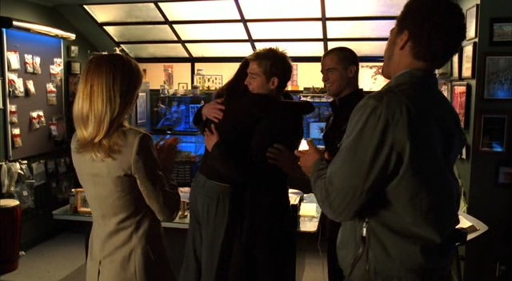
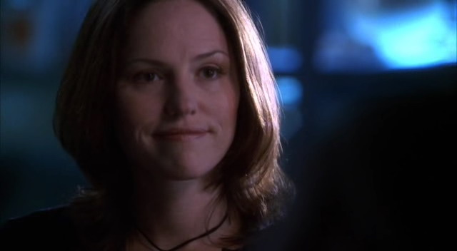
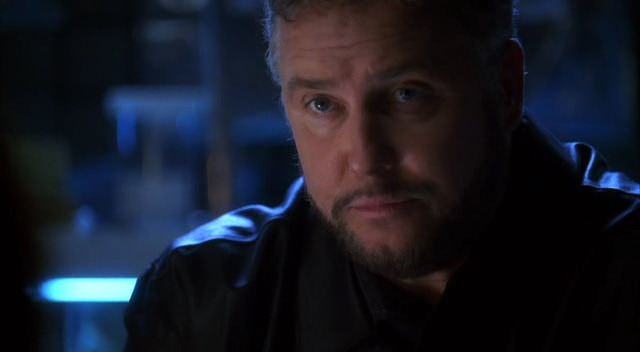

Greg在他开车回实验室的路上看了看坐在一旁的Sara。她离开医院之后就一直沉默不语，这实在不像是他那个一贯笑着调笑他的导师。就从让他开车这一点来看已经能说明她现在内心十分混乱了。

"你还好么？" 他问。

"我没事。" 她说。

"你看起来可不好。"

这时，Sara知道自己必须说服Greg相信自己真的很好，否则接下来直到回到实验室，她都得被一直询问自己的心理和情感状态了。她终于把脸转向他，"你真得练练和女孩子搭讪的技巧了。"

Greg咧嘴笑起来，"我的技巧没问题啊。"

"就你自己这么说。你刚才可是说一个女孩子看起来很不好。"

"我不是..." Greg声音越来越小声地看向她，结果看到她正带着一脸调笑的表情。他看了她一会儿。即使她看起来确实比平时安静许多，不过应该真的是没事儿。她乐于拿他打趣，这总是个好的征兆。于是他决定现在顺着她就好。

"我得跟你说，我可是靠着夸夸夸追到了我第一个女朋友的。" 他说，"我们当时是7年级，然后我告诉她我是有多喜欢她的牙箍。我还记得——"

"你还好么？" Sara突然打断了Greg的话。

"哈？" Greg完全糊涂了。

"看到今天发生的这些你觉得还好么？" 她说明道，"我知道你之前有被吓到..."

"Oh。" Greg顿了顿，"我不觉得自己会喜欢上这种事——你懂的，发现小孩子的尸体，被枪击什么的。这可不好玩儿。但是，就像你说的，我们得在那里给这件事做个了结。"

"Yeah。" Sara同意道。然后她朝他轻轻笑了笑，"你已经不再气Grissom让你来了？"

Greg稍稍笑了下，"你和Grissom是对的。我需要经历些像这样的事。另外，我很高兴今天你又让我回去。虽然看到小孩子在那间仓库里很恐怖，但是在白天出外勤还是挺好的。"

"白天的时候比较不会怕？" Sara问。

"我觉得可以这么说啦。" Greg说着瞥了她一眼，"你确定你没事儿？我从没见过你和那个小男孩在一起时的那种样子。"

Sara朝他假笑了一下，那种Mary一眼就能看穿的假笑，"我没事儿。"

如她所期，她用笑容和语言骗过了Greg。

"Good。"

确信Sara没事后，他把注意力转移到其他地方，打开收音机放起了他们常听的朋克摇滚。Sara对此十分感激。她其实很不"好"，但她真的不想谈这个。不想和Greg谈。还不想。也许以后会想吧。

*************

Sara从没有像这天这样觉得回家是件开心的事。她从没有如此迫切地想要摆脱工作。她把钥匙和包包丢在门边的桌子上，直接进进浴室。

她冲了个长长的热水澡，把水温调到自己能承受的最高温度。等热水终于用光了才走出来，当冷空气拥住她温热的皮肤时不禁抖了下。她擦干身子穿上睡衣，然后走进卧室。爬上床，她拉过一个枕头抵住胸口。

刚刚冲澡的时候，她抑制住了所有的那些画面，所有的记忆。她只把精力集中在把头发上的洗发水揉起泡沫、冲掉身上的肥皂。大部分的注意力都放在了小小的细节上。但是现在，因为什么也没做，她无法阻止那些记忆又翻涌上来。

Devon饿死的尸体。

Kevin满是泪痕的小脸儿。

Raymond无意识地倒在那里。

Kevin坐在她腿上。

Kevin抓着她的手。

Sara抓着社工的手。

她的母亲被警察带走。

她父亲的尸体横躺在地板上。

她父亲的鲜血飞溅到了墙上。

她的家，一个晚上就没了。

泪水慢慢溢出眼框。她任由最初的几滴默默流下脸颊，接着呜咽起来。过了一会儿，更是歇斯底里地哭起来，她已经很多年没有这样哭过了。她紧紧抱着枕头，任凭泪水不停地流出，哭声撕裂了自己喉咙。

最后她终于抱着枕头睡去，带着红肿的双眼和满脸的泪痕。

*************

直到闹钟响起, Sara才醒过来，已经到了再不起床就要迟到的时候了。她挣扎着睁开双眼，觉得眼睛好像被黏住了似的。困惑了一会儿，搞不清楚为什么自己头痛的要死还感觉软绵绵的。

然后，一瞬间，想起了前一天发生的一切。她虚弱地呼了口气然后爬了起来。整个过程实在是很艰难，但她不能一直赖在床上。她需要去上班。到了实验室，她需要鼓起勇气面对她的同事们。她不想让他们看到自己哭红的双眼然后问些同情的问题。她不想被迫去找些借口。

因为，如果真要被问起，她一定会去找借口。她还没有准备好和别人分享自己的故事。和任何人。

*************

她应该想到自己永远骗不了他的。他的同事也许都认为他不擅长社交，但Gil Grissom远比他们所认为的更善于观察。如果他会忽略情感因素，那他就不会成为顶级的法证调查员。另外，他一向对他身边人的情感状态挺敏感的。

特别是在她所担心的方面。

排班开始时，Sara刚走进他的办公室去拿自己的任务分配单，他就知道她有些不对劲。于是他立刻更换了任务安排。他本来想安排Sara和 Greg负责一起凶杀案，Sofia单独负责一起车祸。然而当他看到Sara眼中的痛楚时，他改为派她调查车祸。

Sara瞥了一眼任务分配单，然后又看了看她的主管，"Well，这看起来挺让人激动呀。" 她挖苦道。

"你和Greg该有个轻松地夜晚。" 他解释道，"你们昨天投入了整天。我觉得你们今天该轻松些。"

她慢慢点点头，"Greg是有点儿吓到了..."

他点点头，"我可能逼他逼得太狠了。"

她摇摇头，"他明白他需要看到这些。他会没事的。" 她朝他微微笑了笑，"不过，我觉得他会对能松口气感到高兴的。"

Grissom又点点头。如果她想拿Greg当个借口，那就这样好了。"下班后我们谈谈，okay？"

Sara轻轻皱了皱眉，"有什么问题么？"

"没有，没什么问题。" 他轻轻说，"我只是觉得也许你想去喝杯咖啡。我们好久没去了。"

Sara脸上终于露出了开心的笑容，"那太好了。"

"Good。我下班后在那边等你？"

"我会去的。"

*************

下班后，Sara来到Grissom的办公室。她知道自己不一定能在这里找到他；虽然今晚她的大部分时间都在实验室赶报告——她和Greg这次结案很快——但并不意味着Grissom也是这种情况。因此，当她发现他正坐在桌前，面前摊着文件时觉得有些惊讶。

"Hi。" 她打了声招呼，轻轻敲了敲敞开着的门。

"Hi。" 他从面前的文件上抬起视线，笑了笑，"进来吧。"

Sara笑着走进办公室问，"写报告？"

他翻了翻眼珠，"我要是不快点儿做完，就得去找Ecklie汇报...然后，咱们都知道上次事情变得有多美好。"

Sara听了挑起一边眉毛。

"我想多了？" 他边问边皱了皱脸。

"有点儿。" 她笑了笑。

Grissom叹了口气然后合上他刚才在读的文件。"我们去喝咖啡好吗？"

"你如果需要再干一会儿也没关系的。" Sara马上说，"我们可以改天晚上再去。"

Grissom摇了摇头，"只是些文书工作。明天它还会在那儿的。"

"你确定的话..."

"我确定。" 他坚定地说，并引导她走向门口。"Say good night to the lab。"

Sara咯咯笑起来，"Good night, lab。"

"Good girl。 Come on, let's go。"

Sara得承认这样一起走去咖啡厅让她感到有些轻飘飘的。为了她，他提前下班了。考虑到这人完全是个工作狂，所以这一定意味着点儿什么。

在他们的老座位上坐下，他们向经常招待他们的服务生点了常点的咖啡和松饼。然后，Grissom看了Sara好一会让。

"怎么了？" 她问。

"今天的工作怎么样？"

"有点儿无聊。" 她说，"我基本上让Greg自己负责那起事故调查了。他做得非常好。"

Grissom笑了笑，"Well，我不觉得意外。他有个好老师。"

Sara有些脸红道，"有很多人帮我。再说，我是跟大师学的。"

这回轮到Grissom脸红了。还是刚上的咖啡和松饼救了他。他们安静下来，给自己的咖啡加上适量的奶和糖。最后，Grissom先开口打破了沉默。

"你还好么，Sara？" 他轻轻问道。

Sara停下了咬松饼的动作并抬起头来。她觉得自己的心脏剧烈地跳起来。Greg告诉他了？"什么？" 她问。

他顿了顿，整理了一下自己想说的话，"我知道昨天你们的案子很难办。我只想确认你好不好。"

"我很好。" 她迅速答道，而且有些刻意强调。

"你确定？"

"我当然确定。" 她顿了顿并咬了咬嘴唇，知道如果自己不多说一些的话他是不会满意的。她选择说一些明显会引起他共鸣的内容，"小孩子的案子总会很难办。你懂的。就像你说的，那确实是个难办的案子。" 她期望自己"不想再谈"的语气能让他意识到该换话题了。

可惜，事与愿违。Grissom使劲看着她的眼睛。他能看到她眼里那纯粹的痛苦，并想让它消失不在。他轻声说，"我无法想象像那样发现那些孩子是什么感觉..."

"Griss, please …" 她的心脏跳得砰砰的响。她不能再谈这些了。

"Please, what?"

"Please, 别说这个了。"

"Sara, 我只是——"

"听着，我知道你只想当个好朋友，" 她打断了他，"我很感激，真的。但是，有些事还是最好不要谈。这件就是。"

"如果你需要——"

"我什么都不需要。" 她再次打断了他，"我很好，而且我也能照常工作。你没理由要担心我。"

他笑了笑，"我们说过这个。我不是担心你；我是关心你。"

她摇了摇头，轻轻笑了笑，"你总要咬文嚼字，是吧？"

"那当然。"

"Well，那么，你没理由要这么关心，我很好。"

"你一直这么说，但是我没法完全相信。"

"抱歉我没法说服你，但是我真的没什么好说的了。" 即便话已出口，但她也能意识到自己跟他说了个可怕的谎言。她有很多能说的事，但没有一件能说服他自己很好。她知道放下这个话题对他们两人更好。

Grissom叹了口气，"如果你确定..."

"我确定。" 她强有力地说，"我们谈点儿别的好不好？"

他又叹了口气，"如果你希望这样。"

"是的。"

"好吧。跟我说说你们今天的案子。"

随着她开始新的话题，Sara觉得她砰砰乱跳的心脏慢慢恢复了平常的节奏。她又躲过一劫。

即使如此，她仍然能感觉到自己的过去重压着自己。她不知道还有多久她会被迫讲出那些。

她只希望当那一刻来临时自己已经准备好了。

*************

如平常一样，Sara为了逃避自己个人生活的恐怖，躲进了她最喜欢的庇护所：工作。自从担起指导Greg的责任，帮Greg准备他的最终测试成了她唯一要关注的事。看到他在最近案子中的表现，她肯定他已经准备好了。只剩下告诉Grissom。

她等到Greg忙起来——她给了他一份需要花费大量时间的任务，去梳理他们最近案子里收集到的那一大堆参加了party的人的衣服——她准备去找Grissom谈谈。已经知道她的徒弟正在忙，只希望她的主管能有空吧。

她沿着走廊朝Grissom的办公室走去，想着自己可能能在那里找到他。他办公室的门开着，说明他正在屋里。她迈开步子，朝门口走去。不过只走了几步，她就听见Sofia特有的笑声从屋里传出来。于是她立刻停住脚步。

Grissom不是一个人在办公室里。他和Sofia一起在办公室里。

Sara深吸了口气，带着新的决心又迈开脚步。是时候让那个小妮子看看谁是Grissom最喜欢的女孩儿了。

她轻轻敲了敲开着的门，并在脸上重新挂上愉快的笑容。在Sofia对面，正坐在自己桌子后面的Grissom听到声音抬起头来。

"Sara。" 他笑了笑，看起来见到她真心感到开心。"进来吧。"

Sara瞥了Sofia一眼，然后又看回Grissom，"希望我没打断你们...？"

"没，我们聊完了。" Grissom说着站了起来。

Sofia也站起身，朝Grissom笑了笑，"Thanks, Gil。回头见。"

Sara差点儿呛到。在实验室她只听过两个人叫Grissom的名字：Brass和Catherine。从Sofia嘴里听到他的名字感觉很奇怪，陌生，甚至可笑。

"祝你的案子有好运。" Grissom答道。

"Thanks。" 她说。她与Sara擦肩而过，并给了她一个相当冷漠的笑脸。

Sara则还了Sofia一个虚伪地愉快笑容。看吧，他为了和我谈话把你赶出去了。Sara赢了一局。

"我能帮你点儿什么？" 待Sofia离开他的办公室后，Grissom问道。

"我想和你谈谈Greg。" Sara答道。

Grissom的眼中闪出一抹关心。他光顾着怕Sara的情绪出状况，却忘了确认他们最年轻的成员状况如何了。"他还好么？我想你之前说过...我知道那次枪击真的吓到他了。"

"他没事。" Sara说，"我觉得让他回到现场真的对他有帮助。他仍然知道那个街区有多危险，但他需要亲眼看看那里并不总是有枪战。"

"Good。那么他和那些孩子相处没问题？"

"Yeah。" 处理得比我要好，Sara一边回答一边想。 知道Grissom会对此作何反应，所以她决定还是不说后半句了。"你要知道，通过最近和他一起工作...我觉得他已经准备好做最终测试了。"

"你确定？这是他最后的机会了。如果失败了，他职业生涯的后半就要回去做DNA分析了。"

Sara点点头，"我确定。他能做到。"

"好吧。" Grissom笑了笑，"下一个凶杀案我会给他做评估的。"

Sara咧嘴笑起来，" 他会通过的。我知道。"

*************

可巧的是，第二天一上班就有一桩凶杀案等着他们。夜班组的成员在休息室集合好，等着Grissom。Sara和Sofia都尽了最大努力在相互间表现出专业态度，并且避免着眼神接触。Greg试图找她们聊天儿，不过失败了。当Grissom走进屋时三个人都松了口气。

"Hi。" 他开心的打着招呼，幸福的并没有察觉到他组里的两位女士之间正暗潮汹涌。"今天晚上很忙。Sofia，Bellagio认为他们抓到了一个在赌局诈赌的人；你得去查一下。Sara，Tangiers的诈骗案。还有，Greg，你今晚跟我查凶杀案。"

Greg迷茫地看着Sara，"但是Sara和我..."

"你跟着我做你的最终测试。" Grissom明确道。

Greg刷的一下脸色煞白，"今晚？" 他叫起来。

"今晚。" Grissom看了一眼表，"我们15分钟之内离开，做好准备。"

Grissom离开了屋子，紧跟着Sofia也走了。一般情况下，Sara应该起身跟上他们。不过，知道Greg现在吓得不行，她决定留下来和他谈谈。

"Hey。" 她说着摇了摇他的肩膀，"这是个好消息！只要通过了，你就是真正的CSI了。你就可以单独查案并且做所有工作了。"

Greg咽了下口水然后转过头看着她，"Sara...你觉得我这次能通过？"

"是的。" 她坚定地说，"Greg，如果你想听实话，刚开始跟你搭班工作时Grissom告诉过我，除非我认为你准备好了，他是不会安排你做最终测试的。昨天，是我去找他并且告诉他你已经准备好了。另外，Greg，" 她朝他笑了笑继续道，"你确实准备好了。我们已经一起工作很久了，然后，以防你没注意到，最近几个案子你实际上是自己查的。你能做到的。我知道你可以。"

Greg朝她咧嘴笑了笑，"Yeah。" 自他听到自己的任务安排以来，他的声音里终于有了些底气。"我能做到。"

接着Sara微笑着做了件令他俩都有点儿吃惊的事，她倾身亲了亲他的脸颊，"我为你骄傲，Greg。"

他的脸色瞬间恢复，甚至直接脸红起来，"Thanks。" 他说完又咽了下口水。

Sara咧嘴笑了笑然后站起身，"祝你好运——虽然你并不需要。"

她离开了屋子去拿她的工具箱，留下了一脸开心的Greg Sanders。

*************

Sara比预期更快地解决了她的诈骗案。于是她驱车回到实验室完成她的最终报告；做完后给她的主管打了个电话。电话只响了两声就被接了起来。

"Grissom。"

"Hey, Griss, 我是Sara。" 她说。

"Hi, Sara. 那件诈骗案怎么样了？"

"搞定了。" 她答道，"我能过去帮忙Greg么？"

"当然。" Grissom说，"我们还在受害者的家里。" 接着他说明了地址。

"Excellent。" Sara咧嘴笑了笑，"我会在20分钟内赶到。"

笑着离开实验室。她已经等不及看Greg的表现了。

*************

当Sara到达现场的时候Grissom正在屋子外面。他和Jim刚结束了对三个穿着古代服装的目击者的问询。想着这可是Las Vegas啊，Sara摇了摇头试着摆脱这份奇怪的感觉，然后走了过去。

"万圣节恶作剧吗？" 她看着3个目击证人离开后问道。

"咱们的受害者喜欢扮演Sherlock Holmes。" Girssom解释道，"那三个人是他的侦探同伴。"

"好吧。" Sara慢慢说，"所以，他们在搞重演？就好像有些人重演南北战争？"

"Yeah，我觉得你可以这么理解。他们一周聚一次，解决一件福尔摩斯悬案。"

Sara耸了耸肩并摇摇头，"这就叫青菜萝卜，各有所爱吧。Greggo在哪儿呢？"

"里面。" Grissom答道，"我在评估他处理Sherlock密室的能力。"

"Um …"

"进去看看吧。" Brass咧嘴笑着说，"如果你喜欢那三个人，你也会喜欢那间密室的。"

"Okay，我有点儿被吓到了。" Sara大笑道。

"只能这么说吧...那个男人对自己的爱好相当认真。" Grissom微微笑了笑。

"Okay。" Sara说着又摇了摇头，"你刚开始评估他处理那房间？"

"Yes."

"那，如果我帮他调查剩下的部分没问题么？"

"都随你。"

Sara笑了笑，"Great。如果你要找我我就在里面。"

Grissom看着她离开了。虽然他抑制不住地盯着她走动时臀部摆动的曲线，不过最吸引他注意力的还是她那大大的笑容。摇了摇头，他努力把精力转回到案子上。当他把注意力放回到工作之后，发现Brass正朝他咧着嘴笑。

"怎么了？" 他有点儿难为情地问。

"没事儿。" Brass忍不住笑地回答。

"Jim …"

Brass又朝他咧嘴笑了笑，"Sara是个好姑娘，Gil。"

Grissom听了脸上闪过一抹震惊，"What? Wait, Jim, 这没什么..."

"我知道没什么。" Brass说着迈步离开，"不过，可以有点儿什么。"

Grissom盯着他的背影，一句话也说不出来。

*************

Sara觉得Greg有点儿可怜。他并没有什么失误，只是运气不好，碰到的这个案子相当曲折又奇怪，各种伪造的证据和完全的混乱。他开始觉得是自杀，后来认为是谋杀，重回现场之后，又推断为自杀。最后，他把自杀列成了死亡原因。Sara陪着他，听他说明自己的最终结论并提了些问题。虽然她不觉得这是自杀案，但他给出了有说服力的论据。

"写下来吧。" 她最后说，"把你的报告交给Grissom就好。"

Greg紧张地看着她说，"你听起来并不是很确定。"

"重要的是你确定了。" 她答道，"这是你的案子，Greg。Grissom不在乎我对这案子怎么想，所以你也不应该在意。"

他笑了笑，"Okay。你觉得这样就可以了吗？"

"我希望你能和我们一起出现场，" Sara笑了，"不会给你指歪路的。"

Greg朝她咧嘴笑了笑就离开去写报告了。Sara靠回椅背叹了口气。她真的希望他能通过测试。

*************

"Sara!"

Sara吓了一跳，连手里的三明治都掉了，"What？"

Grissom走进休息室并关上门。他朝她咧嘴笑起来；Sara肯定自己很多年没见他这么兴奋过了。

"Greg过了！"

Sara跳起来，"真的？"

"当然。"

"即使他的结论是错的？"

Grissom摆了摆手，好像要赶走她的评论一般，"他收集了证据，很完美地做了分析。我们一起来搞定其他部分。你懂的。我帮他查清了这是桩凶杀案而不是自杀。也许有一天他也会这样帮我纠正。So，yes，他过了。"

Sara简直要把嘴角咧到耳朵了。"太棒了！我真为他激动！你告诉他了么？你告诉他的时候我能在场吗？"

"实际上...我在想..."

"想什么？"

"鉴于他是Greg，我想我们得找个特别的方式告诉他。"

Sara听了眼睛亮起来，"你在想什么？"

Grissom咧了咧嘴。"中班的人还在。咱们把Catherine, Nick和Warrick都找来吧？"

"必须的。"

*************

他们有大把的时间来策划告诉Greg好消息的方案；他们年轻的小同事正忙着避开大家呢。因为下了结论说受害者是自杀身亡而没有辨明他是被朋友所杀，Greg确信自己测试失败了。大家觉得搞点儿惊喜是帮他打起精神的最好方法了。

"我们能用上Mr. Wiggles吗？" Nick问。

Catherine摇了摇头，"我跟你们说了把他藏起来！"

"我们藏了。" Warrick很认真地说，"现在，他在淋浴间呢。"

"你们把Mr. Wiggles放到淋浴间去了？" Catherine叫道。

"我们又没开水。" Nick无辜地说。

"对啊。" Warrick说着瞪大眼睛看着她，"我们也不想浪费用水。"

"我们知道他很贵的。" Nick补充道。

Catherine嫌弃地看了他俩一眼，而Grissom和Sara则一头雾水地对望着。

"介意告诉我们是怎么回事吗？" Grissom问。

"这两位天才为了证明一个电击理论，用弹道测试的凝胶做了个真人大小的男性模型。" 她解释说，"他们管他叫Mr. Wiggles。"

Grissom皱了皱脸，"我赞成做实验来证明推理，但我不确定用弹道测试的凝胶是最好的选择诶，两位。"

"就是啊！" Catherine叫道，"我跟他们说把他藏起来。"

Grissom大笑起来。"好吧，这会儿，咱们要用到他对吧。怎么用呢？"

"把他装成你，Griss。" Sara突然说。

"什么？"

"Yeah!" Nick叫起来，顺着Sara的想法继续说道，"咱们把他放到你座位上，然后跟Greg说你找他..."

"咱们把他打扮的跟你一样然后背过身，这样Greg就看不到他的脸了。" Warrick补充道，"然后，等Sanders进来以后，咱们再把他转过来..."

"还得在Mr. Wiggles身上写个标签，告诉Greg他通过了。" Catherine最后说。

Grissom一脸欣赏的表情说，"我喜欢这个主意。就这么干吧。"

*************

等他们在Grissom的办公室里都布置好，最后只差找到Greg了。他们招募了Hodges来帮忙，让他把Greg呼到痕检室。Sara答应他之后会分给他一杯香槟作为谢礼；于是Hodges立刻就答应了。Nick和Warrick在走廊里能看到Greg去痕检室必经之路的位置上等着。一旦他们看到Greg，他们就跟他说要他去Grissom的办公室。Sara和Catherine躲在Grissom的办公室里；而Grissom自己拿着晾衣绳的末端，到时候拽着椅子转过来面对Greg。

"幸亏你这里有这么多放着恐怖罐子的架子。" Catherine蹲下身子后说，"这成了很好的藏身之处。"

Grissom摇了摇头。"Hey，" 他忽然想起了什么，眼睛一亮地问道，"小猪胚胎怎么样？"

"Miss Piggy挺好的。" Catherine自己摇着头答道，"我把她放进我的书柜里了。Lindsey知道她不再在你的办公室里之后有点儿消沉，但我想她会好起来的。"

"我以为她更喜欢蝴蝶。"

"Oh，她确实喜欢。但是，她一直对小猪胚胎情有独钟。她说那是类似让她想走出家门的动力。"

"Guys，安静！" Sara嘘声道，"他来了！"

几秒钟以后，Greg走进办公室并直接朝办公桌走去。Grissom拉动绳子，然后椅子转过来朝向他。Greg看到自己通过最终测试的消息时震惊得不得了。

欢笑和喝彩充满房间，Nick和Warrick走进屋子，而Grissom, Catherine和Sara从藏身处走出来。直到Sara紧紧拥住他时，Greg还是一副十分震惊的表情。

"我知道你能行。" 她轻声说，"祝贺你。"

Greg咧嘴笑着回抱住她。他知道如果没有她自己永远过不了。

*************

"I讨厌Sofia。"

Mary叹了口气，"每次你跟我说...等等，你不是应该还在工作吗？"

"我在车里呢，" Sara说，"我只有一点时间。"

"So，这次你又为什么讨厌她？"

"Greg通过了他的最终测试，所以我们为他办了个小型party。但她都不来参加！"

"Well，Sara，公平地讲，她并不像你们那样和Greg关系亲密。她也许觉得你们不希望她参加Greg的庆祝活动呢。反正，除非是我真的不了解状况，我觉得是这样啦。"

"我知道。" Sara叹道，"只是...我觉得这对Greg是很重要的。Damn it！要是我说谎技术再高明点儿的话，就不会是这样了。"

"你这话是什么鬼意思啊？"Mary彻底茫然地问。

"要是我当时能让Ecklie相信Grissom和我谈过了的话，也许他会放过我们组的。"

"Sara。首先，这不是你的错。Grissom应该要找你谈的。第二，从你告诉我的那些来看，Ecklie不是什么好东西。估计他会想方设法拆散你们。"

Sara叹了口气，"但是...也许我应该告诉Griss。也许他可以..."

"你告诉他能有什么结果呢？"

"缓解我的罪恶感。"

"你真觉得这是你的错？"

"我真的这么想。"

Mary叹了口气，"Well，要是那样能让你好过些的话..."

"会的。"

*************

Grissom坐在自己的办公室里，又一次被桌上无穷无尽的文书工作所包围了。真是个漫长的夜晚；他希望至少有件凶杀案让他们办——这样他就能逃出办公室远离这些文书了。他知道Sofia刚把手上的案子结了，不过他也肯定Sara和Greg在休息室打游戏呢。尽管他知道他们可以做些更有"意义"的事儿，不过他并不想做个"刻薄的上司"，所以他决定躲在自己的办公室里眼不见为净。

叹了口气，他把注意力全都集中在文档上。尽管文书工作通常都会花不少时间，不过他能做到让自己全心投入其中直到把它做完。

他正全神贯注的时候，听到了轻轻的敲门声。他盘算着要是自己不抬头是不是来访者就会自行离开呢。

"Hi。" Sara愉快地打了声招呼。

她的声音足以让他立刻抬起头来，然后就看到她带着大大的笑容走进办公室来。他摘下眼镜看向她。

"你有时间么？" 她问。

"当然。" 他简洁地回答道，然后把眼镜和文件都放到桌子上。为了她，他总是有时间的。

"咱们组变化之后还没机会跟你谈谈。" Sara在他对面坐下然后说道。

Grissom困惑地看着她，好像她疯了一样。他们每天都有谈话。组员变动后，他们还一起去喝了好几次咖啡。她说这话是啥意思？

"我...嗯..." 她有些吞吞吐吐道，"我想让你知道，也许是我跟Ecklie说的一些事导致了咱们组被拆散了。"

啊，是这个。自从那个让两人都有些吓到的早晨之后，他们确实没讨论过小组被拆散的话题。"Ecklie想要拆散我们，然后他这么做了。" Grissom轻轻摇了摇头说。

"他问我，在我PEAP咨询课程之后我们有没有谈过。"

"我们没有。" Grissom承认道。并不是他不想和她谈，只是他们的工作经常会妨碍他们做该做的事。"不管怎么说，你都不应该陷入要替你的上司打掩护的境地，抱歉。"

"一直以来你对我来说都不仅仅只是上司。" Sara轻笑着点头坦白道。

听了她的话Grissom稍稍抬起头。她是...什么意思？难道她还...？他能感觉到自己心跳加速起来。

"你觉得我为什么会搬到Vegas？" 她笑着说。

My God。当时，他从没想过她是因为职业生涯目标以外的原因来到这里的，或者，充其量，是来帮老朋友的忙。但是，现在听她这样说...他的心脏开始狂跳起来。

"我——我知道我们的关系很复杂。那可能是我的错。那一定是我的错。"

Grissom知道自己得打断她，要不然她会在自己的办公室里一直叨念到下个轮班开始的。"你完成了你的咨询课程，对吧？"

"Yeah, yes, yes。" 她自信地说，毫无疑问。

"然后呢？" 他轻轻地问。

"这么说吧...我...我有时候会在不恰当的地方寻找认同。" 她那饱含深意的目光不容他产生误解。

他们深深对视了一会儿，直到两人都承受不了愈发凝重的气氛才移开了视线。Grissom感到自己狂跳的心脏平静下来。他就是她不恰当的地方。他知道，而她也知道。很多年以前，从她最初为了参加他的讲座迟到而道歉，从她问了他无穷无尽问题时开始，她就在寻求他的认同。

他想改变这种状态。他不想让她觉得自己需要寻求他的认同。他想要她知道她已经得到了——她一直被他认同着。而且，他不想自己成为她生命中的不恰当。他希望他们的关系在各方面都是恰当的。也许不以实验室的制度为基准——同组成员间禁止恋爱——也许也不以世俗眼光来衡量——她比自己小15岁——但以他们自己的标准。当他看进她眼中的时候，他知道他们两人都会找到那层再适当不过的恋爱关系。

他几乎有些惊讶自己下意识地已经开始说着什么了。

"听着，让我们...嗯..."

他们相互凝望着。他必须开口约她。他不能只邀请她与自己一起喝咖啡。但是，应该做什么呢？晚餐？早餐？No，no，早餐太不合适。那听起来就像要她与自己共度一晚似的。不是说他不想，但他们还没真正约会过，所以那不合适。那样进展有点儿太快了。他不想仓促行事。他们承担不起失败的后果。也许午餐...也许看电影——

"It's okay。Okay？" 她说着给了他一个虚伪的明朗笑脸。

他花太多时间去思考他的问题了。她不知道他脑子里在疯跑些什么。她以为他并不是真的想约自己，他只是因为知道自己的期待而强迫他自己考虑这些。他的心又沉了些。

"就这样吧，我们谈过了。" 她边说边站起身，"别忘了把这个给Ecklie记下来。"

当她走出他的办公室时，Grissom觉得自己的心脏一下子收紧并穿过胃部直接掉到地上了。他失去机会了。

这太荒谬了。他们从朋友变成同事又变成朋友...但是，现在他知道他们都希望走得更近一步。两人都不满足只维持朋友的关系。他一直觉得这只是他的问题，然而，显然，Sara以为自己是单相思。她不知道他是如何看待她的，或者他期望什么...

他需要有所行动了。只希望自己能鼓起勇气。
