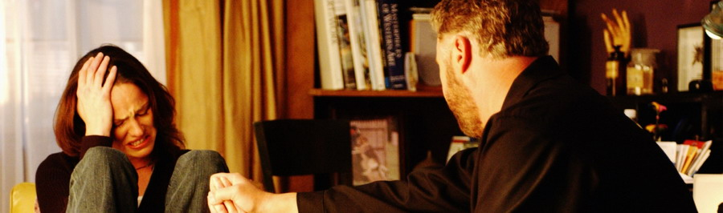

"Sara，你今天晚上归我了。"

"Okay。" Sara答道。

Catherine离开了更衣室并沿着走廊快速离开了。Sara挑着眉毛看了看Greg。

"Grissom现在直接把我卖了？"

"看起来是。你对他做什么了？"

"No。" Sara慢慢回答，"至少，我觉得没有。" 虽然回想起最近她坦白了"他对于自己不只是上司"的话，但她选择无视掉它。那之后他们也有正常地交谈；无疑，他肯定不是因为那个而惩罚她。

Greg咧嘴笑了笑，"也许是Catherine从他那儿把你偷走的。"

Sara大笑起来，"Yeah，我听说她开始偷CSI了。" 她耸了耸肩又说，"希望能跟Nick和Warrick一起办案。我最近都没怎么见到他们。"

"Yeah，我想今晚咱们不能一起工作啦。" Greg答道。

"Hey，就现在来看，你要独立办案啦。" Sara咧嘴笑了笑，"当然，是从Sherlock测试那案子的庭审回来之后。"

Greg笑了笑。

"别这么紧张。" Sara平静地说，"你会在法庭上表现得很好的。就像我说的：你是专业人士。你能做好的。你从头到尾了解这个案子，而且你知道你能证明是她干的。赶快出去做你的事儿去吧。" 她咧嘴笑了笑，"你要是真的那么紧张的话，我们可以找Nick和Warrick帮你演练一下庭审场景。你懂的，你可以练习一下。我来扮演法官。"

"No, thanks。" Greg咧嘴笑起来。"我觉得今晚不需要被Warrick盘问啦。"

"Well, then …"

"我会没事的。" 他说着笑了笑，"再次感谢，Sara，为了你做的一切。你最好了。"

"别客气。"

"Sara，你今晚跟Catherine。" 这时从她身后传来了说话声。

Sara朝Greg翻了个白眼，然后转过身看到Grissom正站在门口。"她已经告诉我了。你是想躲开我么？"

"No，我在试着补偿她。" 他羞怯地咧嘴笑了笑，"我之前把她某一具尸体的脸弄坏了。"

"什么？" Sara叫起来。

"严格说来那并不是我的错..."

*************

"这完全是Grissom的错。" Catherine给Sara看那半张脸的时候说。

Sara咯咯笑起来，"他说不是。"

"听着，我有两具尸体被埋在沥青里了。所以，很自然的，Grissom很感兴趣地自告奋勇来帮忙。起初我很感激——我从没想过用液态氮把沥青冷冻，然后再把它们剥落。但是，接着，他剥得太用力了结果把这可怜女孩儿的半张脸弄下来了！"

"Yeah，这很显然。" Sara说。

"你觉得你能从沥青的压痕中弄出点儿什么么？"

"我可以试试。" Sara回答。

"太好了。" Catherine咧嘴笑起来。"我和他俩要开始处理其他证物了。回头告诉我你是怎么做的。"

"回头跟你汇报。"

"还有，Sara。" Catherine在门口停下脚步说，"Thank you。"

Sara笑了笑，"没什么。"

*************

Sara花了很长时间躲起来帮她的受害者做脸部模型。她一直惦记着Greg，想知道他的第一次晚间庭审做得如何。他之前太紧张了，不过她有绝对的信心相信他会顺利的。

当她完成了石膏模型的时候，她还挺开心的。她弥补了Grissom的失误并且给受害者的脸做了个漂亮的模型。她看起来好像只是睡着了一样。

她把脸模交给了Catherine, Nick和Warrick，他们也在梳理其他证物时发现了毛发的证据。基于他们收集的证据，也包括Hodges从Nick收集的泥土样本得出的结果，Sara相信受害者是被家暴致死的。

"虐待，然后致死。" 她冷冷地说。

"我们还不确定就是那样。" Nick说。

Sara摇了摇头，"Nicky，这个女人的下巴缝过线。你自己可不容易受这样的伤——除非有人帮你。"

"是的。" Catherine迅速接道，希望避免争执。"所有急诊都会留受虐患者的照片，这就意味着城里的某家医院可能有这个女孩儿的大头照。Sara，你愿意...?"

"我来做。" Sara同意。

"Good。Nick, Warrick，回去再查一遍衣服，看看是否有遗漏的。"

"Yes, ma'am。" Nick说着和Warrick一起站起身。他回头看了Sara一眼，"Sar...我不是..."

"我知道，" Sara说着僵硬地朝他笑了笑，"我知道。" 

他也笑了笑说，"Good。我们之后见，okay？"

她点点头，"和衣服好好玩儿吧。"

"Oh, yeah。" Warrick自嘲道，"Come on, Nick。咱们去时装秀吧。"

*************

1个小时以后，Sara就开始羡慕Nick和Warrick的时装秀了。她觉得自己看够了那些伤痕累累的女性面孔照片了，而且这辈子都不想再看了。

看这些照片时，她尽量保持着客观的心态，试图找到和他们受害者的脸模相匹配的人。但是，没看几张照片，她就开始从每张女性的照片上看到自己的母亲。记忆疯狂地涌上来。

母亲做晚饭迟了。他打歪了她的下巴。

她带Sara在公园里玩儿太久了。他打歪了她的鼻子。

她逛商店的时间比平时长了些。他打青了她的眼睛。

Sara用手指轻拍着桌子，试图让自己的意识回到现在。他已经不在了，他再也不能伤害她们了。

当然，总会发生些让她想起他的事...

她用双手抓着脸颊边的头发待了一会儿。

"专注点儿，Sara。" 她喃喃道，"你在这儿是要查出她身上发生了什么，不是为了沉浸在过去。"

她又翻开了一份文件然后顿住了。她找到她了。他们的无名女尸有名字了。

Svetlana Melton。

*************

Grissom正走过实验室的走廊时手机响起来。轻轻皱了皱眉——这通电话打断了他去找Mia拿他的DNA结果——他接起电话来。

"Grissom。"

"Hey, Grissom, it's Greg。我刚结束了庭审。"

"怎么样？" Grissom问道。虽然他试着让自己的声音听起来很平静，不过他实际上很担心他最年轻的CSI第一次庭审表现得如何。

"还不坏。" Greg答道，"我只是想问问我是应该回去实验室还是直接出现场？"

"回来吧。" Grissom答道，"Sofia刚从她的现场回来。是双重谋杀案，我肯定她会需要你帮忙的。"

"明白了。"

Greg笑着挂了电话。在挺过了他的第一次庭审之后，他现在觉得自己无所不能。他等不及要告诉Sara他的表现了。她会为他而激动的。

*************

当Greg回到实验室的时候，Sara已经离开了。据Judy说，她和Catherine一起去了警局审问她们案子里的一名嫌犯。Greg有些失望地往更衣室去换衣服。他可以下次看到Sara再说。

*************

只是看着Andrew Melton就让Sara觉得毛骨悚然。他承认Svetlana——跟他现在的妻子一样——是个邮购新娘。他说她曾控告他打了她，但他实际并没有，而现在她出城去了。他并没有尽力去找她——因为不想再被控诉别的罪名。

除非能找到更多证据，他们现在只能让他离开。Sara在同Catherine一起离开警局回实验室的时候表现得非常愤怒。这男人明显虐待了他的妻子，但Catherine却只是站在那里说他们无能为力。Sara不愿接受这个事实。她不要在得知有其他女性被那个宣誓爱她珍惜她一生的男人殴打后还袖手旁观。

"我们得去看看她。" 当她们一同走在CSI大楼的走廊里时Sara如此说道。

"看看她？" Catherine问。

"那个妻子。" Sara解释说，"我们得确保她受到了保护。"

"Whoa。" Catherine说着举起手，"你在说什么，Sara？我们要给她安排保镖吗？"

"也不是这个意思。" Sara说，"我只是希望有警官定期去查访一下。"

"如果那个妻子要求了帮助的话。" Catherine用一种希望结束这个话题的语气说道。

"Well，如果不会说英语还是个性奴的话很难做到这点，" Sara说，"我肯定她都不知道自己的权利。"

"你不能因为某人娶错了人就逮捕他。"

"你应该懂的。"

Sara终于触到底线了。Catherine想尽快结束这场对话。

"如果这个男的虐待、杀害了他的第一任妻子，我们会立案并抓住他的。" 她坚定地说。

"但是，同时，他可以继续拿她当沙包打！" Sara大声说。

"Sara，我在那里！她身上没有伤痕。"

如果母亲身上每一处"看不见的"伤痕都值一美元的话，Sara现在根本不用工作的。就好像刚才她触到了Catherine的底线，现在Catherine也触到她的了。

"我们看不到的，Catherine！" 她愤怒地说。

Catherine停下脚步转向Sara，平静但严厉地说，"你知道吗，每次我们碰到有家暴或虐待迹象的案子，你都会失去理智。你到底有什么问题？"

"Yeah，我可能是有问题。" Sara声音抬高了八度生气地说，"然而你让你的性趣影响了你对男人的判断，所以我得替你善后！"

"Sidle!"

这时两位女性转过头看到Ecklie正站在走廊的另一头，脸上一副前所未有生气的表情。

"到我办公室来。现在。"

Sara知道她可能应该担心自己的工作了，但她实际上并没有。她还在气Catherine，气自己对这案子的无能为力，根本没空想别的。她跟着Ecklie来到他的办公室，拒绝了他要她坐下的请求。他喋喋不休地说了些她在同事和嫌犯面前不能好好控制自己的脾气，又说到如果Grissom好好记录的话她会有更多投诉。

听到Ecklie批评Grissom，之前和Mr. Melton以及Catherine之间发生的任何事都变得不再重要。Sara的火气又冒起来。

"你之所以能做到现在的职位都是因为Grissom不会拍领导马屁。" 一旦开始，她便如机关枪似的骂起来，"你做不好现场工作所以你根本不能靠那个往上爬，你先是拆了我们的小组，现在你又在楼道里闲逛等着抓我们错。"

"Sidle，你停职一周。" Ecklie气得几乎朝她喊起来。

"Great。" Sara答道。

"回来之后，你要跟Catherine道歉。"

"不，我不。" 她挑衅地说。

没有给Ecklie留下解雇她的时间，Sara就摔门而出，离开了他的办公室。她茫然地走在走廊里，除了心中翻涌着的怒气什么也感受不到。她直接来到更衣室，找到自己的手包。

"Hey。" Nick路过的时候跟她打招呼，"你还好吗？"

"Yeah, 我很好。" Sara紧张地说。

Nick看了她一眼，"Yeah，我还从来没骑过马呢。Sara，发生什么事了？"

"就是我被停职了。"

"啥？" Nick叫起来，"Sara！怎么回事？那个秃头黄鼠狼干了什么？"

"那个...嗯...说来话长。"

"Sweetheart，我有时间听你说。能帮你什么忙么？"

Sara叹了口气，"Nicky，抱歉，我现在不想谈这个。之后再打电话给你好么？"

他点点头，"一定打给我。要是你'忘了'，我就给你打。"

她笑了笑，"我知道你会的。"

他咧嘴笑了笑并轻抚了下她的脸颊，"See ya, darlin'。"

"See you。"她几近低语地答道。

Nick的善意让她放松许多。总之，她深吸了口气，然后镇定地离开了大楼。现在该回家度过她生命中最漫长的一周了。

*************

Greg走进会议室的时候，看到Sofia正一脸震惊表情地站在屋里。他朝她笑了笑说，"和我一起办案让你这么难过吗？"

"No，当然不是。" 她说着摇了摇头，"你听说了吗？"

"No。" Greg轻轻皱了皱眉答道。

"Ecklie把Sara停职了。"

"啥？" Greg几乎叫起来，"为什么？"

"我不知道。" Sofia慢慢答道，"Nick刚告诉我是她自己跟他说的，她被停职了，但没说别的。她答应之后会打电话给他，不过在那之前我们可能没法知道更多了。"

"简直荒谬。" Greg说，"我想象不出Sara会做出什么需要停职的事。"

"No，她不会。" Sofia赞同道，"她对案子太专注了...她绝不会..." 她又摇了摇头，"我不知道Ecklie在干什么，不过绝对太过分了。这人真该不要再这么愚蠢自大了。"

"Great！" Greg起劲儿地说，"我们怎么阻止他？"

Sofia难过地笑了笑，"我觉得我们阻止不了，Greg。我们只能尽力支持Sara。"

Greg仔细看了看她，"我以为你和Sara相处不是很愉快吧？"

"从专业角度上我很尊敬她。" 她说，"她是个优秀的CSI，而把一个优秀的CSI停职是愚蠢的行为。她应该被派到现场破案。"

Greg咧嘴笑起来，"我能告诉她你说了这些么？"

Sofia笑着翻了他一个白眼，"你非要说的话。"

*************

"Grissom！我们得谈谈！"

Grissom从电脑屏幕上抬起头，看到Catherine冲进他的办公室，好多年没见她这么生气了。

"怎么了？" 他问道。

她砰地关上身后的门然后坐到他对面，"Sara。"

"Sara？"

"她在我们今天审问的嫌犯面前失控了。真的，Gil，非常糟糕。我从没见她和任何人这样讲过话。然后，因为我拒绝派警官去查访那个男人的妻子她就发飙了。再然后..."

Catherine继续说着什么，但Grissom没再听进去。他肯定自己知道问题的根源。他的思绪回到了很久以前，那还是Sara来Vegas和他共事的第一年。他们一起办了件案子，案子里那个男的虐待并杀死了他的妻子。然后，Sara也是在嫌犯面前失去了理性。这么多年来，还有很多案子也是，他能看到规律...

"她在处理家暴案的时候会有些问题。" 他慢慢说。

"不要管什么家暴案了！她在走廊里对我人身攻击！" Catherine大声说道，"Gil，这姑娘完全失控了。Ecklie把她叫走了，不过——"

"Ecklie把她叫走了？" Grissom叫起来。

"Yes, 然后他——"

这时Catherine被Grissom桌上电话的铃声打断了。他朝Catherine皱了皱脸然后接起电话。

"Grissom."

"Grissom, it's Ecklie."

"Hello, Conrad," Grissom平静地应道。

"我需要你现在来我办公室一趟。"

"我马上过去。" Grissom答道。

他挂了电话又朝Catherine看去。而她朝他笑起来。

"收到王室召唤了？"

"Yes."

"Gil...你会处理这事的，对吧？你不会无视它然后假装事情会过去吧？"

"要是Ecklie插手此事的话我也很难无视掉。他会让我无法忽视此事的。"

"我是认真的。" Catherine说，"我知道这是Sara，我也知道你们两个私下里有超古怪的关系，但她的所作所为...她需要..."

"受到惩罚？" Grissom挑起一边眉毛问道。

"Well, yes."

"她不是你的女儿，Catherine。"

"她也不是你女朋友，Grissom。" Catherine继续说，"我要说的是去听从Ecklie的建议吧。"

"你知道他会建议什么吗？"

"我没跟他说什么，如果你是想问这个的话。不过，我能猜到一些。"

"我也能猜到。" Grissom叹了口气，"这就是你真正希望的么，Catherine？这样了结事端？"

Catherine一言不发地盯着他，连眼睛也没眨一下。

他只得叹道，"我们回头再谈吧，Cath。"

"Gil …"

"我们回头再谈。" 他又说了一遍，然后和她一起离开了自己的办公室。

*************

Grissom在走去Ecklie办公室的路上感觉他就像个刽子手。一旦涉及到Sara的职业生涯，他可能确实是的，Grissom如此想到。

"Hi, Gil," Ecklie看到他打了声招呼。

"Conrad。" Grissom回应道，"我能为你做些什么？"

"废话少说吧。" Ecklie说，"我知道你肯定已经跟Catherine谈过了，而且你肯定已经知道发生什么了。"

"我是和Catherine谈过了。" Grissom承认，"关于她和Sara的故事，她给我讲了她的版本。"

"好吧，我来说说我的版本。" Ecklie说，"Sara在整个实验室同僚面前对Catherine说了不恰当的话。她侮辱、贬低她，威胁她要'越权'——我猜是要向你告状——而且，她在我办公室里也是这样。"

"我不知道她为什么会——"

"你知道我们没必要去纠结原因。" Ecklie打断了他，"追寻证据，Grissom。Sara不受约束，而且她会越来越过分。在我们被殃及之前需要解决这个问题。"

"对你来说Sara只是个麻烦么？她不再是位同事？"

Ecklie好像没听到Grissom的话一般继续说道，"解雇她，Grissom。我不希望她继续在实验室工作了。"

"我不能——"

"我希望她离开，Gil。你是她的上司。这件事由你搞定。"

*************

Grissom离开Ecklie办公室的时候有些摇摇欲坠的感觉。命令很明确。问题是如何服从。做了多年的CSI，Grissom很清楚在下结论之前要听听多方的说辞。而且，他有预感一旦他听了Sara的理由，会知道解雇她可能不是最好的选择。

是时候去听听她为自己的辩解了。

*************

Sara坐在自己的桌前，校对着Mary的学术论文。Mary终于快要修完她的博士学位了；她的目标是在宝宝出生前结束论文答辩。因为还有好几个月，所以她还只完成到一半；然后她把完成的部分发给了Sara，请她帮忙复查。Sara对Mary的论题几乎一无所知，但Mary觉得她这样正好适合做校对；这样她就能更好的找到论述模糊或用语不明的地方了。

她刚翻开论文就听到了敲门声。轻皱了下眉，她关掉音响走到门口，朝门镜里看了一眼。

Grissom.

她叹了口气。通常情况下，看到他站在自家门口应该令她感到兴奋。然而，鉴于目前的情况，看见他只让她觉得心上系了块儿大石般沉下去。不知怎地，她知道自己的上司来家里找自己可不代表有什么好消息。明白自己最终得面对他，于是她只好打开门并试着露出微笑。

"Well，鉴于你来了，肯定没什么好消息咯。" 她说道。

"我能进去么？" Grissom问。

Sara轻轻点点头然后后退了一步，把门拉开了些让他进到屋里。她朝他假笑了一下，晃了晃手中的啤酒瓶。

"想问我喝没喝醉么？"

"咱们都知道那不是你的问题所在。" Grissom说着转过头面向她，"我和Catherine谈过了。" 

"Ecklie呢？" Sara问道，试着压下突然涌上喉间的恐惧。

"他要我解雇你。" Grissom承认，并极力压抑着眼中的悲伤。Please, Sara，给我个原因阻止这一切。

"我明白了。" 她叹了口气。是时候要再次掩埋自己的感情了。如果没有工作帮她分神...她按下这个想法，转念想到应该尽些主人的本分，"你想要点儿什么么？"

"当然，" Grissom说，"一个解释。"

"我...失控了。" Sara楚楚可怜地看着他答道，这样子实在没法说服哪个男人能拍拍她的头并放任她不管。

"好像经常会这样，" Grissom接道，决定得不到他想要的答案就不走了，"你知道原因么？" 拜托，Sara，告诉我！

"说了有什么不同么？" Sara走到她的扶手椅后面问道，"反正我会被开除。"

Grissom站在她家小小的厨房中看着她回答，"对我来说会不一样。"

他想要更多了解自己？好吧。她的PEAP咨询师已经给了她充分的理由。"我对与权威人物相处有问题，" 她开始解释，"我选了个不该爱的男人，" 她朝他比划了一下，"我在自我毁灭。以上这些理由？"

Grissom看了她一会儿，看穿了她说的这些空洞的话。在Sara那虚张声势的表面之下有什么——有什么可怕的，有什么正在折磨她的东西潜伏着。

"你试过有一周时间不考虑合理化么？" 他问。

Sara盯着他摇了摇头，完全焦躁起来。

"那是The Big Chill里面提到的。" 他解释道，并看着她坐下来。"其中的一个角色解释了生活里的一个基本事实：合理化对于我们来说非常重要，甚至比...性更重要。"

"我没有在合理化任何事，" Sara说，"我对Catherine无礼，也...没有服从Ecklie。" Oh，承认这些竟如此困难。她仍然觉得Ecklie那是咎由自取。

"Why?" Grissom又问。

"别管了。" Sara快语答道，她摇了摇头不想和他对上视线。

"No, Sara。" Grissom拒绝道。

她终于抬头看向他说，"你想从我这儿听到什么？"

"我想知道为什么你这么愤怒。"

"Grissom，你不...你不懂..."

"说给我听。" 他说着，最终离开了厨房吧台的位置走到她身边来。他在沙发上坐下并热切地注视着她。"我知道你为了那些小男孩儿伤透了心，但你不愿和我谈论那些。这没关系，因为看起来你能处理好自己的情绪。但是，这次...Sara，你没在处理自己的情绪。否则你就不会当着大家的面在实验室里和Catherine吵了。"

"我没有处理什么情绪？" 她问。

"这正是我想知道的。" 他急切地说，"Please, Sara, 让我帮你。"

"Griss…"

他深吸了口气继续道，"告诉我为什么家暴相关的案子让你如此烦恼。"

她一下子抬起头看向他，"What?"

"我们共事很久了，"他说，"我能看到规律。我只是...我只是想知道原因。" 

"关于小孩子的案子也会困扰你。"

"是的，是这样。" 他同意道，"但是，它们并没有严重到像家暴案困扰你的那种程度。"

当终于下定了决心，她深深叹了口气，"很久之前Christina就让我告诉你这些了。"

"关于什么？"

"我的过去," 她说到，"我的家人。"

"你会告诉我么？" 他问。

她缓缓点了点头，"我的...父亲...曾是个施暴者，" 她慢慢开口道，"他会因为...任何原因殴打我的母亲，真的。他并没有经常打我。只是偶尔。" 她说着有些哽咽，"他那么强壮。而我母亲...他会打断她的鼻子，她的下巴...打黑她的眼圈，让她满身瘀伤。他还折断她的手臂...有一次打断了她的手指只因为用钱之前没有问他。"

实话实说，Grissom有些预计到自己会听到些什么。但是，亲耳听她这样讲起她的父母让他感到痛彻心扉。他想说些安慰她的话，想要碰触她，但他都忍住了。他知道她需要有人倾诉，所以便任由她继续说下去。

"有天晚上，他们争吵起来，因为...我想是因为她想要带我去Los Angeles拜访她的姐姐。我的姨妈生病了...她得了癌症...而我们不知道她还剩下多少时日。但他不允许。"

"只有那一次，她真的，真的反抗了他。她像平常他吼她那样朝他叫。然后，他开始打她。"

"我能听到那一切，" 她继续说，"我待在自己的房间...就在他们的房间旁边。我能听到他们的叫喊声，推搡声音...尽管我不是很清楚一切是怎么开始的..."

Grissom稍稍闭了下眼睛。当他再次睁开眼时，他惊讶于她看起来是如此的镇定。

"当一切归于平静后我终于走去了他们的房间。我母亲只是站在那里，在他身体上面，拿着那把带血的刀子。她看着我...好像突然受到惊吓还是怎么了，然后她说，'Call 911, Sara, Daddy发生了点儿事情。'" 她说到这里摇了摇头，"你知道么，我肯定是打了911的，但我记不得了。我能记起来的事情只有这些了。"

Grissom想要不顾一切地说些什么，但是再一次的，他保持了沉默。只是看着她蜷起腿。

"很有意思的是，" 她继续说起来，"那些你记住的事和没记住的事，you know？我能记得空气里布满了铁锈的气味...卧室脱落的墙皮...有个年轻的警察吐得歇斯底里...不过我记不得带我去寄养家庭的那个女人了。" 她看了一眼他那仿佛有些惊讶的表情，继续道，"我记不住她的名字了。但这很奇怪，你知道么，因为...我当时一直拉着她的手。"

"Well," 待她陷入沉默后Grissom终于开口道，"记忆有自己的过滤方法。"

"我能记得那些看我的眼神，" Sara又说，"我变成了一个父亲被刺死的女孩子。"

Grissom满怀同情地看着她，那眼神自她进入青春期后就再没到见过了。她深吸了口气，试图找到继续下去的勇气，开口问一个折磨自己多年的问题。

"你觉得会存在杀戮基因么？" 她问道。通过这一个问题，她坦白了自己最大的恐惧。泪水涌上眼眶。在她这一生当中，她还从没有向谁如此敞开心扉过。这一刻，她的整个世界仿佛都悬在了Grissom对自己的问题即将给出的回答上。

"我不认为暴力行为会遗传。" Grissom轻声说。

"在我家你是没法确认这点的。" Sara说着摇了摇头，但因为他的回答而松了口气。"那些争斗...叫嚷，频繁的前往医院...我以为每个人都是这样生活的。" 接下来的话她几乎无法说出口，但她已经说了这么多...她必须要把话都倾诉出来。"在我母亲杀死了我父亲之后...我才发现别人家不是这样的。"

她尽可能地控制了一会儿自己的情绪，可惜最终还是失败了。用一只手扶着额头哭泣起来。Grissom看了她一会儿，迫切地想要做些什么，任何事...

最后，他牢牢地把她的手握在自己手里。她温柔地回握住那只手，攀附着他，就好像要在恐怖的记忆之海中抓住一个浮标。

Grissom一直握着她的手，直到她慢慢停止抽泣。她最后放开了他的手，用双手擦了擦眼睛。

"God, I'm sorry。" 她说，"我没想在你面前崩溃的。"

"Sara，你是个人。要是你没任何感觉我反而会觉得难过的。"

"不管怎么说，我不觉得这是你来这儿的原因。" 她说。

他摇了摇头，"这正是我为什么要来这儿的原因。"

她朝他轻轻笑了笑，"Well，那样的话，我很高兴给你提供了充分的痛苦经历。"

"Sara，你都和谁说过这个？"

"哪一部分？"

他听了不解地皱了皱眉。

"Christina知道我父亲会家暴，还有我母亲杀死了他，但是..." 她说着眼泪又涌出来，"我以前没和任何人说过我害怕杀戮基因的事。"

"Sara …"

"我是说真的，Griss。对Catherine和Ecklie我完全失控了。万一...万一我失去自我，发疯了，开始伤害我看到的每个人怎么办？"

Grissom停顿了一下考虑下想说的话，最后开口道，"我父亲曾是个植物学家，我母亲经营一家画廊。直到我父亲死于心脏病，我一直认为他们是我所能想象得到的世上最快乐的一对夫妻。几乎没吵过架，甚至没打过我。梦里才有的，对不对？"

Sara耸了耸肩。

"即使如此，我还是会发脾气。我用拳头捶墙。朝人们喊。我曾经因为Ecklie激怒了我而在屋里砸了一个咖啡壶。我看着它摔得粉碎却不觉得不安。我想我们可以肯定我的父母并没有遗传任何暴力倾向给我。发脾气或者生气是人的正常反应，Sara，不是遗传。另外，我想你肯定能控制自己，不会只因为生气就去伤害阻碍你人。"

"我知道。" 她说，"逻辑上讲，我没法反驳这点。但是，情绪上..."

他点点头，"那是另外一回事了。"

她叹了口气然后沉默了几分钟，最后说道，"你想的话可以离开了。"

Grissom诧异地看着她，好像她疯了似的，"What?"

"你来这里听我说生气的理由，而你现在已经听到了。我13岁之前一直看着我父亲殴打我母亲，直到最后她捅死了他，这让我对家暴这种案子过于敏感了。所以，现在你明确知道你要解雇我的理由了，然后你可以安心离开了。"

"Okay, dear, 我想有些话我们应该说清楚。" Grissom说，"首先，我不会离开你。至少现在不会。不会像你说的这样。"

Sara听了这话吃惊地看着他。她一直想象那些听到自己过去的人都会尽可能迅速地躲开自己。初中的时候班上的同学就都是这样的。不知为何，听到他说不想离开让她觉得心里暖暖的。

"第二，我没有要解雇你。"

这回她不由得挑起眉毛。"但是，你说了..."

"我说的是Ecklie想让我解雇你。" Grissom说，"这并不代表我会这样做。"

Sara脸上忍不住浮现出一丝微笑，"你觉得这是明智的选择？他已经拆了咱们的小组。如果你不解雇我，谁知道他还会做出什么事？"

Grissom轻笑了一声，"我来搞定Ecklie。而现在，我们先来关心你的问题。"

听了这些，Sara心中升起的暖意开始向周身散布开来。然后她朝他笑了笑。

他对她回以微笑并再次握起她的手，深吸了口气说道，"Sara...Thank you。" 

"为什么这么说？"

"为了感谢你告诉我你的过去。感谢你让我了解这些。感谢你信任我。"

"我确实信任你。" 她低语着，"I trust you with my life。"

他慢慢点了点头，"And I trust you with mine。"

*************

Grissom陪着Sara待了几个小时。他们一起坐在她家的沙发上，看了很多平常两人都不看的白天的电视节目。他们稍稍聊了一下，但更多时间只是静静地安坐在那里。在讲述了那些之后，Sara觉得累得不想再说什么了，而Grissom也很贴心地没有催促她说出更多。他满足于和她坐在一起，并说服自己她会好起来的。

最后他终于要离开了，知道自己需要在上班前回家冲个澡、换身衣服。看着他走向门口，Sara看起来有点儿难过。

"你没时间睡觉了。" 她说。

"还有几个小时。" 他耸了耸肩说，"我以前也有过不睡的时候。你也是。"

她点了点头，"Grissom...非常感谢你。为了这一切。"

"不客气，"他边回答，边微笑着用一只手捧起她的脸颊，"之后我还能再来看你么？"

她点了点头并有些害羞的说，"我很愿意。"

他的笑容加深了些，然后有些不情愿地把轻抚着她脸颊的手收回来，"我也是。那我们回头见。"

她又点了点头，"Good night, Griss."

"Good night."

*************

Grissom一上班就收到了好几条语音消息、办公室的内部留言还有邮件，都是催他去见Ecklie的。知道自己得先去见他一面，于是Grissom朝Ecklie的办公室走去。

Catherine已经在那里了，和Ecklie谈着什么。Grissom叹了口气，他还没做好面对她的准备。

不过话又说回来了，也许这样最好。她需要亲耳听到自己的立场。

"你想和我谈Sara的事？" 他走进办公室时问道。

"我还没收到你对她的处理报告。" Ecklie说，"什么情况了？" 

"Well，我不会解雇她。" Grissom坚定地，用毫无商量余地的语气说。

"你打算怎么办？" Catherine问。

"我已经处理了。" Grissom答道。

"我觉得我已经说清楚了。" Ecklie说。

"Oh，你确实说了。" Grissom说，"现在，让我来说清楚。Sara的行为是我管理失职的结果。"

"那么，我应该解雇你？" Ecklie问。

"但你不能。" Grissom说。

"Look, Gil，我经历过了。我们都是普通人。我们和人打交道，我们尝试解决大家的问题。但不管用啊。"

"她是个优秀的犯罪学家，Conrad，而且我需要她。"

"我相信你需要。" Ecklie说着从椅子上站起身来，"你知道吗？她就是个不受管制的喷子，然后她就归你好了。"

说完他就离开了房间，剩下Grissom和Catherine两个人。她看着他，想法全都表现在了脸上。

"Catherine, 我…"

"省省吧。" 她说着站起身，摇了摇头，"You know, Gil, 我们做朋友和同事已经好久了...比她毕业的时间都久。过去我们一直是同一战线的。我只是...我以为这次你是会支持我的。"

"这事和你、我，我们的友情无关。" Grissom说，"这是关于Sara和她的..."

"和她的什么？" Catherine生气地问，"她拍老板马屁的能力？"

Grissom现在看着Catherine的表情就好像她扇了自己一个耳光，"你就是这么看待她的？你就是这么看待我的？"

"不是，我...Gil，我很抱歉。我说得过分了。"

"真的么？" 他挖苦地问。然后转身往外走，走到门口时他顿了一下，"You know, Catherine，我本以为一个因为在工作中被下属冒犯而感到失落的女性说话会更斟酌一些。"

他离开了，留Catherine独自在屋子里，对这一切感觉糟透了。
