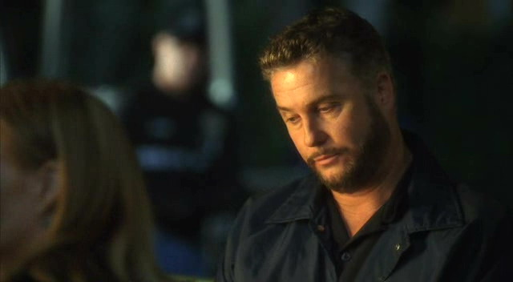
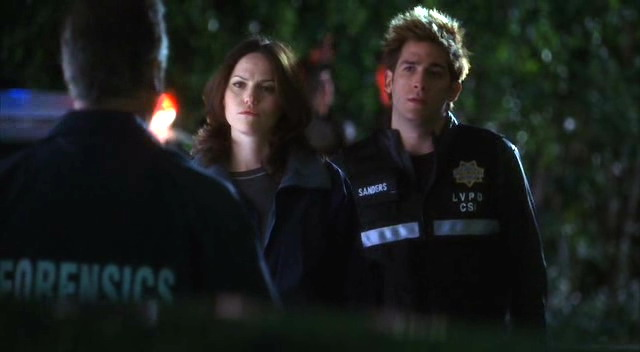
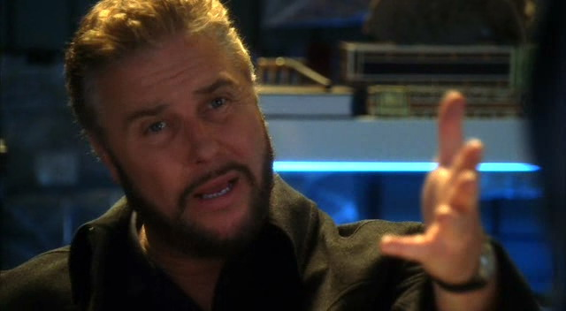
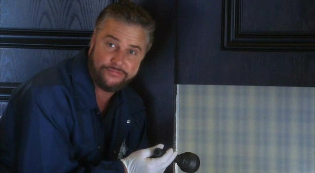

Sara对于在轮班开始时和Grissom一同走进实验室这件事感觉有些不现实。尽管Sara也习惯提早出勤，但从没有早到能和他一同步入实验室。不过，跟着他从他家来到实验室，又在他的车位旁边停了车，也只能和他一起进门了，两人心照不宣地相视而笑起来。

不过一进门两人脸上的微笑就瞬间褪去了。Ecklie正在那里等着他们。

"Gil，你来晚了。"

"我的轮班20分钟后才开始呢，" Grissom皱着眉说，"我应该说是来早了。"

"对你来说晚了，" Ecklie摇着手说，"你总是提前1小时来啊。你去哪儿了？"

"在家，Conrad。" Grissom不耐烦地说。"发生什么事了，要我提前上班？"

"高级别的案子，" Ecklie说，"Bruce Eiger的尸体刚刚在他家门口被发现了。"

"那个赌场大亨？"

"就是他。"

Grissom瞥了一眼手表说，"Well，现在还是中班当值，不是吗？你不应该和Catherine说这事儿吗？"

"她已经在现场了。" Ecklie说。

"那…?"

"我希望由你负责这案子。"

"但是，你说了…"

"我说了这是个高级别的案子，" Ecklie打断他，"我希望你来领头儿，Gil。你是高级主管，而且说实话，你办过的这类案子比Catherine要多。我不管案发时你是不是当值，或者是不是Catherine先到的现场。你来负责这个案子。我会协调的。我们需要把所有人都投进去。他们都向你汇报。"

Grissom挑起眉毛说，"Catherine不会高兴这样分派的。"

"Well，那她得自己调整了，" Ecklie说，"这并不是和Catherine对着干，但像这样的案子，我们需要最高级的主管来主导，那就是你，Grissom。"

"好吧，" Grissom说着马上进入了工作模式，"我会召集我的组员，一起去现场。"

"Good。给他们分配好任务后，来外面找我。我们一起过去。我希望咱俩一起跟Catherine解释这个情况。"

"好吧。" Grissom再次说道，万一她发飙了，两个人来承受总是好的，" Warrick和Nick跟Catherine在一起吗？"

"Yes."

"Okay。" Grissom看了看表说，"这样吧，我现在就跟你过去。Sara，你能跟Greg和Sofia说一下现在的状况吗？"

"当然。" Sara说。

"Good。带上Greg跟你一起出现场，然后告诉Sofia在这里待命。等证物回来了她立刻可以开始处理。"

"明白。" Sara答道。

Ecklie用一副好像刚看到她站在Grissom身边的表情看着她，"Hi, Sara。" 他小心翼翼地打招呼。

"Ecklie。" 她轻轻点了点头道，"我在现场跟你们会合。"

Grissom朝她笑了笑，然后和Ecklie一起离开了。Sara在走廊里迈开步子，准备开始自己的工作。好像今天的轮班会比以前的更令人兴奋。

*************

Grissom最开始的预感是正确的：Catherine对于他作为自己的主管来主导这个案子表示非常不高兴。在从Brass那里拿到了这个案子的所有案卷后，Grissom立刻越过警示带拿出了自己的工具，让Ecklie先和Catherine谈吧。他听到Ecklie在解释着，作为高级主管，Grissom会负责调查这起著名Vegas大亨的致死案。

当Catherine回到尸体身边加入到Grissom和Warrick之中的时候显然还十分心烦意乱。Grissom在心里叹了口气，知道得做点儿什么来安抚她。

"这不是针对你个人的，Catherine。" 他说。

她转头看向他，气愤以及不可置信的表情毫不掩饰地流露在脸上。Grissom在心里颤抖了一下。

"这样的案子很棘手，" 他平静地说，试着唤起她的理性。"你需要所有能得到的帮手。"

"我需要帮手，" 她几乎在甩他巴掌地说，"不需要领导。"

Grissom微微撅起嘴唇。第一轮交锋结束，两人不算是两败俱伤。不过，他有点儿担心第二轮呢。

*************

"你说真的？" Greg开口的同时，眼珠子快要蹦出眼眶了，"Bruce Eiger死了？"

“就是他啊。” Sara答道。

"你是说，Bruce Eiger被谋杀了。" Sofia说，"这人的敌人比Ecklie更多。他不可能安静死去的。"

Greg咧起嘴而Sara马上笑出声来。她要开始喜欢Sofia了。

"他不只有敌人，" Greg说，"他声称掌握了Vegas所有大人物的把柄。而且，他有一个密室。"

"他在密室里干什么？" Sara怀疑地问。

"没人知道。" Greg说，"大多数人都认为那是他用来办公的。但是，我听说这人比他的敌人有更多秘密。"

"这更好了，" Sofia咧嘴笑了笑，"现在我知道他是被谋杀的。"

"嗯，那么，我们现在得去查出他是怎么被谋杀的了。" Sara笑了笑说。

“计划是什么？Grissom的代理人。” Greg问。

"Well，Greg，既然你问起了，Grissom希望你和我去现场。Sofia，他希望你留在这里等证物回来后立刻开始处理。"

"明白。" Sofia说。然后她笑了笑，"既然我被困在实验室了，我想我可以去喝第二杯Greg的美味咖啡了。"

"Yeah, yeah，" Greg咧嘴笑起来，"我只为Sara做的。" 他朝她抛了个媚眼儿，"她是忠实粉丝。"

"Aw, thanks, Greggo，" Sara笑了笑，"我得带一杯路上喝。"

"是说我可以开车了？"

她大笑起来，"别抱太多希望。"

*************

当Sara和Greg到达现场时，Nick和Warrick已经过来迎接他们了。俩人几乎是小跑着过来，然后帮忙抬高警示带让他俩从下面钻过来。

"看到我们很高兴？" Sara开玩笑说。

Nick咧嘴笑了笑，"一贯如此。"

"我们很高兴咱们又能一起办案了。" Warrick说，但句尾带着一点点犹豫。

"但是...？" Greg催他继续说下去。

Nick和Warrick交换了一下眼神。

"我们想警告你们一下。" 最后Nick开口道。

"关于什么？" Sara皱着眉问。

Warrick叹了口气，"Mom和Dad吵架了。"

"什么？" Greg叫道，"为什么？"

"Well，Ecklie把这个案子的指挥权交给了Grissom，" Nick解释道，"但是，鉴于案发生在我们的轮班里，Catherine已经开始进行调查了。"

"直到Ecklie和Grissom到这儿，" Warrick补充道，"然后，Ecklie宣布由Grissom负责，而Catherine...厄，你们知道她会怎样。她倒是控制着自己不当场跟他俩撕破脸。"

"Ouch。" Greg说着皱了皱脸。

"Griss怎么做的？" Sara问。

"Oh，你知道Griss的，" Warrick答道，"他试图告诉她这不是针对她个人，但Cath..."

"觉得就是针对她的。" Sara轻声说着，想起了近期自己和她之间的不愉快，"现在他俩怎么样了？"

"嗯，这么说吧，" Nick说，"Grissom在检查内部而Catherine在负责外围。"

"Yeah，这说明很多事了。" Sara咕哝着，她知道Grissom和Catherine通常都是一起检查房子内部的。

"你俩在干吗？" Greg问。

"我负责尸体，" Warrick说，"不过，Griss刚刚叫我们去检查阳台。我们的大男孩儿看起来摔了一跤。"

“这样吗，” Greg说，"你们觉得他跳下来的？"

"还不知道，" Nick说，"我们正在查。" 他看了眼手表说，"我们差不多该回去了。我们消失太久Grissom会发现的。"

"他在里面？" Sara问。

"Yeah."

"Okay，那回见。" 她笑了笑，"两位，谢谢提醒。"

"Hey，我们支持你们哦。" Warrick咧嘴笑了笑，"回见吧。"

Sara咧嘴笑起来，"我觉得兴奋起来了。"

"Yeah, me, too," Nick也咧嘴笑了笑。

他们一起转头往房子的方向走去，然后在车道前分了手。Nick和Warrick进屋上了楼；Sara和Greg在开着的车库门前停下脚步。

"20块赌Grissom开的门。" Greg说。

Sara翻了他一个白眼，"好像我跟你赌似的。来吧，进去打个招呼。"

两人一起走进车库。和预期的一样，Grissom正站在门的另一边。Sara稍稍歪了下头默默说了声hello；而他朝她笑了笑。

"提问，" 在两人在他面前停下脚步后他开口问道，"你回到家；看到你丈夫躺在车道上。你会做什么？"

"这是什么陷阱问题吗？" Greg问。

Grissom朝他微微翘了下嘴角。

"停车，跳下来，跑向他。" Sara答道，认真回答了Grissom的问题。

"或者，" Grissom稍稍转向他身后的车子建议道，"花点儿时间把车停进车库并锁好？"

Sara看向Greg，而Greg耸了耸肩。

"她的车子在车库停着，还上了锁？" Sara不可置信地问。

"Yes."

"Well，也许她后来挪了车子..." Greg说着说着放低了声音，因为他意识到实际上没有什么“合适”的时机留给Mrs. Eiger把车子挪进车库了。

"所以这让她成了嫌疑犯么？" Sara问。

"她一直就有嫌疑。" Grissom明确说，"现在只是让她看起来嫌疑更重了。"

"你们知道吗，这工作真是让我对婚姻完全失去了信心呢，" Greg说，"为什么夫妻总是互相伤害？"

听了这话Sara和Grissom不由得对视了一会儿。

"有时候，他们找不到其他出路了。" Sara轻轻念道。她清了清嗓子又问，"需要我们做什么，Griss？"

"Catherine负责后院儿了；你俩负责前院儿好吗？"

"明白。" Sara说着朝他笑了笑，"回头见。"

"玩儿得开心。" Grissom朝他们沿着车道往回走的背影笑了笑说。

"我们一向如此。" Greg咧嘴笑着答道。

*************

除了车道上的一点油渍，Sara和Greg搜查前院儿的成果甚微。就连人行道边的垃圾桶，一般来说是证据宝库的垃圾桶，都是空的。

"我不懂，" Greg叹息着盖上最后一个垃圾桶的盖子说，"也许他真是自杀的。"

"也许，" Sare沉思自语，"但还是感觉很奇怪。世上这么多人，偏偏是Bruce Eiger自杀了？"

Greg耸了耸肩，"我们不知道有什么隐情。也许他饱受折磨。也许他的秘密太可怕了。"

Sara咧嘴笑起来，"嗯，那么，咱们得把这些挖掘出来。"

*************

作为负责的CSI，跟着遗体回去验尸房成了Grissom的责任。看着Bruce Eiger的尸体交到Doc Robbins手上后，Grissom便离开去找Sofia。

她正在会议室处理Bruce被发现时穿着的短裤。Grissom走进来时她抬起头。

"Hi," 她打招呼道。

"Hi，" 他回应道，"进行得怎么样了？"

"没什么进展，" 她说，"我知道这可能是个愚蠢的问题，但是，你确定Mr. Eiger掉下来的时候穿着这个吗？这上面什么也没有。"

"实际上，据他老婆说，他掉下来的时候是裸着的，" Grissom说，"事后她帮他穿上的。我相信她说的她想保护他的尊严。"

"我倒觉得从他一头扎出窗外起他就没什么尊严了。" Sofia笑了笑。

"你认识他吗？" Grissom问。

"Bruce Eiger？" 她笑起来，"No，我恐怕还没有这个荣幸。"

"Well，现在你有机会了。" Grissom笑了笑，"想和我一起去做尸检吗？现在尸体已经到位了。"

"我们不等Catherine吗？" Sofia小心地问。

"她还在现场。几小时之内应该回不来。" Grissom答道。

"好吧，" Sofia赞同道，"听起来挺有意思。"

*************

1小时候，Grissom和Sofia带着比答案更多的疑问离开了验尸房。Doc Robbins唯一能确定的就是Bruce摔下来之后死了，但掉落的冲击并没有立刻致死。他是在几分钟内被自己的血液呛死的。

两人一起走回走廊，Grissom朝Sofia轻轻笑了下。

"我很高兴你决定留下，Sofia。" 他说。

"我也是，" 她勉强回以微笑，"到目前为止吧。"

这时一阵让Grissom联想起Catherine的急速高跟鞋声打破了走廊里相对的宁静。他转过身看到她正匆匆朝他们走过来。

"谢谢你们等我，" 她说，"我尽快赶过来了。"

"我们刚结束。" Grissom轻轻说道。

"Grissom，" Catherine气愤地说，"靠！还让不让我参加这案子了？或者，我应该回我办公室看报纸去？"

"Catherine，这不是针对你。" Sofia试图缓和气氛说，"尸体已经准备好了；我们以为你几小时之内都回不来。" 她递出手中的文件，"这是报告书。"

"你别多事。" Catherine警告她说。

Sofia看了看Grissom然后走开了。Grissom看了看她离开的背影，然后转回身面对自己面前这位正在生气的女士。

"所以，这是Ecklie的命令吗，或者只是你们欠考虑？" 她问。

"嗯，听着，我道歉。" Grissom平静地说，"但，这是团队合作。"

"谢谢哈，" Catherine挖苦道，"我感觉好多了。"
 
她说完扬长而去，把Grissom一个人留在验尸房门口。Doc Robbins从解剖室走出来。

"Woman troubles？" 他调侃道。

"你知道的，我有好几个月没有研究当主管的诀窍了，" Grissom说，"我永远也不觉得由别人来负责我的案子是对我的侮辱。我没法相信她觉得向我报告是那么令人沮丧的事。她自己做主管还并没有多长时间。"

"要是你问我的话，我觉得她是觉得Ecklie认为她做的不够好。"

"但是，他告诉她了..."

“我肯定他说了，” Doc Robbins插嘴道，"但是，正如你说的，她做主管还没多久。我肯定她把这案子看做一次证明自己的机会。然后，在她能证明之前，她的机会就没有了。"

Grissom叹道，"你知道的，她是我最好的朋友之一，但是，有时候，她快把我逼疯了。"

Doc Robbins咧嘴笑起来，"祝你在这个案子上有好运。不知怎的，我觉得你需要些运气。"

"Yeah，" Grissom又叹了口气说，"Thanks。"

*************

Grissom离开了验尸房往自己办公室走去，希望能在那里找到些平静。他几乎已经跟参与此案的每个人都谈过了，而每个人对于Bruce身上发生了什么都有不同的推论。唯一没有说自己想法的人就是Catherine了；Grissom觉得她应该如自己想避开她一样，也想避开自己的。

并不是说他不想与她共事。自从她转去中班他就开始怀念与她一起查案的时光。他和Catherine从一开始入行就一直是在一起工作的。他们的个性和专业风格十分互补，这让他们成了优秀的搭档。尽管对于Catherine多少会在她的案发现场给他点脸色这点有些小紧张，但当Ecklie告诉他他们将再次一起合作时他还觉得很兴奋来着。

但是，现在...

事情没有按他预期的发展。

叹着气，他翻开了Greg给他的报告书。他肯定这里面有什么线索...他只需要找到它。

"我们有麻烦了。"

Grissom抬起头看到Catherine走进他的办公室。"Oh，no，别再来一遍了。" 他呻吟着。他还没准备好再和她吵一架。

她在他的办公桌前停下脚步然后在身前绞着手指。"我数码相机的内存卡被偷了，还被换成一张空白卡。" 她说，"只有在犯罪现场相机离开过我的视线。"

"Well，这怎么可能？" Grissom不可置信地问。他摘下老花镜看向她，"那里是有安全管理的。"

"我不知道。" Catherine摇着头说， "我查过相机和内存卡了。上面没有指纹。尸体和血液证据的所有照片都在那卡里存着呢。"

Grissom深深叹了口气，闭上眼睛靠到椅背上。"我们确实有麻烦了。"

"Yes，确实。" Ecklie在门口说道。他清楚地听到了每句话。

还真是有足够时间来应对这突发状况呢。"回现场去，Catherine，" Grissom说，"尽可能重拍一下现场。"

"厄，我知道现场已经解禁了。" 她说。

"那就*动作快*。" Grissom说着朝门口比划了一下。为啥她不赶快跑出他的办公室？她想要浪费更多时间吗？

"Okay。" 她说着转身离开了。

Grissom呼了口气。而Ecklie走进屋来。

"我虽不想说..."

"别说，" Grissom打断了他，"她是个优秀的CSI，而且你知道她可以胜任主管一职。现场有安全管理；她应该可以放心把视线离开自己的相机的。"

Ecklie盯着他看了一会儿说，"我很钦佩你愿意支持你的团队成员。"

"Thank you."

"但是，在这个案子上，我们都知道，尽管现场有安全管理，还是有出错的地方。"

"Conrad …"

"Gil，我只是想说我很庆幸由你来领导此案。"

Ecklie离开了，Grissom用手捂住了眼睛。今天的轮班会很漫长的。

*************

结果，Catherine丢了闪存卡这件事有了好的展开。在她第二次搜查现场时，她发现了前天晚上Sara和Greg没发现的东西；满满的垃圾箱。她把垃圾都带回了实验室，然后和Warrick一起筛查起来。令他们震惊的是，他们发现了Mrs. Eiger的血衣，有污点的地毯，还有，最惊喜的，一个用过的、沾了血的、成人尿不湿。从尺寸来看应该是Bruce穿的，但是，如Catherine所说，需要Mia检验一下里面的尿液来做确认。

接下来他们再次返回现场。因为需要找到地毯之前所在的屋子。Grissom, Catherine和Warrick一组。他们把地毯放到书房，对比了地毯和家具间的压痕，认定这里就是地毯所在的原始位置。然而，让他们费解的是地毯上的手印。根据地毯在房间里的朝向看，手印有一半在墙后面。

他们讨论也许地毯是其他屋里的，但Warrick觉得不对。Grissom盯着手印和压痕看了一会儿。

"想想地毯之外的事。" 最后他开口道。

"一个需要地方隐藏秘密的男人。" Catherine慢慢说道。

Grissom跪在手印旁边，先用手电照了照手印，然后慢慢往墙上照去。当他看到了墙上的缝隙时停顿了一下。墙不是实的。他在墙上推了一会儿，然后墙的一部分向旁边滑去，露出了通向另一个房间的小入口。

"找到出口了！" Warrick叫道，"厉害。"

Grissom看了他们一眼，然后沿着这个小小的通道爬进了Bruce Eiger的秘密世界。到了另一边他站起身，震惊地看着自己的周围。

Bruce Eiger最深的秘密是一间充斥着成人尺寸婴儿家具和玩具的婴儿室。Grissom回头看了看在他身旁站起身的Catherine和Warrick。他们也都一副说不出话的模样。

Warrick最先笑起来打破了沉默。大家这才发出声音。

"Wow，" Catherine震惊地说，"你以为你什么都见过了。"

"然后人们都害怕这家伙？" Warrick疑惑地问。

"想象一下他的恐惧。" Grissom说。

Warrick又笑起来。"我能打电话给Nick吗？他不亲眼看看是不会相信的。"

Grissom翻了他一个白眼，"好吧。我觉得我们需要他的帮忙。"

*************

不像他们遇到的其他奇怪的现场，尽管花了很多时间处理这间婴儿室，还是让人觉得不正常。总是怀疑离经叛道生活的Nick，看到这间屋子之后相当吃惊，用他的话说就是"真正的密室"。只有这一次，其他人，甚至Grissom，都倾向于赞同他的想法，这样的生活实在让人难以理解。

Grissom和Nick找到这家叫做Forever Baby的商店时，感觉他们对Bruce的秘密世界有了进一步的了解。他们在婴儿室找到了印着这家商店logo的袋子，所以肯定Bruce从这里买了东西。在Grissom和店员谈论幼稚症的时候，Nick在商店里转起来。他发现了一款和婴儿室里相同的玩具箱；当然了，在这家店出售的模型都是巨大化的。

他们回到实验室时，Grissom和Nick发现Sara、Greg正和Warrick、Catherine一起查看着婴儿室的照片。

"这太虚幻了，" Greg说，"我不相信这就是Bruce Eiger的巨大秘密。"

"要我说，是天大的秘密。" Warrick说，"你能想象得出人们发现这个会怎么说么？"

"你能想象有一整家商店就是为了迎合这样的人吗？" Nick问。

"你们回来啦！" Catherine叫道，"永远长不大的婴儿是什么感觉？"

"让人毛骨悚然。" Nick答道。

"挺有意思的。" Grissom说。

Warrick和Sara听了相视而笑。

"我们去逛街的时候错过了什么吗？" Grissom问。

"Well，我找回我的犯罪现场照片了，" Catherine避开Grissom的视线说道。不知怎的，遗失了她的闪存卡让她觉得很丢人。这就好像肯定了Ecklie任命Grissom领导这件案子似的。"是个恶劣的记者偷偷进到现场偷走的。"

"怎么会这样？" Grissom问。

"Brass那儿有完整的报告。" Catherine简短地说。

Grissom点了点头，明智地没有再问下去。

"然后，我们发现Bruce不仅有个婴儿室——他还有个乳母。" Warrick开口试图转变话题。

"啥？" Nick叫出声。

"一位年轻女性在帮Bruce贡献乳汁，" Warrick说，"婴儿室所有的奶都是人奶。"

这回连Grissom都露出一副震惊的表情。

"Okay，这让整件事达到了诡异的新高度。" Nick说。他清了清嗓子，想要逃离Grissom与Catherine之间的不愉快所带来的紧张感。而且他决定顺便解救一下Sara，"Hey，Sara，想给我帮个忙么？"

"当然。" 她答道，这表示她很高兴能避开不开心的Catherine。

两人一起离开屋子来到走廊。Sara朝Nick咧嘴笑了笑。

"Thanks."

"Well，我觉得你应该不想在生气的Catherine身边晃，特别是在..."

" Yeah。" Sara轻轻说。然后她又笑了笑，"那么，说真的，用1到10评分，你们这次的经验有多奇怪？"

"大约25吧，" Nick答道，"什么样的一个大男人愿意花时间假装婴儿啊？"

"一个非常奇怪的人吧，" Sara承认道，"我们要做什么？"

"我们要去看一个玩具箱，" Nick说着在从婴儿室收集来的证据中翻找起来。他递给Sara一把螺丝刀，"这个和在Forever Baby卖的玩具箱同款，不过店里卖的尺寸要大两倍。"

"嗯，他还真是喜欢他的秘密基地。" Sara说着拧开了一颗螺丝。

他们把玩具箱的一边推开显示出一个新的秘密场所——里面装满了文件。

"Whoa，" Nick说，"Bingo。" 他边看文件的名字边说，"Sy Magli … Sam Braun … Rory Atwater？"

"治安官 Rory Atwater?" Sara 吃惊地问。

"看起来是的，" Nick说，"还有一些博彩委员会委员，法官，职业运动员..."

Sara从自己那边的盒子里捡起一张放在最上面的婴儿照片。翻过来看了看。

"没写名字，" 她跟Nick说，"只写了日期：12-20-01"

他们翻了很多文件，希望找到凶手的线索——或者，至少，能找到婴儿的名字——可惜两人没能找到什么相关的东西。他们只证明了Bruce的宣言是真的：他确实掌握着Vegas所有大人物的把柄。

了解到Bruce的秘密文件对破案没有帮助，小组把注意力转移到为Bruce提供乳汁的女性身上。

*************

最后，他们推测的每个理论几乎都是正确的。妻子涉嫌其中，"babysitter"也涉嫌其中，而Bruce定性为自杀。

Mrs. Eiger，承认选择对她丈夫"不体面"的生活方式视而不见，她知道他喜欢花时间假装自己是个宝宝。他们的协议是每周四她都不在家，留他自己在家雇一个"保姆"。这个保姆就是Tanya。

在她19岁的时候成了Bruce的情人。他使她相信他想要一个孩子。作为一个容易听信人言、又急于开展自己歌手事业的女孩子，Tanya同意为他生一个孩子。然而，在他们的儿子降生不久后，Bruce就把他带走了，保证等她的事业起步、等她再成熟一些、等她准备好成为母亲后就把孩子还给她。

然后，他把她带到了自己的婴儿室。

在之后的5年里，Tanya就做了Bruce的保姆并为他提供乳汁。她做这一切都是为了希望他能把自己的儿子还回来。

Bruce死去的这天，Tanya决定自己需要拿到他的一些罪证信息。她给他下了迷幻药，然后拍下了他嗑药之后在婴儿室周围跳舞的照片。

然后，Bruce脱下衣服，沿着走廊爬上楼梯。Tanya跟着他，在他声称自己是一只鸟的时候从旁鼓励。

令她震惊的是，他把她的话当真了，然后自己以为自己会飞，就从阳台跳了下去。

Tanya盯着他残破的肢体看了30秒，然后认为自己应该离开。她离开房子，希望自己再也不用回来。

Mrs. Eiger之后不久回到家里，看到丈夫躺在门前台阶上。他那时还活着——气若游丝。她站在那里看着他死去，看着喷溅在自己鞋子上的滴滴血迹，她觉得自己自由了。

待他死后，她脱下他的尿不湿帮他换上内裤，然后清理了房子里所有能显示他"另一种"生活的痕迹：尿不湿和那块地毯。

他们三人之中，有两个都想要Bruce Eiger死去，这个Vegas最令人害怕的男人。

*************

"Wow，" Catherine和Grissom、Brass一起离开审讯室时说，"我...只能说...wow。"

"同意。" Brass说，"Hey，听着，你俩想去喝一杯吗？"

"Yes。结了这案子，咱们得去喝一杯。" Catherine深有感触地说。她几乎是有些紧张地看了看Grissom问，"Gil？"

他笑了笑。如果她想和好，他当然欢迎。"当然好。"

"Great，" Brass笑了笑说，"为了纪念Bruce Eiger，咱们奢侈一下。一小时后在the Bellagio见面如何？"

"好。" Catherine咧嘴笑了笑。

"好的。" Grissom也同意道。

"Great。" Brass又说，"那我们回头见。"

“你想先回实验室去吗？” Catherine问。

Grissom点点头，"我需要从办公室拿点儿东西。"

"那咱们走吧。"

*************

回到实验室之后，Grissom直接回到自己的办公室。他准备拿一些需要的文件，然后在离开前和Sara说声晚安。显然，她和他心有灵犀。

"Hey。" Sara笑着走进Grissom的办公室。

"Hey，" 他咧嘴朝她笑了笑。"你还好吗？"

"应该是我问你才对，" Sara说，"这案子太诡异了，但是我觉得我要面对的还没有你一半多。"

Grissom耸了耸肩，"司空见惯了。"

"不管怎么说..." Sara顿了顿咬了下嘴唇，"你想到我家坐坐么？我想我们可以...看看电视放松一下什么的。"

"好啊，" Grissom答道，"我晚点儿到可以吗？"

"可以。不过为什么？"

他抱歉的笑了笑，"我答应Brass和Catherine跟他们一起去喝酒了。Catherine觉得结了这么个案子我们应该去喝一杯，不过，说实话，她还愿意和我喝酒我还是挺高兴的。"

Sara咧嘴笑了笑，"Yeah，去吧。你随时来我家都可以。你知道的，到明天早上我都睡不了呢。"

"Well，这时间安排得有道理，不管咱们几点下班都能对应上。"

"我就是这么想的。"

他笑着拉起她的手，温柔的握了握，"我过去的时候给你打电话，好吗？" 他轻声说。

Sara点点头。"我们一会儿见？"

"一定。"
