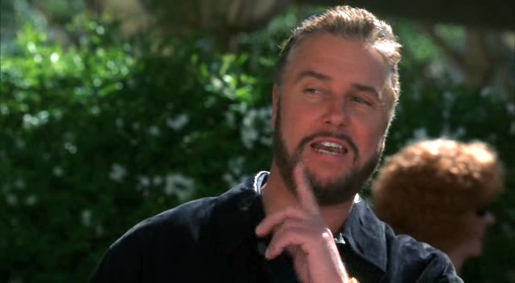
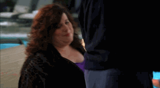
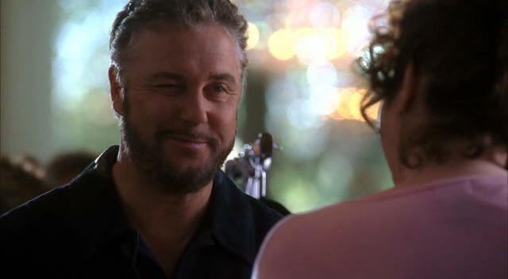

Grissom在自家床上，把Sara压在身下，漫无目的地亲吻着她。放开了她的唇，又吻上她的脖颈。他的胡须搔痒着她的皮肤，令她咯咯笑起来。她的手从他的肩膀滑到他的胸膛，再往下滑到他的肚子...手指解着他牛仔裤的扣子，然后她的手...

铃...

靠，Grissom醒来后猛地从床上坐起来。花了好一会儿他才意识到是手机在响。心里又骂了一句，他拿起了这个乱叫的鬼东西。

"Grissom。" 他几乎没好气地接起了电话。

"Hey, Grissom, it's Brass. 你还好吗？"

"Yeah，我很好。" Grissom说着用手捂住脸。"抱歉，Jim。只是你吵醒我了。"

"哦，我也很抱歉。" Brass答道。"抱歉我得告诉你我需要你提早上班了。"

Grissom呻吟道，"发生什么事了？"

"我们在woods发现了一具布满大量虫子的尸体。我知道这案子应该找Catherine，但她在城那边有件4-19要办了。再说，你是昆虫专家。你介不介意...?"

"我去哪儿找你？" Grissom叹了口气道。

记下了必要信息后，Grissom从床上爬起来去冲了个澡。看来又是漫长的一天了。

*************

Grissom在前往犯罪现场的途中突然想起时间问题。他在这里待不了太久；因为自己的轮班快开始了，所以他得尽快回城。知道Catherine正在着手另一件凶杀案，于是他掏出手机按下了Nick的通话快捷键。电话响了两声后被接了起来。

"Stokes."

"Hey, Nicky, 我需要你帮忙。"

"我能帮你点儿什么？"

"Brass让我到woods去调查一具尸体。我现在在去的路上了，但我想起来我马上得回实验室开始我的轮班。所以，你能过来接手这案子吗？"

"没问题。"

"Thanks, Nick。我会做归档并开始昆虫鉴别，不过之后就都归你了。"

"明白了。" Nick同意道，"我去哪里找你？"

交代完相关信息后，Grissom挂上电话。这比他预想的要顺利得多。

当Grissom到达现场时Brass和David已经到了。在David检查尸体的时候，Brass跟他说了些目前掌握到的有限情报。然后Grissom和David一起开始收集那些在尸体上爬动的虫虫。

"Hide beetle。" Grissom说着，从这位倒霉男性脸上捡起一只昆虫，"这人在这里至少有两周了。"

David一边检查受害者的口袋一边说着没有找到什么身份证明；而Grissom指出，既然没留下驾照，为什么还要毁掉他的脸呢。David结束了他的检查后就站起身准备离开了。

"他归你了。" 他说道。在离开的时候，他差点儿撞上Catherine，"Hey, Cath." 他打招呼道。

"Hey。" 她一边回应一边朝尸体走过来。"Grissom。"

Grissom听到她有些激动的声音后，抬头看了看她。

"我们怎么说的来着？现在你都是在我之前来我的现场？"

"你不是在城北调查4-19吗？" Grissom问。

"我觉得你是想我了。" Catherine仍然气呼呼的说。

"我只是收集一下证据，然后就走。" Grissom说着抬了抬手，然后转身继续给受害者拍照。

幸运的是，尸体的状态分散了Catherine的注意力。到Grissom准备离开的时候，她正全神贯注于案子本身。

"Oh，顺便说一句，我叫了Nick来接手。" Grissom说，"我不知道你会来，而我需要回实验室开始我的轮班了。"

Catherine耸了耸肩，"Okay. Thanks。"

"不客气。"

Grissom爬进自己的SUV，稍感宽慰地叹了口气。他能理解Catherine为什么要来，但她担心自己抢她位子的恐惧感刺痛着自己。

总而言之，他等不及要回去实验室见自己的组员了。

*************

"Hello."

"Hey, Griss."

"Hi."

Sara和Greg都从休息室自己的位子上朝Grissom笑了笑。他手里拿着任务分配单，也面带微笑地走进屋。

"今晚只有一个案子，" 他说，"在Tangiers发现了一具死尸。Greg，你和我出现场。Sara，你的加班超时了，所以你在这里待机，等我们回来处理证物。"

"好的。" Sara和Greg异口同声道。

"你俩真的不能再花那么多时间在一起了。" Grissom笑道。

俩人听了相视而笑。

"So，Griss，尸体是在哪里发现的？" Greg问道，"公共空间还是客房？"

Grissom看了一眼手里的信息答道，"客房。"

Greg眼睛一亮，热切地问，"妓女诈骗案的可能性有多大？"

"万事皆有可能。" Grissom摇摇头说道。

"自从第一天出外勤开始他就在期待了，" Sara告诉Grissom，"可惜，不凑巧，幸运一直没有降临到他身上。"

"Well，Greg，谁知道呢？" Grissom说，并强忍住不笑出声来，"也许今晚你就走运了。"

"只是时间问题。" Sara夸张的叹道。

Greg咧嘴笑起来，"你们不用把我说得像个怪人吧。"

"Hey，Greggo，我们看到怪人的时候才会叫他们怪人的。" Sara笑着站起身，"我去忙我之前那个案子了。等你们处理完现场我再来找你们。"

"回见。" Greg愉快地说。

"Bye。" Grissom笑着和她道别。

Sara朝他笑了笑，然后离开了休息室。她往DNA实验室走去，准备去看看Mia那边出没出自己正在等的结果，这时她看到Nick正在会议室里。于是她笑着走过去打招呼。

"Hey。" 她在门口愉快地说。

"Hey，Sara。" Nick咧嘴笑起来。"你怎么样？"

"不错，" 她笑了笑回答，"你呢？"

"忙啊。" 他答道。

"一贯如此哈，" Sara说着朝他走近了些，她看了看铺满衣服的桌子问，"现在在忙什么？"

"我们在woods发现的的受害者没有脸了，" 他说，"根据Grissom和昆虫的推测，他在那里至少有两周了。我们正在尝试查出他的身份。"

"听起来挺有意思。" Sara说，然后她轻轻皱了下眉，"等等。Grissom什么时候有时间检查你的昆虫了？从我们轮班开始他就在呀。"

"据我所知，Brass因为那些昆虫活动的迹象把他叫到现场了。他还说Catherine正在办其他案子。Griss就过去采个证，和虫虫玩儿上一会儿，然后他再回来和你们一起开始轮班。也因此他给我打了电话。所以，我也急急忙忙赶到那里，想着我得换下他来，结果发现Catherine已经在那边了。" 一丝烦恼的表情在Nick脸上闪过，"不是我讨厌这工作，也不是不喜欢和Catherine一起，但这很奇怪不是吗？要是她已经接了这案子，他为什么还叫我？"

"也许她需要帮忙？" Sara猜测道。

"也许吧。" Nick怀疑地说，"但是，据我看，他好像不知道她过去了。" 他叹道，"我知道我应该为Catherine终于晋升为主管而高兴，但是，真的，我怀念以前咱们在一个小组办案的日子。"

"Yeah，" Sara同意道，"我也怀念。"

这时Nick的手机响起来，打断了两人的谈话。他拿起电话看了看屏幕上显示的信息。

"我得走了，Sar，" 他说，"Doc Robbins准备好验尸了。" 他顿了顿又说，"我们之后再聊聊好吗？"

"Yeah，" Sara同意道，有点儿惊讶他还想要继续这个话题。"我整晚都在。我又加班超时了，所以Grissom让我在这边待机，而他和Greg出现场了。"

Nick咧嘴笑起来，"就猜你会这样。"

"就这样啦，" Sara咧嘴笑道，"和你的尸体愉快地玩耍吧。"

Nick大笑着摇了摇头，"回头见。"

*************

"Hey，Sara，我有好东西给你啦。"

Sara从她拿来消磨时间的报纸上抬起视线来，看到Greg拿着证物袋走进休息室。

"Oh?"

“Grissom希望你处理一下我们受害者的床单。”

"Okay。" Sara说着从他手里接过袋子。她咧嘴笑道，"那么。是妓女诈骗案吗？"

"悲剧啊，不是。我再一次被妓女诈骗的案子拒之门外了。"

"总有一天，Greg，你会遇到的。" Sara睿智地点点头保证道。

Greg朝她做了个鬼脸，"你挖苦够了吗？"

"怎么啦？有急事啊？"

"说实话，是的。" Greg说，"我得去查酒店的监控录像了。"

"等等，你去之前先告诉我。你和Griss是怎么想这案子的？"

Greg笑了笑说，"我们的受害者看起来是在享受了一晚激烈的性爱之后窒息死亡的。"

Sara听了挑了挑眉。

"我得说，桌子都裂了那够激烈了吧。" Greg说。

Sara笑起来，"屋里有张裂了的桌子？"

"Oh, yeah。总之，他是在床上被发现的，呈现窒息的样子。我去查一下录像带看看他在酒店里和谁在一起。"

"知道他为什么在镇上么？"

"他在赌博，和其他在酒店的人一样，不过他还有张参会证。Vartann正在查。"

Sara点点头说，"Okay。我来看看能从床单上找到什么。"

"玩儿得开心。" Greg笑了笑。

"你懂的。"

*************

"Okay，" Grissom看了看他手里的笔记皱了皱眉说，"来说说我们知道的情报。"

休息室桌边，Greg和Sara都坐在他身旁聚精会神地看着他们的主管。他们把文件夹摊开在面前，准备捋清他们的受害者身上都发生了什么。

“Maurice Hudson被发现死在了自己酒店房间的床上。是由保洁人员在早上发现的，但Doc Robbins说他是在晚上死亡的，可能是在9点到午夜之间。尸检表明是压迫窒息。在尸体身上、附近都没有发现重物，所以推测是凶手离开时带走了。尸体上留下的唯一证据是一点紫色纤维。”

"Hodges确认那是真丝。" Sara开口道，"颜色很独特，但他只能查出这么多了。"

"跟我们说说床单。" Grissom说。

Sara点点头说，"我发现了大片不正常的汗渍。已经采样交给DNA和痕检了。还发现了性爱的痕迹；DNA证实精液是受害者的，他的女伴还不能确定身份。"

Grissom点点头问，"监控录像？"

"没有发现线索，" Greg答道，"到目前为止，我跟着受害者转了酒店的很多地方，但他一直是一个人。"

"嗯，他是在某处遇到某人的，" Grissom说，"且不说他屋里有女人存在的证据，他也不能把自己压死再把那个超重的东西从自己身上移走。"

Sara用手梳了梳头发，然后抚着脸说，"这案子真让人火大。"

"答案就在那里，" Grissom说，"我们只需要找出来。"

"我们需要另一条线索。" Greg说。

如接到暗示般，Grissom的电话响起来。他拿起电话翻开盖子接听起来，"Grissom...Okay...Yeah，我们和你在那边见...Thanks。" 他合起电话然后朝他的组员笑了笑，"Well，看来我们有你要的另一条线索了，Greg"

"是什么？"

"Mr. Hudson在Tangiers出席了一个活动。Vartann查出了是哪一个。他说在那边和咱们汇合。"

Sara叹了口气说，"Well，玩儿得开心，别带我。"

"Aw，Sara，行啦。" Greg咧嘴笑起来，"你知道不带你永远没有任何乐趣的。" 他从椅子上站起身然后朝屋外走去。"我在车子那边等你，Griss？"

"Yes。" Grissom同意道。

Greg朝Sara挥挥手就离开了。她朝他的背影笑了笑。

这时Grissom靠过来说，"他说得对，你知道吗。没有你没有任何乐趣。"

Sara瞬间觉得自己的脸颊热起来，"没有你这边也没什么意思。"

他把手放到她的大腿上拍了拍，"我们等下看能不能改善一下，okay？"

Sara咧嘴笑着把手放到他的手上，温柔地捏了捏，"最好这样。"

Grissom一边咧着嘴笑，一边觉得自己也有些脸红起来，他不情愿的把手拿开然后站起身准备离开，"发现什么有趣的事我们给你打电话。"

"那有什么好？我还是被困在这儿的。"

他笑了笑，"Well，那么，我们回来给你讲一遍所有令人兴奋的发现。"

"Thanks。" 她边说边挖苦地朝他笑了笑。

Grissom轻笑着离开了。他和Greg还要在活动上来个约会呢。

*************

当Grissom和Greg到Tangiers的时候，Vartann正在大厅等他们。他朝他俩笑了笑。

"Hey, guys."

"Hi。" Grissom回应道。

"这边。" Vartann说着领他们走向扶梯。

"这个活动还在进行？" Greg问。

"Oh，yeah。" Vartann轻笑道。

Grissom和Greg莫名其妙地对视了一眼。

"这可能是我碰到的最容易查的事情。" Vartann说。

"为什么这么说？" Grissom问。

"这周末Tangiers只有一个活动。" Vartann说。

这时他们都顿了下，盯着对面扶梯上一个戴着与会名牌的女人看。她非常胖，而且穿了件让他们说不出话的T恤衫。Vartann和Grissom都挑了挑眉毛。

"那名牌是不是和被害者衣服上发现的一样？"Vartann说。

"Well，那样的话就好办了。" Grissom说。

"Yeah，" Vartann同意道，"Well，咱们也加入他们吧，怎样？"

"那是个什么活动？" Greg问。

"一个关于肥胖的活动。"

Greg和Grissom听了都一怔；他们的受害者可是很瘦的。

Vartann带他们来到泳池区域，这边正有一群胖人在开party。即使是Grissom和Greg，受过训练的观察员，仍然饶有兴致地环视起四周。

"这是个‘小猪和小牛’的聚会，" Vartann轻声说，然后他轻笑了下，"Hudson根本不胖；他到这儿来干嘛？"

"也许他以前很胖。" Grissom猜测道。

"或者，也许他喜欢胖子。" Greg提出自己的观点。

Grissom吃惊地看了他一眼。

"有些男人喜欢曲线嘛。" Greg耸了耸肩。

"喜欢曲线啊，那些都曲成卷了。" Vartann说，"听着，你们好好享受吧。城那边还有件杀人后自杀的案子等着我。"

Vartann离开了，而Grissom和Greg又朝四周看了一会儿，观察着party上人们。

"有什么沉重的东西杀了我们的受害者。" Grissom说。

"沉重的东西，沉重的人。" Greg说，想知道这群人里是否有谁有力量举起足够压死Maurice Hudson的东西。

"把照片给接待人员看看，" Grissom说着，递给Greg一张放大的Hudson的驾照影印本，"谁知道呢？也许他喜欢胖女孩。"

"你去哪儿？" Greg问。

Grissom朝party的方向咧嘴笑了笑，"我要去跳舞啦。"

轻笑了一声，Greg往酒店方向走去。Grissom走进人群中，时不时停下来询问有没有人能认出Maurice的照片。尽管没人能认出来，他的时间也不算完全白费——有个女人在她的黑色开衫上衣下面穿着一件紫色真丝的胸衣。注意到这个之后，他的视线滑落到她的胸部，而她朝他咧嘴笑起来。

"发现什么你喜欢的东西了？" 她托了托自己的胸部问道。

Grissom稍稍后退了些，举起一只手像是要阻止她进一步的友善。"我很抱歉。我...嗯...我注意到你穿了件可爱的紫色内衣。"

"我在聚会上买的，honey。" 她说道。

"是吗？" Grissom问道，很高兴能得到这个消息，"Thank you。"

他从她身旁走过，思维已经跳跃到缩小嫌犯范围上了，然后他就感觉到这女人一巴掌拍在他屁股上。他停下脚步，惊恐地转过身盯着她看。

"Fat girl, gay guy," 她轻耸了下肩膀说道，"也不是没听说过。"

Grissom用一副好像她发疯了似的表情看了看她。然后迅速走开了，生怕她再进一步向自己表达她的意图。

他来到屋里的活动大厅。看到Greg在留言板附近一边和一位女性说话一边记着笔记。知道他的年轻同事自己能够搞定那边，于是他往贩卖店那边走去。

在查看了几家店铺的商品后，Grissom终于找到了贩卖紫色真丝内衣的小店。店员见他摸了摸其中的一件来确认是不是真丝的，便走了过来。

"你是个讨人喜欢的家伙。" 她的声音里带着一丝温和，柔软和诱惑。

"Excuse me?" Grissom放下手里的内衣抬头看向她。

"你有取悦女人的所有东西。" 她轻抚着自己的下巴说。

"真的？" 他笑了笑，然后瞥了一眼她的名牌，"Regina。" 他想也许他应该顺势跟她调个情——可能会有帮助的。"嗯...我能问问你，这是真丝的还是人造的么？" 他再次拿起那件内衣问道。

"那是百分百真丝的。" 她答道。

"你卖了多少件？"

"4件定制，15件预售，" 她说，"我还给我自己留了一件呢。" 她边说边把自己外衣的领子掀开了些让他看自己的内衣，"男人喜欢紫色。"

"真的？" Grissom热切地问。

"看过purple rain吗，" 她解释道，"Prince … 性感...定制的颜色，" 她又问他，"你想给妻子买么？"

"我还没结婚。" 他简洁地答道。

"女朋友？" 她又问。

"Nope。" Grissom又说。他在心里笑了笑。Sara还是他秘密的、没确定关系的...好吧，她几乎是他女朋友了。不过，现在他是在和掌握了他需要的证据的女人聊天...

"你想要一件么？"Regina用一副沙哑的嗓音问道。

"Yes, I do。" Grissom咧嘴笑着朝她挤了挤眼睛。而且我已经选好了，他心想。"我还想要你所有顾客收据的副本。"

（译者：不行了，Grissom，真想把你吃了...）

Regina听了吃惊地看着他，"啥？"

Grissom笑了笑说，"我是犯罪实验室的。我们正在调查一起谋杀案。和受害者一同被发现的有和这一样的紫色纤维。" 他又拿起那件内衣，"在他身上。我只需要知道都有谁可能穿了这种定制颜色的衣服。我能看看那些收据吗？"

Regina站直身子说，"为了这个你跟我说这么多有的没的。"

Grissom差点儿笑出声来，"相信我，我做过更差劲的事。"

她看了他一会儿，然后笑了笑说，"我喜欢你，我会给你那些收据。另外，如果你还有什么需要的，可以告诉我。"

*************

Regina提供的收据让他们找到了在Maurice死亡时买了这款内衣并且仍在镇上的5位女性。她们都被叫到了警局，由Sara负责收集她们的DNA样本。

开始时，她们不愿意提供任何东西，觉得自己被歧视了，不过最后还是同意了。Mia做了测试并找到了两名嫌犯：Brenda Morgan，曾向Greg承认她见过死者，但不认识他；还有Regina Owens，Grissom的店员朋友。

"Okay，" Grissom待两名女性分别被安排到不同的审讯室后说，"我来询问Regina吧。我们有段历史。"

Sara挑了挑眉，"Oh, 真的？"

Grissom笑起来，"我在活动上和她聊过。"

"Well，我来询问Brenda。" Greg自告奋勇。

Grissom摇了摇头说，"她已经骗过你一次了。Sara来吧。"

"Oh，好吧。" Greg叹了口气。

"Hey！" Sara叫道，"我可被困在实验室好几年了。让我享受点儿这案子的乐趣啊。"

Greg咧嘴笑起来，"如您所愿，Sensei。"

Sara大笑起来，而Grissom翻了他一个白眼。

"Okay。Greg，回实验室继续查监控录像。Sara，完事后我在外面等你。"

"好的。" 两人一起说道。

Grissom又摇了摇头，"说真的，两位——别老待在一起了。"

两人笑着分头去完成各自的任务了。

*************

当Sara回到大厅时Grissom已经在等她了。他朝她挑了挑眉，而她摇了摇头。

"准备好了？" 他问。

"Yeah。"她答道。

两人一起往外朝他们的SUV走去。Grissom帮Sara拉开副驾驶座位的车门，又待她坐下后把门关好。她看着他坐进驾驶席朝他笑了笑。

"Thanks。" 她说。

他也笑了笑说，"不客气。"

Sara任由自己迷失在他的双眼中一小会儿，知道他也迷失在自己的眼里。"我们也不是非得直接回实验室去，对吧？" 她低声说道。

"我们还能去哪儿？" Grissom问。

Sara用手在他大腿上上下蹭了两下，"我们真的不需要离开这辆车子。"

"Saraaaa。" 他低语。

"怎么？" 她也低语着，并探身跨过车子的中控台，在嘴唇几乎要碰到他的唇时停住。

"有人会看到我们的。" 他往后退了退说。然后他把手垂下来覆到她的手上握了握，"我太想现在吻你了，但是，我们只是..."

"不能。" 她叹道。

"Yeah。"

Sara抽回自己的手然后坐回自己的位子，脸朝前方骂道，"这破工作。"

Grissom笑着把车子倒出停车场，"要不是因为这工作，我们永远不会认识啦。"

"有道理。" 她咧嘴笑了笑。

他叹了口气说，"我们得谨慎点儿，你懂的。"

"我懂，" 她说，"我真的懂。我不想做任何会害我们丢掉工作的事。"

"或者影响咱们组。" Grissom补充道，"我们如履薄冰，Sara。我们得确保没人发现我们在做什么，否则咱们会有很多麻烦的。"

"我知道。" 她再次说道，然后她咬了咬嘴唇，"你确定要这样吗？最终，Griss，我想比起我，这更会危及你的职业生涯。你确定...我们的关系...是个好主意吗？"

这时他们正好遇到红灯停下来，他转过头看向她说，"我确定这是这么多年来我做过的最好的决定。"

Sara有些脸红的笑了笑说，"我也是。"

Grissom把车开进停车场并在车位上停好，然后问道，"我们走吧？" 

"我们走吧。" Sara咧嘴笑了笑应道。

他们一下车，调情的气氛就全然消散，换上了审讯过后特有的平静气息。Grissom替Sara拉开实验室的大门，不过这并没什么稀奇的；他总是会为她或Catherine做这样的事。

"那么，Regina都告诉你什么了？" 她问。

"她承认和死者有过性行为，" Grissom答道，然后他咧嘴笑起来，"Greg要是知道就是她把桌子弄裂的话会兴奋死吧。"

Sara听了咯咯笑起来。

"她说她是7点左右在房里的，发生关系之后就离开了。让我强调一点，她声称在她离开时受害者还活着。"

"嗯，这和Brenda告诉我的也吻合，" Sara说，"她说她知道他和另一个女人发生过关系。她是在Regina离开后到他房间的。"

"Hm."

"她还说是她杀死了他。"

Grissom一脸惊呆了的表情停下脚步，"啥？"

"Well，别太激动。" Sara说道，"Brenda Morgan说她用枕头捂死了受害者。"

"他是被枕头杀死的？" Grissom说，"COD是压迫窒息呀。"

"她承认有罪，但她在隐藏什么。" Sara说。

"也许她在维护什么人。" Grissom猜测说。

"我们知道Regina Owens到过那房间，" Sara说，"她说她离开时受害者还活着，而Brenda支持她的说法..."

“Yeah，” Grissom怀疑地说，"但是她在说谎。"

"至少我们有两名嫌犯了。" Sara说。

Grissom笑了笑，"你去确认一下如何？"

"Huh?"

"去A/V实验室帮帮Greg。确认一下两位女士是不是在她们说的时间点进出了受害者的房间。"

"我这就去。" Sara说。

*************

Sara如约来到A/V实验室，而Greg很高兴自己有伴儿了。他们看到两位女士在电梯里碰了面——如Greg指出的那样，那一定挺尴尬的。

"她是几点离开的？" Sara看到Brenda走出电梯问道。

"一整晚，" Greg有些不可置信地轻声答道，"她直到第二天早上才离开的。" 他回头看了Sara一眼，见她也正一脸狐疑地看着自己。

"Doc Robbins 推测受害者是在晚上9点到午夜之间死亡的。" 她说。

"这么说她和一个死人睡了一晚！" Greg叫起来，"她不只是凶手，她还是恋尸癖。所以我就说你会发现工作的乐趣的。"

"等等，等等，" Sara强忍着笑意说道，"倒一下带，please。"

Greg把录像倒回Brenda独自在电梯里的影像。

"这里，" Sara说，"停。"

Greg停止倒带，然后他们看到Brenda在电梯里跌跌撞撞的样子。

"她醉了，" Sara说，"也许她昏睡过去了。"

"你得醉成什么样才能睡在一具尸体旁边啊？" Greg问，"那气味就跟闹钟似的。"

"在他旁边，" Sara叨念着，突然转向Greg，"在他上边。"

Greg转头看向她的眼睛，"等会儿...你是说...?"

“Yes，” Sara说，"你等会儿，我跟Grissom说一下。"

Sara从自己的位子上跳起来急匆匆地跑出屋子。她走到Grissom的办公室，见他正坐在自己桌前。

"Hey。" 她敲了敲敞开的门板打招呼道。 

"Hi，" 他笑了笑，"进来吧。"

"我有个推理。" 她直奔主题。

"Okay。说来听听。"

"我认为Brenda去受害者房间的时候醉得非常，非常厉害，" Sara说，"我想她确实和他发生了关系，但随后在他身上昏了过去。我认为她就是导致死者压迫窒息死亡的重物。"

Grissom摘下他的眼镜，慢慢说道，"Well，咱们得证明一下这是否可能。"

"怎么证明？" Sara问道。

"首先，看看你能不能从床单上提取足够的汗液去做一下毒性分析。这样能证实她是否喝醉了。"

"Okay，" Sara同意道，"但是，我猜还要有别的。"
"
"Oh，是还有别的。"

"那是...？"

Grissom咧嘴笑了笑，"砝码，假人，滑轮...还有Greg。去找他然后到车库和我碰面。Oh，还有...让他换上工作服。"

Sara咧嘴笑了笑就返回A/V实验室找Greg了。能像这样做实验正是她从这份工作中得到的莫大乐趣。

*************

当Sara和Greg来到车库时，Grissom已经准备了一个床垫。一个假人躺在上面，并且被绑在滑轮上。

"Good，你们来啦，" 他笑了笑说，"Sara，帮我装一下砝码好吗？"

"Okay。" 她边说边拿起一个砝码装置起来。

"Okay, okay，等会儿，" Greg说，"我觉得我能看出之后事情的走向了，而且我不是很喜欢诶。"

Sara笑起来，"Come on, Greg。你对科学的好奇心去哪儿了？"

"我想是在我决定今天要活着离开工作岗位的时候把它丢了，" Greg说，"你俩不是来真的吧？"

"我们需要证明Sara的理论，Greg，" Grissom说，"你和受害者的身高体重都很相似。这是能查出他身上到底发生了什么的最好方法。"

Greg叹道，"难道我说服不了你们叫Nick或Warrick来执行这个上好的计划吗？"

"Nope，" Sara咧嘴笑起来。"跟你说。要是你乖乖配合我做实验，下班我请你喝酒。Deal？"

"Oh，好吧。" Greg不情愿地同意。

"再上一个砝码。" Grissom说。

Sara点了点头又装了一个砝码。

"这玩意儿有多重？" Greg看起来一脸紧张地问。

"现在是240磅，" Grissom说，"我们会逐渐加重直到你动不了。"

"我举不起来那么重的东西，" Greg说，"那么，如果我不行，你也不行啊。" 他指着Sara补充道。他又看看了看走到他身后的Grissom。"这是安全问题。"

"Well，这就是滑轮的作用啊，Greg。" Sara说，"So，放松点儿躺下。"

Greg抬头看了看滑轮，然后爬到床垫上，"你知道吗，这就好像我以前做过的一个梦，" 他看着Sara说，"除了...不是在车库里。而且，Grissom也没在看。"

Sara使劲忍着不要笑出来。

"那是个不一样的梦。 " Greg又说。

Sara要是不咬着牙可能就要笑出声了。

Grissom用滑轮吊起假人，然后小心地把它移动到Greg的位置。想到Greg做了些关于Sara的美梦让他的血压有点儿飙升...

他用假人压住Greg，害他轻声呻吟起来。

"感觉怎么样，梦想家？" Sara问。

"就像是个240磅重的真女人。" Greg答道。

"你呼吸觉得怎样？" Grissom问。

"到极限了。" Greg说着，把假人推开并坐起来。

"Okay，再加40磅。" Grissom说。

Sara眨眨眼并点了点头。她又在假人上加了个砝码，而Greg也又躺回到床垫上。

Grissom再次把假人移到Greg身上，压得他好像已经吐出了肺里的所有空气。Grissom和Sara讨论了几句他的位置和受害者是一致的，而另一边Greg已经开始疯狂地挥起手来。

"Hey – guys – help。" Greg喘着气叫道。 

"Oh。" Grissom说着把假人从他身上拉起来。

"280磅。" Grissom在Sara把假人移开Greg身体时说。

"Brenda一定是对此难以启齿。" Sara说。

"嗯，我很高兴我们证明了你的理论，" Greg说着一边揉胸口一边站起来，"现在，说到喝酒..."

"下班请你，" Sara保证道，"我得先去做个审讯。"

*************

了解到Sara现在已经知道她当晚醉得不省人事、并且推测出了Maurice Hudson的死亡过程，Brenda承认了事情的经过。她当时确实是在Maurice身上昏了过去，结果误杀了他。她发誓自己捏造说是捂死他只是为了自己的脸面。她告诉Sara自己宁肯进监狱也不愿成为别人的笑柄。

Sara离开了审讯室，并为Brenda感到难过。她决定之后去找DA为她说些好话——在私下里。不过这都要等到明天了。今晚，她欠Greg一杯酒呢。

Sara在休息室找到了正和Nick、Warrick在一起的Greg。见她走进来他立刻眼里一亮。

"Hey！他俩想跟咱们一起去。okay吗？"

"太好了。" Sara笑了笑，"我先跟Grissom汇报一下审讯结果，然后我就可以走了。"

"我们在停车场等你。" Nick说。

Sara点点头便往Grissom的办公室走去。见她走进门，他朝她笑了笑。

"进展如何？"

"她承认了咱们的推测是对的。" Sara说，"她编了一个故事因为觉得事实太丢脸了。我想之后去找DA为她说点儿好话。"

Grissom点点头，"应该没问题。这不是什么高级别的案子。"

"希望你是对的。"

他又点点头，"那么，你要走了么？"

"Yeah。我还欠Greg一杯酒呢。"

Grissom笑了笑。"Well...要是你觉得和Greg玩儿腻了，给我打电话。"

Sara挑起一边眉毛笑道，"这是个邀请么？"

"Yes。之后你想过来吗？"

她点了点头，已经又开始感到自己脸颊发热了。"我愿意去。"

"Good。你离开Greg以后给我打电话。"

"我会的。" 她保证道。"回头见。"

他笑了笑说，"我等你。"

Sara面带笑容地离开了Grissom的办公室。走到停车场时她只希望自己看起来收敛些了，而Nick和Warrick正在那儿争论由谁来开车。

"你输了，Warrick，" Nick大笑道，"剪刀赢了布，okay？你来开车。"

"发生什么事？" Sara问。

Greg笑道，"Nick和Warrick在争论今天晚上谁得保持清醒。"

"我来吧，" Sara说，"喝吐了都没关系，boys。"

"你确定，Sara？" Nick问道。

" Yeah，" 她说，"不过，下次我喝醉了得有人送我回家。"

"没问题，" Warrick咧嘴笑起来，"Thanks。"

"不客气。"

他们都爬上Sara的Prius，然后她载着大家来到他们最喜欢的当地酒吧。他们立刻就找到了位子。Sara点了可乐而其他人点了啤酒。下单的时候女服务生同情地看了Sara一眼。

"今晚你当保姆吗？" 她问。

Sara咧嘴笑起来，"看来是的。"

女服务生严肃地看了坐在Sara身边的Nick一眼，"你应该给你女朋友找点儿乐子。"

"Oh, 他不是 –"

"她下次会有乐子的。" Nick咧嘴笑着伸开胳膊环住Sara。

女服务生摇着头离开了，然后Sara转头看向Nick。

"我现在是你女朋友了，哈？"

Nick咧嘴笑了笑，"为什么不呢？还记得猫王想撮合咱俩结婚吗？"

Sara大笑起来，"抱歉哈，不过我可不想和愿意让猫王给主持婚礼的男生约会。"

Nick大笑着收回自己的胳膊，"相信我，darlin'，我会给你个最棒的婚礼的。"

这时女服务生带着他们点的饮料回来了，而Sara有些脸红地摇了摇头。

"Well，咱们干杯吧，" Warrick边说边举起自己的酒瓶，"敬我们可以一起喝酒，即使我们不在是同一组了。"

他们碰了碰杯然后都喝了几口。这时Sara瞥到Nick叹了口气。

"之前我还和Sara说来着。" 他开口道。

"说什么了？" Greg问。

"说我们不再是同一个组了，" Sara说着难过地笑了笑，"我想念和你们一起工作的日子。"

"我们也很想你们的。" Warrick说。

"不过，不止这些。" Nick说完稍微顿了下，"我爱Catherine，而且我们都是如此，对吧？"

大家都出声表示赞同。

"Well，只是..."

"说吧，Nicky。" Sara鼓励他道。

Nick叹了口气，"我不知道该怎么说。就好像她觉得她必须要和Grissom竞争谁才是最好的上司。"

"什么？" Greg皱了皱眉。

"我能觉出来，" Warrick若有所思地说，"你知道吗，我觉得如果没有我俩跟着她，她做主管要更轻松些。"

"为什么？" Sara问。

"这让她觉得她永远要和Grissom竞争，" Warrick解释道，"她知道我们以前是'他的'，然后她觉得我们一直在比较他俩。她已经至少有两次跟我说她不是Grissom了。"

"他说的没错，" Nick同意道。然后他喝了口啤酒继续开口，"她之前也跟我说过类似的话...问我愿不愿意她当我的上司。我基本算是把她敷衍过去了，不过我觉得她..."

"没有安全感。" Greg接口道。

"Yeah。" Nick赞同道。

Sara叹了口气，"我们没办法补救一下吗？我知道Griss不愿意和她争，而且他也不喜欢她现在对他的态度。"

话一出口，Sara在心里畏缩起来。她刚才的话听起来绝对像是说她和Grissom经常深谈关于工作以及他们和同事关系的事，而且他们互有好感。虽然，当然这都是真的，不过这不是她的同事需要知道的事。好在没人对她的话有什么特别的反应。在Warrick开始回答她的问题时，她在心里默默感谢着啤酒的精神麻痹作用。

"我不觉得咱们能做什么，" 他说道，然后咧嘴笑了笑，"Well，除了跟Ecklie说咱们想要回咱们原来的小组。"

"Yeah，这办法真有用啊，" Greg大笑，"他总在找机会让咱们难过。"

"Well，他成功拆了咱们组。" Sara叹了口气，然后朝桌上的各位男士咧嘴笑了笑，"不过，至少他没有破坏咱们的友谊。"

"看看你，姑娘，" Warrick咧嘴笑起来，"你要对我们煽情了呀。"

Sara也咧嘴笑起来，"你们就好像我的兄弟，" 她说，"不管Ecklie做什么都改变不了这一点。"

*************

他们在酒吧坐了很久，直到所有男士都喝得肯定没法开车了。Sara被大家关于如何重聚小组的计划逗得乐不可支，从Greg建议做掉Ecklie并把现场伪造成旧Vegas黑帮下的手，到Warrick计划让Grissom和Ecklie来场扑克大赛。

"那有什么用啊？" Nick大笑着问。

"赢家可以决定小组成员，" Warrick说明，"Grissom可以用扑克把Ecklie杀个片甲不留然后再把我们都挑回他的小组。"

"Lovely, Warrick，" Sara大笑，"我突然觉得我又回到中学去了。"

终于，他们觉得玩儿够了。Sara把男生们一个个都送回家，并看着他们安全走进家门。最后送回了Nick，她在往回走的路上拨通了Grissom的电话。

她等不及想见他了。

当Sara终于按下Grissom家门铃的时候，他和Hank都急迫地来到门口迎接她。看着他俩Sara大笑起来，宠溺地拍了拍Hank的脑袋，然后给了Grissom一个绵长的吻。

"我等这一刻等了好几个小时了。" 当他们终于分开后她说道。

"我也是。" Grissom咧嘴笑着又亲了她一下，"很高兴你能过来。"

"说的好像我会拒绝你似的。" 她咧嘴笑着说。

"Well，进来吧。" 他说着带她来到客厅，"给你拿点儿什么喝的？"

"我刚从酒吧过来啊，" 她笑道，"不用了。"

"Greg说了他差点儿死掉的经历了？"

Sara大笑，"小小的Sam Adams能对一个大男人做到这点也是挺厉害的。"

Grissom在沙发上坐下，并拉着她坐到自己身边说，"我很高兴你俩是好朋友。"

Sara看了他一会儿，感觉得出在他眼底除了为她和Greg的友谊开心之外，还隐藏着些别的什么。

突然，她想到了什么，"你在为Greg说的那些话生气吗？"

"关于什么？" Grissom问。

"关于他做了和我xxoo的春梦。" Sara说明道。

"我们没法控制我们的潜意识。" Grissom有些僵硬地说。

Sara看着她，脸上慢慢展开一丝微笑，"你生气了！" 她叫道。

"我没有。" Grissom 争辩道。

"Yes，你有！" 她大笑起来，"你打翻醋坛子啦！"

Grissom叹了口气说，"你和Greg总在一起工作，他当然会梦到你。"

"不过，他也就能做到这步啦。" Sara坚定地说，"Greg就像我弟弟，Griss。我知道他以前喜欢过我，但我想我们都已经翻过那篇儿了。我...我爱他和爱Nick、Warrick都是一样的。" 她亲了亲他的脸颊说，"你不用担心什么。"

"Good。" Grissom笑了笑。

Sara看着他又说，"跟我说说你和Regina的关系。"

"啥？"

"Regina Owens，咱们凶杀案里那个嫌犯，" Sara说，"你说你和她有段历史的。"

"Oh，那个啊，" Grissom大笑起来，"Well，我在活动上见到她的时候...她有点儿...轻佻。"

Sara挑起眉问道，"她挑逗你了？"

Grissom大笑，"你知道今天有多少女人挑逗我来着吗？"

Sara朝他咧嘴笑起来，"算上我么？"

他笑着朝她皱了皱鼻子，"鬼精灵。"

"差不多吧。" 她咧嘴笑着依偎在他身旁，"那，你是想告诉我活动上那些女人都是我的情敌吗？"

他大笑，"Well，我可以明确告诉你有一位觉得我是个gay。"

Sara突然直起身子看着他，大笑着问，"啥？"

"有位女士好像觉得我们应该在一起 – a fat girl and a gay guy。"

Sara听了笑得更厉害了，"你在暗示我什么吗？"

Grissom咧嘴笑着探身上前亲了亲她。过了好一会儿他才离开她说，"你觉得呢？"

Sara咧嘴笑起来，"我觉得我需要再多点儿证明。"

于是Grissom又咧嘴笑着亲了亲她。