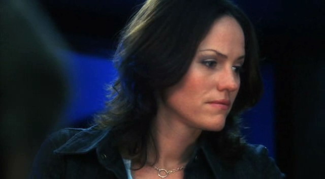
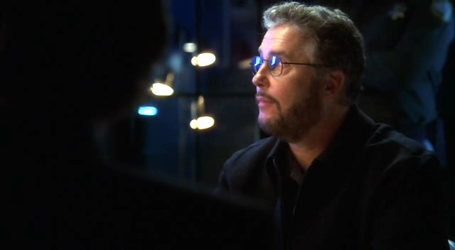

Sara觉得很无聊。

她实在没法形容在自己公寓里完全找不到有意思的事可做这种状态。她已经读完了所有必须看的杂志，换了两轮电视频道，检查了大概10次邮件，看了报纸...

她觉得好无聊。

她看了一眼钟表叹了口气。还有3个小时才到上班时间。她，当然，已经准备好出门了——梳妆打扮好很久了——因为太无聊了。从这点来看，现在只剩下等了。

考虑着给Mary打个电话消磨一下时间，她拿起手机。不过让她没想到的是，电话在手里先响了起来。也许就是Mary呢，心有灵犀地给她打电话。她也没看显示屏上的来电显示就翻开手机盖接起电话。

"Sidle."

"你在忙什么？"

Sara听到Grissom的声音嘴角马上翘起来，"想你呢。" 她抑扬顿挫地说。

Grissom笑起来，"No，说真的，你忙吗？"

"不会。怎么了？"

"我刚接到电话说 Four Aces hotel发生了凶杀案。想在那边和我汇合吗？"

"Sure，" Sara答应着，"我大概半小时后到。"

"Perfect."

合上电话后Sara仍然笑得合不拢嘴，起身准备出发去旅馆。即使那是为了去查一起凶杀案，但她等不及去见Grissom了。

*************

犯罪现场实在不怎么令人欣喜。一名空姐在她旅馆房间被奸杀了。奇怪的是，她的衣服和旅行箱都不见了。唯一的推论是被凶手拿走当了纪念品。他在犯罪过程中有条不紊；所有的血迹和指纹都被清理干净。连排水口也被清理过了，不过他们还是从浴缸排水口发现的一些头发并从上面检测出了血迹。

"这案子很棘手，对吧？" Greg在和Sara一同穿过实验室时问道。他们已经从现场回来很久了，刚处理完证物准备休息一下。

"不知道啊，" Sara叹道，"也许我们会很幸运呢。"

"Grissom说线索总在那里。我们只需要找到它。"

这时Sara的手机响起来，于是她拿起来看了一眼。是Grissom发了短信要她去他办公室。她叹了口气。

"说曹操曹操到。"

"Grissom找你？"

她点点头，"有事儿你可以去他办公室找我。"

"回见。"

Sara改变了和Greg同行的方向直接往Grissom的办公室走去。当她往屋里走时Grissom正要走出来。

"Hey，找我什么事？" 她微笑着问。

"我需要你帮我做点事。" 他答道。

"Anything。"

"就等你这么说呢。"

"Oh, no。" Sara瞪大眼睛说，"你不会是想把一个300磅的假人放在我身上吧？"

"不是，不是那样的事。" Grissom笑着说，"不过，既然你说到这个，你可能更愿意和假人..."

“你到底要我干啥，Griss？” Sara叹道。

"我需要你去会议室见Ecklie。"

"What？" Sara叫起来，"Why？"

"我不知道。他只是呼我要我去那边见他...关于现在这个案子的事。"

"那，你为什么不去？"

"我现在得去找Brass过一遍现场记录，还有参加问询。"

"Brass不能等一下？"

Grissom听了挑起一边眉毛。

"Okay, okay，Brass是大忙人，" Sara承认道，"不过，Grissom，得了。Ecklie讨厌我。"

"Ecklie是专业人士，" Grissom坚决地说，"你和我对这个案子的了解一样深，Sara。我们一起看的尸检报告，在现场时你也一直跟我在一起。我最信任你去汇报我们发现的结果。"

"别奉承我了，" Sara叹道，"Griss，你知道我上次和Ecklie独处发生了什么..."

“所以你更应该去，” Grissom说，"你不可能在余下的职业生涯里一直躲着他，Sara。你得去面对他，并修复你们的人际关系。"

Sara不可思议地看着他。Grissom在跟她说教职场权术？

"听着，" 他叹了口气，"我知道这方面我不是很擅长。但是，Sara，我希望你能吸取我的教训。也许，如果几年前我再多注重一些和Conrad的关系，我就不会失去我的小组了。也许，如果我能一直玩儿些权术，你和我在工作之余约会就不用担心那会危及我们的工作了。我说不清。我只知道你需要做些努力去修复你和Ecklie之间的关系。而且，最好的时机就是你们在关注同一件案子。你们会集中精力关心工作而没工夫讨厌彼此。"

Sara朝他假笑了一下说，"Okay，fine。我会去的。"

"Good。他正等着呢。"

她叹了口气转身离开了Grissom的办公室。"我希望将来我会感激今天所做的事。" 她回头说道。

而身后传来了Grissom的笑声。

*************

Sara走进会议室之前深吸了一口气。终于，她往前迈出脚步，驻足在门口。Ecklie正忙着在桌上摊开照片。

"Ecklie，发生什么事了？" 她有些紧张地问。

他惊讶地瞥了她一眼说，"我叫的是Grissom。"

"然后他叫了我。" Sara说着走进屋子。"我能帮上什么忙？"

Ecklie看起来对于要面对Sara而不是Grissom有些烦躁，他一边继续在桌上摆着照片一边开口说道，"5年前，白班组接了个案子——凶杀案。"

Sara靠近了些，看着那些照片。

"受害者是来自California Palo Alto的一名空姐，叫Sue Stein。" Ecklie说，"她在当地一家旅馆被奸杀了。凶手一直没有抓到。"

Grissom有一件事说对了：当她和Ecklie在对比两件案子时，他们之间的紧张感，怒气，烦躁统统消失不见了。两人都专注于案子本身。

他们越是讨论这两个案子，她越是审视这些照片，Sara越是感觉他们要找的目标比之前Greg找寻的线索更重大。他们要找的是个连环杀手。

*************

和Ecklie讨论过之后，Sara确定他们接手了一个满是扭曲、反转、死胡同并充满挫败感的案子。然而让她惊讶的是，事情突然有了180度转弯。

在他们的第一嫌犯被证实清白后，Hodges和Mia的信息又让他们找到了另一个嫌疑人。Hodges告诉他们排水管发现的头发被浇过含有雪松添加剂的漂白剂，同时Mia发现他们找的凶手做过输精管结扎术而最近又做了恢复。掌握了这些信息，Grissom和Brass回到了旅馆。

他们来到了总经理办公室，和他及客房部经理谈了旅馆中用的漂白剂的事。客房部经理Lucy解释说为了让漂白剂好闻些，她有往里面加入雪松碎屑。只有清洁人员——所有都是女性——会用到漂白剂。当Brass继续询问她时，Grissom往Mr. Michaels桌上的相片看去。一张上面有他和两个年轻人，可能是他的孩子，还有一张上面是他和一位年轻女性还有一个婴儿。他们之间的年龄差十分耐人寻味...并且，非常显著。

"这些是你的孩子么？" Grissom问。

"Yeah，" Mr. Michaels笑了笑说，"两个大的在UNLV上学。"

"那个小baby？" Grissom问。

"Jake。Jake有6个月大了。" 他笑了笑。

"那是你第二任妻子？"

"Mm-hmm."

"那么，你一定恢复了你的输精管结扎术。" Grissom仔细看着他说。

"为什么我们要讨论我的输精管结扎术？" Mr. Michaels看起来十分困惑地问。

"你也可以接触到漂白剂，所以你不会介意我采样你的DNA吧。" Grissom说。

Mr. Michaels叹了口气说，"听着。如果让别人知道你采样了我得DNA，那我就成了杀人嫌犯，我就没法再在酒店工作了。抱歉，但我要说no。还有别的问题吗？"

"我们会再联系你的。" Brass说完便和Grissom一起离开了。

直到两人穿过两层大门来到停车场，Brass都没说一句话。他瞥了一眼一脸深思状的Grissom。

"你觉得是他吗？" 他问。

"Oh, yeah。 " Grissom边说边戴上墨镜，"就是他。我们只需要找到证明的方法。"

*************

"Okay，" Grissom边说边和Sara、Greg一起坐到休息室的桌边，"我们现在掌握这些信息。Hayden Michaels接触过旅馆的漂白水，那里面含有Hodges鉴定出的附着在排水管中头发上雪松添加剂。他还恢复了输精管结扎术，这可以解释Mia发现有抗体在攻击从被害者身上采集到的精子。所以我们需要DNA样本来证明那是Mr. Michaels的精子。"

"我们拿不到法庭指令采集样本吗？" Greg问。

Grissom摇了摇头，"证据还不够充足。有可能会被争辩说因为头发是在旅馆排水管发现所以才附着上旅馆漂白剂的。"

Greg叹了口气，"你希望我像跟踪上一个人那样去跟踪他吗？"

Grissom笑了笑，"No，不过谢谢你提出来。"

"等等，" Sara说，"等一下。"

"What?"

"受害者的旅行箱还没找到，对吧？"

"是的。" Grissom慢慢答道。

"如果...Mr. Michaels还拿着它呢？"

"如果我们拿不到采集DNA的法庭指令，我们肯定也拿不到搜查证。" Grissom说。

"我觉得我们不需要搜查证。" Sara说。

Greg一副她疯掉了的表情看向她，"嗯，Sara..."

"不是，听着，" 她兴冲冲地说，"我们可以把他带到审讯室。等他和Brass在一起时，我们中的一个带着一个和受害者旅行箱一样的箱子进去。如果他有罪，那么他会认出箱子并慌张起来。如果他是清白的，那么他就不会有反应。你觉得如何？"

"可能行得通。" Grissom朝她笑了笑，"那么，咱们再加点儿东西。"

"What?"

"录音设备。放到旅行箱里录下他的反应。"

Sara笑了笑说，"我去给航空公司打电话要旅行箱，然后让Archie帮咱们装录音设备。"

"我通知Brass带嫌犯去做审讯。" Grissom说。

"我做什么？" Greg问。

Grissom看了一眼手表，"Sofia应该马上就到了。你跟她说一下案子的情况？"

"没问题。"

"Okay，那么，咱们开工吧。"

*************

打了一个电话Western Airlines就把Sara需要的旅行箱送到了实验室。航空公司十分希望能为调查自家空姐死亡事件出点儿力。Archie也非常乐意帮忙。

"这太cool了，" 他把监听设备装进旅行箱时说，"我觉得这就像参加了卧底行动。"

Sara笑了笑说，"想和我一起去看看起不起作用吗？"

他眼睛一下亮起来，"我可以去吗？"

"当然。我觉得Grissom不会介意你离开实验室一小会儿的。"

"Oh，这太cool了。" Archie又说了一遍。

Sara被他一直说这句话逗笑了，"Okay, Joe Cool,咱们去警局吧。"

*************

Sara和Archie到警局的时候，Mr. Michaels和他的律师，Adam Matthews已经在审讯室接受Grissom的询问了。Sara和Archie来到观察室。两人静静的在那边站了一会儿，听着Grissom描述着连环杀手的思维过程。

"Grissom在干吗？" Archie问。

"扰乱他的想法，" Sara咧嘴笑了笑，"他告诉他我们的推论，希望他能够认罪。"

"有用么？"

"很渺茫。"

Archie轻笑道，"最难的路留给了Grissom。"

"你看，" Grissom说，"精神变态者和冲动杀人者的区别是有没有预谋。而你已经考虑这个有很长时间了。"

"该我出场了，" Sara说着抓起旅行箱的把手，"Grissom说完他的理论了。是时候给他们点儿‘硬货’了。"

"祝你好运。" Archie说。

"Thanks。" Sara笑了笑。

"Thank you，" Sara打开屋门时Adam正开口说道，"说了这么令人叹为观止的理论，但你没有证据，所以我们要走了。"

Sara拉着旅行箱走进屋子说，"实际上，我有一些证据。"

她把旅行箱搬到桌上，看着Mr. Michaels脸上一副惊慌失措的样子。

"这是什么？怎么回事？" 他问。

Sara把旅行箱在桌上放好然后把手放到上面，挑起一边眉毛问，"Mr. Michaels？"

"她不能...她不能这么做。" 他摇着头不可置信地说。

"做什么？" Adam问道，显然对事情的展开有些吃惊。

"No，我知道我的权力。" Mr. Michaels更加用力地摇着头说。

"Hey, hey, shh, shh。" Adam说着，和他的客户一样感到慌张起来。

"这贱人撬了我的车子！" Mr. Michaels喊道。

Sara把视线从Mr. Michaels移到Grissom，Grissom也看了看她然后把视线转回他们的嫌犯。

"我不记得有看过搜查令了，Ms. Sidle。" Adam说。

"我没有搜查令，" Sara说，"我是凭直觉。"

Adam又看回Grissom，看起来对Sara的所做作为十分震惊，"Well，那么，你们得释放我的客户了。"

"正相反。" Sara说。

Grissom非常骄傲得看了看Sara然后把视线转回桌子对面的两位男士。

"Western Airlines为所有空姐都配备了相同类型的旅行箱，" Sara直勾勾地盯着Mr. Michaels解释道，她微微眯起眼睛，"鉴于Martha的旅行箱不在旅馆房间，我们推测也许是凶手带走留作纪念品。这个特别的旅行箱，" 她说着停下来打开锁掀开箱盖，展示出Archie安装的监听设备，"并不是Martha的旅行箱。"

Mr. Michaels震惊地看着这个旅行箱，而Adam轻轻笑了笑。他得承认Grissom和Sara在聪明才智上胜了他和他的客户一筹。

"而现在，我们知道要去哪儿找它了，" Grissom说，"而我们有你客户的录音，我打赌我们能拿到搜查令。" 他转向Mr. Michaels朝他得意地笑了笑说，"Thank you。"

Adam叹了口气说，"我们完事儿了么？"

"目前为止，" Grissom说，"Mr. Michaels，我想你得跟这位警官走了。"

他叹息着点了点头。待他和他的律师在警官的陪同下一起离开后，Archie跑进屋来。

"Sara，这太牛了！" 他叫着拥抱了她一下。

Sara开心地笑着，也拥抱了他一下，"没有你我绝对做不到，Arch。你帮了大忙。"

"Hey，Archie，谁让你离开实验室的？" Grissom声音中带着些烦躁地问。

Archie立刻放开Sara，转过去面向他boss的时候脸上已经闪出一抹担心，"嗯..."

"是我，" Sara说，"既然他帮了我这么多忙，我希望他能看到事情的结果。这没关系，是吧，Griss？"

Grissom叹了口气，"Yeah，没关系。录音装备的准备你做的很好，Arch。"

Archie又露出笑脸，"一切为你们效劳。"

"呐，我听说你们用了点儿非常规手段搞定了案子。"

三个人抬起头就看到Ecklie走进审讯室。Sara和Grissom挑起眉毛对视了一下。

"Conrad，" Grissom笑了笑，"消息传得真快，是吧？"

"我和Sofia还有Greg谈过了，" 他说，"他们跟我说了你们关于抓这个连环杀手的计划，所以我想过来看看事情发展如何。"

"嗯，都结束了，" Grissom说，"我们会拿到搜查令然后去他车上搜查旅行箱。那之后，要采集DNA样本也会很简单。然后，" 他笑了笑继续说，"他完了。"

"你们用那旅行箱干的事儿有点儿危险呀，" Ecklie笑了笑说。"危险，但是了不起。很高兴它起作用了。"

"那是Sara的计划，" Grissom说，"Archie帮她准备了录音设备，不过她是主策划。"

Ecklie有点儿惊讶地看了看Sara，并且眼中有一点...钦佩？ "干得好，Sara。" 他说道。

"Thanks，" 她惊讶地说，"只是我份内的事。"

"你们做的非常好。" 他说。看起来有些不自在似的，他把手握起来一会儿随后又松开。"Okay，那么，我要回实验室去了。回头见吧。"

"好的。"

待他离开屋子，Sara, Grissom和Archie有点儿吃惊地互相对视了一下。

"Wow，" Archie先开口，打破了屋里的这份让人不知所措的沉默，"奇迹永远存在。"

*************

当他们回到实验室并填完了所有必要的报告书时，白班组的同事已经陆续来上班了。Grissom看到Greg和Sofia走过他的办公室；于是和他们喊了声"晚安"。技术人员也开始离开，动身准备回家。发觉自己还没看到Sara，他稍稍皱起眉头——而且他真的，真的很想见她。也许她能有空和自己一起吃个早餐...想到这儿，Grissom笑了笑，拿出电话拨通了她的号码。

"Yes?" 她接起电话应道。

"你在哪儿？" 他问。 

"在更衣室。"

"你忙吗？"

"只是拿一下我的包。" 她咯咯笑起来。

Grissom笑了，"去喝咖啡好吗？咱们好久没去了。"

"好啊好啊。我在咖啡厅等你？"

"Perfect."

Grissom合上电话然后又笑起来。有时间和Sara独处听起来太美好了。

*************

"呐，怎么想起来这儿的？" Sara喝了口咖啡问道。

"我想见你。" Grissom答道。

她笑起来，"你最近总能见到我呀。咱们办的是同一件案子。"

"你懂我的意思。"

听了这话她的脸颊有些发红，"Yeah，我懂。我也想见你。"

他笑了。

"我还想谢谢你。" Sara继续说。

"为什么？"

"为了给我和Ecklie制造谈话的机会。"

Grissom咧嘴笑起来，"我知道你会感激我的。"

"你说的没错，" 她叹了口气，"和他一起办案让我...我想是让我开始再次对他抱有专业上的尊重吧。当然不会很多，但总有一些。"

Grissom笑起来，"好吧，这也算个开始。"

"说真的，总之要谢谢你。"

Grissom深情地看着她，他那爱抚的眼神让她觉得他正在吻她，"我为你骄傲。"

Sara也朝他笑了笑，满脸通红地紧望着他的双眼。无论之前Ecklie对她说了什么都及不上Grissom对她说的这一句话。
