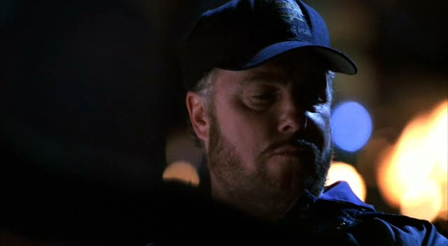
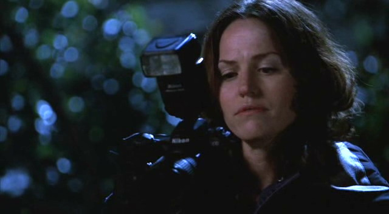

"呐，今天下班后你准备干吗？"

Sara朝Greg咧嘴笑了笑，"你是说，假设我们能正点儿下班？"

"当然。"

她笑道，"没什么事儿，我估计。怎么了？"

"我在想...也许我们可以鼓动Nick还有Warrick和我们一起吃早餐。" Greg说。

"你已经假设了我会和你一起吃早餐？"

Greg向她展现出自己迷人的微笑说，"谁能拒绝这张脸？"

Sara再次大笑起来，"Okay。要是能准时下班，我就去。"

"要是不能准时下班呢？"

"那我就回家睡觉咯。"

"在理。" Greg咧嘴笑了笑。

"Okay，各位，我们接了个棘手的案子。" Grissom说着走进休息室，"Sofia今晚休息，所以只有我们三个啦。"

"吃个早餐好难啊，" Greg夸张地叹了口气，"Griss，你怎么能让Sofia今晚休息？"

"我不知道啊，Greg。" Grissom叹道，"也许是因为我很慷慨地考虑到她已经连上了10天班了。别担心；她明天就回来。"

"Ouch。" Greg 应了一声。

Sara听了笑起来。

"Okay, 旁边笑的那个，你今晚跟着我。" Grissom说着，从眼镜上方瞥了她一眼。

"我们要去哪儿？" Sara问。

"森林火灾。" Grissom答道。

"我猜不是自然发生的？"

"确实不是。"

"Fun, fun。" Sara说着从椅子上站起来。

"我知道，" Grissom说，"作为附加奖励，他们还发现了一具烧焦的尸体。"

"嗯，我还想要一个愉快安静的晚上呢。" Sara挖苦地笑了笑。

"我在车里等你，" Grissom说着转向Greg，"至于你，Mr.喜剧演员，在这里等..."

“我懂，我懂，” Greg叹道，"等证物回来我就开始处理。" 他瞥了Sara一眼，"你总能享受所有的乐趣。"

Sara摇了摇头，"你不记得之前那周我都被困在实验室，而你，Grissom还有Sofia享尽所有乐趣的时候了？"

"记得啦，" 他叹了口气，"但是，那都是因为你自己加班超时嘛。"

她听了笑起来，"回头见啦，Greggo。"

*************

"你这么开心啊。" Grissom把他们的SUV开上高速后说道。

Sara笑了笑，"嗯，都是你的错。"

"Oh？为什么这么说？"

"看见你我就高兴。"

Grissom笑了笑，脸颊有些发红。"看见你我也高兴。"

Sara咧嘴笑起来然后探身越过车子的中控器亲他的脸一下。Grissom抽了口气使劲控制着自己不要冲进旁边的车道。

"你是想害咱俩被撞死吗？" 他问道。

Sara大笑起来，"Sorry。你看起来太诱人了。"

他撅起嘴唇摇了摇头说，"你应该庆幸我正在开车，俩手得把着方向盘...我之后再罚你。"

"Oo，" Sara咯咯笑起来，"听起来好有趣哦。"

Grissom大笑起来，"我早晚死在你手上。" 然后他稍稍转头看了她一眼笑了笑，"不过，我会死得很开心。" 

Sara听了笑着说不出话。

*************

Grissom和Sara终于到达了他们的现场。因为靠近火场很危险，所以他们必须把SUV停在几英里远的地方然后徒步过去。

"Well，至少我今天的运动量够了。" Sara边走边说。

"你已经很美了，" Grissom说，"不用再运动塑型啦。"

Sara脸一下红起来，笑了笑说，"你也是。"

"Yeah，" Grissom大笑着说，"一个胖老头。非常有吸引力哈。"

"我觉得是啊。" 她笑了笑轻声说着，"我觉得你很性感。"

他和她一样脸红起来，然后转头看了看她。她则加深了些笑容。

"我是说真的。" 她说。

"我知道。" 他有些不自信地说。

他停下脚步，于是她也停下来。

"怎么了？" 她问。

他朝她探过身并在她脸上亲了一下说，"Thank you."

在Sara能反应过来之前他已经又往前走了。她只好快步追了上去。

他们终于来到火场边缘，见到了消防队长Rick Dysart。

"嘿，这不是我最喜欢的两位CSI吗，" 他咧嘴笑着打招呼，"又发现需要我炸掉的房子了吗？"

"最近没有，" Grissom应道，"这边什么情况？"

Rick朝山坡上比划了一下，那边还有一些消防员在继续着灭火作业。"我们负责这边，" 他说，"你们的尸体在那儿。"

他们跟着他走了几码然后在一具烧焦的尸体前停下脚步。他们都蹲下来看向他。在Grissom用手电上下照着尸体时Sara拿出相机开始拍照取证。因为法医还没到，所以他们还不能碰尸体。

"当地居民报告得早，" Rick说，"我们很快就控制住了火势。还是挺幸运的。"

"比他要幸运呀。" Grissom边说边捡起了尸体旁边掉落的眼镜。"湿度低，天气干燥...还是挺容易造成大范围伤害的。"

"纵火犯跟我们一样会听天气预报呢，" Rick说，"只是为了不一样的原因。"

"也许是个傻瓜正好往车窗外扔了个烟头呢。" Sara猜测说。

"你真乐观。" Rick说。

Sara转头看向他而他朝她微微笑了下。回了一个笑脸，她又把注意力转回到尸体上。

"你们找到起火点了么？" Grissom站起身问。

"还没有，" Rick也跟着Grissom站起身来，"火势是沿着斜坡往下走的。也许是从那边坡顶着起来的。等安全了我喊你们俩。"

"Okay, Mom。" Sara说道。

Rick被她逗笑了，然后往坡上走去找他自己的队员了。

"这片区域一直是观星的好地方。" Grissom看着夜空说道。

"这也是个亲热的好地方，我听说。" Sara几乎立刻接口道。

Grissom朝下瞥了她一眼，挑了挑眉应了一声，"记住了。"

Sara抬头朝他咧嘴笑起来，而他朝她眨了眨眼睛。

"我去周围检查一下。"

"Okay。" 她一边说，一边又给面前的尸体拍了一张照片。

Grissom离开Sara，一边走一边用手电照着自己的周围。当光线照到两只被烧焦的脚时他停了下来。靠近了些，他用手电上下照着这具尸体。感觉自己的心又沉了下去。

"Sara，" 他用手电照着被害者的脸叫道，"咱们还有一具尸体。"

这时受害者的眼睛慢慢睁开了，直直盯着Grissom。他的心脏一瞬间跳到了嗓子眼儿。

"快叫救护车！"他大喊起来。

Sara跳起来并扔下她的相机——幸运的是相机没有掉到尸体上而是落在旁边——抓起电话，按下了拨给调度台的按键。叫完救护车，她赶忙往Grissom那边跑去。

"My God。" 她低语着盯着这具被烧伤、烧焦的身体。每一寸皮肤都被烧黑或烧得通红，"一个人这样要怎么活下来？"

"坚强的意志。" Grissom说。

Sara咬了咬嘴唇，向下盯着他们受害者睁开的双眼说，"咱们能做什么么？"

"我——我不知道。"

"她疼么？"

Grissom摇了摇头，"我很肯定她现在感觉不到疼痛了。"

"谢天谢地。"

由于没有什么能为第一位受害者做的，医护人员刚刚离开现场；所以这次他们很快就回来了。即使是他们，在看到新的受害者时眼中也难以掩饰难过的神情。

"她还有救么？" Grissom问。

一名医护人员摇了摇头说，"如果她在医院能挺过来那我会感到吃惊的。"

Grissom紧绷着脸点了点头，"Okay. Thanks。"

Sara摇了摇头，"真是可怕的悲剧。"

"Yeah。" Grissom说着掏出手机。

Sara好奇地看着他，"你给谁打电话？"

"Greg。他得去医院采集这个受害者的证据。"

"Lucky Greg."

" Well，" Grissom一边听着电话里的连接声一边说，"他正好想离开实验室嘛。"

*************

当第一具尸体移交给验尸房并且被告知火场已经安全之后，Grissom和Sara往山坡顶上爬去。他们慢慢地沿着道路搜索着一切可能是火源的痕迹。Sara仍对这只是一起意外抱有着希望；可惜在她发现了一个烧焦的打火机后希望破灭了。Grissom发现了一个破碎并被烧坏的伏特加酒瓶；这两样东西加起来足以引起一场大火了。

"Well, the lighter's toast，不过我们也许能从这瓶子上提取一些指纹。" Sara说。

Grissom 轻笑了一声。

"怎么了？" 她有些防卫性地问。

"The lighter's toast，" 他重复道，"可爱的双关语。"

Sara皱了皱脸，"Oh，man，我不是故意那么说的。"

Grissom咧嘴笑起来，"我要对你刮目相看了。"

Sara笑着说，"Okay，你这话里到底有多少成分的含沙射影？"

Grissom朝她挤了挤眼睛，"你觉得有多少就有多少。"

Sara吃惊地盯着他看。

"Okay，咱们把这些东西打包回实验室吧。我想看看Greg能从咱们第二位受害者身上收集到什么证据。"

Sara点点头，不过内心仍对他那随意的态度感到有些目瞪口呆。她在心里笑了笑。喜欢这样和自己调情的Grissom。

*************

Grissom和Sara拿着他们的证物走进实验室。Judy迎接他们的时候脸上带着些许惆怅地微笑。

"Hello。" Grissom笑着打招呼。

"很让人难过对吧？" 她问。

"什么？" Grissom皱起眉问。

"那位可怜的女士还活着的事。"

Grissom和Sara瞪大眼睛看向对方。

"你不是指我们在火场找到的那位女士吧？" Grissom问。

"她还活着？" Sara抽了口气。

"你们不知道吗？" Judy问，"Greg从医院带回了她烧焦的衣服和我们说的。"

"Oh, my God。" Sara低下声音，"他——我——"

"我来跟进吧，" Grissom说，"你开始采集瓶子上的指纹，我来和Greg谈。"

Sara无言地点点头并从Grissom手上接过证物袋。看着他几乎是跑着消失在朝会议室方向去的走廊里。

"你觉得她会好起来么？" Judy问。

Sara摇了摇头，诚实地说，"No，我觉得不会了。"

Grissom在会议室门口停下脚步，看到Greg正在那儿检查受害者烧焦的衣服口袋。

"我听说咱们得受害者还活着。" 他说。

"我不知道她是怎么做到的。" Greg头也没抬地回答道。

Grissom轻轻耸了耸肩迈步走进屋子，"Well，她还没准备好离开。"

"一张塑料卡，" 在Grissom看着他正试图挽救的物品时Greg解释说，"我在她衣服的所有位置都发现了酒精的痕迹。她被浇了一身。"

她的衣服上全是酒精...火源处那个破碎的伏特加酒瓶...所有线索都汇集到Grissom脑袋里，结果看起来不是很妙。

"我们在山坡顶上找到了助燃剂和疑似火源。" 他说。

"那就是起火点了。" Greg点点头。

"但是，受害者是在山坡底下被找到的，几乎完全烧焦，" Grissom继续说，"我不觉得她是被火殃及的。我觉得是她引发的这场大火。"

"什么，你觉得实际是她点的火？" Greg不可置信地问道，"类似人体炸弹？"

"Yes."

Greg的脸沉下来叹了口气，"Oh, man."

Grissom仔细看着他问，"你还好么，Greg？"

"Yeah，" Greg说着重重咽了下口水，"yeah，我没事。"

"Okay。" Grissom有些怀疑地说。

Greg又咽了下回水，"我会处理一下这张卡片，看看我能不能从上面找到ID。"

"我去Mia那儿看看她在DNA上有没有查出什么。" Grissom说完开始往屋外走去，不过他在门口停下来，又转向Greg，"Greg..."

"Yeah?"

Grissom稍稍朝他笑了笑说，"你做的很好。"

"Yeah，" Greg叹了口气说，"Thanks。"

*************

Sara从伏特加酒瓶上采集到了指纹，帮助她找到了一名在大火开始时经过那片地区的货车司机。通过运输公司的GPS定位系统追踪他的移动轨迹，她发现在急救人员被通知前的1小时他曾经在火场周围停过车。她还发现在那之前他曾短暂的在一家当地的加油站停留过。在加油站的监控录像里，她看到他曾经让一名女性——疑似是他们的受害者——上了他的货车。

她和Vartann询问了这名货车司机，而他简称他除了让他们的受害者搭了一段车以外什么也没干。在Sara提出是他浇了她一身伏特加并在她身上点了火之后，他要求了律师辩护。

"Well，这又让我们难办了。" Sara和Vartann离开审讯室时叹道。

"Hey，咱们拿到了她的毛衣，" Vartann说，"咱们不该为此高兴吗？"

Sara笑了笑，"Yeah，当然。我等不及回实验室处理了。"

Vartann听了轻笑起来。

这时Sara电话响起来。她朝Vartann抱歉地笑了笑然后接起电话。

"Sidle."

"Hey，Sara，是我。" Grissom说。

"Hi。" 她说着觉得自己脸颊有些发热。

"听着，Greg从受害者口袋里找到的驾照上查到了ID。她的名字叫Tara Matthews"。我们现在准备去找她丈夫谈谈。

"Greg怎么样？" Sara问，后悔自己没找到时间和他谈谈。

"他还能坚持。" Grissom说。

"他也打算去和她丈夫会面吗？"

"我想是的。"

"Okay。等你们回实验室见吧。"

"回头见。"

Sara合上她的手机然后看向Vartann，"咱们的受害者有名字了。" 她说。

他挑起眉毛问，"你们怎么做到的？DNA？"

"Nope。她口袋里有她的驾照。Greg处理后知道了名字。"

"Wow，" Vartann笑了笑，"你们科学家有时候真让我刮目相看。"

Sara笑起来，"我想我可以把这话当成恭维吧。"

*************

"听着，Greg，这事不会很容易做。" Grissom在两人停到Matthews家门口的时候提醒道。

"我没想过会容易。" Greg答道。

Grissom叹了口气说，"我想说的是，我知道这对你很难，不过如果我觉得你处理不了我是不会叫你过来的。"

Greg看了他一会儿问，"那之后会变得简单些吗？你懂的，在你有过几次告诉人们他们爱的人死去的经验之后？"

"No，" Grissom简短地说。然后他打开车门走下汽车。

Greg摇了摇头，然后跟着他的boss走进房子。

可以说，告诉Neil Matthews他妻子发生了非常严重的意外不是件容易的事。如Grissom所预期的，他的第一个要求就是去见她。

"当然，" Grissom柔声说，"我可以开车送你——"

"No，" Greg突然打断Grissom说，"如果可以，我可以送Mr. Matthews去见他的妻子。"

Grissom看了他一会儿问，"你确定吗，Greg？"

"Yes，" Greg说，"我...我现在熟悉去医院的路了。" 他放低声音继续道，"Griss，我真的想这样做。"

""好吧。" Grissom同意道，"Mr. Matthews，由Greg送你去医院可以吗？"

"Yeah——当然——怎样都行..."

Greg点点头然后接过Grissom递给他的钥匙，"跟我来吧。"

Grissom目送两位男士一起离开了。他想微笑。因为每天Greg都给他带来惊喜。

*************

"Hey。" Grissom边打招呼边走进证物室，看到Sara正在那里标记受害者的毛衣。

"Hi，" 她笑了笑，"Greg在哪儿？"

"他带Mr. Matthews去医院见他妻子了。"

Sara听了挑起了眉毛。

"我说由我去，但他想要自己去。"

"Okay。" 她说。

"咱们的货车司机那边进展得怎么样？"

"他当然否认了所有的事。"

"当然的。" Grissom答道，"那是什么？"

"受害者的毛衣。我在货车里找到的。"

"Well，那他可不能说自己完全清白了。"

"Yeah."

"Hey, guys."

"Warrick！" 看到他走进证物室Sara叫道，"你昨天不是应该回家了吗？"

"哈，哈，" Warrick说，"她真有意思，Griss。你手下有位活的漫画书呐。"

Grissom笑了笑说，"你在Catherine的案子上？"

"Yeah，" Warrick承认道，"挺棘手的。我们案子里整家人都被杀了。"

"Whoa，" Sara说，"发生了什么？"

"Mom和Dad初步看起来像是死于枪击和杀人后自杀，女儿则是在游泳池里溺亡。 "

"你不相信是杀人后自杀？" Grissom问。

Warrick摇了摇头，"这太...我不知道。我只是觉得不对劲。"

"相信你的直觉。" Grissom点点头。

"Yeah，" 他说，"我们要看证据怎么说，对吧？"

"证据从不说谎，" Grissom同意道，他看了眼手表又说，"Greg应该从医院回来了。我去看看他那边怎么样了。"

他离开Sara和Warrick后慢慢穿过实验室，寻找着他最年轻的CSI。最后他发现Greg正坐在会议室，盯着一个密封的证物罐。

"医院那边怎么样？" 他走进屋子问，并在Greg身旁停下脚步。

"和预期的一样，" Greg答道，"医生们必须给右手的手指截肢——因为感染的风险太大。他们把这些交给我做痕迹调查。"

"你已经连上两班了，Greg，" Grissom看着Greg终于显得有些受不住了便说道，"你需要休息了。我来处理。"

Greg一脸疑惑地看着他，而Grissom鼓励地朝他点了点头。Greg叹了口气从桌边站起来。

"Thanks."

Greg离开了屋子，然后Grissom走到桌旁。他打开第一个罐子取出里面手指。在放大镜底下，他找到了他完全没想到的东西：Sara在现场找到的那个打火机的一些细小的塑料碎片嵌进了她的手指。

"Whoa。" 他低语道。这让案子完全逆转了。

*************

" Sara，你有时间吗？"

"有啊，" Sara停下来和Sofia说道，"怎么了？"

Sofia朝左边歪了下头说，"我们能到里面谈么？"

"当然。" Sara说着轻皱了下眉头。然后她跟着Sofia来到女卫生间。

Sofia检查了每个位子以确保没有别人在场，然后她又转向Sara。这使得Sara不由得挑起眉来。

"秘密消息？" 她问。

"类似吧，" Sofia说着叹了口气，"你...最近和Greg谈过么？"

"说实话，我一整天没见到他了，" Sara说，"我知道他花了很多时间在他自己的..."

" Yeah，well，我觉得你得帮帮他，" Sofia说，"我刚才在更衣室看到他了。他在这个案子上处理的不太好。"

Sara关心地瞪大眼睛，"什么？"

"你知道你在遇到你第一个生还的受害者时是什么感觉，" Sofia说，"而且，受害者还是身体80%的部分三级烧伤..."

"是啊，" Sara说道，立刻理解了Sofia在关心什么，"你和他谈了？"

"简单说了两句，" Sofia说，"我试着开解他，但...我真心觉得他需要的是你。"

Sara有些脸红地笑了笑。

"他真的很崇拜你，" Sofia继续说道，"我知道你在指导他，但我从没见过有哪个导师/学生的关系像你们这样亲密。这是...一种非常特别的联系。"

"Yeah，" Sara说，"相信我，我也不觉得这样是理所当然的。"

"Good."

"呐，我会照顾好Greg的。我保证。"

"我知道你会的。" Sofia说完就准备离开卫生间。

"Sofia，等等。" Sara说。

Sofia停下脚步转过头看向她，"Yes？"

"谢谢你跟我这些，我真的..." Sara说。

"Yeah，" Sofia说着，一抹微笑慢慢在脸上绽放开来，"Me, too。"

*************

"Hey, Sara, I need you。" Grissom说道。

Sara再次停下了脚步，"很急吗？我正在找Greg。"

"Yes，很急。" Grissom说着，抓住她的胳膊把她往休息室的方向拽。

"发生什么事了？" Sara问。

"原来我们那个纵火的受害者和Catherine他们案子里的丈夫有性关系，" 他说，"咱们的两个案子合并了。咱们需要和Catherine还有Warrick过一下案子的相关文件。"

"现在？"

"现在。"

Sara叹了口气。显然，又要等等才能有机会和Greg谈了。

*************

受害者的丈夫，和Catherine案子里的丈夫Morgan是好友。两家人的关系一直非常亲密。Tara也很喜欢Morgan的女儿Dani。她非常想要一个孩子，但不幸的是，她和Neil没法成功怀孕。

不过，Morgan的妻子Corrine想到了一个办法。

Tara开始为了要孩子的目的开始和Morgan发生关系。他们都瞒着Neil；Tara希望他能认为孩子是自己的。

然而，Neil发现了。

被怒火冲昏头脑的他枪杀了他最好的朋友。为了灭口，他将跑进屋子确认发生了什么事的Corrine也射杀了。结果没有人照看Dani。本来照看她在泳池里玩儿的Corrine进屋后，变成孤身一人的她在泳池里意外溺亡了。

后来是Tara发现了Dani的尸体。因为Neil给她打了电话要她来Morgan家。当看到了他所做的——一切都是由自己引起的——她告诉Neil他们两人都该去死。最后她留下他独自离开并试图结束自己的生命。

不知何故，Tara和她未出世的孩子竟躲过了这场可怕的悲剧。也许Grissom说得对：她只是没准备好要离开这个世界。

*************

终于，这个夜晚结束了，Sara来到更衣室。Greg正坐在长凳上，盯着他那打开了的柜子发呆。

"Hey。" Sara打招呼道。

他无精打采地抬头看了她一眼，回应了一声，"Hey。"

Sara在他身旁坐下来，"艰难的一晚是吧？"

"你可以这么说。"

她仔细看了看他。"你让这案子影响到你了，是不是？"

"我怎么能不被影响呢？"

" Okay，" Sara说，"行吧。我来负责。"

"什么意思？"

"来吧。" Sara说着站起身来。

"来哪儿？" Greg问。

"出去。" Sara说着，伸出手想把他拉起来。

Greg摇了摇头，"Sara，我现在真的没心情去找乐子。"

"这正是我们为什么要出去，" 她答道，"我不能让这案子夺走你的快乐。Come on,，Greg！我们去泡吧，放松一下。" 她又坐回去并抓起他的一只手，"我不是说你今晚必须要找乐子。我只是希望咱们现在一起出去放松一下，然后咱们都可以安心地知道以后你还会快乐起来。"

他终于朝她笑了一下说，"Okay。"

她咧嘴笑起来，"咱们走吧。今天还是我来开车，虽然并没有没轮到我。"

Greg翻了下眼珠，"你对我太好啦。"

"我在努力。"

*************

他们在酒吧后方选了个座位，希望能享受一份安静。点过酒水后，Sara温柔的看向Greg。

"你想聊聊么？"

"聊什么？" Greg问，"我必须要给活人取证。"

"Yeah，" Sara说，"那不太好玩儿。"

"你第一次给活人取证是什么反应？"

Sara回想起那不愉快的经历后叹了口气，"我在Grissom的办公室哭了。"

Greg睁大眼睛，"他说什么了？"

"他告诉我我需要找个爱好消遣。我被工作逼得太紧。"

"然后呢？你找到什么消遣了？"

"我没能马上找到，" Sara承认道，"我花了点儿时间才摆脱工作狂的状态。"

"但是，现在你找到了？"

"Yes，" 她笑了笑，"现在我有一个了。"

Greg仔细看了她一会儿，不过没有追问下去。"你怎么...怎么摆脱那个画面的？你怎么忘掉你处理的是一个活人而不是一具尸体？"

"我没有忘掉，" Sara说，"我肯定我永远忘不掉。但是，你知道么，Greg？我觉得这让我的工作做得更好。"

Greg不可置信地看着她。

"我知道，这听起来很怪，但是...对我来说，人的因素一直是最难的部分。我不认为和人打交道很容易。我觉得我应对尸体更得心应手，你理解么？但是，但当你必须去处理一名活着的受害者时，那就像...你会更全面的看问题。那能帮你回想起你为什么从事这行。这不只关系到科学；那关系到人本身。关系到帮助他们。关系到为他们寻求正义。关系到帮助他们和他们的家人寻求安宁。"

"让他们再次活过来。"

"正是如此。" Sara说，她探过桌子握住Greg的手，"我知道你很辛苦但你会挺过去的，不过，Greg，如果你想要听真话，我希望你永远不要忘记这种感觉。我希望那能让你感受到你工作的意义。"

"Yeah，" 他摇了摇头说，"Okay，你已经给我打了气，不过我们能谈点儿别的么？"

Sara笑了笑，"说过头了？"

"No，" Greg老实地说，"说的很好。我只是...觉得应该要往前看了。"

Sara的笑容加深了些，"这才是我认识、爱着的Greg。"

Greg笑起来，"我就知道有一天你会承认你爱我。"

Sara大笑起来，"柏拉图式的爱哦，Greggo。"

"Damn," 他笑了笑说。然后他又喝了一口啤酒，"Sara..."

"Yes?"

"你的消遣...会不会，碰巧，是个男人？"

Sara瞬间满脸通红，而Greg咧嘴笑起来。

"是谁？"

"Uh-uh。" Sara摇了摇头。

"怎么？" Greg叫起来，"不讲细节？"

"Nope。" Sara说。

"Aw, come on，现在来这个！Hank的事儿你都跟我讲了！"

"No，是你自己通过什么可疑的关系知道Hank的事儿的，" Sara咧嘴笑起来，"要是我自己，这实验室里根本不会有人知道Hank。"

"你干吗这么神秘？"

"有个词儿叫私人生活，你懂的吧？"

Greg皱了皱脸，"God，你太Grissom了。"

Sara摇了摇头，不过避开了他的眼神。Greg微微睁大了眼睛。Sara会不会和Grissom...？No，那太荒谬了。Grissom不可能是那个成为Sara消遣的男人。会吗？得多套她些话出来。

"So，你真的不打算告诉我？"

"我真的不打算告诉你。"

Greg叹道，"要是我说，只有你跟我说说你的私生活才能把我从咱们刚结的这个令人抑郁的案子里解救出来呢？"

Sara翻了翻眼珠，"我才不信你呢。虽然算是步好棋。"

"你变刻薄了诶。"

"Look，Greg，这段感情真的还只是刚开始，" Sara说，"我只是...我不想说出来立了flag。"

"Sara，这是段浪漫的恋情，又不是怀孕。"

"可是，那也不关你的事。你跟Nick、Warrick一样坏。"

"好吧，保守你的秘密吧，" Greg说，"总有一天你会告诉我的。"

"也许，" Sara笑了笑，"会有那么一天吧。"
