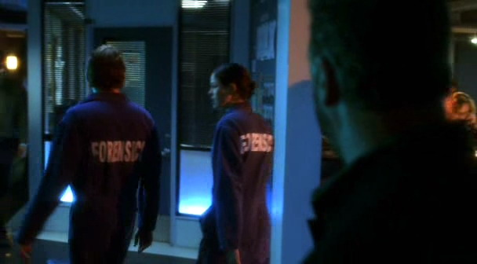

在完成了她"保姆"的职责并送Greg回家后，Sara掉头朝她家完全相反的方向驶去。此时此刻，她不想孤身一人。她只想和那个人在一起。

她按下了门铃，期待他还醒着。庆幸的是，他确实醒着；尽管她得承认，见到她站在自家门口的他看起来有些惊讶，不过同时也十分欣喜。

"Hi。" Grissom咧嘴笑着，一只手打开门，并用另一只手把Hank往后拽。

"Hi。" 她边说边关上身后的大门，然后拍了拍狗狗。

"你怎么来了？"

Sara没说话；她只是走上前用手臂圈住了他的脖颈。有些惊讶，Grissom用手臂环住她的腰，在她把脸埋进他脖颈时紧紧抱住了她。

"Sara，你还好吗？"

"Yeah，" 她说着稍稍抽回身看着他，"yeah。我只是有点儿..."

"Yeah," Grissom轻声重复着她的话，他明白她想说的。"这样的案子会让你很难过。"

她点点头，垂下双眼。

"Hey，" Grissom说着伸手捧起她的脸，"你比谁都清楚别让自己陷进案子里，对不对？"

她又点了点头，"Yeah...我只是...我猜我现在只是不想一个人待着。"

"Good，" 他笑了笑，"我永远愿意陪着你。"

Sara终于笑了，然后探身亲了亲他。Grissom笑着抵着她的唇，加深了这个吻，拥得她更紧了些。她依着他，在他的手摸索她的后背和侧腹时回吻着他。

突然，她退了一下，边叫边在他臂弯了跳了一下。Grissom担心地看着她。

"怎么了？"

"我怕痒。" 她抱歉地笑了笑说。

"真的？" Grissom说着，一抹坏笑慢慢在脸上绽开，"哪儿啊？"

Sara咬了咬嘴唇，摇着头笑了笑，"No。我才不告诉你。"

"嗯，好吧，那我自己找。" Grissom咧嘴笑道。

"No！" Sara又叫又笑地从他身边逃开。

Grissom也笑起来，并开始在屋子里追她。终于追上她后，他把她压制在客厅的地板上。

"我试试，" 他喃喃地说，"Sara到底哪儿怕痒？"

"No。" 她大笑着。

他咧嘴笑着，"脖子？"

他低头蹭着她的脖颈，用自己的胡须轻搔着她。Sara微笑着看着他。

"不算很痒...不过感觉很舒服..."

他笑着看着她，"Okay，那么。肚子？"

他的手滑下去在她腹部搔弄着。Sara咯咯笑着，扭着身子想要摆脱他。

"知道啦，" Grissom咧嘴笑起来，"腰吗？"

当他的手滑动到她的侧腹时，Sara使劲扭动起身子，疯狂地笑个不停。

"Stop!" 她喘息着说。

Grissom仍然咧着嘴笑，"膝盖？"

他的手再向下滑了些，握住她的膝盖并在她膝弯里搔了搔。Sara又咯咯笑起来，用脚踢了他一下。

Grissom大笑道，"You, my dear，太有趣了。"

她和他一起笑着，"你就想要取笑我。"

"Oh，yes，我是啊。" 他低声说道，"我还记得说过要罚你害我差点儿撞坏了咱们部门的SUV呢。So..."

"No。" Sara看着他眼里闪烁的光辉不由得咧嘴笑起来。

"darling，我恐怕这是唯一的法子了。"

"No！" 她叫着，忍着就要溢出嘴角的笑声。

"Yes。" Grissom却只是笑。

他用双手捉弄着她，袭击她身上所有怕痒的地方。Sara边叫边挣扎着抵抗他的骚扰，却始终挣脱不开。最后，她叫着他的名字转移他的注意力。

"什么？"停下他对她施加的令人愉悦的酷刑。

她探身过去大声亲了他一下。他抽回身子笑盈盈地望着她。

"别想转移我的注意力。"

"不要。" 她笑着又亲了他一下。

Grissom只好投降，并回吻着她。逗弄她充满了乐趣，但这个...像这样两人一起躺在他家的地板上，像两个青少年一样亲亲我我，Grissom肯定自己从没这么快乐过。

*************

"Okay, ladies and gentleman, 咱们今晚会很忙。" Grissom边说边走进休息室。

"Goody。" Greg咧嘴笑着说，"这是不是说我可以出外勤了？"

"确实如此。" Grissom说着递给Greg一张任务分配单，"你和Sara负责一起凶杀案。"

"听起来挺有意思。" Greg说。

Sara顺手从他手里拿走了单子。

"Hey！" Greg叫起来。

"Yeah，好像你能开车似的。" Sara咧嘴笑起来。

Grissom摇了摇头，试图忽略这俩人故意搞怪，" Sofia，旅馆的性侵案。"

"好的。" 她边答应边接过她的任务单。

"你呢，Griss？" Greg问，"你不出去玩儿吗？"

"得有人留下来等新的案子，" Grissom笑了笑，"今晚，就是我啦。"

"Well，祝你愉快。" Sara咧嘴笑起来，"Come on, Greg。咱们去检查尸体吧。"

*************

Detective Cavalier正在犯罪现场等他们。他给他们介绍了受害者的基本情况——他是一个健美运动员外加私人教练，尸体是被来到他家的客户发现的。他的尸体就在他的训练室里，有一边脸明显被打了。

在Sara查看尸体的时候，Greg开始检查屋子。墙上挂了很多受害者的照片，每张都是他衣着暴露彰显肌肉的样子。

"这人是个自恋的海报模特。" 他发言道。

"也许这就是他被打脸的原因呢。" Sara说。

Greg又看了看死者然后扮了个鬼脸，"一定很疼。"

"应该是。" Sara说完看了Cavalier一眼，"这人有什么仇家么？"

"我正准备去问发现他的那个女孩儿，" 他说，"之后，我会开始询问他的亲人朋友。我会随时通知你们的。"

"谢了。" Sara说。她在尸体旁边打开自己的工具箱，而Greg则开始在屋子巡视。

"这人有很多不错的健身器材。" Greg说。

"我能想象得出他练成这样一定有不少器材。" Sara说着摇了摇头，"为什么男人这么喜欢练肌肉？"

Greg耸了耸肩，"都是为了让女士们刮目相看。"

"Yeah，well，这位女士可不会。我觉得他挺难看的。"

"啥？" Greg咧嘴笑起来，"你的新男友不是肌肉型的？"

Sara抿着嘴隐藏起自己的笑容，"没用的，Greg。我不会说的。"

他叹了口气，"Well，你不能怪我想试一下嘛。这可能是我几年里听过的最棒的八卦了！"

Oh，确实是，Sara心道。不过她没说出口，只是笑了笑。"我没那么有趣。抱歉让你失望了。"

"对我来说你一直很有趣。" Greg咧嘴笑着说。

Sara翻了眼珠然后盘腿坐在受害者面前。她开始给尸体拍照采证。

"他肯定练了很多年，" Sara说，"健身房里没人能像这样——就算经常去的人也没有练成这样的，无论我什么时候去也没见过。"

"无论你多努力练肌肉，总有人比你的肌肉更大。" Greg说。

"这就是他们的动力吧，" Sara说，"就像Freud说的，" 她放低自己的相机转向Greg，"人身材是天生的。"

"你觉得Freud会说这里面哪一样是凶器？" Greg边问边朝散落的砝码晃了晃他的手电。

"凶手甚至不需要和他一样强壮，" Sara一边采集地板上的血样一边说，"也可能是个矮小的男人或是女人...他们只需要选对武器，利用杠杆...出其不意什么的..."

Greg瞥了她一眼。注意到她正在专心工作，于是他迅速在镜子前面屈起自己的肱二头肌。还不错。能看出肌肉，但是不像Sara评价受害者的那样"难看"。在Sara转过身之前他迅速放下胳膊和袖子。看着他脸上的表情Sara笑起来。

"怎么了？" 她问。

"没什么。" 他迅速回答。

"你看起来就像一个抱着饼干罐的小孩子被逮到了似的，" Sara咧嘴笑着说，"发生什么事了？"

"没事儿，" Greg坚持道，然后他清了清嗓子，"我要去检查屋里其他地方了。"

"Have fun … sexy。"

Greg的脸一下子红起来，然后迅速离开了屋子。Sara咧嘴笑起来。她太喜欢逗Greg了。

*************

他们在房间里花了几个小时，试着拼凑起这案子受害者非常古怪的生活模式。Greg在他的床头柜里发现了注射器和手枪，而Sara注意到没有任何砝码或训练器材上可以检验出血迹。

"So，那我们该找什么？" Greg问，"你觉得会是凶手打烂了这人的脸然后把凶器带走了么？"

"有可能。" Sara说，"咱们再找找吧。也许凶器还在屋里。"

Greg摇了摇头。"他们为什么不用枪呢？就在那边放着呢。"

"凶手也许不太了解受害者，" Sara说，"他不知道床头柜里就有枪。"

"有道理，" Gerg说，"你检查过厨房了么？"

"No。我们现在去吧？"

"好啊。"

他们刚打开壁橱和抽屉，前门就被粗暴地打开了。

" CSI Sidle和CSI Sanders在哪儿！"

Sara和Greg警惕地对视了一眼。Sara马上摸到配枪，并把枪从枪套里拔出来。

"躲在我身后。" 她低声向Greg说。

他点点头，对自己还不能配枪这一点感到糟透了。他是个男人。该由自己来保护她——不是吗？

两个穿着蓝色防护服的男人出现在厨房门口。

"放下枪，Sidle。" 其中一个人说道，"我们是来帮忙的。"

"发生什么事了？" Sara边问边收起武器。

一个人抓住她的手臂，而另一个人抓住Greg。

"Dr. Robbins在死者身体里发现了传染病原体的证据，" 其中一个男人解释说，"现在我们得带你们离开这儿。"

"等等– 什么 –?"

"来吧。" 他们一同说道，然后把Sara和Greg带出房子。

"现在是生化危险预警状态，" 一个人解释说，"你们需要立即消毒。"

Sara先被拉出房子，紧接着是Greg。两人都被粗鲁地推进了一顶蓝色的生化危险预警帐篷。

"把你们身上穿戴的所有东西都脱下来。"

"所有的？" Sara叫起来。

"所有的。"

她瞥了Greg一眼，看到Greg默默地转过身去。她也背过身，然后脱下她的橡胶手套、踢掉鞋子。

两人脱掉衣服后，那两个生化危险对应人员就打开淋浴喷头。他们开始给Sara和Greg淋浴。缓慢、有条不紊。Sara这辈子都没感到如此暴露、如此尴尬过。和Greg一起淋浴——更别说除了Greg还有两个完全陌生的人——这可从来不在自己的愿望清单上。她抬头瞥了他一眼。见他抬了下头，于是她赶快背过身去。

终于，两人被解除了生化危险状态，并得到无菌浴巾擦干身体。

"我们能拿回衣服了吗？" Sara用浴巾紧紧裹住身体问道。

"抱歉。" 其中一个工作人员说。他递给他们每人一套工作服，"你们暂时得穿这个了。"

"Yeah," Sara叹了口气， "Thanks."

她看到Greg再次背过身去。于是自己也转过身，用最快的速度穿好工作服。

"我穿好了。" 她最后开口道。

"我也穿好了。"

两人转过身面对面，发现各自都在脸红。

"Well。" Greg说。

"Yeah."

"我想这边完事儿了。"

Sara不由自主笑了笑，"回实验室？"

"回实验室。"

*************

回去的路上两人相当安静。一上车Greg就打开了收音机；两人对充满车子的音乐声感到非常满意。等红灯的时候，Sara从包里拿了条橡皮筋把自己还湿漉漉的头发在脑后绑起来。看来今天的排班会相当漫长了。

两人走进实验室的时候Greg终于打破了沉默。

"Sara，我只想让你知道...咱们淋浴的时候，我可什么也没看见。"

"真的？" Sara问，"Gosh...我什么都看见了。"

Greg转过头震惊地看着她，"Well, Ms. Sidle，我要对你另眼相看了。"

Sara上下瞄了瞄他，抿着嘴不让自己笑出来，"我也一样。"

"Sara …"

"我开玩笑的，" 她终于大笑起来，"Oh, man, Greg，这简直是我经历过的最尴尬的事了...至少是近几年来。"

"Yeah，这实在不太好玩儿。" Greg咧嘴笑起来。

"Oh，太好了，你们回来了。" Doc Robbins说着从会议室探出头来，"来这边。我有事告诉你们。"

两人对视了一眼，然后跟着验尸官走进会议室。

Doc Robbins详细地解释了一下他的发现。受害者的房子里长了一种很特殊的霉菌，会在人类的血液和身体组织中生长。尽管Sara和Greg的免疫系统阻止了霉菌孢子进入他们的身体，他们的受害者可就没这么幸运了。为了赢得Mr. Las Vegas的比赛，他服用了类固醇，破坏了他的免疫系统。久而久之，霉菌在他的鼻腔里生长起来，导致他的脸骨损伤，眼睛也肿胀起来。结果他的脸自己塌陷下去。

这就意味着他们的受害者并不是被谋杀的，而Sara和Greg仍需要找到霉菌的来源。他们回到那间房子，不过这次戴上了面罩以防霉菌孢子的入侵。

拆了几个小时的墙，他们发现一根管道上嵌着一颗子弹。进一步的挖掘工作揭开了事件背后肮脏的真相：这个练健美曾经在他家枪杀了一名妓女。Sara推测是这名妓女曾嘲笑他因为服用类固醇而导致不举；结果这个类固醇狂一怒之下枪杀了她并处理了尸体。

他们向Grissom汇报了他们的发现，而他给了两人"good work"的评价并结了案。

"Well，这真是...太奇怪了。" Greg最后说，"我觉得我得下班休息了。"

"Hey，Greg，如果你想去淋浴，可别叫我。" Sara边离开会议室边说道。

Greg朝她做了个鬼脸，"咱们能别提这个了么？"

"好的好的。"

他咧嘴笑了笑，"那明天见。"

"晚安，Greg。" Grissom说。

"Bye."

屋里只剩下Grissom后，Sara朝他笑了笑。他也朝她温柔地笑了笑。

"So，你准备去做什么？" 她问。

"没什么打算。"

她的笑容加深了些，"想来我家么？我来做晚餐。"

Grissom挑了挑眉毛，"我以为你不做饭呢。"

"我也能做点儿。" 她防卫性地说。

"好吧。" Grissom笑了笑，"我得先回家照顾一下Hank，然后我就过去。"

"Great."

*************

当Grissom来到Sara公寓的时候，她已经做好了沙拉，这会儿正忙着做——

"Frittata！" Grissom叫道，"我喜欢这个。"

Sara咧嘴笑起来，"这是上研究生时Mary教我做的。不过，她发誓说它实际的名字是tortilla española。"

"用西班牙语而不是意大利语。" Grissom点点头。

"Well，可以理解。她大学时在西班牙留学过一年。" Sara夸张地叹了口气，"那可是我一生中最长的一年了。"

Grissom听了她戏剧化的用语笑了笑，"你在煎蛋饼里放了什么？"

"土豆和洋葱。" Sara说。

"非常西班牙风格。"

"那是我唯一知道的做法啦。" Sara咧嘴笑着说。

"我能帮上什么忙？" Grissom问。

"嗯...你能帮我把红酒打开么？"

"当然。"

不一会儿，两人就坐在Sara家的小桌边享受煎蛋饼、沙拉和红酒了。Grissom透过他的高脚杯朝她笑了笑。

"这太愉快了，Sara。谢谢你邀请我。"

她也笑了笑，"我喜欢跟你在一起。"

他们吃饭的时候谈论了他们的案子——Sara被Grissom那个肇事逃逸案里偷悍马的荒唐年轻人逗得哈哈大笑。最后，打他们吃完了煎蛋饼、喝完两杯红酒后，Grissom表情古怪地看着Sara。

"怎么了？" 她问。

"我只是想知道..."

"什么？"

"和Greg共浴感觉怎么样？" 他花了很大力气才问出口；而且Grissom试图掩饰声音中的嫉妒，可惜完全失败了。

"Oh，" Sara咯咯笑起来，"太羞耻了，如果你想听真话的话。真不敢相信Doc Robbins这样对我们。"

"那是为了你们的安全着想。" Grissom说。

"我知道，而且我很感激，不过，还是...我宁肯不要去担心Greg是不是看到了我的裸体。"

Grissom眼中闪过一抹阴云，"Yeah，" 他有些僵硬地说，"Well，你说你什么都看见了..."

"你听到我们说话了？"

"听见了。"

"Grissom，我开玩笑的。" Sara说道，然后她突然意识到他真的对这整件事感到相当不开心。

"我不觉得这事儿很有趣。"

"Well，那时候Greg也是这么想的。" Sara说。她看了他一会儿继续开口道，"你不是...Griss，please，告诉我你不是在吃醋！我们讨论过这个了。Greg只是我的朋友。他一直是以后也会是。"

"我知道。" Grissom终于开口说，"我只是不喜欢想象他和你共浴，没别的。"

Sara听了咯咯笑起来。

"你觉得很有趣吗？"

她从椅子上站起身来走到他坐的那边，"你太可爱了。" 她说着双手捧起他的脸。

"Oh, really?" 他问。

"Mm-hmm。" 她一边嘟囔一边俯身吻上他。

Grissom热情地回吻着她，并拉着她跨坐到自己大腿上。他的手在她背后上下摩挲着，并探到她衬衫底下。Sara在他的碰触到自己皮肤时不禁呻吟出声。

他从她的唇上移开后探寻到她的颈部。她再次呻吟着，并抵着他的身体摆动着臀部。

"God, Griss …"

他抵着她的皮肤轻哼着，然后再次袭击她的脖颈。她的手抱着他的头，手指纠缠着他的卷发。他再次抬起头，一边亲吻她的嘴唇，一边把双手滑到她的胸侧。她贴着他的身体咯咯笑着，轻轻扭动起来。

"怎么了？" 他低语着。

"你痒到我了。"

他笑起来，"Sorry。"

"别说抱歉，"在他的手滑到她内衣里时她呻吟起来，"Just kiss me。"

"乐意听命。"

他们继续热切地亲热着，直到Sara的手开始往下滑，解开了Grissom的裤子。她刚把手滑进去，他却退开了些。

"Sara...我觉得咱们该停下来。"

"什么？" 她有些茫然地看着他问，"为什么？"

"我只是...觉得咱们应该再等一等...等到咱们的关系稳定下来。"

Sara看着他好一会儿。他是认真的。而且，她越想越觉得他说的有道理。他们还没真正确定他们"男女朋友"的关系。为什么要急着进行下一步？以前她就犯过这样的错。再者，她可不想搞砸现在这段感情。

"Okay。" 她终于开口。

他看起来有点儿惊讶她竟然这么轻易就妥协了，"Okay？"

她点点头，"我们有的是时间。" 她探身过去在他唇瓣上轻啄了一下，"你想看会儿电视还是干点儿什么？"

Grissom笑了笑，为她和自己意见一致松了口气。他不是不想要她。他梦想和她在一起有好多年了。但是，和她在一起，他不想在任何事上冒进。没理由做些让他们中的一人、或两人都后悔的事。太早发生关系会毁了他们的恋情。而且，他可不想毁掉现在这段感情。

"Okay，" 他笑了笑说，"咱们看电视吧。"

Sara从Grissom的大腿上爬下来，伸手拉着他往沙发那边走。他的手指缠着她的，一直朝她笑。两人坐在沙发上后，Sara也朝他咧嘴笑了笑，然后拿起遥控器换着频道。

"你想看什么？" 她问。

"你喜欢的都行。" Grissom答道。他看了她一会儿，一抹担心和难为情慢慢在心头散开。 "嗯...Sara？"

"Yes?"

"嗯...首先，我想说我很抱歉。其次，我真的、真的希望那些痕迹明天可以褪下去。"

"你在说啥？" Sara转向他问道。

Grissom红着脸说，"你脖子上有些地方被我的胡子弄出痕迹了。"

Sara一下子睁大眼睛然后马上抬手摸了摸自己的脖子。当她的手指碰到自己那稍有些刺痛的皮肤时略微畏缩了一下。"看来是的。"

"太抱歉了。" Grissom说。

Sara笑着伸手摸了摸他的脸颊说，"别担心，我会搞定的。"

"Sara …"

她从沙发上站起身然后把遥控器扔到Grissom大腿上，"我说了我来搞定，" 她重复道，"找个咱们爱看的节目。"

说完她就消失在浴室里，留他一个人守着电视。她回来的时候，他已经把频道锁定在Simpsons的重播节目上。她笑着再次在他身旁坐下来。他注意到她已经把头发梳成了马尾，并在脖子上涂满了新孢霉素。

"这会有助恢复的。" 她说。

"抱歉。" 他超级自责地说。

"Griss，别说啦。" 她叫道，"那不是你的错...嗯，不全是你的错。以防你没有察觉，我和你一样开心的。"

"也许我该——"

"别说什么有的没的，" Sara用一根手指抵住他的嘴唇，打断了他，"我喜欢你的胡子。我觉得这样很性感的。嗯，如果你想刮掉，当然没问题，刮掉就好。没胡子你也很性感。不过，你想刮的时候再刮，别因为咱俩亲热的时候可能会留下吻痕就刮掉啦。"

Grissom笑了笑，"你最好了。你知道的，对吧？"

Sara咧嘴笑起来，觉得有点儿脸红。"你也是。"

他清了清嗓子，"Okay。那，除非我决定作出改变否则我不会刮掉胡子。我保证。"

"Good."

"现在，你也得跟我做保证。"

"Oh，真的？" 她顽皮地挑起一边眉毛说，"那么，请告诉我，是什么呢？"

"别再和Greg Sanders一起淋浴了。"

Sara咧嘴笑着说，"我保证再也不和Greg Sanders一起淋浴了。"

"Good," Grissom叹了口气，伸出手臂环住她把她拉得近了些，"我不知道再想到那个我还受不受得了。"

*************

结果第二天吻痕并没有褪去。当Sara走进休息室开始新的轮班时，Grissom注意到的第一件事就是她脖子上带的围巾。两人对视了一下就立刻把眼神移开看向别处，然后各自脸红起来。

组里最后一位成员，Sofia紧接着Sara走了进来。她坐到Sara对面并朝她笑了笑。

"我喜欢你的围巾。" 她说。

"Thanks。" Sara笑了笑。

"看着挺时髦的，" Sofia继续说道，"不是说你不时尚哈，不过你怎么想起戴这个的？"

"Oh，我时不时的就会想戴一下围巾，" Sara说，"只是... 心情好吧。"

Grissom不由得咳嗽了一下以掩饰笑意，"Okay，各位，咱们开工吧。"

Sara抬头看了他一眼，终于再次眼神相接。两人都咧嘴笑起来。

心情好，的确如此。