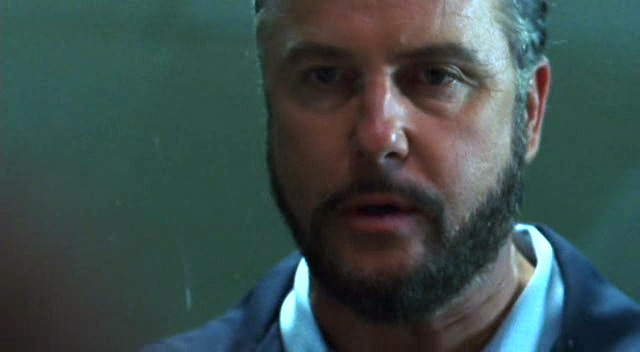
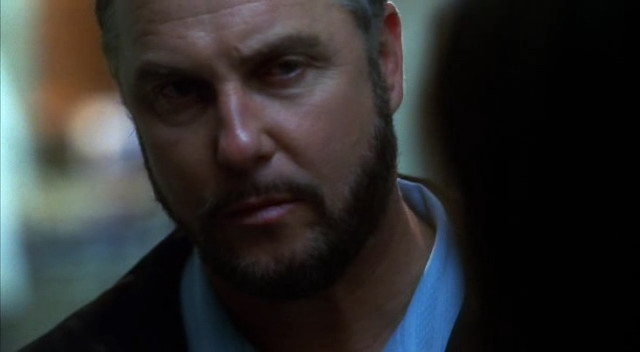
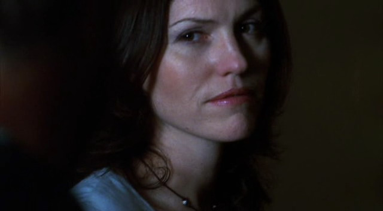

Grissom发现今天的轮班格外孤单。Sara去审问她手上那件案子的嫌犯了，Greg和Sofia则去了他们接手多日的飞车枪击案的现场。决定利用这份不常有的安静与平和，Grissom把自己关在办公室里处理大摞的案件回审。

他做到一半的时候听到了轻轻的敲门声。然后他抬起头看到Brass正走进他的办公室。

"Hey，Gil，我这儿有个新案子。"

"Great，" Grissom应道，"凶杀案？"

Brass惊讶地看着他，"你怎么知道的？"

Grissom耸了耸肩，"你一脸 ‘凶杀案’的表情。"

Brass摇了摇头，"不管怎么说啦。听着，我们希望你能派两个人在这案子上。Greg有空吗？"

Grissom皱了皱眉，"No，他和Sofia在忙飞车枪击案。我会带上Sara。"

Brass顿了顿，"你能从Catherine那边借Nick或者Warrick过来吗？"

"No，我想他们仨正在忙一起多重谋杀。怎么回事，Brass？你为什么不想我带Sara接这个案子？"

"Look，不是我不信任她，" Brass马上说道，"她是个优秀的CSI。顶尖的。只是...这件凶杀案是Desert State Mental Hospital上报的。"

"所以呢?"

"所以，那边的病人都很暴力。疯狂的犯罪者。有很多是强奸犯。我只是...我不想让Sara冒险。"

Grissom的表情缓和下来，然后慢慢开口道，"Okay，我明白你的意思了。"

"但是 …?"

"但是，我没别的人手了，除非我从白班借点儿人，那只会让Ecklie很生气。我们就...我们就多盯着点儿Sara吧。她会没事的，她很厉害的。"

"Yeah，" Brass同意道，"我肯定她会没事的。"

*************

Sara的手机在她刚走出警局的时候响起来。打开手机，她看到Grissom的名字显示在显示屏上。

"Sidle."

"Hey，Sara，警局那边你还有多久结束？"

"我正往外走呢，" 她答道，"怎么了？"

"Jim刚带了件新的凶杀案来。我想问问你想不想过来。"

"好的。" 她说。

"也许得告诉你地点是在Desert State Mental Hospital，" Grissom说，"如果你不想来，我也能理解。"

"No，没关系。" Sara说着，穿过停车场往自己的车子走去，"我几分钟后就回实验室去。"

"你没问题吗？"

"Grissom，你没问题吗？" 她坦率地问，"你好像不是很想带我接这个案子。"

"我只是...不想你受伤。"

一股暖流涌上心头，她脸上慢慢绽出一抹笑容，"我没事的，" 她安慰他说，"我和你还有Jim在一起。我知道你们是我的圣盾骑士。"

从他回答的话音中她仿佛能听到他在微笑，"我不会让你发生任何事的。"

"那一会儿见？"

"一会儿见。"

Sara叹了口气，一边打开车门一边合上电话。她爬进车子然后静静坐了一会儿，双手紧抓着方向盘，直直盯着前方。

成千上万的思绪立刻涌上心头。她摇了摇头，甩开那些记忆。

"我会没事的。" 她大声说道，"现在不一样了。我不再是一个小女孩儿了。我已经是个执法人员了。这完全不一样了。"

她咽了下口水，"再说，这次，我不是一个人了。他会陪着我。"

她从后视镜里看了看自己的镜像然后挤出一个微笑，"也许，从这以后，我就能忘掉这些了。"

这个想法激励了她，然后她调转车头往实验室驶去。

*************

Sara回到实验室的时候，Grissom和Brass已经准备好出发了。他们正站在接待区等着她。

"你们是我的欢迎委员会吗？" 她笑着问。

"Hey，kiddo，" Brass笑着说，"听着，我知道Gil已经跟你解释了我们要去精神病院，不过我想再确认一下你真的没问题吗？"

Sara翻了翻眼珠，"你俩能不能别这么把我当小孩子看了？" 她问，"我是个大姑娘啦。可以照顾好我自己。"

"我知道你可以，" Brass说，"我只是不喜欢想象你会被一群暴力凶杀犯和强奸犯围着转。"

"因为这次和其他日子不一样？具体来说有什么不一样呢？" Sara问，"Jim，我每天都在和罪犯打交道。这次不一样的只有我们已经知道是谁而已。" 她顿了顿又补充道，"还有，他们有受到药物调控。" 

Brass朝Grissom笑了笑，"她思路很敏捷。"

"我已经知道了。" Grissom说着朝Sara笑了笑。

Sara也朝他笑了笑说，"我去拿一下工具箱，然后就能走了。"

Sara摇了摇头走过Grissom和Brass。她感激他们的关心，但那实在没有必要。在这个案子上，她不觉得最大的威胁来自于嫌犯。她清楚那会是来自于自己那些太难忘却的记忆。

*************

当他们走进Desert State Mental Hospital的时候，大雨倾盆而下。Grissom为自己和Sara撑了一把大伞；而Brass则把外套拉起来遮住脑袋。一个秃头的男人在大门口正等着他们，帮忙开着门。

"LVPD?" 他问道。

"Yes。" Brass说着举起了他的警徽。

"那两个人呢？"

"CSI。" Brass答道。

男人点了点头，把大门拉开得更大了些，招呼他们进到屋里。大家走进屋里，而Grissom待Sara走进来后收起了他的雨伞。

"我是Dr. John Scott，这间医院的管理者之一。" 他说。

"我是LVPD的Captain Jim Brass，" Brass说，"这边是Dr. Gil Grissom和Sara Sidle。他们都是犯罪实验室的。"

"很高兴见到你们，" Dr. Scott说，"真希望能是更好些的情况。" 他瞥了一眼他们的个人物品说，"如果可以，能不能把你们的雨伞，还有不需要随时用的东西留在那边的桌子上？我们的保全人员会帮你们妥善保管的。"

Brass递过他的夹克，而Grissom把他的雨伞交给了他们。

Dr. Scott再次看了看他们，这回把视线停留在他们的武器上。"我很抱歉，" 他说，"我不能让你们把上了膛的枪带进医院。那是为了你们自身的安全考虑。病人们可能会偷走然后用上..."

于是大家摘下配枪也交给了保全人员。Sara从没像现在一样因为失去武器而感到失落。

"请你们过一下那边的金属探测器，" Dr. Scott继续说道，"这是标准程序。过的时候把你们的工具交给检察员就好。"

等他们都检查完毕，Dr. Scott让他们通过警戒安全门进入到设施的核心区域。

"我们这里有两类病人，" 他们一边走他一边解释，"疯了的犯罪者和性暴力犯罪者，都身负多项罪状。我们这儿的罪犯都是监狱无法收押的。" 他顿了顿然后打开最后一道门，转过脸面向他们说，"拿好你们的工具，不用的时候上好锁。" 他又看了看Sara。他们三人中只有她穿着印有LVPD标识的坎肩。"嗯，Ms. Sidle，你最好脱掉这个坎肩。没见过的制服会让他们心烦意乱。"

Sara显然有些烦躁，但她还是放下工具箱并把坎肩脱了下来。她觉得这个管理员是在逐步消减她的防御力。

Sara脱掉坎肩后，他们通过了一扇锁着的大门。他们跟着Dr. Scott沿着楼道前进，同时Dr. Scott继续解释着这间医院的目的在于缓和病人的精神疾病。正说着，一队囚犯从转角拐过来。Dr. Scott马上停止了他的长篇大论。

"Oh，嗯，请你们停下来背靠墙壁。这是标准的安全程序。"

他们都停下脚步并按他的要求靠在墙上。一名犯人明目张胆地朝Sara抛着媚眼儿，并伸出舌头朝她作出下流的动作。Grissom能感觉到她在他身旁的紧张感，然后，不是第一次也不是最后一次地后悔要她跟自己来接这个案子。

待这队囚犯走过去——Dr. Scott解释说他们正在去往休息室的途中——他们继续往目的地走去。之后他们见到了尸体发现时在当班的两名护士，还有第一个赶到现场的医院警备人员。他们讲述了凶案的时间线，并解释了被害者是如何被发现的——他躺在他床边的地板上，脑袋下面一片血泊——还有就是同屋的犯人当时坐在地板上，满身都是被害者的血。

Brass继续询问问题时，Grissom往敞着门的受害者尸体所在的房间走去。如护士所描述的一样，这个男人脑袋周围是一片血泊。Grissom还注意到这个男人的血溅了满墙。

接着他们被带到了"隔离室"。这间小房间里有张拘束桌，在被害者房间被发现的Kenny正在那里挣扎着想要脱离束缚。作为第一目击者，自然，他也是首要嫌犯。考虑到他是名暴力凶杀犯，没什么理由相信他是无罪的。这可能是个非常简单的案子。

一走进隔离室，Sara立刻发现Kenny手臂上有一条条明显的红色割伤。

"他身上怎么有这么多伤口？" 她问。

"Oh，Kenny有自残倾向，" Leon，一名医护员解释道，"他患有Renfield综合症；已经渗透到血液里了。"

一开始，Sara对Leon如此随意地形容他病人的精神问题感到有些吃惊。不过，她想了想，意识到他可能不得不用随意的方式去考虑这些。他的工作其实和自己没什么区别——如果她太集中精力思考细节，如果她任自己投入过多感情，她就会失去从客观性。

Grissom的声音把她拉回现实，他询问Kenny在他们发现他时，他穿的是不是现在这身衣服。在得到肯定的答复后，他看着Sara歪了歪头，无声的要她跟自己到房间外面去。

Sara很乐意到走廊里去，这样就不必再看着Kenny做那些徒劳的挣扎。

"血飞溅了受害者的整个房间。" Grissom轻声道。

"却没有溅到Kenny的衣服上。" Sara说。

"我不觉得他是我们要找的人。" Grissom摇了摇头说。

这个简单的案子背后还有故事。

*************

"Okay，" Brass说，"所以，你们排除了我们的首要嫌犯。那我们要开始询问剩下的人吗？"

"他们都在附近区域，" Grissom说，"所以他们都既是嫌犯也是目击者。咱们看看他们都怎么说吧。"

"我去看看有没有房间让咱们问话。" Brass说着留下他俩离开了。

Grissom看了看Sara。而她挑起了眉毛。

"怎么了？" 她问。

"我和Brass去做询问，" 他说，"你来处理一下受害者的房间好吗？"

Sara点点头。她知道这样对自己来说算是比较容易了，但像这样的病人怎么都让她觉得不舒服。

"你自己可以吗？"

她轻轻笑了笑，"没事。我想我可以。再者，病人都和你还有Brass在一起。谁会来烦我呢？"

"有道理。" Grissom答道。"好运。"

"你也是。"

*************

当Sara开始处理Robbie Garson的房间时，这地方的所有陌生感都随之褪去。这只是又一个工作日，只是去调查另一个凶手。她让自己埋头于手上的工作，全身心地投入其中，多年来这已经成为了她的第二天性。

直到她在受害者的床单上发现了精液，她才回过神来。这不只是有着另一个受害者的另一件案子。这是一件性暴力犯罪者在精神病院被谋杀的案子。

这个性暴力犯罪者已经被化学阉割了。所以床单上精液不是他的。

终于，在这屋子里的工作暂时结束了，Sara打包了她的证物并收好工具。也是时候和她的同事们谈谈了。

*************

她发现Brass和Grissom正好结束了他们的问询。两人正沿着走廊朝她走过来；三个人正好在走廊中间碰到。

"Hey, guys," 她招呼道，"我在受害者的房间发现了精液，而且应该不是他自己的；他已经被化学阉割了。"

"So，你认为留下的人可能就是凶手？" Brass问。

"如果sex是前戏，暴力就是高潮了。" Grissom说道。

"Well..." Brass边说边抬起一只手指了指病人已经集中起来的休息室，"请去愉快地取样吧。"

Grissom和Sara各分到一半病人，用棉签擦拭每个人的口腔以采集他们的DNA。公平的讲，Grissom其实做的更多一些。当他正要给Leon采样时，另一边的Sara正在尝试说服一名病人张开嘴。他一直沉默着，甚至不抬头看她一眼。然后，毫无预警地，他迎面扑过来，张口向她狠狠咬去。

Sara马上向后跳去，并抬起手臂做为防卫。"Grissom，" 她叫起来，"你来负责这个。"

Grissom走过房间，看到那男人已经被保安按回到座位上。而Sara则带着一脸厌恶的表情从他身边走过。Grissom给这个男人采了样——在他低声咕哝的时候比较容易做到——然后他跟着Sara来到走廊里。

他看到她正在打包她的棉签。她看起来很平静；只有颤抖的双手出卖了她。

"你还好么？" 他柔声问道。

"我没事。" 她头也不抬地回答，"我只是...不想丢掉一只手。"

"Sara …"

"咱们回实验室吧。" 她说完终于抬头面向他，"咱们有很多证物要处理呢。"

*************

他们一回到实验室，Grissom立刻去了验尸房看Robbie尸检，同时Sara开始处理证物。她才着手处理了几分钟的床单，Greg就走进屋来。

"Hey。" 他愉快地打了声招呼。

"你那个飞车枪击案怎么样了？" Sara问。

"搞定了，" Greg答道，"和帮派有关的案子。"

"很有趣哈。"

"Well，至少帮派成员在警局不会无聊，" 他说，"离下班还有段时间。我帮你干点儿什么？"

"好啊，" Sara答道，"想处理一下枕头么？"

"马上。" Greg咧嘴笑着回答。

他说完就留下她一个人带着枕头离开了。过了一小会儿，Grissom走进来。

"Hey，" 他说，"证物处理得怎么样？"

"挺慢的，" Sara答道，"这些床单够我查一辈子了。我刚让Greg帮忙去处理受害者的枕头了。"

"你是说，那个潜在的凶器？"

她一下子抬起头问，"啥？"

"Doc Robbins刚告诉我死因是窒息。所有挫伤和伤口都是死后几小时造成的。"

"Wow，" Sara说，"这么说，有个人把Robbie捂死了，离开房间，然后几小时后又回来把他的脑袋往地板上撞？"

"Yeah，就是这么回事儿。" Grissom答道，"他身上还有些拘束的伤痕。"

"拘束...像Kenny那样的？"

"正是。"

Sara抖了一下，"那么，他可能是死在隔离室的拘束台上的？"

"Yes."

"那，枕头可能不是凶器咯。"

"目前为止，万事皆有可能。"

Sara叹了口气，"Okay。我会给医院打电话，看看我能不能确定Robbie最近是不是被关过隔离室。"

Grissom看了她一会儿建议说，"等明天吧，到时候可能能知道更多。"

*************

第二天，Brass和Sara回到医院去查隔离室的监控录像。发现Robbie死的当天，曾因为在小组治疗中发生的事件被罚关进隔离室，不过他被拘束的时候还活着。医生开给他很多镇定剂，应该会让他几乎没法自己站起来，但毒性检验结果却发现，他的身体里只有一种药。

他们在医院有了新的发现，那就是Leon在发药室掉包了那些值钱的药剂，把它们卖给药贩子以补贴自己的薪金，不过这还不能让他们查出凶手是谁。

接着Greg给他们带来了新的线索：Robbie床上的枕头，确实，就是凶器。那上面沾满了他的唾液，并且在两端都有个口子。那是凶手在用枕头捂住Robbie的脸让他窒息时指甲撕裂的。

终于感觉案子有了些突破，Sara再次返回到医院。她需要和他的护士谈谈。

*************

护士McKay并不是很热衷于帮助Sara。她确实解释了Robbie在参加小组治疗时带了禁止携带的私人物品——一张小男孩儿的照片——而后失控，不过她不觉得这个小事件有什么不寻常的地方。

Grissom紧跟着Sara来到医院；他带来了Mia查得的DNA结果。Robbie床单上的精液是属于Adam Trent的，这人是个极其病态的强奸犯，而且有咬指甲的强迫症。尽管这个特殊的强迫症让他看来可能并没有捂死Robbie——他的指甲没法撕破枕头——不过他还是成了新的嫌犯。

Grissom和Sara一起调查了Adam的房间。Sara得承认她很高兴这次有Grissom陪着她。Adam的房间比Robbie的更显示了主人是精神病人的特征；这让她觉得心神不宁。

墙上装饰了很多他的画作。比如有着带刺铁丝网一样尾巴的猫，还有美杜莎的画。在Sara好像参观画廊一般凝视着它们时，Grissom在一旁拍了照采证。

"这些东西太黑暗了。" Grissom垂下他的相机说。

"Yeah，" Sara同意道，"当然，我也没期待会有维尼小熊。"

"Adam的潜意识一直在工作着。"

"我猜你也是。" Sara笑了笑。

Grissom看了她一会儿，然后又拿起相机给那些画拍照。

"五年级的时候，我画了一幅被捕获的鲸鱼，" Sara仍然看着那些画说道，"每个人都觉得我是个怪人。但是，我只是刚读完Moby Dick。有时候一条垂死的鲸鱼也只是一条垂死的鲸鱼。"

Grissom垂下相机朝她笑了笑。Sara也朝他笑了笑，享受着这有人分享并心意相通的一刻。

过了一会儿他们恢复到工作模式。并在排风孔找到了些埋藏的宝物。Adam在那里保存了一把梳子，还有一摞他母亲的来信。那些信的内容更加令人不安——那里面的语气不像是一个母亲，而更多的是性的暗示。Sara和Grissom读那些信的时候觉得有些恶心。他们去找了值班医生Dr. Dino，以询问更多的信息。

她解释说Adam的父亲在他9岁时去世了。他的母亲把他当成了他父亲的替代品，开始跟他乱伦，对他造成了精神和情感上的虐待。他母亲坚持给他写了很长时间的信，直到Dr. Dino出面阻止。这些信是不健康的，而且只会阻碍Adam的康复。所以她开始把那些信退回去；终于，不再有信寄来了。

听她说这些话的时候Grissom觉得有些恶心。他的父亲也是在他9岁时去世的。然而他母亲，从没让失去丈夫这一点影响他们在各自生活中的角色。他突然很想给她打电话，感谢她是那样一位好母亲。

"Well。" 在他们走出医生办公室时Grissom开口道。

"Yeah。" Sara答应着。

Grissom看了她一会儿，看着她的眼，看着她武装起自己。无论她从这案子里感受到了何种恐怖，现在都被压制在了工作模式的外表之下。他清楚的知道她在做什么；因为他也在做同样的事。

"咱们得跟他谈谈。" Grissom说。

"Yes，咱们得去。" Sara同意道。

*************

Adam很轻易就承认是他杀死了Robbie。然而，他声称他是把他的头往地上砸而杀死他的。完全没提到用枕头捂死他什么的。

审问中，每次Sara看向Grissom的动作，都被Adam解读成她不相信他说的话。他终于指示她去看卫生间里的水桶，在那里她可以找到他那身沾满血迹的衣服。

Sara和Grissom去了卫生间，确实找到了Adam提到的衣服。不过除了这些明显没能从Kenny衣服上发现的飞溅血迹之外，他们还在他的内裤上发现了口红。对此大为震惊的同时，他们回忆了一下在医院里工作的三位女性。Dr. Dino没有擦口红。护士Farber的口红颜色不是这个颜色。那么只剩下护士McKay了。

"这颜色看起来和她用的一样，" Sara说，"我去院子里的烟灰缸里捡一个她抽完的烟头，然后咱们就能在实验室做颜色对比了。"

Grissom摇了摇头说，"这案子越来越诡异了。"

"跟我说说。" Sara说着走向卫生间大门。

"Sara，" Grissom突然站起身，一边把那身衣服打包一边说，"护士McKay...她留了长指甲么？"

"Yes。" Sara剪短地说。

*************

收集完香烟后，Sara说服了一名医院的警官让她和Grissom到护士站去。两人单独留在屋里开始检查，他们开始翻看放在桌上和柜子上的文件。当Sara忙着看柜子上的装饰品时，Grissom试着拉了拉抽屉，不过发现都被锁上了。

"我去找人打开这些抽屉。"

"Okay。" Sara同意道。

Grissom离开了。Sara全神贯注地审视着她在柜子上发现的照片，完全没注意到他的到来。

"Hey."

Sara一下子抬起头，因为从他背后传来的声音，不是Grissom。她及时转过身看到Adam Trent走进了护士站，并从身后关上了大门。她震惊地看着他，完全说不出话来。

"你有信仰么？" 他问。

"有时候有。" Sara说着，放下手里的照片然后离开柜子。她需要武器——任何可以把他打倒让自己逃走的东西。

"你相信任何事物的存在都是有原因的么？不好的事情是为了教会我们因果报应？"

Sara只是看着他，同时手指摸到一个针头。她在他走向自己的时候慢慢远离桌子。

"你知道吗，也许我们所有的问题都可以通过调整到更高频率去解决，" 他说，"我看过一个人写的书，他相信当人以每秒1万转的频率震动时，就会产生疾病、焦虑和恐惧。"

Sara点点头，随着Adam的靠近眼中渗透出一丝绝望。她在背后攥住了那个针头。这东西太小了——这能帮自己胜过他么？必须能——她必须战胜他。她必须逃跑。

她推出针头，并把手从身后挥起来冲向他。在她试图把针头刺向他的肩膀时Adam抓住了她，并推开了她的手臂。针头从她手里滑落，无力地在地板上滚了几下。Adam抓住Sara，并一边紧紧按着她一边和她交换了位置，现在他是背对桌子的那个人了。她在他手中挣扎着，绝望地想让自己逃出他那充斥着死亡意味的手臂。但他把她按在地板上，并在桌边屈膝下来、箍着她让她的背抵住自己的胸膛。待两人都跪下来，他从口袋里掏出一片陶瓷碎片抵住了她的喉咙。Sara紧紧抓住那条越过她肩膀和锁骨的手臂，想要使凶器远离自己的脖颈。

"如果他们能达到每秒10万转他们就能进入到声音的领域、那里有光和精神，所有事都会好起来的，对不对？"

"Yeah。" Sara抽了口气并点点头。

"你知道我在想什么么？我觉得我震动的频率错了。"

Sara仍然挣扎着，想要从他身边逃脱。

"别动。" 他拿碎片贴紧她的喉咙警告着。 

"好的。" 她猛地抽了口气。也许可以安抚他...她不能放弃或投降。她不要死。不要死在这里。不要死在这个男人手上。不要在今天。

"你觉得我聪明么？" Adam问道，他的声音突然哽咽起来。

"Yeah," Sara答道。

"Yeah?" Adam问。

这时Grissom出现在窗边。

"Uh-huh," 她说着。

当Grissom往护士站里张望的时候，从未经历过的恐惧感席卷了他的身体。Sara，他的Sara，正在地板上，被一个曾经的强奸杀人犯抓着，手里还拿了利刃抵着她的脖子。

"Oh, dear God," 他低声咕哝道。

"你觉得我说的对么？" Adam抽泣着说。

"Yeah," Sara答道。

"把门打开。" Grissom轻声对拿着抽屉钥匙的工作人员说。

"我没办法。我找不到那把钥匙。" 那个男人边说边在手里那串钥匙里摸索。

"打开它。" Grissom说着，并试图在表面上保持冷静。Sara在努力着，她在反抗，但他不知道她能稳住他多久。

Sara终于和Grissom对上眼神。她盯着他看，停止了挣扎的动作。她眼中的绝望对上了他眼中的恐惧，成百上千种情绪在两人眼神间穿梭。

"请你把门打开。" Grissom说。

"你不许动！" Adam朝Sara和Grissom喊着，"我会弄死你，you bitch！听懂了吗？"

Sara点点头，强迫自己停止凝视Grissom转而看向地面。这时警铃大作，通知着所有人有情况发生。

"不许看他们！"

"Okay。" Sara绝望地答应着。

"看着地板！"

这时护士McKay朝护士站跑过来。她拍着玻璃窗，叫Adam别这样做。

这正是Sara所需要的小插曲。Adam从她身上放开一条手臂，开始指着护士尖叫着。趁他分散了注意力的空档，Sara拿手肘猛击他的胸口把他打倒了。然后她跳起来跑出护士站。在她跑到走廊尽头挥手拍着磨砂玻璃窗时，身后是Adam割裂自己喉咙时护士的尖叫声。

Grissom在那里站了一会儿。他只是默默地站在她身后。Sara对这点感到高兴。在感激他来陪自己的同时，她在能开口说话之前还需要些时间稳定自己的情绪。Grissom理解她；他希望由她先开口。

"他还好么？" 她终于开口问道。

"我不知道。" Grissom说，"医生很快就赶到了，所以..."

"Good."

他咽了下口水，"Sara...你还好么？"

"Yes，" 她说着，终于转过身看向他。"谢谢你陪我。在他抓着我的时候。" 她看到他露出困惑的表情便解释道，"要是你走了...只是看到你在那儿，知道你在看着我...就让我安心很多。"

"我觉得好无助，" 他坦诚道，"发生太多事了，但我全都无能为力...我觉得我要失去你了。"

她摇了摇头，"绝不会的。"

她离开了窗子几步然后把脊背靠在墙上。Grissom面朝她站着，也侧身用肩膀倚住墙壁。他小心翼翼地看着她。审问罪犯和问询无辜者多年的经验告诉他，她正迫切地想向他诉说些什么。他只需要耐心地等她准备好。

"我父亲死的时候，我母亲曾有段时间到过类似这里的地方做评估。" 她终于开口道。

Grissom看着她的目光在自己和她面前的空间交替着。她从没和自己说过这些。如果他知道这里会带给她如此恐怖的回忆，他绝对不会带她来接这个案子。他会撤下Greg带他来这里。他甚至会冒着让Ecklie生气的风险从白班借一名CSI来。Sara不需要这种回忆。

"这里看起来一样，" 她继续说，"闻起来一样...闻起来就像个谎言。"

"你确定你没事么？" Grissom问。

"疯子确实让我觉得自己也疯了。" 她看着他说，模糊的阴影投在她脸上的假笑上。

"如果你愿意，我可以找其他人来换你。" Grissom建议着。Greg和Sofia现在都有空了；这不成问题。他只是...希望她能快乐，而这里绝对不会带给她快乐。

"我很感激你这么说，" Sara说，"我确实，真的很感激，但是...我决心要跨过这个坎儿，我真的想要解决这个案子。"

Grissom轻轻点点头。如果这是她想要的，那他可以满足她。他保证尽可能快的破案。

*************

在Sara遭遇Adam之后，线索好像很快联系起来。Sara永远不会知道，是因为他们正中了案子的核心，还是因为Grissom使劲浑身解数以尽快破案。不过，最后的结果让所有人为之震惊。Joanne McKay，那名白班护士，实际上是Adam的母亲。在她和儿子的通信被阻断后，她用婚前的名字申请了这家医院的职位。只为了可以接近她的儿子。

当她发现Adam和Robbie有了性关系后吓坏了。她让Adam结束这段关系。又怕他断绝不了，于是亲手杀死了Robbie。她建议他拿Adam小时候的照片去参加小组治疗，这样她就能以他带了私人物品为由给他下药。等他因为镇静剂陷入深度睡眠后，她就用枕头捂死了他。不过她孝顺的儿子后来来到屋里把Robbie的头往地板上砸，使自己看起来是凶手，从而掩盖他母亲的罪行。

Sara和Brass主持了这次审讯。Joanne对他们很冷淡，直到Sara说了Adam为了掩盖母亲罪行的那些行为，她才表现出一些感情。

"为什么我儿子会做那种事？" 她用颤抖的声音问道。

"因为他像恨你一样也深爱着你。" Sara说。

在玻璃窗的另一边Grissom看着他们，他能感受到Sara话语之中隐藏的情绪。他想知道她的话里有多少是在说Adam...又有多少是在说她自己。

Joanne用动摇地声调指出他们永远证明不了这个理论。Brass承认她说得对；但是，他告诉她他们可以证明什么——乱伦——这可以判她10年的刑期。

"远离Adam10年。" Sara说。

"要能让他出庭作证吧。" 她说着，又恢复了冷漠的样子。所有情绪又褪去了。

知道自己能做的工作都做完了，Sara从桌边站起身离开了审讯室。她走进观察室，看到Grissom正看着那女人被押走。

"Well，不管进不进监狱，我觉得她都撑不过6个月，" Grissom说，"没有他儿子在身边她会死的。"

"那样对他们两个都好。"

Sara话音中的恶意让Grissom有些吃惊。他看了她好一会儿然后走出屋子来到走廊里。迈开脚步后才发现她并没有跟上来。于是他回到观察室，发现Sara还站在那里，盯着空空荡荡的审讯室。她眼里噙着泪，紧咬着嘴唇，显然在努力控制自己的情绪。

"Sara，你还好么？" 他问。

她摇了摇头，知道自己现在说不出话来。

Grissom点点头，在她身边站了一会儿，想要碰触她，却又怕别人看到。

"让我...送你回家吧。" 他最后说，"我们已经连上了两班。反正这里也没人需要咱们了。"

Sara点点头，然后转过身跟着他走出屋子。Grissom带着她走出警局并上了他的车子。

回她公寓的路上Sara十分安静。她盯着窗外，看着熟悉的景色向后掠去。直到Grissom把车子开进她家公寓的停车场，她都没去注意自己身在何处。

他们一起往她公寓的楼上走去。Grissom耐心地等着Sara打开门锁，然后跟着她走进房间。而她一直一副神经恍惚的样子。

"给你拿点儿喝的么？" 他问道，"帮你倒杯水好吗？"

她摇了摇头，"我...我真的只想睡了。"

"Oh。Okay。嗯，我想我该..."

"留下来陪我。" Sara突然说。

Grissom睁大了些眼睛，不过同意道，"Um, okay。"

"我不想...现在我没法一个人待着。在发生了这些之后。"

"我也不想你一个人待着。" Grissom同意道。她再次离开自己视线的想法不是很有趣。他现在仍在痛恨自己当时把她一个人留在了护士站里。他永远会记着那时的感觉。

"你能...陪我睡么？" 她问道。她能感觉得出自己的脸颊开始发红。"我不是说...我只是想知道有你在身边。知道你不会离开我。"

"当然。" Grissom同意道。他能感觉道自己的脸颊也开始发热。"我也想知道你就在我身边。"

Sara终于发自内心的笑了笑， 尽管只是个很小的微笑，"来吧。我带你去卧室。"

两人轮流用了卫生间，之后终于收拾好准备好睡觉。Grissom看着Sara身穿睡衣的样子——短裤配上无袖背心——让他回想起自己第一次给她送早餐的情形。她看起来就像是这么个小女孩儿——一个他想要保护的小女孩儿。

Sara，还被困在Adam用手里的陶瓷碎片抵住自己喉咙的记忆中，没法清晰思考，几乎没注意到Grissom穿着四角裤和T恤的样子，她只是掀起床罩然后钻进被子里。

跟随着她，Grissom钻进另一边的被子里。他看了她一会儿，看着她眼睛眨也不眨地盯着天花板。然后他伸手过去握住了她的手，用自己的手指缠住了她的。

"她真恶心，是吧？" 她终于开口。

"特别恶心。" Grissom赞同道。

Sara轻轻点点头又说，"他也是。"

"Yes."

"你觉得...你觉得这是遗传的么？"

" No," Grissom说，"我不觉得。我想是因为她在他小时候虐待他太多次，所以他从没学会如何当个正常人。"

Sara又点点头，"你觉得我正常么？"

"Yes。" Grissom坚定地说。他举起他拉在手里的那只手贴在自己唇边亲了一下，"I think you're wonderful, Sara."

她带着小小的微笑转向他，"我们能...抱一下么？"

Grissom笑着点点头。

"我想...感觉到你的手臂抱着我，" Sara微微打了个寒颤说，"不是他的。"

Grissom立刻响应了她，转过身去把她捞到自己胸前。他把唇贴上她的后脖颈温柔地印上一吻。而Sara依偎着他，满足地叹了口气。

躺在Grissom坚实的臂弯里正是她的归属。
