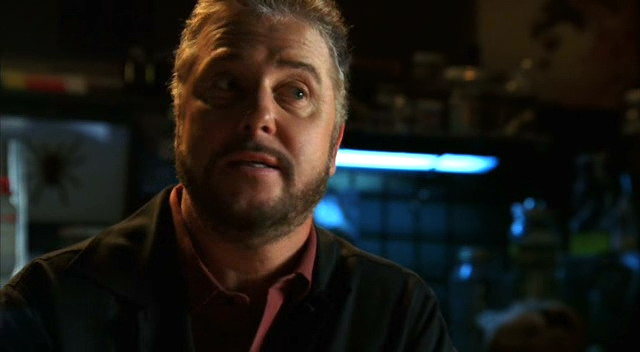
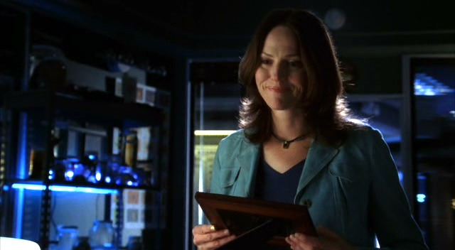
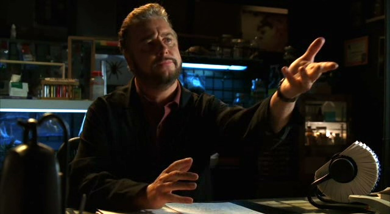

"Hi."

Grissom抬起头看到Sara走进他的办公室。于是他给了她一个大大的微笑，"Hello."

"我把我们那个两名大学生死亡的案子报告拿来了。" 她说着把文件夹滑过他的桌子。

"Thanks，" 他答道，"Greg说案子涉及到大量的干冰。"

"是的。" Sara在他对面坐下来，但是没有把对话继续下去。

"你还好么？" Grissom问道，觉得她的样子看起来像是想要谈些...什么。

Sara叹了口气，"我觉得我都没体验过做一个真正的大学生。"

Grissom皱起眉，"这是啥意思啊？"

"我觉得我错过了很多事，" 她说，"我太热衷于学习而几乎没在意过校园生活。"

"Sara，和你成了好友的那个女孩儿刚还要你做她女儿的教母呢。我认为你是有些校园生活经历的。" 他顽皮地朝她咧嘴笑了笑，"而且，你不是跟我说那年春假你成了高空俱乐部成员吗？"

Sara听了脸红起来，"这种事你记着干吗。"

"Yeah。好像我能忘了似的。"

她咧嘴笑了笑，"不管怎么说。我想我大概...花太多时间在宿舍里了，现在想来我没注意到很多事情。比如小集团啦，学生间的小恩怨啦，战利品的套套啦"

"你说啥？"

她又咧嘴笑起来，"Thank God。我还以为只有我一个人没听说过。"

"能解释一下吗？"

她笑着站起身，"你去问Greg或者Mia怎么样？他们好像对那个特别了解。"

"厄，你就这么走了？" Grissom问道。

Sara咧嘴笑起来，"Yeah。下班了。我要回家了。不过，我走之前..." 她倾身探过他的桌子，以自己的脸颊贴着他的，并在他耳边低语道，"很高兴咱们能见上一面。"

她直起身子，注意到他已经满脸通红了。她静静地朝他笑了笑，然后往门口走去。

"Sara?"

她在门口停下脚步然后再次回头看向他。

Grissom温柔地朝她笑着说，"我也是。"

*************

"Hey, Nicky."

Nick听到她的声音脸上露出一个大大的微笑，"Hi, 美女。我好久没见你了。"

"是啊，" Sara叹了口气，打开她的衣柜从里面放进自己的包包，"我想你们了。"

"嗯，我们也想你呀。" Nick答道。然后他朝四周望了望说，"Hey，也许你能帮我个忙。"

"当然。要我帮什么？"

Nick笑了笑，"一点点八卦。"

Sara瞪大眼睛重复道，"八卦？" 只希望自己的表情能如自己所希望的那样自然。"什么样的八卦？"

"嗯...关于Grissom和Catherine的。"

Sara皱了皱眉，"啥意思？"

"我是说，我看他俩有一个星期没跟对方说话了。"

"什么？"

"是真的。" 第三个声音响起来。

两人回过头只见Warrick笑着走进更衣室。

"你俩传闲话的时候真得注意点儿看看有没有人能听见。"

Nick大笑起来，"我应该把门锁起来。"

"Well，只是我啦。" Warrick说着清了清嗓子，"你注意到什么了么，Sara？"

Sara摇了摇头说，"我这一周都和Greg搭档办案。我确实没看到Grissom和Catherine在一起。不过，考虑到咱们现在排班不一样，我也没多想。"

"Well，观望一下吧。" Nick说，"看看你能发现点儿什么。"

"或者，直接问问Griss。" Warrick说着朝她眨了眨眼睛。

"Yeah，可能有用。" Nick大笑道，"你知道他对这种事有多开放。"

"你俩为什么不问问Catherine呢？" Sara建议道。

两人对视一眼然后都摇了摇头。

"她不一样了。" Nick说。

"当主管之后她变了。" Warrick以毫无疑问的语气说道，"我怀念Catherine以前的样子。"

Sara关上了自己的柜门说，"我不想说谎，guys——有时候，我觉得Greg和我在分主管这事上真的赢了。"

"Yeah，" Warrick笑了笑，"你能想象如果咱们掉个个儿会怎么样么？"

说完他和Nick都笑起来。Sara则一脸困惑。

"怎么说？"

"你，在Catherine手下？" Warrick不可置信地问，"我真想花钱看看。"

Sara朝他做了个鬼脸，"So，这就是你们最有力的八卦吗？Grissom和Catherine可能吵架了？"

"你还期待有更劲爆的吗？"

"Greg能搞到更多。"

Nick看了看Warrick说，"Well，Warrick交了新女朋友。"

"真的？" Sara叫道，然后她拍了Warrick胸口一下，"你什么都没跟我说！"

"Well，看看是谁在说这种话，" Warrick逗她说，"你和那个EMT交往多久之后我们才听说的？"

她只好笑了笑，明白他的指控一点儿也没错，"So，你要告诉我点儿细节吗？"

"她叫Tian，" 他说，"她是名医生。我们交往有几个月了。"

"O-oh，医生。" Sara咧嘴笑起来，"你要开始做小白脸儿了吗，Warrick？"

他听了大笑起来，"Yeah。我们可以看看事情的发展。"

她笑了笑，"So，关于Nick有什么可以告诉我的八卦吗？"

"Nah。反正有了他也会告诉你的。"

"有我肯定说啊。" Nick咧嘴笑起来。然后他用手臂环住Sara在她脸颊上响亮的亲了一下，"Sara是跟我最要好的姑娘。"

"今天就这样吧，" 她大笑着说，"Look，guys，和你们在一起太开心了，不过我得去找boss接任务了。咱们回头见吧。"

"有什么消息了别忘了告诉我们。"

"肯定告诉你俩。" 她大笑着回应。

Sara离开了她的朋友们走出更衣室，然后往休息室走去，这会儿Greg和Sofia已经坐在屋里了。她微笑着在他们旁边坐下来。

"你来晚了？" Greg开玩笑说。

"我在更衣室里助人为乐呢，" Sara说，"Nick和Warrick在那儿八卦呢。"

"然后？"

"Warrick在和一名医生约会，不过我也只能告诉你这些了。"

"Well，这已经比我知道的关于你的八卦多了。" Greg说。

Sara翻了翻眼珠，"Greg，我告诉你多少次让你放弃了？"

"我肯定这不会是最后一次。" 他咧嘴笑起来。

"Hi，各位，" Grissom边说边走进休息室，"Greg，Sofia，你俩去Tangiers检查在客房发现的尸体。"

Greg眼睛亮起来，"妓女诈骗案？"

Sofia大笑起来，"冷静点儿，孩子。也有可能只是个老头儿在睡梦中去世呢。"

"啥，你跟Sara是一伙儿的吗？企图要毁灭我的梦想？"

Sofia又笑起来，"Come on。咱们去调查一下看看。"

"Hey，我能开车吗？" Greg边站起身边问。

Sofia愉快地朝他笑了笑，"可以吧。"

"Sara从来不让我开车，" 他说完转向Sara，"比起你我更爱Sofia！"

"好吧，" 她大笑起来，"我肯定你俩在一起会很快乐的！"

两人都大笑着离开了屋子。然后Sara转向Grissom。

"那你给我准备了什么？"

"你跟我，" 他说，"咱们去处理一间废弃仓库里发生的谋杀案的证据。"

"Oh，no，" Sara说，"又是这种？有血迹但没有尸体？"

"看起来是。"

"好吧。咱们走。"

Grissom朝她笑了笑并眨了眨眼睛，"你能让我开车么？"
(译者：Grissom你越来越皮了...)

Sara大笑起来，"你说了算。"

*************

他们坐进SUV，打开收音机使车内响起Jimi Hendrix的音乐，然后Grissom把车开上高速公路。Sara从座位上转过身子看着他。

"所以，咱俩搭档办案。"

"Yes，" 他说着瞥了她一眼，然后笑了笑，"已经开始想Greg了？"

她咧嘴笑了笑然后把手放到他大腿上，"更愿意和我男朋友在一起。" 她喜欢自己说着男朋友这个词。

Grissom有些脸红地笑了笑，"我也喜欢和你一起。" 他把手叠到她的手上，用拇指慢慢摩挲着她的手背。

"那，你弄明白战利品的套套是什么意思了么？" 她眼里闪着恶作剧的火花问道。

"搞清楚了。" Grissom答道。

"你问Greg了？"

"No，" 他说，"我上网查了。"

Sara大笑道，"你当然这么干了。"

Grissom摇了摇头，"我不知道该怎么说，Sara...如果只是‘错过了’这种经验，那我觉得你做的挺对的。"

Sara咧嘴笑起来，"我想是吧。至少我知道你也没这种经验。"

"我肯定没有。" 他回答的时候甚至有些拘谨。

Sara又大笑起来，然后她安静下来说，"我能问你点儿事儿吗？"

"可以吧。"

Sara深吸了口气，"我今天和Nick，Warrick聊了聊。"

Grissom眯起眼睛担心地看向她，"Sara...你不是在考虑换去中班跟他们一起吧？"

"你逗我吗？" 她叫起来，"God，no。我永远不会离开你的。"

Grissom松了口气笑了笑，"Sorry。我想我可能有点儿悲观。"

"确实是。" 她说着摇了摇头，"我们只是聊了会儿天儿。没讨论换排班的事。"

"Good。那，你要问什么？"

"对了，" 她继续说，"他们跟我说你和Catherine吵架了。"

"Oh。" Grissom应了一声。

"Oh？" Sara重复道，"这么说，这是真的了？"

"Yes，" Grissom不情愿地承认。

"Griss！你为什么不告诉我？发生什么事了？"

Grissom叹了口气，"我是打算告诉你的。"

"Huh."

"不是，真的！我上周打算告诉你的，就是我下班后去你家吃晚饭那天。但是，我到了之后，你正好说道Mary，还有你一直为宝宝的事激动，然后...嗯...那种时候我说不出口关于吵架的事。"

"然后就过了一个星期？" 她有些严厉地问。

Grissom叹了口气，"我不想回想这事儿啊。说到它的话就得回想起来。"

"Griss，听着。我不是要你把每天每秒钟发生的事儿都告诉我。但是，这个...这是大事儿。而且不是那种我想从Nick和Warrick那儿听到的事。我更想听你告诉我。"

"对不起，" 他说，"我不是想让你不高兴的。"

她摇了摇头，"不是从你那儿听到这事儿比知道你和Catherine吵架了更让我不开心。" 她笑了笑又说，"虽然有时候我也会这样吧。"

Grissom轻轻笑了笑然后摇了摇头，"Well，不是很愉快的争论。"

"愿意跟我说说么？"

叹了口气，"你知道上周我找她帮忙的那个案子吧？有个女孩儿死在停车场那件。"

"Yeah。" Sara慢慢接口，"我们指控一个公派律师谋杀了她，对吧？"

"Yes，" Grissom点点头，"可笑的是这事因他而起..."

"为什么？"

"他是这场争论的主要原因。"

"嗯...Griss，你是想告诉我你要为了一个男人离开我了吗？假设你能从Catherine手里抢到他？"

"No，" 他笑了笑，感激她想让对话的气氛变得轻松些，"事实上，Catherine下班回家之前出去喝过酒。当她在酒吧时，遇到了Mr. Novak——那个公派律师。据他说，她几乎就要跟他回家了，不过最后她改变了主意。"

"她认同他的说法么？"

"Yes。" Grissom慢慢说道。

"Okay。" Sara也慢慢回应道，"那，你们在吵什么？"

"Sara，那男的是个杀人嫌犯。Catherine碰过的所有关于他的证据都等于要被质疑。我们可能永远不能把那些送上法庭了。如果他是凶手，他就能因此逃脱。而且，在提出指控的过程中，Catherine的整个人生都可能受到攻击——并且，实验室也会跟着受到伤害。"

"所以，你因为她找错了男人所以生气？"

Grissom很感激这时候遇到了红灯，他转过头看向她，"你说啥？"

"听着，我没有立场去评判你。" Sara很快答道，"我从来没有评判过你，以后也不会。不过，你和我...我们都有点儿...工作狂。我们不是那种下班后会去泡吧，希望结交新朋友的类型。就算在大学时代，我也不是那种女孩儿。我交往的男生都是我在课堂上或者其他学术活动上认识的。" 她朝他咧嘴笑了笑，并且眨了眨眼睛，"现在，我想我们可以把'工作'也加进去。"

听她这么说他稍稍朝她笑了笑。

"但是，Griss，Catherine和我们不一样。她有女儿，然后，嗯...她的生活方式更像Nick和Warrick。她更喜欢去...约会...那些不是在工作中认识的男人。"

"这么说，你是说我在评判她的生活方式？"

"有一点儿。" Sara承认道。

"我不觉得我有。"

"那你是怎么觉得的？"

他叹了口气，"我同意你说的那些。我知道Catherine出去放松无意造成任何伤害。但是，我也知道，处在我们的位置上，我们的生活就永远受到监督。你也知道这点。你不记得几年前Tom Haviland那个案子里我们是如何被对待的了？"

"Yeah。" Sara轻声说道，回想起自己站在证人席上的时候，那个电影明星的律师指责自己为了让Grissom爱上自己而篡改证据。

"我只希望Catherine能记得那些，" Grissom说，"我希望她能万事都小心些。还有..."

"还有？" Sara催促道。

"我希望她能在我开始审问Novak之前告诉我都发生了什么。"

"这话是什么意思？"

"我的意思是Novak给了他追的每个女人一个写着他电话号码的火柴盒。"

"我在受害者口袋里发现的火柴盒。" Sara慢慢说道。

"对。"

"我找到那个的时候Catherine吓坏了，" Sara回想起来，"当时我没多想...我是说，她说她得去接Lindsey的时候我有什么理由怀疑呢？" 她摇了摇头继续说，"So，她那时就知道了？我一发现火柴盒就知道了？"

"Yes，" Grissom说，"但是，她没告诉我。然后，在Vartann和我审问Novak的时候，她自己走进屋然后做了自我介绍。" 他摇了摇头，"我以为她带来了新的证据。结果，Novak就盯着她看，然后跟我们说她就是自己在酒吧最初请喝酒的那个红发女郎。" 他顿了顿又说，"我这么多年就没这么措手不及过，Sara。而且，如果她先跟我说的话这些本可以避免。"

"Okay，" Sara说，"所以，你气Catherine出去放松然后她没告诉你她和罪犯的关联。但是，她为什么生你的气？"

"因为我在生她的气，" 他答道，"她觉得我想让她像我一样生活，而她不会为了工作而改变自己的生活方式。"

Sara摇了摇头，"你知道吗，这是你俩这几年来最愚蠢的一次吵架。我知道你们观点不同，但你俩就不能保留各自的意见让事情过去吗？"

"我肯定我们会的。" Grissom说，"我想我们只是需要时间去忘掉它。"

"Well，那快点儿吧。" Sara咧嘴笑起来，"要不然，我可能得把你俩锁在一个小屋儿里然后看看会发生什么。"

Grissom看着她顽皮地笑了笑，"我更想和你锁在一个小屋儿里。"

她听了脸红起来，完全明白他在暗示什么。"嗯，这个可以有。"

Grissom把车停进仓库的停车场说，"也许，下次。"

"下次。" Sara同意道。

*************

Sara和Grissom在这间满是血迹的仓库里待了好几个小时。他们只发现了一颗弹壳，说明所有血迹都来自于同一次枪击。Sara给每处血迹都采了样，想着Mia看到自己扔这么多工作给她恐怕会起杀心。

"不可能这么多血迹都来源于同一个人。" Grissom一边拍下血迹的飞溅模式一边说。

"Well，你要是发现第二颗弹壳，我很愿意相信你。" Sara答道。

"也许只用了一颗子弹。"

"一颗子弹两名受害者？" Sara挑着眉问道，"我很怀疑。"

Grissom耸了耸肩，"我已经学到了，在这份工作里，最好别说你不相信。"

"Hm," Sara哼了一声。

他们完成了采证工作然后回到实验室，和预想一样，当Sara扔给Mia大量棉签时她不是很开心。不过，她还是开始着手检测，保证尽快给Sara结果。

感到精疲力尽，Sara现在想赶快回家。她等不及躺在床上休息了。

*************

"Hey, Sara!"

Sara穿过实验室时被从DNA实验室冲出来的Mia叫住了，"Hi, Mia。" 她答道。

"你们仓库的血液采样有结果了。"

"Oh, good。" Sara说。她和Grissom从离开仓库开始就在争论血液来源了。Grissom顽固地拒绝相信现场只有一名受害者被杀害，而Sara则坚持认为一颗子弹只有一名受害者。她非常盼望能有些坚实的证据来支持自己。"结果是？" 她问。

"一个来源，" Mia说，"所有DNA图谱都是一样的。"

"我告诉过Grissom只有一个人！" Sara叫起来，"Ha。现在我可以让他承认自己说错了。这种几率有多大？"

Mia咧嘴笑起来，"了不起。"

"我会跟他说是你的功劳。" Sara保证道。

"Thanks," Mia咧嘴笑道。

Sara继续往前迈开脚步，现在她要去找Grissom。

结果是他先发现了她。当他们在走廊里相遇时他得意洋洋地朝她咧着嘴笑。

"我是对的。" 他笑得开心。

"关于什么？"

"我们的仓库谋杀。两名受害者，被一颗子弹射穿了脑袋。"

"不，不对。" Sara边跟着他在走廊里前进边争论道。

Grissom拿了两张照片给她看，"我刚做了实验证明这件事。看，血迹飞溅模式是一样的。一颗子弹；两名受害者。"

"No, no, no, Grissom，这不可能。" Sara跟他一起走进他的办公室并争辩道，"我给现场的每一处血迹都采了样，而这些血迹只检测出一个DNA类型。"

"如果这么说呢？" Grissom咧嘴笑着坐到他的办公桌后，"咱们的神秘受害者是同卵双胞胎。"

"双胞胎？" Sara一脸惊讶并不敢置信地重复着。

Grissom点了点头。

"Well，" Sara接受自己判断错误并说道，" that's different。"

"严格来说， it's the same。" Grissom答道。

想着如果这人有心的话真能把自己逼疯，Sara低下头并注意到他桌上放了个被裱入相框的证书。"这是什么？" 她把它拿起来问道。

"我刚拿到的，" Grissom一脸兴奋地说，"这是Roy Rogers颁给美国儿童认养Trigger的荣誉证书，它是电影里最聪明的马了。"

Grissom开始对Roy Rogers，Trigger，Roy Rogers博物馆，还有他小时候曾得到过这证书一事侃侃而谈。而Sara在他这一篇长篇大论过程中使劲憋着让自己别笑出声来。

"我把它弄丢了，所以我想再申请一遍。" 他最后说。

"然后，你觉得你应该把它裱起来。" Sara说完，抿起嘴唇忍着笑。

"Yeah。" 看Grissom说话的语气好像这是对这证书唯一的收藏方法。

见她没有给自己的证书应有的关心，他伸手做出把它要回来的手势。于是Sara无言地把相框递了过去。

"所以，你喜欢西部片？" 她边坐下来边问。

"当然了。" 他说，一脸就好像她问了一个如此明显问题的表情，"你不喜欢？"

"Um … no。" 她拖长声音道。

"Well，那是因为你可能从没接触到正宗的，" Grissom解释道，"我们得改进这点。"

"具体来说要怎么做？" Sara问道。

"我们要来场电影马拉松，" Grissom宣布，"会很有趣的！"

Sara想要开口争辩，不过又改变了注意。他都为她看了Will and Grace。所以当然，她可以为了他看看Roy Rogers。

*************

Catherine坐在自己的办公室里，埋头于补写文档。她终于明白为什么Grissom总是做不完了。因为她一直忙着调查现场，跟进Nick和Warrick在忙的案子，所以有一周没有做文书工作了。不过，现在，鉴于只有两个案子，而他俩又分别去了不同的现场，所以她终于有时间补做了。

"Catherine，我需要和你谈谈。"

"Hey，Jim，" Catherine从眼前的文件上抬起头笑着说，"进来吧。"

Brass带着一脸她从没见过的严肃表情走进她的办公室，他清了清嗓子说，"Catherine，发生了...一些事情。"

Catherine把笔放到桌子上，笑容也从脸上褪去，"怎么了？"

"是关于Nicky的。"

她突然感到一阵害怕，"他怎么了？"

"你派他去回收证物？"

"Yeah，有人报告停车场有人体器官，" 她说，"他和Warrick猜硬币...Nick输了，所以派他去的。"

"对，" Brass面色凝重地说，"嗯...发生了点儿麻烦。"

Brass脸上的表情足以告诉Catherine他们面临的远不止是"一点儿麻烦"。她突然觉得十分恐惧，"Nick发生什么了？"

"他...不见了。"

"你说'不见了'是什么意思，Jim？" 她的声音里充满恐慌。

"他本来在现场，但现在他...失踪了。"

Catherine听了从椅子上跳了起来，"你是说他被绑架了？"

"看起来是这样，" 他又清了清嗓子，"我现在过去，如果你想跟我一起..."

她摇了摇头，"我得告诉Gil。"

她不等Brass再说什么就冲出了办公室。

Catherine冲进Grissom办公室的时候，他正在和Sara轻声闲谈。两人都被冲进屋子的Catherine吓了一跳。

"我们有麻烦了。" 她说。

"怎么了？" Grissom问道，知道Catherine这种反应一定是发生什么大事了。

"Nicky被绑架了。"

"什么？" Sara从椅子上跳起来叫道。

"我派他出一个现场——回收证物。他一个人去的...Brass刚过来告诉我他失踪了。"

"Okay，" Grissom说，努力保持着冷静，"我们可以应付这个。"

"应付这个？" Catherine几乎尖叫起来，"Gil，我们的人失踪了，你就在这儿说什么应付这个？"

"Catherine，我们需要保持冷静，" 他的声音毫无妥协，"如果我们自乱阵脚，就帮不了Nicky了。"

Catherine看了他一会儿，然后点了点头。他说的没错。

"Okay？" 他问。

"Okay。" 她答道。

Grissom转向还站在旁边Sara，"Sara，去找Greg。我要你们俩去列出Nick所有的活动和最近的案子。去查一下有谁可能想要伤害他。"

"Okay。" Sara边答应边往办公室外面走。

"还有, Sara?"

她停下脚步转身问，"Yeah？"

"把这事儿告诉Warrick。"

她点点头往走廊的方向，跑着去找Greg。

Grissom把视线转回Catherine，看到她还站在自己的办公桌前，攥着双手。"Catherine？"

"要是他发生了什么..." 她低语道。

"他会没事的，" Grissom说着绕过自己的办公桌。他用手臂环住她，"我们会找到他的，Cath。我们一起努力。我们把包括Warrick在内的人都投入到这上面来。你知道咱们永远是最棒的一组。"

她抬起头看了看他然后点点头，深吸了口气控制住自己的情绪，"Gil，关于之前..."

他挥了挥手表示不用多说，"那件事已经过去了，Cath。现在只想Nick的事吧。咱们一起去调查，带他回家。"

她点点头，"你说的对。咱们是实验室最好的团队。咱们会找到他的。我知道咱们会的。"
