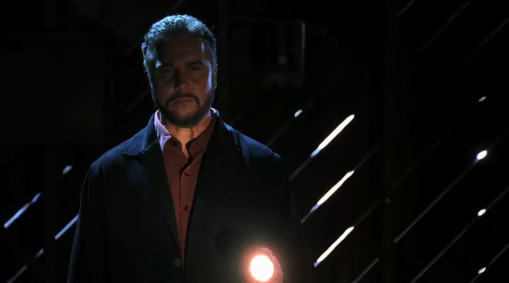

开车去交钱的地方花不了多少时间，但这仍令他有些害怕。Grissom以前从没随身带过这么多钱；孤身一人更让他觉得有些发憷。然后，考虑到目的地还有更难面对的...

在他这么多年的职业生涯中，在所有他调查的绑架案里，他从没有建议过家属去交赎金。这与他所受训的一切以及多年的经验相悖。他几乎不敢相信自己所要做的。但是，这一次规则不再重要。Ncik是唯一重要的。他只希望能看到Nick安全地回到他的朋友和家人身边。

Grissom到达了目的地，一个令人生畏，甚至有些毛骨悚然的废弃仓库。在一片荒芜的沙漠中间。它偏僻的位置让它成了埋葬活人——或死人的绝佳地点，就事论事——没人会注意到这里。拿着钱袋爬下车子，Grissom走向仓库，并谨慎地审视着四周。任何一块不平整的土地都可能是埋着Nick的地点。不幸的是，他没能找到目标。基于他粗略的观察，Nick不在这里。

最后他来到入口处。打开门然后慢慢走进去，摘下太阳镜。他朝四周望去，看到了那辆Warrick通过交通摄像头追踪的白色SUV。至少他们之前是对的。他把太阳镜放进口袋然后拿出手电筒，打开手电以便更好地查看这间昏暗的屋子。

"Las Vegas Crime Lab。" 他朝空荡荡的建筑物里喊。

"穿过那扇门。" 一个男人的声音响起来。

Grissom一手拿了手电一手提着钱袋，慢慢走过第一间屋子，穿过一扇窄门进到里间。一个男人正坐在桌子后面，盯着一个笔记本电脑。当Grissom意识到这个绑架Nick的人很可能和他的组员一样看着那个网络摄像头一整天，他就觉得胃里一阵抽搐。

"外面很安静啊，" 那男人说，"听起来好像你是一个人来的。"

"我把你要的钱带来了。" Grissom说。

那男人站起身命令道，"放到地上。"

Grissom把皮包放到地板上。

"滑过来。" 他指示。

Grissom踢了皮包一脚让它滑过地板。

那男人终于走近几步；Grissom可以看到那是一个老人。他稀疏的灰发梳得很整齐，系扣衬衫和夹克让他能算得上Grissom遇到过的最着装体面的绑架犯了。

"你跟我说这包里有100万美金？" 他不可置信地问。

"Yes."

"带着一些可爱的小陷阱？比如——追踪器，或者染料包...?"

"通常来说，你说的百分之百正确，但是，这次你百分之百错了。" Grissom说，"我们想要Nick回来；不耍花样。"

绑架犯蹲下来打开皮包。他拿出一捆钞票看了一眼，轻笑起来，"这看起来是真的。"

"是真的，" Grissom冷静地说，"Nick在那儿？"

那男人又站起来，"你知道吗，我以为你们的机构不和恐怖分子谈判呢。"

"你是恐怖分子吗？" Grissom问。

"看情况，" 那人说着把自己的手电朝Grissom脸上照去，"你害怕么？"

"听着，我不是很想和你谈，" Grissom不耐烦地说，"我的人在哪儿？"

"Oh，这么说...他是你的人，哈？"

"Yes，他是。他被埋在哪儿了？"

"你俩关系近么？"

"这跟你没关系。" Grissom说，不耐烦渐渐发酵成愤怒。

"Nick Stokes对你来说是什么呢？" 那人问道，"看到他在棺材里你有什么感觉？每次点下按钮时你的灵魂是不是都在死去呢？知道自己没有任何办法把他救出地狱是什么感觉？无助？无用？无力？"

Grissom无言地盯着他。这正是他的感受，但他不想告诉这男人让他获得满足感。

"Good，" 那男人说道，看起来猜到了Grissom未说出口的答案，"欢迎来到我的世界。"

他解开衣扣敞开夹克，显露出绑在自己胃部的爆炸物。Grissom看了惊得张开嘴。No, no, no，这不是他预期的展开！他送来了赎金，对方应该交还人质！Grissom心里一阵恐慌。他必须制止他——如果他自杀了，那他们救回Nick的最后机会就没了...

在Grissom能开口之前，在他能劝阻这男人要做的事之前，他已经拿起了炸药的启动装置。

"Ah...如果我是你，我会后退一点儿。" 他说。

静寂无声，Grissom能感觉到震惊已经渗透进了他的血管，于是，他后退了几步。

然后他按下了按钮。

爆炸的冲击力把Grissom往后推去。使他仰面摔在坚硬的地上。当爆炸声停止后，他慢慢坐起来。鲜血飞了满屋也溅了他一身，钞票在空中飘着。绑架Nick的罪犯死了，真正意义上的灰飞烟灭。

Grissom喘息着。现在他们该怎么办？他们能找到Nick的唯一线索断了...他们要怎么找到他？

慢慢地，慢慢地，他爬起来。稍稍有些摇晃地检查着周围的损害程度。可怜Catherine花了那么大力气去筹赎金...Ecklie甚至开口去求市长掏钱...Warrick花了好几个小时看监控录像追查那辆SUV...Greg翻了大量的文件寻找嫌犯...Sara好了很久处理那个伪造的证物...Nick的双亲特地从Texas赶来是为了看自己的儿子还活着，而不是通过网络摄像头看着他死去。

Grissom深深吸了口气并咽了下口水。他必须振作起来。至少，他得去找帮手。

他掏出手机拨通了调度台的电话。

"调度台，我是CSI Grissom，" 他开口道，"我在一起爆炸现场..."

*************

Sara在Grissom的办公室站了好一会儿，试着让自己镇静下来。到她觉得自己的情绪稳定下来后，她回到了A/V实验室。Warrick, Greg, Archie和Catherine还在屋里，目不转睛地盯着监视器。

"Hey。" 她声音有些沙哑地招呼道。

"Hey。" Greg说着往Catherine身边靠了靠，给她腾了些地方。"我们都想在这儿看着Grissom救出Nick。你懂的，就像Superman。"

Sara笑了笑。她不确定被叫Superman的话Grissom会是什么反应，不过她愿意下次见到他的时候叫来试试。

"这要花多久？" Warrick叫道，"Grissom已经走了好长时间了，足够到那边交完钱了吧。他们到底什么时候才能放Nick从那里面出来？"

"咱们不知道Nick在不在交钱的地方，" Catherine说，"他们也许得开车去他在的地方。"

Sara咬了咬嘴唇。想到Grissom和一个绑架犯一起开车去什么地方让她觉得很恐怖。Greg同情地看了看她并握住她的手。

"Hey，" 他说，"会没事儿的，Sara。他们很快就会回来的。"

"这真让人抓狂，" 她说着试图露出一个微笑，"我不擅长等待。"

"Yeah，我看出来了。" Greg答道，也试着挤出一个微笑，"不过，有耐心的人才能赢。"

Sara看了看正摇着头的Warrick。他和她一样焦虑地等待着整件事情的结束。

这时Catherine的电话响起来，打破了Greg开口后屋里所持续着的宁静。她拿起手机接起来。

"Willows，" 她应道，"Hi, Jim。...我在A/V实验室...Yeah，他们都和我在一起...Okay。...Bye。"

其他几个人挑着眉看向她。而她摇了摇头。

"Brass正往这边走。他说有些事要告诉我们。"

不知为何，想到Brass要亲自过来通知什么消息就让Sara觉得心里一阵发冷。她紧紧攥住Greg的手。

"Um, Sara?"

"Yeah?"

"我之后还想用我的手指头呢。你能小点儿劲儿么？"

她轻轻笑了下松开他的手，"Sorry。我有点儿紧张。"

"没关系。你有理由紧张。"

"Hi，各位。"

Brass走进屋时他们都转过去看向他。他的脸色有些灰白；这足够迫使Sara紧抓住Greg胳膊。

"发生什么事了，Jim？" Catherine低声问道。她攥着椅背儿的手指关节有些发白。

"Grissom去交了钱，" 他说，"不幸的是，在Grissom能问出Nick的所在地之前，绑架犯把自己炸死了。"

Sara听了这话有些站不稳。Greg马上伸手扶住她。

"Grissom还好么？" 她哽咽地问。

"他打电话通知了这个情况，所以我想他没事。" Brass答道，"EMT正赶在过去。"

"然后，关于Nick我们什么也不知道？" Sara问。

Brass顿了顿并舔了下嘴唇，"据我所知，没有消息。" 他轻声说。

Sara眼里涌上泪花，而Catherine捂住嘴不让自己哭出声。Warrick沮丧地垂着头。

"Okay，" Catherine尽可能地让自己振作起精神说道，"咱们得去现场。大家先都去换工作服。我觉得现场会很脏。"

*************

10分钟后，Sara和Greg一起坐上SUV，迅速往爆炸现场赶去。Sara负责开车，一路把车子彪到最高限速。

"现场是不会跑的，你知道吧。" Greg说。

"Yeah，但是，Nick没有时间了。" Sara眼睛盯着大路答道，"那儿一定有些什么东西能帮咱们找到他。"

Greg点点头，而Sara放心地叹了口气。

Nick是个安全的借口。对他发自内心的关心可以掩饰她对Grissom同等的关心。她必须要去现场亲眼确认他没事。

多亏Sara疯狂的车速，她和Greg在Warrick和Catherine之前到达了现场。Sara一停下来两人就跳出车子。Grissom正被一名EMT带出仓库等待救护车的到来。没再回头看Greg，Sara马上朝他跑过去。

"Sara。" 看到她出现在自己面前他低语道。

"Hey，" 她说着朝他撇嘴笑了下，"你还好么？"

"Yes。" 他答道。

她看着他，满脸满身的血迹。她咬了咬嘴唇问，"你受伤了，Griss？"

"没...我想没有..." 他忧心忡忡地抬头看向她，"他把自己炸死了，Sara。就在我眼前。我眼看着这一切发生。我没法阻止他。"

Sara伸手抓住他的手，"Grissom，别这样。会没事的。我们会找到Nicky的。Greg和我一起来的，还有Warrick，Catherine也在路上了。我们会从这片废墟里找到线索的。总会有线索的，对吧？"

他慢慢摇了摇头，"我很抱歉，Sara。" 他低语着。

"为了什么？" 她有些诧异地问。

"我跟你保证过..."

"你跟我保证你会回来，" 她说着捏了捏他的手，"你做到了，Griss。你没有食言。"

Greg这时走到她身边，"Cath和Warrick来了，" 他说，"咱们应该过去看看Catherine需要我们做什么。"

"在你去现场工作之前让EMT帮你检查一下，okay，Grissom？" Sara笑了笑说。

"Yeah..." 他茫然地应道。

她又捏了捏他的手，然后跟着Greg往Catherine和Warrick下车的方向走去。

"他还好么？" Greg问。

Sara轻轻摇摇头，"我想他被吓到了。"

"Hey，guys，" 见他俩朝自己和Warrick这边走过来，Catherine问道，"Gil怎么样了？"

"EMT在照顾他。" Sara说。

"关于绑架犯他说什么了么？"

"只说了他把自己炸死了，" Sara轻轻耸了下肩说，"他说他没问到任何关于Nick在那儿的信息。"

"好吧。" Catherine叹了口气。这消息令人沮丧，但并非没有想到。"现在，咱们得考虑这个现场所有的证物都可能引导我们找到Nick。咱们进去开工吧。"

他们一起走进去，花了些时间审视那辆车子，血迹，破掉的窗户，碎了的钱...

"Okay，这么办吧，" Catherine说，"Warrick和Greg负责SUV。看看你们能找到什么。Sara，你和我负责仓库的其他部分。你查后面那间屋子；我负责这间。Ecklie正派白班的人过来帮忙；他们过来大概要1小时。没问题吧？"

大家都点点头然后立刻投入工作。

Sara很高兴由自己负责后屋。这里明显是爆炸现场；屋里到处都是破碎的尸体残骸。这意味着她有更多东西要收集，有更多东西要检查。这也意味着她可以让自己沉浸在工作中，而不用去想她的男友正惊魂未定地坐在救护车后面这件事。

她想不顾一切地跑到外面陪他坐在一起，在医护人员检查他生命体征并询问他身体状况的时候握着他的手。她想为他披上毯子以抵御随惊吓而来的寒冷。她想用柔软的毛巾为他擦掉脸上的血迹。

但是，她什么也不能做。这么做无异于承认他们之间的私人关系，这会给他们带来无尽的麻烦。

所以，她一边等David来一边开始绘制现场的整体草图。因为在她开始收集身体残骸之前需要他的认可。

*************

几小时后，Sara和Warrick带着他们收集的证据回到实验室。Greg，Catherine和白班的成员仍然留在现场继续收集证物。

"你对现在的状况怎么看？" Warrick双眼盯着路面问道。他开车比Sara来现场时的车速慢了许多。

"我觉得咱们有很多工作要做。" 她说。

"但是，你觉得咱们能找到他么？"

Sara转头看向他，"咱们必须找到，Warrick。咱们不能失败。"

"Yeah，但是，Sara..."

"我知道这看起来不可能，" 她说，"但是，咱们... 咱们必须要做到。想想咱们这次收集的所有证物。这里一定有些什么让咱们能找到他。"

"你什么时候变成乐观主义者了？"

"你什么时候准备放弃你的朋友了？" 她反问道。

Warrick转头看向她说，"Okay，Okay。我不会放弃Nick。咱们回实验室后我就去看着他。"

"Good，" Sara说，"我得从我的拇指开始。"

Sara的战利品是从现场找到的绑架犯的拇指。她等不及要采集指纹了。她肯定自己能找到匹配的人。确定绑架犯的身份是他们找到Nick的线索。

他们回到实验室后一起走进大楼。Warrick帮Sara登记好证物，然后他们分头行动起来。Sara带着拇指去实验室采集指纹，然后拿给Mia查DNA。Warrick则往相反方向的A/V实验室走去，发现Archie正在那儿看着Nick。

"他怎么样了？" Warrick问。

"很难说。" Archie摇着头说。"还是一样吧，我想。" 他顿了顿瞥了Warrick一眼，"我去冲点儿咖啡。"

"Yeah。" Warrick同意道。Archie和其他CSI们已经达成默契，就是绝不让Nick自己"一个人"待着。鉴于所有CSI都已经去了现场很长时间，看来Archie已经坐在监视器前好几个小时了。

Warrick只看了Nick一会儿直播就中断了。他点下链接再次让Nick的影像显示在屏幕上。

Warrick看到Nick拿出一片口香糖——他一定是从口袋里找到的。Nick把口香糖放进嘴里开始咀嚼。接着，他皱着眉，看着Nick把口香糖从嘴里拿出来撕成两片。然后又看着他把口香糖塞进了耳朵里。

"你在干什么，Nicky？" Warrick问。

这时Nick拿着一把枪的样子出现在屏幕上。Warrick的脉搏瞬间急速跳动起来。

"你在干什么，Nicky？" Warrick欠起身子再次问道。

Nick拿起枪放在胸口上，并一边往下看一边把枪口抵上自己的下巴。泪水一下子涌上Warrick的双眼。

"别这样，Nicky。" 他祈求着。

Nick拿枪抵着脸颊一会儿。Warrick则完全站了起来，惊恐地看着他。枪开火了，然后屏幕黑了下去。

"You son of a bitch!"Warrick跳起来喊道。

过了一会儿，从一根荧光棒发出的绿色光亮充满了屏幕，也照亮了正转着头的Nick。他显然是朝照明灯开的枪。Warrick不由得大笑起来。

"他还活着。" 他嘟囔着。

过了一会儿Archie回到屋里，"我错过什么了？"

Warrick只是默默看了他一会儿，然后说，"我需要出去喘口气。"

"Yeah, 去吧。."

Archie又坐下来，而Warrick离开了屋子。他来到更衣室打开自己的柜子。朝里面盯了一会儿，猛地关上柜门然后重重地坐在长椅上，并用双手托住垂下的脑袋。

"Hey."

他抬起头看到Sara走进更衣室。"Hey。"

"你还好么？"

"你知道Nick还带着他的枪么？"

Sara慢慢在他身旁坐下，"No。"

Warrick点点头，"我刚看着他把灯打碎了。我以为...我以为..."

Sara抓起他的手紧紧握住，"他还活着，Warrick。咱们会找到他的。"

"Yeah，" Warrick说，"那个拇指你查得怎样了？"

Sara难过地摇了摇头，"现在都看Mia的了。"

Warrick看了她一会儿，"我不能待在这儿。"

"你要去哪儿？" Sara看着他站起身问。

"会仓库去。我去帮Cath和Greg。"

Sara点点头然后看着他几乎跑着离开了更衣室。叹了口气，她也站起来。她得去处理她和Warrick带回来的其他证物了。

"Sara!"

Sara在经过A/V实验室的时候停住脚步。Grissom从屋里跑出来，他比她上次见到他时看起来好多了。

"Hi，" 她掩饰不住脸上的灿烂微笑打招呼道，"很高兴你没事了。"

"能去我办公室一下吗？" 他问。

"当然。" 她答道。

Sara跟着他来到他的办公室，一路上都忍着想要碰触他的冲动。她太想握住他的手，用自己的手指缠住他的，但她忍住了。他们不能让别人知道他们有了进一步的关系。

Grissom让她走进自己的办公室，然后在她身后关上门。他看了她好长一段时间，然后把她拉过来，紧紧拥住了她。Sara攀着他，感到自己眼中充满了泪水。

"我太害怕了，" 她轻声说，"我看到你的时候，你满身都是血..."

"I'm so sorry, Sara," 他说，声音和她的一样轻，"我觉得我让你失望了...让你们失望了..."

"No，" 她一边后退了些一边坚定地说，"你做了你认为对的事，Griss。你没墨守成规，去交赎金已经让我们得到很多信息了。Mia正在查那个人的DNA，Warrick, Cath和Greg在检查仓库，我有一大堆的证物要处理..." 她低下声音并重重咽了下口水。

"这都是好事，" Grissom说，"你说得对。" 他看着她，看着眼泪滑下她的脸颊，"咱们会走到终点的。"

"要是咱们不够快怎么办？" 她问，"咱们现在有了正确的方向，但是处理这些需要时间。要是咱们的时间不够怎么办？他不知道咱们还要多久能找到他。"

"Sara？" Grissom用双手捧起她垂下的脸颊，疑惑地问。

"Warrick说Nicky有枪。" 她说。

Grissom呼了口气，"Yes。不过，根据Archie说的，他把灯打掉是因为它和风扇用了相同的电池。他只是想要凉快一点儿，不是要伤害自己。" 他把手移到她的肩头，用力握了握，"Nicky也和我们一起在坚持，Sara。你必须相信他心怀希望，而且他知道我们会不眠不休地去找他。你知道这些，对不对？Sara？"

"Yes，" 她说着吞下她的泪水，"Yes，我知道这些。我永远不会放弃Nick的。"

"我们都不会。" Grissom说，"他也知道这点。"

Sara看了他一会儿说，"我得回去工作了。"

"Yeah. Me, too."

"Yeah."

Sara探身过去在他脸颊上亲了一会儿，"谢天谢地你平安，" 她低语道，"否则我不知道我会怎么样..."

他笑了笑又轻抚了下她的脸颊，"我总会回到你身边的，Sara。"

"我也会陪着你。"

又交换了一个意味深长的凝视，一个无言地承诺，他们离开了办公室。他们还有工作。

*************

Sara站在走廊里的饮水处。她感觉好像已经检查了好几年的证物，但没发现任何有用的东西。她按下开关让水喷起来，但没有弯腰去喝。她只是茫然地盯着那水柱，心里想着Nick。

他是她来Vegas之后交的第一个朋友。他帮她找公寓，带她去他最喜欢的餐馆，陪她游览这座城市，在她情绪低落的时候逗她开心，和她一起欢笑，跟她开玩笑，是她坚实的后盾...

"Sara！" Mia叫着打开DAN实验室的门，"我从你的手指上查到点儿东西！"

Sara冲过去和Mia一起进到她的实验室。她听Mia解释说虽然绑架犯的DNA在系统里没有记录，但近似匹配到Kelly Gordon的DNA。根据他们的年龄差，Mia肯定她是他的女儿。

"Mia，你最棒了。" Sara咧嘴笑起来，"Thank you so much。"

Mia笑了笑，"我分内的工作。"

给了她一个灿烂的微笑，Sara离开DNA实验室来到Grissom的办公室。告诉他Mia的发现之后，他们找出了5年前Kelly因为协助杀人罪而被捕入狱的文件。他们一起查看卷宗，寻找着这女孩儿和Nick之间的关系。

这案子和Nick没有个人方面的联系——这进一步证明了任何一名CSI都可能成为受害者的理论——他们只确认了这起案子是随机的。他们找到的那个塑料杯和之前那件凶杀案现场的杯子同款。因为杯子边缘发现了Kelly的DAN，所以认为她在犯罪现场，最后她因参与谋杀而进了监狱。杀人犯已经自杀了，地点就是Hodges之前从快递员手里抢下的那个包裹的寄件地。

"这能帮咱们确定Nick在哪儿么？" Sara问。

"不确定，不过有可能，" Grissom说，"Brass正带Kelly过来问话。你去帮他怎么样？"

Sara点点头站起来，"我这就过去。"

"Sara?"

"Yeah?"

Grissom朝她笑了笑，"干得好。"

她笑着摇了摇头，"都是Mia，是她的功劳。"

"是你发现的那个手指，" Grissom说，"也有你的功劳。"

她有些脸红地朝他笑了笑然后离开了他的办公室。

*************

"Hey, Sara。" Brass见她走进警局便打招呼道。

"Hi，" Sara笑了笑，"她在这儿了？"

"我们大约五分钟前到的。" Brass答道，"听着，咱们进去之前我想给你看点儿东西。"

"是什么？" Sara问。

Brass打开一份文件，"我拿到了Kelly的访问者名单。"

"Okay …"

"他父亲， Walter Gordon，在她进监狱的前六个星期一直都来看她。但那之后，他就不来了。"

"他真贴心。" Sara讽刺地说。

"Well，接下来是有意思的地方，" Brass继续说，"他上周来看她了。"

Sara盯着他问，"啥？"

"Yeah，" Brass说，"也许..."

"也许她知道些什么，" Sara说道，觉得好像有好几年没感受到的兴奋感充满全身。"也许她知道Nick在哪儿！"

"咱们得对她好点儿，" Brass说，"要慢慢来。"

"我觉得咱们现在最不需要的就是 '慢'。那绝对是Nick最不需要的。"

"Well，虽然这么说听起来有点儿像Grissom，但我们最好能这么做。欲速——"

"Yeah，yeah，欲速则不达。我以前听过了。"

Brass朝她笑了笑，"来吧。咱们去和Ms. Gordon谈谈。"

Not surprisingly, Kelly was less than cooperative. She was extraordinarily bitter toward the cops and CSIs, feeling that they had unfairly jailed her.
毫不意外的，Kelly不是很合作。她很讨厌警察和CSI，觉得他们不公平地把她丢进监狱。

她在监狱过得不太好，这只让她对法律系统的人更心生怨气。她声称完全不知道她父亲的计划；而在Brass告诉她她父亲绑架了Nick并自己引爆炸弹自杀的时候，她确实看起来很吃惊。她唯一的提问是他在引爆炸弹时是否拉了警察垫背。

"Hey，我们还在这儿呢。" Brass笑着说。

"Nick还没找到呢。" Sara愤怒地往前探了探身不耐烦地接口道。

"谁？" Kelly问道。

"被绑架的CSI还没找到呢。" Sara生气地重复道，"你知不知道他在哪儿？"

"真有意思，" 她说，"你们什么都没找到啊。"

"Yeah，" Brass说，"听着，如果你合作，我们可以帮你减刑。"

Kelly说了一些关于她进监狱以前学习过一些园艺，还有以前做过一些种植工作的事儿。最后，她往前探了探身子，眼中闪现出和刚刚Sara眼中同样的愤怒。

"我希望你们的朋友去死。" 她愤愤地说。

"Okay，" Brass说，"Okay。警官，请带Ms. Gordon回去吧。"

"Yes, sir."

Kelly被带走了，而Sara垂下头。

"Hey，" Brass说，"也不算一无所获。咱们也知道了些事情。"

"Yeah？比如什么？"

"咱们知道了Gordon真正的动机——对他女儿被关监狱的报复。"

Sara摇了摇头，"我才不管什么动机，Jim。你懂我的意思。"

"咱们知道了Kelly做过园艺，" Brass继续道，"这可能会有用处。"

"Yeah，" Sara挖苦道，"要是我看到Nick被一棵食人树攻击了，我肯定会给她打电话。"

*************

Sara回到实验室的时候感到十分挫败。她发现Grissom和Archie都在A/V实验室，守着各自的电脑，仍在看着Nick。

"怎么样了？" Grissom急切地问。

Sara耸了耸肩，"她说她什么也不知道。但是，她恨我们所有人把她丢进监狱，所以说她不会管Nick的死活。"

"你已经尽力了，Sara。" Grissom说，"你找到了一个线索并追查下去了。"

"Yeah，" Sara说着在Archie身旁坐下。"我只希望能找到那个地方。" 她看了Nick一会儿，问道"他怎么样了？"

"好像不久前塑料箱裂开了一点儿，" Archie说，"不过，现在停下来了，他看起来还算冷静。"

"Good。还有其他消息么？"

"Catherine, Warrick和Greg认为他们发现了那棺材的原型，" Grissom说，"那东西被埋在仓库里。他们现在正在和Hodges分析它。"

Sara点点头又转过去看Nick。她看到他手里拿着一个卡带式录音机。"那是什么？"

"我之前没看到那个。" Archie说。

他们看着他按下了按钮然后嘴唇动起来。Grissom的眼睛盯着屏幕，他的嘴唇跟着Nick默默开合着，读着他的唇语。他叹了口气。Nick是在给家人和朋友录遗言。Grissom祈祷他只是过度谨慎而不是完全放弃希望。

Grissom –

当发现Nick的留言从对小组转到对他个人时，Grissom坐直身子。

如果我让你失望了那我很抱歉。

"No，你从来没有，Nick。" Grissom轻声说。只要有机会，他要亲口告诉他这一点。

Nick看起来好像是要对组里的每个人都说上几句，但突然他的脸扭曲起来。他朝自己的脚下看去，张着嘴，好像因恐惧和疼痛而尖叫着。他开始失控的抖动，不停地尖叫。Grissom一脸震惊地往屏幕靠近过去。

"他痉挛了。" Sara对Archie说。然后她轻轻转向Grissom，"他失控了，" 她哭着说，"到底怎么了？"

"等等，" Grissom开口道，他注意到盒子的一个角落有什么东西在动。他放大了那部分画面；Sara和Archie转过脸来看他在研究什么。"蚂蚁，" 他轻声说，恐惧地看着它们爬满Nick的全身。"My God。他要被生吞活剥了。"

"Griss，告诉我你只是在夸大其词。" Sara叫起来。

"咱们得找到他，" Grissom说，掩饰着内心泛起的惶恐的涟漪，"否则可能就..."

Sara从椅子上跳起来冲到Grissom身后。仿佛已经是第一千次了，当看到蚂蚁爬到Nick脸上时她的眼里泛起泪花。他们看着Nick挤住眼睛闭上嘴。撕下一部分衬衫的袖子，塞住鼻孔以防止虫子爬进去。然后他尽可能的保持身体不动。

"就是这样，Nicky，" Grissom说，声音里带着一丝骄傲，"保持不动。他们就不会咬得...那么厉害了。"

"Grissom。" Sara恼怒地叹道。

"Sorry，" 他稍稍微笑了下，"但这是事实。"

她摇了摇头，"这些虫子怎么能帮我们找到他？"

"我只需要确认它们的种类，" Grissom说，"如果它们只出现在特殊的土壤上，咱们可以根据这点追查。"

"听起来希望不大。"

"听起来是我们现在最好的线索。"

Sara点了点头，考虑着他说的。她站在那里看着他展现着自己从没有过的耐心，等待着小蚂蚁爬进网络摄像头的镜头里。他用和对自己狗狗一样温柔的声音哄着这些小虫子，等待着能截到一张清晰的影像。

"有了！" 他终于叫起来，截取并打印了一张图像。他从打印机边拿起那张图说，"我去查一下这个，你俩召集一下其他人。让大家都到会议室去。把地图也拿过去。"

Sara和Archie在Grissom跑回自己办公室的同时也行动起来。他在自己的书架上找了一会儿，然后拿出一本想要的教科书。翻了一会儿，他找到了自己要找的内容。

Grissom匆匆走进会议室的时候，其他人已经集合起来了。

"火蚁，" 他开口道，"在Nevada很少见；他们不喜欢咱们这儿的土壤。在Vegas周围的话，只有植物和树木苗圃附近才能发现它们。"

"在Las Vegas范围内有11个苗圃。" Catherine一边在电脑上搜索苗圃信息一边说。

"Okay，" Archie说着拿出一支黑色马克笔，"我追查到网络摄像头位置在这边，" 他在地图的北部区域画了个圈儿。

"通过Walter Gordon汽车的黑匣子数据，我们得到23英里的行驶半径，" Greg说着也拿出笔，在地图上与Archie画的圈交叠的部分画了个红圈儿。

"Okay，" Warrick说着把电脑挪到桌子上，"在重叠的区域里有两个苗圃。这里和这里。" 他在地图上加了两个蓝色的X记号。

"等等，" Sara叫起来，"等等，等等，等等！Kelly Gordon——他女儿——做着植物有关的工作。等会儿。"

她跑出会议室往Grissom的办公室跑去，Kelly的文件正放在他桌子上。她拿起文件扫了一眼信息，查看着Kelly的受雇情报。当她找到后...

她跑回会议室，几乎有种欢天喜地的感觉。

"Guys，Nick在这儿。" 她叫着用手指指着Warrick标出的一个点。

"你确定？" Grissom问。

"她在这儿工作，" Sara答道，"Griss，你和我一样清楚这整件事都是因为Kelly。那个杯子，这个地址..."

"Yeah，" Grissom说，"Okay。我打电话去确认一下他们那里有没有火蚁。如果有..."

他拿出手机。Catherine则念出从Google查到的电话号码。Grissom听着电话里的嘟嘟声，空气里弥漫着一股紧张感。

"Hello，" 电话终于通了，"我叫Gil Grissom。是Las Vegas犯罪实验室的，我想问你几个问题...不是，我没觉得你触犯了什么法律。我认为你的苗圃里可能发生了一起罪案...不是，没有人报警。这是调查的一部分...谢谢。你能告诉我你的苗圃里是否有火蚁的蚁丘吗？有的？...好的，我就想知道这个。我会在短时间内和一些警官到你那边...谢谢。"

他合上电话然后朝他们咧嘴笑起来，"看来咱们找到他了。咱们走吧。"
