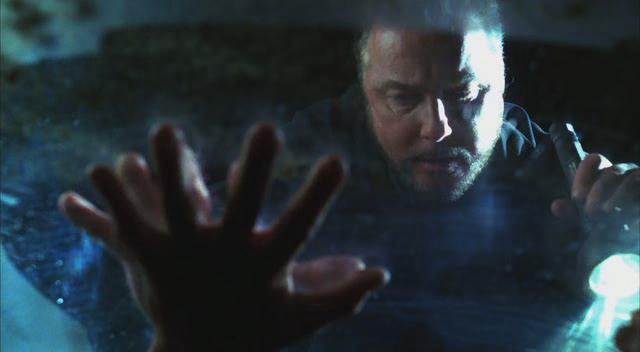
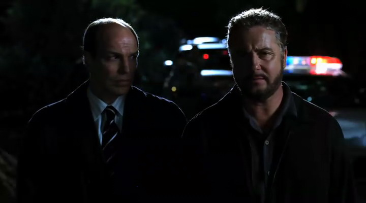

"Okay，" Grissom说完，第三次合上他的电话。"Ecklie调派了所有可能的CSI，Brass几乎调动了所有警力。我们要彻查那个苗圃。大家都准备好了么？"

大家都匆忙跑去拿外套和工具箱。当Catherine准备冲出屋子时，Archie拦住她。

"拿上这个，" 他说着往她手里塞了一件电子设备。"这个能查到那个网络摄像头的发射器。发射器应该就在Nick头上。如果你们跟着信号，就能找到他。"

"Thanks, Arch," 她说，"我们一找到他就给你打电话。"

他点了点头，"好运。"

她也点点头，然后跟着其他人跑了出去。

*************

很不可思议的，没人商量该由谁来开车，或者谁和谁同乘。Grissom和Warrick各自坐进一辆部门属Denali的驾驶席；Sara坐进Grissom车子的副驾驶；Greg跟着她坐进车子的后座。而Catherine则坐到Warrick身旁。

Grissom拿起他的手机，按下无线通话按钮，"这里是CSI Grissom。大家都准备好出发了么？"

异口同声的回复声从他手机话筒里响起。点了点头，他打开警灯拉响警笛，带着大队人马开出停车场往苗圃的方向驶去。

在他们紧张地驶向苗圃的路上，SUV里没人讲话。大家都不想说话。Sara发觉自己的右脚一直死命踩着地板，就好像这样能让Grissom开得更快些似的。

终于，Grissom总算是把车开到了苗圃。他在苗圃主人身旁刹住车，而对方为则他们打了大门。Grissom, Sara和Greg几乎不等车子停稳就跳下来。

"你在电话里说你这里有个火蚁蚁丘；在哪儿？" 他问那个男人。

"我通常都离那个东西远远的。" 苗圃主边说边带他们往蚁丘走。

他带他们来到一个大型蚁丘附近。Grissom看了一会儿，确认了这就是他看到的爬满可怜Nick身上蚂蚁源头。

"好了，听着，" 他指挥着，"大家散开，找到松动的土壤——任何看起来最近被挖过的痕迹。"

"整片土地啊。" Brass低声说道。

Grissom看了他一眼，没有出声。

Sara慢慢在两排树木间走着，心里想给那些在苗圃里跑动的警察两巴掌。如果只是跑，那找得到什么？他们不知道应该怎么找么，就像Grissom教他们的那样？

"Hey！" Catherine的喊声打断了Sara的思绪，"我检测到那个网络摄像头的发射器了！"

Sara跑起来。只一会儿，她就追上了Warrick，Greg还有一群警察。他们跟着Catherine，顺着她走的方向分散开搜索起来。

"在这儿！" 她喊着，"我找到了！在这儿！我找到了！"

Sara, Grissom, Greg, Warrick和Brass都穿过苗圃冲向她。当他们跑过来时，看到她找到了一根显然是给Nick输送空气的管子。

"Nick！" 她朝管子里喊，"Nick，我们在这儿！撑住，Nicky！"

"我们需要铲子！" Warrick喊着。

一辆警用SUV朝他们开过来。两名警察跳下车并打开后舱门，拿出几把铲子。Warrick接过他们递过来的第一把铲子开始挖起来。几名警察也拿起工具过来帮他。Sara站在Grissom身边，看着他们显得极其缓慢的工作。

"咱们找到他了，" 她低语着，"他真的会没事的。"

Grissom看了她一眼，还是没有出声。直到他亲眼看见Nick，直到医护人员宣布他没事，他都没法觉的安心。没结束呢——还没结束。

"我挖到什么了！" Warrick叫起来。

"我们找到你了，Nicky。" Catherine喊着，希望她的声音能到传那箱子让Nick听见。

Warrick丢掉手里的铲子，开始用手刨开沙土。Sara看到那个他们一直从监视器上盯着看、而且仿佛看了一辈子的树脂玻璃时一颗心都提了起来。

"Hey！" 当Warrick看到Nick的脸时他喊起来，"Hey！我们找到你了，man！Hey！ Nicky！ Nicky！Hey，撑住！Hey！" 但Warrick的声音里突然充满一丝恐惧，"把它放下！把它放下！我们找到你了。我们会把你救出来的。撑住！" 他往身后看去，"我们需要灭火器！给我一个灭火器！"

Sara觉得眼眶里又有泪水涌出来。Nick正把手撑在箱子盖儿上，擦掉妨碍他看清Warrick的雾气。她走近了些去看他，需要知道他还好，然后看到他放低了手里的枪，很明显在Warrick喊他之前他正用枪抵着自己的下巴。他现在正含着泪朝Warrick点头。Sara稍稍退了回来。这一次，她再也抑制不住地抓住了Grissom的的胳膊。他看向她，自己眼中的恐慌也开始缓解。

Greg拿着一个灭火器朝他们跑过来，然后Sara悄悄松开了Grissom。他们都往前靠了靠，准备随时提供支援。

Warrick用铲子撬开了箱盖儿的一角。

"一下一下喷，Greg，" Grissom在他走过去用灭火器消灭蚂蚁时提醒道，"别让他窒息。"

于是Warrick用铲子掀着箱盖儿的一角，Greg开始用灭火器一下下朝箱子里喷射泡沫。碰到泡沫的蚂蚁都死掉了，稍稍缓解了Nick的痛苦。

"撑住，buddy，撑住，" Warrick一边说一边和Greg挪到Nick的脚边重复着手里的动作，"你就快能出来了。"

"叫医护人员！" Sara喊着。

Greg和Warrick终于完成的他们消灭蚂蚁的任务。

"Okay，咱们来吧。" Warrick说。

Sara，Greg和Barss都跳下土坑来到他身边。几乎没人注意到Catherine正接起一个电话，并因对方的话而面露恐惧，他们各抓了盖子的一角，正准备掀起来救出Nick。

"大家都离开那个坑！" Catherine一边把手机从耳边拿开一边喊着，"那箱子会爆炸！"

"你在开玩笑吗？" Warrick喊起来。

"现在快离开那儿！" Catherine喊道。

Greg和Brass都退开了，但Sara和Warrick还在那里。

"我不要离开Nick！" Warrick也喊道。

"箱子下面有机关。" Catherine绝望地说。

Sara抬头看向Grissom，看到真真正正的恐惧又回到他眼中。她回想起当他去见Nick的绑架犯时自己是什么感觉。她不能这样对他——她不能让他经受这样的折磨。于是她慢慢退开，感到自己为Nick而心碎。

"我不要留下他。" Warrick喊着。

"Warrick, Catherine说的对，" Grissom命令道，"马上从那坑里出来。"

Warrick用一副好像他疯了似的表情看着他。

"我知道该怎么办，" Grissom继续说，"相信我。"

Warrick看了看Nick然后慢慢站起来。而Nick开始尖叫，开始用手捶打箱盖。

"我们马上需要两百磅的土，用挖土机搬过来。" Grissom喊着。

几名警察马上跑开照他说的行动起来。

"Help！" Nick绝望地喊着，用手拍打着箱盖。

Grissom跳进土坑里。他为了看清Nick用手扒着箱盖上的土。他看起来正在发抖并完全失去了冷静。

"Nick！" Grissom喊着，"你听得见我吗？"

Nick仍然抽泣得浑身发抖。

"我们要花点儿时间救你出去，okay？" Grissom解释着，"Nick！"

但这时Nick已经有些歇斯底里，听不进任何Grissom说的话。Grissom知道得用什么方法让他回过神来...他想起Nick的父亲在看网络直播时说的话...

"Pancho!" Grissom喊道。

Nick立刻不再哭喊，尖叫，发抖了。他只是惊讶地看着Grissom。

"听我说！" Grissom一边喊，一边把自己的手掌平拍在箱盖上。"把你的手放到我手上。"

慢慢地，Nick抬起胳膊把自己的手掌放到Grissom手掌的正下方，他的眼睛盯着Grissom的脸。

"Good。" Grissom说道，为Nick终于找回注意力而松了口气。他开始用平静而温和的声音说道，"现在，听我说。箱子下面可能有炸弹。"

Nick在完全听懂Grissom的意思后把头躺了箱底。

"炸弹可能是靠压力启动的，" Grissom继续用温和的声音说道，"我们把你拉出来之前需要填补你身体的重量，okay？Pancho，如果你听懂我的意思了就点点头。"
 
慢慢地，Nick点了点头。

Grissom直起身子看了看其他人，"Okay，我们用挖土机铲土过来平衡他的体重。" 他转过头看了看Sara，"我需要一根绳子一个登山扣。"

Sara在他把头转回去之前就跑了起来。

Grissom又转回头看向Nick，再次把手掌贴在箱盖上。Nick立刻把手放回到他手掌下方。

"All right, Pancho," Grissom说，"我们要打开箱盖救你出来。但是，我要你躺好。Okay？否则会把咱们都炸飞的。你明白了吗？"

Nick虚弱地点了点头。

"你保证会躺好吗？" Grissom问。

Nick又点了点头。

"Pancho，说'我保证'" Grissom命令道。

"我保证。" Nick呜咽着说。

Grissom抬起视线朝正在自己上方踱步的Warrick点了点头。Warrick马上跳进坑里。这时Sara带着Grissom要求的绳子和登山扣跑过来。Catherine和几名警察引导着挖土机朝他们开过来。Warrick和Grissom都把手插进箱盖下面。

"别动。" Grissom提醒道。

他们抬起盖子，然后Grissom立刻把一只手放到Nick胸口上。而Nick抽噎着抓住Grissom的手臂。Warrick也朝下伸出手，Nick马上用另一只手抓住了他的。

"我抓住你了，" Warrick柔声说到，"安静躺好。安静躺好。没关系的。没关系的。"

"Okay，" Nick轻声说，慢慢能控制住自己的情绪了，"Okay。" 他开始做深呼吸，试着让自己不再颤抖。

"好了，开过来。" Grissom招呼那些指挥挖土机的人。

Sara跳进坑里来把登山扣扣在Nick的皮带扣上。Grissom抓住她系在扣上的绳子并朝后拉起来。Catherine, Greg, Sara, Warrick, Brass还有其他一些警察都站在他身后拽着绳子，准备一起用力。

"Okay, Pancho," Grissom叫道，"我要你闭上眼睛屏住呼吸。"

Nick点点头照Grissom说的做了。

"Now!" Grissom大喊。

挖土机把铲斗里的土往土坑里倒下去。

"Ready?" Grissom又朝站在身后的众人喊道，"Go!"

所有拉着绳子的人都往后拽起来。Nick被绳子拽得从棺材里飞出来。紧接着箱子就爆炸了，不过成功被倾倒下去的泥土镇压住了。Nick趴倒在地上，颤抖着。

Warrick, Grissom和Sara立刻跑向他，甚至赶在了救援人员前面。Warrick和Grissom轻轻把Nick的身体翻过来让他躺在地上。而Sara用手指梳理着他的头发。

"Oh, Nicky。" 她叹息着。

救援人员跑过来，毫不客气的把CSI们赶到一旁。他们把Nick抬上轮床，把他推到已经等在一边的救护车上。再一次的，无需商量，大家知道该由Catherine和Warrick陪同他去医院。他们跟着他爬上救护车，在EMT关上车门时握住他的手。

Sara站在Grissom和Brass之间，看着他们渐渐远去。她只想跟他们一起去，但那里不再有自己的位置。Nick已经不是她的组员了。造成这种状况的主因Ecklie，正脸色灰白地站在Grissom的另一侧。

Grissom重重呼了口气。一直盯着远去的救护车，对Ecklie说。

"我想要回我的人。"

Ecklie看了看他，但没有说话。

Grissom转向Sara和Greg说，"Come on. Let's go."

"咱们去哪儿？" Greg问。

"去医院，" Grissom答道，"咱们得去陪着Nick。"

"但是，这个现场..."

"白班的人会负责，" Ecklie接口道，"现场还是由你们负责。但我会让他们今晚接下手。"

Grissom转向他点了点头，"Thanks, Conrad."

他也点了点头，"替我跟Nick和他家人问个好。"

"我们会的。"

*************

他们仍是默契地不需要开口决定谁来开车。只不过这次是Sara坐上了SUV的驾驶席。Grissom坐到她旁边的副驾驶上，而Greg仍是坐在后座。

去医院的一路上谁也没有说话。Sara只是偶尔瞥一眼Grissom或往后看一眼Greg。两人都没看她——至少她没有看到。

他们终于到了Desert Palm。Sara把车停到访客车位，然后他们爬下SUV。想也没多想，Sara在他们走过停车场的时候拉住了Grissom的手。他有些吃惊地看了看她，但是没把手松开。当意识到自己的动作时她自己也吓了一跳。为了掩饰自己的行为，她把另一只手伸向Greg。而他也用力地拉住了她的手。

走到前门时他们放开了各自的手——他们没法三个人肩并肩地通过大门。Grissom帮Sara打开大门；他和Greg待她通过后跟着走进去。一个接待员朝他们笑了笑。

"有什么可以帮忙的么？"

"我们在找急诊室。" Sara说。

接待员说了一个Sara感觉自己绝对找不到的方向。她静静站在那里盯着她看，犹豫是再问一遍还是自己试着找找看。而Grissom直接抓住她的胳膊把她往左带。

"你听懂了？"她低声问。

"Yes，" Grissom说，"Let's go.。"

他带他们来到医院急诊室的等候室。Catherine和Warrick已经在那里了。

"你们来啦。" Catherine看到他们后开心地说。她跑过来紧紧拥住Grissom。

Warrick跟着她走过来，拥住了Sara。她也紧紧抱了他一会儿。

"他怎么样了？" 她稍稍后退了些问。

"医生还在检查。" Warrick说。

"你们给他父母打电话了么？" 他们穿过屋子往座位方向走时Grissom问。

"Yes," Catherine答道，"他们在路上了。"

Sara站在Grissom和Greg中间。她只想抓着Grissom的手靠在他肩膀上，但她只能站在那里。现在还不是时候，她不能在这里...

好像过了很久很久。Nick的父母赶到了，这让他们感到更加紧张。他的母亲一走进等候室就开始掉泪。

"Nicky在哪儿？" 她问。

"医生还在做检查。" Grissom说。

她点点头并在Catherine身旁、Grissom对面坐下。她丈夫坐在她另一边。

"在哪儿找到我家Nick的？"他问。

"他被埋在一个苗圃里。" Grissom答道。

"一个苗圃？" Mrs. Stokes茫然地问，"你们怎么找到他的？"

Grissom看了Catherine一会儿，然后看回Stokes夫妇，"我们跟着证据走。"

值得庆幸的是，这个回答对他们来说已经足够了。Grissom不觉得听到他们如何把Nick从被埋的地狱里救出来的整个过程他们还能受得了。

"Excuse me," 这时一名高个医生走过来，"你们是Nick Stokes的亲属么？"

他们整齐划一地站了起来。然后医生朝他们笑了笑。

"我是Dr. Edwards，" 他说，"Nick到这儿后一直是我负责的。我肯定你们很乐意听到他会康复的消息。"

"Oh, thank God."

这次，Sara终于忍不住抱住Grissom。他也回抱了她，只是忍耐着不让自己在她的太阳穴上烙下一吻。他们退开来，然后Grissom拥抱了Catherine，Sara抱了抱Greg，又拥住Warrick。

"我们能见他么？" Catherine含着泪问。

"现在只能有两位访客，" Dr. Edward提醒道，"他正在办入院手续，只要安排了他的床位，你们就都可以去看他。不过，现在在ER，我们只能允许两位探访者。"

CSI们都退后了些，而Stokes夫妇则含着泪跟着医生进到Nick的房间。

"Thank God," Catherine喃喃说着擦掉眼泪，"Thank God."

"Hey," Warrick有些担心地看着她。

Catherine看了他一会儿，然后把脸埋在他肩头。而他伸手环住她。

"都过去了，" 他轻声道，"都过去了。"

Catherine控制住自己的情绪后看向其他人，"咱们该怎么办？要等着见Nick么？还是先回去，让他跟家人在一起。"

就好像来回答她的问题似的，Dr. Edwards又回到了等候室。

"我们会把Nick转到1039房间，" 他说，"如果你们想上楼，那边的护士会告诉你们什么时候可以见他。"

大家又动作一致地从座位上站起来并走向电梯。

*************

他们到达Nick新病房的楼层后又等了一会儿，可想而知，Nick的父母会想要和他多待一会儿。终于，他的父亲来到等候室叫他们去跟Nick打招呼。

Nick看起来疲惫万分。不过他还是朝他们笑了笑。

"我想谢谢你们大家，" 他轻声说，"你们救了我。"

"Oh, Nicky," Sara叹息着。

"我说真的，" 他说，"我知道你们有多努力找我，而且把我救了出来。要是没有你们..."

"不许这么想，Nicky，" Catherine有些严厉地说。

"Okay," 他说，"只是...谢谢你们。"

Grissom弯腰碰了碰他的手，"好好休息，Nick。你能回来之前我们会搞定手里的案子的。"

Nick朝他们笑了笑，然后轮流看了看Warrick, Greg和Sara，"我不在的时候别动我东西哈。"

Greg咧嘴笑了笑，"Well，我都没想到，不过现在既然你提起来了..."

Warrick笑了笑，"别担心，Nicky。我会看着Greg让他离你柜子远点儿的。"

"你要保重，Nicky，" Sara轻声说，她俯身亲了亲他的前额，"我们等着你。"

Nick朝她笑了笑，"Thanks, Sar。"

大家一个接一个的叮嘱了Nick并和他告别后离开屋子。最后只剩下Grissom。

他笑着靠近了些，再次把手放到Nick手上，"我为你骄傲，" 他轻声说，"一直如此，从你一开始来就是。还有，Nicky，我要你知道你从没让我失望过。"

Nick抬头看着他，一脸惊讶。慢慢地，泪水涌上他的眼眶，"Thanks, Griss，" 最后他低语着，"Thanks."

Grissom拍了拍他的手，"赶快好起来，Nicky。"

"Yeah," Nick轻声应道， "Yeah."

Grissom最后一次朝他笑了笑，然后也走出屋子。大家都站在楼道里咧着嘴笑。Grissom觉得感同身受。

"再次看到Nick感觉很好，对吧？" 他说。

"实际上，Griss，这不是我们笑的原因。" Greg笑着说。

"Oh?"

Sara完全大笑起来，"我们刚意识到咱们得坐一辆车回实验室去。"

Grissom听了也笑起来，"那，咱们看看怎么办吧。"

*************

挤了一路，他们终于回到实验室。放好各自的工具和带回来的设备后，他们互道了晚安并准备离开。和平时不太一样——他们在互相拥抱、握手后才离开。

最后，只剩下Grissom和Sara。他温柔地看着她。

"你能跟我回家么？" 他轻声问。

Sara点点头。这也是个她不想独自度过的夜晚。

为了做表面功夫，他们各自开车到了Grissom家。Sara把车停到他车子旁然后下了车后，见他正在一旁等着她一起进屋。一等她靠近，他就拉起她的手。

在走进屋锁上门之前，两人都没说话。Grissom放下钥匙并把两人的外套挂进衣柜。然后，吓了Sara一跳，他突然用力抱住了她。她同样紧紧拥住他，觉得泪水不受控制地涌出来。这次，不用再费心去抑制自己了。她站在那里抱着他呜咽起来。

"Hey，" 他用手轻抚着她的头发低语着，"没事了。现在都结束了。Nick没事了。"

"我知道，" 她抽泣着，"Oh, God，Griss,太可怕了。这太可怕了。"

"我懂，" 他喃喃地说，"我懂。"

Grissom等到Sara哭得不太凶后，带她来到沙发旁。他们一起坐下然后他用手搂住她。

"好些了么？" 他问。

"Yeah，" 她哽咽着说，"这事从头到尾...都太可怕了。我从没这么害怕过。"

"我知道，" Grissom说着把她搂得更近了些，又说，"Sara，我想要跟你道歉。"

"为了什么？"

"为了我去见那个绑架犯。"

Sara扭过头看着他，"什么意思？这不是好事么。这让我们找到了Nick。"

"Yeah, 但是…"

"但是，什么？"

"我知道我离开的时候你很害怕，" 他慢慢开口，"但直到你后来跳到那个土坑里，而且Catherine说箱子底下有炸弹的时候我才意识到那是多可怕的事。" 他颤抖了一下，"God, Sara，要是你在上面的时候箱子爆炸了..."

"Shhh," 她说着把一根手指放到他嘴唇上，"没有爆炸。我很好。我就在你身边。"

他笑了笑然后亲了亲她的太阳穴，喃喃道，"Thank God。"

两人静静地拥在一起坐了一会儿，都陷入沉思，庆幸两人能相互陪伴。最后还是Sara打破了沉默。

"你知道么，Griss，在医院的时候..."

Grissom看着她，对她声音中的紧张感感到困惑，"怎么了？"

"我只是..."

"只是什么？"

"我需要你。"

"Sweetheart，我就在那儿呀，" 他皱了皱眉说，"我就坐在你身边。"

"No, 那是 …"

"是什么?"

"God, Gil，我太想碰你了，" Sara急切地说，"我想要拉着你的手，或者抱着你，或者...我看见Catherine把头放到Warrick肩膀上，然后我觉得超嫉妒。"

"嫉妒?"

"Yes！我嫉妒她可以那样做。而且，她可以那样做因为他们之间没什么。他们不需要担心他们每次相互碰触会被炒鱿鱼。"

"Sara，咱们开始这段关系的时候就知道会这样了，" Grissom说，"咱们现在这样...违反了部门的条例。" 他把环住她的手臂又收紧了些，"不过，Sara，" 他继续说着，声音近乎耳语，"我宁肯不在工作时碰你，拥有这段感情比只是作为你的boss、比能当着Greg的面抱你一下强多了。"

Sara轻轻颤抖了一下然后转过头面向他，"我同意。" 她承认道。

Grissom微微笑了笑，然后倾身过去亲了亲她。Sara抵着他叹息着，让自己的舌尖滑入他的嘴里。Grissom往后躺下去，同时把Sara拉倒在自己身上，继续热情地吻着她。

最后，Grissom终于停下来然后又笑盈盈地看着她。Sara也朝他笑着，把头枕在他胸口上。

"咱们能不能就永远这么待着？" 她问。

她感觉到Grissom轻声笑起来胸口的振动，"可以啊。不过，我觉得咱们可能终究会觉得肚子饿。"

Sara笑了笑，"你说的有道理。"

"Sara?"

"Hm?" 她稍稍抬起头看向他。

他咬了咬嘴唇，"今晚你能留下来陪我么？" 他问了在Desert State那件案子后她问他的那句话，"我...我想确定你就在我身边。"

Sara点了点头，"Yes."

他笑了笑，"Good。我带你上床去。"

Sara咯咯笑起来，"真是耐人寻味。"

"Oh，你知道是什么意思。"

"Yeah," 她笑了笑， "我懂。"

他们从沙发上站起身，然后Grissom拉着Sara的手带她来到他的卧室。他把床罩掀起来然后看了看她。

"嗯...如果你愿意，我可以借你一件T恤睡觉穿。"

Sara点点头。"好。"

Grissom从抽屉里拿了件柔软的棉T恤递给她。

所有的矜持仿佛突然都消失了，Sara脱掉她的牛仔裤和衬衫然后穿上了Grissom的T恤。感觉自己好像回到了15岁参加健身课，她在T恤下面解开内衣然后把内衣从袖口拉出来。Grissom十分着迷地看着她。这让她忍不住咯咯笑起来。

"觉得别扭？" 她问。

他摇摇头，"大开眼界。" 他老实说道。

Sara有些脸红地问，"哪方面...?"

"脱下来的时候。"

Sara爬上床的时候，Grissom把自己的衣服脱到只剩下内裤。然后他也爬上床躺倒她身边，并伸手把她捞过来。她依偎着他，把他的胸口当成枕头。然后他低下头吻了吻她的头顶。

"Sara?"

"Hm?"

"谢谢你留下来。"

她困倦地抬头看着他笑了笑，"这儿才是我该在的地方，Gil。你不觉得么？"

"是。" 他笑了笑，用手臂把她搂得更紧了些。