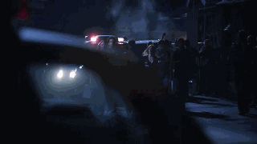

"咱俩今晚能一起吗？" Sara拿起她的手包问。

Grissom难过地笑了笑然后摇了摇头，"直到咱们组重组都不能吧，到时候就不那么明显了。"

她笑着抱了抱他，"我很擅长隐藏行踪。"

"我知道你擅长，" 他笑着回抱了她，"但是，Greg就发现了..."

"那是Greg自己太聪明了。"

"我知道。"

Sara笑着探身亲了亲他，"下班后见？"

"嗯，一上班你就能看见我。"

"你知道我是什么意思。"

"好啦，我知道。" 他笑着又亲了亲她，"路上注意安全。"

"你也是。"

Sara终于离开她男友并准备离开，在大门口她停下来拍了拍Hank以示告别。然后她钻进车子，面带笑容地开车往实验室去。

刚走进实验室她就是听到一声尖叫。她吓了一跳，然后循着声音来到DNA实验室，看见Mandy正在拥抱Mia。她皱了皱眉走进屋子。

"Hey, guys," 她说， "你们还好吗？"

"可不止还好，" Mandy咧嘴笑着，"快告诉她，Mia。"

Mia带着有点儿害羞的表情笑了笑，"我订婚了！"

"Mia！" Sara叫起来，"我甚至不知道你有男朋友！"

Mia听了大笑起来，"Well，和在这里工作的一些人不一样，我可是努力保护自己的隐私的。"

Sara一下子感到一阵发冷，不过Mandy和Mia都大笑起来。

"Hodges," Mandy朝一脸疑惑的Sara笑了笑并解释道，"如果我们必须再听一个他和姑娘约会的故事..."

"我打赌都是编的，" Mia说，"他一定是觉得这样显得自己很有趣。"

Sara终于笑出来，"我觉得对我来说还好，因为我不像你俩老能见到他。"

"Yeah，总是狭路相逢。" Mandy咧嘴笑着承认，"Mia，给她看看你的戒指！"

Mia马上笑逐颜开地伸出手，让Sara可以欣赏她那引人注目的宝石戒指。

"真好，" Sara咧嘴笑着说，"什么时候婚礼？"

"Well…"

Sara皱了皱眉。

"Look，别告诉别人，因为我还没跟Grissom说，不过实际上我要搬走了。"

"去哪儿？" Sara问。

Mia咬了咬嘴唇，"Minneapolis。"

"Minneapolis！" Sara和Mandy异口同声地叫起来。

"Jason在那儿生活，" 她解释道，"几个月以前他在那边找到了工作然后搬去那边了。我们一直是远距离恋爱，但是...嗯，现在我们要结婚了，我也会搬去那边。"

"什么时候？" Mandy有些难过地问。

"今晚我就去交两周内离职的申请。"

"Oh，Mia，我真的会想你的。" Mandy叹道。

"我也会想你的，" Mia说，"就只有这点挺难过的。" 她看了看Sara，"你知道Grissom来了没？"

Sara朝走廊里瞥了一眼正好看见他走进办公室，"Yeah，他在那儿呢。刚进办公室。"

Mia深吸了一口气，"祝我好运吧。"

Mandy又拥抱了她一下，"我真的替你高兴，Mia。"

Mia笑了笑说， "Thank you."

她说完走出了DNA实验室，剩下Sara和Mandy看着对方。

"你会这样做么？" Mandy问。

"我会做什么？"

"你会为了男人搬去另一个州吗？"

Sara笑了笑，想起那个要她离开California来Nevada的男人。"Yes。"

Mandy吃惊地看着她，"你都没犹豫一下！"

Sara引用了Sofia的话，"有时候，你必须遵从你的内心所愿。"

*************

Grissom在沙发上横躺下来，享受着这几分钟的独处时光。Sara还有一刻钟左右就来了，而他想充分利用自己独处的时间。显然，指的是独占整条沙发。

不是说他不希望Sara来他家。不是说他不想和她一起窝在床上，感受着她在自己的身边然后慢慢睡去。也不是说他不想在她身旁醒来。他真的很喜欢和她在一起。

只是，很多年来他都是一个独居者。让他放弃自己部分的自由不是件容易的事。

然而，他没法告诉她。这会毁了他们一起构筑的所有东西。No，他得对此保持沉默。他得习惯和她分享自己的时间和空间。

毕竟，这就是恋爱不是吗？学会妥协？

一阵敲门声打断了他的思绪，于是Grissom从沙发上坐起来去迎接Sara。打开门就见她笑盈盈地站在那里。进了屋，她马上探身亲了亲他。

"Hi。" 她笑了笑。

"Hi。" 他一边回答一边把她身后的大门关上。

"Mia告诉你她的大新闻了？"

他笑了笑说，"她说了。我为她高兴。"

"我也是。" Sara说着叹了口气，"Minneapolis，是吧？我会想她的。"

"我们都会，" Grissom答道，"我答应推荐她去那边的实验室。我肯定她会很快适应的。"

"她会的，" Sara一边说一边和他一起坐到沙发上，"她在哪儿都会做得很好。"

Grissom点点头表示同意，"不知道Greg对她离职会有什么感想。"

Sara皱了皱眉，"我知道他俩是朋友，不过没觉得他们那么铁啊。"

Grissom笑了笑，"我不是这个意思。要是在她走之前我们找不到继任者，他就得去代班DNA实验室啦。"

Sara大笑起来，"Oh，yeah。他会喜欢这点的。"

Grissom和她一起笑起来，"Well，至少在他发现之前我们还有些时间。Mia还没跟所有人宣布。"

"也许他没机会发现呢。也许你能及时找到继任。"

"Well，我会努力的。"

*************

Mia直到之后部门周例会才正是向实验室的其他人员宣布自己订婚的消息。Catherine为她的好消息感到激动，和Mandy、Sara的反应一样从椅子上跳起来拥抱了她。Warrick和Greg也马上送上自己的祝福。其他人则等到会后过去拥抱她，并赞叹她的戒指。Grissom模模糊糊地猜想，大家可能是怕如果在会上太明显地去祝贺Mia会惹自己不高兴。

"Okay，各位，就这样了，" 他最后说，"我知道大家都很忙，所以..."

听了这话，组里的人开始陆陆续续往外走。Catherine和Warrick最先离开。尽管严格来讲到今天为止他们还算是中班的人，不过他们和Grissom都觉得他们和未来的组员一起开会没任何问题。

Sara和Greg跟着Catherine和Warrick也离开了。他们手上还有一个没结的凶杀案调查，希望今晚能够搞定。实验室的技术人员也相继离开，最后休息室里只剩下Grissom。

幸好还没有新的电话打进来找他，所以他把自己关进了办公室。在为他的小组马上就能重组而兴奋的同时，他也很头疼因此而产生的大批文书工作。他肯定得花8个小时以上在实验室来处理这些东西了。除非又有新案子，他希望能在10个小时之内能下班。

*************

就在Grissom在这堆文书上花了一个小时又一个小时之后，他的电话响起来。轻轻摇了摇头，他瞥了一眼时钟。他已经工作了将近11个小时了。

"以希望为生的人,将绝食而死'，" 他轻声引用着富兰克林的话，然后拿起电话贴在耳朵上，"Grissom。"

"Hey，" Sara说，"我现在正要回家。你几点能过来？"

Grissom忍住了没叹息出声。他瞥了一眼紧关着的办公室门，安慰自己不会有人听见自己的声音。"听着，Sara，我现在正在处理报告的地狱里。小组合并有很多程序。"

"Oh，" Sara说，"Well，那你什么时候弄完过来都行。"

"No，Sara，你没听明白，" Grissom的话里透着些许挫败感，"我还得再干好几个小时。我不想吵醒你。今天我就回自己家了。"

"Oh."

听到她失望的声音Grissom在内心暗骂自己。他没权利把自己对文书工作的挫败感强加到她身上，"Sweetheart，别难过。我不是..."

"没关系的，" Sara很快回答，"我只是...我们班儿上见吧。"

"好。还有，下个轮班开始，咱们就能再在一起工作了。"

"有道理，" 她开心地说，"Well，look，好好写报告吧。上班见啦。"

"睡个好觉。"

"你也是。"

Grissom挂上电话然后盯着它看了一会儿。一边痛恨自己让她失望，并且痛恨还要工作好几个小时，他同时又不可自制地觉得松了口气。想到能在自己床上睡觉感觉...挺好的。

有些时候，他只需要要些时间留给自己。

*************

Sara在起床上班的闹铃响起之前就醒了过来。她几乎是带着大大的笑容从床上跳下来。尽管这是她近一个月以来第一次没有Grissom陪睡，她还是觉得不可思议的快乐和兴奋。

Catherine和Warrick回到夜班。Nick也回来上班了。再过短短几小时，大家就又能在一起了。

轻声哼唱着，Sara去浴室冲了澡。她等不及去实验室了。

*************

显然，她不是唯一一个对工作跃跃欲试的。一走进更衣室她就看到Nick正站在那儿，把他的ID别在腰带上。Sara尖叫了一声然后跑过屋子冲进他的怀抱。

"Hey, darlin'," Nick咧嘴笑着紧紧抱住她，"想我了？"

"Oh，太想了，" 她叹道，"你回来太好了。"

"回来的感觉太好了，" Nick放开她笑着答道，"我简直不敢相信Grissom重组了咱们组。"

"我知道，" Sara咧嘴笑着，"这太牛了是吧？"

Nick摇了摇头，"我永远想不到他是怎么跟Ecklie谈的，不过，真高兴他这样做。这是最棒的 '欢迎回来' 的礼物。"

"Hey, Nicky!"

Nick和Sara都回过头看着Warrick走进更衣室，脸上带着大大的笑容。

"Hi, Warrick," Nick咧嘴笑着打招呼。

Warrick拍了拍Nick的后背，"你回来太好了，兄弟。"

"回来真好，" Nick答道，"兄弟，我简直不敢相信我有多想这里——还有，我有多想你们大伙儿。"

"我们也想你，" Sara说着又抱了抱Nick。她又朝Warrick笑了笑，"想你们大家。自从你们离开后夜班也不一样了。"

"你是说，自从我们被迫离开，" Warrick大笑着说，"我想我们那会儿没啥可选的余地。咱们的恶魔主管助理可是好生料理我们。"

Sara摇了摇头，"Ecklie太差劲。"

"基本上是。" Warrick边同意边又大笑起来。

"Hey, guys, Ecklie刚走过去，" Greg边说边走进更衣室，"他看起来不太高兴。"

Sara和Warrick害怕地对视一眼。

"Oh，no，" Sara脸色发白地说，"我们只是——"

"咱们搞砸了。" Warrick咕哝着。

Greg这时开始大笑起来，"Gotcha！我走进来听见你们说啥了。"

"Greg，这一点儿也不好玩儿！" Sara叫着打了他胳膊一巴掌，"我心脏差点儿停跳了！"

"老弟，你刚害我少活十年。" Warrick捂着脸摇了摇头。"不过，这招挺厉害。你确实骗到我们了。"

Nick轻笑起来，"工作时间你俩最好还是小心点儿别乱说话。"

"Yeah，" Sara说着重重咽了下口水，"我以为我吸取教训了..."

想到Ecklie可能会找到的开除她的各种理由，她摇了摇头，然后看了一眼手表。

"咱们最好该走了，guys。咱们不想小组重组第一天就迟到吧。"

于是众人笑着跟着她往休息室走去。

"Oh, hey, 你们听到好消息了么？" Greg问。

"什么好消息？" Sara问。

Greg咧嘴笑起来，"猜猜谁回来了？"

"Nick？" Warrick说着朝Sara眨眨眼睛。

Greg翻了翻眼珠，"Sofia！"

"Sofia？" Sara和Warrick都吃惊的问。

"Sofia？" Nick则一脸困惑地问，"她去哪儿了？"

"Colorado," Sara答道，"她回来了是什么意思？"

"她刚转回咱们这儿的警局了，" Greg说，"她现在是警探。"

"真的？" Warrick问，"那要祝她好运了。我肯定她和Brass会合作愉快的。"

"不敢相信她回来了。" Sara说。

"不敢相信她走了。" Nick说。

"Hey，你想念工作，想念出外勤吧。" Warrick咧嘴笑了笑，然后瞥了Sara一眼，"Sofia回来你好像不是很开心啊。"

她努力挤出一个微笑，"Sofia和我有过点儿摩擦，不过她走的时候我们已经是朋友了。当然， 我很高兴她回来。"

"你看起可不是很高兴，" Nick逗她，"你和Sofia之间怎么了？"

"没什么，" Sara叫道，"我为什么就得和她怎么了？"

"嗯，你只是不喜欢看到Grissom和别的女人一起工作，" Warrick开玩笑说，"所以你不喜欢她。"

Sara试图看起来无动于衷，可惜她肯定自己开始慢慢脸红起来。

"Catherine怎么算？" Greg很快接口，并看了Sara一眼。"她不算女人吗？她也和Grissom一起工作，Sara也和她是朋友。"

"Look，你不是想挑拨我和Catherine吧？" Warrick问。

"我为啥要干那种事儿？" Greg漫不经心地问。

"我不知道啊。你刚才还想害我和Sara以为我们要被开除了。我怎么知道你是不是这么没底线？"

Nick大笑起来，"还别说，刚才那太有逗了！"

"就你觉得逗。" Sara说着皱了皱鼻子。

他们终于来到休息室，而Grissom和Catherine已经在等他们了。两人正开心地聊着天，看起来和其他人一样对重组小组感到开心。

"Well，这不是我们组的其他人吗，" Grissom待他们坐下时笑着说，"感谢你们能过来参加今天的排班。"

"Sorry，" Sara代替大家说，"我们聊天儿聊得忘了时间。"

"今天什么任务，Griss？" Nick问。

"你会开心的，" 他对众人说，"今晚咱们都在一起。"

"真的？" Sara眼睛闪闪发光地问。

"是的, 是真的"，Grissom朝她笑了笑说，"一个拖车停泊场发生了火灾，一辆拖车还有煤气管道发生了爆炸。目前为止有两名死者。"

Greg抖了一下，"烧伤致死？"

Sara看了他一眼，想起他上一次处理烧伤受害者的事。

"两人都是当场死亡。" Grissom很快补充道，他知道Greg在想什么。

Greg稍稍点点头，不过他没法掩饰自己眼中的宽慰。

"Okay，" Grissom说，"咱们得出发了；Brass还等着咱们呢。好了，咱们分三辆车去现场。"

*************

和小组全员一起穿过犯罪现场的停车场时，Sara难掩心中的骄傲之情。环顾了一下四周，她知道因小组可以重组而开心地不止自己一个人。

他们大致评估了损坏程度后，Catherine自告奋勇和Warrick开始调查周边。Warrick叫Greg跟他们一起行动；于是三人朝远离拖车的方向走去。而Sara，Nick和Grissom则迈步走向那间移动房屋。

"你想负责里面还是外面？" Sara一边跟上Grissom一边问Nick。

"里面吧。" 他答道。

Sara笑着点了点头。她马上开始检查曾经是拖车前门的区域，而Grissom和Nick往拖车里面走去。

他们刚开始检查了几分钟，Grissom的手机就响起来。Sara皱了皱脸。

"肯定没什么好事。"

Nick大笑起来，"Yeah。也许是Ecklie，因为你和Warrick之前说他坏话所以打电话找Grissom的麻烦呢。"

Sara撅起嘴唇，"你知道吗，也许我们应该让你和Greg一起负责外围。我觉得你俩对幽默的品味有一拼。你俩去当喜剧演员算了。"

Nick听了又大笑起来，这时Grissom挂断了电话。

"有麻烦了？" Sara轻声问。

"咱们又有一桩凶杀案了。" Grissom答道。

Sara一下子沉下脸，"你要派我们去？"

"我会派Catherine的，" Grissom说，"我肯定她会因此爱上我的。" 一边说，他一边开始给Catherine打电话。

"Yeah？" 她接起电话来。

"Catherine，工业区那边有件419，" 他说，"你能去负责一下吗？"

"所以，你重组咱们组的目的就是再把咱们分开？" 她问。"用不用这么变态，Gil？"

"我不是变态。" Grissom肯定地回答。

Sara和Nick对视了一眼，然后迅速转过身，使劲咬着嘴唇以防自己笑出声来。

"Yeah，我会负责的，" Catherine放弃地叹了口气，"我带Warrick过去。"

"Thank you," Grissom说完挂断电话。

Sara和Nick又对视了一眼，这次再也忍不住喷笑出来。Grissom稍稍困惑地皱眉看了他俩一眼。

"有什么好笑的事么？"

"Nothing," 两人异口同声道。

摇了摇头，Grissom往曾经是拖车厨房的区域走去。Sara和Nick最后又对视着咧嘴笑了笑，便各自回去继续工作。

*************

Sara, Nick和Grissom分头勘察现场，努力还原着拖车里到底发生了什么。根据他们在现场的发现，Grissom得出一个结论，那就是一辆汽车在路上开的时候撞上了主燃气管道，然后就如字面意思一样、砰的一下被爆风冲上半空撞上了拖车，并从拖车另一边冲了出来，并造成了这场大火。Nick在听他冷静地解释着"那拖车相当于被汽车穿过了"时一脸震惊。

"飞车吗？" Nick在Grissom得出结论后问道，"咱们这案子是这样的？"

"Mm-hm," Grissom一副只有这样才合理的表情答道。

结果，事实确实如此。是一个住在拖车停泊场附近的人开车的时候睡着了；当他醒过来的时候发现他的车子正飞在天上冲向拖车。

不过，在追查这辆肇事车辆的时候，Grissom，Sara还有Sofia又发现了一件新案子。他们对破坏拖车的蓝色Sunfire发起通缉时，找到一辆违章停了近一周的蓝色Grand Am，并在车子后备箱里发现了两具腐尸。

尽管Sofia认为应该在原地检查这辆车子，不过Sara认为应该把车子拖回实验室以保证证据的完整性并保证其不受污染。Grissom同意了Sara的看法；他们把车门关好并用保鲜膜裹好后备箱，然后把它运回实验室的车库。

"你和Greg负责这个案子吧，" Grissom在开车回实验室的路上对Sara说，"Nick和我对拖车还有些东西要查。"

"我真爱腐尸呀。" Sara挖苦道。

Grissom朝她笑了笑，"Well，我觉得我才是应该对你检查腐尸感到难过的那个。"

Sara觉得有些脸红地朝他笑笑，"别担心。我老板教我用柠檬可以除去那些味道。"

他笑了笑，"那样的话，我可能还会想邀你晚上过来。"

"工作之外咱俩有快一个星期没在一起了，Griss，" Sara叹道，"我知道咱们每天都在一起工作，但那不一样。"

"我懂，" 他边回答边拉住她的手，"我会补偿你的。"

"Oh, really?" 她开玩笑似的说， "怎么补偿？"

"首先，下班以后你来我家，然后我给你做晚...嗯，说做饭恰当一些。"

Sara听了咯咯笑起来，"接着说。"

"再然后，咱们一起看电影，" 他继续说道，"咱们可以窝在沙发上看...你来挑。"

"Okay，" Sara说着，脑子里已经开始想他们该看什么了。

"接着，咱们可能会错过电影的最后20几分钟，因为咱们最后在亲亲我我。"

听到这儿Sara彻底大笑起来，"你能主动想到这些我简直太高兴了。"

"最后，咱们就上床去，" Grissom总结道，"咱们挤在一起入睡，然后在各自那边的床上醒来。"

Sara笑了笑，知道这是通常的展开，不过她补充道，"或者，我可以把你当我的枕头。"

Grissom笑了笑认同她的观点。这可以是他们另一种醒来的方式。

到实验室之后，Sara直接往休息室走去，Greg正坐在那儿写他上一个案子的报告。听到她走进来他抬起头来。

"Hey，" 他打招呼，"你们的蓝色小车找到了？"

"那车引出一件新案子，" 她答道，"拿上工装然后跟我在车库汇合。"

"Whoa，现在，" Greg说，"具体来说我要负责什么？"

Sara咧嘴笑了笑，"在Grand Am后备箱里待了6天的两具腐尸。"

Greg皱起脸，"真美好。"

Sara笑起来，"车库见哦。"

*************

20分钟之后，Sara和Greg开始处理车子的后备箱。Greg忍不住扭过头以躲避迎面扑来的臭气。

"嗯，他们肯定在这儿有段时间了。"

"我告诉你了，" Sara说，"听着，我觉得最好的方法是排干后备箱。"

Greg点点头，"咱们只需要把塞子拔起来。"

"正确的说是：你必须把排水塞拔起来。"

"你认真的？"

"我看起来像开玩笑吗？"

"咱们不能抛硬币吗？" Greg哀嚎着。

"Nope，" Sara说，"这是对你编的Ecklie的事害我折寿好几年的惩罚。"

"Oh, come on," Greg呻吟道，"那都好几天了！那会儿这俩人可能还活着呢！"

"Yeah，" Sara同意道，"但是我记仇。去拿手套。我在车下面放桶。"

一边在心里暗暗不满，Greg去换衣服准备增长自己的经验。回来的时候他已经好好戴上了手套，袖子上也套上了塑胶护套。

"我先声明，现在我真的很恨你。"

"我也声明，这两人的家人会为了你所做的一切爱你一辈子的。" Sara说。

Greg做了个鬼脸。"我想这样会让我好过...一点儿。"

"很好。现在，开始干活儿吧。"

Sara在后备箱旁边坐下来盯着下面的桶，而Greg则在腐尸液中摸索塞子，好让他们受害者的体液能流下来。

"排水塞可能在地毯下面。" Sara建议道。

"我想我找到了。" Greg感觉手指碰到塞子时说。

他轻轻拔了一下，可惜塞子纹丝不动。他开始加大力量，想着越快把塞子拔起来，他就越快能从这滩体液中解放自己的手。

不过他有点儿过于用力了。

他的手和塞子因惯性而甩起来，并带起了一些体液。结果溅到他的脸上和嘴里了。Sara往后跳了一步并震惊地看他抽着气。她往后倾身给他拽了一张餐巾纸。

"理论上说，你吃人了。" 她把纸巾递给他后，他马上擦起嘴来，"Grissom的话会觉得骄傲的。" 她又补充道。

Greg把纸巾从嘴里拿出来说，"Grissom的话会故意尝尝的。"

这么想实在有点儿恶心，Sara转过头去确认体液流得怎么样了。为了不让桶装得太满，她又换上了一个新的。

"起作用了。"

Greg给了她一个早就知道的表情，"Yeah。太——TM——好了。"

"Oh, come on, Greg，" Sara鼓励他说，"你能挺过去的。"

"是啊，" 他说，"这次的经验真棒哈。嗯...你介不介意我去..."

"去哪儿？"

"我不确定，" 他说着站起来，"要么去吐一波，要么去刷牙，或者吐完了再去刷牙。"

Sara咯咯笑起来，"Yeah。去吧。这边我盯着。不过，先提醒你一句，你回来了得检查尸体。"

"那你干吗？" 他惊恐地问。

"我处理车子。"

Greg发出一声厌恶的声音然后往门口走去。"你知道吗，咱们组应该招个新人来，" 他说，"我说的是那种'刚毕业的'那种新人。我可以使唤的那种。"

"Hey，现在你知道不能惹我了？" Sara朝他的背影说。

他在门口停了一下，抬起手并伸出一根手指，然后有往外走去。背后则传来Sara哈哈大笑的声音。

*************

Sara和Greg的案子进展很快，线索一个接一个的跳了出来。结果他俩一直埋头工作，直到两人都累到干不动了才回家休息。

尽管Sara迫切地想要像约定的那样多和Grissom待在一起，但她也知道这事无法如愿。回家的路上她给他打了电话，告诉他自己得回家睡觉，然后他们只能明天上班再见了。

10小时后，她又回到工作中来。她和Greg马上开始继续他们案子的调查。和Sofia一起，他们确定了两名被害者的身份以及枪击他们的凶手。但他们面临的问题是凶手好像凭空消失了似的。

Grissom理解他俩对于不能把这个杀了两个人并把尸体丢进车子后备箱的凶手绳之以法感到相当有挫败感，不过他对他们的调查结果还是表示满意。他告诉他们，这个凶手现在已经被记下背负了两条人命，只要被找到，就能被起诉有罪。

和Grissom开完会，Sara往更衣室走去。她得承认，对于这周第一次能准时下班她还是觉得挺开心的。

她一到更衣室就听到Nick和Warrick的声音。

"So，Sara知道么？" Nick问。

"Sara知道什么？" 她边走进房间边问。

Nick和Warrick两人对望了一眼。而Sara瞥了他俩一眼，打开自己的柜子。

"好吧，别告诉我。反正我也不想知道。"

"这是你的新闻，Warrick，" Nick说，"我可不替你说。"

Sara挑起眉看向Warrick。而他有些窘迫地朝她咧嘴笑了笑。

"我结婚了。" 他说。

Sara听了下巴都快掉了，"What？" 她叫道，"When？"

"上周末。" Warrick说着，露出一副好像抱着糖果罐的小孩子被捉到的表情。

Sara拍了他胸口一巴掌，"你为什么不告诉我们？我们会去参加你的婚礼的！"

"嗯，那有点儿算是心血来潮..."

Sara终于摇着头朝他咧嘴笑起来，"恭喜你，Warrick。" 她激动地伸出手臂拥了拥他。"你和Tina肯定会开心的。" 说完她后退了一步挑起眉抬头看向他，"你是和Tina结的婚，是吧？"

Warrick大笑起来，"是，我是Tina结的婚。"

"我就确认一下。"

Warrick又大笑起来，"你真让我无言以对，girl。"

"Sara，一起来小小庆祝一下吗？" Nick问，"我觉得在Peppermill吃早餐不错。咱们得带这家伙出去庆祝他结婚了！"

"Yeah，必须的！" Sara赞同道，"你跟其他人说了？"

"还没。"

她点点头，"我刚和Greg分开。他正在和Sofia说话，不过我肯定他会加入咱们的。"

"Good。我们去找Grissom和Catherine。"

Sara咧嘴笑了笑，"肯定会很开心。"

